# Event Sourcing

!!! success "🏆 Gold Standard Pattern"
    **Audit Trail & Time Travel Champion** • PayPal, Walmart, Financial Systems
    
    Event sourcing is critical for systems requiring complete audit trails, regulatory compliance, and the ability to reconstruct state at any point in time. Essential for financial and e-commerce systems.
    
    **Key Success Metrics:**
    - PayPal: 350M+ accounts with full history
    - Walmart: 100M+ daily orders tracked
    - Banking: Trillions in compliant transactions

[Home](/) > [Patterns](../patterns/) > [Core Patterns](../patterns/index.md#core-patterns) > Event Sourcing

!!! abstract "📊 Data Pattern"
 Store all changes as immutable events to maintain complete audit history while enabling state reconstruction at any point in time.
 
 **Connected Laws**: Law 5 (Distributed Knowledge) • Law 3 (Emergent Chaos)

## Problem Statement

**How can we maintain a complete, auditable history of all changes while still providing the current state of our system?**

<div class="axiom-box">
<h4>🔬 Law 5: Distributed Knowledge (Epistemology)</h4>

Event sourcing embraces the reality that in distributed systems, the "truth" is not a single state but a sequence of events. Each event represents a fact that happened at a specific point in time, and the current state is merely a projection of these facts.

**Key Insight**: The event log IS the source of truth, not the current state. State is ephemeral; events are eternal.
</div>

!!! tip "When to Use This Pattern"
| Scenario | Use Event Sourcing | Alternative |
 |----------|-------------------|-------------|
 | Audit trail required | ✅ Yes | Simple logging |
 | Complex domain with many state changes | ✅ Yes | Traditional CRUD |
 | Time-travel debugging needed | ✅ Yes | Snapshot backups |
 | Compliance regulations | ✅ Yes | Audit tables |
 | Event-driven architecture | ✅ Yes | Message queues |
 | High-frequency writes | ✅ Yes | Write-optimized DB |
 | Simple CRUD operations | ❌ No | Traditional database |
 | Storage cost constraints | ❌ No | Compressed logging |
 | Real-time aggregations | ❌ No | Materialized views |
 | Small development team | ❌ No | Simpler architecture |


## Solution Architecture


## Implementation Considerations

### Trade-offs

<table class="responsive-table">
<thead>
 <tr>
 <th>Aspect</th>
 <th>Benefit</th>
 <th>Cost</th>
 </tr>
</thead>
<tbody>
 <tr>
 <td data-label="Aspect">Auditability</td>
 <td data-label="Benefit">Complete change history</td>
 <td data-label="Cost">Unbounded storage growth</td>
 </tr>
 <tr>
 <td data-label="Aspect">Debugging</td>
 <td data-label="Benefit">Time travel capability</td>
 <td data-label="Cost">Query complexity</td>
 </tr>
 <tr>
 <td data-label="Aspect">Flexibility</td>
 <td data-label="Benefit">Multiple projections</td>
 <td data-label="Cost">Eventual consistency</td>
 </tr>
 <tr>
 <td data-label="Aspect">Integration</td>
 <td data-label="Benefit">Natural event publishing</td>
 <td data-label="Cost">Event versioning complexity</td>
 </tr>
</tbody>
</table>

### Key Metrics

<div class="grid" markdown>
 <div class="card">
 <div class="card__title">Event Write Latency</div>
 P99: < 100ms
 </div>
 <div class="card">
 <div class="card__title">Replay Performance</div>
 1000 events/sec
 </div>
 <div class="card">
 <div class="card__title">Storage Growth</div>
 ~500 bytes/event
 </div>
 <div class="card">
 <div class="card__title">Projection Lag</div>
 < 10 seconds
 </div>
</div>

## Real-World Examples

!!! abstract "Production Implementation"
 - **Walmart**: Uses Event Sourcing for inventory tracking across 4,700+ stores, processing 1M+ events/sec with complete audit trail
 - **Capital One**: Implemented Event Sourcing for financial transactions, enabling real-time fraud detection and regulatory compliance
 - **Klarna**: Applied Event Sourcing to payment processing, supporting time-travel debugging for transaction disputes
 - **ING Bank**: Uses Event Sourcing for account management, providing complete transaction history for regulatory reporting

## Common Pitfalls

!!! danger "What Can Go Wrong"
 1. **Mutable Events**: Modifying historical events breaks replay and destroys audit trail. Events must be immutable - use compensating events for corrections.
 2. **Missing Event Versioning**: Schema changes without versioning break deserialization of old events. Implement event versioning and upcasting from the start.
 3. **Unbounded Growth**: Event stores grow indefinitely without archival strategy. Implement snapshots and event archival policies.
 4. **Complex Queries**: Direct queries against event store are inefficient. Use projections for read models and complex queries.
 5. **Snapshot Corruption**: Corrupted snapshots require full event replay. Validate snapshots and maintain multiple checkpoint strategies.

## Related Patterns

- [CQRS](cqrs.md) - Natural companion for event-driven read models
- [Saga Pattern](saga.md) - Distributed transactions with events
- [Event-Driven Architecture](event-driven.md) - Events as first-class citizens
- [CDC](cdc.md) - Change Data Capture for legacy integration

## Further Reading

- [Greg Young's Event Store](https://eventstore.com/) - Purpose-built event database
- [Martin Fowler on Event Sourcing](https://martinfowler.com/eaaDev/EventSourcing.html) - Clear introduction
- [Versioning in Event Sourced Systems](https://leanpub.com/esversioning) - Schema evolution guide


#### Key Implementation Considerations

| Component | Purpose | Key Features |
|-----------|---------|--------------|
| **Event Store** | Persistent event storage | - Optimistic concurrency control<br/>- Event ordering guarantees<br/>- Efficient range queries |
| **Snapshot Store** | Performance optimization | - Periodic state snapshots<br/>- Configurable frequency<br/>- Compression support |
| **Projection Manager** | Read model updates | - Parallel processing<br/>- Checkpoint management<br/>- Error recovery |
| **Temporal Queries** | Historical state access | - Point-in-time queries<br/>- Time range analysis<br/>- Audit trail support |


### State Management

Event Sourcing manages state through event application:


### Common Variations

<div class="decision-box">
<h4>🎯 Event Sourcing Design Decisions</h4>

**Event Granularity**:
- Fine-grained: Every field change (complete audit)
- Coarse-grained: Business operations only (simpler)
- Domain events: Meaningful business facts (recommended)

**Snapshot Strategy**:
- Fixed interval: Every N events (predictable)
- Time-based: Daily/weekly snapshots (time-bounded)
- Size-based: When replay takes > X seconds (performance)
- Hybrid: Combine multiple strategies (optimal)

**Event Storage**:
- Single stream: All events together (simple)
- Stream per aggregate: Isolated boundaries (scalable)
- Stream per type: Events by category (queryable)
- Partitioned streams: Sharded by key (massive scale)

**Projection Updates**:
- Synchronous: Strong consistency, higher latency
- Asynchronous: Better performance, eventual consistency
- Hybrid: Critical projections sync, others async
</div>

1. **ES + Snapshots**: Many events → Storage vs performance
2. **ES + CQRS**: Complex queries → Consistency vs flexibility
3. **ES + Projections**: Reporting → Real-time vs eventual consistency

### Integration Points

- **CQRS**: Events feed read models
- **Saga**: Events trigger transactions
- **CDC**: Legacy changes as events
- **Streaming**: Kafka/Pulsar distribution

---

## Level 4: Expert Practitioner (30 minutes)

### Advanced Techniques

<div class="failure-vignette">
<h4>💥 The Blockchain Event Store Disaster (2021)</h4>

**What Happened**: A major cryptocurrency exchange stored all trades as events but didn't implement snapshots or projections properly.

**Root Cause**:
- 2 billion events accumulated over 3 years
- No snapshots implemented ("we'll add them later")
- Account balance calculation required full replay
- Each user login triggered complete event replay

**Impact**:
- Login times exceeded 5 minutes
- System unusable during peak trading
- $50M in lost trading fees
- Mass user exodus to competitors

**The Fix**:
- Emergency snapshot implementation
- Async projection rebuilding
- Event stream partitioning by user
- Implemented event archival strategy

**Lessons Learned**:
- Snapshots are not optional at scale
- Event replay must be bounded
- Projections need careful design
- Test with realistic event volumes
</div>

#### Event Versioning and Schema Evolution

```mermaid
graph LR
    subgraph "Event Version Evolution"
        V1[Event v1.0] --> U1[Upgrader v1→v2]
        U1 --> V2[Event v2.0]
        V2 --> U2[Upgrader v2→v3]
        U2 --> V3[Event v3.0]
    end
    
    subgraph "Version Strategies"
        S1[Weak Schema<br/>Add optional fields]
        S2[Upcasting<br/>Transform on read]
        S3[Multiple Versions<br/>Support all versions]
        S4[Copy & Transform<br/>Migrate all events]
    end
    
    style V1 fill:#ffecb3
    style V2 fill:#fff9c4
    style V3 fill:#f0f4c3
```



##### Version Evolution Patterns

| Strategy | When to Use | Pros | Cons |
|----------|-------------|------|------|
| **Weak Schema** | Adding optional fields | Simple, backward compatible | Limited changes |
| **Upcasting** | Structural changes | No data migration | Runtime overhead |
| **Multi-Version** | Breaking changes | Full compatibility | Complex handlers |
| **Copy-Transform** | Major refactoring | Clean result | Downtime, risky |


```python
# Example: Simple event upgrader
def upgrade_order_event_v1_to_v2(event):
 """Add tax information to v1 events"""
 event['tax_rate'] = 0.08 # Default 8%
 event['schema_version'] = '2.0'
 return event
```

#### Event Stream Processing


##### Pattern Detection Examples

| Pattern | Detection Logic | Action |
|---------|----------------|--------|
| **Fraud** | >5 orders in 10 minutes | Flag account, notify security |
| **Anomaly** | 10x normal volume | Scale resources, investigate |
| **Business Rule** | Order > credit limit | Block transaction, notify |
| **System Health** | Error rate > 5% | Page on-call, rollback |


```python
# Example: Simple fraud detection
def detect_fraud_pattern(customer_events):
 order_events = [e for e in customer_events 
 if e.type == 'OrderCreated']
 
 if len(order_events) > 5:
 time_span = order_events[-1].time - order_events[0].time
 if time_span < timedelta(minutes=10):
 return {'type': 'fraud', 'severity': 'high'}
```

### Performance Optimization

!!! note "🎯 Performance Tuning Checklist"
 - [ ] **Snapshotting**: Create snapshots every N events (typically 100-1000)
 - [ ] **Event Batching**: Batch event writes for throughput
 - [ ] **Projection Caching**: Cache frequently accessed projections
 - [ ] **Event Compression**: Compress old events to save storage
 - [ ] **Parallel Replay**: Replay events in parallel when possible
 - [ ] **Index Optimization**: Index on aggregate_id, timestamp, event_type
 - [ ] **Connection Pooling**: Separate pools for writes and reads
 - [ ] **Async Processing**: Use async/await for all I/O operations

### Monitoring & Observability

Key metrics to track:

```yaml
metrics:
# Event Store Metrics
 - name: event_append_latency
 description: Time to append events
 alert_threshold: p99 > 100ms
 
 - name: event_replay_time
 description: Time to replay aggregate events
 alert_threshold: p99 > 500ms
 
 - name: snapshot_creation_time
 description: Time to create snapshots
 alert_threshold: p99 > 1s
 
# Projection Metrics
 - name: projection_lag
 description: Lag between event and projection update
 alert_threshold: p99 > 10s
 
 - name: projection_error_rate
 description: Failed projections per minute
 alert_threshold: > 10/min
 
# Storage Metrics
 - name: event_storage_size
 description: Total event storage used
 alert_threshold: > 80% capacity
 
 - name: events_per_aggregate
 description: Average events per aggregate
 alert_threshold: > 10000
 
# Business Metrics
 - name: events_per_second
 description: Event creation rate
 alert_threshold: > 10000/s
```

### Common Pitfalls

!!! danger "⚠️ Pitfall: Mutable Events"
 Team modified historical events → Broke replay, destroyed audit, diverged projections.
 **Solution**: Events are immutable. Use compensating events for corrections.

!!! danger "⚠️ Pitfall: Missing Event Versioning"
 Team added fields without versioning → Couldn't deserialize old events → System failure.
 **Solution**: Version events immediately. Implement upcasting.

### Production Checklist

- [ ] **Event versioning** strategy implemented
- [ ] **Snapshot strategy** defined and tested
- [ ] **Retention policy** for old events
- [ ] **Backup and restore** procedures tested
- [ ] **Event replay** capability verified
- [ ] **Projection rebuild** process documented
- [ ] **Monitoring dashboards** configured
- [ ] **Performance benchmarks** established

---

## Level 5: Mastery (45 minutes)

### Case Study: Walmart's Inventory System

!!! info "🏢 Real-World Implementation"
 **Company**: Walmart
 **Scale**: 4,700+ stores, 350M+ items/day, 1M+ events/sec, 20TB+ daily
 **Challenge**: Track all inventory movements with auditability and real-time queries.
 **Event Types**: ItemReceived, ItemSold, ItemReturned, ItemMoved, ItemDamaged, InventoryAdjusted
 **Architecture**:
 ```mermaid
 graph TB
 POS[POS Systems] --> K[Kafka]
 K --> ES[(Event Store)]
 K --> AS[(Archival Storage)]
 ES --> P1[Current Stock]
 ES --> P2[Location Map]
 ES --> P3[Reorder Alerts]
 ES --> P4[Loss Prevention]
 subgraph "Projections / Multiple Views"
 P1
 P2
 P3
 P4
 end
 style K fill:#4db6ac
 style ES fill:#2196f3,stroke:#1565c0,stroke-width:3px
 style AS fill:#78909c
 style P1 fill:#66bb6a
 style P2 fill:#ffca28
 style P3 fill:#ef5350
 style P4 fill:#ab47bc
 ```
 **Technical**:
 1. Partitioning: Store + department
 2. Snapshots: Daily per SKU
 3. Compression: 10:1 after 30 days
 4. Retention: 7 years + archive
 **Results**:
 - Shrinkage detection: +40%
 - Accuracy: 95% → 99.8%
 - Audit: Days → Minutes
 - Savings: $2B/year
 **Lessons**:
 1. Event granularity balance
 2. Partition strategy critical
 3. Index projections
 4. Plan archival early

### Economic Analysis

#### Cost Model

```python
def calculate_event_sourcing_roi(
 daily_transactions: int,
 avg_events_per_transaction: float,
 audit_requirements: bool,
 compliance_years: int
) -> dict:
 """Calculate ROI for Event Sourcing implementation"""
 
# Storage costs
 events_per_day = daily_transactions * avg_events_per_transaction
 event_size_bytes = 500 # Average event size
 
 daily_storage_gb = (events_per_day * event_size_bytes) / (1024**3)
 yearly_storage_tb = (daily_storage_gb * 365) / 1024
 
 storage_costs = {
 'hot_storage': yearly_storage_tb * 0.3 * 50, # 30% hot at $50/TB
 'cold_storage': yearly_storage_tb * 0.7 * 10, # 70% cold at $10/TB
 'backup': yearly_storage_tb * 5, # Backup at $5/TB
 }
 
# Compute costs
 replay_frequency = 100 # Replays per day
 replay_compute_hours = replay_frequency * 0.1 # 0.1 hours per replay
 
 compute_costs = {
 'event_processing': events_per_day * 0.00001, # $0.01 per 1K events
 'replay_compute': replay_compute_hours * 50, # $50 per hour
 'projection_updates': events_per_day * 0.000005 # $0.005 per 1K events
 }
 
# Benefits
 benefits = {
 'audit_cost_reduction': 500000 if audit_requirements else 0,
 'debugging_time_saved': 200000, # Developer hours saved
 'compliance_automation': 300000 if compliance_years > 0 else 0,
 'business_insights': 1000000, # New analytics capabilities
 }
 
# Calculate ROI
 total_costs = sum(storage_costs.values()) + sum(compute_costs.values())
 total_benefits = sum(benefits.values())
 
 return {
 'annual_cost': total_costs,
 'annual_benefit': total_benefits,
 'roi_percentage': ((total_benefits - total_costs) / total_costs) * 100,
 'payback_months': (total_costs * 12) / total_benefits,
 'storage_tb_year': yearly_storage_tb,
 'recommended': total_benefits > total_costs * 1.5
 }

# Example calculation
roi = calculate_event_sourcing_roi(
 daily_transactions=1_000_000,
 avg_events_per_transaction=3.5,
 audit_requirements=True,
 compliance_years=7
)
print(f"ROI: {roi['roi_percentage']:.1f}%, "
 f"Payback: {roi['payback_months']:.1f} months")
```

#### When It Pays Off

- **Break-even**: Audit requirements or complex domains
- **High ROI**: Financial systems, healthcare records, e-commerce orders, supply chain
- **Low ROI**: Simple CRUD, read-heavy systems, no audit needs

### Pattern Evolution


### Law Connections

!!! abstract "🔗 Fundamental Laws"

 This pattern directly addresses:

 1. **[Law 5 (Distributed Knowledge 🧠)](part1-axioms/law5-epistemology)**: Events capture exact time of state changes
 2. **[Law 3 (Emergent Chaos 🌪️/index)](part1-axioms/law3-emergence)**: Event sequence provides total ordering
 3. **[Law 5 (Distributed Knowledge 🧠/index)](part1-axioms/law5-epistemology)**: Complete history enables perfect knowledge
 4. **[Law 5 (Distributed Knowledge 🧠/index)](part1-axioms/law5-epistemology)**: Every change is observable
 5. **[Law 6 (Cognitive Load 🤯/index)](part1-axioms/law6-human-api/index)**: Natural audit trail for compliance

### Future Directions

**Emerging Trends**:

1. **Quantum Event Stores**: Cryptographically sealed event chains
2. **AI-Driven Projections**: ML models that learn optimal projections
3. **Cross-System Event Mesh**: Federated event sourcing
4. **Immutable Ledgers**: Blockchain-backed event stores

**What's Next**:
- Standardized event formats across industries
- Hardware-accelerated event processing
- Declarative temporal queries
- Automated compliance reporting from events

---

## Quick Reference

### Decision Matrix

```mermaid
graph TD
 Start[Should I use Event Sourcing?] --> Q1{Need complete<br/>audit trail?}
 Q1 -->|Yes| UsES[Use Event Sourcing]
 Q1 -->|No| Q2{Complex domain<br/>with many states?}
 
 Q2 -->|No| Q3{Need time travel<br/>debugging?}
 Q2 -->|Yes| Q4{Can handle<br/>complexity?}
 
 Q3 -->|No| NoES[Traditional approach]
 Q3 -->|Yes| Q4
 
 Q4 -->|No| NoES
 Q4 -->|Yes| UsES
 
 UsES --> Q5{High volume?>
 Q5 -->|Yes| ESStream[ES + Streaming Platform]
 Q5 -->|No| Q6{Multiple views<br/>needed?}
 
 Q6 -->|Yes| ESCQRS[ES + CQRS]
 Q6 -->|No| ESSimple[Simple Event Store]
```

### Command Cheat Sheet

```bash
# Event Store Operations
event-store append <aggregate-id> <event> # Append event
event-store replay <aggregate-id> # Replay events
event-store snapshot <aggregate-id> # Create snapshot

# Projection Management
projection rebuild <name> # Rebuild projection
projection status # Show all projections
projection pause <name> # Pause projection
projection resume <name> # Resume projection

# Temporal Queries
events at-time <aggregate-id> <timestamp> # State at time
events between <id> <start> <end> # Events in range
events after <sequence-number> # Events after point

# Maintenance
event-store compact # Compact old events
event-store archive <before-date> # Archive old events
event-store verify # Verify integrity
```

### Configuration Template

```yaml
# Production Event Sourcing configuration
event_sourcing:
 event_store:
 type: "postgresql" # or eventstore, mongodb, cassandra
 connection_pool:
 size: 50
 timeout: 30s
 
 retention:
 hot_days: 90 # Recent events in fast storage
 warm_days: 365 # One year in medium storage 
 cold_years: 7 # Compliance period in archive
 
 partitioning:
 strategy: "aggregate_type" # or by_date, by_tenant
 partitions: 100
 
 snapshots:
 enabled: true
 frequency: 1000 # Events before snapshot
 storage: "s3" # Snapshot storage
 compression: "gzip"
 
 projections:
 parallel_workers: 10
 batch_size: 1000
 checkpoint_interval: 30s
 error_retry:
 max_attempts: 3
 backoff: "exponential"
 
 monitoring:
 metrics_enabled: true
 trace_sampling: 0.1 # 10% of operations
 slow_query_threshold: 100ms
 
 schema_evolution:
 versioning: true
 compatibility_mode: "forward" # forward, backward, full
 upgrade_on_read: true
```

---

## Related Laws & Pillars

### Fundamental Laws
This pattern directly addresses:

- **[Law 1: Correlated Failure ⛓️](part1-axioms/law1-failure/)**: Event store as single point of failure
- **[Law 2: Asynchronous Reality ⏱️](part1-axioms/law2-asynchrony/)**: Events happen asynchronously
- **[Law 3: Emergent Chaos 🌪️](part1-axioms/law3-emergence/)**: Event ordering complexity emerges
- **[Law 5: Distributed Knowledge 🧠](part1-axioms/law5-epistemology/)**: Complete history preserved
- **[Law 6: Cognitive Load 🧠](part1-axioms/law6-human-api/)**: Complexity of temporal queries
- **[Law 7: Economic Reality 💰](part1-axioms/law7-economics/)**: Storage costs grow over time

### Foundational Pillars
Event Sourcing implements:

- **[Pillar 2: Distribution of State 🗃️](part2-pillars/state/)**: State as sequence of events
- **[Pillar 3: Distribution of Truth 🔍](part2-pillars/truth/)**: Events as source of truth
- **[Pillar 5: Distribution of Intelligence 🤖](part2-pillars/intelligence/)**: Smart projections from events

## Related Patterns

### Core Companions
- **[CQRS](../patterns/cqrs.md)**: Natural companion for read model separation
- **[Saga Pattern](../patterns/saga.md)**: Distributed transactions with events
- **[Event-Driven Architecture](../patterns/event-driven.md)**: Events as first-class citizens

### Implementation Patterns
- **[Outbox Pattern](../patterns/outbox.md)**: Reliable event publishing
- **[Event Streaming](../patterns/event-streaming.md)**: Real-time event processing
- **[Snapshot](../patterns/event-sourcing.md#snapshots)**: Performance optimization for long streams

### Supporting Patterns
- **[Idempotent Receiver](../patterns/idempotent-receiver.md)**: Handle duplicate events
- **[Message Queue](../patterns/distributed-queue.md)**: Event distribution
- **[CDC (Change Data Capture)](../patterns/cdc.md)**: Generate events from state changes

## Case Studies

<div class="grid cards" markdown>

- :material-file-document:{ .lg .middle } **Apache Kafka: Event Streaming at Scale**
    
    ---
    
    How LinkedIn processes 7 trillion messages/day with event sourcing, enabling real-time analytics and replay capabilities.
    
    [:material-arrow-right: Read Case Study](../case-studies/kafka.md)

- :material-file-document:{ .lg .middle } **PayPal: Financial Event Sourcing**
    
    ---
    
    Complete audit trails and temporal queries for payment processing, handling 1B+ transactions with full history.
    
    [:material-arrow-right: Read Case Study](../case-studies/paypal-payments.md)

- :material-file-document:{ .lg .middle } **Digital Wallet: CQRS & Event Sourcing**
    
    ---
    
    Real-world implementation combining event sourcing with CQRS for financial transactions and balance management.
    
    [:material-arrow-right: Read Case Study](../case-studies/digital-wallet-enhanced.md)

</div>

### Further Reading
- [Greg Young's Event Store](https://eventstore.com/) - Purpose-built event database
- [Martin Fowler on Event Sourcing](https://martinfowler.com/eaaDev/EventSourcing.html) - Clear introduction
- [Versioning in Event Sourced Systems](https://leanpub.com/esversioning) - Schema evolution
- [Event Sourcing in Production](https://medium.com/@hugo.oliveira.rocha/what-they-dont-tell-you-about-event-sourcing-6afc23c69e9a) - Practical lessons

### Tools & Libraries
- **Java**: Axon Framework, Eventuate
- **C#/.NET**: EventStore, Marten, SqlStreamStore 
- **JavaScript**: EventStore client, Eventide
- **Python**: Eventsourcing library
- **Go**: EventStore client, Eventuous
- **Databases**: EventStore, Apache Kafka, PostgreSQL with JSONB

---

<div class="page-nav" markdown>
[:material-arrow-left: CQRS](../patterns/cqrs.md) | 
[:material-arrow-up: Patterns](../patterns/) | 
[:material-arrow-right: Saga Pattern](../patterns/saga.md)
</div>