# Event Sourcing


<!-- Navigation -->
[Home](../introduction/index.md) → [Part III: Patterns](index.md) → **Event Sourcing**

<div class="navigation-breadcrumb">
<a href="/">Home</a> > <a href="/patterns/">Patterns</a> > Event Sourcing
</div>

> "The database is a cache; the log is the truth"
> — Pat Helland, Database Pioneer

## The Essential Question

**How can we maintain a complete, auditable history of all changes while still providing the current state of our system?**

---

## Level 1: Intuition (5 minutes)

### The Story

Your bank balance shows $1,000, but how did it get there? One deposit? Multiple transactions?

Traditional databases show only final state. Event Sourcing keeps the entire transaction history - current balance is the sum of all events.

### Visual Metaphor


### In One Sentence

**Event Sourcing**: Store every state change as an immutable event; derive current state by replaying events.

### Real-World Parallel

Like git: every commit (event) is preserved forever, showing what changed when, allowing state reconstruction at any point.

---

## Level 2: Foundation (10 minutes)

### The Problem Space

<div class="failure-vignette">
<h4>🔥 Without Event Sourcing: Trading Disaster</h4>
Trading firm couldn't explain massive position. Database showed only final state, no decision sequence.
- $50M fines
- No debugging capability
- No replay/fix option
- 6-month license suspension
</div>

### Core Concept

Event Sourcing fundamentals:

1. **Events as Facts**: Record what happened
2. **Immutability**: Events never change
3. **Event Stream**: Ordered event sequence
4. **State Derivation**: Replay events for current state
5. **Time Travel**: Recreate any past state

### Basic Architecture


### Key Benefits

1. **Audit Trail**: Complete change history
2. **Time Travel**: Debug at any point
3. **Integration**: Natural event flow
4. **Analytics**: Pattern insights

### Trade-offs

```
     GAINS                           COSTS
       ↓                              ↓
┌──────────────┐              ┌──────────────┐
│ Auditability │              │   Storage    │
│              │◄────VS────►  │              │
│  Complete    │              │  Unbounded   │
│  History     │              │   Growth     │
└──────────────┘              └──────────────┘

┌──────────────┐              ┌──────────────┐
│  Debugging   │              │    Query     │
│              │◄────VS────►  │              │
│ Time Travel  │              │  Complex     │
│  Capability  │              │  Rebuilding  │
└──────────────┘              └──────────────┘

┌──────────────┐              ┌──────────────┐
│ Flexibility  │              │ Consistency  │
│              │◄────VS────►  │              │
│  Multiple    │              │  Eventually  │
│ Projections  │              │  Consistent  │
└──────────────┘              └──────────────┘
```

---

## Level 3: Deep Dive (20 minutes)

### Detailed Architecture


### Implementation Patterns

#### Event Flow Architecture


#### Core Components


#### Example: Order Aggregate Events

```python
# Key event types for an Order aggregate
@dataclass
class OrderCreatedEvent(DomainEvent):
    customer_id: str
    order_number: str

@dataclass
class ItemAddedEvent(DomainEvent):
    product_id: str
    quantity: int
    unit_price: float

@dataclass
class OrderSubmittedEvent(DomainEvent):
    total_amount: float
```

#### Business Rule Enforcement

| Operation | Business Rule | Validation Point |
|-----------|--------------|------------------|
| Add Item | Cannot modify submitted orders | Check status before event |
| Add Item | Quantity must be positive | Validate in command handler |
| Remove Item | Item must exist in order | Check items collection |
| Submit | Cannot submit empty order | Verify items count > 0 |
| Submit | Cannot re-submit order | Check current status |

#### Production Architecture


#### Database Schema Design

```sql
-- Core event store tables
CREATE TABLE events (
    sequence_number BIGSERIAL PRIMARY KEY,
    aggregate_id UUID NOT NULL,
    event_id UUID NOT NULL UNIQUE,
    event_type VARCHAR(255) NOT NULL,
    event_data JSONB NOT NULL,
    metadata JSONB NOT NULL,
    version INTEGER NOT NULL,
    timestamp TIMESTAMP NOT NULL,
    INDEX idx_aggregate_id (aggregate_id),
    INDEX idx_timestamp (timestamp),
    UNIQUE(aggregate_id, version)
);

CREATE TABLE snapshots (
    aggregate_id UUID PRIMARY KEY,
    version INTEGER NOT NULL,
    data JSONB NOT NULL,
    timestamp TIMESTAMP NOT NULL
);

CREATE TABLE projection_checkpoints (
    projection_name VARCHAR(255) PRIMARY KEY,
    last_sequence_number BIGINT NOT NULL,
    updated_at TIMESTAMP NOT NULL
);
```

#### Projection Processing Flow


#### Key Implementation Considerations

| Component | Purpose | Key Features |
|-----------|---------|--------------|
| **Event Store** | Persistent event storage | - Optimistic concurrency control<br/>- Event ordering guarantees<br/>- Efficient range queries |
| **Snapshot Store** | Performance optimization | - Periodic state snapshots<br/>- Configurable frequency<br/>- Compression support |
| **Projection Manager** | Read model updates | - Parallel processing<br/>- Checkpoint management<br/>- Error recovery |
| **Temporal Queries** | Historical state access | - Point-in-time queries<br/>- Time range analysis<br/>- Audit trail support |

### State Management

Event Sourcing manages state through event application:


### Common Variations

1. **ES + Snapshots**: Many events → Storage vs performance
2. **ES + CQRS**: Complex queries → Consistency vs flexibility
3. **ES + Projections**: Reporting → Real-time vs eventual consistency

### Integration Points

- **CQRS**: Events feed read models
- **Saga**: Events trigger transactions
- **CDC**: Legacy changes as events
- **Streaming**: Kafka/Pulsar distribution

---

## Level 4: Expert Practitioner (30 minutes)

### Advanced Techniques

#### Event Versioning and Schema Evolution

```mermaid
graph LR
    subgraph "Event Version Evolution"
        V1[Event v1.0] --> U1[Upgrader v1→v2]
        U1 --> V2[Event v2.0]
        V2 --> U2[Upgrader v2→v3]
        U2 --> V3[Event v3.0]
    end
    
    subgraph "Version Strategies"
        S1[Weak Schema<br/>Add optional fields]
        S2[Upcasting<br/>Transform on read]
        S3[Multiple Versions<br/>Support all versions]
        S4[Copy & Transform<br/>Migrate all events]
    end
    
    style V1 fill:#ffecb3
    style V2 fill:#fff9c4
    style V3 fill:#f0f4c3
```



##### Version Evolution Patterns

| Strategy | When to Use | Pros | Cons |
|----------|-------------|------|------|
| **Weak Schema** | Adding optional fields | Simple, backward compatible | Limited changes |
| **Upcasting** | Structural changes | No data migration | Runtime overhead |
| **Multi-Version** | Breaking changes | Full compatibility | Complex handlers |
| **Copy-Transform** | Major refactoring | Clean result | Downtime, risky |

```python
# Example: Simple event upgrader
def upgrade_order_event_v1_to_v2(event):
    """Add tax information to v1 events"""
    event['tax_rate'] = 0.08  # Default 8%
    event['schema_version'] = '2.0'
    return event
```

#### Event Stream Processing


##### Pattern Detection Examples

| Pattern | Detection Logic | Action |
|---------|----------------|--------|
| **Fraud** | >5 orders in 10 minutes | Flag account, notify security |
| **Anomaly** | 10x normal volume | Scale resources, investigate |
| **Business Rule** | Order > credit limit | Block transaction, notify |
| **System Health** | Error rate > 5% | Page on-call, rollback |

```python
# Example: Simple fraud detection
def detect_fraud_pattern(customer_events):
    order_events = [e for e in customer_events 
                    if e.type == 'OrderCreated']
    
    if len(order_events) > 5:
        time_span = order_events[-1].time - order_events[0].time
        if time_span < timedelta(minutes=10):
            return {'type': 'fraud', 'severity': 'high'}
```

### Performance Optimization

<div class="decision-box">
<h4>🎯 Performance Tuning Checklist</h4>

- [ ] **Snapshotting**: Create snapshots every N events (typically 100-1000)
- [ ] **Event Batching**: Batch event writes for throughput
- [ ] **Projection Caching**: Cache frequently accessed projections
- [ ] **Event Compression**: Compress old events to save storage
- [ ] **Parallel Replay**: Replay events in parallel when possible
- [ ] **Index Optimization**: Index on aggregate_id, timestamp, event_type
- [ ] **Connection Pooling**: Separate pools for writes and reads
- [ ] **Async Processing**: Use async/await for all I/O operations
</div>

### Monitoring & Observability

Key metrics to track:

```yaml
metrics:
  # Event Store Metrics
  - name: event_append_latency
    description: Time to append events
    alert_threshold: p99 > 100ms
    
  - name: event_replay_time
    description: Time to replay aggregate events
    alert_threshold: p99 > 500ms
    
  - name: snapshot_creation_time
    description: Time to create snapshots
    alert_threshold: p99 > 1s
    
  # Projection Metrics
  - name: projection_lag
    description: Lag between event and projection update
    alert_threshold: p99 > 10s
    
  - name: projection_error_rate
    description: Failed projections per minute
    alert_threshold: > 10/min
    
  # Storage Metrics
  - name: event_storage_size
    description: Total event storage used
    alert_threshold: > 80% capacity
    
  - name: events_per_aggregate
    description: Average events per aggregate
    alert_threshold: > 10000
    
  # Business Metrics
  - name: events_per_second
    description: Event creation rate
    alert_threshold: > 10000/s
```

### Common Pitfalls

<div class="failure-vignette">
<h4>⚠️ Pitfall: Mutable Events</h4>
Team modified historical events → Broke replay, destroyed audit, diverged projections.

**Solution**: Events are immutable. Use compensating events for corrections.
</div>

<div class="failure-vignette">
<h4>⚠️ Pitfall: Missing Event Versioning</h4>
Team added fields without versioning → Couldn't deserialize old events → System failure.

**Solution**: Version events immediately. Implement upcasting.
</div>

### Production Checklist

- [ ] **Event versioning** strategy implemented
- [ ] **Snapshot strategy** defined and tested
- [ ] **Retention policy** for old events
- [ ] **Backup and restore** procedures tested
- [ ] **Event replay** capability verified
- [ ] **Projection rebuild** process documented
- [ ] **Monitoring dashboards** configured
- [ ] **Performance benchmarks** established

---

## Level 5: Mastery (45 minutes)

### Case Study: Walmart's Inventory System

<div class="truth-box">
<h4>🏢 Real-World Implementation</h4>

**Company**: Walmart  
**Scale**: 4,700+ stores, 350M+ items/day, 1M+ events/sec, 20TB+ daily

**Challenge**: Track all inventory movements with auditability and real-time queries.

**Event Types**: ItemReceived, ItemSold, ItemReturned, ItemMoved, ItemDamaged, InventoryAdjusted

**Architecture**:


**Technical**:
1. Partitioning: Store + department
2. Snapshots: Daily per SKU
3. Compression: 10:1 after 30 days
4. Retention: 7 years + archive

**Results**:
- Shrinkage detection: +40%
- Accuracy: 95% → 99.8%
- Audit: Days → Minutes
- Savings: $2B/year

**Lessons**:
1. Event granularity balance
2. Partition strategy critical
3. Index projections
4. Plan archival early
</div>

### Economic Analysis

#### Cost Model

```python
def calculate_event_sourcing_roi(
    daily_transactions: int,
    avg_events_per_transaction: float,
    audit_requirements: bool,
    compliance_years: int
) -> dict:
    """Calculate ROI for Event Sourcing implementation"""
    
    # Storage costs
    events_per_day = daily_transactions * avg_events_per_transaction
    event_size_bytes = 500  # Average event size
    
    daily_storage_gb = (events_per_day * event_size_bytes) / (1024**3)
    yearly_storage_tb = (daily_storage_gb * 365) / 1024
    
    storage_costs = {
        'hot_storage': yearly_storage_tb * 0.3 * 50,  # 30% hot at $50/TB
        'cold_storage': yearly_storage_tb * 0.7 * 10,  # 70% cold at $10/TB
        'backup': yearly_storage_tb * 5,  # Backup at $5/TB
    }
    
    # Compute costs
    replay_frequency = 100  # Replays per day
    replay_compute_hours = replay_frequency * 0.1  # 0.1 hours per replay
    
    compute_costs = {
        'event_processing': events_per_day * 0.00001,  # $0.01 per 1K events
        'replay_compute': replay_compute_hours * 50,    # $50 per hour
        'projection_updates': events_per_day * 0.000005  # $0.005 per 1K events
    }
    
    # Benefits
    benefits = {
        'audit_cost_reduction': 500000 if audit_requirements else 0,
        'debugging_time_saved': 200000,  # Developer hours saved
        'compliance_automation': 300000 if compliance_years > 0 else 0,
        'business_insights': 1000000,  # New analytics capabilities
    }
    
    # Calculate ROI
    total_costs = sum(storage_costs.values()) + sum(compute_costs.values())
    total_benefits = sum(benefits.values())
    
    return {
        'annual_cost': total_costs,
        'annual_benefit': total_benefits,
        'roi_percentage': ((total_benefits - total_costs) / total_costs) * 100,
        'payback_months': (total_costs * 12) / total_benefits,
        'storage_tb_year': yearly_storage_tb,
        'recommended': total_benefits > total_costs * 1.5
    }

# Example calculation
roi = calculate_event_sourcing_roi(
    daily_transactions=1_000_000,
    avg_events_per_transaction=3.5,
    audit_requirements=True,
    compliance_years=7
)
print(f"ROI: {roi['roi_percentage']:.1f}%, "
      f"Payback: {roi['payback_months']:.1f} months")
```

#### When It Pays Off

- **Break-even**: Audit requirements or complex domains
- **High ROI**: Financial systems, healthcare records, e-commerce orders, supply chain
- **Low ROI**: Simple CRUD, read-heavy systems, no audit needs

### Pattern Evolution


### Law Connections

<div class="law-box">
<h4>🔗 Fundamental Laws</h4>

This pattern directly addresses:

1. **[Law 5 (Distributed Knowledge 🧠)](../part1-axioms/law5-epistemology/index.md)**: Events capture exact time of state changes
2. **[Law 3 (Emergent Chaos 🌪️)](../part1-axioms/law3-emergence/index.md)**: Event sequence provides total ordering
3. **[Law 5 (Distributed Knowledge 🧠)](../part1-axioms/law5-epistemology/index.md)**: Complete history enables perfect knowledge
4. **[Law 5 (Distributed Knowledge 🧠)](../part1-axioms/law5-epistemology/index.md)**: Every change is observable
5. **[Law 6 (Cognitive Load 🤯)](../part1-axioms/law6-human-api/index.md)**: Natural audit trail for compliance
</div>

### Future Directions

**Emerging Trends**:

1. **Quantum Event Stores**: Cryptographically sealed event chains
2. **AI-Driven Projections**: ML models that learn optimal projections
3. **Cross-System Event Mesh**: Federated event sourcing
4. **Immutable Ledgers**: Blockchain-backed event stores

**What's Next**:
- Standardized event formats across industries
- Hardware-accelerated event processing
- Declarative temporal queries
- Automated compliance reporting from events

---

## Quick Reference

### Decision Matrix

```mermaid
graph TD
    Start[Should I use Event Sourcing?] --> Q1{Need complete<br/>audit trail?}
    Q1 -->|Yes| UsES[Use Event Sourcing]
    Q1 -->|No| Q2{Complex domain<br/>with many states?}
    
    Q2 -->|No| Q3{Need time travel<br/>debugging?}
    Q2 -->|Yes| Q4{Can handle<br/>complexity?}
    
    Q3 -->|No| NoES[Traditional approach]
    Q3 -->|Yes| Q4
    
    Q4 -->|No| NoES
    Q4 -->|Yes| UsES
    
    UsES --> Q5{High volume?>
    Q5 -->|Yes| ESStream[ES + Streaming Platform]
    Q5 -->|No| Q6{Multiple views<br/>needed?}
    
    Q6 -->|Yes| ESCQRS[ES + CQRS]
    Q6 -->|No| ESSimple[Simple Event Store]
```

### Command Cheat Sheet

```bash
# Event Store Operations
event-store append <aggregate-id> <event>    # Append event
event-store replay <aggregate-id>            # Replay events
event-store snapshot <aggregate-id>          # Create snapshot

# Projection Management
projection rebuild <name>                    # Rebuild projection
projection status                           # Show all projections
projection pause <name>                     # Pause projection
projection resume <name>                    # Resume projection

# Temporal Queries
events at-time <aggregate-id> <timestamp>   # State at time
events between <id> <start> <end>          # Events in range
events after <sequence-number>             # Events after point

# Maintenance
event-store compact                        # Compact old events
event-store archive <before-date>          # Archive old events
event-store verify                         # Verify integrity
```

### Configuration Template

```yaml
# Production Event Sourcing configuration
event_sourcing:
  event_store:
    type: "postgresql"  # or eventstore, mongodb, cassandra
    connection_pool:
      size: 50
      timeout: 30s
    
    retention:
      hot_days: 90      # Recent events in fast storage
      warm_days: 365    # One year in medium storage  
      cold_years: 7     # Compliance period in archive
    
    partitioning:
      strategy: "aggregate_type"  # or by_date, by_tenant
      partitions: 100
  
  snapshots:
    enabled: true
    frequency: 1000     # Events before snapshot
    storage: "s3"       # Snapshot storage
    compression: "gzip"
    
  projections:
    parallel_workers: 10
    batch_size: 1000
    checkpoint_interval: 30s
    error_retry:
      max_attempts: 3
      backoff: "exponential"
  
  monitoring:
    metrics_enabled: true
    trace_sampling: 0.1  # 10% of operations
    slow_query_threshold: 100ms
    
  schema_evolution:
    versioning: true
    compatibility_mode: "forward"  # forward, backward, full
    upgrade_on_read: true
```

---

## Related Resources

### Patterns
- [CQRS](../patterns/cqrs.md) - Natural companion for read model separation
- [Saga Pattern](../patterns/saga.md) - Distributed transactions with events
- [Event-Driven Architecture](../patterns/event-driven.md) - Events as first-class citizens

### Laws
- [Law 5 (Distributed Knowledge 🧠)](../part1-axioms/law5-epistemology/index.md) - Why event timing matters
- [Law 3 (Emergent Chaos 🌪️)](../part1-axioms/law3-emergence/index.md) - Event sequence guarantees
- [Law 6 (Cognitive Load 🤯)](../part1-axioms/law6-human-api/index.md) - Complete system knowledge

### Further Reading
- [Greg Young's Event Store](https://eventstore.com/) - Purpose-built event database
- [Martin Fowler on Event Sourcing](https://martinfowler.com/eaaDev/EventSourcing.html) - Clear introduction
- [Versioning in Event Sourced Systems](https://leanpub.com/esversioning) - Schema evolution
- [Event Sourcing in Production](https://medium.com/@hugo.oliveira.rocha/what-they-dont-tell-you-about-event-sourcing-6afc23c69e9a) - Practical lessons

### Tools & Libraries
- **Java**: Axon Framework, Eventuate
- **C#/.NET**: EventStore, Marten, SqlStreamStore  
- **JavaScript**: EventStore client, Eventide
- **Python**: Eventsourcing library
- **Go**: EventStore client, Eventuous
- **Databases**: EventStore, Apache Kafka, PostgreSQL with JSONB

---

<div class="navigation-links">
<div class="prev-link">
<a href="/patterns/event-driven">← Previous: Event-Driven Architecture</a>
</div>
<div class="next-link">
<a href="/patterns/saga">Next: Saga Pattern →</a>
</div>
</div>