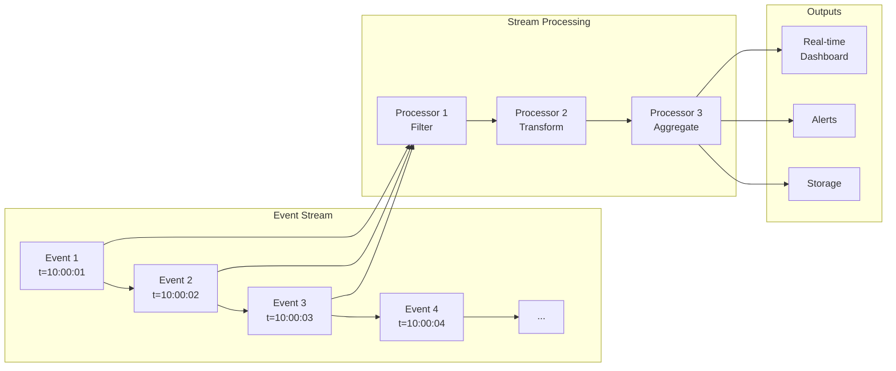
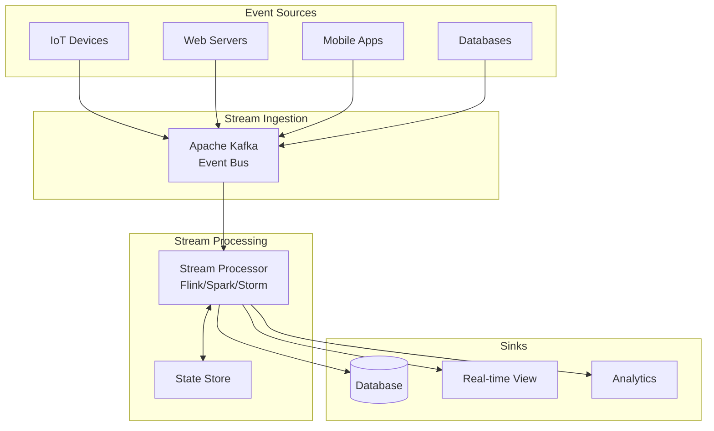
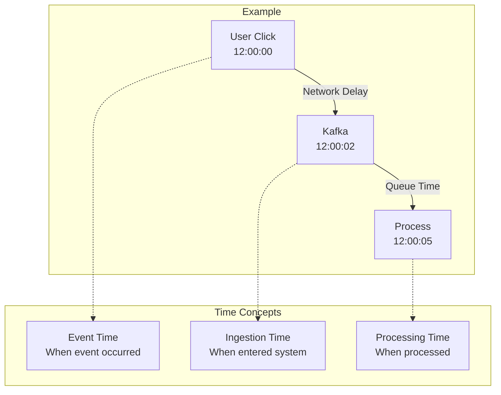
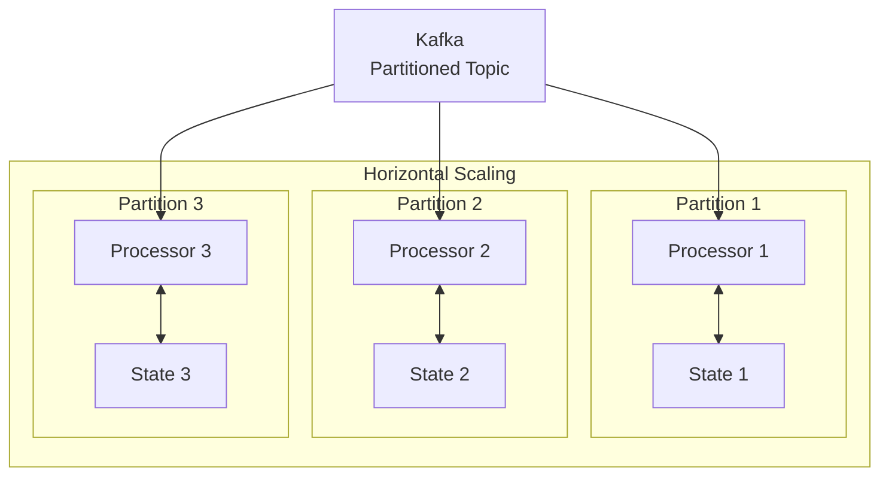

# Event Streaming Pattern

<div class="pattern-header">
  <div class="pattern-type">Data Processing Pattern</div>
  <div class="pattern-summary">Build systems that process continuous, unbounded streams of events in real-time, enabling reactive architectures and real-time analytics at scale.</div>
</div>

## Problem Context

<div class="problem-box">
<h3>🎯 The Challenge</h3>

Modern systems generate continuous streams of events:
- **Unbounded data**: No clear beginning or end
- **Real-time requirements**: Low latency processing
- **High volume**: Millions of events per second
- **Out-of-order arrival**: Network delays cause disorder
- **Failure handling**: Must process exactly once
- **State management**: Maintain consistency across streams

Traditional batch processing can't handle these requirements effectively.
</div>

## Core Concepts

### Event Stream Model



### Key Properties

<div class="law-box">
<h3>🔑 Stream Processing Principles</h3>

1. **Infinite Data**: Streams are unbounded sequences
2. **Time Matters**: Events have inherent time dimension
3. **State is Distributed**: Processing maintains state across nodes
4. **Exactly Once**: Each event processed exactly once despite failures
5. **Low Latency**: Results available in near real-time
</div>

## Stream Processing Architecture

### 1. Basic Components



### 2. Processing Patterns

```python
from abc import ABC, abstractmethod
from typing import List, Callable, Any
import time

class Event:
    def __init__(self, key: str, value: Any, timestamp: float = None):
        self.key = key
        self.value = value
        self.timestamp = timestamp or time.time()
        self.event_time = timestamp  # For event-time processing

class StreamProcessor(ABC):
    @abstractmethod
    def process(self, event: Event) -> List[Event]:
        pass

class FilterProcessor(StreamProcessor):
    """Filter events based on predicate"""
    def __init__(self, predicate: Callable):
        self.predicate = predicate
        
    def process(self, event: Event) -> List[Event]:
        if self.predicate(event):
            return [event]
        return []

class MapProcessor(StreamProcessor):
    """Transform events"""
    def __init__(self, mapper: Callable):
        self.mapper = mapper
        
    def process(self, event: Event) -> List[Event]:
        transformed_value = self.mapper(event.value)
        return [Event(event.key, transformed_value, event.timestamp)]

class WindowedAggregator(StreamProcessor):
    """Aggregate events in time windows"""
    def __init__(self, window_size: float, aggregator: Callable):
        self.window_size = window_size
        self.aggregator = aggregator
        self.windows = {}  # window_start -> accumulated_value
        
    def process(self, event: Event) -> List[Event]:
# Determine window
        window_start = (event.timestamp // self.window_size) * self.window_size
        
# Update window state
        if window_start not in self.windows:
            self.windows[window_start] = []
        self.windows[window_start].append(event.value)
        
# Check for complete windows
        current_time = time.time()
        completed = []
        
        for ws, values in list(self.windows.items()):
            if ws + self.window_size <= current_time:
# Window is complete
                result = self.aggregator(values)
                completed.append(Event(
                    key=f"window_{ws}",
                    value=result,
                    timestamp=ws + self.window_size
                ))
                del self.windows[ws]
                
        return completed
```

## Time in Stream Processing

### Event Time vs Processing Time



### Watermarks for Late Data

```python
class Watermark:
    """Tracks event time progress"""
    def __init__(self, max_out_of_orderness: float):
        self.max_out_of_orderness = max_out_of_orderness
        self.current_watermark = float('-inf')
        
    def update(self, event_time: float) -> float:
        """Update watermark based on event time"""
# Watermark = max_event_time - allowed_lateness
        potential_watermark = event_time - self.max_out_of_orderness
        
        if potential_watermark > self.current_watermark:
            self.current_watermark = potential_watermark
            
        return self.current_watermark
    
    def is_late(self, event_time: float) -> bool:
        """Check if event is late"""
        return event_time < self.current_watermark

class WatermarkProcessor:
    def __init__(self, max_lateness: float):
        self.watermark = Watermark(max_lateness)
        self.windows = {}
        self.late_data_handler = []
        
    def process_event(self, event: Event):
# Update watermark
        current_watermark = self.watermark.update(event.event_time)
        
        if self.watermark.is_late(event.event_time):
# Handle late data
            self.late_data_handler.append(event)
        else:
# Normal processing
            self.add_to_window(event)
            
# Trigger windows based on watermark
        self.trigger_windows(current_watermark)
```

## Windowing Strategies

### 1. Window Types

```mermaid
graph TD
    subgraph "Tumbling Windows"
        T1[|--W1--|]
        T2[|--W2--|]
        T3[|--W3--|]
    end
    
    subgraph "Sliding Windows"
        S1[|--W1---------|]
        S2[|---W2---------|]
        S3[|----W3--------|]
    end
    
    subgraph "Session Windows"
        SE1[|-W1-|]
        SE2[Gap]
        SE3[|---W2---|]
        SE4[Gap]
        SE5[|-W3-|]
    end
```

### 2. Window Implementation

```python
from enum import Enum
from collections import defaultdict

class WindowType(Enum):
    TUMBLING = "tumbling"
    SLIDING = "sliding"
    SESSION = "session"

class WindowManager:
    def __init__(self, window_type: WindowType, size: float, 
                 slide: float = None, gap: float = None):
        self.window_type = window_type
        self.size = size
        self.slide = slide or size  # For sliding windows
        self.gap = gap  # For session windows
        self.windows = defaultdict(list)
        self.sessions = {}  # For session windows
        
    def assign_windows(self, event: Event) -> List[str]:
        """Assign event to appropriate windows"""
        if self.window_type == WindowType.TUMBLING:
            window_start = (event.timestamp // self.size) * self.size
            return [f"{window_start}_{window_start + self.size}"]
            
        elif self.window_type == WindowType.SLIDING:
            windows = []
# Find all windows this event belongs to
            first_window = (event.timestamp // self.slide) * self.slide
            
# Check previous windows that might still contain this event
            current = first_window
            while current >= 0 and event.timestamp < current + self.size:
                windows.append(f"{current}_{current + self.size}")
                current -= self.slide
                
            return windows
            
        elif self.window_type == WindowType.SESSION:
# Find or create session
            session_key = self.find_session(event)
            if session_key:
                self.extend_session(session_key, event)
            else:
                session_key = self.create_session(event)
            return [session_key]
    
    def find_session(self, event: Event) -> str:
        """Find existing session for event"""
        for key, (start, end) in self.sessions.items():
            if event.timestamp >= start - self.gap and \
               event.timestamp <= end + self.gap:
                return key
        return None
    
    def create_session(self, event: Event) -> str:
        """Create new session"""
        key = f"session_{event.timestamp}"
        self.sessions[key] = (event.timestamp, event.timestamp)
        return key
```

## State Management

### 1. Stateful Stream Processing

```python
class StatefulProcessor:
    """Processor that maintains state across events"""
    
    def __init__(self):
        self.state_backend = {}  # In production: RocksDB, Redis, etc.
        
    def process_with_state(self, event: Event):
# Example: Count events per key
        key = event.key
        
# Get current state
        current_count = self.state_backend.get(key, 0)
        
# Update state
        new_count = current_count + 1
        self.state_backend[key] = new_count
        
# Emit result
        return Event(
            key=key,
            value={'count': new_count},
            timestamp=event.timestamp
        )

class KeyedStateProcessor:
    """Process streams with partitioned state"""
    
    def __init__(self, num_partitions: int):
        self.num_partitions = num_partitions
        self.partitions = [StatefulProcessor() for _ in range(num_partitions)]
        
    def get_partition(self, key: str) -> int:
        """Hash-based partitioning"""
        return hash(key) % self.num_partitions
    
    def process(self, event: Event):
        partition = self.get_partition(event.key)
        return self.partitions[partition].process_with_state(event)
```

### 2. Checkpointing

```python
import pickle
import os

class CheckpointManager:
    """Manage checkpoints for fault tolerance"""
    
    def __init__(self, checkpoint_dir: str, checkpoint_interval: float):
        self.checkpoint_dir = checkpoint_dir
        self.checkpoint_interval = checkpoint_interval
        self.last_checkpoint = time.time()
        
    def should_checkpoint(self) -> bool:
        """Check if checkpoint is due"""
        return time.time() - self.last_checkpoint >= self.checkpoint_interval
    
    def save_checkpoint(self, processor_state: dict, offset: int):
        """Save processor state and offset"""
        checkpoint = {
            'timestamp': time.time(),
            'offset': offset,
            'state': processor_state
        }
        
# Atomic write with temporary file
        temp_path = os.path.join(self.checkpoint_dir, 'checkpoint.tmp')
        final_path = os.path.join(self.checkpoint_dir, 'checkpoint.pkl')
        
        with open(temp_path, 'wb') as f:
            pickle.dump(checkpoint, f)
            
        os.rename(temp_path, final_path)
        self.last_checkpoint = time.time()
        
    def restore_checkpoint(self) -> tuple:
        """Restore from checkpoint"""
        checkpoint_path = os.path.join(self.checkpoint_dir, 'checkpoint.pkl')
        
        if os.path.exists(checkpoint_path):
            with open(checkpoint_path, 'rb') as f:
                checkpoint = pickle.load(f)
                return checkpoint['state'], checkpoint['offset']
        
        return {}, 0
```

## Complex Event Processing (CEP)

### Pattern Detection

```python
class EventPattern:
    """Detect patterns in event streams"""
    
    def __init__(self):
        self.patterns = []
        
    def followed_by(self, condition1: Callable, condition2: Callable, 
                   within: float) -> 'EventPattern':
        """Detect pattern: Event A followed by Event B within time window"""
        self.patterns.append({
            'type': 'followed_by',
            'conditions': [condition1, condition2],
            'within': within
        })
        return self
    
    def detect(self, events: List[Event]) -> List[List[Event]]:
        """Find all pattern matches"""
        matches = []
        
        for pattern in self.patterns:
            if pattern['type'] == 'followed_by':
# Find all events matching first condition
                first_matches = [e for e in events if pattern['conditions'][0](e)]
                
                for first in first_matches:
# Find following events within time window
                    second_matches = [
                        e for e in events
                        if pattern['conditions'][1](e)
                        and e.timestamp > first.timestamp
                        and e.timestamp <= first.timestamp + pattern['within']
                    ]
                    
                    for second in second_matches:
                        matches.append([first, second])
                        
        return matches

# Example: Detect failed login followed by successful login
pattern = EventPattern().followed_by(
    lambda e: e.value.get('type') == 'login_failed',
    lambda e: e.value.get('type') == 'login_success',
    within=300  # 5 minutes
)
```

## Stream Processing Frameworks

### Architecture Comparison

<div class="comparison-table">
<table class="responsive-table">
<thead>
<tr>
<th>Framework</th>
<th>Processing Model</th>
<th>Latency</th>
<th>Throughput</th>
<th>Best For</th>
</tr>
</thead>
<tbody>
<tr>
<td data-label="Framework"><strong>Apache Flink</strong></td>
<td data-label="Processing Model">True streaming</td>
<td data-label="Latency">Very Low</td>
<td data-label="Throughput">Very High</td>
<td data-label="Best For">Low-latency CEP</td>
</tr>
<tr>
<td data-label="Framework"><strong>Apache Spark</strong></td>
<td data-label="Processing Model">Micro-batch</td>
<td data-label="Latency">Low</td>
<td data-label="Throughput">Very High</td>
<td data-label="Best For">Batch + Stream</td>
</tr>
<tr>
<td data-label="Framework"><strong>Apache Storm</strong></td>
<td data-label="Processing Model">True streaming</td>
<td data-label="Latency">Very Low</td>
<td data-label="Throughput">High</td>
<td data-label="Best For">Simple pipelines</td>
</tr>
<tr>
<td data-label="Framework"><strong>Kafka Streams</strong></td>
<td data-label="Processing Model">True streaming</td>
<td data-label="Latency">Low</td>
<td data-label="Throughput">High</td>
<td data-label="Best For">Kafka-centric</td>
</tr>
</tbody>
</table>
</div>

### Example: Kafka Streams

```python
# Pseudo-code for Kafka Streams style processing
class KafkaStreamsExample:
    def word_count_topology(self):
# Define topology
        builder = StreamsBuilder()
        
# Source: Read from topic
        text_lines = builder.stream("text-input")
        
# Processing: Split and count
        word_counts = (
            text_lines
            .flatmap(lambda line: line.split())
            .group_by(lambda word: word)
            .count()
            .to_stream()
        )
        
# Sink: Write to topic
        word_counts.to("word-counts")
        
        return builder.build()
```

## Production Considerations

### 1. Scalability Patterns



### 2. Monitoring and Metrics

```python
class StreamMetrics:
    """Track streaming metrics"""
    
    def __init__(self):
        self.metrics = {
            'events_processed': 0,
            'processing_latency': [],
            'throughput': [],
            'errors': 0,
            'checkpoints': 0,
            'watermark_delay': []
        }
        
    def record_event(self, event: Event, process_time: float):
        """Record event processing metrics"""
        self.metrics['events_processed'] += 1
        
# Latency
        latency = time.time() - event.timestamp
        self.metrics['processing_latency'].append(latency)
        
# Throughput (events per second)
        if not hasattr(self, 'last_throughput_calc'):
            self.last_throughput_calc = time.time()
            self.events_in_window = 0
            
        self.events_in_window += 1
        
        if time.time() - self.last_throughput_calc >= 1.0:
            throughput = self.events_in_window
            self.metrics['throughput'].append(throughput)
            self.events_in_window = 0
            self.last_throughput_calc = time.time()
```

## Real-World Examples

### 1. Real-Time Analytics

<div class="example-card">
<h4>Netflix Streaming Analytics</h4>

- **Volume**: Billions of events/day
- **Use Case**: Real-time viewing metrics
- **Technology**: Apache Flink + Kafka
- **Challenges**: 
  - Global scale
  - Device diversity
  - Network partitions
</div>

### 2. IoT Data Processing

<div class="example-card">
<h4>Uber Real-Time Pricing</h4>

- **Events**: Driver locations, ride requests
- **Processing**: Supply/demand calculation
- **Latency**: < 1 second
- **Technology**: Apache Flink
</div>

## Common Pitfalls

!!! danger "⚠️ Out-of-Order Event Handling"
    **Problem**: Events arrive out of order due to network delays
    **Symptom**: Incorrect aggregations, missed patterns
    **Solution**:
    - Use event time, not processing time
    - Implement watermarks with appropriate lateness
    - Handle late data explicitly

## Best Practices

!!! info "🎯 Stream Processing Guidelines"
    1. **Choose the right time semantics**: Event time for correctness
    2. **Plan for late data**: Watermarks and allowed lateness
    3. **Partition for scale**: Key-based partitioning
    4. **Checkpoint frequently**: Balance performance vs recovery time
    5. **Monitor everything**: Lag, throughput, latency
    6. **Handle backpressure**: Don't overwhelm downstream
    7. **Design for reprocessing**: Idempotent operations

## When to Use Event Streaming

✅ **Good Fit**:
- Real-time analytics
- Event-driven architectures
- Continuous computation
- Time-series processing
- Complex event detection

❌ **Poor Fit**:
- Simple request-response
- Batch processing sufficient
- No real-time requirements
- Limited scale

## Implementation Checklist

- [ ] Define event schema and serialization
- [ ] Choose time semantics (event vs processing)
- [ ] Implement windowing strategy
- [ ] Design state management approach
- [ ] Set up checkpointing
- [ ] Plan partitioning strategy
- [ ] Implement monitoring/alerting
- [ ] Handle late/out-of-order data
- [ ] Test failure scenarios
- [ ] Document retention policies

## Related Patterns

- [Event Sourcing](event-sourcing.md) - Store events as source of truth
- [CQRS](cqrs.md) - Separate read/write models
- [Saga Pattern](saga.md) - Distributed transactions
- [Message Queue](/case-studies/distributed-message-queue) - Async messaging

## References

- "Streaming Systems" - Tyler Akidau et al.
- "The Dataflow Model" - Google Research
- Apache Flink Documentation
- "Kafka: The Definitive Guide" - Confluent