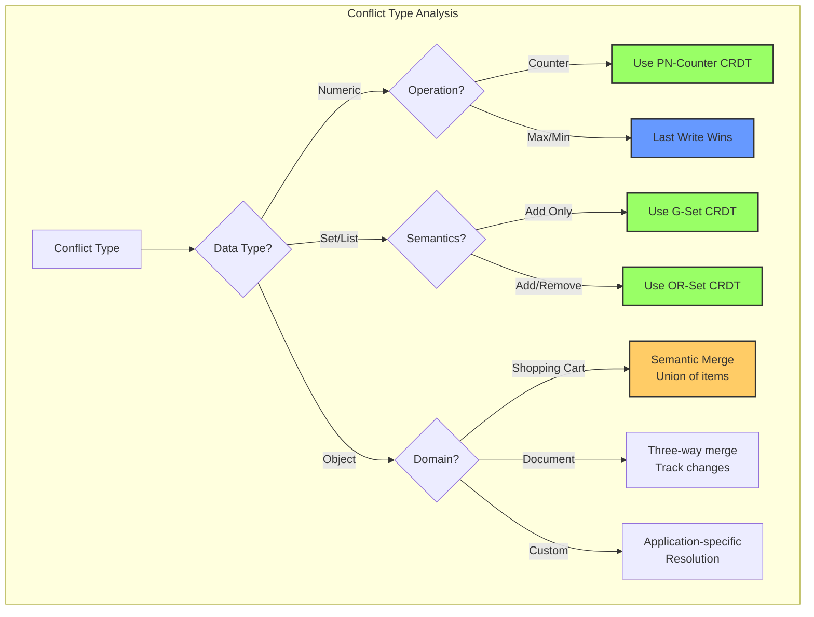

# Eventual Consistency

**Trading immediate consistency for availability and partition tolerance**

<div class="law-box">
<h4>The CAP Theorem Trade-off</h4>
<p>In the presence of network partitions, distributed systems must choose between consistency and availability. Eventual consistency chooses availability, guaranteeing that all nodes will converge to the same state given enough time and no new updates.</p>
</div>

## Overview

Eventual consistency is a consistency model used in distributed computing to achieve high availability. In this model, the system guarantees that if no new updates are made to a given data item, eventually all accesses to that item will return the last updated value.

### Key Properties

1. **Convergence**: All replicas eventually reach the same state
2. **No Ordering Guarantees**: Updates may be seen in different orders
3. **Temporary Inconsistency**: Different nodes may have different values
4. **Conflict Resolution**: System must handle concurrent updates
5. **Read Your Writes**: Optional guarantee for better user experience

## Theoretical Foundations

### Consistency Spectrum


### Vector Clocks

Vector clocks track causality in distributed systems:

```python
from typing import Dict, Tuple, Optional, List
import copy

class VectorClock:
    """Vector clock implementation for tracking causality"""
    
    def __init__(self, node_id: str, nodes: List[str]):
        self.node_id = node_id
        self.clock = {node: 0 for node in nodes}
    
    def increment(self):
        """Increment this node's clock"""
        self.clock[self.node_id] += 1
    
    def update(self, other_clock: Dict[str, int]):
        """Update clock based on received message"""
        for node, timestamp in other_clock.items():
            if node in self.clock:
                self.clock[node] = max(self.clock[node], timestamp)
        self.increment()
    
    def happens_before(self, other: 'VectorClock') -> bool:
        """Check if this clock happens before other"""
        for node in self.clock:
            if self.clock[node] > other.clock.get(node, 0):
                return False
        return any(self.clock[node] < other.clock.get(node, 0) 
                  for node in self.clock)
    
    def concurrent_with(self, other: 'VectorClock') -> bool:
        """Check if two events are concurrent"""
        return (not self.happens_before(other) and 
                not other.happens_before(self))
    
    def merge(self, other: 'VectorClock'):
        """Merge two vector clocks"""
        for node, timestamp in other.clock.items():
            if node in self.clock:
                self.clock[node] = max(self.clock[node], timestamp)

class CausalMessage:
    """Message with vector clock for causal ordering"""
    
    def __init__(self, sender: str, data: any, vector_clock: VectorClock):
        self.sender = sender
        self.data = data
        self.vector_clock = copy.deepcopy(vector_clock.clock)
        self.timestamp = sum(vector_clock.clock.values())

# Example: Distributed counter with vector clocks
class DistributedCounter:
    """Eventually consistent counter using vector clocks"""
    
    def __init__(self, node_id: str, nodes: List[str]):
        self.node_id = node_id
        self.nodes = nodes
        self.vector_clock = VectorClock(node_id, nodes)
        self.value = 0
        self.pending_updates = []
        
    def increment(self, amount: int = 1):
        """Increment counter locally"""
        self.value += amount
        self.vector_clock.increment()
        
# Broadcast update
        update = {
            'node': self.node_id,
            'amount': amount,
            'vector_clock': copy.deepcopy(self.vector_clock.clock)
        }
        return update
    
    def receive_update(self, update: Dict):
        """Receive and apply update from another node"""
        remote_clock = VectorClock(update['node'], self.nodes)
        remote_clock.clock = update['vector_clock']
        
# Check if we can apply this update
        if self._can_apply_update(remote_clock):
            self.value += update['amount']
            self.vector_clock.update(update['vector_clock'])
            
# Check pending updates
            self._process_pending_updates()
        else:
# Store for later
            self.pending_updates.append(update)
    
    def _can_apply_update(self, remote_clock: VectorClock) -> bool:
        """Check if update can be applied based on causality"""
# Simple check: apply if not from future
        for node, timestamp in remote_clock.clock.items():
            if node != remote_clock.node_id:
                if timestamp > self.vector_clock.clock.get(node, 0) + 1:
                    return False
        return True
    
    def _process_pending_updates(self):
        """Process any pending updates that can now be applied"""
        remaining = []
        for update in self.pending_updates:
            remote_clock = VectorClock(update['node'], self.nodes)
            remote_clock.clock = update['vector_clock']
            
            if self._can_apply_update(remote_clock):
                self.value += update['amount']
                self.vector_clock.update(update['vector_clock'])
            else:
                remaining.append(update)
        
        self.pending_updates = remaining
```

### Conflict Resolution Strategies

```python
from abc import ABC, abstractmethod
from typing import Any, List, Tuple
import time

class ConflictResolver(ABC):
    """Abstract base for conflict resolution strategies"""
    
    @abstractmethod
    def resolve(self, conflicts: List[Tuple[Any, Dict]]) -> Any:
        """Resolve conflicts between concurrent updates"""
        pass

class LastWriteWins(ConflictResolver):
    """Last Write Wins (LWW) resolution"""
    
    def resolve(self, conflicts: List[Tuple[Any, Dict]]) -> Any:
        """Choose value with highest timestamp"""
        return max(conflicts, key=lambda x: x[1].get('timestamp', 0))[0]

class MultiValueRegister(ConflictResolver):
    """Keep all concurrent values (like Riak)"""
    
    def resolve(self, conflicts: List[Tuple[Any, Dict]]) -> List[Any]:
        """Return all concurrent values for client resolution"""
# Group by vector clock to find concurrent values
        concurrent_values = []
        for value, metadata in conflicts:
            vc = metadata.get('vector_clock', {})
            is_concurrent = True
            
            for other_value, other_metadata in conflicts:
                if value == other_value:
                    continue
                other_vc = other_metadata.get('vector_clock', {})
                if self._happens_before(vc, other_vc):
                    is_concurrent = False
                    break
            
            if is_concurrent:
                concurrent_values.append(value)
        
        return concurrent_values
    
    def _happens_before(self, vc1: Dict, vc2: Dict) -> bool:
        """Check if vc1 happens before vc2"""
        all_less_equal = all(vc1.get(k, 0) <= vc2.get(k, 0) 
                            for k in set(vc1) | set(vc2))
        at_least_one_less = any(vc1.get(k, 0) < vc2.get(k, 0) 
                               for k in set(vc1) | set(vc2))
        return all_less_equal and at_least_one_less

class SemanticResolver(ConflictResolver):
    """Application-specific semantic resolution"""
    
    def __init__(self, merge_function):
        self.merge_function = merge_function
    
    def resolve(self, conflicts: List[Tuple[Any, Dict]]) -> Any:
        """Use application-specific merge logic"""
        values = [v for v, _ in conflicts]
        return self.merge_function(values)

# Example: Shopping cart with semantic resolution
class ShoppingCart:
    """Eventually consistent shopping cart"""
    
    def __init__(self):
        self.items = {}  # item_id -> quantity
        self.vector_clock = {}
        self.node_id = str(uuid.uuid4())
        
    def add_item(self, item_id: str, quantity: int):
        """Add item to cart"""
        if item_id in self.items:
            self.items[item_id] += quantity
        else:
            self.items[item_id] = quantity
        
# Update vector clock
        if self.node_id not in self.vector_clock:
            self.vector_clock[self.node_id] = 0
        self.vector_clock[self.node_id] += 1
        
        return {
            'items': copy.deepcopy(self.items),
            'vector_clock': copy.deepcopy(self.vector_clock)
        }
    
    def remove_item(self, item_id: str, quantity: int):
        """Remove item from cart"""
        if item_id in self.items:
            self.items[item_id] = max(0, self.items[item_id] - quantity)
            if self.items[item_id] == 0:
                del self.items[item_id]
        
        self.vector_clock[self.node_id] = self.vector_clock.get(self.node_id, 0) + 1
        
        return {
            'items': copy.deepcopy(self.items),
            'vector_clock': copy.deepcopy(self.vector_clock)
        }
    
    def merge(self, other_state: Dict):
        """Merge with another cart state"""
        other_items = other_state['items']
        other_vc = other_state['vector_clock']
        
# Semantic merge: take maximum quantity for each item
        merged_items = {}
        
        all_items = set(self.items.keys()) | set(other_items.keys())
        for item_id in all_items:
            my_qty = self.items.get(item_id, 0)
            other_qty = other_items.get(item_id, 0)
            merged_items[item_id] = max(my_qty, other_qty)
        
        self.items = merged_items
        
# Merge vector clocks
        for node, timestamp in other_vc.items():
            self.vector_clock[node] = max(
                self.vector_clock.get(node, 0), 
                timestamp
            )
```

## Implementation Patterns

### 1. Anti-Entropy Protocol

Periodic synchronization to ensure convergence:

```python
import asyncio
import random
from typing import Set, Dict, Any

class AntiEntropyProtocol:
    """Gossip-based anti-entropy for eventual consistency"""
    
    def __init__(self, node_id: str, data_store: Dict[str, Any]):
        self.node_id = node_id
        self.data_store = data_store
        self.peers: Set[str] = set()
        self.vector_clock = VectorClock(node_id, [])
        self.sync_interval = 5.0  # seconds
        
    def add_peer(self, peer_id: str):
        """Add a peer for synchronization"""
        self.peers.add(peer_id)
        self.vector_clock.clock[peer_id] = 0
    
    async def start_anti_entropy(self):
        """Start periodic anti-entropy process"""
        while True:
            await asyncio.sleep(self.sync_interval)
            await self.sync_with_random_peer()
    
    async def sync_with_random_peer(self):
        """Synchronize with a randomly selected peer"""
        if not self.peers:
            return
        
        peer = random.choice(list(self.peers))
        
# Exchange digests
        my_digest = self.compute_digest()
        peer_digest = await self.request_digest(peer)
        
# Compute differences
        missing_from_peer = self.compute_missing(my_digest, peer_digest)
        missing_from_me = self.compute_missing(peer_digest, my_digest)
        
# Exchange missing data
        if missing_from_peer:
            await self.send_updates(peer, missing_from_peer)
        
        if missing_from_me:
            updates = await self.request_updates(peer, missing_from_me)
            self.apply_updates(updates)
    
    def compute_digest(self) -> Dict[str, Dict]:
        """Compute digest of local data"""
        digest = {}
        for key, value in self.data_store.items():
            digest[key] = {
                'version': value.get('version', 0),
                'checksum': self._compute_checksum(value)
            }
        return digest
    
    def compute_missing(self, my_digest: Dict, peer_digest: Dict) -> List[str]:
        """Find keys that peer is missing or has older versions of"""
        missing = []
        
        for key, my_info in my_digest.items():
            peer_info = peer_digest.get(key)
            
            if not peer_info:
                missing.append(key)
            elif peer_info['version'] < my_info['version']:
                missing.append(key)
            elif peer_info['checksum'] != my_info['checksum']:
# Same version but different content (conflict)
                missing.append(key)
        
        return missing
    
    def apply_updates(self, updates: List[Dict]):
        """Apply updates from peer"""
        for update in updates:
            key = update['key']
            value = update['value']
            metadata = update['metadata']
            
            existing = self.data_store.get(key)
            
            if not existing:
# New key
                self.data_store[key] = value
            else:
# Resolve conflict
                resolved = self.resolve_conflict(existing, value, metadata)
                self.data_store[key] = resolved
    
    def resolve_conflict(self, local_value: Any, remote_value: Any, 
                        metadata: Dict) -> Any:
        """Resolve conflicts between local and remote values"""
# Example: Last Write Wins
        local_ts = local_value.get('timestamp', 0)
        remote_ts = remote_value.get('timestamp', 0)
        
        return remote_value if remote_ts > local_ts else local_value
    
    def _compute_checksum(self, value: Any) -> str:
        """Compute checksum for value comparison"""
        import hashlib
        return hashlib.md5(str(value).encode()).hexdigest()

# Merkle tree for efficient synchronization
class MerkleTree:
    """Merkle tree for efficient data comparison"""
    
    def __init__(self):
        self.tree = {}
        self.data = {}
    
    def insert(self, key: str, value: Any):
        """Insert key-value pair and update tree"""
        self.data[key] = value
        self._update_tree(key)
    
    def _update_tree(self, key: str):
        """Update merkle tree hashes"""
# Compute leaf hash
        leaf_hash = self._hash_node(key, self.data[key])
        
# Update parent hashes up to root
        path = self._get_path(key)
        current_hash = leaf_hash
        
        for i in range(len(path)):
            node_key = '/'.join(path[:i+1])
            self.tree[node_key] = current_hash
            
# Combine with sibling if exists
            sibling_key = self._get_sibling(node_key)
            if sibling_key in self.tree:
                combined = self._hash_combine(current_hash, self.tree[sibling_key])
                current_hash = combined
    
    def compare_with(self, other_tree: 'MerkleTree') -> List[str]:
        """Compare with another tree and find differences"""
        differences = []
        
# Start from root
        if self.tree.get('root') != other_tree.tree.get('root'):
# Trees differ, traverse to find differences
            differences = self._find_differences('root', other_tree)
        
        return differences
    
    def _find_differences(self, node: str, other_tree: 'MerkleTree') -> List[str]:
        """Recursively find differing keys"""
        if node not in self.tree:
            return []
        
        if self.tree[node] == other_tree.tree.get(node):
            return []  # Subtrees are identical
        
# Check if leaf node
        if self._is_leaf(node):
            return [node]
        
# Recurse on children
        differences = []
        left_child = self._get_left_child(node)
        right_child = self._get_right_child(node)
        
        differences.extend(self._find_differences(left_child, other_tree))
        differences.extend(self._find_differences(right_child, other_tree))
        
        return differences
    
    def _hash_node(self, key: str, value: Any) -> str:
        """Hash a node"""
        import hashlib
        content = f"{key}:{value}"
        return hashlib.sha256(content.encode()).hexdigest()
    
    def _hash_combine(self, hash1: str, hash2: str) -> str:
        """Combine two hashes"""
        import hashlib
        combined = f"{hash1}{hash2}"
        return hashlib.sha256(combined.encode()).hexdigest()
```

### 2. Read Repair

Detect and fix inconsistencies during read operations:

```python
class ReadRepair:
    """Read repair for eventual consistency"""
    
    def __init__(self, replicas: List[str], quorum_size: int):
        self.replicas = replicas
        self.quorum_size = quorum_size
        
    async def read_with_repair(self, key: str) -> Any:
        """Read value and repair inconsistencies"""
        
# Read from all replicas
        responses = await self._read_from_replicas(key)
        
# Find the most recent value
        latest_value, latest_metadata = self._find_latest(responses)
        
# Repair out-of-date replicas
        repair_tasks = []
        for replica, (value, metadata) in responses.items():
            if self._is_older(metadata, latest_metadata):
                task = self._repair_replica(replica, key, latest_value, latest_metadata)
                repair_tasks.append(task)
        
# Fire and forget repairs
        if repair_tasks:
            asyncio.create_task(self._execute_repairs(repair_tasks))
        
        return latest_value
    
    async def _read_from_replicas(self, key: str) -> Dict[str, Tuple[Any, Dict]]:
        """Read from all replicas"""
        responses = {}
        
        tasks = []
        for replica in self.replicas:
            task = self._read_from_replica(replica, key)
            tasks.append((replica, task))
        
# Wait for responses
        for replica, task in tasks:
            try:
                value, metadata = await asyncio.wait_for(task, timeout=1.0)
                responses[replica] = (value, metadata)
            except asyncio.TimeoutError:
# Skip unresponsive replicas
                pass
        
        return responses
    
    def _find_latest(self, responses: Dict[str, Tuple[Any, Dict]]) -> Tuple[Any, Dict]:
        """Find the latest value based on metadata"""
        latest_value = None
        latest_metadata = None
        latest_timestamp = -1
        
        for replica, (value, metadata) in responses.items():
            timestamp = metadata.get('timestamp', 0)
            if timestamp > latest_timestamp:
                latest_timestamp = timestamp
                latest_value = value
                latest_metadata = metadata
        
        return latest_value, latest_metadata
    
    def _is_older(self, metadata1: Dict, metadata2: Dict) -> bool:
        """Check if metadata1 is older than metadata2"""
# Simple timestamp comparison
        return metadata1.get('timestamp', 0) < metadata2.get('timestamp', 0)
    
    async def _repair_replica(self, replica: str, key: str, 
                            value: Any, metadata: Dict):
        """Repair a single replica"""
# Send update to replica
        await self._write_to_replica(replica, key, value, metadata)
    
    async def _execute_repairs(self, repair_tasks: List):
        """Execute all repair tasks"""
        await asyncio.gather(*repair_tasks, return_exceptions=True)

# Hinted handoff for temporary failures
class HintedHandoff:
    """Store hints for temporarily unavailable nodes"""
    
    def __init__(self, node_id: str):
        self.node_id = node_id
        self.hints = {}  # target_node -> List[hints]
        self.max_hint_age = 3600  # 1 hour
        
    def store_hint(self, target_node: str, key: str, value: Any, metadata: Dict):
        """Store a hint for later delivery"""
        if target_node not in self.hints:
            self.hints[target_node] = []
        
        hint = {
            'key': key,
            'value': value,
            'metadata': metadata,
            'timestamp': time.time()
        }
        
        self.hints[target_node].append(hint)
    
    async def deliver_hints(self):
        """Periodically attempt to deliver hints"""
        while True:
            await asyncio.sleep(10)  # Check every 10 seconds
            
            for target_node, node_hints in list(self.hints.items()):
                if await self._is_node_available(target_node):
# Deliver hints
                    delivered = []
                    
                    for hint in node_hints:
                        if time.time() - hint['timestamp'] > self.max_hint_age:
# Hint too old, discard
                            delivered.append(hint)
                            continue
                        
                        try:
                            await self._deliver_hint(target_node, hint)
                            delivered.append(hint)
                        except Exception:
# Keep hint for next attempt
                            pass
                    
# Remove delivered hints
                    for hint in delivered:
                        node_hints.remove(hint)
                    
                    if not node_hints:
                        del self.hints[target_node]
    
    async def _is_node_available(self, node: str) -> bool:
        """Check if node is available"""
# Implementation depends on failure detection mechanism
        pass
    
    async def _deliver_hint(self, node: str, hint: Dict):
        """Deliver a single hint"""
# Send write request to node
        pass
```

### 3. Session Guarantees

Providing stronger consistency for better user experience:

```python
class SessionGuarantees:
    """Session-level consistency guarantees"""
    
    def __init__(self, session_id: str):
        self.session_id = session_id
        self.read_timestamp = 0
        self.write_timestamp = 0
        self.causal_dependencies = set()
        
    def read_your_writes(self, replica_manager):
        """Ensure reads see previous writes from this session"""
        return SessionReadYourWrites(self, replica_manager)
    
    def monotonic_reads(self, replica_manager):
        """Ensure reads are monotonically increasing"""
        return SessionMonotonicReads(self, replica_manager)
    
    def monotonic_writes(self, replica_manager):
        """Ensure writes are applied in order"""
        return SessionMonotonicWrites(self, replica_manager)
    
    def causal_consistency(self, replica_manager):
        """Ensure causal relationships are preserved"""
        return SessionCausalConsistency(self, replica_manager)

class SessionReadYourWrites:
    """Read Your Writes consistency"""
    
    def __init__(self, session: SessionGuarantees, replica_manager):
        self.session = session
        self.replica_manager = replica_manager
        
    async def write(self, key: str, value: Any) -> bool:
        """Write with session tracking"""
# Generate write timestamp
        timestamp = time.time()
        self.session.write_timestamp = timestamp
        
# Write to replicas
        success = await self.replica_manager.write(
            key, value, 
            metadata={'session': self.session.session_id, 'timestamp': timestamp}
        )
        
        return success
    
    async def read(self, key: str) -> Any:
        """Read ensuring we see our writes"""
# Find replicas that have seen our writes
        valid_replicas = await self._find_up_to_date_replicas()
        
        if not valid_replicas:
# Wait for propagation
            await asyncio.sleep(0.1)
            valid_replicas = await self._find_up_to_date_replicas()
        
# Read from valid replica
        return await self.replica_manager.read_from_replicas(key, valid_replicas)
    
    async def _find_up_to_date_replicas(self) -> List[str]:
        """Find replicas that have seen our writes"""
        valid_replicas = []
        
        for replica in self.replica_manager.replicas:
            replica_timestamp = await self._get_replica_timestamp(replica)
            if replica_timestamp >= self.session.write_timestamp:
                valid_replicas.append(replica)
        
        return valid_replicas
    
    async def _get_replica_timestamp(self, replica: str) -> float:
        """Get latest timestamp from replica"""
# Implementation depends on replica protocol
        pass

class SessionMonotonicReads:
    """Monotonic reads consistency"""
    
    def __init__(self, session: SessionGuarantees, replica_manager):
        self.session = session
        self.replica_manager = replica_manager
        self.last_read_replica = None
        
    async def read(self, key: str) -> Any:
        """Read ensuring monotonic progress"""
        if self.last_read_replica:
# Try to read from same replica
            try:
                value = await self.replica_manager.read_from_replica(
                    key, self.last_read_replica
                )
                return value
            except Exception:
# Replica unavailable, find alternative
                pass
        
# Find replica with sufficient progress
        for replica in self.replica_manager.replicas:
            replica_state = await self._get_replica_state(replica)
            if replica_state >= self.session.read_timestamp:
                value = await self.replica_manager.read_from_replica(key, replica)
                self.last_read_replica = replica
                self.session.read_timestamp = replica_state
                return value
        
        raise Exception("No replica with sufficient progress")
    
    async def _get_replica_state(self, replica: str) -> float:
        """Get state/timestamp of replica"""
# Implementation specific
        pass
```

## Real-World Examples

### 1. Amazon DynamoDB

Implementation of eventual consistency with tunable consistency:

```python
class DynamoDBStyle:
    """DynamoDB-style eventually consistent key-value store"""
    
    def __init__(self, nodes: List[str], replication_factor: int = 3):
        self.nodes = nodes
        self.replication_factor = replication_factor
        self.hash_ring = ConsistentHashRing(nodes)
        self.vector_clocks = {}
        
    async def put(self, key: str, value: Any, 
                  consistency_level: str = "ONE") -> bool:
        """Put with configurable consistency"""
        
# Find preference list
        preference_list = self.hash_ring.get_nodes(key, self.replication_factor)
        
# Update vector clock
        if key not in self.vector_clocks:
            self.vector_clocks[key] = VectorClock(self.node_id, self.nodes)
        self.vector_clocks[key].increment()
        
# Prepare write
        write_data = {
            'value': value,
            'vector_clock': self.vector_clocks[key].clock,
            'timestamp': time.time()
        }
        
# Write based on consistency level
        if consistency_level == "ONE":
# Write to at least one node
            return await self._write_one(preference_list, key, write_data)
        elif consistency_level == "QUORUM":
# Write to majority
            return await self._write_quorum(preference_list, key, write_data)
        elif consistency_level == "ALL":
# Write to all nodes
            return await self._write_all(preference_list, key, write_data)
    
    async def get(self, key: str, consistency_level: str = "ONE") -> Any:
        """Get with configurable consistency"""
        
        preference_list = self.hash_ring.get_nodes(key, self.replication_factor)
        
        if consistency_level == "ONE":
# Read from any node
            return await self._read_one(preference_list, key)
        elif consistency_level == "QUORUM":
# Read from majority and reconcile
            return await self._read_quorum(preference_list, key)
        elif consistency_level == "ALL":
# Read from all nodes
            return await self._read_all(preference_list, key)
    
    async def _write_quorum(self, nodes: List[str], key: str, data: Dict) -> bool:
        """Write to quorum of nodes"""
        quorum_size = len(nodes) // 2 + 1
        write_tasks = []
        
        for node in nodes:
            task = self._write_to_node(node, key, data)
            write_tasks.append(task)
        
# Wait for quorum
        results = await asyncio.gather(*write_tasks, return_exceptions=True)
        successful_writes = sum(1 for r in results if r is True)
        
        return successful_writes >= quorum_size
    
    async def _read_quorum(self, nodes: List[str], key: str) -> Any:
        """Read from quorum and reconcile"""
        quorum_size = len(nodes) // 2 + 1
        read_tasks = []
        
        for node in nodes:
            task = self._read_from_node(node, key)
            read_tasks.append(task)
        
# Collect responses
        responses = await asyncio.gather(*read_tasks, return_exceptions=True)
        valid_responses = [r for r in responses if not isinstance(r, Exception)]
        
        if len(valid_responses) < quorum_size:
            raise Exception("Failed to reach quorum")
        
# Reconcile using vector clocks
        return self._reconcile_responses(valid_responses)
    
    def _reconcile_responses(self, responses: List[Dict]) -> Any:
        """Reconcile multiple responses using vector clocks"""
        if not responses:
            return None
        
        if len(responses) == 1:
            return responses[0]['value']
        
# Find concurrent values
        concurrent_values = []
        
        for response in responses:
            vc = VectorClock(self.node_id, self.nodes)
            vc.clock = response['vector_clock']
            
            is_concurrent = True
            for other in responses:
                if response == other:
                    continue
                    
                other_vc = VectorClock(self.node_id, self.nodes)
                other_vc.clock = other['vector_clock']
                
                if vc.happens_before(other_vc):
                    is_concurrent = False
                    break
            
            if is_concurrent:
                concurrent_values.append(response)
        
# If multiple concurrent values, return all (like Riak siblings)
        if len(concurrent_values) > 1:
            return [cv['value'] for cv in concurrent_values]
        
# Return the single concurrent value
        return concurrent_values[0]['value'] if concurrent_values else None

# Consistent hashing for data distribution
class ConsistentHashRing:
    """Consistent hash ring for node selection"""
    
    def __init__(self, nodes: List[str], virtual_nodes: int = 150):
        self.nodes = nodes
        self.virtual_nodes = virtual_nodes
        self.ring = {}
        self._build_ring()
    
    def _build_ring(self):
        """Build the hash ring"""
        for node in self.nodes:
            for i in range(self.virtual_nodes):
                virtual_node_id = f"{node}:{i}"
                hash_value = self._hash(virtual_node_id)
                self.ring[hash_value] = node
        
        self.sorted_keys = sorted(self.ring.keys())
    
    def get_nodes(self, key: str, count: int) -> List[str]:
        """Get N nodes for a key"""
        if not self.ring:
            return []
        
        hash_value = self._hash(key)
        nodes = []
        
# Find starting position
        start_idx = bisect.bisect_right(self.sorted_keys, hash_value)
        
# Collect unique nodes
        seen = set()
        idx = start_idx
        
        while len(nodes) < count and len(seen) < len(self.nodes):
            if idx >= len(self.sorted_keys):
                idx = 0
            
            node = self.ring[self.sorted_keys[idx]]
            if node not in seen:
                nodes.append(node)
                seen.add(node)
            
            idx += 1
        
        return nodes
    
    def _hash(self, key: str) -> int:
        """Hash function"""
        import hashlib
        return int(hashlib.md5(key.encode()).hexdigest(), 16)
```

### 2. Apache Cassandra

Tunable consistency with eventual consistency by default:

```python
class CassandraStyle:
    """Cassandra-style distributed database"""
    
    def __init__(self, datacenter: str, rack: str):
        self.datacenter = datacenter
        self.rack = rack
        self.consistency_levels = {
            'ANY': self._write_any,
            'ONE': self._write_one,
            'TWO': self._write_two,
            'THREE': self._write_three,
            'QUORUM': self._write_quorum,
            'LOCAL_QUORUM': self._write_local_quorum,
            'EACH_QUORUM': self._write_each_quorum,
            'ALL': self._write_all
        }
        
    async def execute(self, query: str, consistency_level: str = 'ONE'):
        """Execute query with specified consistency"""
        
        if query.startswith('INSERT') or query.startswith('UPDATE'):
            return await self._write(query, consistency_level)
        elif query.startswith('SELECT'):
            return await self._read(query, consistency_level)
    
    async def _write(self, query: str, consistency_level: str):
        """Write with specified consistency"""
        write_func = self.consistency_levels.get(consistency_level)
        if not write_func:
            raise ValueError(f"Unknown consistency level: {consistency_level}")
        
        return await write_func(query)
    
    async def _write_quorum(self, query: str):
        """Write to quorum of replicas"""
        replicas = self._get_replicas_for_query(query)
        quorum_size = len(replicas) // 2 + 1
        
# Send writes
        write_promises = []
        for replica in replicas:
            promise = self._send_write(replica, query)
            write_promises.append(promise)
        
# Wait for quorum
        completed = 0
        errors = []
        
        for promise in asyncio.as_completed(write_promises):
            try:
                await promise
                completed += 1
                if completed >= quorum_size:
# Quorum reached, return success
                    return True
            except Exception as e:
                errors.append(e)
        
# Failed to reach quorum
        raise Exception(f"Failed to reach quorum: {errors}")
    
    async def _write_local_quorum(self, query: str):
        """Write to quorum within local datacenter"""
        replicas = self._get_replicas_for_query(query)
        local_replicas = [r for r in replicas if r.datacenter == self.datacenter]
        
        if not local_replicas:
            raise Exception("No local replicas available")
        
        quorum_size = len(local_replicas) // 2 + 1
# Similar implementation to _write_quorum but only for local replicas
        pass

# Read repair and hinted handoff
class ReadRepairManager:
    """Manage read repair for Cassandra-style system"""
    
    def __init__(self, consistency_manager):
        self.consistency_manager = consistency_manager
        self.repair_chance = 0.1  # 10% chance of read repair
        
    async def read_with_possible_repair(self, query: str, 
                                      consistency_level: str):
        """Read with probabilistic read repair"""
        
# Perform normal read
        result = await self.consistency_manager.read(query, consistency_level)
        
# Probabilistic read repair
        if random.random() < self.repair_chance:
            asyncio.create_task(self._background_repair(query))
        
        return result
    
    async def _background_repair(self, query: str):
        """Perform read repair in background"""
        try:
# Read from all replicas
            all_responses = await self._read_all_replicas(query)
            
# Find latest version
            latest = self._find_latest_version(all_responses)
            
# Repair out-of-date replicas
            repair_tasks = []
            for replica, response in all_responses.items():
                if self._is_outdated(response, latest):
                    task = self._repair_replica(replica, latest)
                    repair_tasks.append(task)
            
            if repair_tasks:
                await asyncio.gather(*repair_tasks, return_exceptions=True)
                
        except Exception as e:
# Log but don't fail the read
            logging.warning(f"Read repair failed: {e}")
```

## Performance Optimization

### 1. Bounded Staleness

Limiting how stale data can be:

```python
class BoundedStaleness:
    """Eventual consistency with staleness bounds"""
    
    def __init__(self, max_staleness_seconds: float):
        self.max_staleness = max_staleness_seconds
        self.write_timestamps = {}
        self.read_timestamps = {}
        
    async def write(self, key: str, value: Any) -> bool:
        """Write with timestamp tracking"""
        timestamp = time.time()
        
# Update all replicas
        write_tasks = []
        for replica in self.replicas:
            task = self._write_to_replica(replica, key, value, timestamp)
            write_tasks.append(task)
        
# Wait for at least one write
        results = await asyncio.gather(*write_tasks, return_exceptions=True)
        successful = any(r is True for r in results)
        
        if successful:
            self.write_timestamps[key] = timestamp
        
        return successful
    
    async def read(self, key: str) -> Any:
        """Read ensuring bounded staleness"""
        current_time = time.time()
        
# Check if we need fresh data
        last_write = self.write_timestamps.get(key, 0)
        if current_time - last_write > self.max_staleness:
# Force read from primary/leader
            return await self._read_from_primary(key)
        
# Can read from any replica
        return await self._read_from_any_replica(key)
    
    def get_staleness_metrics(self) -> Dict:
        """Get metrics about data staleness"""
        current_time = time.time()
        metrics = {
            'max_staleness_configured': self.max_staleness,
            'keys_within_bound': 0,
            'keys_exceeding_bound': 0,
            'average_staleness': 0
        }
        
        total_staleness = 0
        for key, write_time in self.write_timestamps.items():
            staleness = current_time - write_time
            total_staleness += staleness
            
            if staleness <= self.max_staleness:
                metrics['keys_within_bound'] += 1
            else:
                metrics['keys_exceeding_bound'] += 1
        
        if self.write_timestamps:
            metrics['average_staleness'] = total_staleness / len(self.write_timestamps)
        
        return metrics
```

### 2. Adaptive Consistency

Dynamically adjusting consistency based on system state:

```python
class AdaptiveConsistency:
    """Adapt consistency level based on system conditions"""
    
    def __init__(self):
        self.latency_history = []
        self.failure_rate = 0
        self.consistency_level = "QUORUM"
        
    async def execute_with_adaptive_consistency(self, operation: Callable) -> Any:
        """Execute operation with adaptive consistency"""
        
# Analyze recent performance
        avg_latency = self._calculate_average_latency()
        current_failure_rate = self._calculate_failure_rate()
        
# Adapt consistency level
        if current_failure_rate > 0.1:  # High failure rate
# Reduce consistency for availability
            self.consistency_level = "ONE"
        elif avg_latency > 100:  # High latency
# Reduce consistency for performance
            self.consistency_level = "ONE"
        elif current_failure_rate < 0.01 and avg_latency < 20:
# System healthy, increase consistency
            self.consistency_level = "QUORUM"
        
# Execute with chosen consistency
        start_time = time.time()
        try:
            result = await operation(self.consistency_level)
            latency = time.time() - start_time
            self.latency_history.append(latency)
            return result
        except Exception as e:
            self.failure_rate = min(1.0, self.failure_rate + 0.1)
            raise
    
    def _calculate_average_latency(self) -> float:
        """Calculate recent average latency"""
        if not self.latency_history:
            return 0
        
        recent = self.latency_history[-100:]  # Last 100 operations
        return sum(recent) / len(recent)
    
    def _calculate_failure_rate(self) -> float:
        """Calculate current failure rate"""
# Decay failure rate over time
        self.failure_rate *= 0.99
        return self.failure_rate
```

## Monitoring and Debugging

### 1. Consistency Metrics

```python
class ConsistencyMonitor:
    """Monitor eventual consistency metrics"""
    
    def __init__(self):
        self.divergence_times = {}
        self.convergence_times = {}
        self.conflict_counts = {}
        
    def record_write(self, key: str, node: str, timestamp: float):
        """Record a write operation"""
        if key not in self.divergence_times:
            self.divergence_times[key] = {}
        
        self.divergence_times[key][node] = timestamp
    
    def record_convergence(self, key: str, nodes: List[str], timestamp: float):
        """Record when nodes converged"""
        min_write_time = min(
            self.divergence_times.get(key, {}).get(node, float('inf'))
            for node in nodes
        )
        
        if min_write_time != float('inf'):
            convergence_time = timestamp - min_write_time
            
            if key not in self.convergence_times:
                self.convergence_times[key] = []
            
            self.convergence_times[key].append(convergence_time)
    
    def record_conflict(self, key: str):
        """Record a conflict"""
        self.conflict_counts[key] = self.conflict_counts.get(key, 0) + 1
    
    def get_metrics(self) -> Dict:
        """Get consistency metrics"""
        metrics = {
            'average_convergence_time': 0,
            'max_convergence_time': 0,
            'total_conflicts': sum(self.conflict_counts.values()),
            'keys_with_conflicts': len(self.conflict_counts)
        }
        
        all_convergence_times = []
        for times in self.convergence_times.values():
            all_convergence_times.extend(times)
        
        if all_convergence_times:
            metrics['average_convergence_time'] = sum(all_convergence_times) / len(all_convergence_times)
            metrics['max_convergence_time'] = max(all_convergence_times)
        
        return metrics
```

## Interactive Decision Support Tools

### Consistency Model Decision Tree

```mermaid
flowchart TD
    Start[Choose Consistency Model] --> Q1{Can tolerate<br/>temporary inconsistency?}
    
    Q1 -->|No| SC[Strong Consistency]
    Q1 -->|Yes| Q2{Need causal<br/>relationships?}
    
    Q2 -->|Yes| Q3{Cross-region<br/>deployment?}
    Q2 -->|No| Q4{Session guarantees<br/>needed?}
    
    Q3 -->|Yes| CC[Causal Consistency<br/>with Vector Clocks]
    Q3 -->|No| CC2[Causal Consistency<br/>with Logical Clocks]
    
    Q4 -->|Yes| Q5{Which guarantees?}
    Q4 -->|No| EC[Basic Eventual<br/>Consistency]
    
    Q5 -->|Read Your Writes| RYW[Session-based<br/>Read Your Writes]
    Q5 -->|Monotonic| MR[Monotonic Reads/<br/>Writes]
    Q5 -->|Both| BOTH[Full Session<br/>Guarantees]
    
    SC --> SCEx[Examples:<br/>• Banking<br/>• Inventory<br/>• Auctions]
    CC --> CCEx[Examples:<br/>• Social feeds<br/>• Comments<br/>• Messaging]
    EC --> ECEx[Examples:<br/>• Analytics<br/>• Metrics<br/>• Logs]
    
    style SC fill:#f96,stroke:#333,stroke-width:2px
    style CC fill:#fc6,stroke:#333,stroke-width:2px
    style EC fill:#9f6,stroke:#333,stroke-width:2px
```



### Consistency Trade-off Calculator

| Factor | Strong Consistency | Eventual Consistency | Your Score (1-10) |
|--------|-------------------|---------------------|-------------------|
| **Latency** | 🔴 100-500ms | ✅ 10-50ms | ___ |
| **Availability** | 🟡 99.9% | ✅ 99.99% | ___ |
| **Throughput** | 🔴 Low | ✅ High | ___ |
| **Cost** | 🔴 High | ✅ Low | ___ |
| **Complexity** | ✅ Simple | 🔴 Complex | ___ |
| **Conflict Handling** | ✅ None needed | 🔴 Required | ___ |
| **Geographic Scale** | 🔴 Limited | ✅ Global | ___ |
| **User Experience** | ✅ Predictable | 🟡 Variable | ___ |

**Decision Formula:**
- Strong Consistency Score = (Latency×2) + (Complexity×3) + (UX×3) - (Cost×2)
- Eventual Consistency Score = (Availability×3) + (Throughput×2) + (Scale×3) - (Complexity×2)

### Conflict Resolution Strategy Selector



### Convergence Time Estimator

| Parameter | Value | Impact on Convergence |
|-----------|-------|----------------------|
| **Network Topology** | | |
| Number of Nodes | ___ | Linear increase |
| Geographic Distribution | ___ regions | 50-200ms per region hop |
| **Synchronization** | | |
| Gossip Interval | ___ seconds | Direct impact |
| Fanout Factor | ___ nodes | Logarithmic improvement |
| **Data Characteristics** | | |
| Update Rate | ___ per second | May delay convergence |
| Conflict Rate | ___% | Increases resolution time |
| **Anti-Entropy** | | |
| Merkle Tree Depth | ___ levels | Log(n) comparison time |
| Sync Interval | ___ seconds | Maximum convergence time |

**Convergence Time Formula:**
```
T_convergence = O(log(N) × gossip_interval) + network_latency + conflict_resolution_time

Where:
- N = number of nodes
- gossip_interval = time between gossip rounds
- network_latency = average RTT between nodes
- conflict_resolution_time = time to resolve conflicts
```

### 🎴 Quick Reference Cards

#### Session Guarantees Cheat Sheet

<div style="border: 2px solid #5448C8; border-radius: 8px; padding: 16px; margin: 16px 0; background: #f8f9fa;">

**READ YOUR WRITES** ✅
- User sees their own updates immediately
- Track session writes with version/timestamp
- Route reads to up-to-date replicas
- ❌ Complexity: Medium

**MONOTONIC READS** ✅
- Never see older data after seeing newer
- Track last read version per session
- Ensure replica selection consistency
- ❌ Complexity: Low-Medium

**MONOTONIC WRITES** ✅
- Writes applied in session order
- Buffer writes if dependencies not met
- Use logical timestamps
- ❌ Complexity: Medium-High

**CAUSAL CONSISTENCY** ✅
- Respects happened-before relationships
- Requires vector clocks or similar
- Most complex to implement
- ❌ Complexity: High

</div>

#### Implementation Readiness Checklist

<div style="border: 2px solid #059669; border-radius: 8px; padding: 16px; margin: 16px 0; background: #f0fdf4;">

**Before Implementing Eventual Consistency:**
- [ ] Identified acceptable inconsistency window
- [ ] Designed conflict resolution strategy
- [ ] Planned monitoring for divergence
- [ ] Created data model supporting merges
- [ ] Implemented vector clocks or similar
- [ ] Tested partition scenarios
- [ ] Prepared user-facing sync indicators
- [ ] Documented consistency guarantees

</div>

#### Common Pitfalls to Avoid

<div style="border: 2px solid #dc2626; border-radius: 8px; padding: 16px; margin: 16px 0; background: #fef2f2;">

**⚠️ Critical Mistakes:**
1. **No Conflict Resolution** - Assuming conflicts won't happen
2. **Unbounded Divergence** - No anti-entropy mechanism
3. **Hidden Inconsistency** - Users unaware of sync state
4. **Wrong Use Cases** - Using for financial transactions
5. **No Monitoring** - Can't detect convergence issues
6. **Complex Merges** - Making conflict resolution too complex

</div>

## Trade-offs and Best Practices

### When to Use Eventual Consistency

1. **High Availability Requirements**
   - System must remain available during partitions
   - Can tolerate temporary inconsistencies

2. **Geographic Distribution**
   - Data replicated across regions
   - Network latency makes strong consistency expensive

3. **Read-Heavy Workloads**
   - Many more reads than writes
   - Can cache and serve stale data

4. **Natural Conflict Resolution**
   - Application has semantic knowledge for merging
   - E.g., shopping carts, collaborative editing

### When NOT to Use

1. **Financial Transactions**
   - Require strong consistency for correctness
   - Cannot tolerate temporary inconsistencies

2. **Unique Constraints**
   - Enforcing uniqueness requires coordination
   - E.g., username registration

3. **Sequential Operations**
   - Operations that depend on exact ordering
   - E.g., inventory management with limited stock

### Best Practices

1. **Design for Conflicts**
   - Use CRDTs where possible
   - Implement semantic conflict resolution
   - Make operations commutative

2. **Provide Session Guarantees**
   - Read your writes for better UX
   - Monotonic reads to avoid confusion
   - Causal consistency where needed

3. **Monitor Convergence**
   - Track convergence times
   - Alert on excessive divergence
   - Monitor conflict rates

4. **Educate Users**
   - Make eventual consistency visible
   - Show sync status in UI
   - Handle conflicts gracefully

## Related Patterns

- CAP Theorem (Coming Soon) - Fundamental trade-offs
- [Vector Clocks](vector-clocks.md) - Tracking causality
- [CRDT](crdt.md) - Conflict-free data types
- Gossip Protocol (Coming Soon) - Dissemination mechanism
- [Read Repair] (Pattern: Read Repair - Coming Soon) - Fixing inconsistencies

## References

1. "Eventually Consistent" - Werner Vogels (Amazon CTO)
2. "Dynamo: Amazon's Highly Available Key-value Store" - DeCandia et al.
3. "Session Guarantees for Weakly Consistent Replicated Data" - Terry et al.
4. "Conflict-free Replicated Data Types" - Shapiro et al.

---

*Next: [Distributed Storage](distributed-storage.md) - Patterns for storing data across distributed systems*