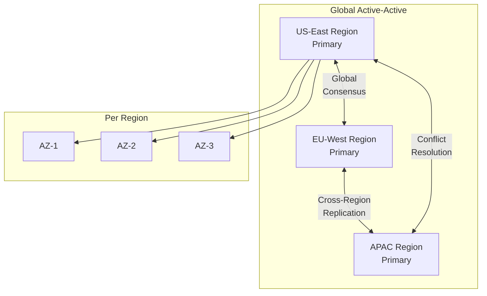
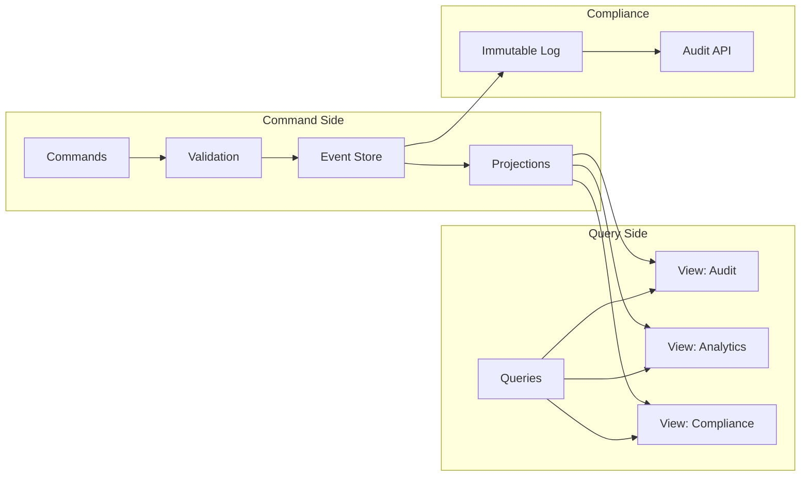
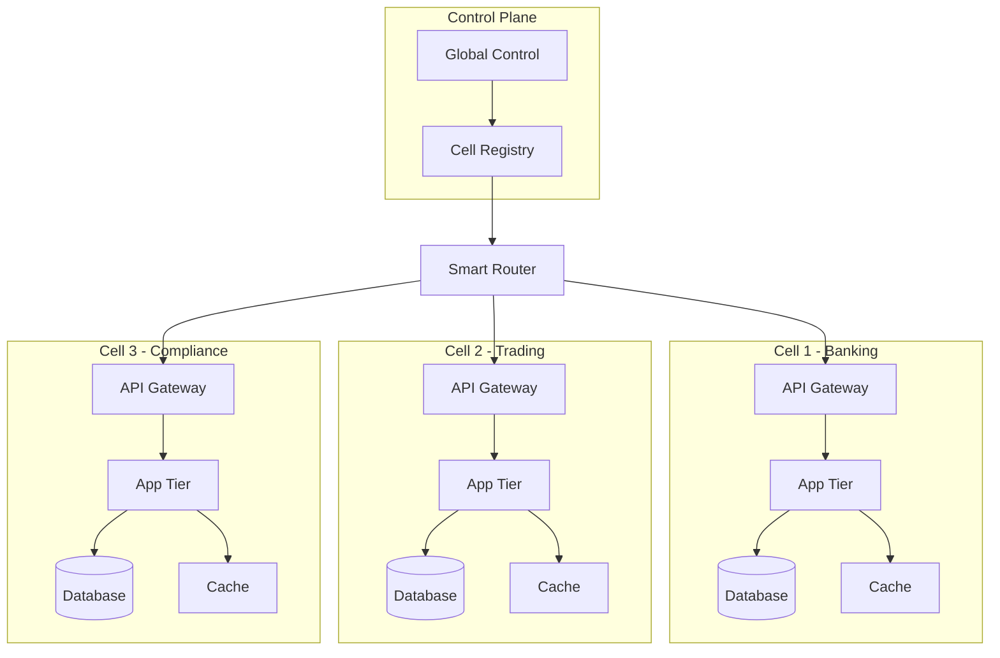
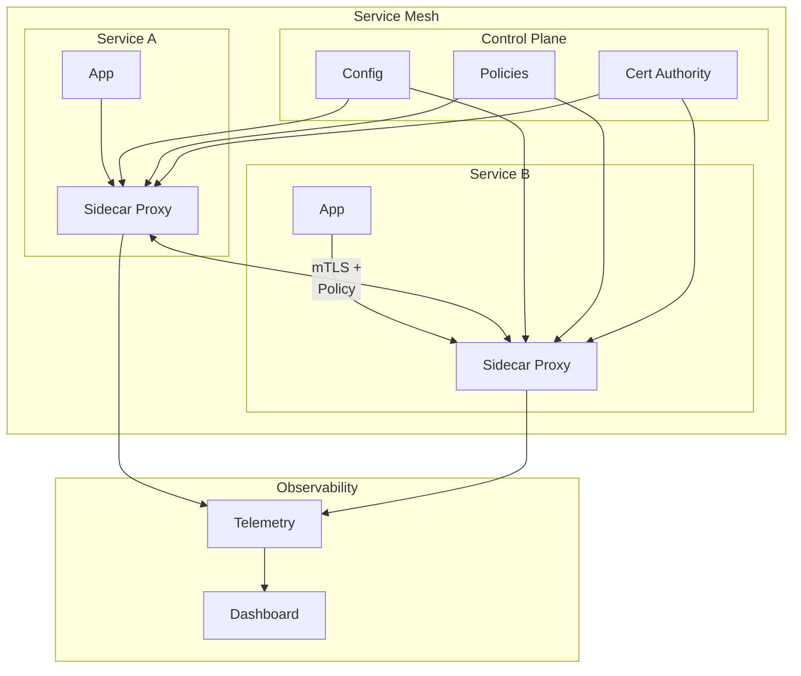
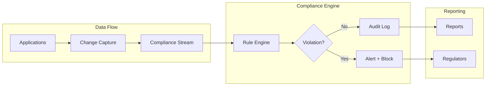

# Enterprise Pattern Pack

!!! danger "🏢 Mission-Critical Excellence"
    **For systems where failure is not an option** • Patterns proven at enterprise scale
    
    This pack contains patterns essential for regulated industries, financial systems, and infrastructure where downtime costs millions per minute. Every pattern here has survived production battles at companies processing trillions in transactions.

## Enterprise Requirements Matrix

| Requirement | Gold Patterns | Implementation Priority |
|-------------|--------------|------------------------|
| **99.999% Availability** | Circuit Breaker, Bulkhead, Multi-Region | Day 1 |
| **Zero Data Loss** | Event Sourcing, WAL, Consensus | Day 1 |
| **Audit Compliance** | CQRS, Event Sourcing, CDC | Week 1 |
| **Disaster Recovery** | Multi-Region, Geo-Replication, Cell-Based | Week 2 |
| **Security & Isolation** | Service Mesh, API Gateway, Bulkhead | Week 1 |

## The Enterprise Seven

### 1. 🛡️ Multi-Region Active-Active

**Why Enterprise Critical**: Single region = single point of failure



**Enterprise Implementation**:
```python
class MultiRegionOrchestrator:
    def __init__(self):
        self.regions = {
            'us-east': RegionCluster(primary=True),
            'eu-west': RegionCluster(primary=True),
            'ap-south': RegionCluster(primary=True)
        }
        self.global_consensus = GlobalConsensus()
    
    async def write_critical_data(self, data: CriticalData):
        """Write with global consensus"""
        # Local region write (fast)
        local_region = self.get_local_region()
        local_result = await local_region.write(data)
        
        # Global consensus (strong consistency)
        consensus_future = asyncio.create_task(
            self.global_consensus.replicate(data)
        )
        
        # Return after local commit
        # Background: ensure global consensus
        asyncio.create_task(self.monitor_consensus(
            consensus_future, data
        ))
        
        return local_result
```

### 2. 📚 Complete Event Sourcing + CQRS

**Why Enterprise Critical**: Audit trail + performance + compliance



**Financial-Grade Implementation**:
```python
class EnterpriseEventStore:
    def __init__(self):
        self.event_log = DurableAppendOnlyLog()
        self.snapshot_store = SnapshotStore()
        self.encryption = E2EEncryption()
        
    async def append_event(self, event: DomainEvent):
        """Append with compliance guarantees"""
        # Encrypt sensitive data
        encrypted = self.encryption.encrypt(event)
        
        # Add compliance metadata
        compliance_event = ComplianceEvent(
            event=encrypted,
            timestamp=self.get_verified_time(),
            actor=self.get_authenticated_actor(),
            classification=self.classify_data(event),
            retention_policy=self.get_retention_policy(event)
        )
        
        # Durable write with proof
        proof = await self.event_log.append_with_proof(
            compliance_event
        )
        
        # Async compliance reporting
        await self.report_to_compliance_system(proof)
        
        return proof
```

### 3. 🏛️ Cell-Based Architecture

**Why Enterprise Critical**: Blast radius containment + scalability



**Enterprise Cell Implementation**:
```python
class EnterpriseCell:
    def __init__(self, cell_id: str, cell_type: str):
        self.cell_id = cell_id
        self.cell_type = cell_type
        self.health_score = 100
        self.capacity = self.calculate_capacity()
        
    def can_accept_traffic(self) -> bool:
        """Intelligent admission control"""
        return all([
            self.health_score > 70,
            self.capacity.available > 20,
            not self.in_maintenance_window(),
            self.compliance_check_passed()
        ])
    
    async def handle_request(self, request: Request):
        """Process with full isolation"""
        if not self.can_accept_traffic():
            raise CellUnavailable(self.cell_id)
            
        # Cell-local processing
        async with self.resource_limits():
            result = await self.process_isolated(request)
            
        # Compliance logging
        await self.audit_log(request, result)
        
        return result
```

### 4. 🔐 Zero-Trust Service Mesh

**Why Enterprise Critical**: Security + observability + control



### 5. 🏦 Financial-Grade Consensus

**Why Enterprise Critical**: Distributed transactions with guarantees

```python
class FinancialConsensus:
    def __init__(self):
        self.raft = EnterpriseRaft(
            election_timeout=150,  # ms
            heartbeat_interval=50,  # ms
            snapshot_threshold=1_000_000
        )
        
    async def execute_transaction(self, txn: FinancialTransaction):
        """Execute with total ordering guarantee"""
        # Pre-validation
        validation = await self.validate_transaction(txn)
        if not validation.passed:
            raise InvalidTransaction(validation.errors)
            
        # Consensus with proof
        entry = ConsensusEntry(
            transaction=txn,
            timestamp=self.hybrid_clock.now(),
            signatures=self.collect_signatures(txn)
        )
        
        commit_proof = await self.raft.commit(entry)
        
        # Post-consensus validation
        await self.verify_commit(commit_proof)
        
        return TransactionReceipt(
            txn_id=txn.id,
            commit_proof=commit_proof,
            global_order=commit_proof.index
        )
```

### 6. 📊 Real-Time Compliance Monitoring

**Why Enterprise Critical**: Regulatory requirements + instant detection



### 7. 🚨 Disaster Recovery Orchestration

**Why Enterprise Critical**: RTO < 5 minutes, RPO = 0

```python
class DisasterRecoveryOrchestrator:
    def __init__(self):
        self.health_monitor = GlobalHealthMonitor()
        self.failover_controller = FailoverController()
        self.data_validator = DataIntegrityValidator()
        
    async def handle_region_failure(self, failed_region: str):
        """Orchestrate zero-downtime failover"""
        start_time = time.time()
        
        # 1. Verify failure (prevent false positives)
        if not await self.confirm_region_failure(failed_region):
            return
            
        # 2. Stop writes to failed region
        await self.fence_failed_region(failed_region)
        
        # 3. Promote secondary to primary
        new_primary = await self.elect_new_primary(
            exclude=[failed_region]
        )
        
        # 4. Redirect traffic
        await self.update_global_routing(
            failed_region, 
            new_primary
        )
        
        # 5. Verify data integrity
        integrity_check = await self.data_validator.verify(
            new_primary
        )
        
        # 6. Resume operations
        await self.resume_operations(new_primary)
        
        # Ensure < 5 minute RTO
        elapsed = time.time() - start_time
        assert elapsed < 300, f"RTO exceeded: {elapsed}s"
        
        await self.notify_stakeholders(
            FailoverComplete(failed_region, new_primary, elapsed)
        )
```

## Enterprise Implementation Roadmap

### Week 1: Foundation
- [ ] Multi-region infrastructure setup
- [ ] Service mesh deployment
- [ ] Event sourcing framework
- [ ] Consensus algorithm selection

### Week 2: Core Services
- [ ] Cell-based architecture rollout
- [ ] CQRS implementation
- [ ] Compliance monitoring setup
- [ ] Disaster recovery testing

### Week 3: Integration
- [ ] End-to-end testing
- [ ] Compliance validation
- [ ] Performance benchmarking
- [ ] Security audit

### Week 4: Production Readiness
- [ ] Chaos engineering tests
- [ ] Failover drills
- [ ] Load testing at scale
- [ ] Regulatory approval

## Compliance Checklist

### Data Governance
- [ ] Encryption at rest and in transit
- [ ] Data classification implemented
- [ ] Retention policies automated
- [ ] Right to be forgotten support
- [ ] Cross-border data transfer compliance

### Audit & Monitoring
- [ ] Complete audit trail (Event Sourcing)
- [ ] Real-time compliance monitoring
- [ ] Automated compliance reporting
- [ ] Tamper-proof logging
- [ ] Access control audit

### Disaster Recovery
- [ ] RTO < 5 minutes demonstrated
- [ ] RPO = 0 for critical data
- [ ] Multi-region failover tested
- [ ] Data integrity validation
- [ ] Stakeholder communication plan

## Enterprise Metrics

```python
class EnterpriseMetrics:
    """Track what matters for enterprise"""
    
    @property
    def availability_sla(self) -> float:
        """Must exceed 99.999%"""
        return self.calculate_availability()
    
    @property
    def compliance_score(self) -> float:
        """Must be 100%"""
        return self.calculate_compliance()
    
    @property
    def data_integrity(self) -> float:
        """Must be 100%"""
        return self.verify_all_data_integrity()
    
    @property
    def audit_completeness(self) -> float:
        """Must be 100%"""
        return self.verify_audit_trail()
    
    @property
    def security_posture(self) -> str:
        """Must be 'HARDENED'"""
        return self.assess_security()
```

## Production War Stories

<div class="failure-vignette">
<h4>💸 The $50M Consistency Bug</h4>

A major bank's distributed ledger had a race condition in their consensus algorithm. During high-frequency trading, some transactions were applied out of order, causing a $50M discrepancy.

**Root Cause**: Custom consensus algorithm without formal verification

**Fix**: Implemented proven Raft consensus with TLA+ verification

**Lesson**: Never roll your own consensus for financial systems
</div>

## Cost Considerations

| Component | Monthly Cost (1000 TPS) | ROI Justification |
|-----------|------------------------|-------------------|
| Multi-Region | $50,000 | Prevents $10M/hour downtime |
| Service Mesh | $20,000 | Reduces security incidents 95% |
| Event Sourcing | $30,000 | Enables instant audit (saves $2M/year) |
| Monitoring | $15,000 | Prevents compliance fines |
| **Total** | **$115,000** | **Prevents $100M+ in losses** |

## When to Use Enterprise Pack

✅ **Perfect For**:
- Financial services and trading systems
- Healthcare systems with HIPAA requirements  
- Government systems with strict compliance
- Any system where downtime = millions lost
- Regulated industries (finance, healthcare, government)

❌ **Overkill For**:
- Startups without compliance requirements
- Internal tools and dashboards
- Read-heavy content sites
- Systems with relaxed SLAs

## Next Steps

1. 📋 **Assessment**: Use our [Enterprise Readiness Assessment](../tools/enterprise-assessment.md)
2. 🎯 **Prioritization**: Start with consensus + multi-region
3. 🏗️ **Architecture Review**: Ensure cell-based isolation
4. 🔒 **Security Audit**: Implement zero-trust from day 1
5. 📊 **Compliance Framework**: Automate from the start

## Related Resources

- 📚 [Case Studies: Financial Systems](../../case-studies/financial-systems/)
- 🔧 [Tools: Compliance Automation](../../tools/compliance-automation/)
- 📖 [Multi-Region Deep Dive](../multi-region.md)
- 🎓 [Consensus Algorithms](../consensus.md)

---

*"In enterprise systems, 'good enough' isn't good enough. Excellence is the minimum bar."*

---

**Previous**: [📈 Scale Pack](scale-pack.md) | **Up**: [🏠 Pattern Excellence](../index.md)