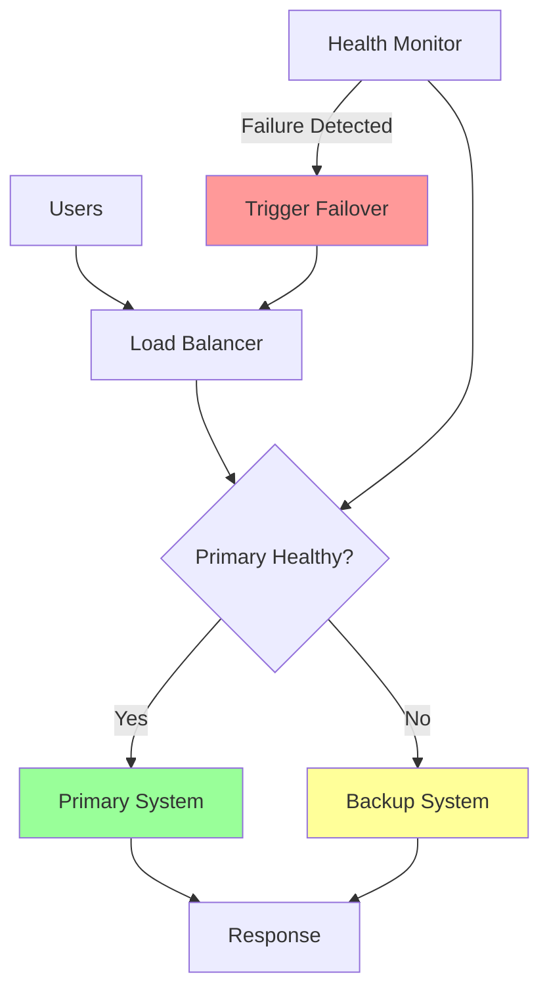
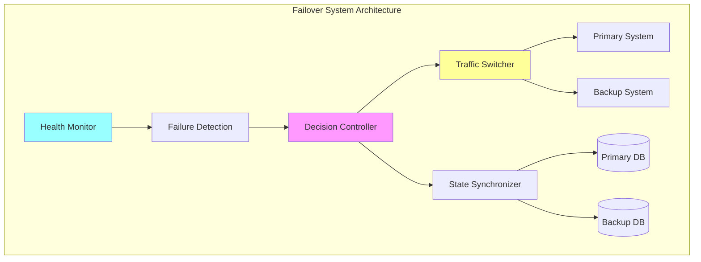

# Failover Pattern

!!! warning "🥈 Silver Tier Pattern"
    **Important but basic HA pattern**
    
    Failover is a fundamental availability pattern but often insufficient alone for modern distributed systems. Consider it as part of a broader resilience strategy including load balancing, circuit breakers, and multi-region deployments.
    
    **Best suited for:**
    - Traditional database clusters
    - Network infrastructure
    - Active-passive configurations
    - Regional disaster recovery

**Seamless switching to backup systems when primary systems fail**

> *"The best failover is one that users never notice."*

---

## Level 1: Intuition

### The Emergency Power Analogy

Failover is like hospital emergency power systems:
- **Primary power**: Normal electrical grid
- **Backup generators**: Start automatically during outages
- **Seamless transition**: Critical equipment never stops
- **Monitoring**: Continuous health checks
- **Restoration**: Switch back when primary recovers

### Failover Flow



### Basic Types

```text
Active-Passive:                Active-Active:
                               
Primary [████████]             Primary [████████]
Backup  [        ]             Backup  [████████]
        (standby)                     (load-sharing)

Advantages:                     Advantages:
• Simple setup                 • No wasted resources
• Clear roles                  • Better performance
• Lower cost                   • Faster failover

Disadvantages:                  Disadvantages:
• Wasted backup capacity       • Complex synchronization
• Slower failover              • Split-brain risk
• Cold start delays            • Higher cost
```

---

## Level 2: Foundation

### Types of Failover

| Type | Primary State | Backup State | Failover Time | Cost | Use Case |
|------|--------------|-------------|---------------|------|----------|
| **Active-Passive** | Running | Standby | 30s-5min | Low | Database servers |
| **Active-Active** | Running | Running | <1s | High | Web applications |
| **Pilot Light** | Running | Minimal | 10-30min | Medium | Disaster recovery |
| **Warm Standby** | Running | Ready | 5-30s | Medium | E-commerce sites |
| **Multi-Zone** | Running | Running | <1s | High | Cloud applications |


### Failover Components



### Implementation Patterns

#### 1. Active-Passive Failover

```python
import asyncio
import time
from typing import Optional, Dict, Any
from dataclasses import dataclass
from enum import Enum

class SystemState(Enum):
    HEALTHY = "healthy"
    DEGRADED = "degraded"
    FAILED = "failed"
    MAINTENANCE = "maintenance"

class FailoverState(Enum):
    PRIMARY_ACTIVE = "primary_active"
    BACKUP_ACTIVE = "backup_active"
    FAILING_OVER = "failing_over"
    RECOVERING = "recovering"

@dataclass
class SystemEndpoint:
    host: str
    port: int
    health_check_url: str
    priority: int = 1
    
class HealthChecker:
    """Monitor system health and detect failures"""
    
    def __init__(self, check_interval: int = 30):
        self.check_interval = check_interval
        self.health_status: Dict[str, SystemState] = {}
        self.last_check: Dict[str, float] = {}
        
    async def check_health(self, endpoint: SystemEndpoint) -> SystemState:
        """Check health of a single endpoint"""
        try:
# Simulate health check
            start_time = time.time()
# In real implementation: make HTTP request to health endpoint
            response_time = time.time() - start_time
            
            if response_time > 5.0:
                return SystemState.DEGRADED
            elif response_time > 10.0:
                return SystemState.FAILED
            else:
                return SystemState.HEALTHY
                
        except Exception as e:
            print(f"Health check failed for {endpoint.host}: {e}")
            return SystemState.FAILED
    
    async def continuous_monitoring(self, endpoints: list[SystemEndpoint]):
        """Continuously monitor all endpoints"""
        while True:
            for endpoint in endpoints:
                endpoint_id = f"{endpoint.host}:{endpoint.port}"
                health = await self.check_health(endpoint)
                self.health_status[endpoint_id] = health
                self.last_check[endpoint_id] = time.time()
                
            await asyncio.sleep(self.check_interval)

class ActivePassiveFailover:
    """Active-Passive failover implementation"""
    
    def __init__(self, primary: SystemEndpoint, backup: SystemEndpoint):
        self.primary = primary
        self.backup = backup
        self.current_state = FailoverState.PRIMARY_ACTIVE
        self.health_checker = HealthChecker()
        self.failover_threshold = 3  # consecutive failures
        self.failure_count = 0
        self.recovery_threshold = 2  # consecutive successes
        self.recovery_count = 0
        
    async def start_monitoring(self):
        """Start health monitoring and failover logic"""
# Start health monitoring
        monitoring_task = asyncio.create_task(
            self.health_checker.continuous_monitoring([self.primary, self.backup])
        )
        
# Start failover decision loop
        decision_task = asyncio.create_task(self._failover_decision_loop())
        
        await asyncio.gather(monitoring_task, decision_task)
    
    async def _failover_decision_loop(self):
        """Main failover decision logic"""
        while True:
            await asyncio.sleep(10)  # Check every 10 seconds
            
            primary_id = f"{self.primary.host}:{self.primary.port}"
            backup_id = f"{self.backup.host}:{self.backup.port}"
            
            primary_health = self.health_checker.health_status.get(
                primary_id, SystemState.FAILED
            )
            backup_health = self.health_checker.health_status.get(
                backup_id, SystemState.FAILED
            )
            
            await self._evaluate_failover(primary_health, backup_health)
    
    async def _evaluate_failover(self, primary_health: SystemState, backup_health: SystemState):
        """Evaluate whether to trigger failover"""
        
        if self.current_state == FailoverState.PRIMARY_ACTIVE:
            if primary_health == SystemState.FAILED:
                self.failure_count += 1
                if self.failure_count >= self.failover_threshold:
                    if backup_health in [SystemState.HEALTHY, SystemState.DEGRADED]:
                        await self._trigger_failover()
            else:
                self.failure_count = 0  # Reset failure count
                
        elif self.current_state == FailoverState.BACKUP_ACTIVE:
            if primary_health == SystemState.HEALTHY:
                self.recovery_count += 1
                if self.recovery_count >= self.recovery_threshold:
                    await self._trigger_recovery()
            else:
                self.recovery_count = 0  # Reset recovery count
    
    async def _trigger_failover(self):
        """Initiate failover to backup system"""
        print("🚨 Triggering failover to backup system")
        self.current_state = FailoverState.FAILING_OVER
        
        try:
# Step 1: Stop sending new traffic to primary
            await self._stop_traffic_to_primary()
            
# Step 2: Ensure backup is ready
            await self._prepare_backup()
            
# Step 3: Switch traffic to backup
            await self._switch_traffic_to_backup()
            
# Step 4: Update state
            self.current_state = FailoverState.BACKUP_ACTIVE
            self.failure_count = 0
            
            print("✅ Failover completed successfully")
            
        except Exception as e:
            print(f"❌ Failover failed: {e}")
# Attempt to restore primary if possible
            self.current_state = FailoverState.PRIMARY_ACTIVE
    
    async def _trigger_recovery(self):
        """Recover back to primary system"""
        print("🔄 Triggering recovery to primary system")
        self.current_state = FailoverState.RECOVERING
        
        try:
# Step 1: Ensure primary is fully ready
            await self._verify_primary_ready()
            
# Step 2: Synchronize any missing data
            await self._synchronize_data()
            
# Step 3: Switch traffic back to primary
            await self._switch_traffic_to_primary()
            
# Step 4: Update state
            self.current_state = FailoverState.PRIMARY_ACTIVE
            self.recovery_count = 0
            
            print("✅ Recovery completed successfully")
            
        except Exception as e:
            print(f"❌ Recovery failed: {e}")
# Stay on backup
            self.current_state = FailoverState.BACKUP_ACTIVE
    
    async def _stop_traffic_to_primary(self):
        """Stop routing traffic to primary"""
# Implementation: Update load balancer configuration
        await asyncio.sleep(1)  # Simulate configuration update
    
    async def _prepare_backup(self):
        """Ensure backup system is ready to handle traffic"""
# Implementation: Start services, warm caches, etc.
        await asyncio.sleep(2)  # Simulate preparation
    
    async def _switch_traffic_to_backup(self):
        """Route traffic to backup system"""
# Implementation: Update DNS/load balancer
        await asyncio.sleep(1)  # Simulate traffic switch
    
    async def _verify_primary_ready(self):
        """Verify primary is fully operational"""
# Implementation: Deep health checks
        await asyncio.sleep(2)  # Simulate verification
    
    async def _synchronize_data(self):
        """Sync any data changes from backup to primary"""
# Implementation: Data synchronization logic
        await asyncio.sleep(3)  # Simulate data sync
    
    async def _switch_traffic_to_primary(self):
        """Route traffic back to primary system"""
# Implementation: Update routing configuration
        await asyncio.sleep(1)  # Simulate traffic switch
    
    def get_active_endpoint(self) -> SystemEndpoint:
        """Get currently active endpoint"""
        if self.current_state in [FailoverState.PRIMARY_ACTIVE, FailoverState.RECOVERING]:
            return self.primary
        else:
            return self.backup
    
    def get_status(self) -> Dict[str, Any]:
        """Get current failover status"""
        return {
            'state': self.current_state.value,
            'active_endpoint': f"{self.get_active_endpoint().host}:{self.get_active_endpoint().port}",
            'failure_count': self.failure_count,
            'recovery_count': self.recovery_count,
            'health_status': self.health_checker.health_status
        }
```

#### 2. Active-Active Failover

```python
class ActiveActiveFailover:
    """Active-Active failover with load distribution"""
    
    def __init__(self, endpoints: list[SystemEndpoint]):
        self.endpoints = endpoints
        self.health_checker = HealthChecker()
        self.weights: Dict[str, float] = {}
        self.active_endpoints: set[str] = set()
        
# Initialize all endpoints as active with equal weight
        for endpoint in endpoints:
            endpoint_id = f"{endpoint.host}:{endpoint.port}"
            self.weights[endpoint_id] = 1.0 / len(endpoints)
            self.active_endpoints.add(endpoint_id)
    
    async def start_monitoring(self):
        """Start health monitoring and load balancing"""
        monitoring_task = asyncio.create_task(
            self.health_checker.continuous_monitoring(self.endpoints)
        )
        
        balancing_task = asyncio.create_task(self._load_balancing_loop())
        
        await asyncio.gather(monitoring_task, balancing_task)
    
    async def _load_balancing_loop(self):
        """Continuously adjust load distribution"""
        while True:
            await asyncio.sleep(5)  # Adjust every 5 seconds
            
            healthy_endpoints = []
            degraded_endpoints = []
            
            for endpoint in self.endpoints:
                endpoint_id = f"{endpoint.host}:{endpoint.port}"
                health = self.health_checker.health_status.get(
                    endpoint_id, SystemState.FAILED
                )
                
                if health == SystemState.HEALTHY:
                    healthy_endpoints.append(endpoint_id)
                elif health == SystemState.DEGRADED:
                    degraded_endpoints.append(endpoint_id)
# Failed endpoints are automatically excluded
            
# Update active endpoints and weights
            await self._update_load_distribution(healthy_endpoints, degraded_endpoints)
    
    async def _update_load_distribution(self, healthy: list[str], degraded: list[str]):
        """Update load distribution based on health"""
        total_endpoints = len(healthy) + len(degraded)
        
        if total_endpoints == 0:
            print("🚨 ALL ENDPOINTS FAILED!")
            return
        
# Clear current active set
        self.active_endpoints.clear()
        
# Healthy endpoints get normal weight
        if healthy:
            healthy_weight = 0.8 / len(healthy)  # 80% of traffic
            for endpoint_id in healthy:
                self.weights[endpoint_id] = healthy_weight
                self.active_endpoints.add(endpoint_id)
        
# Degraded endpoints get reduced weight
        if degraded:
            degraded_weight = 0.2 / len(degraded)  # 20% of traffic
            for endpoint_id in degraded:
                self.weights[endpoint_id] = degraded_weight
                self.active_endpoints.add(endpoint_id)
        
# If only degraded endpoints, give them full weight
        if not healthy and degraded:
            degraded_weight = 1.0 / len(degraded)
            for endpoint_id in degraded:
                self.weights[endpoint_id] = degraded_weight
        
        print(f"Updated load distribution: {self.weights}")
    
    def select_endpoint(self) -> Optional[SystemEndpoint]:
        """Select endpoint based on weighted round-robin"""
        if not self.active_endpoints:
            return None
        
# Simple weighted selection (in production, use proper algorithm)
        import random
        endpoint_id = random.choices(
            list(self.active_endpoints),
            weights=[self.weights[eid] for eid in self.active_endpoints]
        )[0]
        
# Find corresponding endpoint object
        for endpoint in self.endpoints:
            if f"{endpoint.host}:{endpoint.port}" == endpoint_id:
                return endpoint
        
        return None
```

---

## Level 3: Deep Dive

### Advanced Failover Strategies

#### Database Failover with State Management

```python
import asyncio
from datetime import datetime, timedelta
from typing import Dict, List, Optional, Any

class DatabaseFailover:
    """Advanced database failover with state synchronization"""
    
    def __init__(self, primary_db: str, replica_dbs: List[str]):
        self.primary_db = primary_db
        self.replica_dbs = replica_dbs
        self.current_primary = primary_db
        self.replication_lag: Dict[str, float] = {}
        self.last_successful_sync: Dict[str, datetime] = {}
        
    async def monitor_replication_lag(self):
        """Monitor replication lag for each replica"""
        while True:
            for replica in self.replica_dbs:
                try:
# Check replication lag (simplified)
                    lag = await self._check_replication_lag(replica)
                    self.replication_lag[replica] = lag
                    self.last_successful_sync[replica] = datetime.utcnow()
                    
                except Exception as e:
                    print(f"Failed to check replication lag for {replica}: {e}")
# Mark as severely lagged
                    self.replication_lag[replica] = float('inf')
            
            await asyncio.sleep(10)
    
    async def _check_replication_lag(self, replica: str) -> float:
        """Check replication lag in seconds"""
# Implementation: Query database for replication status
# This would typically involve checking LSN, timestamps, etc.
        return 0.5  # Simulated lag
    
    async def initiate_database_failover(self) -> str:
        """Failover to best available replica"""
        print(f"🚨 Initiating database failover from {self.current_primary}")
        
# Step 1: Find best replica
        best_replica = self._select_best_replica()
        if not best_replica:
            raise Exception("No suitable replica available for failover")
        
# Step 2: Promote replica to primary
        try:
            await self._promote_replica(best_replica)
            old_primary = self.current_primary
            self.current_primary = best_replica
            
# Step 3: Update application connections
            await self._update_connection_strings(best_replica)
            
# Step 4: Reconfigure replication
            await self._reconfigure_replication(old_primary, best_replica)
            
            print(f"✅ Database failover completed. New primary: {best_replica}")
            return best_replica
            
        except Exception as e:
            print(f"❌ Database failover failed: {e}")
            raise
    
    def _select_best_replica(self) -> Optional[str]:
        """Select replica with lowest lag and recent sync"""
        candidates = []
        
        for replica in self.replica_dbs:
            lag = self.replication_lag.get(replica, float('inf'))
            last_sync = self.last_successful_sync.get(replica)
            
# Only consider replicas with reasonable lag and recent sync
            if (lag < 60.0 and last_sync and 
                datetime.utcnow() - last_sync < timedelta(minutes=5)):
                candidates.append((replica, lag))
        
        if not candidates:
            return None
        
# Return replica with lowest lag
        candidates.sort(key=lambda x: x[1])
        return candidates[0][0]
    
    async def _promote_replica(self, replica: str):
        """Promote replica to primary"""
        print(f"Promoting {replica} to primary")
# Implementation: Database-specific promotion commands
        await asyncio.sleep(2)  # Simulate promotion time
    
    async def _update_connection_strings(self, new_primary: str):
        """Update application connection strings"""
        print(f"Updating connections to point to {new_primary}")
# Implementation: Update service discovery, config, etc.
        await asyncio.sleep(1)
    
    async def _reconfigure_replication(self, old_primary: str, new_primary: str):
        """Reconfigure replication topology"""
        print(f"Reconfiguring replication: {new_primary} -> others")
# Implementation: Set up replication from new primary
        await asyncio.sleep(3)
```

#### Multi-Region Failover

```python
class MultiRegionFailover:
    """Failover across geographic regions"""
    
    def __init__(self, regions: Dict[str, Dict[str, Any]]):
        self.regions = regions  # region_name -> {endpoints, priority, latency}
        self.active_region = None
        self.failover_policies = {
            'latency_threshold': 500,  # ms
            'error_rate_threshold': 0.05,  # 5%
            'min_healthy_endpoints': 2
        }
        
    async def select_optimal_region(self, user_location: Dict[str, float]) -> str:
        """Select best region based on user location and health"""
        region_scores = {}
        
        for region_name, region_info in self.regions.items():
# Calculate latency score (lower is better)
            estimated_latency = self._estimate_latency(user_location, region_info['location'])
            
# Check region health
            health_score = await self._check_region_health(region_name)
            
# Combined score (lower is better)
            total_score = estimated_latency + (1000 * (1 - health_score))
            region_scores[region_name] = total_score
        
# Select region with best score
        best_region = min(region_scores.keys(), key=lambda r: region_scores[r])
        return best_region
    
    def _estimate_latency(self, user_loc: Dict[str, float], region_loc: Dict[str, float]) -> float:
        """Estimate latency based on geographic distance"""
# Simplified distance calculation
        lat_diff = abs(user_loc['lat'] - region_loc['lat'])
        lon_diff = abs(user_loc['lon'] - region_loc['lon'])
        distance = (lat_diff**2 + lon_diff**2)**0.5
        
# Rough latency estimate: ~50ms per 1000km
        return distance * 50
    
    async def _check_region_health(self, region_name: str) -> float:
        """Check overall health of a region (0-1 score)"""
        region_info = self.regions[region_name]
        healthy_endpoints = 0
        total_endpoints = len(region_info['endpoints'])
        
        for endpoint in region_info['endpoints']:
            if await self._is_endpoint_healthy(endpoint):
                healthy_endpoints += 1
        
        return healthy_endpoints / total_endpoints if total_endpoints > 0 else 0
    
    async def _is_endpoint_healthy(self, endpoint: str) -> bool:
        """Check if single endpoint is healthy"""
# Implementation: Health check logic
        return True  # Simplified
```

### Failover Testing Strategies

```python
class FailoverTester:
    """Automated failover testing (Chaos Engineering)"""
    
    def __init__(self, failover_system):
        self.failover_system = failover_system
        self.test_scenarios = [
            'primary_crash',
            'network_partition',
            'gradual_degradation',
            'cascading_failure',
            'split_brain'
        ]
    
    async def run_failover_drill(self, scenario: str):
        """Execute specific failover test scenario"""
        print(f"🧪 Starting failover drill: {scenario}")
        
        start_time = time.time()
        
        if scenario == 'primary_crash':
            await self._simulate_primary_crash()
        elif scenario == 'network_partition':
            await self._simulate_network_partition()
        elif scenario == 'gradual_degradation':
            await self._simulate_gradual_degradation()
        elif scenario == 'cascading_failure':
            await self._simulate_cascading_failure()
        elif scenario == 'split_brain':
            await self._simulate_split_brain()
        
        failover_time = time.time() - start_time
        
# Verify system recovered
        recovery_success = await self._verify_recovery()
        
        results = {
            'scenario': scenario,
            'failover_time': failover_time,
            'recovery_success': recovery_success,
            'timestamp': datetime.utcnow()
        }
        
        print(f"✅ Drill completed: {results}")
        return results
    
    async def _simulate_primary_crash(self):
        """Simulate sudden primary system failure"""
# Implementation: Kill primary process/connection
        await asyncio.sleep(1)
    
    async def _simulate_network_partition(self):
        """Simulate network split between primary and backup"""
# Implementation: Block network traffic
        await asyncio.sleep(2)
    
    async def _simulate_gradual_degradation(self):
        """Simulate slow performance degradation"""
# Implementation: Introduce increasing latency
        for delay in [0.1, 0.5, 1.0, 2.0]:
            await asyncio.sleep(delay)
    
    async def _simulate_cascading_failure(self):
        """Simulate multiple system failures"""
# Implementation: Sequential component failures
        await asyncio.sleep(3)
    
    async def _simulate_split_brain(self):
        """Simulate split-brain scenario"""
# Implementation: Isolate systems causing dual-active
        await asyncio.sleep(2)
    
    async def _verify_recovery(self) -> bool:
        """Verify system has properly recovered"""
# Implementation: Comprehensive health checks
        return True
```

---

## Level 4: Expert

### Production Case Study: Netflix's Regional Failover

Netflix operates one of the world's most sophisticated failover systems, handling 200M+ subscribers across multiple AWS regions.

```python
class NetflixInspiredFailover:
    """Netflix-style regional failover system"""
    
    def __init__(self):
        self.regions = {
            'us-east-1': {'priority': 1, 'capacity': 100},
            'us-west-2': {'priority': 2, 'capacity': 80},
            'eu-west-1': {'priority': 3, 'capacity': 60}
        }
        self.circuit_breakers = {}
        self.traffic_percentages = {}
        self.chaos_engineering = True
        
    async def intelligent_failover(self, user_request: Dict[str, Any]) -> str:
        """Netflix-style intelligent failover with multiple factors"""
        
# Factor 1: User location
        user_region = self._determine_user_region(user_request)
        
# Factor 2: Content availability
        content_regions = await self._check_content_availability(
            user_request.get('content_id')
        )
        
# Factor 3: Regional capacity
        available_capacity = await self._check_regional_capacity()
        
# Factor 4: Circuit breaker states
        healthy_regions = self._get_healthy_regions()
        
# Combine factors to select optimal region
        optimal_region = self._select_optimal_region(
            user_region, content_regions, available_capacity, healthy_regions
        )
        
        return optimal_region
    
    def _determine_user_region(self, request: Dict[str, Any]) -> str:
        """Determine user's optimal region based on location"""
# Implementation: GeoIP lookup, CDN edge location, etc.
        return 'us-east-1'
    
    async def _check_content_availability(self, content_id: str) -> List[str]:
        """Check which regions have the requested content"""
# Implementation: Query content catalog service
        return ['us-east-1', 'us-west-2']
    
    async def _check_regional_capacity(self) -> Dict[str, float]:
        """Check available capacity in each region"""
# Implementation: Query auto-scaling groups, ELB metrics
        return {
            'us-east-1': 0.85,  # 85% utilized
            'us-west-2': 0.60,  # 60% utilized
            'eu-west-1': 0.40   # 40% utilized
        }
    
    def _get_healthy_regions(self) -> List[str]:
        """Get regions that are healthy according to circuit breakers"""
# Implementation: Check circuit breaker states
        return ['us-east-1', 'us-west-2', 'eu-west-1']
    
    def _select_optimal_region(self, user_region: str, content_regions: List[str], 
                             capacity: Dict[str, float], healthy: List[str]) -> str:
        """Select optimal region using weighted scoring"""
        scores = {}
        
        for region in healthy:
            score = 0
            
# Proximity bonus
            if region == user_region:
                score += 100
            
# Content availability bonus
            if region in content_regions:
                score += 50
            
# Capacity penalty (prefer less utilized regions)
            score -= capacity.get(region, 1.0) * 30
            
# Priority bonus
            score += (4 - self.regions[region]['priority']) * 20
            
            scores[region] = score
        
# Return region with highest score
        return max(scores.keys(), key=lambda r: scores[r])
```

### Automated Failover Orchestration

```python
class FailoverOrchestrator:
    """Orchestrate complex multi-service failovers"""
    
    def __init__(self):
        self.runbooks = {
            'database_failover': [
                'stop_writes_to_primary',
                'verify_replica_sync',
                'promote_replica',
                'update_dns_records',
                'restart_app_servers',
                'verify_functionality'
            ],
            'region_failover': [
                'drain_traffic_gradually',
                'backup_local_state',
                'replicate_to_target_region',
                'switch_dns_to_target',
                'verify_cross_region_connectivity',
                'cleanup_old_region'
            ]
        }
        
    async def execute_failover_runbook(self, failover_type: str, context: Dict[str, Any]):
        """Execute predefined failover runbook"""
        
        if failover_type not in self.runbooks:
            raise ValueError(f"Unknown failover type: {failover_type}")
        
        steps = self.runbooks[failover_type]
        results = []
        
        for step in steps:
            try:
                print(f"Executing: {step}")
                result = await self._execute_step(step, context)
                results.append({'step': step, 'success': True, 'result': result})
                
# Wait between steps for system stabilization
                await asyncio.sleep(5)
                
            except Exception as e:
                print(f"❌ Step failed: {step} - {e}")
                results.append({'step': step, 'success': False, 'error': str(e)})
                
# Decide whether to continue or abort
                if await self._should_abort_failover(step, e, context):
                    print("🛑 Aborting failover due to critical step failure")
                    break
        
        return results
    
    async def _execute_step(self, step: str, context: Dict[str, Any]) -> Any:
        """Execute individual failover step"""
        if step == 'stop_writes_to_primary':
            return await self._stop_database_writes(context['primary_db'])
        elif step == 'verify_replica_sync':
            return await self._verify_replica_synchronization(context['replicas'])
        elif step == 'promote_replica':
            return await self._promote_database_replica(context['target_replica'])
        elif step == 'update_dns_records':
            return await self._update_dns_records(context['dns_changes'])
        elif step == 'restart_app_servers':
            return await self._restart_application_servers(context['app_servers'])
        elif step == 'verify_functionality':
            return await self._verify_system_functionality(context['test_endpoints'])
        
# Add more step implementations as needed
        return f"Executed {step}"
    
    async def _should_abort_failover(self, failed_step: str, error: Exception, 
                                   context: Dict[str, Any]) -> bool:
        """Determine if failover should be aborted"""
        critical_steps = ['promote_replica', 'update_dns_records']
        return failed_step in critical_steps
    
    async def _stop_database_writes(self, primary_db: str):
        """Stop writes to primary database"""
        print(f"Stopping writes to {primary_db}")
# Implementation: Set database to read-only mode
        return "Database writes stopped"
    
    async def _verify_replica_synchronization(self, replicas: List[str]):
        """Verify all replicas are synchronized"""
        print(f"Verifying sync for replicas: {replicas}")
# Implementation: Check replication lag
        return "All replicas synchronized"
    
    async def _promote_database_replica(self, replica: str):
        """Promote replica to primary"""
        print(f"Promoting {replica} to primary")
# Implementation: Database promotion commands
        return f"{replica} promoted to primary"
```

---

## Level 5: Mastery

### Theoretical Foundations

#### Failover Mathematics

```python
import math
from typing import Tuple

def calculate_system_availability(component_availabilities: List[float], 
                                failover_time: float, 
                                detection_time: float) -> float:
    """
    Calculate overall system availability with failover
    
    Formula: A_system = A_primary + A_backup * (1 - A_primary) * (1 - T_failover/T_total)
    Where T_failover includes detection + switching time
    """
    
    if len(component_availabilities) < 2:
        return component_availabilities[0] if component_availabilities else 0
    
    primary_availability = component_availabilities[0]
    backup_availability = component_availabilities[1]
    
# Convert failover time to unavailability ratio
# Assuming monthly calculation (720 hours)
    total_time_hours = 720
    failover_unavailability = (detection_time + failover_time) / total_time_hours
    
# Calculate combined availability
    system_availability = (
        primary_availability + 
        backup_availability * (1 - primary_availability) * (1 - failover_unavailability)
    )
    
    return min(system_availability, 1.0)

def optimal_failover_threshold(false_positive_cost: float, 
                             false_negative_cost: float,
                             primary_failure_rate: float) -> float:
    """
    Calculate optimal failover threshold using decision theory
    
    Balances cost of unnecessary failovers vs cost of delayed failovers
    """
    
# Bayes' optimal threshold
    threshold = math.log(false_positive_cost / false_negative_cost) / primary_failure_rate
    
    return max(0, threshold)

# Example calculations
component_avails = [0.999, 0.995]  # Primary: 99.9%, Backup: 99.5%
failover_time = 0.5  # 30 minutes
detection_time = 0.17  # 10 minutes

system_availability = calculate_system_availability(
    component_avails, failover_time, detection_time
)

print(f"System availability with failover: {system_availability:.6f}")
print(f"System uptime: {system_availability * 100:.4f}%")
print(f"Downtime per month: {(1 - system_availability) * 720:.2f} hours")
```

### Economics of Failover

```python
class FailoverEconomics:
    """Economic analysis of failover strategies"""
    
    def __init__(self):
        self.costs = {
            'infrastructure_hourly': 100,  # Cost per hour for backup infrastructure
            'data_transfer_gb': 0.09,      # Cost per GB of data transfer
            'engineer_hour': 150,          # Cost per engineer hour
            'downtime_per_minute': 1000,   # Revenue lost per minute of downtime
        }
    
    def calculate_failover_roi(self, scenario: Dict[str, Any]) -> Dict[str, float]:
        """Calculate ROI of implementing failover"""
        
# Costs of implementing failover
        implementation_costs = self._calculate_implementation_costs(scenario)
        ongoing_costs = self._calculate_ongoing_costs(scenario)
        
# Benefits (avoided downtime costs)
        avoided_downtime = self._calculate_avoided_downtime(scenario)
        
# ROI calculation
        total_costs = implementation_costs + ongoing_costs * 12  # Annual
        annual_benefits = avoided_downtime * 12  # Annual
        
        roi = (annual_benefits - total_costs) / total_costs * 100
        payback_months = total_costs / (avoided_downtime - ongoing_costs)
        
        return {
            'implementation_costs': implementation_costs,
            'monthly_ongoing_costs': ongoing_costs,
            'monthly_benefits': avoided_downtime,
            'annual_roi_percent': roi,
            'payback_months': payback_months
        }
    
    def _calculate_implementation_costs(self, scenario: Dict[str, Any]) -> float:
        """Calculate one-time implementation costs"""
        engineer_weeks = scenario.get('engineer_weeks', 4)
        infrastructure_setup = scenario.get('infrastructure_setup', 5000)
        
        return (engineer_weeks * 40 * self.costs['engineer_hour'] + 
                infrastructure_setup)
    
    def _calculate_ongoing_costs(self, scenario: Dict[str, Any]) -> float:
        """Calculate monthly ongoing costs"""
        backup_hours = scenario.get('backup_hours_per_month', 720)  # Full month
        data_sync_gb = scenario.get('data_sync_gb_per_month', 1000)
        maintenance_hours = scenario.get('maintenance_hours_per_month', 8)
        
        return (backup_hours * self.costs['infrastructure_hourly'] +
                data_sync_gb * self.costs['data_transfer_gb'] +
                maintenance_hours * self.costs['engineer_hour'])
    
    def _calculate_avoided_downtime(self, scenario: Dict[str, Any]) -> float:
        """Calculate monthly downtime costs avoided"""
        mtbf_hours = scenario.get('mtbf_hours', 2160)  # Mean time between failures
        mttr_without_failover = scenario.get('mttr_without_failover_minutes', 60)
        mttr_with_failover = scenario.get('mttr_with_failover_minutes', 5)
        
# Calculate expected monthly downtime avoided
        monthly_failures = 720 / mtbf_hours  # Expected failures per month
        downtime_avoided_per_failure = mttr_without_failover - mttr_with_failover
        
        monthly_downtime_avoided = monthly_failures * downtime_avoided_per_failure
        
        return monthly_downtime_avoided * self.costs['downtime_per_minute']

# Example economic analysis
economics = FailoverEconomics()
scenario = {
    'engineer_weeks': 6,
    'infrastructure_setup': 10000,
    'backup_hours_per_month': 720,
    'data_sync_gb_per_month': 2000,
    'maintenance_hours_per_month': 12,
    'mtbf_hours': 1440,  # Failure every 2 months
    'mttr_without_failover_minutes': 120,  # 2 hours to recover manually
    'mttr_with_failover_minutes': 5   # 5 minutes with automated failover
}

roi_analysis = economics.calculate_failover_roi(scenario)
print("Failover ROI Analysis:")
for key, value in roi_analysis.items():
    print(f"  {key}: ${value:,.2f}" if 'cost' in key or 'benefit' in key 
          else f"  {key}: {value:.2f}")
```

### Future Directions

1. **AI-Driven Failover**: Machine learning models predicting optimal failover timing
2. **Quantum-Safe Failover**: Failover systems resistant to quantum computing attacks
3. **Edge-Native Failover**: Failover strategies optimized for edge computing environments
4. **Serverless Failover**: Failover patterns for Function-as-a-Service architectures

---

## Quick Reference

### Failover Decision Matrix

| Scenario | Recommended Type | Typical RTO | Typical RPO | Cost |
|----------|------------------|-------------|-------------|------|
| **Database** | Active-Passive | 5-30 min | < 1 min | Medium |
| **Web Application** | Active-Active | < 1 min | 0 | High |
| **API Gateway** | Multi-Active | < 1 sec | 0 | High |
| **File Storage** | Pilot Light | 30-60 min | < 15 min | Low |
| **Analytics** | Warm Standby | 10-30 min | < 5 min | Medium |


### Implementation Checklist

- [ ] Define RTO (Recovery Time Objective) and RPO (Recovery Point Objective)
- [ ] Implement comprehensive health checking
- [ ] Set up automated failover triggers
- [ ] Configure backup system provisioning
- [ ] Implement data synchronization
- [ ] Set up traffic routing mechanisms
- [ ] Create failover runbooks
- [ ] Test failover procedures regularly
- [ ] Monitor failover metrics
- [ ] Plan for failback procedures
- [ ] Document escalation procedures
- [ ] Train operations team

### Common Anti-Patterns

1. **Untested Failover**: Implementing failover without regular testing
2. **Split-Brain Risk**: Not preventing multiple active primaries
3. **Data Loss on Failover**: Insufficient replication or synchronization
4. **Manual Failover Only**: Requiring human intervention for critical systems
5. **Symmetric Failover**: Assuming backup has same capacity as primary

---

## Related Patterns

- [Health Check](health-check.md) - Detecting when failover is needed
- [Circuit Breaker](circuit-breaker.md) - Automatic failure isolation
- [Load Balancing](load-balancing.md) - Distributing traffic during normal operations
- [Service Discovery](service-discovery.md) - Finding healthy service instances
- [Bulkhead](bulkhead.md) - Isolating failures to prevent cascading

## Related Laws & Pillars

### Fundamental Laws
This pattern directly addresses:

- **[Law 1: Correlated Failure ⛓️](../part1-axioms/law1-failure/)**: Ensures backup systems have independent failure modes
- **[Law 2: Asynchronous Reality ⏱️](../part1-axioms/law2-asynchrony/)**: Handles network delays during failover transitions
- **[Law 5: Distributed Knowledge 🧩](../part1-axioms/law5-epistemology/)**: Manages split-brain scenarios during failover
- **[Law 7: Economic Reality 💰](../part1-axioms/law7-economics/)**: Balances redundancy costs vs availability benefits

### Foundational Pillars
Failover implements:

- **[Pillar 2: Distribution of State 📊](../part2-pillars/state/)**: Replicates state across primary and backup systems
- **[Pillar 4: Distribution of Control 🎮](../part2-pillars/control/)**: Coordinates failover decisions and transitions
- **[Pillar 5: Distribution of Intelligence 🤖](../part2-pillars/intelligence/)**: Detects failures and orchestrates recovery

---

*"The measure of a good failover system is not whether it fails over, but whether anyone notices when it does."*

---

**Previous**: [← Load Shedding](load-shedding.md) | **Next**: [Fault Tolerance →](fault-tolerance.md)