# Fault Tolerance Pattern

**Building systems that continue operating properly despite component failures**

> *"The question is not whether your system will fail, but how gracefully it will handle failure when it does."*

---

## 🎯 Level 1: Intuition

### The Ship Analogy

Fault tolerance is like designing an unsinkable ship:
- **Watertight compartments**: Failures isolated to sections (Bulkhead pattern)
- **Multiple pumps**: Redundancy for critical systems
- **Emergency procedures**: Automatic responses to problems
- **Damage control teams**: Monitoring and repair mechanisms
- **Lifeboats**: Graceful degradation when all else fails

### Fault Tolerance Hierarchy


### Core Principles

```text
1. Fail-Safe Defaults
   ❌ System crashes → ❌ No response
   ✅ Component fails → ✅ Safe fallback

2. Redundancy
   ❌ Single database → ❌ Single point of failure
   ✅ Multiple replicas → ✅ Automatic failover

3. Timeouts & Limits
   ❌ Infinite wait → ❌ Resource exhaustion
   ✅ Circuit breakers → ✅ Fast failure

4. Monitoring & Alerting
   ❌ Silent failures → ❌ Unknown problems
   ✅ Health checks → ✅ Proactive response
```

---

## 🏗️ Level 2: Foundation

### Types of Faults

| Fault Type | Examples | Impact | Mitigation |
|------------|----------|--------|------------|
| **Hardware** | Disk failure, Memory corruption | Service unavailable | Redundancy, RAID |
| **Software** | Bugs, Memory leaks | Incorrect behavior | Testing, Monitoring |
| **Network** | Partitions, Packet loss | Communication failure | Retries, Timeouts |
| **Human** | Configuration errors | Unpredictable impact | Automation, Validation |
| **Environmental** | Power outage, Cooling failure | System shutdown | UPS, Multi-DC |

### Fault Tolerance Patterns

```mermaid
graph TB
    subgraph "Fault Tolerance Pattern Ecosystem"
        CB[Circuit Breaker<br/>🔌 Stop cascade failures]
        TO[Timeout<br/>⏰ Bounded waiting]
        RT[Retry<br/>🔄 Handle transient faults]
        BH[Bulkhead<br/>🚢 Isolate failures]
        FO[Failover<br/>🔄 Switch to backup]
        GD[Graceful Degradation<br/>📉 Reduced functionality]
        
        CB --> BH
        TO --> RT
        RT --> FO
        BH --> GD
        FO --> GD
    end
    
    style CB fill:#ff9999
    style TO fill:#99ccff
    style RT fill:#99ff99
    style BH fill:#ffcc99
    style FO fill:#ff99ff
    style GD fill:#cccccc
```



### Implementation Framework

```python
import asyncio
import time
import logging
from typing import Dict, List, Optional, Any, Callable
from dataclasses import dataclass, field
from enum import Enum
from datetime import datetime, timedelta
import random

class FaultType(Enum):
    TRANSIENT = "transient"        # Temporary, likely to resolve
    INTERMITTENT = "intermittent"  # Recurring, pattern-based
    PERMANENT = "permanent"        # Requires intervention

class HealthStatus(Enum):
    HEALTHY = "healthy"
    DEGRADED = "degraded"
    FAILING = "failing"
    FAILED = "failed"

@dataclass
class FaultContext:
    """Context information about a fault"""
    fault_type: FaultType
    component: str
    timestamp: datetime
    error_message: str
    recovery_actions: List[str] = field(default_factory=list)
    metadata: Dict[str, Any] = field(default_factory=dict)

class FaultTolerantComponent:
    """Base class for fault-tolerant components"""
    
    def __init__(self, name: str, max_retries: int = 3, timeout_seconds: float = 10.0):
        self.name = name
        self.max_retries = max_retries
        self.timeout_seconds = timeout_seconds
        self.health_status = HealthStatus.HEALTHY
        self.fault_history: List[FaultContext] = []
        self.recovery_strategies: Dict[FaultType, Callable] = {}
        
        # Register default recovery strategies
        self.recovery_strategies[FaultType.TRANSIENT] = self._handle_transient_fault
        self.recovery_strategies[FaultType.INTERMITTENT] = self._handle_intermittent_fault
        self.recovery_strategies[FaultType.PERMANENT] = self._handle_permanent_fault
    
    async def execute_with_fault_tolerance(self, operation: Callable, *args, **kwargs) -> Any:
        """Execute operation with comprehensive fault tolerance"""
        
        retry_count = 0
        last_exception = None
        
        while retry_count <= self.max_retries:
            try:
                # Execute with timeout
                result = await asyncio.wait_for(
                    operation(*args, **kwargs),
                    timeout=self.timeout_seconds
                )
                
                # Success - reset health status if needed
                if self.health_status != HealthStatus.HEALTHY:
                    await self._recover_health()
                
                return result
                
            except asyncio.TimeoutError as e:
                fault = FaultContext(
                    fault_type=FaultType.TRANSIENT,
                    component=self.name,
                    timestamp=datetime.utcnow(),
                    error_message=f"Operation timed out after {self.timeout_seconds}s"
                )
                last_exception = e
                
            except ConnectionError as e:
                fault = FaultContext(
                    fault_type=FaultType.INTERMITTENT,
                    component=self.name,
                    timestamp=datetime.utcnow(),
                    error_message=f"Connection failed: {str(e)}"
                )
                last_exception = e
                
            except Exception as e:
                # Determine fault type based on exception
                fault_type = self._classify_fault(e)
                fault = FaultContext(
                    fault_type=fault_type,
                    component=self.name,
                    timestamp=datetime.utcnow(),
                    error_message=str(e)
                )
                last_exception = e
            
            # Record fault
            self.fault_history.append(fault)
            
            # Apply recovery strategy
            should_retry = await self._apply_recovery_strategy(fault)
            
            if not should_retry or retry_count >= self.max_retries:
                break
                
            retry_count += 1
            
            # Exponential backoff
            await asyncio.sleep(min(2 ** retry_count, 30))
        
        # All retries exhausted
        self.health_status = HealthStatus.FAILED
        raise last_exception
    
    def _classify_fault(self, exception: Exception) -> FaultType:
        """Classify fault type based on exception"""
        if isinstance(exception, (asyncio.TimeoutError, ConnectionError)):
            return FaultType.TRANSIENT
        elif isinstance(exception, (OSError, IOError)):
            return FaultType.INTERMITTENT
        else:
            return FaultType.PERMANENT
    
    async def _apply_recovery_strategy(self, fault: FaultContext) -> bool:
        """Apply appropriate recovery strategy"""
        strategy = self.recovery_strategies.get(fault.fault_type)
        if strategy:
            return await strategy(fault)
        return False
    
    async def _handle_transient_fault(self, fault: FaultContext) -> bool:
        """Handle transient faults (usually retry)"""
        logging.warning(f"Transient fault in {self.name}: {fault.error_message}")
        self.health_status = HealthStatus.DEGRADED
        return True  # Retry
    
    async def _handle_intermittent_fault(self, fault: FaultContext) -> bool:
        """Handle intermittent faults (retry with caution)"""
        logging.warning(f"Intermittent fault in {self.name}: {fault.error_message}")
        
        # Check fault frequency
        recent_faults = [f for f in self.fault_history 
                        if datetime.utcnow() - f.timestamp < timedelta(minutes=5)]
        
        if len(recent_faults) > 5:
            logging.error(f"Too many recent faults in {self.name}, marking as failing")
            self.health_status = HealthStatus.FAILING
            return False  # Don't retry
        
        self.health_status = HealthStatus.DEGRADED
        return True  # Retry
    
    async def _handle_permanent_fault(self, fault: FaultContext) -> bool:
        """Handle permanent faults (don't retry, escalate)"""
        logging.error(f"Permanent fault in {self.name}: {fault.error_message}")
        self.health_status = HealthStatus.FAILED
        await self._escalate_fault(fault)
        return False  # Don't retry
    
    async def _recover_health(self):
        """Recover health status after successful operation"""
        logging.info(f"Component {self.name} recovered to healthy state")
        self.health_status = HealthStatus.HEALTHY
    
    async def _escalate_fault(self, fault: FaultContext):
        """Escalate permanent faults to operations team"""
        logging.critical(f"ESCALATION: Permanent fault in {self.name} - {fault.error_message}")
        # In production: Send alerts, create tickets, etc.
```

---

## 🔧 Level 3: Deep Dive

### Advanced Fault Tolerance Patterns

#### 1. Adaptive Circuit Breaker

```python
import statistics
from collections import deque

class AdaptiveCircuitBreaker:
    """Circuit breaker that adapts thresholds based on historical performance"""
    
    def __init__(self, 
                 window_size: int = 100,
                 min_requests: int = 10,
                 initial_threshold: float = 0.5):
        self.window_size = window_size
        self.min_requests = min_requests
        self.failure_threshold = initial_threshold
        
        # State tracking
        self.state = "CLOSED"  # CLOSED, OPEN, HALF_OPEN
        self.failure_count = 0
        self.success_count = 0
        self.last_failure_time = None
        self.open_timeout = 60  # seconds
        
        # Adaptive components
        self.recent_results = deque(maxlen=window_size)
        self.performance_history = deque(maxlen=1000)
        
    async def call(self, operation: Callable) -> Any:
        """Execute operation through adaptive circuit breaker"""
        
        if self.state == "OPEN":
            if self._should_attempt_reset():
                self.state = "HALF_OPEN"
                logging.info("Circuit breaker transitioning to HALF_OPEN")
            else:
                raise Exception("Circuit breaker is OPEN")
        
        start_time = time.time()
        
        try:
            result = await operation()
            
            # Record success
            duration = time.time() - start_time
            self._record_success(duration)
            
            if self.state == "HALF_OPEN":
                self._reset_circuit()
            
            return result
            
        except Exception as e:
            # Record failure
            duration = time.time() - start_time
            self._record_failure(duration)
            
            if self._should_trip():
                self._trip_circuit()
            
            raise
    
    def _record_success(self, duration: float):
        """Record successful operation"""
        self.success_count += 1
        self.recent_results.append(True)
        self.performance_history.append({
            'success': True,
            'duration': duration,
            'timestamp': time.time()
        })
        
        # Adapt threshold based on recent performance
        self._adapt_threshold()
    
    def _record_failure(self, duration: float):
        """Record failed operation"""
        self.failure_count += 1
        self.recent_results.append(False)
        self.last_failure_time = time.time()
        self.performance_history.append({
            'success': False,
            'duration': duration,
            'timestamp': time.time()
        })
        
        # Adapt threshold based on recent performance
        self._adapt_threshold()
    
    def _adapt_threshold(self):
        """Adapt failure threshold based on historical performance"""
        if len(self.recent_results) < self.min_requests:
            return
        
        # Calculate current failure rate
        current_failure_rate = 1 - (sum(self.recent_results) / len(self.recent_results))
        
        # Analyze historical performance
        if len(self.performance_history) >= 100:
            recent_performance = list(self.performance_history)[-100:]
            historical_failure_rate = 1 - (
                sum(1 for p in recent_performance if p['success']) / len(recent_performance)
            )
            
            # Adapt threshold based on normal vs abnormal failure rates
            if historical_failure_rate < 0.1:  # System normally healthy
                self.failure_threshold = max(0.2, historical_failure_rate * 2)
            else:  # System normally unstable
                self.failure_threshold = min(0.8, historical_failure_rate * 1.5)
            
            logging.debug(f"Adapted failure threshold to {self.failure_threshold:.3f}")
    
    def _should_trip(self) -> bool:
        """Determine if circuit should trip"""
        if len(self.recent_results) < self.min_requests:
            return False
        
        failure_rate = 1 - (sum(self.recent_results) / len(self.recent_results))
        return failure_rate >= self.failure_threshold
    
    def _should_attempt_reset(self) -> bool:
        """Determine if circuit should attempt reset"""
        if self.last_failure_time is None:
            return True
        
        return time.time() - self.last_failure_time > self.open_timeout
    
    def _trip_circuit(self):
        """Trip the circuit breaker"""
        self.state = "OPEN"
        logging.warning(f"Circuit breaker TRIPPED - failure rate: {1 - (sum(self.recent_results) / len(self.recent_results)):.3f}")
    
    def _reset_circuit(self):
        """Reset the circuit breaker"""
        self.state = "CLOSED"
        self.failure_count = 0
        self.success_count = 0
        logging.info("Circuit breaker RESET")
```

#### 2. Fault-Tolerant State Machine

```python
class FaultTolerantStateMachine:
    """State machine that handles faults gracefully"""
    
    def __init__(self, initial_state: str):
        self.current_state = initial_state
        self.previous_state = None
        self.transitions = {}
        self.fault_handlers = {}
        self.state_timeouts = {}
        self.last_transition = time.time()
        
    def add_transition(self, from_state: str, to_state: str, 
                      trigger: str, guard: Callable = None):
        """Add state transition"""
        if from_state not in self.transitions:
            self.transitions[from_state] = {}
        
        self.transitions[from_state][trigger] = {
            'to_state': to_state,
            'guard': guard
        }
    
    def add_fault_handler(self, state: str, handler: Callable):
        """Add fault handler for specific state"""
        self.fault_handlers[state] = handler
    
    def set_state_timeout(self, state: str, timeout: float, 
                         timeout_handler: Callable):
        """Set timeout for state with handler"""
        self.state_timeouts[state] = {
            'timeout': timeout,
            'handler': timeout_handler
        }
    
    async def trigger(self, event: str, context: Dict[str, Any] = None) -> bool:
        """Trigger state transition with fault tolerance"""
        context = context or {}
        
        try:
            # Check for state timeout
            await self._check_state_timeout()
            
            # Find transition
            if self.current_state not in self.transitions:
                logging.warning(f"No transitions defined for state {self.current_state}")
                return False
            
            if event not in self.transitions[self.current_state]:
                logging.debug(f"No transition for event {event} in state {self.current_state}")
                return False
            
            transition = self.transitions[self.current_state][event]
            
            # Check guard condition
            if transition['guard'] and not await transition['guard'](context):
                logging.debug(f"Guard condition failed for transition {self.current_state} -> {transition['to_state']}")
                return False
            
            # Execute transition
            await self._execute_transition(transition['to_state'], event, context)
            return True
            
        except Exception as e:
            # Handle fault
            await self._handle_fault(e, event, context)
            return False
    
    async def _execute_transition(self, new_state: str, event: str, context: Dict[str, Any]):
        """Execute state transition"""
        old_state = self.current_state
        self.previous_state = old_state
        self.current_state = new_state
        self.last_transition = time.time()
        
        logging.info(f"State transition: {old_state} -> {new_state} (event: {event})")
        
        # Execute exit actions for old state
        await self._execute_exit_actions(old_state)
        
        # Execute entry actions for new state
        await self._execute_entry_actions(new_state)
    
    async def _handle_fault(self, exception: Exception, event: str, context: Dict[str, Any]):
        """Handle fault during state transition"""
        logging.error(f"Fault in state {self.current_state} during event {event}: {exception}")
        
        # Use fault handler if available
        if self.current_state in self.fault_handlers:
            try:
                await self.fault_handlers[self.current_state](exception, event, context)
            except Exception as handler_error:
                logging.critical(f"Fault handler failed: {handler_error}")
                # Fall back to safe state
                await self._recover_to_safe_state()
        else:
            # No specific handler, try to recover
            await self._recover_to_safe_state()
    
    async def _check_state_timeout(self):
        """Check if current state has timed out"""
        if self.current_state in self.state_timeouts:
            timeout_info = self.state_timeouts[self.current_state]
            elapsed = time.time() - self.last_transition
            
            if elapsed > timeout_info['timeout']:
                logging.warning(f"State {self.current_state} timed out after {elapsed:.2f}s")
                await timeout_info['handler']()
    
    async def _recover_to_safe_state(self):
        """Recover to a safe state"""
        # Try to return to previous state
        if self.previous_state:
            logging.info(f"Recovering to previous state: {self.previous_state}")
            self.current_state = self.previous_state
            self.last_transition = time.time()
        else:
            # Fall back to initial state
            logging.info("Recovering to initial state")
            # Implementation would reset to known good state
    
    async def _execute_exit_actions(self, state: str):
        """Execute actions when exiting a state"""
        # Implementation: Cleanup, save state, etc.
        pass
    
    async def _execute_entry_actions(self, state: str):
        """Execute actions when entering a state"""
        # Implementation: Initialize, load data, etc.
        pass
```

#### 3. Hierarchical Fault Detection

```python
class HierarchicalFaultDetector:
    """Multi-level fault detection with escalation"""
    
    def __init__(self):
        self.detectors = {
            'component': [],     # Individual component health
            'service': [],       # Service-level health
            'system': [],        # System-wide health
            'infrastructure': [] # Infrastructure health
        }
        self.fault_correlation = {}
        self.escalation_rules = {}
        
    def add_detector(self, level: str, detector: Callable):
        """Add fault detector at specific level"""
        if level in self.detectors:
            self.detectors[level].append(detector)
    
    def add_correlation_rule(self, pattern: str, action: Callable):
        """Add rule for correlating related faults"""
        self.fault_correlation[pattern] = action
    
    async def detect_faults(self) -> Dict[str, List[FaultContext]]:
        """Run fault detection at all levels"""
        all_faults = {}
        
        # Run detectors at each level
        for level, detectors in self.detectors.items():
            level_faults = []
            
            for detector in detectors:
                try:
                    faults = await detector()
                    if faults:
                        level_faults.extend(faults)
                except Exception as e:
                    # Detector itself failed
                    fault = FaultContext(
                        fault_type=FaultType.PERMANENT,
                        component=f"detector_{level}",
                        timestamp=datetime.utcnow(),
                        error_message=f"Fault detector failed: {str(e)}"
                    )
                    level_faults.append(fault)
            
            all_faults[level] = level_faults
        
        # Correlate faults across levels
        correlated_faults = await self._correlate_faults(all_faults)
        
        # Apply escalation rules
        await self._apply_escalation(correlated_faults)
        
        return correlated_faults
    
    async def _correlate_faults(self, faults: Dict[str, List[FaultContext]]) -> Dict[str, List[FaultContext]]:
        """Correlate related faults to identify root causes"""
        
        # Simple correlation: group faults by time window
        all_faults_flat = []
        for level_faults in faults.values():
            all_faults_flat.extend(level_faults)
        
        # Sort by timestamp
        all_faults_flat.sort(key=lambda f: f.timestamp)
        
        # Group faults within 5-minute windows
        correlated_groups = []
        current_group = []
        
        for fault in all_faults_flat:
            if not current_group:
                current_group.append(fault)
            else:
                time_diff = fault.timestamp - current_group[0].timestamp
                if time_diff < timedelta(minutes=5):
                    current_group.append(fault)
                else:
                    if len(current_group) > 1:
                        correlated_groups.append(current_group)
                    current_group = [fault]
        
        # Add final group if it has correlations
        if len(current_group) > 1:
            correlated_groups.append(current_group)
        
        # Analyze correlations
        for group in correlated_groups:
            await self._analyze_fault_correlation(group)
        
        return faults
    
    async def _analyze_fault_correlation(self, fault_group: List[FaultContext]):
        """Analyze a group of correlated faults"""
        
        # Look for patterns
        components = [f.component for f in fault_group]
        error_messages = [f.error_message for f in fault_group]
        
        # Check for cascading failures
        if len(set(components)) == len(components):
            # Different components failing - likely cascading
            logging.warning(f"Detected cascading failure across components: {components}")
            
        # Check for common root cause
        common_errors = set(error_messages)
        if len(common_errors) == 1:
            logging.warning(f"Multiple components with same error - potential root cause: {list(common_errors)[0]}")
    
    async def _apply_escalation(self, faults: Dict[str, List[FaultContext]]):
        """Apply escalation rules based on fault patterns"""
        
        # Count total faults
        total_faults = sum(len(level_faults) for level_faults in faults.values())
        
        # Escalate based on fault count and severity
        if total_faults > 10:
            logging.critical(f"HIGH FAULT RATE: {total_faults} faults detected")
            # Trigger incident response
            
        # Check for system-wide failures
        if faults.get('system') or faults.get('infrastructure'):
            logging.critical("SYSTEM-LEVEL FAULT DETECTED - escalating to on-call")
            # Page on-call engineer
```

---

## 🚀 Level 4: Expert

### Production Case Study: Netflix's Fault Tolerance

Netflix processes 1B+ hours of video daily with 99.9%+ availability using sophisticated fault tolerance.

```python
class NetflixFaultTolerance:
    """Netflix-inspired fault tolerance system"""
    
    def __init__(self):
        self.services = {
            'user_service': {'circuit_breaker': AdaptiveCircuitBreaker(), 'fallback': self._user_fallback},
            'recommendation': {'circuit_breaker': AdaptiveCircuitBreaker(), 'fallback': self._recommendation_fallback},
            'video_service': {'circuit_breaker': AdaptiveCircuitBreaker(), 'fallback': self._video_fallback},
            'billing': {'circuit_breaker': AdaptiveCircuitBreaker(), 'fallback': self._billing_fallback}
        }
        
        self.chaos_engineering = True
        self.regional_failover = True
        self.graceful_degradation = True
        
    async def get_user_homepage(self, user_id: str) -> Dict[str, Any]:
        """Get user homepage with comprehensive fault tolerance"""
        
        homepage = {
            'user_id': user_id,
            'timestamp': datetime.utcnow().isoformat(),
            'status': 'partial'  # Assume partial until proven complete
        }
        
        # Parallel execution with fault tolerance
        tasks = {
            'user_profile': self._get_user_profile_safe(user_id),
            'recommendations': self._get_recommendations_safe(user_id),
            'continue_watching': self._get_continue_watching_safe(user_id),
            'trending': self._get_trending_safe(),
            'billing_status': self._get_billing_status_safe(user_id)
        }
        
        # Execute all tasks with timeouts
        results = await asyncio.gather(*tasks.values(), return_exceptions=True)
        
        # Process results with fallbacks
        for i, (task_name, result) in enumerate(zip(tasks.keys(), results)):
            if isinstance(result, Exception):
                logging.warning(f"Task {task_name} failed: {result}")
                # Use fallback data
                homepage[task_name] = await self._get_fallback_data(task_name, user_id)
                homepage[f'{task_name}_degraded'] = True
            else:
                homepage[task_name] = result
        
        # Determine overall status
        failed_tasks = sum(1 for result in results if isinstance(result, Exception))
        if failed_tasks == 0:
            homepage['status'] = 'complete'
        elif failed_tasks < len(tasks) / 2:
            homepage['status'] = 'degraded'
        else:
            homepage['status'] = 'minimal'
        
        return homepage
    
    async def _get_user_profile_safe(self, user_id: str) -> Dict[str, Any]:
        """Get user profile with fault tolerance"""
        service = self.services['user_service']
        
        try:
            return await service['circuit_breaker'].call(
                lambda: self._call_user_service(user_id)
            )
        except:
            return await service['fallback'](user_id)
    
    async def _get_recommendations_safe(self, user_id: str) -> List[Dict[str, Any]]:
        """Get recommendations with multiple fallback strategies"""
        service = self.services['recommendation']
        
        try:
            # Try personalized recommendations
            return await service['circuit_breaker'].call(
                lambda: self._call_recommendation_service(user_id)
            )
        except:
            # Fallback to cached recommendations
            cached = await self._get_cached_recommendations(user_id)
            if cached:
                return cached
            
            # Fallback to popular content
            return await service['fallback'](user_id)
    
    async def _user_fallback(self, user_id: str) -> Dict[str, Any]:
        """Fallback user profile data"""
        return {
            'user_id': user_id,
            'name': 'Netflix User',
            'preferences': ['Action', 'Drama'],  # Default preferences
            'source': 'fallback'
        }
    
    async def _recommendation_fallback(self, user_id: str) -> List[Dict[str, Any]]:
        """Fallback recommendations - popular content"""
        return [
            {'title': 'Popular Movie 1', 'type': 'movie', 'source': 'trending'},
            {'title': 'Popular Show 1', 'type': 'series', 'source': 'trending'},
            {'title': 'Popular Documentary', 'type': 'documentary', 'source': 'trending'}
        ]
    
    async def _get_fallback_data(self, task_name: str, user_id: str) -> Any:
        """Get appropriate fallback data for failed task"""
        fallback_map = {
            'user_profile': lambda: self._user_fallback(user_id),
            'recommendations': lambda: self._recommendation_fallback(user_id),
            'continue_watching': lambda: [],
            'trending': lambda: self._get_trending_fallback(),
            'billing_status': lambda: {'status': 'unknown', 'source': 'fallback'}
        }
        
        fallback_func = fallback_map.get(task_name)
        if fallback_func:
            return await fallback_func()
        return {}
    
    # Chaos Engineering Integration
    async def inject_chaos(self, service: str, fault_type: str, duration: int = 60):
        """Inject controlled failures for testing"""
        if not self.chaos_engineering:
            return
        
        logging.info(f"CHAOS: Injecting {fault_type} into {service} for {duration}s")
        
        if fault_type == "latency":
            await self._inject_latency(service, duration)
        elif fault_type == "failure":
            await self._inject_failures(service, duration)
        elif fault_type == "network_partition":
            await self._inject_network_partition(service, duration)
    
    async def _inject_latency(self, service: str, duration: int):
        """Inject artificial latency"""
        # Implementation would add delays to service calls
        pass
    
    async def _inject_failures(self, service: str, duration: int):
        """Inject artificial failures"""
        # Implementation would cause service calls to fail
        pass
```

### Real-World Metrics and SLOs

```python
class FaultToleranceMetrics:
    """Track fault tolerance effectiveness"""
    
    def __init__(self):
        self.metrics = {
            'fault_detection_time': [],      # Time to detect faults
            'recovery_time': [],             # Time to recover from faults  
            'availability': [],              # System availability %
            'error_rate': [],                # Request error rate
            'circuit_breaker_trips': 0,      # CB activations
            'fallback_activations': 0,       # Fallback usage
            'chaos_experiments': 0           # Chaos engineering tests
        }
        
        self.slos = {
            'availability': 0.999,           # 99.9% uptime
            'error_rate': 0.001,            # 0.1% error rate
            'recovery_time': 300,            # 5 minute recovery
            'detection_time': 60             # 1 minute detection
        }
    
    def record_fault_event(self, event_type: str, value: float):
        """Record fault tolerance event"""
        if event_type in self.metrics:
            if isinstance(self.metrics[event_type], list):
                self.metrics[event_type].append(value)
            else:
                self.metrics[event_type] += value
    
    def calculate_availability(self, time_period: int = 86400) -> float:
        """Calculate system availability over time period"""
        # Implementation would calculate actual uptime/total time
        # This is simplified
        total_downtime = sum(self.metrics['recovery_time'][-10:])  # Recent recoveries
        availability = max(0, (time_period - total_downtime) / time_period)
        return availability
    
    def check_slo_compliance(self) -> Dict[str, bool]:
        """Check if system meets SLOs"""
        compliance = {}
        
        # Availability SLO
        current_availability = self.calculate_availability()
        compliance['availability'] = current_availability >= self.slos['availability']
        
        # Error rate SLO
        recent_errors = self.metrics['error_rate'][-100:]  # Recent error rates
        avg_error_rate = sum(recent_errors) / len(recent_errors) if recent_errors else 0
        compliance['error_rate'] = avg_error_rate <= self.slos['error_rate']
        
        # Recovery time SLO
        recent_recoveries = self.metrics['recovery_time'][-10:]
        avg_recovery = sum(recent_recoveries) / len(recent_recoveries) if recent_recoveries else 0
        compliance['recovery_time'] = avg_recovery <= self.slos['recovery_time']
        
        return compliance
    
    def generate_fault_tolerance_report(self) -> Dict[str, Any]:
        """Generate comprehensive fault tolerance report"""
        compliance = self.check_slo_compliance()
        
        return {
            'availability': {
                'current': self.calculate_availability(),
                'target': self.slos['availability'],
                'compliant': compliance['availability']
            },
            'fault_recovery': {
                'avg_detection_time': statistics.mean(self.metrics['fault_detection_time'][-10:]) if self.metrics['fault_detection_time'] else 0,
                'avg_recovery_time': statistics.mean(self.metrics['recovery_time'][-10:]) if self.metrics['recovery_time'] else 0,
                'circuit_breaker_activations': self.metrics['circuit_breaker_trips'],
                'fallback_usage': self.metrics['fallback_activations']
            },
            'slo_compliance': compliance,
            'recommendations': self._generate_recommendations(compliance)
        }
    
    def _generate_recommendations(self, compliance: Dict[str, bool]) -> List[str]:
        """Generate recommendations based on compliance"""
        recommendations = []
        
        if not compliance['availability']:
            recommendations.append("Consider additional redundancy to improve availability")
        
        if not compliance['error_rate']:
            recommendations.append("Investigate error sources and improve error handling")
            
        if not compliance['recovery_time']:
            recommendations.append("Optimize recovery procedures and automation")
        
        return recommendations
```

---

## 🎯 Level 5: Mastery

### Theoretical Foundations

#### Fault Tolerance Mathematics

```python
import numpy as np
from scipy import stats

class FaultToleranceTheory:
    """Mathematical models for fault tolerance analysis"""
    
    def calculate_system_reliability(self, component_reliabilities: List[float], 
                                   topology: str = "series") -> float:
        """Calculate system reliability based on component reliabilities"""
        
        if topology == "series":
            # All components must work (worst case)
            return np.prod(component_reliabilities)
        elif topology == "parallel":
            # At least one component must work (best case)
            failure_probs = [1 - r for r in component_reliabilities]
            system_failure_prob = np.prod(failure_probs)
            return 1 - system_failure_prob
        elif topology == "k_out_of_n":
            # At least k out of n components must work
            n = len(component_reliabilities)
            k = n // 2 + 1  # Majority
            return self._k_out_of_n_reliability(component_reliabilities, k)
        
        return 0.0
    
    def _k_out_of_n_reliability(self, reliabilities: List[float], k: int) -> float:
        """Calculate k-out-of-n system reliability"""
        n = len(reliabilities)
        total_reliability = 0.0
        
        # Sum over all combinations where at least k components work
        for num_working in range(k, n + 1):
            # Binomial coefficient calculation would go here
            # Simplified for illustration
            prob = stats.binom.pmf(num_working, n, np.mean(reliabilities))
            total_reliability += prob
        
        return total_reliability
    
    def calculate_mtbf_with_redundancy(self, component_mtbf: float, 
                                     redundancy_factor: int) -> float:
        """Calculate MTBF with redundancy"""
        # For exponential failure distribution
        component_failure_rate = 1 / component_mtbf
        
        # System fails when all redundant components fail
        system_failure_rate = component_failure_rate / redundancy_factor
        
        return 1 / system_failure_rate
    
    def optimal_timeout_calculation(self, response_time_dist: List[float],
                                  availability_target: float = 0.99) -> float:
        """Calculate optimal timeout value"""
        # Sort response times
        sorted_times = sorted(response_time_dist)
        
        # Find percentile that meets availability target
        percentile_index = int(len(sorted_times) * availability_target)
        optimal_timeout = sorted_times[percentile_index]
        
        return optimal_timeout
    
    def fault_correlation_analysis(self, fault_data: List[Dict]) -> Dict[str, float]:
        """Analyze correlations between different types of faults"""
        
        # Extract fault types and timestamps
        fault_types = {}
        for fault in fault_data:
            fault_type = fault['type']
            timestamp = fault['timestamp']
            
            if fault_type not in fault_types:
                fault_types[fault_type] = []
            fault_types[fault_type].append(timestamp)
        
        # Calculate correlation coefficients
        correlations = {}
        type_names = list(fault_types.keys())
        
        for i, type1 in enumerate(type_names):
            for type2 in type_names[i+1:]:
                # Create time series for correlation analysis
                correlation = self._calculate_time_series_correlation(
                    fault_types[type1], fault_types[type2]
                )
                correlations[f"{type1}__{type2}"] = correlation
        
        return correlations
    
    def _calculate_time_series_correlation(self, timestamps1: List[float], 
                                         timestamps2: List[float]) -> float:
        """Calculate correlation between two fault time series"""
        # Simplified correlation calculation
        # In practice, would use proper time series analysis
        
        # Count faults in overlapping time windows
        window_size = 3600  # 1 hour windows
        
        # Find common time range
        all_times = sorted(timestamps1 + timestamps2)
        if not all_times:
            return 0.0
        
        start_time = all_times[0]
        end_time = all_times[-1]
        
        # Create time series
        series1 = []
        series2 = []
        
        current_time = start_time
        while current_time < end_time:
            window_end = current_time + window_size
            
            count1 = sum(1 for t in timestamps1 
                        if current_time <= t < window_end)
            count2 = sum(1 for t in timestamps2 
                        if current_time <= t < window_end)
            
            series1.append(count1)
            series2.append(count2)
            
            current_time = window_end
        
        # Calculate correlation coefficient
        if len(series1) < 2:
            return 0.0
        
        correlation = np.corrcoef(series1, series2)[0, 1]
        return correlation if not np.isnan(correlation) else 0.0

# Example usage
theory = FaultToleranceTheory()

# Component reliabilities (99.9%, 99.5%, 99.9%)
components = [0.999, 0.995, 0.999]

series_reliability = theory.calculate_system_reliability(components, "series")
parallel_reliability = theory.calculate_system_reliability(components, "parallel")

print(f"Series system reliability: {series_reliability:.6f}")
print(f"Parallel system reliability: {parallel_reliability:.6f}")

# MTBF with redundancy
single_mtbf = 8760  # 1 year in hours
redundant_mtbf = theory.calculate_mtbf_with_redundancy(single_mtbf, 3)
print(f"MTBF with 3x redundancy: {redundant_mtbf:.0f} hours ({redundant_mtbf/8760:.1f} years)")
```

### Economic Model for Fault Tolerance

```python
class FaultToleranceEconomics:
    """Economic analysis of fault tolerance investments"""
    
    def __init__(self):
        self.cost_model = {
            'downtime_per_hour': 50000,      # Cost of downtime
            'engineer_hour': 150,            # Cost of engineering
            'infrastructure_hour': 10,       # Cost of redundant infrastructure
            'monitoring_monthly': 1000,      # Cost of monitoring tools
            'incident_response': 5000        # Cost per incident
        }
    
    def calculate_fault_tolerance_roi(self, investment: Dict[str, float],
                                    current_mtbf: float,
                                    target_mtbf: float) -> Dict[str, float]:
        """Calculate ROI of fault tolerance investment"""
        
        # Calculate failure rates
        current_failure_rate = 8760 / current_mtbf  # Failures per year
        target_failure_rate = 8760 / target_mtbf    # Failures per year
        
        # Calculate annual costs without investment
        current_annual_cost = (
            current_failure_rate * 
            self.cost_model['downtime_per_hour'] * 4  # Assume 4 hours downtime per incident
        )
        
        # Calculate annual costs with investment
        target_annual_cost = (
            target_failure_rate * 
            self.cost_model['downtime_per_hour'] * 2  # Reduced downtime with better tolerance
        )
        
        # Calculate investment costs
        total_investment = sum(investment.values())
        annual_operating_cost = investment.get('operating_annual', 0)
        
        # Annual savings
        annual_savings = current_annual_cost - target_annual_cost - annual_operating_cost
        
        # ROI calculation
        if total_investment > 0:
            roi = (annual_savings * 3 - total_investment) / total_investment * 100  # 3-year ROI
            payback_period = total_investment / annual_savings if annual_savings > 0 else float('inf')
        else:
            roi = 0
            payback_period = 0
        
        return {
            'total_investment': total_investment,
            'annual_savings': annual_savings,
            'three_year_roi_percent': roi,
            'payback_period_years': payback_period,
            'break_even_point': total_investment / annual_savings if annual_savings > 0 else float('inf')
        }

# Example economic analysis
economics = FaultToleranceEconomics()

investment = {
    'redundant_infrastructure': 100000,
    'monitoring_tools': 50000,
    'engineering_time': 75000,
    'operating_annual': 25000
}

roi_analysis = economics.calculate_fault_tolerance_roi(
    investment=investment,
    current_mtbf=2190,  # Current: ~3 months MTBF
    target_mtbf=8760    # Target: 1 year MTBF
)

print("Fault Tolerance Investment Analysis:")
for key, value in roi_analysis.items():
    if 'percent' in key:
        print(f"  {key}: {value:.1f}%")
    elif 'years' in key:
        print(f"  {key}: {value:.1f} years")
    else:
        print(f"  {key}: ${value:,.2f}")
```

### Future Directions

1. **AI-Driven Fault Prediction**: Machine learning models that predict faults before they occur
2. **Self-Healing Systems**: Systems that automatically repair themselves without human intervention
3. **Quantum Fault Tolerance**: Fault tolerance strategies for quantum computing systems
4. **Edge Fault Tolerance**: Specialized patterns for edge computing environments with intermittent connectivity

---

## 📋 Quick Reference

### Fault Tolerance Decision Matrix

| System Type | Recommended Patterns | Availability Target | Implementation Complexity |
|-------------|---------------------|-------------------|-------------------------|
| **Critical Infrastructure** | Circuit Breaker + Bulkhead + Failover | 99.99% | High |
| **E-commerce** | Retry + Timeout + Graceful Degradation | 99.9% | Medium |
| **Content Delivery** | Circuit Breaker + Caching + Multi-Region | 99.95% | High |
| **Internal Tools** | Basic Retry + Health Checks | 99.5% | Low |
| **Real-time Systems** | Redundancy + Fast Failover | 99.999% | Very High |

### Implementation Checklist

- [ ] Identify critical failure modes and their impact
- [ ] Implement appropriate redundancy levels
- [ ] Add circuit breakers for external dependencies
- [ ] Design graceful degradation strategies
- [ ] Implement comprehensive health monitoring
- [ ] Create automated recovery procedures
- [ ] Test fault tolerance regularly (chaos engineering)
- [ ] Monitor fault tolerance effectiveness
- [ ] Document incident response procedures
- [ ] Train team on fault handling

### Common Anti-Patterns

1. **Over-Engineering**: Adding unnecessary complexity for low-risk scenarios
2. **Silent Failures**: Faults that don't trigger alerts or recovery
3. **Cascading Failures**: Faults in one component bringing down others
4. **Testing in Production Only**: Not testing fault tolerance in lower environments
5. **Manual Recovery**: Relying on humans for time-critical recovery actions

---

## Related Patterns

- [Circuit Breaker](circuit-breaker.md) - Preventing cascading failures
- [Bulkhead](bulkhead.md) - Isolating failures to prevent spread
- [Retry & Backoff](retry-backoff.md) - Handling transient failures
- [Health Check](health-check.md) - Detecting failures quickly
- [Failover](failover.md) - Switching to backup systems
- [Graceful Degradation](graceful-degradation.md) - Maintaining partial functionality

---

*"Fault tolerance is not about preventing failures—it's about ensuring failures don't prevent success."*

---

**Previous**: [← Failover](failover.md) | **Next**: Split Brain → (Coming Soon)