# FinOps Patterns

**When distributed systems meet the CFO - Making every cloud dollar count**

> *"The most expensive outage is not the one that takes your system down, but the one that silently drains your budget every month."*

---

## 🎯 Problem Statement

<div class="problem-box">
<h3>The Cloud Cost Crisis</h3>

- **Unpredictable bills**: 23% of companies regularly exceed cloud budgets
- **Waste epidemic**: 30-35% of cloud spend is wasted on idle resources
- **Shadow IT**: Teams spin up resources without visibility
- **Complex pricing**: 1.7M+ pricing combinations in AWS alone
- **Lack of ownership**: "Not my budget" mentality
</div>

## 🎯 Level 1: Intuition

### The Cloud Cost Reality

```mermaid
graph LR
    subgraph "Without FinOps"
        A1[Deploy] --> A2["❓ Mystery Bill"]
        A2 --> A3["😱 Budget Shock"]
        A3 --> A4[Panic Optimization]
    end
    
    subgraph "With FinOps"
        B1[Deploy] --> B2["📊 Real-time Visibility"]
        B2 --> B3["🎯 Proactive Optimization"]
        B3 --> B4[Controlled Costs]
    end
    
    style A3 fill:#ff6b6b
    style B4 fill:#4CAF50
```



<div class="comparison-table">
<table>
<thead>
<tr>
<th>Aspect</th>
<th>Without FinOps</th>
<th>With FinOps</th>
<th>Impact</th>
</tr>
</thead>
<tbody>
<tr>
<td><strong>Visibility</strong></td>
<td>Monthly surprise bill</td>
<td>Real-time dashboards</td>
<td>90% faster issue detection</td>
</tr>
<tr>
<td><strong>Resource Usage</strong></td>
<td>Always-on, oversized</td>
<td>Right-sized, scheduled</td>
<td>40% cost reduction</td>
</tr>
<tr>
<td><strong>Decision Making</strong></td>
<td>Reactive, panic-driven</td>
<td>Data-driven, proactive</td>
<td>70% fewer emergencies</td>
</tr>
<tr>
<td><strong>Team Alignment</strong></td>
<td>Siloed spending</td>
<td>Shared accountability</td>
<td>25% efficiency gain</td>
</tr>
</tbody>
</table>
</div>

### The Cloud Cost Iceberg


---

## 🏗️ Level 2: Foundation

### Core Concepts

<div class="decision-box">
<h4>🎯 The Three Pillars of FinOps</h4>


</div>

<div class="comparison-table">
<table>
<thead>
<tr>
<th>Pillar</th>
<th>Focus</th>
<th>Key Activities</th>
<th>Outcomes</th>
</tr>
</thead>
<tbody>
<tr>
<td><strong>INFORM</strong></td>
<td>Visibility</td>
<td>• Tagging strategy<br>• Cost dashboards<br>• Team allocation<br>• Showback reports</td>
<td>100% cost attribution</td>
</tr>
<tr>
<td><strong>OPTIMIZE</strong></td>
<td>Efficiency</td>
<td>• Right-sizing<br>• Scheduling<br>• Reserved instances<br>• Architecture review</td>
<td>30-50% cost reduction</td>
</tr>
<tr>
<td><strong>OPERATE</strong></td>
<td>Culture</td>
<td>• Automation<br>• Governance<br>• Training<br>• KPI tracking</td>
<td>Sustainable practices</td>
</tr>
</tbody>
</table>
</div>

### Basic Cost Tracking Implementation

```python
import boto3
from datetime import datetime, timedelta
from typing import Dict, List, Optional
import pandas as pd

class CloudCostTracker:
    """Track and analyze cloud costs"""
    
    def __init__(self):
        self.ce = boto3.client('ce')  # AWS Cost Explorer
        self.cloudwatch = boto3.client('cloudwatch')
        
    def get_cost_breakdown(self, days: int = 30) -> Dict:
        """Get detailed cost breakdown"""
        end_date = datetime.now().date()
        start_date = end_date - timedelta(days=days)
        
        response = self.ce.get_cost_and_usage(
            TimePeriod={'Start': start_date.isoformat(), 'End': end_date.isoformat()},
            Granularity='DAILY',
            Metrics=['UnblendedCost'],
            GroupBy=[
                {'Type': 'DIMENSION', 'Key': 'SERVICE'},
                {'Type': 'TAG', 'Key': 'Environment'}
            ]
        )
        
        cost_data = []
        for result in response['ResultsByTime']:
            date = result['TimePeriod']['Start']
            for group in result['Groups']:
                cost_data.append({
                    'date': date,
                    'service': group['Keys'][0],
                    'environment': group['Keys'][1] if len(group['Keys']) > 1 else 'untagged',
                    'cost': float(group['Metrics']['UnblendedCost']['Amount'])
                })
        
        return self._analyze_costs(cost_data)
    
    def _analyze_costs(self, cost_data: List[Dict]) -> Dict:
        """Analyze cost trends and anomalies"""
        df = pd.DataFrame(cost_data)
        
        analysis = {
            'total_cost': df['cost'].sum(),
            'daily_average': df.groupby('date')['cost'].sum().mean(),
            'top_services': df.groupby('service')['cost'].sum().nlargest(5).to_dict(),
            'by_environment': df.groupby('environment')['cost'].sum().to_dict(),
            'trend': self._calculate_trend(df),
            'anomalies': self._detect_anomalies(df)
        }
        
        return analysis
    
    def _detect_anomalies(self, df: pd.DataFrame) -> List[Dict]:
        """Detect cost anomalies"""
        daily_costs = df.groupby('date')['cost'].sum()
        rolling_mean = daily_costs.rolling(window=7).mean()
        rolling_std = daily_costs.rolling(window=7).std()
        
        anomalies = []
        for date, cost in daily_costs.items():
            expected = rolling_mean.get(date, cost)
            std = rolling_std.get(date, 0)
            
            if std > 0 and abs(cost - expected) > 2 * std:
                anomalies.append({
                    'date': date,
                    'cost': cost,
                    'expected': expected,
                    'deviation': (cost - expected) / expected * 100
                })
        
        return anomalies
```

### Resource Tagging Strategy

```python
class TaggingStrategy:
    """Implement comprehensive tagging for cost allocation"""
    
    def __init__(self):
        self.required_tags = {
            'Environment': ['dev', 'staging', 'prod'],
            'Team': ['platform', 'api', 'frontend', 'data'],
            'Project': 'string',
            'Owner': 'email',
            'CostCenter': 'string'
        }
        
        self.optional_tags = {
            'Application': 'string',
            'Component': 'string',
            'Lifecycle': ['permanent', 'temporary', 'experiment'],
            'Schedule': 'business-hours|always-on|custom'
        }
    
    def validate_resource_tags(self, resource_tags: Dict) -> Dict:
        """Validate tags on a resource"""
        issues = {'missing': [], 'invalid': []}
        
        for tag, valid_values in self.required_tags.items():
            if tag not in resource_tags:
                issues['missing'].append(tag)
            elif isinstance(valid_values, list) and resource_tags[tag] not in valid_values:
                issues['invalid'].append({
                    'tag': tag,
                    'value': resource_tags[tag],
                    'valid_values': valid_values
                })
        
        return issues
    
    def enforce_tagging_policy(self):
        """Enforce tagging compliance"""
        import boto3
        
        # Create tagging policy
        policy = {
            "Version": "2012-10-17",
            "Statement": [{
                "Effect": "Deny",
                "Action": ["ec2:RunInstances"],
                "Resource": "arn:aws:ec2:*:*:instance/*",
                "Condition": {
                    "StringNotLike": {
                        "aws:RequestTag/Environment": ["dev", "staging", "prod"],
                        "aws:RequestTag/Team": "*",
                        "aws:RequestTag/Owner": "*"
                    }
                }
            }]
        }
        
        # Apply via AWS Organizations or IAM
        return policy
```

### Cost Optimization Engine

```python
class CostOptimizationEngine:
    """Automated cost optimization recommendations"""
    
    def __init__(self):
        self.ec2 = boto3.client('ec2')
        self.cloudwatch = boto3.client('cloudwatch')
        self.savings_opportunities = []
    
    async def analyze_compute_usage(self) -> List[Dict]:
        """Analyze EC2 instances for optimization"""
        instances = self.ec2.describe_instances()
        recommendations = []
        
        for reservation in instances['Reservations']:
            for instance in reservation['Instances']:
                if instance['State']['Name'] != 'running':
                    continue
                
                metrics = await self._get_instance_metrics(instance['InstanceId'], days=14)
                recommendation = self._analyze_instance(instance, metrics)
                if recommendation:
                    recommendations.append(recommendation)
        
        return recommendations
    
    def _analyze_instance(self, instance: Dict, metrics: Dict) -> Optional[Dict]:
        """Analyze instance for optimization opportunities"""
        instance_type = instance['InstanceType']
        instance_id = instance['InstanceId']
        
        if metrics['cpu_avg'] < 10 and metrics['cpu_max'] < 20:
            return {
                'instance_id': instance_id,
                'current_type': instance_type,
                'recommendation': 'terminate_or_downsize',
                'reason': 'Very low CPU utilization',
                'metrics': metrics,
                'monthly_savings': self._calculate_savings(instance_type, 'terminate')
            }
        elif metrics['cpu_avg'] < 40:
            recommended_type = self._recommend_smaller_instance(instance_type, metrics)
            if recommended_type != instance_type:
                return {
                    'instance_id': instance_id,
                    'current_type': instance_type,
                    'recommended_type': recommended_type,
                    'recommendation': 'rightsize',
                    'reason': 'Low CPU utilization',
                    'metrics': metrics,
                    'monthly_savings': self._calculate_savings(instance_type, recommended_type)
                }
        elif self._is_predictable_usage(metrics):
            return {
                'instance_id': instance_id,
                'recommendation': 'schedule_stop_start',
                'reason': 'Predictable usage pattern',
                'suggested_schedule': self._suggest_schedule(metrics),
                'monthly_savings': self._calculate_schedule_savings(instance_type)
            }
        
        return None
```

---

## 🔧 Level 3: Deep Dive

### Advanced Cost Optimization Patterns

#### 1. Multi-Cloud Cost Management


<div class="comparison-table">
<table>
<thead>
<tr>
<th>Service Type</th>
<th>AWS</th>
<th>Azure</th>
<th>GCP</th>
<th>Optimization</th>
</tr>
</thead>
<tbody>
<tr>
<td><strong>Compute</strong></td>
<td>EC2, Lambda, ECS</td>
<td>VMs, Functions</td>
<td>GCE, Cloud Run</td>
<td>Spot/Preemptible</td>
</tr>
<tr>
<td><strong>Storage</strong></td>
<td>S3, EBS, Glacier</td>
<td>Blob, Disk, Archive</td>
<td>GCS, PD, Nearline</td>
<td>Lifecycle policies</td>
</tr>
<tr>
<td><strong>Database</strong></td>
<td>RDS, DynamoDB</td>
<td>SQL, Cosmos DB</td>
<td>Cloud SQL, Spanner</td>
<td>Reserved capacity</td>
</tr>
</tbody>
</table>
</div>

#### 2. Predictive Cost Optimization

```python
class PredictiveCostOptimizer:
    """Use ML to predict and optimize costs"""
    
    def __init__(self):
        self.model = self._load_cost_prediction_model()
        self.historical_data = []
    
    def predict_monthly_costs(self, current_usage: Dict) -> Dict:
        """Predict costs for the rest of the month"""
        features = self._extract_features(current_usage)
        predicted_cost = self.model.predict([features])[0]
        
        return {
            'predicted_cost': predicted_cost,
            'confidence_interval': self._calculate_confidence_interval(predicted_cost, features),
            'cost_drivers': self._identify_cost_drivers(features),
            'optimization_potential': self._calculate_optimization_potential(current_usage, predicted_cost)
        }
    
    def recommend_reserved_instances(self) -> List[Dict]:
        """Recommend RI purchases based on usage patterns"""
        recommendations = []
        usage_patterns = self._analyze_usage_patterns()
        
        for instance_type, pattern in usage_patterns.items():
            if pattern['stability_score'] > 0.8:
                current_cost = pattern['on_demand_cost']
                ri_cost = self._calculate_ri_cost(instance_type, pattern['avg_count'])
                
                if ri_cost < current_cost * 0.7:
                    recommendations.append({
                        'instance_type': instance_type,
                        'recommended_ri_count': pattern['min_count'],
                        'term': '1-year',
                        'payment_option': 'partial-upfront',
                        'monthly_savings': current_cost - ri_cost,
                        'break_even_months': self._calculate_break_even(instance_type, pattern)
                    })
        
        return recommendations
```

#### 3. Automated Cost Remediation

```python
class AutomatedCostRemediator:
    """Automatically fix cost issues"""
    
    def __init__(self):
        self.policies = self._load_remediation_policies()
        self.safety_checks = SafetyChecks()
    
    async def remediate_cost_issues(self):
        """Automatically remediate identified cost issues"""
        issues = await self.identify_cost_issues()
        
        for issue in issues:
            if self._should_auto_remediate(issue):
                try:
                    await self._remediate_issue(issue)
                except Exception as e:
                    await self._alert_on_failure(issue, e)
    
    async def _remediate_issue(self, issue: Dict):
        """Remediate a specific cost issue"""
        issue_type = issue['type']
        
        if issue_type == 'idle_instance':
            await self._handle_idle_instance(issue)
        
        elif issue_type == 'unattached_volume':
            await self._handle_unattached_volume(issue)
        
        elif issue_type == 'oversized_instance':
            await self._handle_oversized_instance(issue)
        
        elif issue_type == 'old_snapshot':
            await self._handle_old_snapshot(issue)
    
    async def _handle_idle_instance(self, issue: Dict):
        """Handle idle instance based on policy"""
        instance_id = issue['resource_id']
        tags = issue['tags']
        
        # Check environment
        if tags.get('Environment') == 'prod':
            # Production: alert only
            await self._send_alert(
                f"Production instance {instance_id} is idle",
                severity='high'
            )
        
        elif tags.get('Environment') == 'dev':
            # Development: stop instance
            await self._stop_instance(instance_id)
            await self._send_notification(
                f"Stopped idle dev instance {instance_id}"
            )
        
        else:
            # Unknown: terminate after grace period
            if issue['idle_days'] > 7:
                await self._terminate_instance(instance_id)
                await self._send_notification(
                    f"Terminated untagged idle instance {instance_id}"
                )
```

### Production Implementation

```python
class ProductionFinOpsSystem:
    """Complete FinOps implementation for production"""
    
    def __init__(self, config: Dict):
        self.config = config
        self.cost_tracker = CloudCostTracker()
        self.optimizer = CostOptimizationEngine()
        self.remediator = AutomatedCostRemediator()
        self.reporter = CostReporter()
        
    async def run_daily_optimization(self):
        """Daily FinOps workflow"""
        # 1. Collect cost data
        costs = await self.cost_tracker.get_daily_costs()
        
        # 2. Detect anomalies
        anomalies = await self.detect_cost_anomalies(costs)
        if anomalies:
            await self.alert_on_anomalies(anomalies)
        
        # 3. Find optimization opportunities
        opportunities = await self.optimizer.find_opportunities()
        
        # 4. Auto-remediate safe issues
        await self.remediator.remediate_safe_issues(opportunities)
        
        # 5. Generate reports
        report = await self.reporter.generate_daily_report({
            'costs': costs,
            'anomalies': anomalies,
            'opportunities': opportunities,
            'actions_taken': self.remediator.get_actions()
        })
        
        # 6. Send to stakeholders
        await self.distribute_report(report)
    
    def create_cost_dashboard(self):
        """Create real-time cost dashboard"""
        import plotly.graph_objects as go
        from plotly.subplots import make_subplots
        
        # Create dashboard layout
        fig = make_subplots(
            rows=2, cols=2,
            subplot_titles=(
                'Daily Costs Trend',
                'Cost by Service',
                'Environment Breakdown',
                'Optimization Opportunities'
            )
        )
        
        # Add visualizations
        fig.add_trace(
            go.Scatter(x=self.cost_data['date'], y=self.cost_data['cost']),
            row=1, col=1
        )
        
        fig.add_trace(
            go.Pie(labels=self.service_costs.keys(), values=self.service_costs.values()),
            row=1, col=2
        )
        
        return fig
```

---

## 🚀 Level 4: Expert

### Spotify's FinOps Journey

<div class="truth-box">
<h4>🎵 Spotify's Squad-Based FinOps</h4>


**Key Metrics:**
- Cost per stream: $0.0002
- Cost per user: $0.025/month
- Infrastructure margin: 73%
- YoY improvement: 30%
</div>

### Airbnb's Dynamic Pricing Model

<div class="truth-box">
<h4>🏠 Airbnb's Demand-Based Optimization</h4>


**Results:**
- 40% cost reduction vs static provisioning
- 99.99% availability maintained
- <100ms provisioning time
- Predictive scaling accuracy: 92%
</div>

### Real Production Metrics

<div class="comparison-table">
<table>
<thead>
<tr>
<th>Company</th>
<th>Before FinOps</th>
<th>Optimizations</th>
<th>Results</th>
</tr>
</thead>
<tbody>
<tr>
<td><strong>Netflix</strong></td>
<td>• $150M encoding/year<br>• 45% utilization<br>• $2.50/hour</td>
<td>• 80% spot instances<br>• Custom hardware<br>• Off-peak scheduling</td>
<td>• $48M encoding/year<br>• 85% utilization<br>• $102M saved</td>
</tr>
<tr>
<td><strong>Uber</strong></td>
<td>• $50M/month cloud<br>• $0.12/trip<br>• 35% utilization</td>
<td>• Container right-sizing<br>• 70% spot fleet<br>• Data lifecycle</td>
<td>• $28M/month cloud<br>• $0.06/trip<br>• 440% ROI</td>
</tr>
<tr>
<td><strong>Spotify</strong></td>
<td>• $10M/month infra<br>• No cost visibility<br>• Untracked growth</td>
<td>• Squad ownership<br>• Cost per stream<br>• Weekly reports</td>
<td>• 30% reduction<br>• 73% margin<br>• Cost predictability</td>
</tr>
<tr>
<td><strong>Airbnb</strong></td>
<td>• Regional silos<br>• Peak provisioning<br>• Manual scaling</td>
<td>• Dynamic allocation<br>• Demand prediction<br>• Cross-region optimization</td>
<td>• 40% cost savings<br>• 99.99% availability<br>• Elastic scaling</td>
</tr>
</tbody>
</table>
</div>

---

## 🎯 Level 5: Mastery

### Theoretical Foundations

#### 1. Economic Theory in Cloud Computing

```python
import numpy as np
from scipy.optimize import minimize

class CloudEconomicsOptimizer:
    """Apply economic theory to cloud resource optimization"""
    
    def __init__(self):
        self.elasticity_of_demand = self._calculate_demand_elasticity()
    
    def optimize_resource_allocation(self, budget: float, services: List[Dict]):
        """Optimal resource allocation using Lagrangian optimization"""
        
        # Define utility function (performance gain from resources)
        def utility_function(allocations):
            total_utility = 0
            for i, allocation in enumerate(allocations):
                # Diminishing returns: U = α * log(1 + allocation)
                alpha = services[i]['performance_weight']
                total_utility += alpha * np.log(1 + allocation)
            return -total_utility  # Negative for minimization
        
        # Budget constraint
        def budget_constraint(allocations):
            total_cost = sum(
                allocations[i] * services[i]['unit_cost']
                for i in range(len(services))
            )
            return budget - total_cost
        
        # Initial guess (equal allocation)
        x0 = [budget / len(services) / services[i]['unit_cost'] 
              for i in range(len(services))]
        
        # Optimize
        constraints = {'type': 'eq', 'fun': budget_constraint}
        bounds = [(0, None) for _ in services]
        
        result = minimize(
            utility_function,
            x0,
            method='SLSQP',
            bounds=bounds,
            constraints=constraints
        )
        
        # Return optimal allocations
        optimal_allocations = {}
        for i, service in enumerate(services):
            optimal_allocations[service['name']] = {
                'units': result.x[i],
                'cost': result.x[i] * service['unit_cost'],
                'expected_performance': self._calculate_performance(
                    result.x[i], 
                    service
                )
            }
        
        return optimal_allocations
    
    def calculate_price_elasticity(self, 
                                   price_history: List[float], 
                                   demand_history: List[float]) -> float:
        """Calculate price elasticity of demand for cloud resources"""
        # Elasticity = (% change in demand) / (% change in price)
        
        price_changes = np.diff(price_history) / price_history[:-1]
        demand_changes = np.diff(demand_history) / demand_history[:-1]
        
        # Remove zero price changes
        valid_indices = price_changes != 0
        
        elasticities = demand_changes[valid_indices] / price_changes[valid_indices]
        
        return np.mean(elasticities)
```

#### 2. Game Theory for Multi-Tenant Optimization

```python
class MultiTenantCostOptimizer:
    """Game theory approach to shared resource optimization"""
    
    def __init__(self):
        self.tenants = []
        self.shared_resources = []
    
    def find_nash_equilibrium(self, tenants: List[Dict]) -> Dict:
        """Find Nash equilibrium for resource sharing"""
        
        def tenant_payoff(tenant_id: int, strategies: List[float]) -> float:
            tenant = tenants[tenant_id]
            my_bid = strategies[tenant_id]
            total_bids = sum(strategies)
            
            my_share = my_bid / total_bids if total_bids > 0 else 1 / len(tenants)
            value = tenant['value_function'](my_share)
            cost = my_bid * tenant['cost_per_unit']
            
            return value - cost
        
        strategies = [tenant['initial_bid'] for tenant in tenants]
        converged = False
        iterations = 0
        
        while not converged and iterations < 100:
            new_strategies = strategies.copy()
            
            for i in range(len(tenants)):
                def neg_payoff(bid):
                    test_strategies = strategies.copy()
                    test_strategies[i] = bid[0]
                    return -tenant_payoff(i, test_strategies)
                
                result = minimize(
                    neg_payoff,
                    [strategies[i]],
                    bounds=[(0, tenants[i]['max_bid'])],
                    method='L-BFGS-B'
                )
                
                new_strategies[i] = result.x[0]
            
            if np.allclose(strategies, new_strategies, rtol=1e-3):
                converged = True
            
            strategies = new_strategies
            iterations += 1
        
        return {
            'equilibrium_bids': strategies,
            'allocations': [s / sum(strategies) for s in strategies],
            'converged': converged,
            'iterations': iterations
        }
```

### Future Directions

#### 1. Quantum Computing for Cost Optimization

```python
class QuantumCostOptimizer:
    """Quantum algorithms for complex cost optimization"""
    
    def quantum_annealing_optimization(self, cost_matrix: np.ndarray):
        """Use quantum annealing for resource allocation"""
        # This is conceptual - real quantum computers coming soon
        
        # Convert to QUBO (Quadratic Unconstrained Binary Optimization)
        Q = self._create_qubo_matrix(cost_matrix)
        
        # In the future, this would run on actual quantum hardware
        # For now, we simulate
        optimal_allocation = self._simulate_quantum_annealing(Q)
        
        return {
            'allocation': optimal_allocation,
            'expected_speedup': '1000x for large problems',
            'hardware_requirement': 'D-Wave or gate-based quantum computer'
        }
```

#### 2. AI-Driven Autonomous FinOps

```python
class AutonomousFinOpsAgent:
    """Self-learning FinOps system"""
    
    def __init__(self):
        self.rl_agent = ReinforcementLearningAgent()
        self.state_space = self._define_state_space()
        self.action_space = self._define_action_space()
    
    def train_autonomous_optimizer(self, historical_data: pd.DataFrame):
        """Train RL agent for autonomous cost optimization"""
        
        def reward_function(state, action, next_state):
            cost_reduction = state['cost'] - next_state['cost']
            performance_penalty = max(0, state['sla'] - next_state['sla']) * 1000
            return cost_reduction - performance_penalty
        
        for episode in range(10000):
            state = self._get_initial_state(historical_data)
            
            for step in range(100):
                action = self.rl_agent.select_action(state)
                next_state, reward = self._simulate_action(state, action)
                self.rl_agent.update(state, action, reward, next_state)
                state = next_state
        
        return self.rl_agent
```

### Economic Impact Analysis

```python
<div class="comparison-table">
<table>
<thead>
<tr>
<th>FinOps Investment</th>
<th>Cost</th>
<th>Savings Category</th>
<th>Annual Savings</th>
</tr>
</thead>
<tbody>
<tr>
<td><strong>Tooling</strong></td>
<td>$100K</td>
<td><strong>Right-sizing</strong></td>
<td>$1.5M (15%)</td>
</tr>
<tr>
<td><strong>Training</strong></td>
<td>$50K</td>
<td><strong>Scheduling</strong></td>
<td>$1M (10%)</td>
</tr>
<tr>
<td><strong>Consulting</strong></td>
<td>$150K</td>
<td><strong>Spot Usage</strong></td>
<td>$800K (8%)</td>
</tr>
<tr>
<td><strong>Personnel</strong></td>
<td>$400K</td>
<td><strong>Reserved Instances</strong></td>
<td>$1.2M (12%)</td>
</tr>
<tr>
<td><strong>Total Investment</strong></td>
<td>$700K</td>
<td><strong>Total Savings</strong></td>
<td>$5M (50%)</td>
</tr>
</tbody>
</table>
</div>

**ROI Metrics:**
- First year ROI: 614%
- Payback period: 1.7 months
- 5-year savings: $24.3M
- Cost avoidance: $3M/year
```

---

## 📚 Quick Reference

### FinOps Maturity Model


### Cost Optimization Checklist

<div class="comparison-table">
<table>
<thead>
<tr>
<th>Frequency</th>
<th>Tasks</th>
<th>Tools</th>
<th>Time Investment</th>
</tr>
</thead>
<tbody>
<tr>
<td><strong>Daily</strong></td>
<td>• Review anomalies<br>• Check idle resources<br>• Monitor auto-scaling</td>
<td>CloudWatch, Cost Explorer</td>
<td>15 minutes</td>
</tr>
<tr>
<td><strong>Weekly</strong></td>
<td>• Analyze trends<br>• Review recommendations<br>• Update forecasts<br>• Team reviews</td>
<td>FinOps dashboards, Trusted Advisor</td>
<td>2 hours</td>
</tr>
<tr>
<td><strong>Monthly</strong></td>
<td>• RI planning<br>• Architecture review<br>• Vendor negotiation<br>• Executive reports</td>
<td>RI analyzers, Cost reports</td>
<td>1 day</td>
</tr>
</tbody>
</table>
</div>

### Quick Wins

<div class="comparison-table">
<table>
<thead>
<tr>
<th>Action</th>
<th>Effort</th>
<th>Potential Savings</th>
<th>Time to Implement</th>
</tr>
</thead>
<tbody>
<tr>
<td><strong>Stop idle resources</strong></td>
<td>Low</td>
<td>20-30%</td>
<td>1 hour</td>
</tr>
<tr>
<td><strong>Delete unattached volumes</strong></td>
<td>Low</td>
<td>$100-1000/month each</td>
<td>30 minutes</td>
</tr>
<tr>
<td><strong>Release unassociated IPs</strong></td>
<td>Low</td>
<td>$45/month per IP</td>
<td>15 minutes</td>
</tr>
<tr>
<td><strong>Implement tagging</strong></td>
<td>Medium</td>
<td>Enables 100% visibility</td>
<td>1 week</td>
</tr>
<tr>
<td><strong>Use spot instances</strong></td>
<td>Medium</td>
<td>70-90% on batch</td>
<td>2 weeks</td>
</tr>
</tbody>
</table>
</div>


## Decision Framework


## Implementation Roadmap

<div class="comparison-table">
<table>
<thead>
<tr>
<th>Week</th>
<th>Focus</th>
<th>Actions</th>
<th>Expected Impact</th>
</tr>
</thead>
<tbody>
<tr>
<td><strong>1-2</strong></td>
<td>Quick Wins</td>
<td>• Stop idle resources<br>• Delete unused volumes<br>• Basic tagging</td>
<td>10-20% immediate savings</td>
</tr>
<tr>
<td><strong>3-4</strong></td>
<td>Visibility</td>
<td>• Deploy dashboards<br>• Set up alerts<br>• Cost allocation</td>
<td>100% cost attribution</td>
</tr>
<tr>
<td><strong>5-8</strong></td>
<td>Optimization</td>
<td>• Right-sizing<br>• Reserved instances<br>• Spot adoption</td>
<td>Additional 20-30% savings</td>
</tr>
<tr>
<td><strong>9-12</strong></td>
<td>Culture</td>
<td>• Team training<br>• Automation<br>• Continuous improvement</td>
<td>Sustainable practices</td>
</tr>
</tbody>
</table>
</div>

---

**Previous**: [← Event Sourcing Pattern](event-sourcing.md) | **Next**: [Geo-Distribution →](geo-distribution.md)