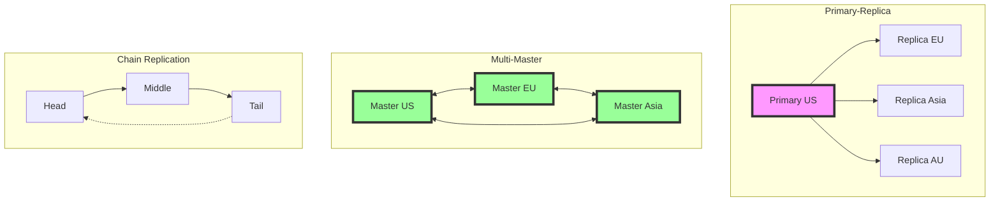

<!-- Navigation -->
[Home](../index.md) → [Part III: Patterns](index.md) → **Geo-Replication Patterns**

# Geo-Replication Patterns

**Making data omnipresent while keeping it consistent - the ultimate distributed systems challenge**

> *"The speed of light isn't just a good idea, it's the law. And in geo-replication, it's the law we're constantly trying to break."*

---

## 🎯 Level 1: Intuition

### The Global Library Analogy

Think of geo-replication like a global library system:

```
Single Library:                       Global Library Network:

📚 Central Library                    📚 NYC Branch ←→ 📚 London Branch
    ↓                                      ↓             ↓
👥 All Readers                        👥 US Readers   👥 EU Readers
                                           ↓             ↓
Problems:                             📚 Tokyo Branch ←→ 📚 Sydney Branch
- Travel far to read                       ↓             ↓
- Library burns = books lost          👥 Asia Readers  👥 AU Readers
- One timezone serves all
- Crowded during peak hours           Benefits:
                                     - Local access (fast!)
                                     - Disaster recovery
                                     - Follow-the-sun ops
                                     - Regional compliance
```

### Visual Metaphor

```
Without Geo-Replication:              With Geo-Replication:

Users → [Atlantic Ocean] → Server     US Users → US Servers
         150ms latency                EU Users → EU Servers
         Single point of failure      Asia Users → Asia Servers
                                     
Result: Slow + Risky                  Result: Fast + Resilient

The Challenge: Keeping all copies synchronized!
```

### Real-World Examples

| Company | Implementation | Impact |
|---------|----------------|---------|
| **Netflix** | Content cached in 200+ locations | <10ms latency globally |
| **Google** | Spanner across 5 continents | 99.999% availability |
| **Facebook** | Social graph replicated globally | 2B users, instant updates |
| **GitHub** | Code replicated across 3 regions | Survives region failures |
| **Spotify** | Music catalog geo-distributed | Instant playback worldwide |

### Basic Implementation

```python
class GeoReplicatedDatabase:
    def __init__(self):
        self.regions = {
            'us-east': Region('us-east-1', primary=True),
            'eu-west': Region('eu-west-1'),
            'ap-south': Region('ap-south-1')
        }
        self.replication_lag = {}  # Track lag between regions
        
    def write(self, key: str, value: any, consistency: str = 'eventual'):
        """Write with configurable consistency"""
        
        # Always write to primary first
        primary = self.get_primary_region()
        primary.write(key, value)
        
        if consistency == 'strong':
            # Wait for all regions (slow but consistent)
            return self.replicate_sync(key, value)
            
        elif consistency == 'quorum':
            # Wait for majority (balanced)
            return self.replicate_quorum(key, value)
            
        else:  # eventual
            # Fire and forget (fast but eventually consistent)
            self.replicate_async(key, value)
            return True
    
    def read(self, key: str, user_region: str = None):
        """Read from optimal region"""
        
        if user_region:
            # Read from user's local region (fast!)
            local_region = self.regions.get(user_region)
            if local_region:
                value = local_region.read(key)
                staleness = self.get_staleness(user_region)
                
                return {
                    'value': value,
                    'region': user_region,
                    'staleness_ms': staleness,
                    'warning': 'May be stale' if staleness > 1000 else None
                }
        
        # Fallback to primary (always fresh)
        return {
            'value': self.get_primary_region().read(key),
            'region': 'primary',
            'staleness_ms': 0
        }
    
    def replicate_sync(self, key: str, value: any):
        """Synchronous replication - wait for all"""
        
        replicas = [r for r in self.regions.values() if not r.is_primary]
        results = []
        
        for replica in replicas:
            start = time.time()
            success = replica.write(key, value)
            latency = (time.time() - start) * 1000
            
            results.append({
                'region': replica.name,
                'success': success,
                'latency_ms': latency
            })
            
            if not success:
                raise ReplicationError(f"Failed to replicate to {replica.name}")
        
        return {'status': 'success', 'regions': results}
    
    def handle_region_failure(self, failed_region: str):
        """Handle region going offline"""
        
        if self.regions[failed_region].is_primary:
            # Primary failed! Elect new primary
            self.elect_new_primary()
        
        # Mark region as unavailable
        self.regions[failed_region].available = False
        
        # Reroute traffic
        self.update_routing_table()
        
        return {
            'failed_region': failed_region,
            'new_primary': self.get_primary_region().name,
            'available_regions': [r for r in self.regions if r.available]
        }

# Example usage
db = GeoReplicatedDatabase()

# Write with eventual consistency (fast)
db.write('user:123', {'name': 'Alice', 'location': 'NYC'})

# Read from nearest region
result = db.read('user:123', user_region='eu-west')
print(f"Value: {result['value']}, Staleness: {result['staleness_ms']}ms")

# Write with strong consistency (slow but guaranteed)
db.write('payment:456', {'amount': 100}, consistency='strong')
```

---

## 🏗️ Level 2: Foundation

### Replication Topologies



### Core Concepts

#### 1. Replication Strategies

```python
class ReplicationStrategy:
    """Different strategies for geo-replication"""
    
    def __init__(self):
        self.strategies = {
            'async': AsyncReplication(),
            'sync': SyncReplication(),
            'semi_sync': SemiSyncReplication(),
            'quorum': QuorumReplication()
        }
    
    def replicate(self, data: dict, strategy: str = 'async'):
        """Replicate using chosen strategy"""
        return self.strategies[strategy].replicate(data)

class AsyncReplication:
    """Fire-and-forget replication"""
    
    def replicate(self, data: dict):
        # Queue for replication
        replication_queue.put(data)
        
        # Return immediately (fast!)
        return {'status': 'queued', 'guarantee': 'eventual'}

class SyncReplication:
    """Wait for all replicas"""
    
    def replicate(self, data: dict):
        regions = get_all_regions()
        
        # Wait for all (slow but consistent)
        for region in regions:
            result = region.write_sync(data)
            if not result.success:
                raise ReplicationError(f"Failed: {region}")
        
        return {'status': 'completed', 'guarantee': 'strong'}

class SemiSyncReplication:
    """Wait for at least one replica"""
    
    def replicate(self, data: dict):
        regions = get_all_regions()
        
        # Wait for first success
        for region in regions:
            if region.write_sync(data).success:
                # Continue async for others
                replicate_async_to_remaining(regions, data)
                return {'status': 'partial', 'guarantee': 'semi_strong'}
        
        raise ReplicationError("No replicas available")

class QuorumReplication:
    """Wait for majority"""
    
    def replicate(self, data: dict):
        regions = get_all_regions()
        required = len(regions) // 2 + 1
        successful = 0
        
        # Replicate in parallel
        futures = [region.write_async(data) for region in regions]
        
        for future in futures:
            if future.result().success:
                successful += 1
                if successful >= required:
                    return {'status': 'quorum', 'guarantee': 'strong'}
        
        raise ReplicationError("Quorum not reached")
```

#### 2. Conflict Resolution

```python
class ConflictResolver:
    """Handle conflicts in multi-master replication"""
    
    def __init__(self):
        self.strategies = {
            'last_write_wins': self.last_write_wins,
            'vector_clock': self.vector_clock_resolution,
            'crdt': self.crdt_merge,
            'custom': self.custom_resolution
        }
    
    def resolve(self, conflicts: list, strategy: str = 'vector_clock'):
        """Resolve conflicts using chosen strategy"""
        
        return self.strategies[strategy](conflicts)
    
    def last_write_wins(self, conflicts: list):
        """Simple: latest timestamp wins"""
        
        return max(conflicts, key=lambda x: x.timestamp)
    
    def vector_clock_resolution(self, conflicts: list):
        """Use vector clocks to detect true conflicts"""
        
        # Group by causal relationship
        groups = []
        
        for c1 in conflicts:
            placed = False
            for group in groups:
                if any(self.causally_related(c1, c2) for c2 in group):
                    group.append(c1)
                    placed = True
                    break
            
            if not placed:
                groups.append([c1])
        
        # Resolve within groups
        resolved = []
        for group in groups:
            if len(group) == 1:
                resolved.append(group[0])
            else:
                # True conflict - need application logic
                resolved.append(self.application_resolve(group))
        
        return resolved
    
    def crdt_merge(self, conflicts: list):
        """Conflict-free merge for CRDTs"""
        
        # CRDTs merge without conflicts
        result = conflicts[0]
        
        for conflict in conflicts[1:]:
            result = result.merge(conflict)
        
        return result
    
    def custom_resolution(self, conflicts: list):
        """Application-specific resolution"""
        
        # Example: Shopping cart - union of all items
        if conflicts[0].type == 'shopping_cart':
            all_items = set()
            for conflict in conflicts:
                all_items.update(conflict.items)
            
            return ShoppingCart(items=all_items)
        
        # Example: Counter - sum all increments
        elif conflicts[0].type == 'counter':
            total = sum(c.value for c in conflicts)
            return Counter(value=total)
        
        # Fallback to last-write-wins
        return self.last_write_wins(conflicts)
```

#### 3. Geo-Aware Routing

```python
class GeoRouter:
    """Route requests to optimal regions"""
    
    def __init__(self):
        self.regions = self.load_regions()
        self.latency_map = self.build_latency_map()
        
    def route_request(self, request: Request) -> Region:
        """Find best region for request"""
        
        user_location = self.geolocate(request.ip)
        
        # Consider multiple factors
        candidates = []
        
        for region in self.regions:
            score = self.calculate_score(
                region,
                user_location,
                request.consistency_requirement,
                request.data_locality
            )
            candidates.append((region, score))
        
        # Return highest scoring region
        best_region = max(candidates, key=lambda x: x[1])
        
        return best_region[0]
    
    def calculate_score(self, region, user_location, consistency, locality):
        """Score region based on multiple factors"""
        
        score = 0
        
        # Network latency (most important)
        latency = self.get_latency(user_location, region.location)
        score += 1000 / (latency + 1)  # Lower latency = higher score
        
        # Data freshness
        if consistency == 'strong' and region.is_primary:
            score += 500
        elif consistency == 'eventual':
            lag = region.get_replication_lag()
            score += 100 / (lag + 1)
        
        # Data locality (regulatory compliance)
        if locality and region.location in locality:
            score += 200
        
        # Region health
        score *= region.health_score
        
        return score
```

### Advanced Patterns

```python
class GeoPartitioning:
    """Partition data by geography"""
    
    def __init__(self):
        self.partitions = {
            'americas': {'regions': ['us-east', 'us-west', 'sa-east']},
            'europe': {'regions': ['eu-west', 'eu-central', 'eu-north']},
            'asia': {'regions': ['ap-south', 'ap-northeast', 'ap-southeast']}
        }
    
    def partition_key(self, key: str, hint: str = None) -> str:
        """Determine partition for key"""
        
        if hint:
            # Use hint (e.g., user's home region)
            return self.find_partition(hint)
        
        # Hash-based partitioning
        hash_value = hash(key)
        partition_index = hash_value % len(self.partitions)
        
        return list(self.partitions.keys())[partition_index]
    
    def write(self, key: str, value: any, hint: str = None):
        """Write to geographically partitioned data"""
        
        partition = self.partition_key(key, hint)
        
        # Write to primary region in partition
        primary = self.get_primary_for_partition(partition)
        primary.write(key, value)
        
        # Replicate within partition (fast)
        self.replicate_within_partition(partition, key, value)
        
        # Optionally replicate globally (slow)
        if self.requires_global_access(key):
            self.replicate_globally(key, value)

class FollowTheSun:
    """Move primary region based on time of day"""
    
    def __init__(self):
        self.regions = {
            'us': {'timezone': 'America/New_York', 'active_hours': (9, 17)},
            'eu': {'timezone': 'Europe/London', 'active_hours': (9, 17)},
            'asia': {'timezone': 'Asia/Tokyo', 'active_hours': (9, 17)}
        }
        
    def get_active_region(self) -> str:
        """Find currently active region based on business hours"""
        
        current_scores = {}
        
        for region, config in self.regions.items():
            tz = pytz.timezone(config['timezone'])
            local_time = datetime.now(tz)
            hour = local_time.hour
            
            start, end = config['active_hours']
            
            if start <= hour < end:
                # In business hours
                score = 1.0
            else:
                # Calculate proximity to business hours
                if hour < start:
                    distance = start - hour
                else:
                    distance = hour - end
                
                score = 1.0 / (distance + 1)
            
            current_scores[region] = score
        
        return max(current_scores, key=current_scores.get)
    
    def migrate_primary(self, from_region: str, to_region: str):
        """Migrate primary role between regions"""
        
        # Start dual-primary mode
        self.regions[to_region].set_mode('dual_primary')
        
        # Wait for replication to catch up
        self.wait_for_sync(from_region, to_region)
        
        # Switch primary
        self.regions[from_region].set_mode('replica')
        self.regions[to_region].set_mode('primary')
        
        # Update routing
        self.update_global_routing(to_region)
```

---

## 🔧 Level 3: Deep Dive

### Advanced Replication Techniques

#### Global Consensus with Raft

```python
class GeoDistributedRaft:
    """Raft consensus across geographic regions"""
    
    def __init__(self, node_id: str, peers: list):
        self.node_id = node_id
        self.peers = peers
        self.state = 'follower'
        self.current_term = 0
        self.voted_for = None
        self.log = []
        self.region_weights = {}  # Account for geo-distance
        
    def append_entries(self, entries: list, leader_id: str) -> bool:
        """Handle append entries with geo-awareness"""
        
        # Check if we should accept this leader
        if not self.validate_leader_location(leader_id):
            # Leader too far away, trigger re-election
            self.start_election()
            return False
        
        # Normal Raft append
        return super().append_entries(entries, leader_id)
    
    def start_election(self):
        """Start election with geo-weighted voting"""
        
        self.state = 'candidate'
        self.current_term += 1
        self.voted_for = self.node_id
        
        votes = 1  # Vote for self
        
        # Request votes with latency consideration
        for peer in self.peers:
            latency = self.measure_latency(peer)
            
            # Adjust timeout based on latency
            timeout = max(150, latency * 3)  # At least 150ms
            
            vote = self.request_vote(
                peer,
                self.current_term,
                timeout=timeout
            )
            
            if vote:
                # Weight vote by proximity
                weight = 1.0 / (latency / 50 + 1)  # Closer = higher weight
                votes += weight
        
        # Need weighted majority
        if votes > len(self.peers) / 2:
            self.become_leader()
    
    def replicate_across_regions(self, entry: dict):
        """Replicate with region-aware optimizations"""
        
        # Group peers by region
        regions = self.group_by_region(self.peers)
        
        # Replicate to local region first (fast)
        local_region = self.get_region(self.node_id)
        local_peers = regions[local_region]
        
        local_success = self.replicate_to_peers(local_peers, entry)
        
        if local_success >= len(local_peers) / 2:
            # Local quorum achieved, replicate async to other regions
            for region, peers in regions.items():
                if region != local_region:
                    self.async_replicate_to_region(peers, entry)
            
            return True
        
        return False
```

#### Conflict-Free Replicated Data Types (CRDTs)

```python
class GeoDistributedCRDT:
    """CRDTs for automatic conflict resolution"""
    
    pass

class GCounter:
    """Grow-only counter - no conflicts possible"""
    
    def __init__(self, node_id: str):
        self.node_id = node_id
        self.counts = {node_id: 0}
        
    def increment(self, delta: int = 1):
        """Local increment"""
        self.counts[self.node_id] += delta
        
    def merge(self, other: 'GCounter'):
        """Merge with another counter"""
        for node, count in other.counts.items():
            self.counts[node] = max(
                self.counts.get(node, 0),
                count
            )
    
    def value(self) -> int:
        """Get total count"""
        return sum(self.counts.values())

class PNCounter:
    """Increment/decrement counter using two GCounters"""
    
    def __init__(self, node_id: str):
        self.positive = GCounter(node_id)
        self.negative = GCounter(node_id)
    
    def increment(self, delta: int = 1):
        if delta >= 0:
            self.positive.increment(delta)
        else:
            self.negative.increment(-delta)
    
    def merge(self, other: 'PNCounter'):
        self.positive.merge(other.positive)
        self.negative.merge(other.negative)
    
    def value(self) -> int:
        return self.positive.value() - self.negative.value()

class ORSet:
    """Observed-Remove Set for geo-distributed sets"""
    
    def __init__(self, node_id: str):
        self.node_id = node_id
        self.elements = {}  # element -> set of unique tags
        self.tombstones = {}  # element -> set of removed tags
        
    def add(self, element: any):
        """Add element to set"""
        unique_tag = f"{self.node_id}:{time.time_ns()}"
        
        if element not in self.elements:
            self.elements[element] = set()
        
        self.elements[element].add(unique_tag)
        
    def remove(self, element: any):
        """Remove element from set"""
        if element in self.elements:
            # Move all tags to tombstones
            if element not in self.tombstones:
                self.tombstones[element] = set()
            
            self.tombstones[element].update(self.elements[element])
            
    def merge(self, other: 'ORSet'):
        """Merge with another set"""
        
        # Merge elements
        for elem, tags in other.elements.items():
            if elem not in self.elements:
                self.elements[elem] = set()
            self.elements[elem].update(tags)
        
        # Merge tombstones
        for elem, tags in other.tombstones.items():
            if elem not in self.tombstones:
                self.tombstones[elem] = set()
            self.tombstones[elem].update(tags)
        
        # Remove tombstoned tags
        for elem, removed_tags in self.tombstones.items():
            if elem in self.elements:
                self.elements[elem] -= removed_tags
                if not self.elements[elem]:
                    del self.elements[elem]
    
    def contains(self, element: any) -> bool:
        """Check if element exists"""
        return element in self.elements and len(self.elements[element]) > 0

class LWWRegister:
    """Last-Write-Wins Register with timestamps"""
    
    def __init__(self, node_id: str):
        self.node_id = node_id
        self.value = None
        self.timestamp = 0
        
    def set(self, value: any):
        """Set value with timestamp"""
        self.value = value
        self.timestamp = time.time_ns()
        
    def merge(self, other: 'LWWRegister'):
        """Merge with another register"""
        if other.timestamp > self.timestamp:
            self.value = other.value
            self.timestamp = other.timestamp
        elif other.timestamp == self.timestamp:
            # Tie-breaker: use node_id
            if other.node_id > self.node_id:
                self.value = other.value
```

#### Hybrid Logical Clocks for Geo-Replication

```python
class HybridLogicalClock:
    """HLC for consistent timestamps across regions"""
    
    def __init__(self):
        self.physical_time = 0
        self.logical_time = 0
        
    def update(self, received_hlc: tuple = None) -> tuple:
        """Update HLC on send or receive"""
        
        current_physical = time.time_ns()
        
        if received_hlc:
            # Receiving message
            recv_physical, recv_logical = received_hlc
            
            if current_physical > self.physical_time and \
               current_physical > recv_physical:
                # Current physical time is latest
                self.physical_time = current_physical
                self.logical_time = 0
            elif recv_physical > self.physical_time and \
                 recv_physical > current_physical:
                # Received time is latest
                self.physical_time = recv_physical
                self.logical_time = recv_logical + 1
            elif self.physical_time > current_physical and \
                 self.physical_time > recv_physical:
                # Our time is latest
                self.logical_time += 1
            else:
                # Tie - use maximum logical
                self.physical_time = max(
                    current_physical,
                    recv_physical,
                    self.physical_time
                )
                self.logical_time = max(
                    self.logical_time,
                    recv_logical
                ) + 1
        else:
            # Sending message
            if current_physical > self.physical_time:
                self.physical_time = current_physical
                self.logical_time = 0
            else:
                self.logical_time += 1
        
        return (self.physical_time, self.logical_time)
    
    def compare(self, other: tuple) -> int:
        """Compare two HLC timestamps"""
        
        if self.physical_time < other[0]:
            return -1
        elif self.physical_time > other[0]:
            return 1
        elif self.logical_time < other[1]:
            return -1
        elif self.logical_time > other[1]:
            return 1
        else:
            return 0
```

---

## 🚀 Level 4: Expert

### Production Case Study: Google Spanner

Google Spanner provides globally distributed, strongly consistent database serving millions of QPS across 5 continents.

```python
class SpannerArchitecture:
    """
    Google Spanner's globally consistent database
    - Serves Google Ads, Google Play, and more
    - True global consistency with external consistency
    - Uses atomic clocks (TrueTime) for global ordering
    """
    
    def __init__(self):
        self.zones = {}  # Geographic zones
        self.paxos_groups = {}  # Replicated state machines
        self.true_time = TrueTimeAPI()  # GPS + atomic clocks
        
    def create_database(self, config: dict) -> Database:
        """
        Create globally distributed database
        config = {
            'replicas': [
                {'location': 'us-central1', 'type': 'read-write'},
                {'location': 'europe-west1', 'type': 'read-write'},
                {'location': 'asia-east1', 'type': 'read-only'}
            ],
            'partition_count': 100
        }
        """
        
        db = Database()
        
        # Create Paxos groups for each partition
        for partition_id in range(config['partition_count']):
            paxos_group = self.create_paxos_group(
                partition_id,
                config['replicas']
            )
            db.add_partition(paxos_group)
        
        return db
    
    def execute_transaction(self, txn: Transaction) -> Result:
        """
        Execute globally consistent transaction
        """
        
        # 1. Acquire read locks at timestamp
        read_timestamp = self.true_time.now()
        
        for read in txn.reads:
            partition = self.find_partition(read.key)
            value = partition.read_at_timestamp(
                read.key,
                read_timestamp
            )
            txn.read_set[read.key] = value
        
        # 2. If read-only, we're done
        if not txn.writes:
            return Result(txn.read_set, read_timestamp)
        
        # 3. Acquire write locks
        write_timestamp = self.true_time.now()
        
        # Ensure write_timestamp > read_timestamp
        if write_timestamp <= read_timestamp:
            write_timestamp = self.true_time.wait_until_after(
                read_timestamp
            )
        
        # 4. Two-phase commit across partitions
        participants = set()
        for write in txn.writes:
            partition = self.find_partition(write.key)
            participants.add(partition)
        
        # Phase 1: Prepare
        prepare_timestamp = write_timestamp
        prepared = []
        
        for participant in participants:
            if participant.prepare(txn, prepare_timestamp):
                prepared.append(participant)
            else:
                # Abort
                for p in prepared:
                    p.abort(txn)
                return Result(error="Transaction aborted")
        
        # Phase 2: Commit
        commit_timestamp = self.true_time.now()
        
        # Wait for timestamp to be in the past
        self.true_time.wait_until_past(commit_timestamp)
        
        for participant in participants:
            participant.commit(txn, commit_timestamp)
        
        return Result(
            success=True,
            timestamp=commit_timestamp
        )
    
    def implement_true_time(self):
        """
        TrueTime implementation using GPS + atomic clocks
        """
        
        class TrueTimeAPI:
            def __init__(self):
                self.gps_receivers = []
                self.atomic_clocks = []
                self.uncertainty_us = 7  # 7 microseconds
            
            def now(self) -> TimeInterval:
                """
                Return time interval [earliest, latest]
                """
                
                # Get time from multiple sources
                times = []
                
                for gps in self.gps_receivers:
                    times.append(gps.get_time())
                
                for clock in self.atomic_clocks:
                    times.append(clock.get_time())
                
                # Calculate bounds
                median_time = statistics.median(times)
                
                return TimeInterval(
                    earliest=median_time - self.uncertainty_us,
                    latest=median_time + self.uncertainty_us
                )
            
            def wait_until_past(self, timestamp: int):
                """
                Wait until timestamp is definitely in the past
                """
                
                while True:
                    interval = self.now()
                    if interval.earliest > timestamp:
                        return
                    
                    # Wait for uncertainty window
                    time.sleep(self.uncertainty_us / 1_000_000)
```

### Advanced Geo-Replication Patterns

```python
class CausallyConsistentGeoReplication:
    """
    Causal consistency across regions
    Weaker than linearizability but stronger than eventual
    """
    
    def __init__(self):
        self.regions = {}
        self.dependency_tracker = DependencyTracker()
        
    def write(self, key: str, value: any, session: Session):
        """Write with causal consistency"""
        
        # Track dependencies from session
        dependencies = session.get_dependencies()
        
        # Create write operation
        operation = WriteOperation(
            key=key,
            value=value,
            timestamp=HybridLogicalClock().update(),
            dependencies=dependencies,
            region=self.get_local_region()
        )
        
        # Write locally
        self.local_write(operation)
        
        # Update session dependencies
        session.add_dependency(operation.id)
        
        # Replicate with dependency info
        self.replicate_with_dependencies(operation)
    
    def read(self, key: str, session: Session):
        """Read with causal consistency"""
        
        # Get session dependencies
        dependencies = session.get_dependencies()
        
        # Find replica that has seen all dependencies
        replica = self.find_causally_consistent_replica(
            dependencies
        )
        
        if not replica:
            # No replica has all dependencies yet
            # Wait or read from primary
            replica = self.wait_for_dependencies(dependencies)
        
        # Read from chosen replica
        value = replica.read(key)
        
        # Update session with new dependencies
        if value.dependencies:
            session.add_dependencies(value.dependencies)
        
        return value

class AdaptiveGeoReplication:
    """
    Dynamically adjust replication based on access patterns
    """
    
    def __init__(self):
        self.access_tracker = AccessPatternTracker()
        self.replication_manager = ReplicationManager()
        
    def track_and_adapt(self):
        """Monitor and adapt replication strategy"""
        
        while True:
            # Analyze access patterns
            patterns = self.access_tracker.analyze_window(
                duration_minutes=60
            )
            
            for data_key, pattern in patterns.items():
                current_strategy = self.get_replication_strategy(data_key)
                optimal_strategy = self.determine_optimal_strategy(pattern)
                
                if current_strategy != optimal_strategy:
                    self.migrate_replication_strategy(
                        data_key,
                        current_strategy,
                        optimal_strategy
                    )
            
            time.sleep(300)  # Check every 5 minutes
    
    def determine_optimal_strategy(self, pattern: AccessPattern):
        """Choose replication strategy based on access pattern"""
        
        if pattern.write_ratio > 0.5:
            # Write-heavy: use primary-replica
            return 'primary_replica'
            
        elif pattern.concurrent_writers > 1:
            # Multiple writers: use CRDT or multi-master
            if pattern.conflict_tolerance == 'high':
                return 'crdt'
            else:
                return 'multi_master_consensus'
                
        elif pattern.read_locations == 'global':
            # Global reads: aggressive caching
            return 'geo_cached'
            
        elif pattern.consistency_requirement == 'strong':
            # Strong consistency: use consensus
            return 'consensus_based'
            
        else:
            # Default: eventual consistency
            return 'eventual'
    
    def migrate_replication_strategy(self, key: str, from_strategy: str, to_strategy: str):
        """
        Live migration between replication strategies
        """
        
        # Start dual-mode replication
        self.replication_manager.enable_dual_mode(
            key,
            from_strategy,
            to_strategy
        )
        
        # Wait for new strategy to catch up
        self.wait_for_convergence(key, to_strategy)
        
        # Switch reads to new strategy
        self.switch_reads(key, to_strategy)
        
        # Monitor for issues
        if self.monitor_health(key, to_strategy, duration=300):
            # Success - complete migration
            self.replication_manager.disable_old_strategy(
                key,
                from_strategy
            )
        else:
            # Rollback
            self.rollback_migration(key, from_strategy)
```

---

## 🎯 Level 5: Mastery

### Theoretical Foundations

#### CAP Theorem in Geo-Replication

```python
class GeoCAP:
    """
    CAP theorem applied to geo-distributed systems
    """
    
    def analyze_tradeoffs(self, system_config: dict) -> dict:
        """
        Analyze CAP tradeoffs for geo-replicated system
        """
        
        # Network partition probability increases with distance
        partition_probability = self.calculate_partition_probability(
            system_config['regions']
        )
        
        tradeoffs = {
            'cp_system': {
                'consistency': 'strong',
                'availability': 1 - partition_probability,
                'partition_tolerance': True,
                'use_case': 'Financial transactions',
                'implementation': 'Consensus (Raft/Paxos)'
            },
            'ap_system': {
                'consistency': 'eventual',
                'availability': 0.9999,
                'partition_tolerance': True,
                'use_case': 'Social media',
                'implementation': 'CRDTs or eventual consistency'
            },
            'ca_system': {
                'consistency': 'strong',
                'availability': 0.999,
                'partition_tolerance': False,
                'use_case': 'Single datacenter only',
                'implementation': 'Traditional RDBMS'
            }
        }
        
        # Real-world: PACELC
        pacelc_analysis = {
            'partition': {
                'choice': 'AP or CP based on requirements'
            },
            'else': {
                'latency_consistency_tradeoff': self.analyze_latency_consistency(
                    system_config
                )
            }
        }
        
        return {
            'cap_tradeoffs': tradeoffs,
            'pacelc_analysis': pacelc_analysis,
            'recommendation': self.recommend_architecture(system_config)
        }
    
    def calculate_partition_probability(self, regions: list) -> float:
        """
        Estimate network partition probability
        """
        
        # Factors affecting partition probability
        # - Physical distance
        # - Number of network hops
        # - Undersea cables
        # - Political boundaries
        
        max_distance = 0
        for i, r1 in enumerate(regions):
            for r2 in regions[i+1:]:
                distance = self.geographic_distance(r1, r2)
                max_distance = max(max_distance, distance)
        
        # Empirical formula (simplified)
        # ~0.1% per 1000km per year
        base_probability = (max_distance / 1000) * 0.001
        
        # Adjust for redundancy
        redundancy_factor = 1 / len(regions)
        
        return base_probability * redundancy_factor
```

#### Information Theory of Geo-Replication

```python
class GeoReplicationInformationTheory:
    """
    Apply information theory to geo-replication
    """
    
    def calculate_replication_entropy(self, regions: list) -> float:
        """
        Calculate entropy of replicated system
        Higher entropy = more uncertainty = harder consistency
        """
        
        # Factors contributing to entropy
        # - Network latency variance
        # - Clock drift
        # - Failure rates
        # - Update rates
        
        total_entropy = 0
        
        for region in regions:
            # Shannon entropy for each region
            p_failure = region.failure_rate
            p_success = 1 - p_failure
            
            if p_failure > 0 and p_success > 0:
                region_entropy = -(
                    p_failure * math.log2(p_failure) +
                    p_success * math.log2(p_success)
                )
            else:
                region_entropy = 0
            
            # Weight by region's update rate
            weight = region.update_rate / sum(r.update_rate for r in regions)
            total_entropy += weight * region_entropy
        
        # Add network entropy
        network_entropy = self.calculate_network_entropy(regions)
        
        return total_entropy + network_entropy
    
    def minimum_replication_overhead(self, consistency_level: str) -> dict:
        """
        Calculate theoretical minimum overhead for consistency level
        """
        
        overhead = {
            'strong': {
                'latency': 'RTT to majority of replicas',
                'bandwidth': 'N * message_size',
                'formula': 'O(n) messages per write'
            },
            'causal': {
                'latency': 'Max dependency chain',
                'bandwidth': 'Dependencies + data',
                'formula': 'O(d) where d = dependencies'
            },
            'eventual': {
                'latency': '0 (async)',
                'bandwidth': 'N * message_size (async)',
                'formula': 'O(1) amortized'
            }
        }
        
        return overhead[consistency_level]
```

### Future Directions

#### Quantum Networks for Geo-Replication

```python
class QuantumGeoReplication:
    """
    Theoretical quantum approach to geo-replication
    """
    
    def quantum_state_synchronization(self):
        """
        Use quantum entanglement for instant state sync
        """
        
        # Theoretical: Quantum entangled qubits
        # could provide instant state synchronization
        # across any distance
        
        class QuantumReplicatedState:
            def __init__(self):
                self.entangled_pairs = []
                
            def create_entangled_replicas(self, num_regions: int):
                """
                Create quantum entangled states
                """
                
                # In theory, measuring one qubit
                # instantly affects its entangled pair
                for i in range(num_regions):
                    qubit_pair = self.create_bell_pair()
                    self.entangled_pairs.append(qubit_pair)
            
            def update_state(self, region_id: int, value: any):
                """
                Update would instantly reflect everywhere
                """
                
                # Quantum state collapse
                # All entangled copies instantly update
                pass
        
        return QuantumReplicatedState()
```

#### ML-Optimized Replication

```python
class MLGeoReplication:
    """
    Machine learning for optimal replication strategies
    """
    
    def __init__(self):
        self.model = self.train_replication_model()
        
    def train_replication_model(self):
        """
        Train model to predict optimal replication strategy
        """
        
        # Features:
        # - Access patterns
        # - Geographic distribution
        # - Network conditions
        # - Data characteristics
        
        # Labels:
        # - Optimal consistency level
        # - Replication topology
        # - Sync vs async
        
        model = RandomForestClassifier()
        # Training code...
        return model
    
    def predict_optimal_strategy(self, workload: dict) -> dict:
        """
        Predict best replication strategy for workload
        """
        
        features = self.extract_features(workload)
        strategy = self.model.predict(features)
        
        return {
            'consistency': strategy['consistency_level'],
            'topology': strategy['topology'],
            'regions': strategy['optimal_regions'],
            'confidence': strategy['confidence_score']
        }
```

### Economic Impact

```python
class GeoReplicationEconomics:
    """
    Economic analysis of geo-replication
    """
    
    def calculate_roi(self, deployment: dict) -> dict:
        """
        ROI of geo-replication deployment
        """
        
        # Costs
        infrastructure_cost = (
            deployment['regions'] * 50000 +  # Per region setup
            deployment['cross_region_bandwidth_gb'] * 0.02  # Transfer costs
        )
        
        operational_cost = deployment['regions'] * 10000  # Per region/month
        
        # Benefits
        latency_reduction = deployment['avg_latency_reduction_ms']
        
        # Every 100ms reduction = 1% revenue increase (Amazon study)
        revenue_increase = (latency_reduction / 100) * 0.01 * deployment['annual_revenue']
        
        # Availability improvement
        downtime_reduction = deployment['availability_improvement'] * deployment['downtime_cost_per_hour'] * 8760
        
        # Compliance
        compliance_value = deployment['data_sovereignty_regions'] * 100000
        
        total_benefit = revenue_increase + downtime_reduction + compliance_value
        total_cost = infrastructure_cost + (operational_cost * 12)
        
        return {
            'first_year_roi': ((total_benefit - total_cost) / total_cost) * 100,
            'payback_months': total_cost / (total_benefit / 12),
            'five_year_value': (total_benefit * 5) - (total_cost + operational_cost * 60)
        }
```

---

## 📊 Quick Reference

### Decision Framework

| Factor | Single Region | Multi-Region | Global |
|--------|--------------|--------------|---------|
| **User Distribution** | Local | Continental | Worldwide |
| **Latency Tolerance** | <50ms locally | <100ms continent | <200ms global |
| **Consistency Needs** | Strong easy | Tunable | Eventual/CRDT |
| **Complexity** | Low | Medium | High |
| **Cost** | $ | $$ | $$$ |

### Implementation Checklist

- [ ] Define regions and replication topology
- [ ] Choose consistency model
- [ ] Design conflict resolution
- [ ] Plan partition handling
- [ ] Setup monitoring and alerting
- [ ] Configure geo-aware routing
- [ ] Implement failover procedures
- [ ] Test split-brain scenarios
- [ ] Measure replication lag
- [ ] Plan for compliance
- [ ] Optimize cross-region bandwidth
- [ ] Document runbooks

### Common Anti-Patterns

1. **Assuming strong consistency is free** - Physics has a price
2. **Ignoring partition scenarios** - They will happen
3. **Over-replicating** - Not all data needs global presence
4. **Under-monitoring** - Can't manage what you don't measure
5. **One-size-fits-all** - Different data needs different strategies

---

## 🎓 Key Takeaways

1. **Physics is law** - Speed of light creates fundamental limits
2. **Consistency has a spectrum** - Choose the right level
3. **Conflicts are inevitable** - Plan resolution strategy
4. **Locality matters** - Keep data close to users
5. **Monitor everything** - Replication lag is critical

---

*"In distributed systems, the speed of light is not just a suggestion - it's an SLA violation waiting to happen."*

---

**Previous**: [← FinOps Patterns](finops.md) | **Next**: [Graceful Degradation Pattern →](graceful-degradation.md)