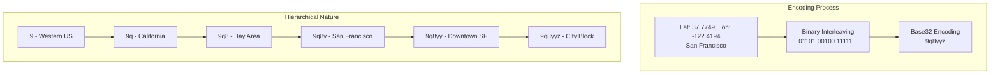
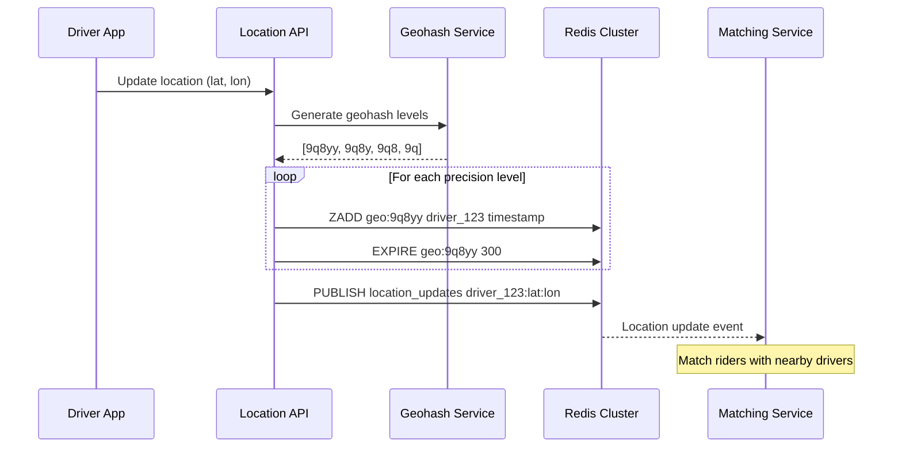
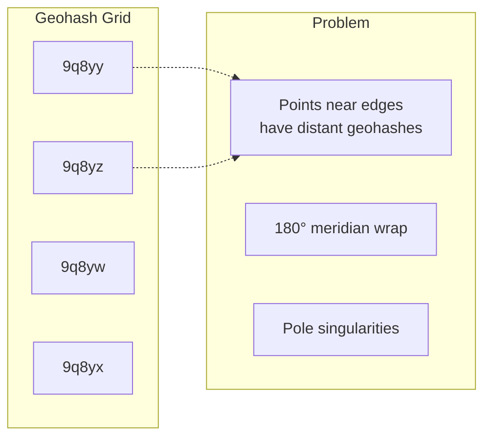

# Geohashing


## Overview

Geohashing is a geocoding method that encodes geographic coordinates (latitude, longitude) into short alphanumeric strings. Developed by Gustavo Niemeyer in 2008, it provides a hierarchical spatial data structure that enables efficient proximity searches and spatial indexing.

The key insight: **nearby locations share similar prefixes**, making range queries and proximity searches extremely efficient in databases.

## Core Concepts

### How Geohashing Works



### Precision and Coverage

| Geohash Length | Cell Size | Example Use Case |
|----------------|-----------|------------------|
| 1 | ~5,000km × 5,000km | Continent-level |
| 2 | ~1,250km × 625km | Country regions |
| 3 | ~156km × 156km | Large cities |
| 4 | ~39km × 19.5km | Cities/towns |
| 5 | ~4.9km × 4.9km | Neighborhoods |
| 6 | ~1.2km × 0.6km | Street blocks |
| 7 | ~153m × 153m | Buildings |
| 8 | ~38m × 19m | Houses |
| 9 | ~4.8m × 4.8m | Trees |

## Implementation

### Basic Geohash Encoding

```python
class Geohash:
    """Simple geohash implementation for educational purposes."""
    
    BASE32 = "0123456789bcdefghjkmnpqrstuvwxyz"
    
    def encode(self, lat: float, lon: float, precision: int = 6) -> str:
        """Encode latitude/longitude to geohash."""
        lat_range = [-90.0, 90.0]
        lon_range = [-180.0, 180.0]
        
        geohash = []
        bits = 0
        bit = 0
        ch = 0
        
        while len(geohash) < precision:
            if bit % 2 == 0:  # Even bit: longitude
                mid = (lon_range[0] + lon_range[1]) / 2
                if lon >= mid:
                    ch |= (1 << (4 - (bit % 5)))
                    lon_range[0] = mid
                else:
                    lon_range[1] = mid
            else:  # Odd bit: latitude
                mid = (lat_range[0] + lat_range[1]) / 2
                if lat >= mid:
                    ch |= (1 << (4 - (bit % 5)))
                    lat_range[0] = mid
                else:
                    lat_range[1] = mid
            
            bit += 1
            if bit % 5 == 0:
                geohash.append(self.BASE32[ch])
                ch = 0
        
        return ''.join(geohash)
    
    def decode(self, geohash: str) -> tuple[float, float]:
        """Decode geohash to latitude/longitude bounds."""
        lat_range = [-90.0, 90.0]
        lon_range = [-180.0, 180.0]
        
        is_lon = True
        for c in geohash:
            idx = self.BASE32.index(c)
            for i in range(5):
                bit = (idx >> (4 - i)) & 1
                if is_lon:
                    mid = (lon_range[0] + lon_range[1]) / 2
                    lon_range[bit] = mid
                else:
                    mid = (lat_range[0] + lat_range[1]) / 2
                    lat_range[bit] = mid
                is_lon = not is_lon
        
        return (
            (lat_range[0] + lat_range[1]) / 2,
            (lon_range[0] + lon_range[1]) / 2
        )
```

### Neighbor Finding Algorithm

```python
def get_neighbors(geohash: str) -> list[str]:
    """Get all 8 neighbors of a geohash cell."""
    # Neighbor and border lookup tables
    NEIGHBORS = {
        'odd': {
            'n': "p0r21436x8zb9dcf5h7kjnmqesgutwvy",
            's': "14365h7k9dcfesgujnmqp0r2twvyx8zb",
            'e': "bc01fg45238967deuvhjyznpkmstqrwx",
            'w': "238967debc01fg45kmstqrwxuvhjyznp"
        },
        'even': {
            'n': "bc01fg45238967deuvhjyznpkmstqrwx",
            's': "238967debc01fg45kmstqrwxuvhjyznp",
            'e': "p0r21436x8zb9dcf5h7kjnmqesgutwvy",
            'w': "14365h7k9dcfesgujnmqp0r2twvyx8zb"
        }
    }
    
    # Get direct neighbors
    neighbors = []
    last_char = geohash[-1]
    parent = geohash[:-1]
    type_ = 'odd' if len(geohash) % 2 else 'even'
    
    # Calculate 8 neighbors (N, NE, E, SE, S, SW, W, NW)
    for direction in ['n', 'ne', 'e', 'se', 's', 'sw', 'w', 'nw']:
        if len(direction) == 2:
            # Corner neighbors require two operations
            neighbors.append(get_adjacent(get_adjacent(geohash, direction[0]), direction[1]))
        else:
            neighbors.append(get_adjacent(geohash, direction))
    
    return neighbors
```

## Use Cases and Examples

### 1. Proximity Search Service

```python
class ProximityService:
    """Find nearby points of interest using geohash."""
    
    def __init__(self, redis_client):
        self.redis = redis_client
        self.geohash = Geohash()
    
    def index_location(self, id: str, lat: float, lon: float, precision: int = 6):
        """Index a location with multiple precision levels."""
        # Generate geohashes at different precisions
        for p in range(4, precision + 1):
            gh = self.geohash.encode(lat, lon, p)
            # Store in Redis sorted set with timestamp as score
            self.redis.zadd(f"geo:{gh}", {id: time.time()})
            # Also store reverse mapping
            self.redis.hset(f"loc:{id}", mapping={
                'lat': lat,
                'lon': lon,
                'geohash': self.geohash.encode(lat, lon, precision)
            })
    
    def find_nearby(self, lat: float, lon: float, radius_km: float) -> list[str]:
        """Find locations within radius."""
        # Determine geohash precision based on radius
        precision = self._radius_to_precision(radius_km)
        center_gh = self.geohash.encode(lat, lon, precision)
        
        # Search center cell and neighbors
        search_cells = [center_gh] + get_neighbors(center_gh)
        
        results = []
        for cell in search_cells:
            # Get all locations in this cell
            locations = self.redis.zrange(f"geo:{cell}", 0, -1)
            
            # Filter by actual distance
            for loc_id in locations:
                loc_data = self.redis.hgetall(f"loc:{loc_id}")
                loc_lat, loc_lon = float(loc_data['lat']), float(loc_data['lon'])
                
                if self._haversine_distance(lat, lon, loc_lat, loc_lon) <= radius_km:
                    results.append(loc_id)
        
        return results
```

### 2. Real-Time Driver Tracking



### 3. Geofence Implementation

```python
class GeofenceService:
    """Efficient geofence checking using geohash."""
    
    def create_geofence(self, fence_id: str, polygon: list[tuple[float, float]]):
        """Create a geofence from polygon coordinates."""
        # Find bounding box
        min_lat = min(p[0] for p in polygon)
        max_lat = max(p[0] for p in polygon)
        min_lon = min(p[1] for p in polygon)
        max_lon = max(p[1] for p in polygon)
        
        # Generate geohashes covering the polygon
        precision = self._calculate_precision(max_lat - min_lat, max_lon - min_lon)
        covering_geohashes = self._polygon_to_geohashes(polygon, precision)
        
        # Store geofence
        self.redis.sadd(f"fence:{fence_id}:cells", *covering_geohashes)
        self.redis.hset(f"fence:{fence_id}:meta", mapping={
            'polygon': json.dumps(polygon),
            'precision': precision
        })
    
    def check_point_in_fences(self, lat: float, lon: float) -> list[str]:
        """Check which geofences contain a point."""
        # Generate geohashes at multiple precisions
        point_geohashes = [
            self.geohash.encode(lat, lon, p) 
            for p in range(4, 9)
        ]
        
        # Find candidate fences
        candidate_fences = set()
        for gh in point_geohashes:
            fence_ids = self.redis.smembers(f"geohash:{gh}:fences")
            candidate_fences.update(fence_ids)
        
        # Precise polygon check for candidates
        active_fences = []
        for fence_id in candidate_fences:
            polygon = json.loads(
                self.redis.hget(f"fence:{fence_id}:meta", 'polygon')
            )
            if self._point_in_polygon(lat, lon, polygon):
                active_fences.append(fence_id)
        
        return active_fences
```

## Edge Cases and Limitations

### 1. Edge Discontinuity



**Solution**: Always search neighboring cells for proximity queries.

### 2. Non-Uniform Cell Sizes

- Cells are rectangles, not squares
- Size varies by latitude (smaller near poles)
- Can cause uneven data distribution

### 3. Z-Order Curve Properties

```python
# Geohash follows Z-order (Morton) curve
# This can lead to non-intuitive ordering

# Example: These locations are close but have different prefixes
loc1 = encode(37.7749, -122.4194)  # "9q8yyz"
loc2 = encode(37.7750, -122.4193)  # "9q8yz0" - different prefix!
```

## Performance Optimization

### Database Indexing

```sql
-- PostgreSQL with geohash index
CREATE TABLE locations (
    id UUID PRIMARY KEY,
    lat DOUBLE PRECISION,
    lon DOUBLE PRECISION,
    geohash VARCHAR(12),
    geohash_prefix VARCHAR(6) GENERATED ALWAYS AS (LEFT(geohash, 6)) STORED
);

-- Create indexes for different precision levels
CREATE INDEX idx_geohash_6 ON locations(geohash_prefix);
CREATE INDEX idx_geohash_full ON locations(geohash);

-- Efficient proximity query
SELECT id, lat, lon
FROM locations
WHERE geohash_prefix IN (
    '9q8yyz', '9q8yyw', '9q8yyx',  -- Center and neighbors
    '9q8yz0', '9q8yz1', '9q8ywb',
    '9q8ywc', '9q8ywy', '9q8ywz'
)
AND ST_DWithin(
    ST_MakePoint(lon, lat),
    ST_MakePoint(-122.4194, 37.7749),
    1000  -- 1km radius
);
```

### Caching Strategy

```yaml
# Redis caching configuration
cache_levels:
  - precision: 4
    ttl: 3600      # 1 hour for city-level
    max_entries: 1000
  - precision: 5
    ttl: 600       # 10 min for neighborhood
    max_entries: 10000
  - precision: 6
    ttl: 60        # 1 min for block-level
    max_entries: 100000
```

## Comparison with Alternatives

| Feature | Geohash | H3 (Uber) | S2 (Google) | QuadTree |
|---------|---------|-----------|-------------|----------|
| Cell Shape | Rectangle | Hexagon | Square | Square |
| Hierarchy | Base32 string | Hierarchical index | 64-bit ID | Tree structure |
| Neighbor Finding | Table lookup | Simple adjacency | Hilbert curve | Tree traversal |
| Edge Behavior | Discontinuous | Continuous | Continuous | Depends |
| Implementation | Simple | Complex | Complex | Moderate |
| Use Case | General purpose | Transportation | Global mapping | Spatial games |

## Best Practices

1. **Choose Appropriate Precision**
   - Don't over-precision (wastes space)
   - Consider your use case requirements
   - Remember precision affects query performance

2. **Handle Edge Cases**
   - Always search neighboring cells
   - Be aware of meridian/pole issues
   - Test with global data

3. **Optimize for Your Database**
   - Use native spatial indexes when available
   - Consider composite indexes
   - Benchmark different precision levels

4. **Monitor and Scale**
   - Track cell density distribution
   - Implement sharding by geohash prefix
   - Use appropriate cache eviction

## Related Patterns
- Spatial Indexing (Coming Soon) - Other spatial data structures
- [Sharding](sharding.md) - Geographic sharding strategies
- Tile Pyramid (Coming Soon) - Map tile organization
- Cell-Based Architecture (Coming Soon) - Regional service isolation

## References
- [Original Geohash Implementation](https://github.com/vinsci/geohash)
- [Redis Geo Commands](https://redis.io/commands/geoadd)
- [PostGIS Spatial Indexing](https://postgis.net/docs/using_postgis_dbmanagement.html)
- [Proximity Service Case Study](/case-studies/proximity-service)

> **Note**: This pattern documentation is planned for future development with more advanced examples and production considerations.