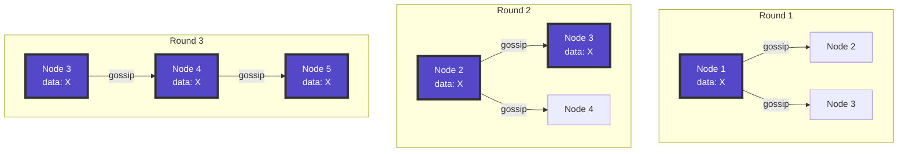
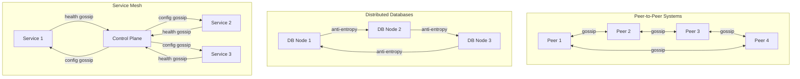

# Gossip Protocol Pattern

**Information spreads like rumors in a distributed system**

> *"In distributed systems, gossip isn't idle chatter—it's how we achieve eventual consistency at scale."*

---

## Level 1: Intuition

### Core Concept

Gossip protocols, also known as epidemic protocols, disseminate information through a distributed system the way gossip spreads in social networks. Each node periodically exchanges state information with a few randomly selected peers, causing information to spread exponentially through the system.

### Basic Implementation

```python
import random
import time
from typing import Dict, Set, List, Tuple, Any
from dataclasses import dataclass
import threading

@dataclass
class GossipMessage:
    node_id: str
    version: int
    data: Any
    timestamp: float

class SimpleGossipNode:
    def __init__(self, node_id: str, peers: List[str]):
        self.node_id = node_id
        self.peers = peers
        self.state = {}  # key -> (value, version)
        self.version = 0
        self.gossip_interval = 1.0  # seconds
        self.fanout = 3  # number of peers to gossip with
        
    def update_value(self, key: str, value: Any):
        """Update local state and increment version"""
        self.version += 1
        self.state[key] = (value, self.version)
        print(f"Node {self.node_id}: Updated {key} = {value} (v{self.version})")
    
    def gossip_round(self):
        """Perform one round of gossiping"""
# Select random peers
        selected_peers = random.sample(
            self.peers, 
            min(self.fanout, len(self.peers))
        )
        
# Exchange state with each peer
        for peer in selected_peers:
            self._exchange_with_peer(peer)
    
    def _exchange_with_peer(self, peer_id: str):
        """Exchange state information with a peer"""
# In real implementation, this would be a network call
# For simulation, we'll just print
        print(f"Node {self.node_id} gossiping with {peer_id}")
        
# Send our state
        for key, (value, version) in self.state.items():
            message = GossipMessage(
                node_id=self.node_id,
                version=version,
                data={key: value},
                timestamp=time.time()
            )
# Peer would receive and merge this
    
    def receive_gossip(self, message: GossipMessage):
        """Receive and process gossip from another node"""
        for key, value in message.data.items():
            if key not in self.state:
# New key, accept it
                self.state[key] = (value, message.version)
                print(f"Node {self.node_id}: Learned {key} = {value}")
            else:
# Compare versions
                _, current_version = self.state[key]
                if message.version > current_version:
# Accept newer version
                    self.state[key] = (value, message.version)
                    print(f"Node {self.node_id}: Updated {key} = {value}")

# Example usage
nodes = {
    'node1': SimpleGossipNode('node1', ['node2', 'node3']),
    'node2': SimpleGossipNode('node2', ['node1', 'node3']),
    'node3': SimpleGossipNode('node3', ['node1', 'node2'])
}

# Node 1 updates a value
nodes['node1'].update_value('config', 'version-2.0')

# Simulate gossip rounds
for round in range(3):
    print(f"\n--- Gossip Round {round + 1} ---")
    for node in nodes.values():
        node.gossip_round()
```

### Visual Representation



---

## Level 2: Implementation

### Advanced Gossip Protocol Features

#### 1. Anti-Entropy Protocol

```python
from typing import Dict, Set, Optional
import hashlib
import json

class AntiEntropyGossip:
    """Gossip protocol with anti-entropy for reliable dissemination"""
    
    def __init__(self, node_id: str, fanout: int = 3):
        self.node_id = node_id
        self.fanout = fanout
        self.data = {}  # key -> (value, version, timestamp)
        self.peers = set()
        self.digests = {}  # peer -> digest of their data
        
    def add_peer(self, peer_id: str):
        """Add a peer to gossip with"""
        self.peers.add(peer_id)
    
    def update(self, key: str, value: Any, version: int = None):
        """Update local data"""
        if version is None:
# Auto-increment version
            current_version = self.data.get(key, (None, 0, 0))[1]
            version = current_version + 1
        
        self.data[key] = (value, version, time.time())
    
    def create_digest(self) -> Dict[str, Tuple[int, float]]:
        """Create digest of current state"""
        return {
            key: (version, timestamp)
            for key, (_, version, timestamp) in self.data.items()
        }
    
    def compare_digests(self, local_digest: Dict, remote_digest: Dict) -> Dict[str, str]:
        """Compare digests and determine what needs to be synced"""
        sync_needed = {}
        
# Check what remote has that we need
        for key, (remote_version, _) in remote_digest.items():
            if key not in local_digest:
                sync_needed[key] = 'pull'
            else:
                local_version = local_digest[key][0]
                if remote_version > local_version:
                    sync_needed[key] = 'pull'
                elif remote_version < local_version:
                    sync_needed[key] = 'push'
        
# Check what we have that remote needs
        for key in local_digest:
            if key not in remote_digest:
                sync_needed[key] = 'push'
        
        return sync_needed
    
    def anti_entropy_round(self):
        """Perform anti-entropy gossip round"""
# Select random peers
        selected_peers = random.sample(
            list(self.peers),
            min(self.fanout, len(self.peers))
        )
        
        for peer_id in selected_peers:
# Phase 1: Exchange digests
            local_digest = self.create_digest()
# In real implementation, get remote digest via RPC
            remote_digest = self._get_remote_digest(peer_id)
            
# Phase 2: Compare and sync
            sync_needed = self.compare_digests(local_digest, remote_digest)
            
# Phase 3: Exchange actual data
            for key, action in sync_needed.items():
                if action == 'pull':
# Request data from peer
                    self._pull_data(peer_id, key)
                elif action == 'push':
# Send data to peer
                    self._push_data(peer_id, key)
    
    def _get_remote_digest(self, peer_id: str) -> Dict:
        """Get digest from remote peer (simulated)"""
# In real implementation, this would be an RPC call
        return {}
    
    def _pull_data(self, peer_id: str, key: str):
        """Pull data from peer"""
# In real implementation, request specific key from peer
        pass
    
    def _push_data(self, peer_id: str, key: str):
        """Push data to peer"""
        if key in self.data:
            value, version, timestamp = self.data[key]
# Send to peer
            print(f"Node {self.node_id}: Pushing {key}={value} to {peer_id}")

# Example usage
node = AntiEntropyGossip("node1")
node.add_peer("node2")
node.add_peer("node3")

node.update("config", {"timeout": 30})
node.anti_entropy_round()
```

#### 2. Rumor Mongering (Push-Pull Protocol)

```python
from enum import Enum
from typing import Set, Dict, List
import math

class NodeState(Enum):
    SUSCEPTIBLE = "susceptible"  # Doesn't have the rumor
    INFECTED = "infected"        # Has the rumor, actively spreading
    REMOVED = "removed"          # Has the rumor, stopped spreading

class RumorMongeringNode:
    """Gossip node using rumor mongering protocol"""
    
    def __init__(self, node_id: str, loss_probability: float = 0.1):
        self.node_id = node_id
        self.state = NodeState.SUSCEPTIBLE
        self.rumors = {}  # rumor_id -> rumor_data
        self.peers = set()
        self.loss_probability = loss_probability
        self.rounds_as_infected = {}  # rumor_id -> rounds
        self.max_rounds = 10  # Stop spreading after this many rounds
        
    def receive_rumor(self, rumor_id: str, rumor_data: Any, 
                     from_node: str) -> bool:
        """Receive a rumor from another node"""
        if rumor_id in self.rumors:
# Already have this rumor
            return False
        
# New rumor - become infected
        self.rumors[rumor_id] = rumor_data
        self.state = NodeState.INFECTED
        self.rounds_as_infected[rumor_id] = 0
        print(f"Node {self.node_id}: Received rumor {rumor_id} from {from_node}")
        return True
    
    def gossip_round(self):
        """Perform one round of rumor mongering"""
        if self.state != NodeState.INFECTED:
            return
        
        rumors_to_remove = []
        
        for rumor_id in self.rumors:
            if rumor_id not in self.rounds_as_infected:
                continue
                
# Select random peer
            if self.peers:
                peer = random.choice(list(self.peers))
                
# Try to spread rumor
                if self._spread_rumor(peer, rumor_id):
                    print(f"Node {self.node_id}: Spread rumor {rumor_id} to {peer}")
                else:
# Peer already has it, consider stopping
                    if random.random() < self.loss_probability:
                        rumors_to_remove.append(rumor_id)
            
# Increment round counter
            self.rounds_as_infected[rumor_id] += 1
            
# Stop spreading old rumors
            if self.rounds_as_infected[rumor_id] >= self.max_rounds:
                rumors_to_remove.append(rumor_id)
        
# Remove old rumors from active spreading
        for rumor_id in rumors_to_remove:
            del self.rounds_as_infected[rumor_id]
        
# Check if still infected
        if not self.rounds_as_infected:
            self.state = NodeState.REMOVED
            print(f"Node {self.node_id}: Stopped spreading (removed state)")
    
    def _spread_rumor(self, peer_id: str, rumor_id: str) -> bool:
        """Attempt to spread rumor to peer"""
# In real implementation, this would be a network call
# Returns True if peer accepted (was susceptible)
        return random.random() > 0.3  # Simulate 70% success rate

class RumorMongeringSimulation:
    """Simulate rumor spreading in a network"""
    
    def __init__(self, num_nodes: int, fanout: int = 3):
        self.nodes = {}
        self.fanout = fanout
        
# Create nodes
        for i in range(num_nodes):
            node_id = f"node{i}"
            self.nodes[node_id] = RumorMongeringNode(node_id)
        
# Create random topology
        self._create_random_topology()
    
    def _create_random_topology(self):
        """Create random peer connections"""
        node_ids = list(self.nodes.keys())
        
        for node_id in node_ids:
# Each node connected to random peers
            num_peers = min(self.fanout, len(node_ids) - 1)
            peers = random.sample(
                [n for n in node_ids if n != node_id],
                num_peers
            )
            
            for peer in peers:
                self.nodes[node_id].peers.add(peer)
                self.nodes[peer].peers.add(node_id)
    
    def start_rumor(self, source_node: str, rumor_id: str, rumor_data: Any):
        """Start a rumor from a source node"""
        if source_node in self.nodes:
            node = self.nodes[source_node]
            node.rumors[rumor_id] = rumor_data
            node.state = NodeState.INFECTED
            node.rounds_as_infected[rumor_id] = 0
            print(f"Started rumor {rumor_id} at {source_node}")
    
    def simulate(self, max_rounds: int = 20) -> Dict[str, float]:
        """Run simulation and return coverage statistics"""
        coverage_over_time = {}
        
        for round_num in range(max_rounds):
            print(f"\n--- Round {round_num + 1} ---")
            
# All infected nodes gossip
            infected_nodes = [
                node for node in self.nodes.values()
                if node.state == NodeState.INFECTED
            ]
            
            for node in infected_nodes:
                node.gossip_round()
            
# Calculate coverage
            nodes_with_rumor = sum(
                1 for node in self.nodes.values()
                if node.rumors
            )
            coverage = nodes_with_rumor / len(self.nodes)
            coverage_over_time[round_num] = coverage
            
            print(f"Coverage: {coverage:.2%} ({nodes_with_rumor}/{len(self.nodes)})")
            
# Stop if all nodes have the rumor
            if coverage >= 1.0:
                break
        
        return coverage_over_time

# Run simulation
sim = RumorMongeringSimulation(num_nodes=20, fanout=3)
sim.start_rumor("node0", "rumor1", {"message": "System update required"})
coverage = sim.simulate(max_rounds=10)
```

#### 3. SWIM (Scalable Weakly-consistent Infection-style Membership)

```python
from dataclasses import dataclass
from typing import Dict, List, Set, Optional, Tuple
import time
import random

@dataclass
class Member:
    id: str
    address: str
    incarnation: int
    status: str  # alive, suspect, dead
    last_update: float

class SWIMProtocol:
    """SWIM failure detection protocol"""
    
    def __init__(self, node_id: str, address: str,
                 protocol_period: float = 1.0,
                 suspect_timeout: float = 5.0):
        self.node_id = node_id
        self.address = address
        self.protocol_period = protocol_period
        self.suspect_timeout = suspect_timeout
        
# Membership list
        self.members: Dict[str, Member] = {
            node_id: Member(
                id=node_id,
                address=address,
                incarnation=0,
                status='alive',
                last_update=time.time()
            )
        }
        
# Dissemination queue
        self.updates_queue: List[Tuple[str, str, int]] = []
        self.max_queue_size = 100
        
    def join(self, known_member_address: str):
        """Join cluster through a known member"""
# In real implementation, contact known member
# to get membership list
        print(f"Node {self.node_id}: Joining through {known_member_address}")
    
    def add_member(self, member_id: str, address: str):
        """Add a new member to the membership list"""
        if member_id not in self.members:
            self.members[member_id] = Member(
                id=member_id,
                address=address,
                incarnation=0,
                status='alive',
                last_update=time.time()
            )
# Queue update for dissemination
            self._queue_update(member_id, 'alive', 0)
    
    def protocol_round(self):
        """Execute one round of SWIM protocol"""
# 1. Select random member to ping
        target = self._select_ping_target()
        if not target:
            return
        
# 2. Direct ping
        if self._ping(target):
# Success - target is alive
            self._update_member_status(target, 'alive')
        else:
# 3. Indirect ping through k random members
            if not self._indirect_ping(target):
# 4. Mark as suspect
                self._update_member_status(target, 'suspect')
        
# 5. Check for expired suspects
        self._check_suspects()
        
# 6. Gossip updates
        self._gossip_updates()
    
    def _select_ping_target(self) -> Optional[str]:
        """Select random alive member to ping"""
        alive_members = [
            m_id for m_id, m in self.members.items()
            if m_id != self.node_id and m.status == 'alive'
        ]
        
        if alive_members:
            return random.choice(alive_members)
        return None
    
    def _ping(self, target_id: str) -> bool:
        """Direct ping to target"""
# In real implementation, send ping message
# For simulation, return random result
        success = random.random() > 0.1  # 90% success rate
        
        if success:
            print(f"Node {self.node_id}: Ping {target_id} - SUCCESS")
        else:
            print(f"Node {self.node_id}: Ping {target_id} - FAILED")
        
        return success
    
    def _indirect_ping(self, target_id: str, k: int = 3) -> bool:
        """Indirect ping through k intermediaries"""
# Select k random members
        candidates = [
            m_id for m_id in self.members
            if m_id not in [self.node_id, target_id] 
            and self.members[m_id].status == 'alive'
        ]
        
        if not candidates:
            return False
        
        intermediaries = random.sample(
            candidates,
            min(k, len(candidates))
        )
        
        print(f"Node {self.node_id}: Indirect ping to {target_id} via {intermediaries}")
        
# In real implementation, ask intermediaries to ping target
# For simulation, if any succeeds, target is alive
        for intermediary in intermediaries:
            if random.random() > 0.2:  # 80% success via intermediary
                print(f"  Via {intermediary}: SUCCESS")
                return True
        
        return False
    
    def _update_member_status(self, member_id: str, new_status: str):
        """Update member status and queue for dissemination"""
        if member_id not in self.members:
            return
        
        member = self.members[member_id]
        
        if member.status != new_status:
            member.status = new_status
            member.last_update = time.time()
            
# If updating our own status, increment incarnation
            if member_id == self.node_id and new_status == 'alive':
                member.incarnation += 1
            
# Queue update
            self._queue_update(member_id, new_status, member.incarnation)
            
            print(f"Node {self.node_id}: Member {member_id} is now {new_status}")
    
    def _check_suspects(self):
        """Check for suspects that should be marked dead"""
        current_time = time.time()
        
        for member_id, member in self.members.items():
            if member.status == 'suspect':
                if current_time - member.last_update > self.suspect_timeout:
                    self._update_member_status(member_id, 'dead')
    
    def _queue_update(self, member_id: str, status: str, incarnation: int):
        """Queue update for dissemination"""
        update = (member_id, status, incarnation)
        
# Remove old updates for same member
        self.updates_queue = [
            u for u in self.updates_queue
            if u[0] != member_id
        ]
        
# Add new update
        self.updates_queue.append(update)
        
# Limit queue size
        if len(self.updates_queue) > self.max_queue_size:
            self.updates_queue = self.updates_queue[-self.max_queue_size:]
    
    def _gossip_updates(self):
        """Piggyback queued updates on protocol messages"""
        if not self.updates_queue:
            return
        
# Select updates to gossip (up to 3)
        num_updates = min(3, len(self.updates_queue))
        updates_to_send = self.updates_queue[:num_updates]
        
        print(f"Node {self.node_id}: Gossiping {len(updates_to_send)} updates")
        
# In real implementation, these would be piggybacked
# on ping/ack messages
    
    def receive_update(self, member_id: str, status: str, incarnation: int):
        """Receive and process membership update"""
        if member_id not in self.members:
# New member
            self.add_member(member_id, "unknown")
        
        member = self.members[member_id]
        
# Apply update if incarnation is newer
        if incarnation > member.incarnation:
            member.status = status
            member.incarnation = incarnation
            member.last_update = time.time()
            
# Re-disseminate
            self._queue_update(member_id, status, incarnation)
        elif incarnation == member.incarnation and member_id == self.node_id:
# Someone else thinks we're dead/suspect, refute it
            if status in ['suspect', 'dead'] and member.status == 'alive':
                member.incarnation += 1
                self._queue_update(self.node_id, 'alive', member.incarnation)
                print(f"Node {self.node_id}: Refuting {status} status")

# Example usage
swim_node = SWIMProtocol("node1", "192.168.1.1:8080")
swim_node.add_member("node2", "192.168.1.2:8080")
swim_node.add_member("node3", "192.168.1.3:8080")

# Simulate protocol rounds
for i in range(5):
    print(f"\n--- Protocol Round {i+1} ---")
    swim_node.protocol_round()
```

### Convergence Analysis

#### 1. Mathematical Analysis of Gossip Convergence

```python
import numpy as np
import matplotlib.pyplot as plt
from typing import List, Tuple

class GossipConvergenceAnalysis:
    """Analyze convergence properties of gossip protocols"""
    
    def __init__(self, num_nodes: int, fanout: int):
        self.num_nodes = num_nodes
        self.fanout = fanout
    
    def calculate_rounds_to_convergence(self) -> float:
        """Calculate expected rounds for all nodes to receive message"""
# Using epidemic theory: O(log N) rounds
        return np.log2(self.num_nodes) + np.log2(np.log2(self.num_nodes))
    
    def infection_probability(self, round: int) -> float:
        """Probability that a node is infected by round k"""
# Approximation: 1 - e^(-2^k / n)
        if round == 0:
            return 1.0 / self.num_nodes
        
        return 1 - np.exp(-self.fanout * (2 ** round) / self.num_nodes)
    
    def expected_infected_nodes(self, round: int) -> float:
        """Expected number of infected nodes at round k"""
        prob = self.infection_probability(round)
        return self.num_nodes * prob
    
    def simulate_spread(self, rounds: int) -> List[int]:
        """Simulate gossip spread and return infected count per round"""
        infected = set([0])  # Start with node 0 infected
        history = [1]
        
        for round in range(1, rounds):
            newly_infected = set()
            
# Each infected node gossips
            for node in infected:
# Select random peers
                targets = np.random.choice(
                    self.num_nodes,
                    size=min(self.fanout, self.num_nodes - 1),
                    replace=False
                )
                
                for target in targets:
                    if target not in infected:
                        newly_infected.add(target)
            
            infected.update(newly_infected)
            history.append(len(infected))
            
            if len(infected) == self.num_nodes:
# All nodes infected
                history.extend([self.num_nodes] * (rounds - round - 1))
                break
        
        return history
    
    def analyze_fault_tolerance(self, message_loss_rate: float) -> Dict[str, float]:
        """Analyze protocol behavior with message loss"""
# Expected additional rounds due to message loss
        base_rounds = self.calculate_rounds_to_convergence()
        
# With message loss, convergence is slower
# E[rounds] ≈ base_rounds / (1 - loss_rate)
        expected_rounds = base_rounds / (1 - message_loss_rate)
        
# Probability of non-convergence
# P[not converged after k rounds] ≈ n * loss_rate^(k * fanout)
        k = int(expected_rounds * 2)  # 2x expected rounds
        prob_not_converged = self.num_nodes * (message_loss_rate ** (k * self.fanout))
        
        return {
            'base_rounds': base_rounds,
            'expected_rounds_with_loss': expected_rounds,
            'prob_convergence': 1 - prob_not_converged,
            'reliability_factor': 1 / (1 - message_loss_rate)
        }
    
    def plot_convergence(self, simulations: int = 100):
        """Plot convergence characteristics"""
        rounds = int(self.calculate_rounds_to_convergence() * 3)
        
# Run multiple simulations
        all_histories = []
        for _ in range(simulations):
            history = self.simulate_spread(rounds)
            all_histories.append(history)
        
# Calculate average and percentiles
        all_histories = np.array(all_histories)
        avg_infected = np.mean(all_histories, axis=0)
        p10_infected = np.percentile(all_histories, 10, axis=0)
        p90_infected = np.percentile(all_histories, 90, axis=0)
        
# Theoretical expectation
        theoretical = [
            self.expected_infected_nodes(r) 
            for r in range(rounds)
        ]
        
# Plot
        plt.figure(figsize=(10, 6))
        plt.plot(avg_infected, 'b-', label='Average (simulated)', linewidth=2)
        plt.fill_between(
            range(rounds), p10_infected, p90_infected,
            alpha=0.3, color='blue', label='10-90 percentile'
        )
        plt.plot(theoretical, 'r--', label='Theoretical', linewidth=2)
        plt.axhline(
            y=self.num_nodes, color='g', linestyle=':', 
            label=f'Total nodes ({self.num_nodes})'
        )
        
        plt.xlabel('Rounds')
        plt.ylabel('Infected Nodes')
        plt.title(f'Gossip Convergence (N={self.num_nodes}, fanout={self.fanout})')
        plt.legend()
        plt.grid(True, alpha=0.3)
        plt.show()

# Analyze convergence
analyzer = GossipConvergenceAnalysis(num_nodes=1000, fanout=3)

print(f"Expected rounds to convergence: {analyzer.calculate_rounds_to_convergence():.2f}")

# Analyze with message loss
loss_analysis = analyzer.analyze_fault_tolerance(message_loss_rate=0.1)
print(f"\nWith 10% message loss:")
print(f"  Expected rounds: {loss_analysis['expected_rounds_with_loss']:.2f}")
print(f"  Convergence probability: {loss_analysis['prob_convergence']:.4f}")

# Plot convergence
analyzer.plot_convergence()
```

---

## 🎓 Level 3: Advanced Patterns

### Gossip-Based Distributed Algorithms

#### 1. Gossip-Based Aggregation

```python
from typing import Dict, Any, Callable, Optional
import statistics

class GossipAggregation:
    """Compute aggregates over distributed data using gossip"""
    
    def __init__(self, node_id: str):
        self.node_id = node_id
        self.local_value = 0
        self.aggregate_state = {}
        
    def compute_average(self, local_value: float) -> 'AverageState':
        """Initialize computation of global average"""
        return AverageState(local_value)
    
    def compute_sum(self, local_value: float) -> 'SumState':
        """Initialize computation of global sum"""
        return SumState(self.node_id, local_value)
    
    def compute_max(self, local_value: float) -> 'MaxState':
        """Initialize computation of global maximum"""
        return MaxState(local_value)

class AverageState:
    """State for computing global average via gossip"""
    
    def __init__(self, value: float):
        self.sum = value
        self.weight = 1.0
    
    def merge(self, other: 'AverageState') -> 'AverageState':
        """Merge with another node's state"""
# Average of averages
        new_state = AverageState(0)
        new_state.sum = (self.sum + other.sum) / 2
        new_state.weight = (self.weight + other.weight) / 2
        return new_state
    
    def get_estimate(self) -> float:
        """Get current estimate of global average"""
        return self.sum / self.weight if self.weight > 0 else 0

class SumState:
    """State for computing global sum via gossip"""
    
    def __init__(self, node_id: str, value: float):
        self.partial_sums = {node_id: value}
    
    def merge(self, other: 'SumState') -> 'SumState':
        """Merge with another node's state"""
        new_state = SumState("", 0)
        
# Union of partial sums
        new_state.partial_sums = self.partial_sums.copy()
        for node_id, value in other.partial_sums.items():
            if node_id in new_state.partial_sums:
# Take maximum (latest) value for each node
                new_state.partial_sums[node_id] = max(
                    new_state.partial_sums[node_id], value
                )
            else:
                new_state.partial_sums[node_id] = value
        
        return new_state
    
    def get_estimate(self) -> float:
        """Get current estimate of global sum"""
        return sum(self.partial_sums.values())

class MaxState:
    """State for computing global maximum via gossip"""
    
    def __init__(self, value: float):
        self.max_value = value
        self.confidence = 1
    
    def merge(self, other: 'MaxState') -> 'MaxState':
        """Merge with another node's state"""
        new_state = MaxState(0)
        new_state.max_value = max(self.max_value, other.max_value)
        new_state.confidence = min(self.confidence + other.confidence, 100)
        return new_state
    
    def get_estimate(self) -> float:
        """Get current estimate of global maximum"""
        return self.max_value

class DistributedAggregationNode:
    """Node participating in gossip-based aggregation"""
    
    def __init__(self, node_id: str, local_value: float):
        self.node_id = node_id
        self.local_value = local_value
        self.peers = []
        
# Aggregation states
        self.avg_state = AverageState(local_value)
        self.sum_state = SumState(node_id, local_value)
        self.max_state = MaxState(local_value)
        
        self.round = 0
    
    def gossip_round(self):
        """Perform one round of gossip-based aggregation"""
        if not self.peers:
            return
        
# Select random peer
        peer = random.choice(self.peers)
        
# Exchange and merge states
        self._exchange_with_peer(peer)
        
        self.round += 1
        
# Print current estimates
        if self.round % 5 == 0:
            print(f"Node {self.node_id} (round {self.round}):")
            print(f"  Average estimate: {self.avg_state.get_estimate():.2f}")
            print(f"  Sum estimate: {self.sum_state.get_estimate():.2f}")
            print(f"  Max estimate: {self.max_state.get_estimate():.2f}")
    
    def _exchange_with_peer(self, peer: 'DistributedAggregationNode'):
        """Exchange state with peer and update both"""
# Get peer's states
        peer_avg = peer.avg_state
        peer_sum = peer.sum_state
        peer_max = peer.max_state
        
# Update both nodes' states
        new_avg = self.avg_state.merge(peer_avg)
        new_sum = self.sum_state.merge(peer_sum)
        new_max = self.max_state.merge(peer_max)
        
# Apply updates
        self.avg_state = new_avg
        self.sum_state = new_sum
        self.max_state = new_max
        
        peer.avg_state = new_avg
        peer.sum_state = new_sum
        peer.max_state = new_max

# Example: Distributed temperature monitoring
nodes = []
temperatures = [20.5, 21.0, 19.8, 22.1, 20.3, 21.5, 19.5, 20.8]

for i, temp in enumerate(temperatures):
    node = DistributedAggregationNode(f"sensor{i}", temp)
    nodes.append(node)

# Create mesh topology
for i, node in enumerate(nodes):
# Each node connected to 3 others
    for j in range(3):
        peer_idx = (i + j + 1) % len(nodes)
        node.peers.append(nodes[peer_idx])

# Run aggregation
print("Starting distributed aggregation...")
print(f"Actual average: {statistics.mean(temperatures):.2f}")
print(f"Actual sum: {sum(temperatures):.2f}")
print(f"Actual max: {max(temperatures):.2f}")
print("\nGossip rounds:")

for round in range(20):
    for node in nodes:
        node.gossip_round()
```

#### 2. Gossip-Based Consensus

```python
from typing import Dict, Set, Any, Optional
import hashlib

class GossipConsensus:
    """Achieve consensus using gossip protocol"""
    
    def __init__(self, node_id: str, initial_value: Any):
        self.node_id = node_id
        self.values = {node_id: initial_value}
        self.versions = {node_id: 0}
        self.decided = False
        self.decision = None
        self.round = 0
        
    def propose_value(self, value: Any):
        """Propose a new value"""
        self.versions[self.node_id] += 1
        self.values[self.node_id] = value
    
    def gossip_exchange(self, peer: 'GossipConsensus'):
        """Exchange values with peer"""
# Exchange all known values
        for node_id, value in peer.values.items():
            if node_id not in self.values:
                self.values[node_id] = value
                self.versions[node_id] = peer.versions.get(node_id, 0)
            elif peer.versions.get(node_id, 0) > self.versions.get(node_id, 0):
# Accept newer version
                self.values[node_id] = value
                self.versions[node_id] = peer.versions[node_id]
        
# Check for consensus
        self._check_consensus()
    
    def _check_consensus(self):
        """Check if consensus has been reached"""
        if self.decided:
            return
        
# Simple majority consensus
        value_counts = {}
        for value in self.values.values():
            value_str = str(value)
            value_counts[value_str] = value_counts.get(value_str, 0) + 1
        
# Check if any value has majority
        total_nodes = len(self.values)
        for value_str, count in value_counts.items():
            if count > total_nodes / 2:
                self.decided = True
                self.decision = value_str
                print(f"Node {self.node_id}: Consensus reached on '{value_str}'")
                return

class ByzantineGossip:
    """Gossip protocol resilient to Byzantine failures"""
    
    def __init__(self, node_id: str, byzantine: bool = False):
        self.node_id = node_id
        self.byzantine = byzantine
        self.received_values = {}  # sender -> (value, signature)
        self.echo_messages = {}    # value -> set of nodes that echoed
        self.ready_messages = {}   # value -> set of nodes that sent ready
        self.delivered = False
        self.decision = None
        
    def broadcast(self, value: Any):
        """Reliable broadcast with Byzantine fault tolerance"""
        if self.byzantine:
# Byzantine node might send different values
            return self._byzantine_broadcast(value)
        
# Honest node broadcasts same value to all
        message = {
            'type': 'init',
            'sender': self.node_id,
            'value': value,
            'signature': self._sign(value)
        }
        return message
    
    def receive_message(self, message: Dict):
        """Process received message"""
        msg_type = message['type']
        sender = message['sender']
        value = message['value']
        
        if msg_type == 'init':
            self._handle_init(sender, value)
        elif msg_type == 'echo':
            self._handle_echo(sender, value)
        elif msg_type == 'ready':
            self._handle_ready(sender, value)
    
    def _handle_init(self, sender: str, value: Any):
        """Handle initial broadcast"""
        if sender not in self.received_values:
            self.received_values[sender] = value
            
# Echo the value
            echo_msg = {
                'type': 'echo',
                'sender': self.node_id,
                'value': value,
                'original_sender': sender
            }
# Send echo to all nodes
            print(f"Node {self.node_id}: Echoing value from {sender}")
    
    def _handle_echo(self, sender: str, value: Any):
        """Handle echo message"""
        value_str = str(value)
        if value_str not in self.echo_messages:
            self.echo_messages[value_str] = set()
        
        self.echo_messages[value_str].add(sender)
        
# Check if enough echoes (> n/2)
        if len(self.echo_messages[value_str]) > self._total_nodes() / 2:
            if value_str not in self.ready_messages:
# Send ready message
                ready_msg = {
                    'type': 'ready',
                    'sender': self.node_id,
                    'value': value
                }
                print(f"Node {self.node_id}: Sending ready for value")
    
    def _handle_ready(self, sender: str, value: Any):
        """Handle ready message"""
        value_str = str(value)
        if value_str not in self.ready_messages:
            self.ready_messages[value_str] = set()
        
        self.ready_messages[value_str].add(sender)
        
# Check if enough ready messages (> 2f)
        f = self._max_byzantine_nodes()
        if len(self.ready_messages[value_str]) > 2 * f:
            if not self.delivered:
                self.delivered = True
                self.decision = value
                print(f"Node {self.node_id}: Delivered value '{value}'")
    
    def _sign(self, value: Any) -> str:
        """Create signature for value (simplified)"""
        return hashlib.sha256(f"{self.node_id}:{value}".encode()).hexdigest()[:8]
    
    def _total_nodes(self) -> int:
        """Total number of nodes in system"""
        return 7  # Example: 3f + 1 = 7, so f = 2
    
    def _max_byzantine_nodes(self) -> int:
        """Maximum number of Byzantine nodes tolerated"""
        return 2
    
    def _byzantine_broadcast(self, value: Any):
        """Byzantine node might send different values"""
# Send correct value to some, incorrect to others
        values = [value, f"fake_{value}"]
        return random.choice(values)
```

#### 3. Hybrid Gossip Protocols

```python
class HybridGossipNode:
    """Hybrid push-pull gossip with adaptive behavior"""
    
    def __init__(self, node_id: str):
        self.node_id = node_id
        self.data = {}
        self.metadata = {}  # Tracks data freshness
        self.peers = []
        
# Adaptive parameters
        self.push_probability = 0.5
        self.pull_probability = 0.5
        self.history_window = 100
        self.effectiveness_history = []
        
    def adaptive_gossip_round(self):
        """Perform adaptive push-pull gossip"""
        if not self.peers:
            return
        
# Select gossip mode based on effectiveness
        mode = self._select_mode()
        
# Select peers
        num_peers = self._adaptive_fanout()
        selected_peers = random.sample(
            self.peers,
            min(num_peers, len(self.peers))
        )
        
        effectiveness = 0
        
        for peer in selected_peers:
            if mode == 'push' or mode == 'push-pull':
                sent = self._push_to_peer(peer)
                effectiveness += sent
            
            if mode == 'pull' or mode == 'push-pull':
                received = self._pull_from_peer(peer)
                effectiveness += received
        
# Update effectiveness history
        self.effectiveness_history.append(effectiveness)
        if len(self.effectiveness_history) > self.history_window:
            self.effectiveness_history.pop(0)
        
# Adapt parameters
        self._adapt_parameters()
    
    def _select_mode(self) -> str:
        """Select gossip mode based on probabilities"""
        rand = random.random()
        
        if rand < self.push_probability:
            if random.random() < self.pull_probability:
                return 'push-pull'
            return 'push'
        elif rand < self.push_probability + self.pull_probability:
            return 'pull'
        else:
            return 'push-pull'
    
    def _adaptive_fanout(self) -> int:
        """Determine fanout based on network conditions"""
        base_fanout = 3
        
        if not self.effectiveness_history:
            return base_fanout
        
# Increase fanout if effectiveness is low
        avg_effectiveness = sum(self.effectiveness_history) / len(self.effectiveness_history)
        
        if avg_effectiveness < 0.3:
            return base_fanout + 2
        elif avg_effectiveness < 0.6:
            return base_fanout + 1
        else:
            return base_fanout
    
    def _push_to_peer(self, peer: 'HybridGossipNode') -> int:
        """Push updates to peer"""
        updates_sent = 0
        
        for key, value in self.data.items():
            if key not in peer.data or self._is_newer(key, peer):
                peer.data[key] = value
                peer.metadata[key] = self.metadata.get(key, {})
                updates_sent += 1
        
        return updates_sent
    
    def _pull_from_peer(self, peer: 'HybridGossipNode') -> int:
        """Pull updates from peer"""
        updates_received = 0
        
        for key, value in peer.data.items():
            if key not in self.data or peer._is_newer(key, self):
                self.data[key] = value
                self.metadata[key] = peer.metadata.get(key, {})
                updates_received += 1
        
        return updates_received
    
    def _is_newer(self, key: str, other: 'HybridGossipNode') -> bool:
        """Check if our version is newer"""
        our_meta = self.metadata.get(key, {})
        their_meta = other.metadata.get(key, {})
        
        return our_meta.get('version', 0) > their_meta.get('version', 0)
    
    def _adapt_parameters(self):
        """Adapt push/pull probabilities based on effectiveness"""
        if len(self.effectiveness_history) < 10:
            return
        
        recent = self.effectiveness_history[-10:]
        avg_recent = sum(recent) / len(recent)
        
# Adjust probabilities
        if avg_recent < 0.3:
# Low effectiveness, increase both
            self.push_probability = min(0.8, self.push_probability + 0.1)
            self.pull_probability = min(0.8, self.pull_probability + 0.1)
        elif avg_recent > 0.7:
# High effectiveness, can reduce
            self.push_probability = max(0.3, self.push_probability - 0.05)
            self.pull_probability = max(0.3, self.pull_probability - 0.05)
```

---

## Real-World Applications

### 1. Cassandra's Gossip Protocol

```python
class CassandraGossiper:
    """Simplified version of Cassandra's gossip protocol"""
    
    def __init__(self, node_id: str, cluster_name: str):
        self.node_id = node_id
        self.cluster_name = cluster_name
        self.endpoint_state_map = {}  # node -> EndpointState
        self.generation = int(time.time())
        self.version = 0
        
    def start_gossiping(self):
        """Initialize gossip state"""
# Add self to endpoint state
        self.endpoint_state_map[self.node_id] = {
            'generation': self.generation,
            'version': self.version,
            'heartbeat': 0,
            'app_states': {
                'STATUS': 'NORMAL',
                'LOAD': '0.0',
                'SCHEMA': '',
                'DC': 'datacenter1',
                'RACK': 'rack1'
            }
        }
    
    def do_gossip_round(self):
        """Perform Cassandra-style gossip round"""
# 1. Increment heartbeat
        self.endpoint_state_map[self.node_id]['heartbeat'] += 1
        
# 2. Select random live endpoint
        live_endpoints = self._get_live_endpoints()
        if not live_endpoints:
            return
        
# 3. Send gossip to random endpoint
        gossip_to = random.choice(live_endpoints)
        self._send_gossip_digest_syn(gossip_to)
        
# 4. Possibly gossip to seed or dead endpoint
        if random.random() < 0.1:  # 10% chance
            unreachable = self._get_unreachable_endpoints()
            if unreachable:
                self._send_gossip_digest_syn(random.choice(unreachable))
    
    def _send_gossip_digest_syn(self, endpoint: str):
        """Send gossip digest sync message"""
        digests = []
        
        for node, state in self.endpoint_state_map.items():
            digest = {
                'endpoint': node,
                'generation': state['generation'],
                'max_version': state['version']
            }
            digests.append(digest)
        
# Sort by endpoint for consistency
        digests.sort(key=lambda x: x['endpoint'])
        
        message = {
            'type': 'GOSSIP_DIGEST_SYN',
            'cluster_name': self.cluster_name,
            'digests': digests
        }
        
        print(f"Cassandra node {self.node_id}: Sending digest syn to {endpoint}")
        return message
    
    def handle_gossip_digest_syn(self, syn_message: Dict) -> Dict:
        """Handle incoming gossip digest sync"""
# Compare digests and prepare ACK
        delta_digests = []
        delta_endpoint_states = []
        
        for digest in syn_message['digests']:
            endpoint = digest['endpoint']
            remote_generation = digest['generation']
            remote_version = digest['max_version']
            
            local_state = self.endpoint_state_map.get(endpoint)
            
            if not local_state:
# Request all state for unknown endpoint
                delta_digests.append(digest)
            elif local_state['generation'] != remote_generation:
# Generation mismatch - handle node restart
                if remote_generation > local_state['generation']:
                    delta_digests.append(digest)
                else:
                    delta_endpoint_states.append((endpoint, local_state))
            elif remote_version > local_state['version']:
# Remote has newer version
                delta_digests.append(digest)
            elif remote_version < local_state['version']:
# We have newer version
                delta_endpoint_states.append((endpoint, local_state))
        
        ack_message = {
            'type': 'GOSSIP_DIGEST_ACK',
            'delta_digests': delta_digests,
            'delta_endpoint_states': delta_endpoint_states
        }
        
        return ack_message
    
    def _get_live_endpoints(self) -> List[str]:
        """Get list of live endpoints"""
# In real implementation, check failure detector
        return [
            node for node in self.endpoint_state_map.keys()
            if node != self.node_id
        ]
    
    def _get_unreachable_endpoints(self) -> List[str]:
        """Get list of unreachable endpoints"""
# In real implementation, get from failure detector
        return []

# Example usage
cassandra = CassandraGossiper("node1", "TestCluster")
cassandra.start_gossiping()

# Add some other nodes
cassandra.endpoint_state_map["node2"] = {
    'generation': int(time.time()),
    'version': 0,
    'heartbeat': 0,
    'app_states': {'STATUS': 'NORMAL'}
}

cassandra.do_gossip_round()
```

### 2. Consul's SWIM Implementation

```python
class ConsulSWIM:
    """Consul's implementation of SWIM protocol"""
    
    def __init__(self, node_name: str, bind_addr: str):
        self.node_name = node_name
        self.bind_addr = bind_addr
        self.members = {}
        self.incarnation = 0
        
# Consul-specific features
        self.suspicion_mult = 4
        self.probe_interval = 1.0
        self.probe_timeout = 0.5
        self.indirect_checks = 3
        
    def probe_node(self, target: str) -> bool:
        """Probe a node following Consul's implementation"""
# 1. Direct probe
        start_time = time.time()
        
        if self._send_ping(target):
            rtt = time.time() - start_time
            self._update_rtt(target, rtt)
            return True
        
# 2. Indirect probes
        k_nodes = self._get_k_random_nodes(self.indirect_checks, exclude=[target])
        
        indirect_acks = []
        for node in k_nodes:
            if self._send_indirect_ping(node, target):
                indirect_acks.append(node)
        
        if indirect_acks:
            print(f"Consul {self.node_name}: Indirect ACKs from {indirect_acks}")
            return True
        
# 3. No response - mark suspect
        self._mark_suspect(target)
        return False
    
    def _mark_suspect(self, node: str):
        """Mark node as suspect with suspicion timeout"""
        if node not in self.members:
            return
        
        self.members[node]['status'] = 'suspect'
        self.members[node]['suspect_timeout'] = self._calculate_suspicion_timeout()
        
# Broadcast suspect message
        self._broadcast_suspect(node)
    
    def _calculate_suspicion_timeout(self) -> float:
        """Calculate suspicion timeout based on Consul's algorithm"""
        n = len(self.members)
        
# timeout = suspicion_mult * log10(n+1) * probe_interval
        timeout = self.suspicion_mult * math.log10(n + 1) * self.probe_interval
        
        return time.time() + timeout
    
    def handle_alive_message(self, node: str, incarnation: int):
        """Handle alive message (refutation of suspect/dead status)"""
        if node == self.node_name:
# Someone thinks we're suspect/dead
            if incarnation >= self.incarnation:
                self.incarnation = incarnation + 1
                self._broadcast_alive(self.node_name, self.incarnation)
                print(f"Consul {self.node_name}: Refuting with incarnation {self.incarnation}")
        else:
# Update other node's status
            if node in self.members:
                member = self.members[node]
                if incarnation > member.get('incarnation', 0):
                    member['status'] = 'alive'
                    member['incarnation'] = incarnation
                    member.pop('suspect_timeout', None)
    
    def _get_k_random_nodes(self, k: int, exclude: List[str] = None) -> List[str]:
        """Get k random nodes using Consul's selection algorithm"""
        exclude = exclude or []
        candidates = [
            n for n in self.members.keys()
            if n != self.node_name and n not in exclude
            and self.members[n]['status'] == 'alive'
        ]
        
# Shuffle using deterministic random for consistency
        random.shuffle(candidates)
        
        return candidates[:k]
    
    def _send_ping(self, target: str) -> bool:
        """Send ping message to target"""
# Simulate network call
        return random.random() > 0.1
    
    def _send_indirect_ping(self, intermediate: str, target: str) -> bool:
        """Send indirect ping request"""
# Simulate network call
        return random.random() > 0.2
    
    def _broadcast_suspect(self, node: str):
        """Broadcast suspect status to cluster"""
        print(f"Consul {self.node_name}: Broadcasting {node} as SUSPECT")
    
    def _broadcast_alive(self, node: str, incarnation: int):
        """Broadcast alive status to cluster"""
        print(f"Consul {self.node_name}: Broadcasting {node} as ALIVE (inc: {incarnation})")
```

### 3. Akka Cluster Gossip

```python
class AkkaClusterGossip:
    """Simplified Akka Cluster gossip protocol"""
    
    def __init__(self, node_address: str):
        self.self_address = node_address
        self.gossip_state = {
            'members': {},
            'seen': set(),
            'version': VectorClock()
        }
        self.cluster_state = 'joining'
        
    def join_cluster(self, seed_nodes: List[str]):
        """Join cluster through seed nodes"""
        for seed in seed_nodes:
            join_message = {
                'type': 'Join',
                'node': self.self_address,
                'roles': ['worker']
            }
# Send join to seed
            print(f"Akka {self.self_address}: Joining through {seed}")
    
    def gossip_tick(self):
        """Periodic gossip with cluster members"""
        if self.cluster_state != 'up':
            return
        
# Select gossip target
        target = self._select_gossip_target()
        if not target:
            return
        
# Create gossip message
        gossip = {
            'type': 'Gossip',
            'from': self.self_address,
            'state': self._create_gossip_envelope()
        }
        
# Send to target
        print(f"Akka {self.self_address}: Gossiping to {target}")
    
    def _create_gossip_envelope(self) -> Dict:
        """Create gossip envelope with cluster state"""
        return {
            'members': self.gossip_state['members'],
            'seen': list(self.gossip_state['seen']),
            'version': self.gossip_state['version'].to_dict()
        }
    
    def receive_gossip(self, gossip: Dict):
        """Handle incoming gossip"""
        remote_members = gossip['state']['members']
        remote_seen = set(gossip['state']['seen'])
        remote_version = VectorClock.from_dict(gossip['state']['version'])
        
# Merge cluster state
        updated = False
        
        for address, member_info in remote_members.items():
            if address not in self.gossip_state['members']:
# New member
                self.gossip_state['members'][address] = member_info
                updated = True
                print(f"Akka {self.self_address}: Discovered new member {address}")
            else:
# Compare states
                local_member = self.gossip_state['members'][address]
                if member_info['status'] != local_member['status']:
# Status change
                    if self._is_newer_state(member_info, local_member):
                        self.gossip_state['members'][address] = member_info
                        updated = True
        
# Update seen set
        self.gossip_state['seen'].update(remote_seen)
        
# Update vector clock
        if updated:
            self.gossip_state['version'].increment(self.self_address)
    
    def _select_gossip_target(self) -> Optional[str]:
        """Select node to gossip with using Akka's algorithm"""
        members = list(self.gossip_state['members'].keys())
        members = [m for m in members if m != self.self_address]
        
        if not members:
            return None
        
# Prefer nodes we haven't seen recently
# Simplified version of Akka's selection
        return random.choice(members)
    
    def _is_newer_state(self, state1: Dict, state2: Dict) -> bool:
        """Compare member states to determine which is newer"""
# In real Akka, uses vector clocks
        return state1.get('timestamp', 0) > state2.get('timestamp', 0)

class VectorClock:
    """Simple vector clock implementation"""
    
    def __init__(self):
        self.clock = {}
    
    def increment(self, node: str):
        """Increment clock for node"""
        self.clock[node] = self.clock.get(node, 0) + 1
    
    def merge(self, other: 'VectorClock'):
        """Merge with another vector clock"""
        for node, timestamp in other.clock.items():
            self.clock[node] = max(self.clock.get(node, 0), timestamp)
    
    def to_dict(self) -> Dict:
        return self.clock.copy()
    
    @classmethod
    def from_dict(cls, data: Dict) -> 'VectorClock':
        vc = cls()
        vc.clock = data.copy()
        return vc
```

---

## Performance Characteristics

### Gossip Protocol Performance Analysis

```python
class GossipPerformanceAnalyzer:
    """Analyze performance characteristics of gossip protocols"""
    
    def __init__(self):
        self.metrics = {
            'convergence_time': [],
            'message_complexity': [],
            'fault_tolerance': []
        }
    
    def analyze_convergence_time(self, n: int, fanout: int) -> Dict[str, float]:
        """Analyze convergence time for different network sizes"""
# Theoretical: O(log N) rounds
        rounds_theory = math.log2(n)
        
# With fanout f: O(log_f N) rounds
        rounds_fanout = math.log(n) / math.log(fanout)
        
# Time = rounds * gossip_interval
        gossip_interval = 1.0  # seconds
        
        return {
            'theoretical_rounds': rounds_theory,
            'expected_rounds': rounds_fanout,
            'expected_time_seconds': rounds_fanout * gossip_interval,
            '99_percentile_rounds': rounds_fanout * 1.5,
            '99_percentile_time': rounds_fanout * 1.5 * gossip_interval
        }
    
    def analyze_message_complexity(self, n: int, fanout: int, 
                                 rounds: int) -> Dict[str, int]:
        """Analyze message complexity"""
# Each node sends fanout messages per round
        messages_per_round = n * fanout
        total_messages = messages_per_round * rounds
        
# With optimization (avoid duplicate sends)
        optimized_messages = n * fanout * math.log2(n)
        
        return {
            'messages_per_round': messages_per_round,
            'total_messages': total_messages,
            'optimized_total': int(optimized_messages),
            'messages_per_node': fanout * rounds,
            'bandwidth_per_node_kb': (fanout * rounds * 0.5)  # 0.5KB per message
        }
    
    def analyze_fault_tolerance(self, n: int, fanout: int, 
                              failure_rate: float) -> Dict[str, float]:
        """Analyze behavior under failures"""
# Probability of successful dissemination
        p_success_per_hop = 1 - failure_rate
        
# With fanout f, probability at least one succeeds
        p_at_least_one = 1 - (failure_rate ** fanout)
        
# Expected infected after k rounds with failures
        expected_coverage = 1 - math.exp(-p_at_least_one * fanout * math.log2(n))
        
        return {
            'success_probability_per_message': p_success_per_hop,
            'success_probability_per_round': p_at_least_one,
            'expected_final_coverage': expected_coverage,
            'reliability': p_at_least_one ** math.log2(n),
            'recommended_fanout': math.ceil(math.log(0.01) / math.log(failure_rate))
        }
    
    def compare_protocols(self):
        """Compare different gossip variants"""
        protocols = {
            'Anti-Entropy': {
                'convergence': 'Guaranteed',
                'messages': 'O(N²)',
                'state_size': 'O(N)',
                'use_case': 'Database replication'
            },
            'Rumor Mongering': {
                'convergence': 'Probabilistic',
                'messages': 'O(N log N)',
                'state_size': 'O(1)',
                'use_case': 'Event notification'
            },
            'Push-Pull': {
                'convergence': 'Fast',
                'messages': 'O(N log N)',
                'state_size': 'O(N)',
                'use_case': 'Membership protocols'
            },
            'SWIM': {
                'convergence': 'Bounded time',
                'messages': 'O(N)',
                'state_size': 'O(N)',
                'use_case': 'Failure detection'
            }
        }
        
        return protocols

# Run analysis
analyzer = GossipPerformanceAnalyzer()

# Analyze for different network sizes
for n in [10, 100, 1000, 10000]:
    print(f"\nNetwork size: {n} nodes")
    
    convergence = analyzer.analyze_convergence_time(n, fanout=3)
    print(f"Convergence: {convergence['expected_rounds']:.1f} rounds, "
          f"{convergence['expected_time_seconds']:.1f} seconds")
    
    messages = analyzer.analyze_message_complexity(n, fanout=3, 
                                                 rounds=int(convergence['expected_rounds']))
    print(f"Messages: {messages['total_messages']:,} total, "
          f"{messages['messages_per_node']} per node")
    
    fault = analyzer.analyze_fault_tolerance(n, fanout=3, failure_rate=0.1)
    print(f"With 10% failure: {fault['expected_final_coverage']:.1%} coverage, "
          f"reliability {fault['reliability']:.4f}")
```

---

## 🏛 Architecture Integration

### Gossip in Different System Architectures



---

## 🤝 Related Patterns

1. **[Distributed Consensus](consensus.md)**: Gossip can implement weak consistency
2. **[Eventual Consistency](eventual-consistency.md)**: Natural outcome of gossip protocols
3. **[Vector Clocks](vector-clocks.md)**: Often used with gossip for ordering
4. **[Failure Detection](fault-tolerance.md)**: SWIM-style gossip for detection
5. **[Peer-to-Peer](distributed-storage.md)**: Gossip is fundamental to P2P systems

---

## 📚 References

1. "Epidemic Algorithms for Replicated Database Maintenance" - Demers et al.
2. "Gossip-Based Protocols" - Anne-Marie Kermarrec and Maarten van Steen
3. "SWIM: Scalable Weakly-consistent Infection-style Process Group Membership Protocol" - Das et al.
4. [Apache Cassandra Gossip Protocol](https://cassandra.apache.org/doc/latest/architecture/gossip.html)
5. [Consul SWIM Implementation](https://www.consul.io/docs/architecture/gossip)

---

*Remember: In distributed systems, gossip spreads information like wildfire—harness it wisely for scalability, but beware of the eventual consistency trade-offs.*