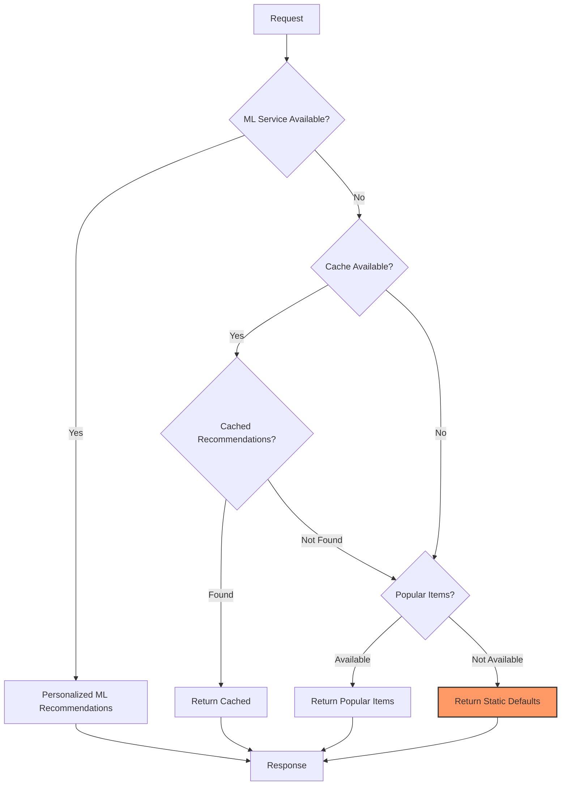
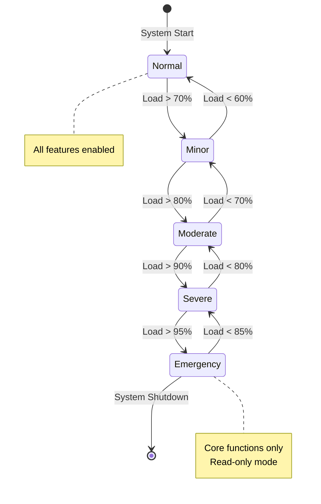
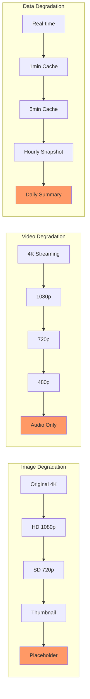

<!-- Navigation -->
[Home](../introduction/index.md) → [Part III: Patterns](index.md) → **Graceful Degradation Pattern**

# Graceful Degradation Pattern

**Maintaining partial functionality when systems fail**

> *"It's better to limp than to fall—systems should degrade, not collapse."*

---

## 🎯 Level 1: Intuition

### The Airplane Analogy

Graceful degradation is like airplane safety systems:
- **Engine failure**: Can fly with remaining engines
- **Hydraulics failure**: Manual backup controls
- **Electrical failure**: Battery backup for essentials
- **All systems fail**: Still glides to landing

Your system should similarly continue operating with reduced functionality rather than crashing completely.

### Degradation Flow



### Basic Graceful Degradation

```python
class RecommendationService:
    def __init__(self):
        self.ml_service = MLRecommendationService()
        self.cache_service = CacheService()
        self.popular_items_cache = []

    def get_recommendations(self, user_id: str) -> List[Item]:
        """Get recommendations with graceful fallbacks"""
        try:
            # Primary: Personalized ML recommendations
            return self.ml_service.get_personalized(user_id)
        except ServiceUnavailableError:
            try:
                # Fallback 1: Cached recommendations
                cached = self.cache_service.get(f"recs:{user_id}")
                if cached:
                    return cached
            except:
                pass

            try:
                # Fallback 2: Popular items
                if self.popular_items_cache:
                    return self.popular_items_cache[:10]
            except:
                pass

            # Fallback 3: Static defaults
            return self.get_static_defaults()

    def get_static_defaults(self) -> List[Item]:
        """Ultimate fallback - hardcoded items"""
        return [
            Item(id="default1", name="Featured Product"),
            Item(id="default2", name="Best Seller"),
            # ... more defaults
        ]
```

---

## 🏗️ Level 2: Foundation

### Degradation Strategies

| Strategy | Description | Example |
|----------|-------------|---------|
| **Feature Removal** | Disable non-critical features | Turn off recommendations |
| **Quality Reduction** | Lower fidelity/accuracy | Serve compressed images |
| **Functionality Limiting** | Reduce scope | Show only recent data |
| **Static Fallback** | Pre-computed results | Cached homepage |
| **Read-Only Mode** | Disable writes | Browse but can't purchase |

### Degradation State Transitions



### Feature Availability Matrix

| Feature | Normal | Minor | Moderate | Severe | Emergency |
|---------|--------|-------|----------|--------|----------|
| Search | ✓ Full | ✓ Full | ✓ Full | ✓ Basic | ✗ |
| Recommendations | ✓ Real-time | ✓ Real-time | ✗ Cached | ✗ | ✗ |
| Inventory | ✓ Real-time | ✓ Real-time | ✗ Cached | ✗ | ✗ |
| Reviews | ✓ Full | ✓ Full | ✓ Cached | ✗ | ✗ |
| Social | ✓ | ✗ | ✗ | ✗ | ✗ |
| Analytics | ✓ | ✗ | ✗ | ✗ | ✗ |
| Images | High | Medium | Low | Text only | None |
| Cache TTL | 60s | 5m | 1h | 24h | ∞ |

### Implementing Service Degradation Levels

```python
from enum import Enum
from typing import Dict, List, Optional

class DegradationLevel(Enum):
    NORMAL = 0      # Full functionality
    MINOR = 1       # Some features disabled
    MODERATE = 2    # Core features only
    SEVERE = 3      # Minimal functionality
    EMERGENCY = 4   # Survival mode

class GracefulDegradationManager:
    def __init__(self):
        self.current_level = DegradationLevel.NORMAL
        self.feature_flags = {}
        self.degradation_rules = self._init_rules()

    def _init_rules(self) -> Dict[DegradationLevel, Dict]:
        """Define what's available at each level"""
        return {
            DegradationLevel.NORMAL: {
                'search': True,
                'recommendations': True,
                'real_time_inventory': True,
                'user_reviews': True,
                'social_features': True,
                'analytics': True,
                'image_quality': 'high',
                'cache_ttl': 60  # seconds
            },
            DegradationLevel.MINOR: {
                'search': True,
                'recommendations': True,
                'real_time_inventory': True,
                'user_reviews': True,
                'social_features': False,  # Disabled
                'analytics': False,        # Disabled
                'image_quality': 'medium',
                'cache_ttl': 300
            },
            DegradationLevel.MODERATE: {
                'search': True,
                'recommendations': False,   # Use cached
                'real_time_inventory': False,  # Use cached
                'user_reviews': 'cached',   # Read from cache
                'social_features': False,
                'analytics': False,
                'image_quality': 'low',
                'cache_ttl': 3600
            },
            DegradationLevel.SEVERE: {
                'search': 'basic',  # Simple search only
                'recommendations': False,
                'real_time_inventory': False,
                'user_reviews': False,
                'social_features': False,
                'analytics': False,
                'image_quality': 'text_only',
                'cache_ttl': 86400
            },
            DegradationLevel.EMERGENCY: {
                'search': False,
                'recommendations': False,
                'real_time_inventory': False,
                'user_reviews': False,
                'social_features': False,
                'analytics': False,
                'image_quality': 'none',
                'cache_ttl': 'infinite'
            }
        }

    def set_degradation_level(self, level: DegradationLevel):
        """Change degradation level"""
        self.current_level = level
        self.feature_flags = self.degradation_rules[level].copy()
        self._notify_services()

    def is_feature_enabled(self, feature: str) -> bool:
        """Check if feature is available"""
        return self.feature_flags.get(feature, False)

    def get_service_config(self, service: str) -> dict:
        """Get degraded configuration for service"""
        base_config = self.feature_flags.copy()

        # Service-specific overrides
        if service == 'image_service':
            return {
                'quality': base_config['image_quality'],
                'lazy_load': self.current_level >= DegradationLevel.MODERATE,
                'placeholder': self.current_level >= DegradationLevel.SEVERE
            }
        elif service == 'search_service':
            return {
                'enabled': base_config['search'] != False,
                'mode': base_config['search'] if isinstance(base_config['search'], str) else 'full',
                'max_results': 100 if self.current_level == DegradationLevel.NORMAL else 10
            }

        return base_config
```

---

## 🔧 Level 3: Deep Dive

### Advanced Degradation Patterns

#### Progressive Enhancement
```python
class ProgressiveEnhancementService:
    """
    Start with basic functionality, enhance if resources available
    """

    def __init__(self):
        self.enhancement_layers = [
            self.basic_functionality,
            self.add_caching,
            self.add_personalization,
            self.add_real_time_features,
            self.add_premium_features
        ]

    def serve_request(self, request: Request) -> Response:
        """Build response progressively"""
        response = Response()
        available_time = request.deadline - time.time()

        for enhancement in self.enhancement_layers:
            if available_time <= 0:
                break

            try:
                start = time.time()
                enhancement(request, response)
                available_time -= (time.time() - start)
            except Exception as e:
                # Log but continue with what we have
                self.log_enhancement_failure(enhancement.__name__, e)

        return response

    def basic_functionality(self, request: Request, response: Response):
        """Core features - must succeed"""
        response.data = self.get_basic_data(request)
        response.status = "basic"

    def add_personalization(self, request: Request, response: Response):
        """Nice to have - personalized content"""
        if self.ml_service.is_healthy():
            response.recommendations = self.ml_service.get_recommendations(
                request.user_id
            )
            response.status = "personalized"

class CircuitBreakerWithDegradation:
    """
    Circuit breaker that enables degraded mode instead of failing
    """

    def __init__(self,
                 primary_function,
                 fallback_function,
                 degraded_function):
        self.primary = primary_function
        self.fallback = fallback_function
        self.degraded = degraded_function
        self.failure_count = 0
        self.state = 'closed'

    def call(self, *args, **kwargs):
        if self.state == 'closed':
            try:
                result = self.primary(*args, **kwargs)
                self.failure_count = 0
                return result
            except Exception as e:
                self.failure_count += 1
                if self.failure_count >= 5:
                    self.state = 'open'
                    self.open_time = time.time()
                return self.fallback(*args, **kwargs)

        elif self.state == 'open':
            if time.time() - self.open_time > 60:  # 1 minute timeout
                self.state = 'half-open'
            return self.degraded(*args, **kwargs)

        else:  # half-open
            try:
                result = self.primary(*args, **kwargs)
                self.state = 'closed'
                self.failure_count = 0
                return result
            except:
                self.state = 'open'
                self.open_time = time.time()
                return self.degraded(*args, **kwargs)
```

#### Content Degradation Strategy



#### Content Degradation
```python
class ContentDegradationService:
    """
    Degrade content quality based on system load
    """

    def __init__(self):
        self.degradation_strategies = {
            'image': self.degrade_image,
            'video': self.degrade_video,
            'data': self.degrade_data
        }

    def degrade_image(self,
                     original_url: str,
                     level: DegradationLevel) -> str:
        """Return appropriate image quality"""
        if level == DegradationLevel.NORMAL:
            return original_url
        elif level == DegradationLevel.MINOR:
            return original_url.replace('.jpg', '_medium.jpg')
        elif level == DegradationLevel.MODERATE:
            return original_url.replace('.jpg', '_small.jpg')
        elif level == DegradationLevel.SEVERE:
            return original_url.replace('.jpg', '_thumb.jpg')
        else:  # EMERGENCY
            return '/static/placeholder.svg'

    def degrade_video(self,
                     video_manifest: dict,
                     level: DegradationLevel) -> dict:
        """Adjust video quality options"""
        qualities = video_manifest['qualities'].copy()

        if level >= DegradationLevel.MINOR:
            # Remove 4K
            qualities = [q for q in qualities if q['resolution'] <= 1080]

        if level >= DegradationLevel.MODERATE:
            # Remove 1080p
            qualities = [q for q in qualities if q['resolution'] <= 720]

        if level >= DegradationLevel.SEVERE:
            # Only lowest quality
            qualities = qualities[:1] if qualities else []

        if level == DegradationLevel.EMERGENCY:
            # No video at all
            return {'error': 'Video temporarily unavailable'}

        return {'qualities': qualities}

    def degrade_data(self,
                    query_params: dict,
                    level: DegradationLevel) -> dict:
        """Reduce data granularity"""
        params = query_params.copy()

        if level >= DegradationLevel.MINOR:
            # Reduce time range
            if 'days' in params:
                params['days'] = min(params['days'], 30)

        if level >= DegradationLevel.MODERATE:
            # Increase aggregation
            params['aggregation'] = 'hourly'
            params['days'] = min(params.get('days', 7), 7)

        if level >= DegradationLevel.SEVERE:
            # Daily aggregation only
            params['aggregation'] = 'daily'
            params['days'] = 1

        return params
```

### Degradation Anti-Patterns

---

## 🚀 Level 4: Expert

### Production Graceful Degradation Systems

#### Netflix's Degradation Strategy
```python
class NetflixDegradationManager:
    """
    Netflix's approach to graceful degradation
    """

    def __init__(self):
        self.playback_configurations = {
            'optimal': {
                'max_bitrate': 15000,  # 4K
                'buffer_size': 30,      # seconds
                'cdn_strategy': 'nearest',
                'features': ['downloads', 'profiles', 'continue_watching']
            },
            'degraded': {
                'max_bitrate': 5000,   # HD
                'buffer_size': 15,
                'cdn_strategy': 'any_available',
                'features': ['continue_watching']
            },
            'minimal': {
                'max_bitrate': 1000,   # SD
                'buffer_size': 5,
                'cdn_strategy': 'fallback',
                'features': []
            }
        }

    def get_playback_config(self,
                          user_context: dict,
                          system_health: dict) -> dict:
        """Determine playback configuration"""
        # Check various health indicators
        cdn_health = system_health.get('cdn_availability', 1.0)
        api_health = system_health.get('api_latency_ms', 0)
        bandwidth = user_context.get('bandwidth_mbps', 0)

        if cdn_health > 0.9 and api_health < 100 and bandwidth > 25:
            config = self.playback_configurations['optimal']
        elif cdn_health > 0.7 and api_health < 500 and bandwidth > 5:
            config = self.playback_configurations['degraded']
        else:
            config = self.playback_configurations['minimal']

        # Apply user-specific adjustments
        return self.apply_user_preferences(config, user_context)

    def apply_fallback_strategies(self, failed_service: str) -> dict:
        """Service-specific fallback strategies"""
        strategies = {
            'recommendation_service': {
                'fallback': 'popular_titles',
                'cache_key': 'popular_by_region',
                'message': 'Showing popular titles in your area'
            },
            'subtitle_service': {
                'fallback': 'embedded_subtitles',
                'cache_key': None,
                'message': 'Limited subtitle options available'
            },
            'download_service': {
                'fallback': None,  # No fallback
                'cache_key': None,
                'message': 'Downloads temporarily unavailable'
            }
        }

        return strategies.get(failed_service, {})

class TwitterDegradation:
    """
    Twitter's approach during high load events
    """

    def __init__(self):
        self.feature_tiers = {
            'essential': [
                'view_timeline',
                'post_tweet',
                'view_tweet'
            ],
            'important': [
                'search',
                'notifications',
                'direct_messages'
            ],
            'nice_to_have': [
                'trending',
                'who_to_follow',
                'moments'
            ],
            'luxury': [
                'analytics',
                'ads',
                'media_upload_4k'
            ]
        }

    def apply_load_based_degradation(self, current_load: float) -> set:
        """Enable features based on load"""
        enabled_features = set()

        # Always include essential
        enabled_features.update(self.feature_tiers['essential'])

        if current_load < 0.7:
            # Normal operation
            enabled_features.update(self.feature_tiers['important'])
            enabled_features.update(self.feature_tiers['nice_to_have'])
            enabled_features.update(self.feature_tiers['luxury'])
        elif current_load < 0.85:
            # Minor degradation
            enabled_features.update(self.feature_tiers['important'])
            enabled_features.update(self.feature_tiers['nice_to_have'])
        elif current_load < 0.95:
            # Significant degradation
            enabled_features.update(self.feature_tiers['important'])
        # Else: Only essential features

        return enabled_features
```bash
### Real-World Case Study: GitHub's Degradation

```python
class GitHubDegradationStrategy:
    """
    GitHub's graceful degradation during incidents
    """

    def __init__(self):
        self.service_priorities = {
            'git_operations': 1,      # Highest priority
            'api_core': 2,
            'web_core': 3,
            'actions_execution': 4,
            'api_search': 5,
            'web_extras': 6,
            'integrations': 7,
            'webhooks': 8             # Lowest priority
        }

    def degrade_for_incident(self,
                           incident_severity: str,
                           affected_systems: List[str]) -> dict:
        """Determine degradation strategy for incident"""
        degradation_plan = {
            'disabled_features': [],
            'limited_features': [],
            'cached_features': [],
            'message': ''
        }

        if incident_severity == 'critical':
            # Disable everything except git operations
            degradation_plan['disabled_features'] = [
                'actions', 'api_search', 'webhooks',
                'integrations', 'web_extras'
            ]
            degradation_plan['limited_features'] = ['api_core', 'web_core']
            degradation_plan['message'] = (
                'GitHub is experiencing issues. '
                'Git operations remain available.'
            )

        elif incident_severity == 'major':
            # Disable non-essential features
            degradation_plan['disabled_features'] = [
                'webhooks', 'integrations'
            ]
            degradation_plan['limited_features'] = [
                'actions', 'api_search'
            ]
            degradation_plan['cached_features'] = ['web_extras']

        elif incident_severity == 'minor':
            # Cache heavy features
            degradation_plan['cached_features'] = [
                'api_search', 'web_extras'
            ]

        return degradation_plan

    def implement_read_only_mode(self) -> dict:
        """Emergency read-only mode configuration"""
        return {
            'allowed_operations': [
                'git_clone',
                'git_fetch',
                'git_pull',
                'view_code',
                'view_issues',
                'view_pull_requests'
            ],
            'blocked_operations': [
                'git_push',
                'create_issue',
                'create_pull_request',
                'comment',
                'merge',
                'delete'
            ],
            'user_message': (
                'GitHub is in read-only mode. '
                'You can view and clone repositories, '
                'but cannot make changes.'
            ),
            'api_response': {
                'status': 503,
                'error': 'Service in read-only mode',
                'retry_after': 300
            }
        }
```yaml
---

## 🎯 Level 5: Mastery

### Theoretical Optimal Degradation

```python
import numpy as np
from scipy.optimize import minimize

class OptimalDegradationStrategy:
    """
    Mathematically optimal feature degradation
    """

    def __init__(self):
        self.features = {}
        self.user_satisfaction_model = None

    def add_feature(self,
                   name: str,
                   resource_cost: float,
                   user_value: float,
                   degradation_options: List[dict]):
        """Define a feature with its degradation options"""
        self.features[name] = {
            'cost': resource_cost,
            'value': user_value,
            'options': degradation_options  # Each option has cost_multiplier and value_multiplier
        }

    def find_optimal_configuration(self,
                                 available_resources: float) -> dict:
        """
        Find configuration that maximizes user value within resource constraints
        """
        # Decision variables: which option for each feature
        n_features = len(self.features)
        n_variables = sum(len(f['options']) for f in self.features.values())

        # Objective: maximize total user value
        def objective(x):
            total_value = 0
            idx = 0

            for feature in self.features.values():
                # Sum of option selections must be 1 (one option selected)
                for i, option in enumerate(feature['options']):
                    if x[idx + i] > 0.5:  # Binary decision
                        total_value += feature['value'] * option['value_multiplier']
                idx += len(feature['options'])

            return -total_value  # Negative for minimization

        # Constraint: total resource usage <= available
        def resource_constraint(x):
            total_cost = 0
            idx = 0

            for feature in self.features.values():
                for i, option in enumerate(feature['options']):
                    if x[idx + i] > 0.5:
                        total_cost += feature['cost'] * option['cost_multiplier']
                idx += len(feature['options'])

            return available_resources - total_cost

        # Constraint: exactly one option per feature
        constraints = [{'type': 'ineq', 'fun': resource_constraint}]

        # Add selection constraints
        idx = 0
        for feature in self.features.values():
            n_options = len(feature['options'])

            def make_selection_constraint(start_idx, n_opts):
                return lambda x: 1 - sum(x[start_idx:start_idx + n_opts])

            constraints.append({
                'type': 'eq',
                'fun': make_selection_constraint(idx, n_options)
            })
            idx += n_options

        # Binary bounds
        bounds = [(0, 1) for _ in range(n_variables)]

        # Initial guess: first option for each feature
        x0 = np.zeros(n_variables)
        idx = 0
        for feature in self.features.values():
            x0[idx] = 1
            idx += len(feature['options'])

        # Solve
        result = minimize(
            objective,
            x0,
            method='SLSQP',
            bounds=bounds,
            constraints=constraints
        )

        # Extract configuration
        configuration = {}
        idx = 0
        for name, feature in self.features.items():
            for i, option in enumerate(feature['options']):
                if result.x[idx + i] > 0.5:
                    configuration[name] = option['name']
                    break
            idx += len(feature['options'])

        return configuration

class AdaptiveDegradation:
    """
    ML-based adaptive degradation
    """

    def __init__(self):
        self.performance_history = []
        self.user_satisfaction_history = []
        self.model = self.build_model()

    def build_model(self):
        """Build ML model to predict optimal degradation"""
        # Features: system metrics, time of day, day of week, special events
        # Target: user satisfaction score

        from sklearn.ensemble import RandomForestRegressor
        return RandomForestRegressor(n_estimators=100)

    def predict_optimal_degradation(self,
                                  system_metrics: dict,
                                  context: dict) -> DegradationLevel:
        """Predict optimal degradation level"""
        features = self.extract_features(system_metrics, context)

        # Predict user satisfaction for each level
        predictions = {}
        for level in DegradationLevel:
            level_features = features + [level.value]
            satisfaction = self.model.predict([level_features])[0]

            # Penalize based on resource usage
            resource_usage = self.estimate_resource_usage(level)
            if resource_usage > system_metrics['available_capacity']:
                satisfaction *= 0.1  # Heavy penalty

            predictions[level] = satisfaction

        # Choose level with highest predicted satisfaction
        return max(predictions.items(), key=lambda x: x[1])[0]
```

### Future Directions

1. **Predictive Degradation**: Degrade preemptively based on predicted load
2. **User-Specific Degradation**: Different features for different user segments
3. **Negotiated Degradation**: Let users choose their degradation preferences
4. **Self-Healing Degradation**: Automatically recover as resources become available

---

## 📋 Quick Reference

### Degradation Decision Matrix

| System Load | User Impact | Degradation Strategy |
|-------------|-------------|---------------------|
| < 70% | None | Full functionality |
| 70-80% | Minimal | Disable analytics, A/B tests |
| 80-90% | Noticeable | Cache aggressively, disable real-time |
| 90-95% | Significant | Core features only |
| > 95% | Survival | Read-only mode |

### Implementation Checklist

- [ ] Identify critical vs non-critical features
- [ ] Define degradation levels
- [ ] Implement feature flags
- [ ] Create fallback mechanisms
- [ ] Add user notifications
- [ ] Monitor degradation effectiveness
- [ ] Test each degradation level
- [ ] Document degradation behavior

---

---

*"The mark of a robust system is not that it never fails, but how gracefully it fails."*

---

**Previous**: [← Geo-Replication Patterns](geo-replication.md) | **Next**: [GraphQL Federation →](graphql-federation.md)
---