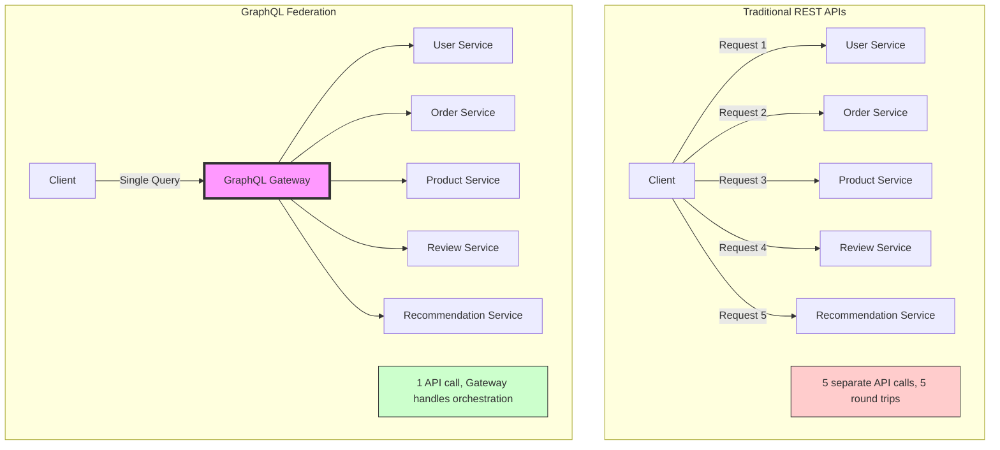
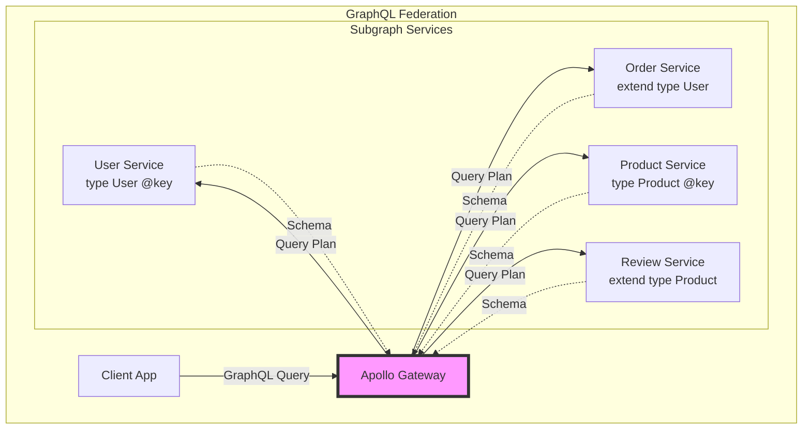
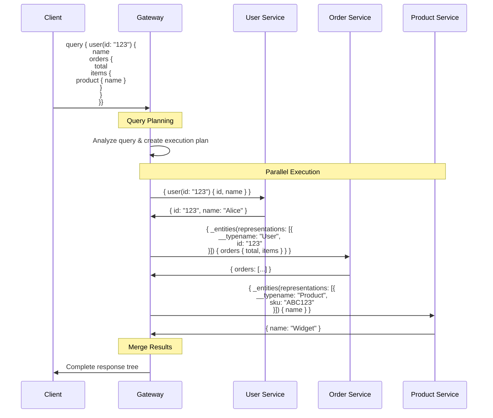

<!-- Navigation -->
[Home](../introduction/index.md) → [Part III: Patterns](index.md) → **GraphQL Federation**

# GraphQL Federation

**One graph to rule them all - Composing distributed APIs into a unified experience**

> *"The best API is not one that does everything, but one that appears to do everything while elegantly delegating to specialized services."*

---

## 🎯 Level 1: Intuition

### The API Orchestra



### The Problem

```javascript
// Without Federation: Mobile app nightmare
async function loadUserDashboard(userId) {
  const user = await fetch(`/api/users/${userId}`);
  const orders = await fetch(`/api/orders?userId=${userId}`);
  const recommendations = await fetch(`/api/recommendations/${userId}`);
  const notifications = await fetch(`/api/notifications/${userId}`);
  const preferences = await fetch(`/api/preferences/${userId}`);
  // 5 calls × 500ms = 2.5 seconds on 3G!
}

// With Federation: One query
const DASHBOARD_QUERY = `
  query GetDashboard($userId: ID!) {
    user(id: $userId) {
      name
      orders(last: 5) {
        id
        total
        items { product { name, price } }
      }
      recommendations { products { id, name, image } }
      notifications(unread: true) { message, timestamp }
      preferences { theme, language }
    }
  }
`;
// One request, 500ms total
```

---

## 🏗️ Level 2: Foundation

### Core Concepts

#### Schema Stitching vs Federation

```graphql
# Schema Stitching (Old Way) - Gateway manually combines
type User {
  id: ID!
  name: String!
  orders: [Order]  # Gateway adds by calling Order Service
}

# Federation (Modern Way) - Services declare capabilities
# User Service
type User @key(fields: "id") {
  id: ID!
  name: String!
  email: String!
}

# Order Service extends User
extend type User @key(fields: "id") {
  id: ID! @external
  orders: [Order]
}
```

### GraphQL Federation Architecture



#### Four Federation Concepts

```graphql
# 1. Entities - Types that can be referenced
type Product @key(fields: "sku") {
  sku: String!
  name: String!
  price: Float!
}

# 2. External Fields - Owned by other services
extend type Order {
  id: ID!
  items: [OrderItem]
}

type OrderItem {
  quantity: Int!
  product: Product  # Resolved by Product Service
}

# 3. Requires - Fields needed from other services
extend type Product @key(fields: "sku") {
  sku: String! @external
  shippingEstimate: String @requires(fields: "sku")
}

# 4. Provides - Optimization hints
type Review {
  product: Product @provides(fields: "name")
}
```

### Basic Implementation

```python
from graphql import GraphQLSchema, GraphQLObjectType, GraphQLField, GraphQLString
from ariadne import make_executable_schema, load_schema_from_path
from ariadne.contrib.federation import make_federated_schema

# User Service Schema
USER_TYPE_DEFS = """
type User @key(fields: "id") {
    id: ID!
    name: String!
    email: String!
}

type Query {
    user(id: ID!): User
    users: [User!]!
}
"""

# User Service Resolvers
class UserService:
    def __init__(self):
        self.users = {
            "1": {"id": "1", "name": "Alice", "email": "alice@example.com"},
            "2": {"id": "2", "name": "Bob", "email": "bob@example.com"}
        }
    
    def resolve_user(self, _, info, id):
        return self.users.get(id)
    
    def resolve_reference(self, _, info, representation):
        """Federation reference resolver"""
        return self.users.get(representation["id"])

# Order Service Schema
ORDER_TYPE_DEFS = """
extend type User @key(fields: "id") {
    id: ID! @external
    orders: [Order!]!
}

type Order {
    id: ID!
    total: Float!
    items: [OrderItem!]!
    user: User!
}

type OrderItem {
    product: Product!
    quantity: Int!
    price: Float!
}

extend type Product @key(fields: "sku") {
    sku: String! @external
}

type Query {
    order(id: ID!): Order
}
"""

# Federation Gateway
class FederationGateway:
    def __init__(self, service_endpoints):
        self.service_endpoints = service_endpoints
        self.schema = self.build_federated_schema()
    
    def build_federated_schema(self):
        """Compose schemas from all services"""
        # Apollo Federation handles the complexity
        return make_federated_schema(
            self.service_endpoints,
            self.resolve_references
        )
    
    async def execute_query(self, query, variables=None):
        """Execute federated query with optimal planning"""
        # Parse query
        document = parse(query)
        
        # Create execution plan
        plan = self.create_query_plan(document)
        
        # Execute plan with batching
        result = await self.execute_plan(plan, variables)
        
        return result
    
    def create_query_plan(self, document):
        """Create optimal execution plan"""
        plan = QueryPlan()
        
        # Analyze query to determine required services
        for selection in document.selections:
            service = self.identify_service(selection)
            plan.add_step(service, selection)
        
        # Optimize for parallel execution
        plan.optimize_for_parallelism()
        
        return plan
```

### Apollo Gateway Setup

```javascript
const { ApolloGateway, IntrospectAndCompose } = require('@apollo/gateway');
const { ApolloServer } = require('apollo-server');

const gateway = new ApolloGateway({
  supergraphSdl: new IntrospectAndCompose({
    subgraphs: [
      { name: 'users', url: 'http://users-service:4001' },
      { name: 'orders', url: 'http://orders-service:4002' },
      { name: 'products', url: 'http://products-service:4003' },
      { name: 'reviews', url: 'http://reviews-service:4004' }
    ],
  }),
  queryPlannerConfig: {
    preferredBatchSize: 10,
    includeCustomScalars: true
  }
});

const server = new ApolloServer({
  gateway,
  subscriptions: { path: '/subscriptions' },
  plugins: [
    require('apollo-server-plugin-operation-registry')({
      forbidUnregisteredOperations: true
    })
  ]
});
```

---

## 🔧 Level 3: Deep Dive

### Advanced Federation Patterns

#### 1. Entity Resolution with Caching

```python
class OptimizedEntityResolver:
    """Efficient entity resolution with caching and batching"""
    
    def __init__(self, cache_ttl=300):
        self.cache = LRUCache(max_size=10000)
        self.cache_ttl = cache_ttl
        self.batch_loader = DataLoader(self._batch_load_entities)
    
    async def resolve_reference(self, typename, representation):
        """Resolve entity reference with caching"""
        # Generate cache key
        cache_key = f"{typename}:{representation['id']}"
        
        # Check cache
        cached = self.cache.get(cache_key)
        if cached and not self._is_expired(cached):
            return cached['data']
        
        # Use DataLoader for batching
        entity = await self.batch_loader.load(
            (typename, representation['id'])
        )
        
        # Cache result
        self.cache.set(cache_key, {
            'data': entity,
            'timestamp': time.time()
        })
        
        return entity
    
    async def _batch_load_entities(self, keys):
        """Batch load multiple entities"""
        # Group by type
        by_type = defaultdict(list)
        for typename, id in keys:
            by_type[typename].append(id)
        
        # Parallel fetch by type
        results = await asyncio.gather(*[
            self._fetch_entities(typename, ids)
            for typename, ids in by_type.items()
        ])
        
        # Map back to original order
        entity_map = {}
        for result_set in results:
            for entity in result_set:
                key = (entity['__typename'], entity['id'])
                entity_map[key] = entity
        
        return [entity_map.get(key) for key in keys]
```

#### 2. Query Complexity Analysis

```python
class QueryComplexityAnalyzer:
    """Prevent expensive queries from overwhelming services"""
    
    def __init__(self, max_complexity=1000):
        self.max_complexity = max_complexity
        self.field_costs = {
            'default': 1,
            'connection': 10,
            'search': 20,
            'aggregate': 50
        }
    
    def analyze(self, query, schema):
        """Calculate query complexity"""
        document = parse(query)
        complexity = self._calculate_complexity(
            document.definitions[0].selection_set,
            schema.query_type
        )
        
        if complexity > self.max_complexity:
            raise GraphQLError(
                f"Query complexity {complexity} exceeds maximum {self.max_complexity}"
            )
        
        return complexity
    
    def _calculate_complexity(self, selections, parent_type, depth=1):
        """Recursively calculate complexity"""
        total = 0
        
        for selection in selections.selections:
            if isinstance(selection, Field):
                field = parent_type.fields.get(selection.name.value)
                if not field:
                    continue
                
                cost = self._get_field_cost(field)
                
                if selection.arguments:
                    first = self._get_argument_value(selection, 'first')
                    last = self._get_argument_value(selection, 'last')
                    multiplier = max(first or 1, last or 1)
                    cost *= multiplier
                
                cost *= (1.5 ** depth)
                total += cost
                
                if selection.selection_set:
                    total += self._calculate_complexity(
                        selection.selection_set,
                        field.type.of_type,
                        depth + 1
                    )
        
        return total
```

#### 3. Smart Query Planning

```python
class SmartQueryPlanner:
    """Optimize query execution across services"""
    
    def __init__(self, service_registry):
        self.service_registry = service_registry
        self.performance_stats = defaultdict(list)
    
    def create_plan(self, query, schema):
        """Create optimized execution plan"""
        document = parse(query)
        
        # Build dependency graph
        dep_graph = self._build_dependency_graph(document, schema)
        
        # Identify parallel opportunities
        parallel_groups = self._find_parallel_groups(dep_graph)
        
        # Optimize based on historical performance
        optimized_groups = self._optimize_by_performance(parallel_groups)
        
        return ExecutionPlan(optimized_groups)
    
    def _build_dependency_graph(self, document, schema):
        """Build graph of field dependencies"""
        graph = nx.DiGraph()
        
        def visit_field(field, parent_path=""):
            field_path = f"{parent_path}.{field.name.value}"
            graph.add_node(field_path, field=field)
            
            requires = self._get_directive(field, 'requires')
            if requires:
                for req_field in requires['fields'].split():
                    req_path = f"{parent_path}.{req_field}"
                    graph.add_edge(req_path, field_path)
            
            if field.selection_set:
                for sub_field in field.selection_set.selections:
                    visit_field(sub_field, field_path)
        
        for field in document.definitions[0].selection_set.selections:
            visit_field(field)
        
        return graph
    
    def _optimize_by_performance(self, parallel_groups):
        """Reorder based on historical performance"""
        return [
            sorted(group, key=lambda op: self._get_avg_response_time(op))
            for group in parallel_groups
        ]
```

### Real Production Implementation

```python
class ProductionFederationGateway:
    """Production-ready federation gateway"""
    
    def __init__(self, config):
        self.config = config
        self.schema = self._build_schema()
        self.executor = self._setup_executor()
        self.metrics = MetricsCollector()
        
    async def handle_request(self, request):
        """Handle GraphQL request with all production concerns"""
        start_time = time.time()
        request_id = str(uuid.uuid4())
        
        try:
            # Extract query and variables
            query = request.json.get('query')
            variables = request.json.get('variables', {})
            operation_name = request.json.get('operationName')
            
            # Validate query
            validation_errors = validate(self.schema, parse(query))
            if validation_errors:
                return self._error_response(validation_errors)
            
            # Check query complexity
            complexity = self.complexity_analyzer.analyze(query, self.schema)
            
            # Rate limiting by complexity
            if not await self.rate_limiter.check(
                request.user_id, 
                cost=complexity
            ):
                return self._error_response("Rate limit exceeded")
            
            # Create context
            context = {
                'request_id': request_id,
                'user': request.user,
                'dataloaders': self._create_dataloaders(),
                'services': self._create_service_clients()
            }
            
            # Execute query
            result = await self.executor.execute(
                query,
                variables=variables,
                context=context,
                operation_name=operation_name
            )
            
            # Record metrics
            self.metrics.record_request(
                duration=time.time() - start_time,
                complexity=complexity,
                errors=len(result.errors) if result.errors else 0
            )
            
            return result
            
        except Exception as e:
            logger.error(f"Request {request_id} failed", exc_info=True)
            return self._error_response("Internal server error")
```

---

## 🚀 Level 4: Expert

### Netflix's Architecture

```python
class NetflixFederationArchitecture:
    def __init__(self):
        self.subgraphs = {
            'catalog': CatalogService(),      # Movie/show metadata
            'playback': PlaybackService(),    # Streaming URLs, DRM
            'user': UserService(),            # Profiles, preferences  
            'recommendations': RecoService(), # ML-powered suggestions
            'studio': StudioService(),        # Content production
            'billing': BillingService()       # Subscription management
        }
        
        self.gateways = {
            'mobile': MobileGateway(),    # Optimized for bandwidth
            'tv': TVGateway(),            # Optimized for simplicity
            'web': WebGateway()           # Full feature set
        }
    
    def mobile_home_screen_query(self):
        return """
        query MobileHome($profileId: ID!) {
          viewer(profileId: $profileId) {
            continueWatching(first: 10) {
              nodes {
                id, title, progress
                thumbnail(format: WEBP, width: 200)
              }
            }
            recommendations {
              rows(first: 5) {
                title
                items(first: 10) {
                  id, title, maturityRating
                  thumbnail(format: WEBP, width: 200)
                }
              }
            }
            topPicks(first: 3) {
              id
              playbackManifest { cdnUrl }
            }
          }
        }
        """
```

### GitHub's Strategy

```python
class GitHubFederationStrategy:
    def __init__(self):
        self.subgraphs = {
            'core': CoreGitService(),         # Repos, commits, branches
            'issues': IssueTrackingService(), # Issues, PRs, projects
            'users': UserService(),           # Users, orgs, teams
            'actions': ActionsService(),      # CI/CD workflows
            'packages': PackageService(),     # Package registry
            'search': SearchService()         # Code search
        }
    
    async def repository_overview_query(self):
        return """
        query RepositoryOverview($owner: String!, $name: String!) {
          repository(owner: $owner, name: $name) {
            # From core service
            id, name, description
            defaultBranch {
              target {
                ... on Commit {
                  history(first: 10) {
                    nodes { message, author { name } }
                  }
                }
              }
            }
            # From issues service  
            issues(states: OPEN) { totalCount }
            pullRequests(states: OPEN) { totalCount }
            # From actions service
            workflowRuns(first: 5) {
              nodes { status, conclusion, workflow { name } }
            }
            # From packages service
            packages(first: 10) {
              nodes {
                name, packageType
                statistics { downloadsTotalCount }
              }
            }
          }
        }
        """
```

### Production Metrics

```python
class ProductionMetrics:
    def shopify_metrics(self):
        return {
            'scale': {
                'subgraphs': 100,
                'types': 1000,
                'fields': 10000,
                'queries_per_second': 100000
            },
            'performance': {
                'p50_latency': '20ms',
                'p95_latency': '100ms', 
                'p99_latency': '500ms',
                'cache_hit_rate': '95%'
            },
            'benefits': {
                'developer_velocity': '3x faster',
                'client_performance': '60% smaller payloads',
                'type_safety': '90% fewer client errors'
            }
        }
    
    def airbnb_metrics(self):
        return {
            'migration': {
                'duration': '2 years',
                'services_migrated': 150,
                'endpoints_replaced': 1000
            },
            'improvements': {
                'mobile_app_size': '-15%',
                'api_calls': '-80% (10 → 2 per screen)',
                'developer_satisfaction': '+40 NPS'
            }
        }
```

### Advanced Optimization Techniques

```python
class AdvancedOptimizations:
    """Production optimizations for federated GraphQL"""
    
    def __init__(self):
        self.query_planner = QueryPlanner()
        self.cache_manager = CacheManager()
        self.security_layer = SecurityLayer()
    
    async def automatic_persisted_queries(self, query_hash):
        """APQ - Send query hash instead of full query"""
        # Check if query is registered
        query = await self.query_registry.get(query_hash)
        if not query:
            # Client sends full query to register
            return {'persistedQuery': {'notFound': True}}
        
        # Execute pre-validated query
        return await self.execute(query)
    
    def query_cost_analysis(self, query):
        """Prevent expensive queries"""
        cost_analysis = {
            'node_cost': 1,         # Base cost per field
            'list_multiplier': 10,  # Lists multiply cost
            'depth_multiplier': 2,  # Deeper = more expensive
            'introspection': 1000   # Introspection is expensive
        }
        
        total_cost = self.calculate_cost(query, cost_analysis)
        
        if total_cost > self.max_cost:
            raise QueryTooExpensiveError(
                f"Query cost {total_cost} exceeds limit {self.max_cost}"
            )
    
    def response_caching(self):
        """Multi-layer caching strategy"""
        return {
            'edge_cache': {
                'ttl': '5m',
                'key': 'query_hash + variables + auth',
                'invalidation': 'tag-based'
            },
            'application_cache': {
                'ttl': '1m',
                'key': 'normalized_query + user_context',
                'invalidation': 'event-driven'
            },
            'dataloader_cache': {
                'ttl': 'request',
                'key': 'entity_type + id',
                'invalidation': 'automatic'
            }
        }
```

---

## 🎯 Level 5: Mastery

### Theoretical Foundations

#### 1. Category Theory in GraphQL

```haskell
-- GraphQL types as categories
class GraphQLCategory where
  -- Objects are types
  type Object :: Type
  
  -- Morphisms are fields/resolvers
  type Morphism :: Object -> Object -> Type
  
  -- Composition of resolvers
  compose :: Morphism b c -> Morphism a b -> Morphism a c
  
  -- Identity resolver
  identity :: Morphism a a

-- Federation as functor between categories
class Federation where
  -- Map types between subgraphs
  fmap :: (TypeA -> TypeB) -> Schema A -> Schema B
  
  -- Preserve structure
  preserve :: Morphism a b -> Morphism (F a) (F b)
```

#### 2. Information Theory Optimization

```python
class InformationTheoreticOptimizer:
    """Optimize query execution using information theory"""
    
    def calculate_information_content(self, field):
        """Shannon entropy of field data"""
        # Probability of field being accessed
        p_access = self.access_stats[field] / self.total_accesses
        
        # Information content
        if p_access > 0:
            return -math.log2(p_access)
        return float('inf')
    
    def optimize_field_order(self, fields):
        """Order fields by information gain"""
        # Calculate mutual information between fields
        mi_matrix = self.calculate_mutual_information(fields)
        
        # Use graph algorithms to find optimal ordering
        G = nx.Graph()
        for i, field1 in enumerate(fields):
            for j, field2 in enumerate(fields[i+1:], i+1):
                weight = mi_matrix[i][j]
                G.add_edge(field1, field2, weight=weight)
        
        # Maximum spanning tree for optimal ordering
        mst = nx.maximum_spanning_tree(G)
        return list(nx.dfs_preorder_nodes(mst))
```

#### 3. Distributed Query Planning

```python
class DistributedQueryPlanner:
    """Optimal query planning across federated services"""
    
    def plan_with_linear_programming(self, query, services):
        """Use LP to minimize query cost"""
        from scipy.optimize import linprog
        
        # Decision variables: x[i,j] = 1 if field i resolved by service j
        num_fields = len(query.fields)
        num_services = len(services)
        
        # Objective: minimize total cost
        c = []
        for field in query.fields:
            for service in services:
                cost = self.estimate_cost(field, service)
                c.append(cost)
        
        # Constraints: each field must be resolved exactly once
        A_eq = []
        b_eq = []
        
        for i in range(num_fields):
            constraint = [0] * (num_fields * num_services)
            for j in range(num_services):
                constraint[i * num_services + j] = 1
            A_eq.append(constraint)
            b_eq.append(1)
        
        # Solve
        result = linprog(c, A_eq=A_eq, b_eq=b_eq, method='highs')
        
        return self.extract_plan(result.x, query.fields, services)
```

### Future Directions

#### 1. AI-Powered Query Optimization

```python
class AIQueryOptimizer:
    """ML-based query optimization"""
    
    def __init__(self):
        self.model = self.load_trained_model()
        self.feature_extractor = QueryFeatureExtractor()
    
    def optimize(self, query, context):
        """Use ML to predict optimal execution plan"""
        features = self.feature_extractor.extract(query, context)
        candidate_plans = self.generate_candidate_plans(query)
        
        predictions = [
            (plan, self.model.predict(self.extract_plan_features(plan, features)))
            for plan in candidate_plans
        ]
        
        return min(predictions, key=lambda x: x[1])[0]
```

#### 2. Quantum-Inspired Optimization

```python
class QuantumInspiredOptimizer:
    """Use quantum computing principles for optimization"""
    
    def quantum_annealing_plan(self, query):
        """Find global optimum using quantum annealing"""
        h, J = self.create_ising_model(query)
        solution = self.simulated_quantum_annealing(h, J, num_reads=1000, annealing_time=20)
        return self.decode_solution(solution, query)
```

### Mathematical Models

#### 1. Cost Model

```
C(Q) = Σᵢ (Lᵢ × Dᵢ) + Σⱼ (Nⱼ × Tⱼ) + P × log(F)

Where:
- Lᵢ = Latency of service i
- Dᵢ = Data transfer from service i  
- Nⱼ = Number of entities in batch j
- Tⱼ = Processing time per entity
- P = Query parsing overhead
- F = Number of fields
```

#### 2. Federation Efficiency

```
E = (R₁ / Rₙ) × (1 / C)

Where:
- R₁ = Response time with 1 service
- Rₙ = Response time with n services
- C = Coordination overhead
```

### Economic Impact

```python
def calculate_graphql_federation_roi():
    costs = {
        'implementation': 500_000,
        'training': 50_000,
        'infrastructure': 100_000,
        'migration': 200_000
    }
    
    benefits = {
        'developer_productivity': {
            'hours_saved_per_dev_per_week': 5,
            'num_developers': 50,
            'hourly_rate': 150,
            'annual_value': 5 * 50 * 150 * 52  # $1.95M
        },
        'performance_improvement': {
            'conversion_increase': 0.02,
            'annual_revenue': 100_000_000,
            'annual_value': 100_000_000 * 0.02  # $2M
        },
        'operational_savings': {
            'reduced_bandwidth': 0.5,
            'monthly_bandwidth_cost': 50_000,
            'annual_value': 50_000 * 12 * 0.5  # $300K
        }
    }
    
    total_cost = sum(costs.values())
    annual_benefit = sum(b['annual_value'] for b in benefits.values())
    
    return {
        'initial_investment': total_cost,
        'annual_return': annual_benefit,
        'payback_period_months': total_cost / (annual_benefit / 12),
        'five_year_roi': (annual_benefit * 5 - total_cost) / total_cost * 100
    }
```

---

## 📚 Quick Reference

### GraphQL Federation Request Flow



### GraphQL Federation Cheat Sheet

```graphql
# Key Directives
@key(fields: "id")           # Define entity
@external                    # Field from another service
@requires(fields: "id")      # Required fields
@provides(fields: "name")    # Optimization hint

# Entity Resolution
type User @key(fields: "id") {
  id: ID!
  name: String!
}

# Extending Types
extend type User @key(fields: "id") {
  id: ID! @external
  orders: [Order!]!
}

# Reference Resolver
_entities(representations: [_Any!]!): [_Entity]!
```

### Common Patterns

```python
# 1. Entity Caching
cache_key = f"{typename}:{id}"
entity = cache.get(cache_key) or fetch_entity(typename, id)

# 2. Batch Loading
loader = DataLoader(batch_load_fn)
result = await loader.load(key)

# 3. Query Complexity
complexity = calculate_complexity(query)
if complexity > max_allowed:
    raise QueryTooComplexError()

# 4. Schema Composition
gateway = ApolloGateway(service_list=services)
schema = gateway.composed_schema
```

### Federation vs Traditional Architectures

| Aspect | REST APIs | GraphQL Monolith | GraphQL Federation |
|--------|-----------|------------------|-----------------|
| **Network Calls** | Multiple per view | Single | Single |
| **Type Safety** | OpenAPI/manual | Strong | Strong |
| **Service Independence** | High | None | High |
| **Schema Evolution** | Versioning | Risky | Safe |
| **Client Complexity** | High | Low | Low |
| **Backend Complexity** | Medium | Low | Medium |
| **Performance** | Over/under-fetching | Optimal | Optimal |

### Performance Tips

1. **Use DataLoader**: Batch entity resolution
2. **Implement APQ**: Reduce query parsing overhead
3. **Cache aggressively**: At edge, gateway, and service levels
4. **Monitor field usage**: Remove unused fields
5. **Optimize resolvers**: N+1 queries kill performance

---

**Previous**: [← Auto-scaling Pattern](auto-scaling.md) | **Next**: [Health Check Pattern →](health-check.md)