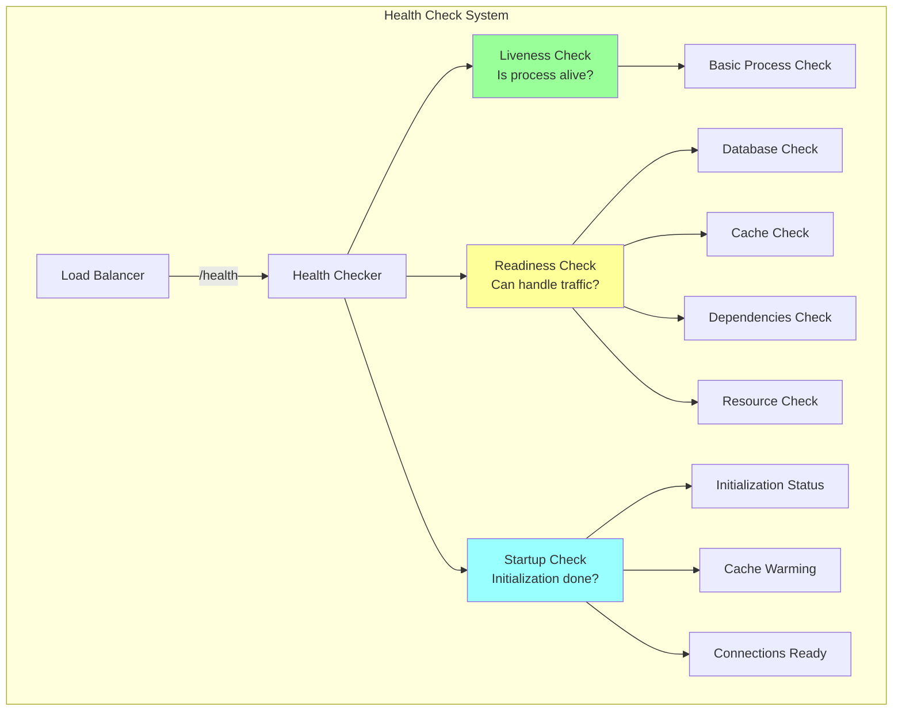
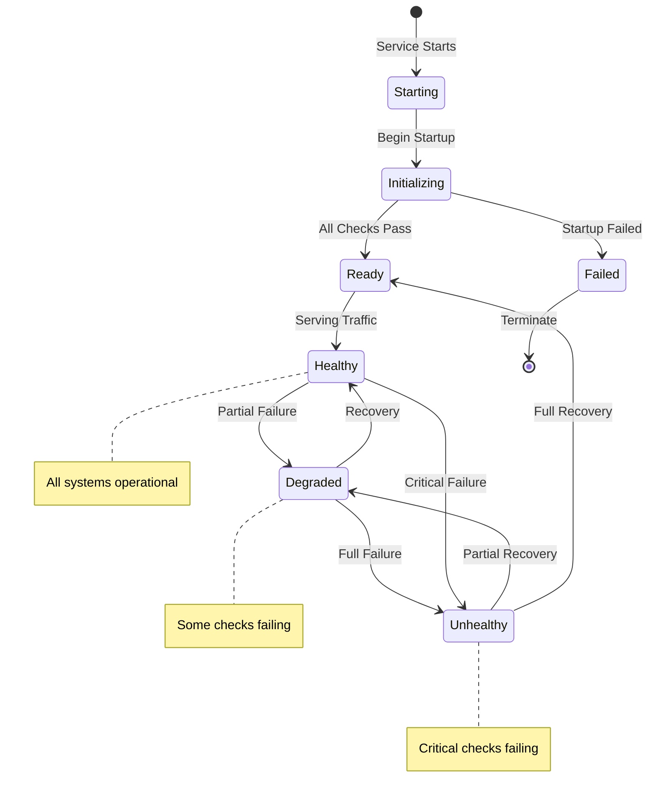
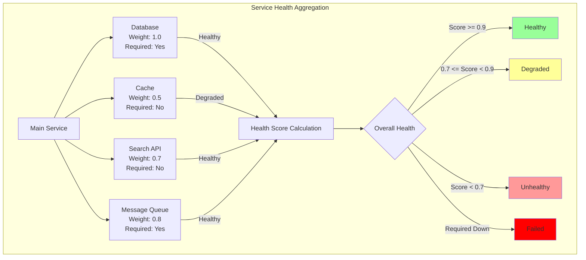

# Health Check Pattern

**Monitoring service health for reliable systems**

> *"A system that doesn't know it's sick can't heal itself."*

---

## 🎯 Level 1: Intuition

### The Medical Checkup Analogy

Health checks are like regular medical checkups:
- **Basic vitals**: Is the service responding? (pulse check)
- **Specific tests**: Can it connect to the database? (blood test)
- **Comprehensive exam**: Full system validation (annual physical)

### Health Check Architecture



### Health Check State Machine



---

## 🏗️ Level 2: Foundation

### Types of Health Checks

| Check Type | Purpose | Frequency | Timeout |
|------------|---------|-----------|---------|
| **Liveness** | Is process alive? | 10-30s | 1-2s |
| **Readiness** | Can handle traffic? | 5-10s | 2-5s |
| **Startup** | Initialization complete? | 1-5s | 30-60s |
| **Deep** | Full dependency check | 30-60s | 10-20s |

### Health Check Response Standards

```json
{
  "status": "healthy|degraded|unhealthy",
  "version": "1.2.3",
  "timestamp": "2024-01-15T10:30:00Z",
  "checks": {
    "database": {
      "status": "healthy",
      "response_time_ms": 45
    },
    "cache": {
      "status": "degraded",
      "message": "High latency detected",
      "response_time_ms": 250
    },
    "disk": {
      "status": "healthy",
      "free_space_gb": 45.2,
      "usage_percent": 65
    }
  }
}
```

### Implementing Comprehensive Health Checks

```python
import asyncio
import time
from enum import Enum
from dataclasses import dataclass
from typing import Dict, List, Optional

class HealthStatus(Enum):
    HEALTHY = "healthy"
    DEGRADED = "degraded"
    UNHEALTHY = "unhealthy"

@dataclass
class HealthCheckResult:
    name: str
    status: HealthStatus
    message: Optional[str] = None
    response_time_ms: Optional[float] = None
    metadata: Optional[Dict] = None

class HealthChecker:
    def __init__(self):
        self.checks = []

    def register_check(self, name: str, check_func, critical: bool = True):
        """Register a health check function"""
        self.checks.append({
            'name': name,
            'func': check_func,
            'critical': critical
        })

    async def run_checks(self, timeout: float = 5.0) -> Dict:
        """Run all registered health checks"""
        results = []
        overall_status = HealthStatus.HEALTHY

        # Run checks in parallel with timeout
        tasks = []
        for check in self.checks:
            task = self._run_single_check(check, timeout)
            tasks.append(task)

        results = await asyncio.gather(*tasks, return_exceptions=True)

        # Determine overall status
        for i, result in enumerate(results):
            if isinstance(result, Exception):
                # Check timed out or failed
                result = HealthCheckResult(
                    name=self.checks[i]['name'],
                    status=HealthStatus.UNHEALTHY,
                    message=str(result)
                )

            if result.status == HealthStatus.UNHEALTHY:
                if self.checks[i]['critical']:
                    overall_status = HealthStatus.UNHEALTHY
                elif overall_status != HealthStatus.UNHEALTHY:
                    overall_status = HealthStatus.DEGRADED
            elif result.status == HealthStatus.DEGRADED:
                if overall_status == HealthStatus.HEALTHY:
                    overall_status = HealthStatus.DEGRADED

        return {
            'status': overall_status.value,
            'timestamp': time.time(),
            'checks': {r.name: r.__dict__ for r in results}
        }

    async def _run_single_check(self, check: Dict, timeout: float) -> HealthCheckResult:
        """Run a single check with timeout"""
        start_time = time.time()

        try:
            result = await asyncio.wait_for(
                check['func'](),
                timeout=timeout
            )

            response_time = (time.time() - start_time) * 1000

            return HealthCheckResult(
                name=check['name'],
                status=result.get('status', HealthStatus.HEALTHY),
                message=result.get('message'),
                response_time_ms=response_time,
                metadata=result.get('metadata')
            )
        except asyncio.TimeoutError:
            return HealthCheckResult(
                name=check['name'],
                status=HealthStatus.UNHEALTHY,
                message=f"Check timed out after {timeout}s"
            )
        except Exception as e:
            return HealthCheckResult(
                name=check['name'],
                status=HealthStatus.UNHEALTHY,
                message=str(e)
            )
```

---

## 🔧 Level 3: Deep Dive

### Advanced Health Check Patterns

#### Dependency Health Aggregation



```python
class DependencyHealthChecker:
    """Check health of all dependencies with smart aggregation"""

    def __init__(self):
        self.dependencies = {}
        self.weights = {}  # Importance weights

    def add_dependency(self, name: str,
                      health_url: str,
                      weight: float = 1.0,
                      required: bool = True):
        self.dependencies[name] = {
            'url': health_url,
            'required': required
        }
        self.weights[name] = weight

    async def check_all_dependencies(self) -> Dict:
        """Check all dependencies and calculate weighted health score"""
        results = {}
        total_weight = 0
        healthy_weight = 0

        async with aiohttp.ClientSession() as session:
            tasks = []
            for name, config in self.dependencies.items():
                task = self._check_dependency(session, name, config)
                tasks.append(task)

            dep_results = await asyncio.gather(*tasks)

            for name, result in zip(self.dependencies.keys(), dep_results):
                results[name] = result

                if result['healthy']:
                    healthy_weight += self.weights[name]
                elif self.dependencies[name]['required']:
                    # Required dependency is down
                    return {
                        'status': 'unhealthy',
                        'score': 0,
                        'dependencies': results
                    }

                total_weight += self.weights[name]

        # Calculate health score
        health_score = healthy_weight / total_weight if total_weight > 0 else 0

        if health_score >= 0.9:
            status = 'healthy'
        elif health_score >= 0.7:
            status = 'degraded'
        else:
            status = 'unhealthy'

        return {
            'status': status,
            'score': health_score,
            'dependencies': results
        }
```

#### Circuit Breaker Integration
```python
class CircuitBreakerHealthCheck:
    """Health checks that integrate with circuit breakers"""

    def __init__(self, circuit_breaker):
        self.circuit_breaker = circuit_breaker
        self.consecutive_failures = 0
        self.failure_threshold = 3

    async def health_check_with_circuit_breaker(self):
        """Health check that can trip circuit breaker"""
        try:
            # Perform health check
            result = await self.perform_health_check()

            if result['status'] == 'healthy':
                self.consecutive_failures = 0
                # If circuit is open, consider closing it
                if self.circuit_breaker.state == 'open':
                    self.circuit_breaker.transition_to_half_open()
            else:
                self.consecutive_failures += 1

                # Trip circuit breaker if threshold exceeded
                if self.consecutive_failures >= self.failure_threshold:
                    self.circuit_breaker.trip()

            return result

        except Exception as e:
            self.consecutive_failures += 1
            if self.consecutive_failures >= self.failure_threshold:
                self.circuit_breaker.trip()
            raise
```

### Health Check Anti-Patterns

---

## 🚀 Level 4: Expert

### Production Health Check Strategies

#### Adaptive Health Checks
```python
class AdaptiveHealthCheck:
    """
    Adjusts health check aggressiveness based on system state
    """

    def __init__(self):
        self.recent_results = deque(maxlen=100)
        self.check_interval = 10  # seconds
        self.deep_check_probability = 0.1

    def should_run_deep_check(self) -> bool:
        """Determine if deep health check is needed"""
        # More deep checks if recent failures
        failure_rate = sum(1 for r in self.recent_results if not r) / len(self.recent_results) if self.recent_results else 0

        if failure_rate > 0.1:
            # System unstable, increase deep checks
            return random.random() < 0.5
        elif failure_rate > 0.05:
            # Some instability
            return random.random() < 0.2
        else:
            # System stable
            return random.random() < self.deep_check_probability

    async def adaptive_health_check(self):
        """Run appropriate health check based on system state"""
        if self.should_run_deep_check():
            result = await self.deep_health_check()
        else:
            result = await self.shallow_health_check()

        self.recent_results.append(result['healthy'])
        self.adjust_check_interval(result)

        return result

    def adjust_check_interval(self, result):
        """Adjust how frequently health checks run"""
        if not result['healthy']:
            # Check more frequently when unhealthy
            self.check_interval = max(5, self.check_interval * 0.8)
        else:
            # Check less frequently when stable
            self.check_interval = min(60, self.check_interval * 1.1)

#### Kubernetes-Style Health Probes
```python
class KubernetesHealthProbes:
    """
    Implement Kubernetes-style liveness, readiness, and startup probes
    """

    def __init__(self, app):
        self.app = app
        self.startup_complete = False
        self.startup_tasks = []

    async def startup_probe(self) -> Dict:
        """Check if application has started successfully"""
        if self.startup_complete:
            return {"status": "started", "ready": True}

        # Check startup tasks
        completed = sum(1 for task in self.startup_tasks if task.done())
        total = len(self.startup_tasks)

        if completed == total:
            self.startup_complete = True
            return {"status": "started", "ready": True}
        else:
            return {
                "status": "starting",
                "ready": False,
                "progress": f"{completed}/{total}",
                "message": f"Startup in progress: {completed}/{total} tasks complete"
            }

    async def liveness_probe(self) -> Dict:
        """Check if application is alive and should not be restarted"""
        try:
            # Basic checks that should always work
            # Avoid checking external dependencies here

            # Check event loop responsiveness
            start = time.time()
            await asyncio.sleep(0)
            event_loop_delay = time.time() - start

            if event_loop_delay > 1.0:
                return {
                    "status": "unhealthy",
                    "reason": "Event loop blocked",
                    "event_loop_delay_ms": event_loop_delay * 1000
                }

            # Check critical internal components
            if not self.app.critical_component_healthy():
                return {
                    "status": "unhealthy",
                    "reason": "Critical component failure"
                }

            return {"status": "healthy"}

        except Exception as e:
            return {
                "status": "unhealthy",
                "reason": str(e)
            }

    async def readiness_probe(self) -> Dict:
        """Check if application is ready to serve traffic"""
        if not self.startup_complete:
            return {"status": "not_ready", "reason": "Still starting up"}

        # Check all dependencies needed to serve traffic
        checks = {
            "database": await self.check_database_ready(),
            "cache": await self.check_cache_ready(),
            "downstream_services": await self.check_downstream_ready()
        }

        all_ready = all(check["ready"] for check in checks.values())

        return {
            "status": "ready" if all_ready else "not_ready",
            "checks": checks
        }

### Real-World Case Study: Netflix's Deep Health Checks

```python
class NetflixDeepHealthCheck:
    """
    Netflix's approach to comprehensive health checking
    """

    def __init__(self):
        self.metrics = PrometheusMetrics()
        self.cache = HealthCheckCache(ttl=30)

    async def zuul_health_check(self):
        """
        Zuul (API Gateway) health check strategy
        """
        # Level 1: Basic process health
        basic_health = await self.basic_process_check()
        if not basic_health['healthy']:
            return basic_health

        # Level 2: Critical path validation
        critical_path = await self.validate_critical_path()
        if not critical_path['healthy']:
            return {
                **critical_path,
                'degraded': True,
                'serving_traffic': True  # Still serve with degradation
            }

        # Level 3: Capacity checks
        capacity = await self.check_capacity_health()

        # Level 4: Predictive health
        predicted_issues = await self.ml_health_prediction()

        return {
            'status': self.calculate_overall_status(
                basic_health,
                critical_path,
                capacity,
                predicted_issues
            ),
            'components': {
                'basic': basic_health,
                'critical_path': critical_path,
                'capacity': capacity,
                'predictions': predicted_issues
            },
            'metrics': {
                'request_rate': self.metrics.get_request_rate(),
                'error_rate': self.metrics.get_error_rate(),
                'latency_p99': self.metrics.get_latency_p99()
            }
        }

    async def validate_critical_path(self):
        """Test actual user-facing functionality"""
        try:
            # Simulate real user request
            test_user_id = "health_check_user"

            # Can we authenticate?
            auth_token = await self.auth_service.get_token(test_user_id)

            # Can we fetch user data?
            user_data = await self.user_service.get_profile(
                test_user_id,
                auth_token
            )

            # Can we get recommendations?
            recommendations = await self.recommendation_service.get_titles(
                test_user_id,
                limit=1
            )

            return {
                'healthy': True,
                'critical_path_latency_ms': self.timer.elapsed_ms()
            }

        except Exception as e:
            return {
                'healthy': False,
                'error': str(e),
                'critical_path_failed': True
            }
```yaml
---

## 🎯 Level 5: Mastery

### Theoretical Optimal Health Checking

```python
class OptimalHealthChecker:
    """
    Information theory optimal health checking
    """

    def __init__(self):
        self.failure_probability_model = self.load_ml_model()
        self.check_costs = {}  # Cost in ms for each check
        self.information_gains = {}  # Bits of information per check

    def calculate_optimal_check_sequence(self, time_budget_ms: float) -> List[str]:
        """
        Find optimal sequence of health checks given time budget
        Using information theory and dynamic programming
        """
        # Calculate information gain per unit time for each check
        check_efficiency = {}
        for check_name, cost_ms in self.check_costs.items():
            info_gain = self.information_gains[check_name]
            efficiency = info_gain / cost_ms  # Bits per millisecond
            check_efficiency[check_name] = efficiency

        # Dynamic programming to find optimal subset
        checks = list(self.check_costs.keys())
        n = len(checks)

        # dp[i][t] = max information gain using first i checks with time budget t
        dp = [[0.0 for _ in range(int(time_budget_ms) + 1)] for _ in range(n + 1)]

        for i in range(1, n + 1):
            check = checks[i - 1]
            cost = int(self.check_costs[check])
            gain = self.information_gains[check]

            for t in range(int(time_budget_ms) + 1):
                # Don't include this check
                dp[i][t] = dp[i-1][t]

                # Include this check if we have time
                if t >= cost:
                    dp[i][t] = max(dp[i][t], dp[i-1][t-cost] + gain)

        # Backtrack to find which checks to run
        selected_checks = []
        t = int(time_budget_ms)
        for i in range(n, 0, -1):
            if dp[i][t] != dp[i-1][t]:
                selected_checks.append(checks[i-1])
                t -= int(self.check_costs[checks[i-1]])

        # Sort by efficiency for execution order
        selected_checks.sort(
            key=lambda x: check_efficiency[x],
            reverse=True
        )

        return selected_checks

    def calculate_information_gain(self, check_name: str) -> float:
        """
        Calculate information gain (entropy reduction) from a health check
        """
        # P(system_healthy | check_passes)
        p_healthy_given_pass = self.get_conditional_probability(
            check_name,
            'pass'
        )

        # P(system_healthy | check_fails)
        p_healthy_given_fail = self.get_conditional_probability(
            check_name,
            'fail'
        )

        # P(check_passes)
        p_check_passes = self.get_check_success_rate(check_name)

        # Calculate entropy before and after check
        h_before = self.binary_entropy(self.get_system_health_rate())

        h_after = (
            p_check_passes * self.binary_entropy(p_healthy_given_pass) +
            (1 - p_check_passes) * self.binary_entropy(p_healthy_given_fail)
        )

        information_gain = h_before - h_after

        return information_gain

    @staticmethod
    def binary_entropy(p: float) -> float:
        """Calculate binary entropy H(p)"""
        if p == 0 or p == 1:
            return 0
        return -p * math.log2(p) - (1-p) * math.log2(1-p)
```

### Future Directions

1. **Quantum Health Checks**: Superposition of health states
2. **AI-Driven Health Prediction**: Predict failures before they happen
3. **Distributed Consensus Health**: Byzantine fault tolerant health checking
4. **Self-Healing Integration**: Automatic remediation based on health

---

## 📋 Quick Reference

### Health Check Design Principles

1. **Fast**: Health checks should complete quickly (< 5 seconds)
2. **Isolated**: Don't cascade health check failures
3. **Meaningful**: Check actual functionality, not just process existence
4. **Cached**: Cache expensive checks appropriately
5. **Graceful**: Differentiate between degraded and failed

### Implementation Checklist

- [ ] Implement separate liveness and readiness endpoints
- [ ] Add timeout to all health checks
- [ ] Include version information in response
- [ ] Log health check failures for debugging
- [ ] Monitor health check latency
- [ ] Test health checks under load
- [ ] Document what each check validates

---

---

*"The best time to check health is before you get sick."*

---

**Previous**: ← GraphQL Federation (Coming Soon) | **Next**: Idempotent Receiver Pattern → (Coming Soon)