# Health Check Pattern

!!! success "🏆 Gold Standard Pattern"
    **Service Health Monitoring** • Kubernetes, AWS, Netflix proven
    
    Essential for automated recovery and load balancing. Health checks enable systems to detect and route around failures automatically.

<div class="axiom-box">
<h4>⚛️ Law 3: Emergent Chaos</h4>

Health checks are our defense against emergent chaos in distributed systems. A single unhealthy service can cascade through dependencies, creating system-wide failures. By continuously monitoring health and automatically removing unhealthy instances, we contain chaos before it spreads.

**Key Insight**: Health is not binary in distributed systems - services can be partially healthy, degraded, or in various states of failure. Sophisticated health checks must reflect this reality.
</div>

## Health Check Types

| Type | Purpose | Frequency | Timeout | Failure Action |
|------|---------|-----------|---------|----------------|
| **Liveness** | Process alive? | 10-30s | 1-2s | Restart container |
| **Readiness** | Can handle traffic? | 5-10s | 2-5s | Remove from LB |
| **Startup** | Initialization done? | 1-5s | 30-60s | Delay traffic |
| **Deep** | Full dependency check | 30-60s | 10-20s | Alert + degrade |

## Health Check Flow

```mermaid
flowchart TD
    subgraph "Health Check Decision Tree"
        Request[Health Request] --> Type{Check Type?}
        
        Type -->|Liveness| L[Process Check]
        Type -->|Readiness| R[Dependencies]
        Type -->|Startup| S[Init Status]
        
        L -->|Pass| L200[200 OK]
        L -->|Fail| L503[503 → Restart]
        
        R -->|All OK| R200[200 OK]
        R -->|Partial| R503[503 → No Traffic]
        
        S -->|Complete| S200[200 → Ready]
        S -->|Pending| S503[503 → Wait]
    end
    
    style L200 fill:#9f9
    style R200 fill:#9f9
    style S200 fill:#9f9
    style L503 fill:#f99
    style R503 fill:#ff9
    style S503 fill:#ff9
```



## Health States


## Response Format

```json
{
  "status": "healthy|degraded|unhealthy",
  "version": "1.2.3",
  "timestamp": "2024-01-15T10:30:00Z",
  "checks": {
    "database": {
      "status": "healthy",
      "response_time_ms": 45
    },
    "cache": {
      "status": "degraded",
      "message": "High latency",
      "response_time_ms": 250
    }
  }
}
```

## Dependency Aggregation

```mermaid
flowchart LR
    subgraph "Health Score Calculation"
        Service[Service] --> DB[DB<br/>Weight: 1.0<br/>Required]
        Service --> Cache[Cache<br/>Weight: 0.5<br/>Optional]
        Service --> API[API<br/>Weight: 0.7<br/>Optional]
        
        DB -->|✓| Score[Score = Σ(weight × status)]
        Cache -->|~| Score
        API -->|✓| Score
        
        Score --> Status{Health Status}
        Status -->|≥0.9| H[Healthy]
        Status -->|≥0.7| D[Degraded]
        Status -->|<0.7| U[Unhealthy]
    end
    
    style H fill:#9f9
    style D fill:#ff9
    style U fill:#f99
```

<div class="failure-vignette">
<h4>💥 The Amazon Prime Day Health Check Failure (2018)</h4>

**What Happened**: Amazon's auto-scaling system failed during Prime Day due to a misconfigured health check, causing widespread outages

**Root Cause**: 
- Health checks were configured with overly aggressive timeouts (1 second)
- During peak load, services took 1.2-1.5 seconds to respond
- Auto-scaler marked healthy instances as unhealthy
- System terminated good instances during highest load
- Death spiral: fewer instances → more load → more "failures"

**Impact**: 
- 63 minutes of degraded service during peak shopping
- Estimated $72M in lost sales
- Cascading failures across 15+ services
- Emergency manual intervention required

**Lessons Learned**:
- Health check timeouts must account for peak load response times
- Separate health check endpoints from business logic
- Use gradual health transitions (healthy → degraded → unhealthy)
- Circuit breakers on health check failures themselves
</div>

<div class="decision-box">
<h4>🎯 Health Check Design Strategy</h4>

**Shallow Health Checks (Fast):**
- Simple process alive check
- Memory/CPU within bounds
- Can accept connections
- Use for: Load balancers, quick failure detection
- Timeout: 1-2 seconds, Frequency: 5-10 seconds

**Deep Health Checks (Thorough):**
- Database connectivity verified
- Critical dependencies reachable
- Cache connections healthy
- Use for: Readiness probes, startup checks
- Timeout: 5-10 seconds, Frequency: 30-60 seconds

**Dependency Health Checks (Smart):**
- Weighted scoring system
- Non-critical dependencies = degraded
- Critical dependencies = unhealthy
- Use for: Complex microservices
- Implement circuit breakers per dependency

**Synthetic Health Checks (Proactive):**
- Execute real user journey
- Verify end-to-end functionality
- Measure business metrics
- Use for: Critical user paths
- Run continuously from multiple regions
</div>

## Implementation Patterns

### Basic Health Check

```python
from typing import Dict, List
import asyncio
import time

class HealthChecker:
    def __init__(self):
        self.checks = {}
        
    def register_check(self, name: str, check_fn, timeout: float = 5.0):
        """Register a health check function"""
        self.checks[name] = {
            'function': check_fn,
            'timeout': timeout
        }
    
    async def check_health(self) -> Dict:
        """Run all health checks"""
        results = {}
        start_time = time.time()
        
        # Run checks in parallel
        tasks = []
        for name, config in self.checks.items():
            task = self._run_check(name, config)
            tasks.append(task)
        
        check_results = await asyncio.gather(*tasks, return_exceptions=True)
        
        # Aggregate results
        all_healthy = True
        for name, result in zip(self.checks.keys(), check_results):
            if isinstance(result, Exception):
                results[name] = {
                    'status': 'unhealthy',
                    'error': str(result)
                }
                all_healthy = False
            else:
                results[name] = result
                if result['status'] != 'healthy':
                    all_healthy = False
        
        return {
            'status': 'healthy' if all_healthy else 'unhealthy',
            'timestamp': time.time(),
            'duration_ms': (time.time() - start_time) * 1000,
            'checks': results
        }
```

### Weighted Dependencies

```python
class WeightedHealthChecker:
    def __init__(self):
        self.dependencies = []
        
    def add_dependency(
        self, 
        name: str, 
        check_fn,
        weight: float = 1.0,
        required: bool = False
    ):
        self.dependencies.append({
            'name': name,
            'check': check_fn,
            'weight': weight,
            'required': required
        })
    
    async def calculate_health_score(self) -> Dict:
        """Calculate weighted health score"""
        total_weight = 0
        healthy_weight = 0
        
        for dep in self.dependencies:
            result = await dep['check']()
            
            if dep['required'] and result['status'] != 'healthy':
                return {'status': 'unhealthy', 'score': 0}
            
            total_weight += dep['weight']
            if result['status'] == 'healthy':
                healthy_weight += dep['weight']
        
        score = healthy_weight / total_weight if total_weight > 0 else 0
        
        if score >= 0.9:
            status = 'healthy'
        elif score >= 0.7:
            status = 'degraded'
        else:
            status = 'unhealthy'
            
        return {'status': status, 'score': score}
```

## Kubernetes Health Probes

```yaml
apiVersion: v1
kind: Pod
spec:
  containers:
  - name: app
    livenessProbe:
      httpGet:
        path: /health/liveness
        port: 8080
      initialDelaySeconds: 30
      periodSeconds: 10
      timeoutSeconds: 1
      failureThreshold: 3
      
    readinessProbe:
      httpGet:
        path: /health/readiness
        port: 8080
      initialDelaySeconds: 5
      periodSeconds: 5
      timeoutSeconds: 2
      failureThreshold: 1
      
    startupProbe:
      httpGet:
        path: /health/startup
        port: 8080
      initialDelaySeconds: 0
      periodSeconds: 1
      timeoutSeconds: 30
      failureThreshold: 30
```

## Best Practices vs Anti-Patterns

| Best Practice | Anti-Pattern | Why |
|---------------|--------------|-----|
| Simple liveness checks | Expensive operations | Avoid false restarts |
| Timeout all checks | No timeouts | Prevent blocking |
| Cache expensive results | Repeat costly checks | Reduce load |
| Support degraded state | Binary up/down | Graceful degradation |
| Isolate check failures | Cascading failures | Fault isolation |

## Production Strategies

| Strategy | Use Case | Complexity |
|----------|----------|------------|
| **Adaptive Checks** | Variable load | High |
| **Circuit Breaker** | Cascading failures | Medium |
| **Weighted Dependencies** | Complex systems | Medium |
| **Predictive Health** | Large scale | High |

## Monitoring Dashboard

| Metric | Alert Threshold | Action |
|--------|-----------------|--------|
| **Check Latency** | > 5s | Investigate slow checks |
| **Failure Rate** | > 5% | Review thresholds |
| **Flapping** | > 3 changes/min | Increase stability |
| **Coverage** | < 90% | Add missing checks |

<div class="truth-box">
<h4>💡 Health Check Production Insights</h4>

**The 3-5-10 Rule:**
- 3 seconds: Maximum acceptable health check response time
- 5 retries: Before marking instance unhealthy
- 10 seconds: Minimum interval between checks

**Health Check Paradoxes:**
- Healthy instances can fail health checks under load
- Unhealthy instances can pass shallow health checks
- The healthiest instance might have the worst health score (it's handling the most traffic)

**Production Reality:**
> "A health check that never fails is probably not checking anything important. A health check that always fails is checking too much."

**Economic Truth:**
- Cost of false positive (killing healthy instance): ~$1000/incident
- Cost of false negative (keeping unhealthy instance): ~$10,000/hour
- Always bias toward keeping instances alive during uncertainty

**The Three Stages of Health Check Maturity:**
1. **Binary**: "Is it up?" (Usually insufficient)
2. **Graduated**: "Healthy/Degraded/Unhealthy" (Good for most)
3. **Scored**: "73% healthy with these specific issues" (Best for complex systems)
</div>

## Implementation Checklist

- [ ] Separate liveness/readiness/startup endpoints
- [ ] Configure appropriate timeouts (1-5s)
- [ ] Set check intervals (5-30s based on type)
- [ ] Implement dependency health aggregation
- [ ] Add circuit breaker integration
- [ ] Cache expensive health checks
- [ ] Monitor check latency and success rate
- [ ] Document what each check validates
- [ ] Test failure scenarios

## See Also

- [Circuit Breaker](circuit-breaker.md) - Prevent cascade failures
- [Service Discovery](service-discovery.md) - Health-aware routing
- [Load Balancing](load-balancing.md) - Health-based distribution
- [Observability](observability.md) - Monitoring patterns