# Heartbeat Pattern

!!! abstract "Pattern Overview"
    **🎯 Purpose**: Detect failed nodes within seconds, not minutes
    **💗 Analogy**: Like checking someone's pulse to see if they're alive
    **⚡ Speed**: Detect failures in 3-30 seconds (configurable)
    **🔄 Trade-off**: Network traffic vs detection speed

## The Problem: Is It Dead or Just Slow?

### Without Heartbeats: The Waiting Game


### With Heartbeats: Quick Detection

```mermaid
sequenceDiagram
    participant Monitor
    participant NodeA
    participant NodeB
    
    loop Every 10 seconds
        NodeA->>Monitor: 💗 Heartbeat (I'm alive!)
        NodeB->>Monitor: 💗 Heartbeat (I'm alive!)
    end
    
    Note over NodeA: Node A crashes
    
    NodeA--xMonitor: ❌ No heartbeat
    
    Note over Monitor: After 30 seconds (3 missed)
    Monitor->>Monitor: Mark Node A as DEAD
    Monitor->>NodeB: Node A is down, take over!
```



## How Heartbeats Work

### Basic Components

| Component | Purpose | Typical Value |
|-----------|---------|---------------|
| **Heartbeat Interval** | How often to send pulse | 10 seconds |
| **Timeout** | How long to wait | 3 × interval |
| **Failure Threshold** | Missed heartbeats before dead | 3 |
| **Recovery** | Heartbeats to mark alive | 1 |

### Visual State Machine


## Implementation Patterns

### Pattern 1: Simple Heartbeat

```python
# Heartbeat sender (runs on each node)
def heartbeat_sender(monitor_url, interval=10):
    while True:
        try:
            requests.post(f"{monitor_url}/heartbeat", 
                         json={"node_id": NODE_ID, 
                               "timestamp": time.time()})
        except Exception as e:
            log.error(f"Heartbeat failed: {e}")
        time.sleep(interval)

# Heartbeat monitor
class HeartbeatMonitor:
    def __init__(self, timeout=30):
        self.nodes = {}  # node_id -> last_heartbeat
        self.timeout = timeout
    
    def receive_heartbeat(self, node_id):
        self.nodes[node_id] = time.time()
    
    def check_health(self):
        now = time.time()
        dead_nodes = []
        
        for node_id, last_seen in self.nodes.items():
            if now - last_seen > self.timeout:
                dead_nodes.append(node_id)
        
        return dead_nodes
```

### Pattern 2: Gossip-Style Heartbeats

```mermaid
graph TB
    subgraph "Peer-to-Peer Heartbeats"
        N1[Node 1] <-->|💗| N2[Node 2]
        N2 <-->|💗| N3[Node 3]
        N3 <-->|💗| N4[Node 4]
        N4 <-->|💗| N1
        N1 <-->|💗| N3
        N2 <-->|💗| N4
    end
    
    subgraph "Advantages"
        A1[No central monitor]
        A2[Scales better]
        A3[Fault tolerant]
    end
```



## Configuration Guidelines

### Heartbeat Interval Selection

| Environment | Interval | Timeout | Use Case |
|-------------|----------|---------|----------|
| **Local Network** | 1-5 sec | 10-15 sec | Fast failure detection |
| **Cloud (Same Region)** | 5-10 sec | 20-30 sec | Standard web services |
| **Cross-Region** | 15-30 sec | 60-90 sec | Geographic distribution |
| **Mobile/IoT** | 30-60 sec | 3-5 min | Battery/bandwidth limited |

### Network Overhead Calculation

```
Overhead = (Nodes × Heartbeat_Size × Frequency)

Example: 100 nodes, 100 bytes, every 10 sec
= 100 × 100 × 6/min = 60 KB/min = 3.6 MB/hour
```

| Nodes | 1 sec interval | 10 sec interval | 60 sec interval |
|-------|----------------|-----------------|-----------------|
| 10 | 360 MB/hr | 36 MB/hr | 6 MB/hr |
| 100 | 3.6 GB/hr | 360 MB/hr | 60 MB/hr |
| 1000 | 36 GB/hr | 3.6 GB/hr | 600 MB/hr |

## Advanced Techniques

### 1. Adaptive Heartbeats

```python
class AdaptiveHeartbeat:
    def __init__(self):
        self.interval = 10  # Start with 10 seconds
        self.failures = 0
        
    def adjust_interval(self, network_quality):
        if network_quality > 0.95:
            # Good network: slower heartbeat
            self.interval = min(30, self.interval + 1)
        elif network_quality < 0.8:
            # Poor network: faster heartbeat
            self.interval = max(5, self.interval - 1)
```

### 2. Phi Accrual Failure Detector

Instead of binary alive/dead, calculate suspicion level:

```mermaid
graph LR
    subgraph "Phi Accrual Score"
        H1[Heartbeat arrives] --> PHI[Calculate Phi φ]
        PHI --> S1[φ < 1: Alive 🟢]
        PHI --> S2[1 ≤ φ < 8: Suspected 🟡]
        PHI --> S3[φ ≥ 8: Dead 🔴]
    end
```



| Phi (φ) Value | Probability Node is Dead | Action |
|---------------|-------------------------|--------|
| 0.5 | 30% | Normal |
| 1.0 | 50% | Monitor closely |
| 3.0 | 90% | Prepare failover |
| 8.0 | 99.99% | Execute failover |

## Common Pitfalls

### ❌ Anti-Patterns

| Mistake | Problem | Solution |
|---------|---------|----------|
| **Too frequent heartbeats** | Network congestion | Use adaptive intervals |
| **Single heartbeat path** | False positives | Multiple monitors |
| **No jitter** | Thundering herd | Add random delay |
| **Ignoring clock skew** | False failures | Use relative time |
| **Binary decision** | Flapping | Use suspicion levels |

### ✅ Best Practices

```python
# Add jitter to prevent synchronized heartbeats
def heartbeat_with_jitter(base_interval=10):
    jitter = random.uniform(-0.1, 0.1) * base_interval
    time.sleep(base_interval + jitter)

# Use generation numbers to handle restarts
heartbeat_data = {
    "node_id": NODE_ID,
    "generation": STARTUP_TIME,  # Changes on restart
    "sequence": self.counter++,
    "timestamp": time.time()
}
```

## Real-World Examples

### Example 1: Kubernetes Kubelet

```yaml
# Kubernetes node heartbeat configuration
nodeStatusUpdateFrequency: 10s  # Heartbeat interval
nodeMonitorPeriod: 5s           # Check frequency
nodeMonitorGracePeriod: 40s     # Time before marking NotReady
podEvictionTimeout: 5m          # Time before evicting pods
```

### Example 2: Consul Health Checks

```json
{
  "check": {
    "id": "api-heartbeat",
    "name": "API server heartbeat",
    "ttl": "30s",
    "deregister_critical_service_after": "90s"
  }
}
```

## Performance Impact

| Heartbeat Type | CPU Usage | Network Usage | Scalability Limit |
|----------------|-----------|---------------|-------------------|
| **Centralized** | High on monitor | O(n) | ~1000 nodes |
| **Peer-to-peer** | Distributed | O(n²) worst | ~100 nodes |
| **Gossip-based** | Low | O(log n) | ~10,000 nodes |
| **Hierarchical** | Medium | O(log n) | ~100,000 nodes |

## Integration with Other Patterns

| Pattern | Integration | Purpose |
|---------|-------------|---------|
| **[Leader Election](/patterns/leader-election/)** | Leader sends heartbeats | Detect leader failure |
| **[Circuit Breaker](/patterns/circuit-breaker/)** | Heartbeat as health signal | Automatic circuit state |
| **[Service Discovery](/patterns/service-discovery/)** | Remove dead nodes | Keep registry current |
| **[Gossip Protocol](/patterns/gossip-protocol/)** | Piggyback heartbeats | Efficient dissemination |

## Quick Implementation Checklist

- [ ] Choose appropriate interval based on network latency
- [ ] Set timeout to 3-5× heartbeat interval
- [ ] Add jitter to prevent synchronization
- [ ] Include generation/epoch for restart detection
- [ ] Log heartbeat failures for debugging
- [ ] Monitor heartbeat overhead
- [ ] Implement graceful degradation on monitor failure
- [ ] Test network partition scenarios
- [ ] Consider using existing solutions (Consul, etcd)
- [ ] Document expected failure detection time

## Related Resources

- **[Law 1: Correlated Failure](/part1-axioms/law1-failure/)** - Why heartbeat monitors can fail too
- **[Law 2: Asynchronous Reality](/part1-axioms/law2-asynchrony/)** - Network delays affect heartbeats
- **[Failure Detectors](/patterns/failure-detector/)** - Advanced detection algorithms
- **[Membership Protocols](/patterns/membership/)** - Managing cluster membership