# Hybrid Logical Clocks (HLC) Pattern

**Bridging physical and logical time for causally consistent timestamps**

!!! abstract
    Hybrid Logical Clocks elegantly combine physical timestamps with logical counters to provide globally consistent timestamps that track causality while staying close to real time - solving the dual challenge of human-readable timestamps and distributed ordering.

## Visual Overview

```mermaid
graph TB
    subgraph "HLC Components"
        PT[Physical Time<br/>Wall Clock]
        LC[Logical Counter<br/>Causality]
        HLC[HLC Timestamp<br/>pt.c]
    end
    
    subgraph "Properties"
        P1[✓ Bounded drift<br/>from physical time]
        P2[✓ Captures causality<br/>like logical clocks]
        P3[✓ Compact size<br/>64-bit timestamp]
        P4[✓ Total ordering<br/>across all nodes]
    end
    
    PT --> HLC
    LC --> HLC
    HLC --> P1
    HLC --> P2
    HLC --> P3
    HLC --> P4
```



## Problem: The Time Dilemma

### Why Not Just Physical Clocks?

```mermaid
graph LR
    subgraph "Physical Clock Issues"
        Skew[Clock Skew<br/>±100ms typical]
        Drift[Clock Drift<br/>50ppm = 4.3s/day]
        Jump[Time Jumps<br/>NTP corrections]
    end
    
    subgraph "Consequences"
        Order[Wrong Event<br/>Ordering]
        Causality[Lost<br/>Causality]
        Conflict[Transaction<br/>Conflicts]
    end
    
    Skew --> Order
    Drift --> Causality
    Jump --> Conflict
    
    style Order fill:#FFB6C1
    style Causality fill:#FFB6C1
    style Conflict fill:#FFB6C1
```



### Why Not Just Logical Clocks?

| Clock Type | Causality | Wall Time | Size | Comparison |
|------------|-----------|-----------|------|------------|
| **Lamport Clock** | ✓ Partial | ✗ No relation | 32-64 bits | O(1) |
| **Vector Clock** | ✓ Full | ✗ No relation | O(n) nodes | O(n) |
| **Physical Clock** | ✗ May violate | ✓ Real time | 64 bits | O(1) |
| **Hybrid Clock** | ✓ Preserves | ✓ Bounded drift | 64 bits | O(1) |

## HLC Algorithm

### Core Data Structure


### Algorithm Operations

<div class="grid">
<div class="card">
<h4>📝 Local Event</h4>


**Ensures monotonic increase**
</div>

<div class="card">
<h4>📤 Send Message</h4>


**Propagates time knowledge**
</div>

<div class="card">
<h4>📥 Receive Message</h4>

```mermaid
graph TB
    Recv[Received: pt_r.c_r]
    Local[Local: pt_l.c_l]
    Now[Physical: now]
    
    Max[pt' = max(pt_l, pt_r, now)]
    
    Counter{Which max?}
    
    Counter -->|now| C1[c' = 0]
    Counter -->|pt_l=pt_r=pt'| C2[c' = max(c_l,c_r) + 1]
    Counter -->|pt_l=pt'| C3[c' = c_l + 1]
    Counter -->|pt_r=pt'| C4[c' = c_r + 1]
    
    Result[Updated: pt'.c']
```

**Merges time knowledge**
</div>
</div>

### Visual Algorithm Flow


## Key Properties

### 1. Bounded Drift from Physical Time

```mermaid
graph LR
    subgraph "Drift Bound Guarantee"
        PT[Physical Time: T]
        HLC[HLC Time: T']
        Bound[|T' - T| ≤ ε]
        
        PT --> Bound
        HLC --> Bound
    end
    
    subgraph "Where ε ="
        ClockError[Max Clock Error]
        MsgDelay[Max Message Delay]
        Total[ε = ClockError + MsgDelay]
    end
    
    Bound --> Total
```

!!! note "Typical Bounds"
    | Environment | Clock Error | Message Delay | Total Bound (ε) |
    |-------------|-------------|---------------|-----------------|
    | LAN/Datacenter | ±1ms | 10ms | 11ms |
    | WAN/Cloud | ±10ms | 100ms | 110ms |
    | GPS-synced | ±100μs | 10ms | 10.1ms |
    | Spanner-class | ±7ms | 10ms | 17ms |

### 2. Causality Preservation

<div class="truth-box">
<h4>🔗 Causality Guarantee</h4>

If event A happens-before event B (A → B), then HLC(A) < HLC(B)

```mermaid
graph LR
    A[Event A<br/>HLC: 100.5]
    B[Event B<br/>HLC: 100.8]
    C[Event C<br/>HLC: 101.0]
    
    A -->|Causes| B
    B -->|Causes| C
    
    Check[✓ 100.5 < 100.8 < 101.0<br/>Causality preserved!]
    
    style Check fill:#90EE90
```


</div>

### 3. Comparison Properties

```mermaid
graph TD
    subgraph "HLC Comparison Rules"
        T1[HLC1: pt1.c1]
        T2[HLC2: pt2.c2]
    end
    
    subgraph "Total Ordering"
        Comp{Compare}
        R1[pt1 < pt2 → HLC1 < HLC2]
        R2[pt1 = pt2 ∧ c1 < c2 → HLC1 < HLC2]
        R3[pt1 = pt2 ∧ c1 = c2 → HLC1 = HLC2]
        R4[pt1 > pt2 → HLC1 > HLC2]
    end
    
    T1 --> Comp
    T2 --> Comp
    
    Comp --> R1
    Comp --> R2
    Comp --> R3
    Comp --> R4
```



## HLC vs Other Clock Types

### Visual Comparison

```mermaid
graph TB
    subgraph "Clock Types Comparison"
        PC[Physical Clock<br/>1706280000000]
        LC[Lamport Clock<br/>42]
        VC[Vector Clock<br/>[5,3,7,2]]
        HLC[Hybrid Clock<br/>1706280000.42]
    end
    
    subgraph "Properties Matrix"
        PCProps[✓ Wall time<br/>✗ Causality<br/>✓ Compact<br/>✗ Skew handling]
        LCProps[✗ Wall time<br/>✓ Causality<br/>✓ Compact<br/>✓ No skew issues]
        VCProps[✗ Wall time<br/>✓ Full causality<br/>✗ O(n) size<br/>✓ No skew issues]
        HLCProps[✓ Wall time<br/>✓ Causality<br/>✓ Compact<br/>✓ Handles skew]
    end
    
    PC --> PCProps
    LC --> LCProps
    VC --> VCProps
    HLC --> HLCProps
    
    style HLCProps fill:#90EE90
```

### Decision Matrix

| Requirement | Physical | Lamport | Vector | HLC |
|-------------|----------|---------|---------|-----|
| **Human-readable time** | ✓ Exact | ✗ No | ✗ No | ✓ Close |
| **Causality tracking** | ✗ May violate | ✓ Partial | ✓ Full | ✓ Full |
| **Concurrent detection** | ✗ No | ✗ No | ✓ Yes | ✗ No |
| **Storage overhead** | 8 bytes | 4-8 bytes | O(n)×8 bytes | 8 bytes |
| **Clock sync required** | ✓ Yes | ✗ No | ✗ No | ~ Beneficial |
| **Handles clock skew** | ✗ No | ✓ N/A | ✓ N/A | ✓ Yes |

## Implementation Patterns

### 1. Basic HLC Implementation

```mermaid
graph TB
    subgraph "HLC State"
        PT[Physical Time: 48 bits]
        LC[Logical Counter: 16 bits]
        Lock[Mutex/CAS for atomicity]
    end
    
    subgraph "Operations"
        Now[Get current time]
        Update[Update HLC]
        Pack[Pack into 64-bit]
        Unpack[Unpack from 64-bit]
    end
    
    subgraph "Edge Cases"
        Overflow[Counter overflow → wait]
        Backward[Clock goes backward]
        Jump[Large time jump]
    end
```



### 2. Counter Overflow Handling

<div class="failure-vignette">
<h4>⚠️ Counter Overflow Scenario</h4>

When logical counter reaches maximum (65535):


**Impact**: Temporary throughput limitation
**Mitigation**: Use microsecond precision for physical time
</div>

### 3. Production Implementation Considerations

<div class="grid">
<div class="card">
<h4>🔧 Persistence</h4>

```mermaid
graph TB
    Restart[Node Restart]
    Saved[Saved HLC: 1000.50]
    Now[Current Time: 995]
    Use[Use max(1000.50, 995)]
    Result[Continue from 1000.51]
    
    Restart --> Saved
    Restart --> Now
    Saved --> Use
    Now --> Use
    Use --> Result
```

Persist HLC to survive restarts
</div>

<div class="card">
<h4>🛡️ Clock Jump Protection</h4>


Protect against NTP adjustments
</div>

<div class="card">
<h4>⚡ Performance</h4>


Optimize for high throughput
</div>
</div>

## Real-World Use Cases

### 1. CockroachDB: Distributed SQL


!!! abstract "CockroachDB HLC Usage"
    | Feature | How HLC Helps |
    |---------|---------------|
    | **MVCC Timestamps** | Each version gets HLC timestamp |
    | **Transaction Ordering** | Serializable isolation via HLC |
    | **Follower Reads** | Read at timestamp without coordination |
    | **Change Data Capture** | Stream changes after HLC timestamp |
    | **Backup Consistency** | Consistent snapshots at HLC time |

### 2. YugabyteDB: Distributed PostgreSQL


### 3. Event Streaming Systems

```mermaid
graph TD
    Start[Event System Design]
    
    Global{Need global ordering?}
    Global -->|Yes| Causal{Need causality?}
    Global -->|No| Local[Use local timestamps]
    
    Causal -->|Yes| Human{Need human time?}
    Causal -->|No| Lamport[Use Lamport clocks]
    
    Human -->|Yes| HLC[Use HLC ✓]
    Human -->|No| Vector[Consider Vector clocks]
    
    style HLC fill:#90EE90
```

<div class="decision-box">
<h4>🎯 When to Use HLC for Events</h4>


</div>

## HLC vs Spanner TrueTime

### Architectural Comparison

```mermaid
graph TB
    subgraph "Google Spanner TrueTime"
        GPS[GPS + Atomic Clocks]
        TTAPI[TrueTime API]
        Interval[Time Interval<br/>[earliest, latest]]
        Wait[Wait for uncertainty]
    end
    
    subgraph "HLC Approach"
        NTP[Standard NTP]
        HLCAPI[HLC Algorithm]
        Timestamp[Single Timestamp<br/>phys.logical]
        NoWait[No waiting needed]
    end
    
    GPS --> TTAPI
    TTAPI --> Interval
    Interval --> Wait
    
    NTP --> HLCAPI
    HLCAPI --> Timestamp
    Timestamp --> NoWait
    
    style Wait fill:#FFB6C1
    style NoWait fill:#90EE90
```

### Comparison Table

| Aspect | Spanner TrueTime | HLC |
|--------|------------------|-----|
| **Clock Source** | GPS + Atomic clocks | Standard NTP |
| **Time Representation** | Interval [earliest, latest] | Single timestamp |
| **Uncertainty Handling** | Wait out uncertainty | Logical counter |
| **Hardware Requirements** | Specialized (GPS) | Commodity |
| **Commit Latency** | 2×ε wait time | No wait |
| **External Consistency** | ✓ Guaranteed | ~ Best effort |
| **Complexity** | High | Medium |
| **Cost** | Very high | Low |

## Implementation Guide

### 1. Storage Layout

```mermaid
graph LR
    subgraph "64-bit HLC Format"
        Bit0[Bits 0-47:<br/>Physical Time<br/>48 bits]
        Bit48[Bits 48-63:<br/>Logical Counter<br/>16 bits]
    end
    
    subgraph "Alternative: 96-bit"
        AltPT[Bits 0-63:<br/>Nanosecond Time]
        AltLC[Bits 64-95:<br/>32-bit Counter]
    end
    
    subgraph "Encoding"
        E1[Standard: ms + counter]
        E2[High-res: ns + counter]
        E3[Compact: μs + 8-bit counter]
    end
```

### 2. Clock Source Selection

<div class="grid">
<div class="card">
<h4>🏢 Datacenter</h4>

- Use PTP if available
- Fallback to chrony NTP
- Target ±1ms accuracy
- Monitor clock quality

</div>

<div class="card">
<h4>☁️ Cloud</h4>

- Use cloud time service
- AWS Time Sync Service
- Azure Precision Time
- Target ±10ms accuracy

</div>

<div class="card">
<h4>🌍 Global</h4>

- Multiple NTP sources
- GPS where possible
- Regional time servers
- Target ±50ms accuracy

</div>
</div>

### 3. Monitoring and Debugging

```mermaid
graph TB
    subgraph "HLC Metrics"
        M1[Clock Skew]
        M2[Counter Distribution]
        M3[Overflow Events]
        M4[Drift from Physical]
    end
    
    subgraph "Alerts"
        A1[Skew > threshold]
        A2[Frequent overflows]
        A3[Time going backward]
        A4[Large jumps]
    end
    
    subgraph "Debugging"
        D1[Trace HLC values]
        D2[Compare nodes]
        D3[Verify causality]
        D4[Check monotonicity]
    end
```

## Common Pitfalls

### 1. Assuming Perfect Physical Time

<div class="failure-vignette">
<h4>💥 Production Incident: Clock Skew</h4>

**Scenario**: E-commerce platform used HLC assuming ±1ms clock sync
**Reality**: Some nodes had ±30s skew due to firewall blocking NTP
**Impact**: Inventory conflicts, overselling items
**Lesson**: Always monitor clock synchronization quality
</div>

### 2. Ignoring Counter Overflow

```mermaid
graph LR
    subgraph "High-Frequency Trading System"
        Rate[1M events/sec]
        Counter[16-bit counter]
        Overflow[Overflow in 65ms]
        Stall[System stalls]
    end
    
    Rate --> Counter
    Counter --> Overflow
    Overflow --> Stall
    
    style Stall fill:#FF6B6B
    
    Fix[Solution: Use microsecond precision]
    Stall --> Fix
    style Fix fill:#90EE90
```

### 3. Comparison with Physical Time

!!! warning "Don't Compare HLC with Wall Clock"
    ```mermaid
    graph TB
        Wall[Wall Clock: 1000.0]
        HLC[HLC Time: 1005.42]
        
        Wrong[❌ if (hlc > wallClock)]
        Right[✓ Use HLC everywhere]
        
        Wall --> Wrong
        HLC --> Wrong
        
        Wrong --> Right
        style Wrong fill:#FFB6C1
        style Right fill:#90EE90
    ```

## Performance Characteristics

### Operation Costs

| Operation | Time | Notes |
|-----------|------|-------|
| **Local Update** | ~50-100ns | CAS operation |
| **Message Send** | ~100ns | Pack + attach |
| **Message Receive** | ~150ns | Unpack + merge |
| **Comparison** | ~5ns | Integer compare |
| **Serialization** | ~20ns | 64-bit copy |

### Scalability Analysis

```mermaid
graph LR
    subgraph "HLC Scalability"
        Nodes[Number of Nodes]
        Const[Constant 8 bytes]
        Scalable[✓ O(1) scaling]
    end
    
    subgraph "vs Vector Clocks"
        VCNodes[Number of Nodes]
        Linear[O(n) growth]
        Limited[✗ Limited scale]
    end
    
    Nodes --> Const
    Const --> Scalable
    
    VCNodes --> Linear
    Linear --> Limited
    
    style Scalable fill:#90EE90
    style Limited fill:#FFB6C1
```

## Summary

<div class="axiom-box">
<h3>🎯 HLC Design Principles</h3>

1. **Best of Both Worlds**: Combines wall-clock approximation with logical consistency
2. **Bounded Uncertainty**: Drift from physical time is bounded by clock error + network delay
3. **Causality Preservation**: Always respects happens-before relationships
4. **Constant Overhead**: Fixed 64-bit size regardless of cluster size
5. **Practical Consistency**: Achieves consistency without specialized hardware

</div>

### When to Use HLC

✅ **Perfect for:**
- Distributed databases requiring global timestamps
- Event streaming with causal ordering
- Systems needing human-readable timestamps
- Multi-region deployments with clock skew

❌ **Avoid when:**
- Need to detect concurrent updates (use vector clocks)
- Have perfect clock synchronization
- Only need logical ordering (use Lamport clocks)
- Building single-node systems

### Implementation Checklist

| ✓ | Task | Why Important |
|---|------|---------------|
| ☐ | Choose time precision (ms/μs/ns) | Affects overflow rate |
| ☐ | Implement counter overflow handling | Prevents stalls |
| ☐ | Add persistence across restarts | Maintains monotonicity |
| ☐ | Monitor clock synchronization | Ensures bounded drift |
| ☐ | Handle backward time jumps | Prevents violations |
| ☐ | Add comprehensive metrics | Production visibility |

## Related Patterns

- [Logical Clocks](logical-clocks.md) - Simpler causality tracking
- [Vector Clocks](vector-clocks.md) - Full concurrency detection
- [Clock Synchronization](clock-sync.md) - Physical time coordination
- [Event Sourcing](event-sourcing.md) - Event streams with HLC
- [Consensus](consensus.md) - Often combined with HLC

## References

- [Logical Physical Clocks and Consistent Snapshots](https://cse.buffalo.edu/tech-reports/2014-04.pdf) - Original HLC paper
- [CockroachDB Clock Synchronization](https://www.cockroachlabs.com/docs/stable/architecture/transaction-layer.html#time-and-hybrid-logical-clocks) 
- [YugabyteDB Hybrid Time](https://docs.yugabyte.com/preview/architecture/transactions/transactions-overview/#hybrid-time-as-an-mvcc-timestamp)
- [Time, Clocks, and the Ordering of Events](https://lamport.azurewebsites.net/pubs/time-clocks.pdf) - Lamport's foundational work
- [Spanner: Google's Globally-Distributed Database](https://research.google/pubs/pub39966/) - TrueTime comparison