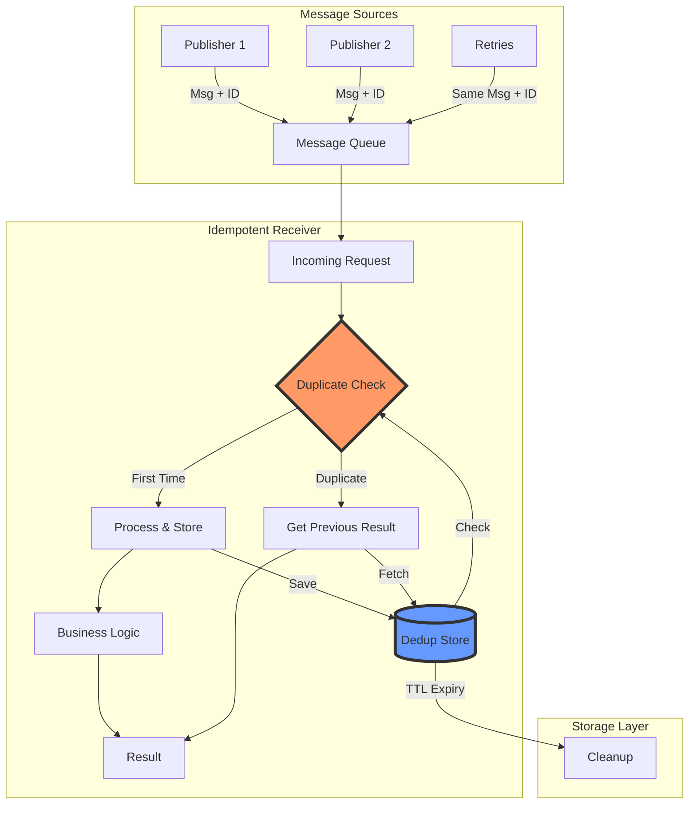
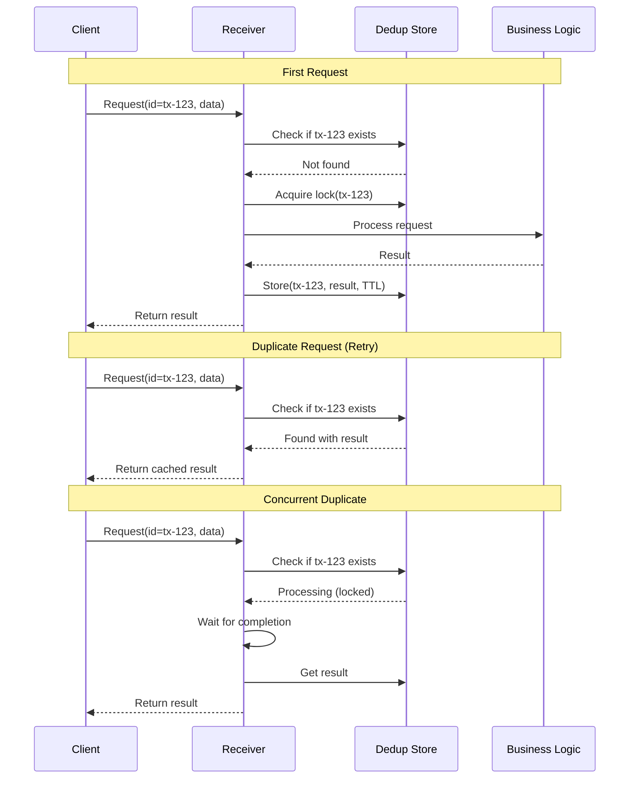
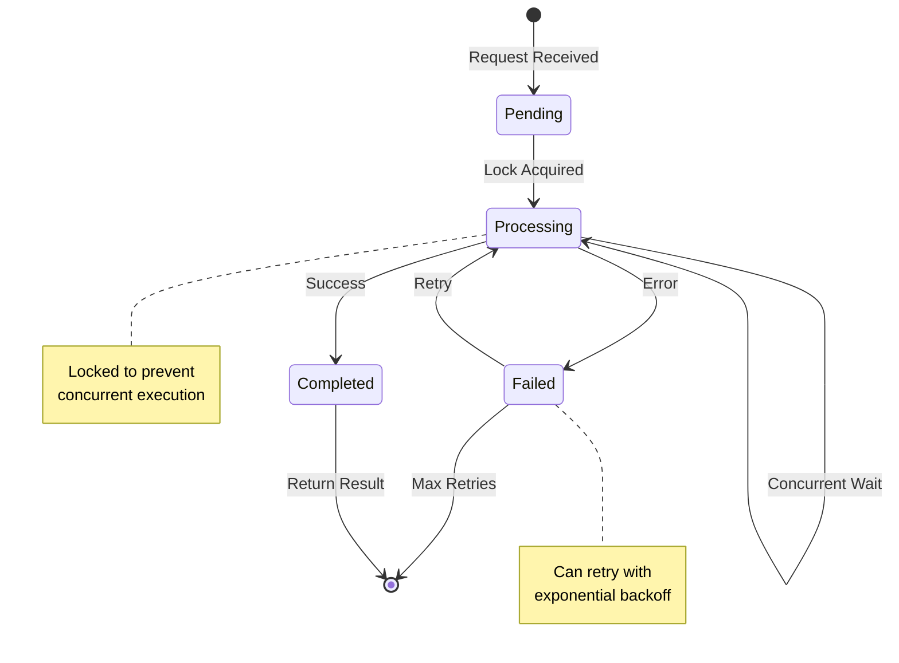

<!-- Navigation -->
[Home](../introduction/index.md) → [Part III: Patterns](index.md) → **Idempotent Receiver Pattern**

# Idempotent Receiver Pattern

**Press the elevator button once or a hundred times - The elevator still comes only once**

> *"In distributed systems, assume every message will be delivered at least twice. Build accordingly."*

---

## 🎯 Level 1: Intuition

### The Elevator Button Analogy

```
Without Idempotency:               With Idempotency:
Person presses UP button           Person presses UP button
→ Elevator 1 dispatched           → Elevator dispatched ✓
Person presses again (impatient)   Person presses again
→ Elevator 2 dispatched           → No effect (already coming)
Person's friend presses            Friend presses too
→ Elevator 3 dispatched           → No effect (already coming)

Result: 3 elevators wasted!        Result: 1 elevator, as intended
```

```
The Duplicate Message Problem:

Network: "Did you get my message?"
→ No response (timeout)
→ "Let me send it again..."
→ Actually both arrived!

Without Idempotency:              With Idempotency:
💳 Charge $100                    💳 Charge $100 (ID: tx-123)
💳 Charge $100                    💳 Charge $100 (ID: tx-123)
= Customer charged $200! 😱        = Customer charged $100 ✓

📦 Ship order                     📦 Ship order (ID: ord-456)
📦 Ship order                     📦 Ship order (ID: ord-456)
= Two packages sent! 📦📦         = One package sent ✓
```

### Real-World Examples

| System | Without Idempotency | With Idempotency |
|--------|---------------------|-------------------|
| **Bank Transfer** | Send $500 twice = $1000 gone | Same transfer ID = $500 once |
| **Food Delivery** | Order pizza twice = 2 pizzas | Same order ID = 1 pizza |
| **Email Send** | "Send newsletter" twice = spam | Same send ID = 1 email |
| **API Call** | Create user twice = duplicate | Same request ID = 1 user |

### Basic Implementation

```python
# The problem: Non-idempotent operations
def charge_credit_card(amount, card_number):
    payment_gateway.charge(card_number, amount)
    return {"status": "charged", "amount": amount}
# Retry = double charge!

# The solution: Idempotent operations
def charge_credit_card_idempotent(amount, card_number, transaction_id):
    if already_processed(transaction_id):
        return get_previous_result(transaction_id)
    
    result = payment_gateway.charge(card_number, amount)
    save_result(transaction_id, result)
    return result
# Retry with same ID = safe!
```

---

## 🏗️ Level 2: Foundation

### Core Architecture



### Idempotency Flow Sequence



### Idempotency Strategies

| Strategy | Description | Use Case | Pros | Cons |
|----------|-------------|----------|------|------|
| **Client-Generated ID** | Client provides unique ID | API requests | Full control | Client complexity |
| **Content Hash** | Hash of request payload | Deterministic ops | Automatic | No request variation |
| **Timestamp + ID** | Time-based uniqueness | Event processing | Natural ordering | Clock sync issues |
| **Database Sequence** | Server-generated ID | Internal processing | Guaranteed unique | Extra round trip |
| **UUID** | Universally unique ID | Distributed systems | No coordination | Not deterministic |

### Key Components

```python
from abc import ABC, abstractmethod
from typing import Dict, Any, Optional
import hashlib
import json
from datetime import datetime, timedelta

class IdempotencyKey:
    """Generates and manages idempotency keys"""
    
    @staticmethod
    def from_request(request: Dict[str, Any]) -> str:
        """Generate deterministic key from request"""
        if 'idempotency_key' in request:
            return request['idempotency_key']
        
        content = json.dumps(request, sort_keys=True)
        return hashlib.sha256(content.encode()).hexdigest()
    
    @staticmethod
    def from_message(message_type: str, message_id: str, version: int = 1) -> str:
        """Generate key for message-based systems"""
        return f"{message_type}:{message_id}:v{version}"

class IdempotencyStore(ABC):
    """Abstract interface for idempotency storage"""
    
    @abstractmethod
    async def get_result(self, key: str) -> Optional[Dict[str, Any]]:
        """Retrieve previous result if exists"""
        pass
    
    @abstractmethod
    async def save_result(self, key: str, result: Dict[str, Any], ttl_seconds: int):
        """Save result with expiration"""
        pass
    
    @abstractmethod
    async def acquire_lock(self, key: str, timeout_seconds: int) -> bool:
        """Acquire processing lock for key"""
        pass
    
    @abstractmethod
    async def release_lock(self, key: str):
        """Release processing lock"""
        pass

class RedisIdempotencyStore(IdempotencyStore):
    """Redis-based idempotency storage"""
    
    def __init__(self, redis_client):
        self.redis = redis_client
        self.result_prefix = "idempotent:result:"
        self.lock_prefix = "idempotent:lock:"
    
    async def get_result(self, key: str) -> Optional[Dict[str, Any]]:
        """Get cached result"""
        data = await self.redis.get(f"{self.result_prefix}{key}")
        return json.loads(data) if data else None
    
    async def save_result(self, key: str, result: Dict[str, Any], ttl_seconds: int):
        """Save result with TTL"""
        await self.redis.setex(
            f"{self.result_prefix}{key}",
            ttl_seconds,
            json.dumps(result)
        )
    
    async def acquire_lock(self, key: str, timeout_seconds: int) -> bool:
        """Try to acquire exclusive lock"""
        return await self.redis.set(
            f"{self.lock_prefix}{key}",
            "1",
            nx=True,  # Only set if not exists
            ex=timeout_seconds
        )
    
    async def release_lock(self, key: str):
        """Release lock"""
        await self.redis.delete(f"{self.lock_prefix}{key}")

class IdempotentReceiver:
    """Core idempotent message processor"""
    
    def __init__(self, 
                 store: IdempotencyStore,
                 ttl_seconds: int = 86400,  # 24 hours
                 lock_timeout: int = 300):   # 5 minutes
        self.store = store
        self.ttl = ttl_seconds
        self.lock_timeout = lock_timeout
        self.metrics = Metrics()
    
    async def process(self, 
                     key: str, 
                     handler: callable,
                     *args, **kwargs) -> Dict[str, Any]:
        """Process request idempotently"""
        
        # Check for previous result
        result = await self.store.get_result(key)
        if result is not None:
            self.metrics.increment('duplicate_requests')
            return result
        
        # Try to acquire processing lock
        if not await self.store.acquire_lock(key, self.lock_timeout):
            # Another process is handling this
            self.metrics.increment('concurrent_attempts')
            
            # Wait and retry getting result
            await asyncio.sleep(0.1)
            result = await self.store.get_result(key)
            if result:
                return result
            else:
                raise ConcurrentProcessingError(f"Failed to process: {key}")
        
        try:
            # Process the request
            self.metrics.increment('unique_requests')
            result = await handler(*args, **kwargs)
            
            # Store result
            await self.store.save_result(key, result, self.ttl)
            
            return result
            
        finally:
            # Always release lock
            await self.store.release_lock(key)
```

### Implementation Patterns

```python
# Pattern 1: Decorator-based idempotency
def idempotent(ttl_hours: int = 24, 
               key_extractor: callable = None):
    """Make any function idempotent"""
    
    def decorator(func):
        store = RedisIdempotencyStore(redis_client)
        receiver = IdempotentReceiver(store, ttl_hours * 3600)
        
        async def wrapper(*args, **kwargs):
            # Extract key
            if key_extractor:
                key = key_extractor(*args, **kwargs)
            else:
                # Default: hash function name + args
                key = f"{func.__name__}:{hash((args, tuple(kwargs.items())))}"
            
            # Process idempotently
            return await receiver.process(key, func, *args, **kwargs)
        
        return wrapper
    return decorator

# Usage
@idempotent(ttl_hours=24, key_extractor=lambda order: order['id'])
async def create_order(order: dict) -> dict:
    # This function is now idempotent!
    order_id = await db.insert_order(order)
    await payment_service.charge(order['payment'])
    await inventory_service.reserve(order['items'])
    return {"order_id": order_id, "status": "created"}

# Pattern 2: Message handler with built-in idempotency
class IdempotentMessageHandler:
    """Base class for idempotent message handlers"""
    
    def __init__(self, store: IdempotencyStore):
        self.receiver = IdempotentReceiver(store)
    
    async def handle_message(self, message: dict):
        """Process message idempotently"""
        key = self.get_idempotency_key(message)
        return await self.receiver.process(
            key,
            self.process_message,
            message
        )
    
    def get_idempotency_key(self, message: dict) -> str:
        """Override to customize key generation"""
        return IdempotencyKey.from_message(
            message['type'],
            message['id']
        )
    
    async def process_message(self, message: dict):
        """Override with actual message processing"""
        raise NotImplementedError

# Pattern 3: HTTP API with idempotency headers
class IdempotentAPIHandler:
    """Handle HTTP requests with idempotency"""
    
    async def handle_request(self, request):
        # Check for idempotency key header
        idempotency_key = request.headers.get('Idempotency-Key')
        
        if not idempotency_key:
            # Generate from request body for POSTs
            if request.method == 'POST':
                body = await request.json()
                idempotency_key = IdempotencyKey.from_request(body)
            else:
                # GET requests are naturally idempotent
                return await self.process_request(request)
        
        # Process with idempotency
        return await self.receiver.process(
            idempotency_key,
            self.process_request,
            request
        )
```

---

## 🔧 Level 3: Deep Dive

### Processing State Machine



### Advanced Implementation Strategies

```python
import asyncio
from enum import Enum
from typing import List, Dict, Any, Optional, Set
import time
from dataclasses import dataclass, field
from collections import defaultdict

class ProcessingStatus(Enum):
    """Status of idempotent processing"""
    PENDING = "pending"
    PROCESSING = "processing"
    COMPLETED = "completed"
    FAILED = "failed"

@dataclass
class IdempotentRequest:
    """Tracks request processing state"""
    key: str
    status: ProcessingStatus
    result: Optional[Any] = None
    error: Optional[str] = None
    created_at: float = field(default_factory=time.time)
    completed_at: Optional[float] = None
    attempts: int = 0
    metadata: Dict[str, Any] = field(default_factory=dict)

class AdvancedIdempotencyStore:
    """Production-grade idempotency storage with monitoring"""
    
    def __init__(self, backend, ttl_seconds: int = 86400):
        self.backend = backend
        self.ttl = ttl_seconds
        self.metrics = MetricsCollector()
        
    async def get_request(self, key: str) -> Optional[IdempotentRequest]:
        """Get request with full state"""
        data = await self.backend.get(f"request:{key}")
        if data:
            return IdempotentRequest(**json.loads(data))
        return None
    
    async def save_request(self, request: IdempotentRequest):
        """Save request state"""
        await self.backend.setex(
            f"request:{request.key}",
            self.ttl,
            json.dumps(dataclasses.asdict(request))
        )
    
    async def atomic_status_update(self, 
                                   key: str, 
                                   old_status: ProcessingStatus,
                                   new_status: ProcessingStatus) -> bool:
        """Atomically update status if current status matches expected"""
        script = """
        local key = KEYS[1]
        local old_status = ARGV[1]
        local new_status = ARGV[2]
        
        local current = redis.call('GET', key)
        if not current then
            return 0
        end
        
        local data = cjson.decode(current)
        if data.status == old_status then
            data.status = new_status
            redis.call('SETEX', key, ARGV[3], cjson.encode(data))
            return 1
        end
        return 0
        """
        
        result = await self.backend.eval(
            script,
            keys=[f"request:{key}"],
            args=[old_status.value, new_status.value, self.ttl]
        )
        return bool(result)

class ProductionIdempotentReceiver:
    """Production-ready idempotent receiver with advanced features"""
    
    def __init__(self,
                 store: AdvancedIdempotencyStore,
                 max_concurrent: int = 1000,
                 cleanup_interval: int = 3600):
        self.store = store
        self.semaphore = asyncio.Semaphore(max_concurrent)
        self.processing: Set[str] = set()
        self.cleanup_interval = cleanup_interval
        self._cleanup_task = None
        
    async def start(self):
        """Start background cleanup"""
        self._cleanup_task = asyncio.create_task(self._cleanup_loop())
    
    async def stop(self):
        """Stop background tasks"""
        if self._cleanup_task:
            self._cleanup_task.cancel()
    
    async def process_with_timeout(self,
                                   key: str,
                                   handler: callable,
                                   timeout: float,
                                   *args, **kwargs) -> Any:
        """Process with timeout and full state tracking"""
        
        async with self.semaphore:
            # Check existing request
            request = await self.store.get_request(key)
            
            if request:
                if request.status == ProcessingStatus.COMPLETED:
                    return request.result
                elif request.status == ProcessingStatus.FAILED:
                    raise IdempotencyError(f"Previous attempt failed: {request.error}")
                elif request.status == ProcessingStatus.PROCESSING:
                    # Check if processing timeout exceeded
                    if time.time() - request.created_at > timeout:
                        # Take over processing
                        if not await self.store.atomic_status_update(
                            key,
                            ProcessingStatus.PROCESSING,
                            ProcessingStatus.FAILED
                        ):
                            # Someone else took over
                            return await self._wait_for_result(key, timeout)
                    else:
                        return await self._wait_for_result(key, timeout)
            
            # Create new request
            request = IdempotentRequest(
                key=key,
                status=ProcessingStatus.PROCESSING
            )
            await self.store.save_request(request)
            
            try:
                # Process with timeout
                result = await asyncio.wait_for(
                    handler(*args, **kwargs),
                    timeout=timeout
                )
                
                # Update success
                request.status = ProcessingStatus.COMPLETED
                request.result = result
                request.completed_at = time.time()
                await self.store.save_request(request)
                
                return result
                
            except asyncio.TimeoutError:
                request.status = ProcessingStatus.FAILED
                request.error = "Processing timeout"
                await self.store.save_request(request)
                raise
                
            except Exception as e:
                request.status = ProcessingStatus.FAILED
                request.error = str(e)
                await self.store.save_request(request)
                raise

# Batch processing with idempotency
class BatchIdempotentProcessor:
    """Process batches while maintaining idempotency"""
    
    def __init__(self, receiver: ProductionIdempotentReceiver):
        self.receiver = receiver
        self.metrics = BatchMetrics()
    
    async def process_batch(self,
                           items: List[Dict[str, Any]],
                           handler: callable,
                           key_extractor: callable,
                           concurrency: int = 10) -> List[Dict[str, Any]]:
        """Process batch with controlled concurrency"""
        
        semaphore = asyncio.Semaphore(concurrency)
        results = []
        
        async def process_item(item):
            async with semaphore:
                key = key_extractor(item)
                try:
                    result = await self.receiver.process_with_timeout(
                        key,
                        handler,
                        timeout=30.0,
                        item
                    )
                    return {
                        'key': key,
                        'status': 'success',
                        'result': result,
                        'duplicate': False
                    }
                except DuplicateError as e:
                    return {
                        'key': key,
                        'status': 'success',
                        'result': e.original_result,
                        'duplicate': True
                    }
                except Exception as e:
                    return {
                        'key': key,
                        'status': 'error',
                        'error': str(e),
                        'duplicate': False
                    }
        
        # Process all items concurrently
        tasks = [process_item(item) for item in items]
        results = await asyncio.gather(*tasks)
        
        # Update metrics
        self.metrics.record_batch(results)
        
        return results

# Distributed idempotency with consensus
class DistributedIdempotencyManager:
    """Idempotency across multiple nodes using consensus"""
    
    def __init__(self, 
                 node_id: str,
                 consensus_client,
                 local_store: IdempotencyStore):
        self.node_id = node_id
        self.consensus = consensus_client
        self.local_store = local_store
        self.lease_duration = 30  # seconds
        
    async def process_distributed(self,
                                  key: str,
                                  handler: callable,
                                  *args, **kwargs):
        """Process with distributed coordination"""
        
        # Try local cache first
        result = await self.local_store.get_result(key)
        if result:
            return result
        
        # Acquire distributed lock
        lease = await self.consensus.acquire_lease(
            f"idempotent:{key}",
            self.node_id,
            self.lease_duration
        )
        
        if not lease:
            # Another node is processing
            return await self._wait_for_distributed_result(key)
        
        try:
            # Double-check after acquiring lock
            result = await self._get_distributed_result(key)
            if result:
                return result
            
            # Process
            result = await handler(*args, **kwargs)
            
            # Store in distributed cache
            await self._store_distributed_result(key, result)
            
            return result
            
        finally:
            await lease.release()
```

### Monitoring and Observability

```python
class IdempotencyMetrics:
    """Comprehensive metrics for idempotency patterns"""
    
    def __init__(self, metrics_backend):
        self.backend = metrics_backend
        
        # Define metrics
        self.requests_total = Counter(
            'idempotency_requests_total',
            'Total requests processed',
            ['status', 'duplicate']
        )
        
        self.processing_duration = Histogram(
            'idempotency_processing_duration_seconds',
            'Time to process requests',
            ['handler'],
            buckets=[0.01, 0.05, 0.1, 0.5, 1, 5, 10]
        )
        
        self.store_operations = Counter(
            'idempotency_store_operations_total',
            'Storage operations',
            ['operation', 'status']
        )
        
        self.concurrent_attempts = Gauge(
            'idempotency_concurrent_attempts',
            'Current concurrent processing attempts'
        )
        
        self.ttl_expirations = Counter(
            'idempotency_ttl_expirations_total',
            'Items expired from cache'
        )

class IdempotencyHealthCheck:
    """Health monitoring for idempotency system"""
    
    async def check_health(self) -> Dict[str, Any]:
        """Comprehensive health check"""
        
        health = {
            'status': 'healthy',
            'checks': {},
            'metrics': {}
        }
        
        # Check store connectivity
        try:
            await self.store.backend.ping()
            health['checks']['store'] = 'healthy'
        except Exception as e:
            health['status'] = 'unhealthy'
            health['checks']['store'] = f'failed: {e}'
        
        # Check duplicate rate
        duplicate_rate = await self.get_duplicate_rate()
        health['metrics']['duplicate_rate'] = duplicate_rate
        
        if duplicate_rate > 0.5:  # 50% duplicates
            health['status'] = 'degraded'
            health['checks']['duplicate_rate'] = 'high'
        
        # Check processing delays
        p99_latency = await self.get_p99_latency()
        health['metrics']['p99_latency_ms'] = p99_latency
        
        if p99_latency > 1000:  # 1 second
            health['status'] = 'degraded'
            health['checks']['processing_latency'] = 'high'
        
        return health
```

---

## 🚀 Level 4: Expert

### Production Case Study: Stripe's Idempotency Implementation

Stripe processes billions of payment requests with exactly-once semantics.

```python
class StripeIdempotencySystem:
    """
    Stripe's production idempotency system:
    - 10B+ API requests/month
    - 99.99% deduplication accuracy
    - <1ms overhead for duplicate detection
    """
    
    def __init__(self):
        self.config = {
            'ttl_hours': 24,
            'max_request_size': 1_000_000,  # 1MB
            'storage_backend': 'dynamodb',
            'replication_regions': ['us-east-1', 'eu-west-1', 'ap-southeast-1']
        }
    
    async def handle_payment_request(self, request: dict, idempotency_key: str):
        """
        Handle payment API request with idempotency
        
        Critical requirements:
        1. Never double-charge a customer
        2. Always return same response for retries
        3. Handle concurrent duplicate requests
        4. Work across regional failovers
        """
        
        # Validate idempotency key format
        if not self.validate_idempotency_key(idempotency_key):
            raise InvalidIdempotencyKeyError(
                "Key must be 36-200 characters, unique per account"
            )
        
        # Create composite key with account context
        account_id = request['account_id']
        composite_key = f"{account_id}:{idempotency_key}"
        
        # Check if we're already processing this request
        processing_lock = await self.acquire_processing_lock(
            composite_key,
            timeout_seconds=30
        )
        
        if not processing_lock:
            # Another request is in progress
            return await self.wait_for_in_progress_request(composite_key)
        
        try:
            # Check for previous response
            cached_response = await self.get_cached_response(composite_key)
            
            if cached_response:
                # Validate request matches
                if not self.request_matches(request, cached_response['request']):
                    raise IdempotencyKeyReuseError(
                        "Different request body for same idempotency key"
                    )
                
                return cached_response['response']
            
            # Process the payment
            response = await self.process_payment_internal(request)
            
            # Store response atomically
            await self.store_response(
                composite_key,
                request,
                response,
                ttl_seconds=self.config['ttl_hours'] * 3600
            )
            
            return response
            
        finally:
            await processing_lock.release()
    
    async def process_payment_internal(self, request: dict):
        """Actually process the payment"""
        
        # Validate request
        validation_result = await self.validate_payment_request(request)
        if not validation_result.is_valid:
            raise PaymentValidationError(validation_result.errors)
        
        # Risk checks
        risk_score = await self.assess_risk(request)
        if risk_score > request.get('risk_threshold', 0.9):
            raise HighRiskPaymentError(f"Risk score: {risk_score}")
        
        # Process payment with payment network
        network_response = await self.payment_network.process(
            amount=request['amount'],
            currency=request['currency'],
            source=request['source'],
            metadata={
                'idempotency_key': request.get('idempotency_key'),
                'request_id': str(uuid.uuid4())
            }
        )
        
        # Record transaction
        await self.record_transaction(request, network_response)
        
        return {
            'id': network_response['transaction_id'],
            'status': network_response['status'],
            'amount': request['amount'],
            'currency': request['currency'],
            'created': int(time.time())
        }
    
    def request_matches(self, new_request: dict, stored_request: dict) -> bool:
        """Check if requests are functionally identical"""
        
        # Ignore non-functional fields
        ignore_fields = {'idempotency_key', 'request_id', 'timestamp'}
        
        new_clean = {k: v for k, v in new_request.items() if k not in ignore_fields}
        stored_clean = {k: v for k, v in stored_request.items() if k not in ignore_fields}
        
        return new_clean == stored_clean
    
    async def handle_regional_failover(self, primary_region: str, backup_region: str):
        """Handle idempotency during regional failover"""
        
        # Sync idempotency state between regions
        await self.sync_idempotency_state(primary_region, backup_region)
        
        # Update routing to use backup
        await self.update_routing_rules({
            'primary': backup_region,
            'secondary': primary_region,
            'sync_mode': 'eventual'
        })
```

### Advanced Patterns

#### Event Sourcing with Idempotency

```python
class EventSourcingIdempotency:
    """Combine event sourcing with idempotency for audit trail"""
    
    async def append_event_idempotent(self, 
                                      stream_id: str,
                                      event: dict,
                                      expected_version: Optional[int] = None):
        """Append event to stream idempotently"""
        
        # Generate deterministic event ID
        event_id = self.generate_event_id(stream_id, event)
        
        # Check if event already exists
        existing_event = await self.event_store.get_event(event_id)
        if existing_event:
            # Verify it's the same event
            if existing_event['data'] != event['data']:
                raise EventConflictError("Different event with same ID")
            return existing_event
        
        # Append with optimistic concurrency control
        try:
            stored_event = await self.event_store.append(
                stream_id=stream_id,
                event_id=event_id,
                event_type=event['type'],
                event_data=event['data'],
                expected_version=expected_version
            )
            
            return stored_event
            
        except OptimisticConcurrencyError:
            # Someone else appended, check if it was our event
            existing = await self.event_store.get_event(event_id)
            if existing and existing['data'] == event['data']:
                return existing
            raise

#### Saga Pattern with Idempotency

```python
class IdempotentSagaManager:
    """Manage distributed sagas with idempotency"""
    
    async def execute_saga_step(self,
                               saga_id: str,
                               step_id: str,
                               handler: callable,
                               compensation_handler: callable):
        """Execute saga step idempotently"""
        
        step_key = f"{saga_id}:{step_id}"
        
        # Check if step already executed
        step_result = await self.get_step_result(step_key)
        if step_result:
            if step_result['status'] == 'completed':
                return step_result['result']
            elif step_result['status'] == 'compensated':
                raise SagaStepCompensatedError(f"Step {step_id} was compensated")
        
        # Execute step
        try:
            result = await handler()
            await self.save_step_result(step_key, {
                'status': 'completed',
                'result': result,
                'compensation_handler': compensation_handler.__name__
            })
            return result
            
        except Exception as e:
            # Save failure state
            await self.save_step_result(step_key, {
                'status': 'failed',
                'error': str(e)
            })
            raise
```

---

## 🎯 Level 5: Mastery

### Theoretical Foundations

#### Formal Verification of Idempotency

```python
class IdempotencyFormalModel:
    """
    Formal model for proving idempotency properties
    
    Definition: A function f is idempotent if f(f(x)) = f(x)
    In distributed systems: process(msg) = process(process(msg))
    """
    
    def verify_idempotency_property(self, operation: callable) -> bool:
        """
        Verify operation satisfies idempotency property
        Using property-based testing
        """
        
        # Property 1: Repeated application doesn't change result
        # ∀x: f(f(x)) = f(x)
        
        # Property 2: Order independence for same message
        # ∀x: f(x) at time t1 = f(x) at time t2
        
        # Property 3: Deterministic output
        # ∀x: f(x) always produces same output
        
        test_cases = self.generate_test_cases()
        
        for test_input in test_cases:
            # First application
            result1 = operation(test_input)
            state1 = self.capture_system_state()
            
            # Second application  
            result2 = operation(test_input)
            state2 = self.capture_system_state()
            
            # Verify idempotency
            assert result1 == result2, f"Results differ: {result1} != {result2}"
            assert state1 == state2, f"States differ after reapplication"
            
            # Third application (transitivity check)
            result3 = operation(test_input)
            assert result2 == result3, f"Transitivity failed"
        
        return True

#### Mathematical Model of Deduplication

```python
import numpy as np
from scipy import stats

class DeduplicationMathModel:
    """Mathematical model for deduplication performance"""
    
    def calculate_duplicate_probability(self, 
                                       message_rate: float,
                                       retry_probability: float,
                                       network_failure_rate: float) -> float:
        """
        Calculate probability of duplicate messages
        
        P(duplicate) = P(retry) + P(network_duplicate) - P(retry ∩ network_duplicate)
        """
        
        # Retry probability (exponential backoff model)
        p_retry = 1 - np.exp(-retry_probability * message_rate)
        
        # Network duplication (packet-level)
        p_network = network_failure_rate * 0.1  # ~10% of failures cause duplicates
        
        # Combined probability
        p_duplicate = p_retry + p_network - (p_retry * p_network)
        
        return p_duplicate
    
    def optimize_ttl_duration(self,
                             duplicate_rate: float,
                             storage_cost_per_gb_hour: float,
                             duplicate_processing_cost: float) -> int:
        """
        Find optimal TTL to minimize total cost
        
        Cost = Storage_Cost(TTL) + Duplicate_Processing_Cost(TTL)
        """
        
        ttl_hours = np.arange(1, 168)  # 1 hour to 7 days
        
        costs = []
        for ttl in ttl_hours:
            # Storage cost increases with TTL
            storage_cost = self.calculate_storage_cost(
                ttl, 
                storage_cost_per_gb_hour
            )
            
            # Duplicate processing cost decreases with TTL
            dup_cost = self.calculate_duplicate_cost(
                ttl,
                duplicate_rate,
                duplicate_processing_cost
            )
            
            total_cost = storage_cost + dup_cost
            costs.append(total_cost)
        
        # Find minimum cost TTL
        optimal_ttl = ttl_hours[np.argmin(costs)]
        
        return optimal_ttl

    def calculate_storage_requirements(self,
                                      messages_per_second: float,
                                      ttl_hours: int,
                                      bytes_per_key: int = 64) -> dict:
        """Calculate storage requirements for deduplication"""
        
        # Total unique keys stored
        total_keys = messages_per_second * 3600 * ttl_hours
        
        # Storage in GB
        storage_gb = (total_keys * bytes_per_key) / (1024**3)
        
        # Memory requirements for hot partition (last hour)
        hot_memory_gb = (messages_per_second * 3600 * bytes_per_key) / (1024**3)
        
        return {
            'total_storage_gb': storage_gb,
            'hot_memory_gb': hot_memory_gb,
            'total_keys': total_keys,
            'daily_growth_gb': storage_gb / (ttl_hours / 24)
        }
```

### Future Directions

#### Quantum-Resistant Idempotency

```python
class QuantumResistantIdempotency:
    """
    Future-proof idempotency for quantum computing era
    """
    
    def generate_quantum_safe_key(self, message: bytes) -> str:
        """
        Generate idempotency key resistant to quantum attacks
        Using lattice-based cryptography
        """
        
        # Use post-quantum hash function (e.g., SPHINCS+)
        # This is a simplified example
        
        # Add timestamp for ordering
        timestamp = struct.pack('>Q', int(time.time() * 1000000))
        
        # Combine with message
        combined = timestamp + message
        
        # Apply quantum-resistant hash
        # In practice, use a proper post-quantum library
        key = self.sphincs_hash(combined)
        
        return base64.urlsafe_b64encode(key).decode()

#### AI-Powered Duplicate Detection

```python
class AIIdempotencyDetector:
    """Use machine learning for semantic deduplication"""
    
    def __init__(self):
        self.model = self.load_similarity_model()
        self.threshold = 0.95
    
    async def is_semantic_duplicate(self, 
                                   message1: dict, 
                                   message2: dict) -> bool:
        """
        Detect if messages are semantically identical
        even if structurally different
        """
        
        # Extract features
        features1 = self.extract_features(message1)
        features2 = self.extract_features(message2)
        
        # Calculate semantic similarity
        similarity = self.model.similarity(features1, features2)
        
        # Check if above threshold
        return similarity > self.threshold
    
    def extract_features(self, message: dict) -> np.ndarray:
        """Extract semantic features from message"""
        
        # Combine relevant fields
        text = ' '.join([
            str(v) for k, v in message.items()
            if k not in ['timestamp', 'request_id', 'trace_id']
        ])
        
        # Get embedding
        return self.model.encode(text)
```

### Economic Impact

```python
class IdempotencyEconomics:
    """Calculate ROI of idempotency implementation"""
    
    def calculate_roi(self, business_metrics: dict) -> dict:
        """
        Calculate return on investment for idempotency
        """
        
        # Cost of duplicate processing without idempotency
        duplicate_rate = business_metrics['duplicate_message_rate']  # e.g., 0.1 (10%)
        messages_per_day = business_metrics['daily_message_volume']
        cost_per_duplicate = business_metrics['duplicate_processing_cost']
        
        daily_duplicate_cost = messages_per_day * duplicate_rate * cost_per_duplicate
        annual_duplicate_cost = daily_duplicate_cost * 365
        
        # Cost of customer issues from duplicates
        duplicate_incidents_per_month = business_metrics['duplicate_incidents']
        incident_resolution_cost = business_metrics['incident_cost']
        
        annual_incident_cost = duplicate_incidents_per_month * 12 * incident_resolution_cost
        
        # Implementation cost
        implementation_hours = 320  # 2 developers for 1 month
        hourly_rate = business_metrics['developer_hourly_rate']
        infrastructure_cost = 50000  # Redis cluster, monitoring
        
        total_implementation_cost = implementation_hours * hourly_rate + infrastructure_cost
        
        # Ongoing costs
        storage_cost_monthly = business_metrics['dedup_storage_gb'] * 0.10 * 30  # $0.10/GB/day
        annual_storage_cost = storage_cost_monthly * 12
        
        # Calculate savings
        annual_savings = annual_duplicate_cost + annual_incident_cost - annual_storage_cost
        
        return {
            'implementation_cost': total_implementation_cost,
            'annual_savings': annual_savings,
            'payback_months': total_implementation_cost / (annual_savings / 12),
            'five_year_roi': (annual_savings * 5 - total_implementation_cost) / total_implementation_cost * 100,
            'duplicate_reduction': f"{duplicate_rate * 100}% → ~0%"
        }
```

---

## 📊 Quick Reference

### Decision Framework

| Question | Yes → Use Idempotency | No → Maybe Skip |
|----------|----------------------|-----------------|
| Using at-least-once delivery? | ✅ Essential for correctness | ⚠️ At-most-once is lossy |
| Financial transactions? | ✅ Prevent double charges | ⚠️ Risk customer trust |
| External API calls? | ✅ Avoid duplicate actions | ⚠️ May cause issues |
| Distributed publishers? | ✅ Handle retry storms | ⚠️ Accept duplicates |
| High retry rates? | ✅ Reduce processing load | ⚠️ Waste resources |

### Implementation Checklist

- [ ] Choose idempotency key strategy
- [ ] Select storage backend (Redis/DynamoDB)
- [ ] Implement deduplication logic
- [ ] Add request validation
- [ ] Set appropriate TTL
- [ ] Handle concurrent requests
- [ ] Add monitoring metrics
- [ ] Test with duplicate scenarios
- [ ] Document key format
- [ ] Plan capacity needs

### Common Anti-Patterns

1. **Random IDs** - Use deterministic keys
2. **No TTL** - Storage grows forever
3. **Ignoring concurrency** - Race conditions
4. **Client-side only** - Server must validate
5. **Partial idempotency** - All-or-nothing

---

## 🎓 Key Takeaways

1. **Idempotency is not optional** - Required for reliable distributed systems
2. **f(x) = f(f(x))** - Core mathematical property
3. **Storage is cheap, errors are expensive** - Invest in deduplication
4. **Monitor duplicate rates** - Key health metric
5. **Design operations to be naturally idempotent** - Best approach

---

*"Make your operations idempotent. Your future self debugging production at 3 AM will thank you."*

---

**Previous**: [← Outbox Pattern](outbox.md) | **Next**: [GraphQL Federation Pattern →](graphql-federation.md)