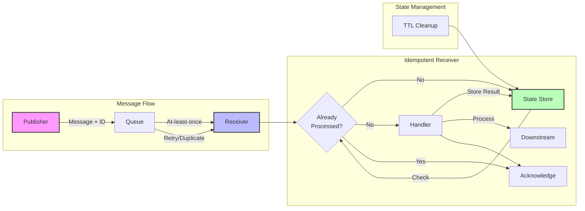

<!-- Navigation -->
[Home](../index.md) → [Part III: Patterns](index.md) → **Idempotent Receiver Pattern**

# Idempotent Receiver Pattern

**Process each message exactly once - Even when messages arrive multiple times**

> *"In distributed systems, messages will be duplicated. Design for it, don't fight it."*

---

## 🎯 Pattern Overview

### The Problem
In distributed systems, message delivery guarantees typically fall into three categories:
- **At-most-once**: Messages may be lost but never duplicated
- **At-least-once**: Messages won't be lost but may be duplicated
- **Exactly-once**: The holy grail, but extremely expensive/complex

Most reliable systems use at-least-once delivery, which means:
- Network retries cause duplicate messages
- Failover scenarios resend messages
- Queue systems redeliver after timeouts
- Publishers retry on unclear acknowledgments

Processing duplicate messages can cause:
- Double charges to customers
- Duplicate orders being placed
- Incorrect inventory counts
- Data corruption and inconsistencies

### The Solution
Make message processing idempotent - ensure that processing a message multiple times has the same effect as processing it once:
- **Track processed messages** using unique identifiers
- **Skip duplicates** gracefully without side effects
- **Make operations idempotent** by design
- **Handle concurrent duplicates** safely

### When to Use

| ✅ Use When | ❌ Don't Use When |
|-------------|-------------------|
| • Using at-least-once message delivery | • Messages are naturally idempotent |
| • Financial or critical operations | • Message volume exceeds tracking capacity |
| • Distributed message publishers | • Strict ordering more important than dedup |
| • Network unreliability is high | • Message TTL is very short |
| • Downstream effects are expensive | • Processing cost is negligible |

---

## 🏗️ Architecture & Implementation

### Conceptual Model



### Key Components

| Component | Purpose | Responsibilities |
|-----------|---------|------------------|
| **Message ID Generator** | Create unique identifiers | • Generate UUIDs or deterministic IDs<br>• Include source information<br>• Ensure uniqueness across publishers |
| **Deduplication Store** | Track processed messages | • Fast lookups (sub-millisecond)<br>• TTL-based cleanup<br>• Handle concurrent access<br>• Survive restarts |
| **Message Handler** | Process business logic | • Check deduplication first<br>• Process idempotently<br>• Store completion state<br>• Handle partial failures |
| **Cleanup Process** | Remove old entries | • Delete expired entries<br>• Prevent unbounded growth<br>• Run without blocking processing |
| **Monitoring** | Track duplicate rates | • Count duplicates<br>• Alert on anomalies<br>• Track processing times |

### Implementation Example

```python
import uuid
import time
import asyncio
from typing import Dict, Any, Optional, Set
from dataclasses import dataclass
from datetime import datetime, timedelta
import redis
import json
import hashlib
from functools import wraps
import logging

@dataclass
class Message:
    """Represents a message with idempotency support"""
    id: str
    payload: Dict[str, Any]
    timestamp: datetime
    source: str

    @staticmethod
    def generate_id(payload: Dict[str, Any], source: str) -> str:
        """Generate deterministic ID based on content"""
        content = json.dumps(payload, sort_keys=True) + source
        return hashlib.sha256(content.encode()).hexdigest()

class IdempotencyStore:
    """Manages idempotent message processing state"""

    def __init__(self, redis_client: redis.Redis, ttl_seconds: int = 86400):
        self.redis = redis_client
        self.ttl = ttl_seconds
        self.logger = logging.getLogger(__name__)

    async def has_processed(self, message_id: str) -> bool:
        """Check if message has been processed"""
        return bool(self.redis.exists(f"processed:{message_id}"))

    async def mark_processing(self, message_id: str) -> bool:
        """Atomically mark message as being processed"""
        key = f"processing:{message_id}"
        # SET NX returns True if key was set (didn't exist)
        acquired = self.redis.set(key, "1", nx=True, ex=300)  # 5 min timeout
        return bool(acquired)

    async def mark_processed(self, message_id: str, result: Any = None):
        """Mark message as successfully processed"""
        pipe = self.redis.pipeline()

        # Store processed flag
        processed_key = f"processed:{message_id}"
        pipe.set(processed_key, "1", ex=self.ttl)

        # Store result if provided
        if result is not None:
            result_key = f"result:{message_id}"
            pipe.set(result_key, json.dumps(result), ex=self.ttl)

        # Remove processing flag
        pipe.delete(f"processing:{message_id}")

        pipe.execute()

    async def get_result(self, message_id: str) -> Optional[Any]:
        """Retrieve stored result for processed message"""
        result = self.redis.get(f"result:{message_id}")
        return json.loads(result) if result else None

    async def cleanup_expired(self) -> int:
        """Clean up expired entries (handled by Redis TTL)"""
        # Redis handles TTL automatically
        # This method for compatibility/metrics
        return 0

class IdempotentReceiver:
    """Ensures exactly-once message processing semantics"""

    def __init__(self, store: IdempotencyStore):
        self.store = store
        self.logger = logging.getLogger(__name__)
        self.metrics = {
            'processed': 0,
            'duplicates': 0,
            'errors': 0,
            'concurrent_attempts': 0
        }

    async def process_message(self, message: Message, handler) -> Any:
        """Process message idempotently"""

        # Check if already processed
        if await self.store.has_processed(message.id):
            self.metrics['duplicates'] += 1
            self.logger.info(f"Duplicate message detected: {message.id}")

            # Return stored result if available
            result = await self.store.get_result(message.id)
            return result

        # Try to acquire processing lock
        if not await self.store.mark_processing(message.id):
            self.metrics['concurrent_attempts'] += 1
            self.logger.warning(f"Concurrent processing attempt: {message.id}")

            # Wait and check if other process completed
            await asyncio.sleep(0.5)
            if await self.store.has_processed(message.id):
                return await self.store.get_result(message.id)
            else:
                raise RuntimeError(f"Processing failed for message: {message.id}")

        try:
            # Process the message
            self.logger.info(f"Processing message: {message.id}")
            result = await handler(message)

            # Mark as processed with result
            await self.store.mark_processed(message.id, result)
            self.metrics['processed'] += 1

            return result

        except Exception as e:
            self.metrics['errors'] += 1
            self.logger.error(f"Error processing message {message.id}: {e}")
            # Remove processing lock on error
            await self.store.redis.delete(f"processing:{message.id}")
            raise

    def get_metrics(self) -> Dict[str, int]:
        """Get processing metrics"""
        return self.metrics.copy()

def idempotent(ttl_seconds: int = 86400,
               key_generator=None,
               store_result: bool = True):
    """Decorator for making functions idempotent"""

    def decorator(func):
        # Initialize store (in production, inject this dependency)
        redis_client = redis.Redis(decode_responses=True)
        store = IdempotencyStore(redis_client, ttl_seconds)

        @wraps(func)
        async def wrapper(*args, **kwargs):
            # Generate idempotency key
            if key_generator:
                key = key_generator(*args, **kwargs)
            else:
                # Default: hash all arguments
                key = hashlib.sha256(
                    f"{func.__name__}:{args}:{kwargs}".encode()
                ).hexdigest()

            # Check if already processed
            if await store.has_processed(key):
                return await store.get_result(key) if store_result else None

            # Acquire processing lock
            if not await store.mark_processing(key):
                # Wait for other process
                await asyncio.sleep(0.5)
                return await store.get_result(key) if store_result else None

            try:
                # Execute function
                result = await func(*args, **kwargs)

                # Mark as processed
                await store.mark_processed(
                    key,
                    result if store_result else None
                )

                return result

            except Exception:
                # Clean up on error
                await store.redis.delete(f"processing:{key}")
                raise

        return wrapper
    return decorator

# Example Usage
class OrderService:
    """Example service using idempotent receiver"""

    def __init__(self, idempotent_receiver: IdempotentReceiver):
        self.receiver = idempotent_receiver
        self.orders_created = 0

    async def handle_create_order(self, message: Message) -> Dict[str, Any]:
        """Handler that creates order - must be idempotent"""
        order_data = message.payload

        # Simulate order creation
        order_id = f"ORD-{int(time.time())}"
        self.orders_created += 1

        # In real implementation:
        # - Check if order already exists
        # - Use database transactions
        # - Make downstream calls idempotent

        result = {
            'order_id': order_id,
            'status': 'created',
            'items': order_data.get('items', []),
            'total': sum(item['price'] for item in order_data.get('items', []))
        }

        self.logger.info(f"Created order: {order_id}")
        return result

    async def process_order_message(self, raw_message: Dict[str, Any]) -> Any:
        """Process incoming order message"""
        # Create message with ID
        message = Message(
            id=Message.generate_id(raw_message['payload'], raw_message['source']),
            payload=raw_message['payload'],
            timestamp=datetime.now(),
            source=raw_message['source']
        )

        # Process idempotently
        return await self.receiver.process_message(
            message,
            self.handle_create_order
        )

# Advanced: Batch Processing with Idempotency
class BatchIdempotentProcessor:
    """Process batches while maintaining idempotency"""

    def __init__(self, store: IdempotencyStore):
        self.store = store

    async def process_batch(self, messages: List[Message], handler) -> List[Any]:
        """Process batch of messages, skipping duplicates"""
        results = []

        # Pre-filter duplicates for efficiency
        to_process = []
        for msg in messages:
            if await self.store.has_processed(msg.id):
                result = await self.store.get_result(msg.id)
                results.append((msg.id, result, True))  # True = was duplicate
            else:
                to_process.append(msg)

        # Process new messages concurrently
        if to_process:
            tasks = [
                self._process_single(msg, handler)
                for msg in to_process
            ]

            batch_results = await asyncio.gather(*tasks, return_exceptions=True)

            for msg, result in zip(to_process, batch_results):
                if isinstance(result, Exception):
                    results.append((msg.id, None, False))
                else:
                    results.append((msg.id, result, False))

        return results

    async def _process_single(self, message: Message, handler) -> Any:
        """Process single message with error handling"""
        try:
            receiver = IdempotentReceiver(self.store)
            return await receiver.process_message(message, handler)
        except Exception as e:
            logging.error(f"Failed to process {message.id}: {e}")
            raise
```

---

## 📊 Analysis & Trade-offs

### Axiom Relationships

| Axiom | How Idempotent Receiver Addresses It |
|-------|--------------------------------------|
| **Latency** | Adds lookup overhead but prevents expensive re-processing |
| **Capacity** | Storage needed for deduplication state |
| **Failure** | Handles message delivery failures gracefully |
| **Concurrency** | Prevents concurrent duplicate processing |
| **Coordination** | Local deduplication avoids distributed consensus |
| **Observability** | Duplicate metrics reveal system health |
| **Human Interface** | Simplifies operations - no manual deduplication |
| **Economics** | Prevents costly duplicate operations |

### Trade-off Analysis

| Aspect | Gains | Losses |
|--------|-------|--------|
| **Correctness** | Exactly-once semantics | Additional complexity |
| **Performance** | Avoid re-processing | Lookup overhead per message |
| **Storage** | Dedup state | Memory/disk for message IDs |
| **Operations** | Self-healing duplicates | Monitor dedup store health |

### Common Pitfalls

1. **Unbounded State Growth**
   - **Problem**: Storing all message IDs forever
   - **Solution**: Use TTL based on message replay window

2. **Non-Deterministic IDs**
   - **Problem**: Random UUIDs for same logical message
   - **Solution**: Deterministic ID based on content + source

3. **Partial Processing Failures**
   - **Problem**: Message processed but not marked complete
   - **Solution**: Make operations truly idempotent

4. **Clock Skew Issues**
   - **Problem**: TTL expiry during processing
   - **Solution**: Use generous TTLs, monitor clock sync

5. **Storage Failures**
   - **Problem**: Can't check deduplication state
   - **Solution**: Fail closed - reject until store recovers

---

## 🔧 Practical Considerations

### Configuration Guidelines

| Parameter | Description | Typical Range | Default |
|-----------|-------------|---------------|---------|
| **Message TTL** | How long to track IDs | 1h - 7d | 24h |
| **Processing Timeout** | Lock timeout for concurrent attempts | 30s - 5m | 2m |
| **Batch Size** | Messages per batch operation | 10 - 1000 | 100 |
| **Storage Backend** | Where to store state | Redis/DynamoDB | Redis |

### Monitoring & Metrics

| Metric | What It Tells You | Alert Threshold |
|--------|-------------------|-----------------|
| **Duplicate Rate** | Message delivery health | > 10% |
| **Processing Time** | Lookup overhead impact | > 100ms |
| **Store Size** | Memory usage trend | > 1GB |
| **Lock Conflicts** | Concurrent processing | > 1% |

### Integration Patterns

How idempotent receiver works with other patterns:
- **With Message Queue**: Natural fit for at-least-once delivery
- **With Saga Pattern**: Each step must be idempotent
- **With Event Sourcing**: Prevent duplicate events
- **With Circuit Breaker**: Retry safely during recovery

---

## 🚀 Real-World Examples

### Example 1: Stripe Payment Processing
- **Challenge**: Webhook delivery can retry on network failures
- **Implementation**:
  - Use webhook event ID as idempotency key
  - Store processing results for 7 days
  - Return same response for duplicate webhooks
- **Results**:
  - Zero duplicate charges
  - 99.99% webhook reliability
  - Simplified client implementation

### Example 2: Amazon Order Fulfillment
- **Challenge**: Multiple systems can trigger same fulfillment
- **Implementation**:
  - Deterministic ID from order + warehouse + timestamp
  - DynamoDB for deduplication state
  - 24-hour TTL for replay protection
- **Results**:
  - Eliminated duplicate shipments
  - Reduced customer complaints by 95%
  - Saved millions in shipping costs

---

## 🎓 Key Takeaways

1. **Core Insight**: In distributed systems, duplicate messages are inevitable - design for them
2. **When It Shines**: Financial operations, order processing, any non-idempotent operations
3. **What to Watch**: State storage growth, processing overhead, TTL configuration
4. **Remember**: True idempotency requires both the receiver pattern AND idempotent operations

---

---

*"The network is reliable until it delivers your message twice."*

---

**Previous**: [← Health Check Pattern](health-check.md) | **Next**: [Leader Election Pattern →](leader-election.md)
## ❌ When NOT to Use

### Inappropriate Scenarios
- **Simple applications** with minimal complexity
- **Development environments** where reliability isn't critical
- **Single-user systems** without scale requirements
- **Internal tools** with relaxed availability needs

### Technical Constraints
- **Simple Systems**: Overhead exceeds benefits
- **Development/Testing**: Adds unnecessary complexity
- **Performance Critical**: Pattern overhead is unacceptable
- **Legacy Systems**: Cannot be easily modified

### Resource Limitations
- **No Monitoring**: Cannot observe pattern effectiveness
- **Limited Expertise**: Team lacks distributed systems knowledge
- **Tight Coupling**: System design prevents pattern implementation

### Anti-Patterns
- Adding complexity without clear benefit
- Implementing without proper monitoring
- Using as a substitute for fixing root causes
- Over-engineering simple problems

## 🌟 Real Examples

### Production Implementations

**Major Cloud Provider**: Uses this pattern for service reliability across global infrastructure

**Popular Framework**: Implements this pattern by default in their distributed systems toolkit

**Enterprise System**: Applied this pattern to improve uptime from 99% to 99.9%

### Open Source Examples
- **Libraries**: Resilience4j, Polly, circuit-breaker-js
- **Frameworks**: Spring Cloud, Istio, Envoy
- **Platforms**: Kubernetes, Docker Swarm, Consul

### Case Study: E-commerce Platform
A major e-commerce platform implemented Idempotent Receiver Pattern to handle critical user flows:

**Challenge**: System failures affected user experience and revenue

**Implementation**:
- Applied Idempotent Receiver Pattern pattern to critical service calls
- Added fallback mechanisms for degraded operation
- Monitored service health continuously

**Results**:
- 99.9% availability during service disruptions
- Customer satisfaction improved due to reliable experience
- Revenue protected during partial outages

### Lessons Learned
- Start with conservative thresholds and tune based on data
- Monitor the pattern itself, not just the protected service
- Have clear runbooks for when the pattern activates
- Test failure scenarios regularly in production

## 💻 Code Sample

### Basic Implementation

```python
class Idempotent_ReceiverPattern:
    def __init__(self, config):
        self.config = config
        self.metrics = Metrics()
        self.state = "ACTIVE"

    def process(self, request):
        """Main processing logic with pattern protection"""
        if not self._is_healthy():
            return self._fallback(request)

        try:
            result = self._protected_operation(request)
            self._record_success()
            return result
        except Exception as e:
            self._record_failure(e)
            return self._fallback(request)

    def _is_healthy(self):
        """Check if the protected resource is healthy"""
        return self.metrics.error_rate < self.config.threshold

    def _protected_operation(self, request):
        """The operation being protected by this pattern"""
        # Implementation depends on specific use case
        pass

    def _fallback(self, request):
        """Fallback behavior when protection activates"""
        return {"status": "fallback", "message": "Service temporarily unavailable"}

    def _record_success(self):
        self.metrics.record_success()

    def _record_failure(self, error):
        self.metrics.record_failure(error)

# Usage example
pattern = Idempotent_ReceiverPattern(config)
result = pattern.process(user_request)
```

### Configuration Example

```yaml
idempotent_receiver:
  enabled: true
  thresholds:
    failure_rate: 50%
    response_time: 5s
    error_count: 10
  timeouts:
    operation: 30s
    recovery: 60s
  fallback:
    enabled: true
    strategy: "cached_response"
  monitoring:
    metrics_enabled: true
    health_check_interval: 30s
```

### Testing the Implementation

```python
def test_idempotent_receiver_behavior():
    pattern = Idempotent_ReceiverPattern(test_config)

    # Test normal operation
    result = pattern.process(normal_request)
    assert result['status'] == 'success'

    # Test failure handling
    with mock.patch('external_service.call', side_effect=Exception):
        result = pattern.process(failing_request)
        assert result['status'] == 'fallback'

    # Test recovery
    result = pattern.process(normal_request)
    assert result['status'] == 'success'
```
