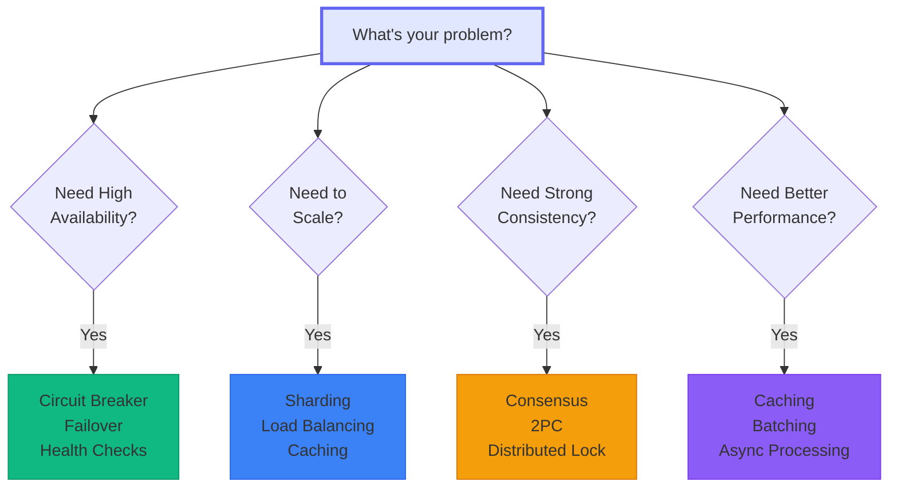

# Distributed Systems Patterns

**~95 carefully curated patterns for building reliable, scalable distributed systems**

    <h3 style="margin-top: 0;">🏆 Excellence Tier System</h3>
    
Patterns are now classified by implementation maturity and real-world validation:

    

        <strong>🥇 Gold</strong> - Battle-tested at FAANG scale
        <strong>🥈 Silver</strong> - Proven in production
        <strong>🥉 Bronze</strong> - Well-documented approach
    

!!! info "Pattern Curation"
    We've curated the most valuable patterns for modern distributed systems, focusing on practical, battle-tested solutions. Each pattern has been selected for its real-world applicability and proven impact in production systems.

!!! tip "Quick Navigation"
    - **[Pattern Catalog](#pattern-catalog)** - Sortable/filterable view
    - **[Excellence Guides](#excellence-guides)** - Best practices by tier
    - **[Pattern Packs](#pattern-packs)** - Pre-selected bundles
    - **[Pattern Health Dashboard](#pattern-health)** - Implementation metrics
    - **[By Problem Domain](#by-problem-domain)** - Organized by what you're building
    - **[By Challenge](#by-challenge)** - Find patterns for specific problems
    - **[Learning Paths](#learning-paths)** - Progressive learning tracks
    - **[Pattern Navigator](#pattern-navigator)** - Visual decision guide

## 🔍 Pattern Tier Filter

    <h4 style="margin-top: 0;">Filter Patterns by Excellence Tier:</h4>
    

        <label for="filter-gold" style="display: flex; align-items: center; gap: 0.5rem; cursor: pointer;">
            <input type="checkbox" id="filter-gold" checked onchange="applyFilters()"> 
            🥇 Gold (25 patterns)
        </label>
        <label for="filter-silver" style="display: flex; align-items: center; gap: 0.5rem; cursor: pointer;">
            <input type="checkbox" id="filter-silver" checked onchange="applyFilters()"> 
            🥈 Silver (40 patterns)
        </label>
        <label for="filter-bronze" style="display: flex; align-items: center; gap: 0.5rem; cursor: pointer;">
            <input type="checkbox" id="filter-bronze" checked onchange="applyFilters()"> 
            🥉 Bronze (30 patterns)
        </label>
    

    

        <button onclick="resetFilters()" style="background: #e5e7eb; color: #374151; padding: 0.5rem 1.5rem; border: none; border-radius: 4px; cursor: pointer;">Reset All Filters</button>
    

## 🎯 Pattern Finder

-   :material-magnify: **What problem are you solving?**
    
    - [High Availability → Circuit Breaker, Failover](#high-availability)
    - [Scalability → Sharding, Caching](#scalability)
    - [Consistency → Consensus, Saga](#consistency)
    - [Performance → Batching, CDN](#performance)

-   :material-school: **What's your experience level?**
    
    - [Beginner → Start with basics](#beginner-path)
    - [Intermediate → Core patterns](#intermediate-path)
    - [Advanced → Complex patterns](#advanced-path)
    - [Expert → Cutting edge](#expert-path)

-   :material-layers: **Where in your stack?**
    
    - [Infrastructure → Storage, Network](#infrastructure-layer)
    - [Platform → Service Mesh, Gateway](#platform-layer)
    - [Application → CQRS, Saga](#application-layer)
    - [Cross-cutting → Security, Monitoring](#cross-cutting)

-   :material-book-open: **Learn by example?**
    
    - [Case Studies](case-studies/)
    - [Implementation Guides](patterns/pattern-implementations)
    - [Anti-patterns](patterns/anti-patterns)

---

## 📦 Pattern Packs

    <h3>Pre-selected Pattern Bundles for Your Journey</h3>
    

    
    - :material-rocket-launch:{ .lg .middle } **Starter Pack**
        
        ---
        
        **Perfect for**: New projects & MVPs  
        **Tier**: 🥇 Gold patterns only  
        **Time**: 2 weeks  
        
        **Includes**:
        - ✅ Circuit Breaker
        - ✅ Retry & Backoff
        - ✅ Health Check
        - ✅ Load Balancing
        - ✅ Basic Caching
        
        [🚀 Get Started](excellence/starter-pack.md)
    
    - :material-chart-line:{ .lg .middle } **Scale Pack**
        
        ---
        
        **Perfect for**: Growing from 1K to 100K users  
        **Tier**: 🥇 Gold + 🥈 Silver  
        **Time**: 4 weeks  
        
        **Includes**:
        - ✅ Sharding
        - ✅ CQRS
        - ✅ Service Mesh
        - ✅ Auto-scaling
        - ✅ Event Streaming
        
        [📈 Scale Up](excellence/scale-pack.md)
    
    - :material-office-building:{ .lg .middle } **Enterprise Pack**
        
        ---
        
        **Perfect for**: Mission-critical systems  
        **Tier**: All tiers with governance  
        **Time**: 8 weeks  
        
        **Includes**:
        - ✅ Multi-region
        - ✅ Cell-based Architecture
        - ✅ Saga Pattern
        - ✅ Zero-trust Security
        - ✅ Chaos Engineering
        
        [🏢 Go Enterprise](excellence/enterprise-pack.md)
    
    

## 📊 Excellence Guides

    <h3>Pattern Implementation Best Practices by Tier</h3>
    

    
    - :material-medal:{ .lg .middle } **Gold Tier Guide**
        
        ---
        
        **Standards**: FAANG-level implementation
        
        - Comprehensive monitoring
        - Graceful degradation
        - Zero-downtime deployment
        - Automated testing
        - Performance benchmarks
        
        [📖 Gold Standards](excellence/gold-tier-guide.md)
    
    - :material-medal-outline:{ .lg .middle } **Silver Tier Guide**
        
        ---
        
        **Standards**: Production-ready practices
        
        - Health checks & alerts
        - Configuration management
        - Rollback procedures
        - Integration testing
        - Documentation
        
        [📖 Silver Standards](excellence/silver-tier-guide.md)
    
    - :material-trophy-outline:{ .lg .middle } **Bronze Tier Guide**
        
        ---
        
        **Standards**: Solid foundations
        
        - Basic monitoring
        - Error handling
        - Unit testing
        - Code reviews
        - README files
        
        [📖 Bronze Standards](excellence/bronze-tier-guide.md)
    
    

---

## 📚 By Problem Domain

### Core Distributed Primitives
*Fundamental building blocks that other patterns depend on*

-   **Consensus & Coordination**
    
    - [Consensus](patterns/consensus) - Agreement in distributed systems
    - [Leader Election](patterns/leader-election) - Choosing a coordinator
    - [Distributed Lock](patterns/distributed-lock) - Mutual exclusion
    - [Lease](patterns/lease) - Time-bound ownership
    - [Generation Clock](patterns/generation-clock) - Epoch tracking
    - [Emergent Leader](patterns/emergent-leader) - Gossip-based leadership

-   **Time & Ordering**
    
    - [Logical Clocks](patterns/logical-clocks) - Event ordering
    - [Logical Clocks](patterns/logical-clocks) - Event ordering and causality
    - [Clock Sync](patterns/clock-sync) - Time synchronization

-   **Communication**
    
    - [Heartbeat](patterns/heartbeat) - Failure detection
    - [Single-Socket Channel](patterns/single-socket-channel) - Multiplexing
    - [Request Batching](patterns/request-batching) - Performance boost

### Data Management

-   **Storage & Persistence**
    
    - [WAL](patterns/wal) - Write-ahead logging
    - [Segmented Log](patterns/segmented-log) - Log management
    - [LSM Tree](patterns/lsm-tree) - Write optimization
    - [Distributed Storage](patterns/distributed-storage) - Multi-node

-   **Replication & Consistency**
    
    - [Leader-Follower](patterns/leader-follower) - Primary-backup
    - [State Watch](patterns/state-watch) - Change notifications
    - [Read Repair](patterns/read-repair) - Repair divergence
    - [Low/High-Water Marks](patterns/low-high-water-marks) - Flow control
    - [Eventual Consistency](patterns/eventual-consistency) - Convergence
    - [Tunable Consistency](patterns/tunable-consistency) - Configurable

-   **Partitioning**
    
    - [Sharding](patterns/sharding) - Horizontal partitioning
    - [Consistent Hashing](patterns/consistent-hashing) - Dynamic partition
    - [Shared Nothing](patterns/shared-nothing) - Isolation
    - [Cell-Based](patterns/cell-based) - Blast radius control

-   **Transactions**
    
    - [Saga](patterns/saga) - Distributed workflows
    - [Outbox](patterns/outbox) - Transactional messaging
    - [Idempotent Receiver](patterns/idempotent-receiver) - Exactly-once processing

### Resilience & Fault Tolerance

-   **Circuit Protection**
    
    - [Circuit Breaker](patterns/circuit-breaker) - Failure isolation
    - [Bulkhead](patterns/bulkhead) - Resource isolation
    - [Retry with Backoff](patterns/retry-backoff) - Smart retries

-   **Load Management**
    
    - [Rate Limiting](patterns/rate-limiting) - Request throttling
    - [Load Shedding](patterns/load-shedding) - Overload protection
    - [Backpressure](patterns/backpressure) - Flow control
    - [Graceful Degradation](patterns/graceful-degradation) - Feature reduction

-   **Fault Recovery**
    
    - [Failover](patterns/failover) - Backup activation
    - [Fault Tolerance](patterns/fault-tolerance) - Comprehensive guide

### Performance & Caching

-   **Caching Strategies**
    
    - [Cache Aside](patterns/cache-aside) - Lazy loading
    - [Read-Through](patterns/read-through-cache) - Transparent reads
    - [Write-Through](patterns/write-through-cache) - Sync writes
    - [Write-Behind](patterns/write-behind-cache) - Async writes
    - [Caching Strategies](patterns/caching-strategies) - Complete guide

-   **Performance Optimization**
    
    - [Bloom Filter](patterns/bloom-filter) - Set membership
    - [Materialized View](patterns/materialized-view) - Precomputed
    - [Request Routing](patterns/request-routing) - Smart routing
    - [Auto-Scaling](patterns/auto-scaling) - Dynamic capacity

### Architectural Patterns

-   **Microservices**
    
    - [Service Mesh](patterns/service-mesh) - Service communication
    - [API Gateway](patterns/api-gateway) - Single entry
    - [Service Registry](patterns/service-registry) - Discovery
    - [Sidecar](patterns/sidecar) - Proxy pattern
    - [Ambassador](patterns/ambassador) - Remote proxy
    - [BFF](patterns/backends-for-frontends) - Backend for Frontend

-   **Event-Driven**
    
    - [Event Sourcing](patterns/event-sourcing) - Event storage
    - [CQRS](patterns/cqrs) - Read/write separation
    - [Event Streaming](patterns/event-streaming) - Real-time
    - [CDC](patterns/cdc) - Change capture
    - [Choreography](patterns/choreography) - Decentralized

-   **Data Architecture**
    
    - [Data Lake](patterns/data-lake) - Raw storage
    - [Data Mesh](patterns/data-mesh) - Domain-oriented
    - [Lambda Architecture](patterns/lambda-architecture) - Batch+stream
    - [Kappa Architecture](patterns/kappa-architecture) - Stream-only
    - [Polyglot Persistence](patterns/polyglot-persistence) - Multi-DB

### Specialized Domains

-   **Edge & IoT**
    
    - [Edge Computing](patterns/edge-computing) - Distributed edge
    - [Delta Sync](patterns/delta-sync) - Efficient sync
    - [Battery Optimization](patterns/battery-optimization) - Power
    - [Network Optimization](patterns/network-optimization) - Bandwidth

-   **Geospatial**
    
    - [Geohashing](patterns/geohashing) - Spatial indexing
    - [Tile Pyramid](patterns/tile-pyramid) - Map tiles
    - [Vector Tiles](patterns/vector-tiles) - Efficient maps
    - [Geofencing](patterns/geofencing) - Location bounds

-   **Security & Privacy**
    
    - [Valet Key](patterns/valet-key) - Temporary access
    - [E2E Encryption](patterns/e2e-encryption) - End-to-end
    - [Key Management](patterns/key-management) - Crypto keys
    - [Consent Management](patterns/consent-management) - Privacy

---

## 🎓 Learning Paths

### Beginner Path
*Start here if you're new to distributed systems*

-   **Week 1: Basics**
    1. [Health Check](patterns/health-check) - Monitor services
    2. [Timeout](patterns/timeout) - Prevent hanging
    3. [Retry](patterns/retry-backoff) - Handle transient failures

-   **Week 2: Protection**
    4. [Circuit Breaker](patterns/circuit-breaker) - Stop cascading failures
    5. [Rate Limiting](patterns/rate-limiting) - Control request flow
    6. [Bulkhead](patterns/bulkhead) - Isolate resources

-   **Week 3: Performance**
    7. [Cache Aside](patterns/cache-aside) - Basic caching
    8. [Load Balancing](patterns/load-balancing) - Distribute load
    9. [Request Batching](patterns/request-batching) - Reduce overhead

-   **Week 4: Reliability**
    10. [Leader-Follower](patterns/leader-follower) - Basic replication
    11. [Failover](patterns/failover) - Handle failures
    12. [Health Check](patterns/health-check) - Monitor health

### Intermediate Path
*For engineers with distributed systems experience*

-   **Consensus & Coordination**
    - [Consensus](patterns/consensus) fundamentals
    - [Leader Election](patterns/leader-election) patterns
    - [Distributed Lock](patterns/distributed-lock) implementation
    - [Generation Clock](patterns/generation-clock) for epochs

-   **Data Distribution**
    - [Sharding](patterns/sharding) strategies
    - [Consistent Hashing](patterns/consistent-hashing)
    - [Replication](patterns/leader-follower) patterns
    - [Logical Clocks](patterns/logical-clocks) for causality

-   **Event Architecture**
    - [Event Sourcing](patterns/event-sourcing) basics
    - [CQRS](patterns/cqrs) implementation
    - [Saga](patterns/saga) patterns
    - [Outbox](patterns/outbox) for consistency

-   **Service Architecture**
    - [Service Mesh](patterns/service-mesh) concepts
    - [API Gateway](patterns/api-gateway) patterns
    - [Service Discovery](patterns/service-discovery)
    - [Sidecar](patterns/sidecar) pattern

### Advanced Path
*For experienced distributed systems engineers*

-   **Complex Coordination**
    - [Saga](patterns/saga) for distributed workflows
    - [Byzantine Fault Tolerance](patterns/byzantine-fault-tolerance)
    - [Emergent Leader](patterns/emergent-leader)
    - [CRDTs](patterns/crdt)

-   **Advanced Data**
    - [Anti-Entropy](patterns/anti-entropy)
    - [Merkle Trees](patterns/merkle-trees)
    - [LSM Trees](patterns/lsm-tree)
    - [Segmented Log](patterns/segmented-log)

-   **Architecture Patterns**
    - [Data Mesh](patterns/data-mesh)
    - [Lambda Architecture](patterns/lambda-architecture)
    - [Cell-Based Architecture](patterns/cell-based)
    - [Polyglot Persistence](patterns/polyglot-persistence)

-   **Specialized**
    - [ML Pipeline](patterns/ml-pipeline)
    - [Time Series](patterns/time-series-ids)
    - [Blockchain](patterns/blockchain-patterns)
    - [Quantum-Ready](patterns/quantum-ready)

---

## 🔍 By Challenge

### High Availability
*"How do I keep my system running?"*

| Challenge | Primary Patterns | Supporting Patterns |
|-----------|-----------------|-------------------|
| **Single point of failure** | [Leader-Follower](patterns/leader-follower), [Failover](patterns/failover) | [Health Check](patterns/health-check), [Heartbeat](patterns/heartbeat) |
| **Cascading failures** | [Circuit Breaker](patterns/circuit-breaker), [Bulkhead](patterns/bulkhead) | [Timeout](patterns/timeout), [Retry](patterns/retry-backoff) |
| **Overload** | [Load Shedding](patterns/load-shedding), [Rate Limiting](patterns/rate-limiting) | [Backpressure](patterns/backpressure), [Auto-Scaling](patterns/auto-scaling) |
| **Network partitions** | [Split-Brain](patterns/split-brain), [Consensus](patterns/consensus) | [Generation Clock](patterns/generation-clock), [Lease](patterns/lease) |

### Scalability
*"How do I handle more load?"*

| Challenge | Primary Patterns | Supporting Patterns |
|-----------|-----------------|-------------------|
| **Data volume** | [Sharding](patterns/sharding), [Partitioning](patterns/sharding) | [Consistent Hashing](patterns/consistent-hashing) |
| **Request volume** | [Load Balancing](patterns/load-balancing), [Caching](patterns/caching-strategies) | [CDN](patterns/cdn), [Edge Computing](patterns/edge-computing) |
| **Geographic scale** | [Geo-Replication](patterns/geo-replication), [Multi-Region](patterns/multi-region) | [Eventual Consistency](patterns/eventual-consistency) |
| **Cost at scale** | [FinOps](patterns/finops), [Serverless](patterns/serverless-faas) | [Auto-Scaling](patterns/auto-scaling), [Spot Instances](patterns/spot-instances) |

### Consistency
*"How do I keep data correct?"*

| Challenge | Primary Patterns | Supporting Patterns |
|-----------|-----------------|-------------------|
| **Distributed state** | [Consensus](patterns/consensus), [Saga](patterns/saga) | [Logical Clocks](patterns/logical-clocks), [State Watch](patterns/state-watch) |
| **Concurrent updates** | [CAS](patterns/cas), [Generation Clock](patterns/generation-clock) | [Event Sourcing](patterns/event-sourcing) |
| **Eventual consistency** | [Anti-Entropy](patterns/anti-entropy), [CRDTs](patterns/crdt) | [Gossip](patterns/gossip-protocol), [Merkle Trees](patterns/merkle-trees) |
| **Transaction boundaries** | [Saga](patterns/saga), [Outbox](patterns/outbox) | [Event Sourcing](patterns/event-sourcing) |

### Performance
*"How do I make it faster?"*

| Challenge | Primary Patterns | Supporting Patterns |
|-----------|-----------------|-------------------|
| **Latency** | [Caching](patterns/caching-strategies), [CDN](patterns/cdn) | [Edge Computing](patterns/edge-computing) |
| **Throughput** | [Batching](patterns/request-batching), [Async Processing](patterns/async-processing) | [Pipeline](patterns/pipeline) |
| **Database load** | [Read Replicas](patterns/leader-follower), [Materialized Views](patterns/materialized-view) | [CQRS](patterns/cqrs) |
| **Network overhead** | [Compression](patterns/compression), [Protocol Buffers](patterns/protobuf) | [Single-Socket](patterns/single-socket-channel) |

---

## 🏗️ By System Layer

### Infrastructure Layer
*Low-level distributed systems primitives*

- **Storage**: [WAL](patterns/wal), [LSM Tree](patterns/lsm-tree), [B-Tree](patterns/btree)
- **Network**: [Gossip](patterns/gossip-protocol), [Heartbeat](patterns/heartbeat), [RPC](patterns/rpc)
- **Consensus**: [Raft](patterns/raft), [Paxos](patterns/paxos), [PBFT](patterns/pbft)
- **Time**: [Clock Sync](patterns/clock-sync), [Logical Clocks](patterns/logical-clocks)

### Platform Layer
*Building blocks for distributed applications*

- **Service Mesh**: [Envoy](patterns/service-mesh), [Istio patterns](patterns/istio-patterns)
- **Orchestration**: [Leader Election](patterns/leader-election), [Scheduler](patterns/scheduler)
- **Messaging**: [Pub-Sub](patterns/pub-sub), [Message Queue](patterns/distributed-queue)
- **Monitoring**: [Distributed Tracing](patterns/distributed-tracing), [Metrics](patterns/metrics)

### Application Layer
*Application-level patterns*

- **Architecture**: [Microservices](patterns/microservices), [Serverless](patterns/serverless-faas)
- **Data**: [CQRS](patterns/cqrs), [Event Sourcing](patterns/event-sourcing), [Saga](patterns/saga)
- **API**: [GraphQL](patterns/graphql-federation), [REST](patterns/rest-patterns), [gRPC](patterns/grpc)
- **Frontend**: [BFF](patterns/backends-for-frontends), [Edge Rendering](patterns/edge-rendering)

---

## 📈 Pattern Health Dashboard

    <h3>Real-time Pattern Implementation Metrics</h3>
    

        

            <h4 style="margin: 0; color: #5448C8;">95</h4>
            
Total Patterns

        

        

            <h4 style="margin: 0; color: #FFD700;">25</h4>
            
Gold Tier

        

        

            <h4 style="margin: 0; color: #C0C0C0;">40</h4>
            
Silver Tier

        

        

            <h4 style="margin: 0; color: #CD7F32;">30</h4>
            
Bronze Tier

        

        

            <h4 style="margin: 0; color: #10b981;">87%</h4>
            
Implementation Success

        

        

            <h4 style="margin: 0; color: #3b82f6;">4.2/5</h4>
            
Avg. Satisfaction

        

    

    

        <a href="excellence/pattern-health-dashboard.md" style="background: #5448C8; color: white; padding: 0.75rem 2rem; text-decoration: none; border-radius: 4px; display: inline-block;">View Full Dashboard →</a>
    

## 📊 Pattern Comparison

### Consensus Patterns
| Pattern | Tier | Fault Tolerance | Performance | Complexity | Use Case |
|---------|------|----------------|-------------|------------|----------|
| [Raft](patterns/consensus) | 🥇 Gold | n/2 | Fast | Medium | General purpose |
| [Paxos](patterns/consensus) | 🥈 Silver | n/2 | Medium | High | Academic/proven |
| [PBFT](patterns/byzantine-fault-tolerance) | 🥉 Bronze | n/3 | Slow | Very High | Byzantine faults |
| [Gossip](patterns/emergent-leader) | 🥈 Silver | High | Variable | Low | Eventual consistency |

### Caching Patterns
| Pattern | Tier | Consistency | Complexity | Performance | Use Case |
|---------|------|------------|------------|-------------|----------|
| [Cache Aside](patterns/cache-aside) | 🥇 Gold | Eventual | Low | Good | Read heavy |
| [Read Through](patterns/read-through-cache) | 🥈 Silver | Eventual | Medium | Better | Transparent |
| [Write Through](patterns/write-through-cache) | 🥈 Silver | Strong | Medium | Slower | Consistency |
| [Write Behind](patterns/write-behind-cache) | 🥉 Bronze | Eventual | High | Fastest | Write heavy |

### Transaction Patterns
| Pattern | Tier | Consistency | Availability | Partition Tolerance | Use Case |
|---------|------|------------|--------------|-------------------|----------|
| [Saga](patterns/saga) | 🥈 Silver | Eventual | High | Yes | Multi-DC |
| [Saga](patterns/saga) | 🥈 Silver | Eventual | High | Yes | Microservices |
| [TCC](patterns/tcc) | 🥉 Bronze | Eventual | High | Yes | Business trans |
| [Outbox](patterns/outbox) | 🥈 Silver | Eventual | High | Yes | Event + DB |

---

## 🚫 Anti-Patterns

### Common Mistakes

-   **Premature Distribution**
    
    Using distributed patterns when monolithic would work
    
    ❌ **Wrong**: Microservices for 10 users  
    ✅ **Right**: Start monolithic, split when needed

-   **Pattern Overload**
    
    Applying too many patterns at once
    
    ❌ **Wrong**: Service Mesh + CQRS + Event Sourcing day 1  
    ✅ **Right**: Add patterns as problems arise

-   **Wrong Pattern**
    
    Using consensus when eventual consistency suffices
    
    ❌ **Wrong**: Paxos for shopping cart  
    ✅ **Right**: CRDTs or last-write-wins

-   **Missing Basics**
    
    Advanced patterns without fundamentals
    
    ❌ **Wrong**: Kafka without health checks  
    ✅ **Right**: Timeouts → Retries → Circuit Breaker → Kafka

---

## 🎯 Quick Decision Guide

---

## 📚 Additional Resources

### Tools & References
- [Pattern Selector Tool](patterns/pattern-selector) - Interactive decision tree
- [Pattern Matrix](patterns/pattern-matrix) - Complete comparison table
- [Pattern Relationships](patterns/pattern-relationships) - Dependency graph
- [Implementation Guide](patterns/pattern-implementations) - Code examples

### Learning Resources
- [Pattern Selector Tool](patterns/pattern-selector-tool) - Find the right pattern
- [Case Studies](case-studies/) - Real-world examples
- [Anti-Patterns](patterns/anti-patterns) - What not to do
- [Pattern Combinations](patterns/pattern-combinations) - Common groupings

### Related Topics
- [The 7 Laws](part1-axioms/) - Fundamental principles
- [The 5 Pillars](part2-pillars/) - Core concepts
- [Quantitative Analysis](quantitative/) - Math behind patterns
- [Human Factors](human-factors/) - Operational excellence

---

[← Back to Home](/) | [The 7 Laws →](part1-axioms/) | [The 5 Pillars →](part2-pillars/)

