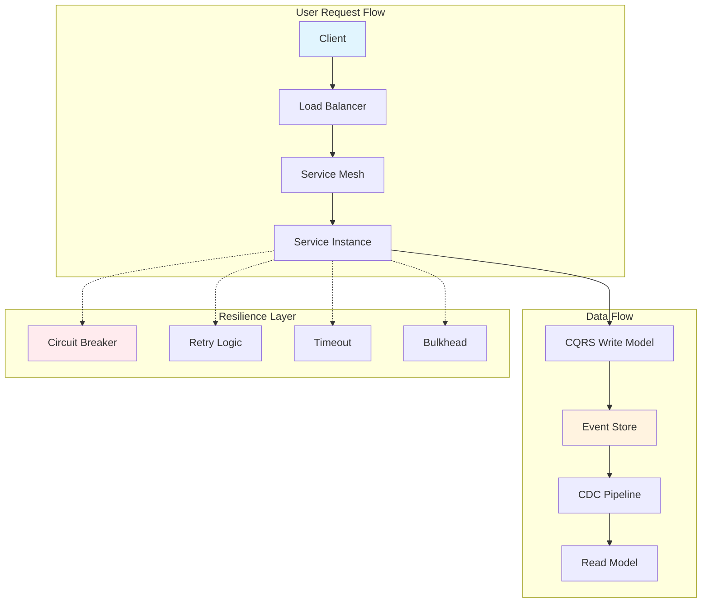
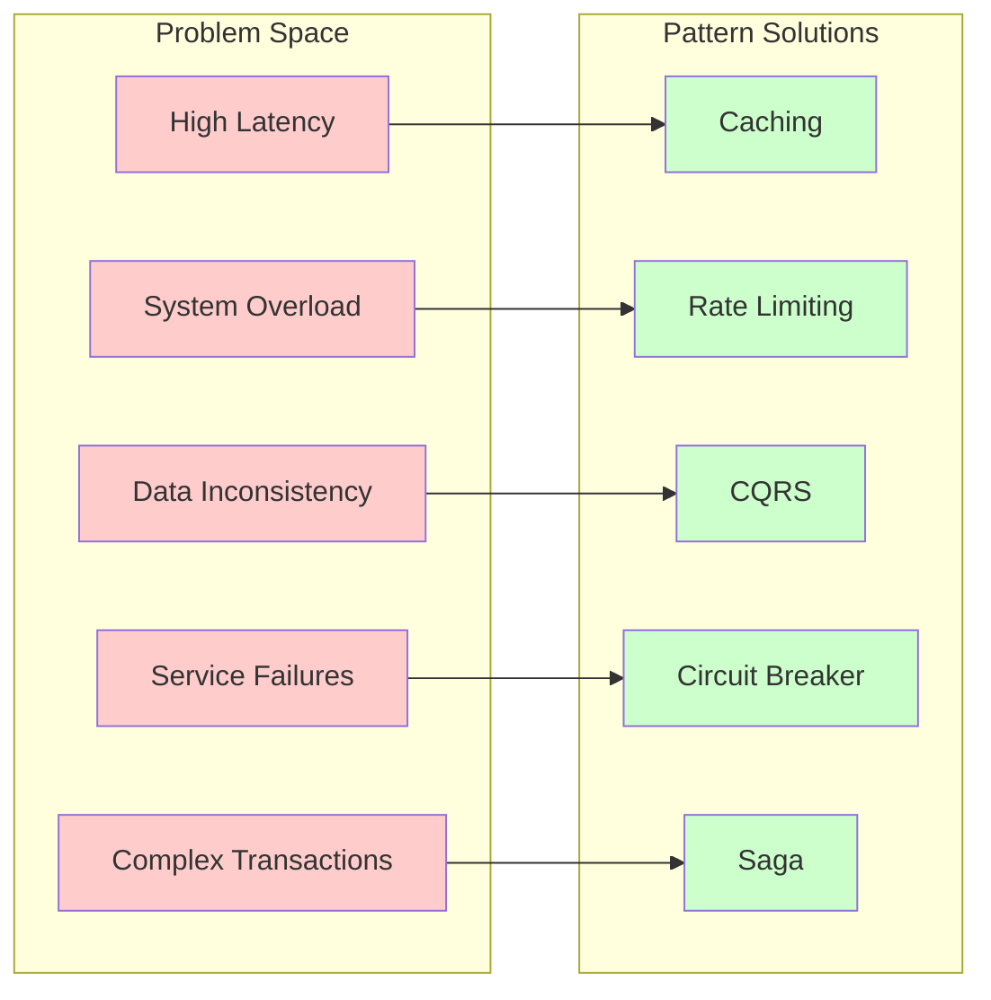

<!-- Navigation -->
[Home](../index.md) → [Part III: Patterns](index.md) → **Part III: Modern Architectural Patterns**

# Part III: Modern Architectural Patterns

**Proven solutions derived from fundamental constraints**

## Overview

Every pattern in distributed systems emerges from the fundamental axioms. This section presents battle-tested patterns that address real-world distributed systems challenges.

## Pattern Categories

### Core Patterns
Fundamental architectural patterns that shape modern distributed systems:

- **[Queues & Streaming](queues-streaming.md)** - Decoupling producers from consumers
- **[CQRS](cqrs.md)** - Command Query Responsibility Segregation (Greg Young, 2010)¹
- **[Event-Driven Architecture](event-driven.md)** - Choreography over orchestration
- **[Event Sourcing](event-sourcing.md)** - State as a sequence of events (Martin Fowler)²
- **[Saga Pattern](saga.md)** - Distributed transaction management (Garcia-Molina & Salem, 1987)³
- **[Service Mesh](service-mesh.md)** - Infrastructure layer for service communication
- **[GraphQL Federation](graphql-federation.md)** - Unified data graph across services
- **[Serverless/FaaS](serverless-faas.md)** - Functions as the unit of deployment

### Resilience Patterns
Patterns that ensure systems survive failures:

- **[Circuit Breaker](circuit-breaker.md)** - Preventing cascade failures (Nygard, 2007)⁴
- **[Retry & Backoff](retry-backoff.md)** - Intelligent retry strategies
- **[Bulkhead](bulkhead.md)** - Failure isolation through partitioning (Nygard)⁴
- **[Timeout](timeout.md)** - Bounded wait times for operations
- **[Health Check](health-check.md)** - Service liveness and readiness
- **[Graceful Degradation](graceful-degradation.md)** - Reduced functionality under stress
- **[Rate Limiting](rate-limiting.md)** - Protecting from overload
- **[Load Shedding](load-shedding.md)** - Dropping work to survive

### Data Patterns
Managing data in distributed environments:

- **[CDC (Change Data Capture)](cdc.md)** - Real-time data synchronization
- **[Tunable Consistency](tunable-consistency.md)** - Flexible consistency guarantees (Dynamo)⁵
- **[Sharding](sharding.md)** - Horizontal data partitioning
- **[Caching Strategies](caching-strategies.md)** - Multi-level cache hierarchies
- **[Geo-Replication](geo-replication.md)** - Global data distribution

### Coordination Patterns
Patterns for distributed coordination and messaging:

- **[Leader Election](leader-election.md)** - Single coordinator selection (Raft/Paxos)⁶⁷
- **[Distributed Lock](distributed-lock.md)** - Mutual exclusion across nodes
- **[Idempotent Receiver](idempotent-receiver.md)** - Handling duplicate messages
- **[Outbox](outbox.md)** - Reliable message publishing (Kleppmann)⁸
- **[Service Discovery](service-discovery.md)** - Dynamic service location

### Operational Patterns
Patterns for running systems in production:

- **[Observability](observability.md)** - Metrics, logs, and traces
- **[Auto-Scaling](auto-scaling.md)** - Dynamic resource adjustment
- **[Load Balancing](load-balancing.md)** - Request distribution strategies
- **[Edge Computing](edge-computing.md)** - Processing at the periphery
- **[FinOps](finops.md)** - Cloud cost optimization

## Visual Pattern Relationships



## How Patterns Relate to Axioms

Each pattern addresses specific axiom constraints:

```proto
Pattern               Primary Axioms        Trade-offs
-------               --------------        ----------
Circuit Breaker       Failure, Latency      Availability vs Accuracy
CQRS                 Concurrency, State    Consistency vs Complexity
Event Sourcing       State, Time           Storage vs Flexibility
Service Mesh         Coordination, Obs     Performance vs Features
Sharding             Capacity, State       Scalability vs Complexity
Rate Limiting        Capacity, Economics   Protection vs User Experience
Distributed Lock     Coordination, Failure Consistency vs Availability
Auto-Scaling         Capacity, Economics   Cost vs Response Time
Load Balancing       Capacity, Latency     Fairness vs Efficiency
Timeout              Latency, Failure      Responsiveness vs Completeness
```

## Real-World Pattern Usage

### Circuit Breaker at Netflix
Netflix's Hystrix library⁹ implements circuit breakers that handle over 100 billion thread-isolated and 10 billion semaphore-isolated command executions per day. When a service fails, Hystrix prevents cascading failures by "opening the circuit" and serving fallback responses.

### CQRS at LinkedIn
LinkedIn uses CQRS¹⁰ to separate their write-heavy profile updates from read-heavy timeline generation, allowing them to optimize each path independently and serve billions of timeline reads daily.

### Event Sourcing at Walmart
Walmart's order management system¹¹ uses event sourcing to track the complete history of each order, enabling them to reconstruct any order state and handle complex scenarios like partial refunds and multi-step fulfillment.

### Service Mesh at Lyft
Lyft's Envoy proxy¹² (which became the foundation for Istio) handles over 100 million requests per second across their microservices, providing load balancing, circuit breaking, and observability without changing application code.

## Pattern Decision Matrix



## Using This Section

### For Architects
1. Start with the problem you're solving
2. Identify which axioms create the constraint
3. Choose patterns that address those constraints
4. Understand the trade-offs

### For Engineers
1. Study the implementation details
2. Understand failure modes
3. Learn from real-world examples
4. Practice with the code samples

### For Technical Leaders
1. Understand pattern economics
2. Evaluate organizational fit
3. Plan migration strategies
4. Consider operational complexity

## Pattern Selection Framework

When choosing patterns, consider:

1. **Problem Fit** - Does it solve your actual problem?
2. **Complexity Cost** - Can your team operate it?
3. **Performance Impact** - What's the overhead?
4. **Economic Viability** - Is it cost-effective?
5. **Future Flexibility** - Does it lock you in?

### Example: Choosing Between Patterns

**Scenario**: Need to handle 10K requests/second with 99.9% availability

```yaml
Option 1: Simple Load Balancer + Retries
- Cost: Low ($500/month)
- Complexity: Low (team knows it)
- Availability: 99.5% (not enough)
- Verdict: ❌ Doesn't meet requirements

Option 2: Service Mesh + Circuit Breakers
- Cost: Medium ($2000/month)  
- Complexity: High (need training)
- Availability: 99.95% (exceeds requirement)
- Verdict: ✅ IF team can be trained

Option 3: Serverless + API Gateway
- Cost: Variable ($1000-3000/month)
- Complexity: Medium (some experience)
- Availability: 99.99% (exceeds requirement)
- Verdict: ✅ Best balance
```

## Anti-Patterns to Avoid

- **Pattern Cargo Cult** - Using patterns because others do
- **Premature Distribution** - Distributing before necessary
- **Consistency Theater** - Over-engineering consistency
- **Resume-Driven Architecture** - Choosing for career reasons
- **Infinite Scalability** - Ignoring practical limits

## Pattern Learning Path

### 🌱 Beginner Path (0-2 years experience)
1. **Start here**: [Circuit Breaker](circuit-breaker.md) - Easiest to understand and implement
2. **Next**: [Caching Strategies](caching-strategies.md) - Immediate performance benefits
3. **Then**: [Retry & Backoff](retry-backoff.md) - Essential resilience pattern
4. **Foundation**: [Load Balancing](load-balancing.md) - Fundamental scaling pattern

### 🌳 Intermediate Path (2-5 years experience)
1. **Data patterns**: [CQRS](cqrs.md) → [Event Sourcing](event-sourcing.md)
2. **Integration**: [Event-Driven Architecture](event-driven.md) → [Saga Pattern](saga.md)
3. **Infrastructure**: [Service Mesh](service-mesh.md) → [Observability](observability.md)

### 🌲 Advanced Path (5+ years experience)
1. **Complex data**: [Sharding](sharding.md) → [Geo-Replication](geo-replication.md)
2. **Cutting edge**: [Serverless](serverless-faas.md) → [Edge Computing](edge-computing.md)
3. **Operations**: [FinOps](finops.md) → [Chaos Engineering](../human-factors/chaos-engineering.md)

### 🧠 Test Your Knowledge

Ready to test your pattern knowledge?
- **[Pattern Quiz](pattern-quiz.md)** - 20 questions testing pattern selection

## Key Takeaways

### 📚 Universal Principles

1. **Patterns emerge from constraints** - Every pattern solves a specific axiom limitation
2. **Trade-offs are mandatory** - No pattern gives you something for nothing
3. **Context determines choice** - Same problem, different scale/team/constraints = different pattern
4. **Simple beats complex** - Start with the simplest solution that works
5. **Operations are paramount** - If you can't operate it at 3 AM, don't build it
6. **Measure everything** - Quantify the benefits and costs of pattern adoption
7. **Evolution over revolution** - Migrate incrementally, validate continuously

### 📋 Pattern Selection Checklist

#### Before Adopting Any Pattern:
- [ ] **Clear constraint mapping** - Which axiom(s) does this address?
- [ ] **Team readiness** - Can we build, deploy, and operate this?
- [ ] **Economic justification** - What's the ROI calculation?
- [ ] **Fallback plan** - How do we roll back if it doesn't work?
- [ ] **Success metrics** - How will we measure if it's working?

#### During Implementation:
- [ ] **Incremental rollout** - Start small, expand gradually
- [ ] **Monitoring in place** - Measure impact from day one
- [ ] **Documentation complete** - Runbooks, failure scenarios, troubleshooting
- [ ] **Team training** - Everyone understands operations

#### After Deployment:
- [ ] **Regular review** - Is it still solving the problem?
- [ ] **Cost tracking** - Is the economic model holding?
- [ ] **Failure analysis** - Learn from operational issues
- [ ] **Evolution planning** - What's next as we scale?

---

### Pattern Wisdom

> *"The best pattern is often no pattern—until you need it."*

> *"Choose patterns for the problems you have, not the problems you might have."*

> *"Every pattern is a bet on the future. Make sure you can afford to be wrong."*

## References

¹ [Young, G. (2010). CQRS Documents](https://cqrs.files.wordpress.com/2010/11/cqrs_documents.pdf)

² [Fowler, M. (2005). Event Sourcing](https://martinfowler.com/eaaDev/EventSourcing.html)

³ [Garcia-Molina, H., & Salem, K. (1987). Sagas](https://www.cs.cornell.edu/andru/cs711/2002fa/reading/sagas.pdf)

⁴ [Nygard, M. (2007). Release It!: Design and Deploy Production-Ready Software](https://pragprog.com/titles/mnee2/release-it-second-edition/)

⁵ [DeCandia, G., et al. (2007). Dynamo: Amazon's Highly Available Key-value Store](https://www.allthingsdistributed.com/files/amazon-dynamo-sosp2007.pdf)

⁶ [Ongaro, D., & Ousterhout, J. (2014). In Search of an Understandable Consensus Algorithm (Raft)](https://raft.github.io/raft.pdf)

⁷ [Lamport, L. (1998). The Part-Time Parliament (Paxos)](https://lamport.azurewebsites.net/pubs/lamport-paxos.pdf)

⁸ [Kleppmann, M. (2017). Designing Data-Intensive Applications](https://dataintensive.net/)

⁹ [Netflix Technology Blog. (2012). Introducing Hystrix for Resilience Engineering](https://netflixtechblog.com/introducing-hystrix-for-resilience-engineering-13531c1ab362)

¹⁰ [LinkedIn Engineering. (2015). The Log: What every software engineer should know about real-time data's unifying abstraction](https://engineering.linkedin.com/distributed-systems/log-what-every-software-engineer-should-know-about-real-time-datas-unifying)

¹¹ [Walmart Labs. (2017). How Walmart Uses Event Sourcing](https://medium.com/walmartglobaltech/building-reliable-distributed-systems-with-event-sourcing-and-cqrs-7c1a7c8c8c5d)

¹² [Lyft Engineering. (2017). Announcing Envoy: C++ L7 proxy and communication bus](https://eng.lyft.com/announcing-envoy-c-l7-proxy-and-communication-bus-92520b6c8191)