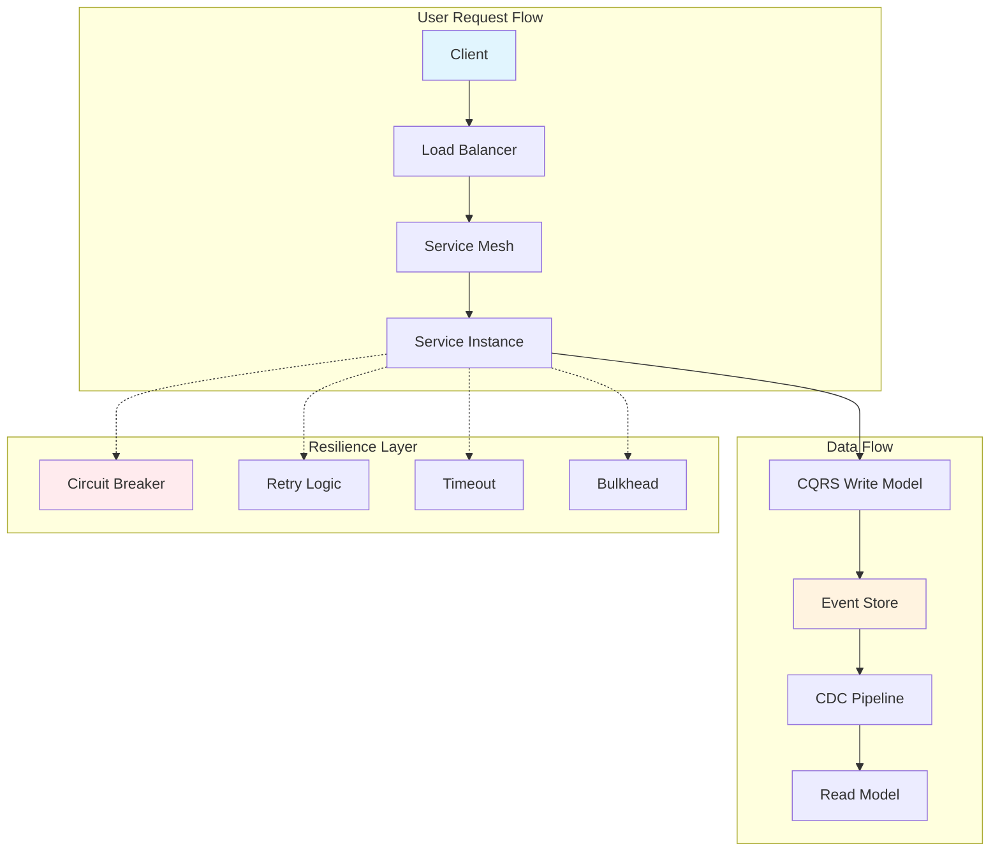

<!-- Navigation -->
[Home](../introduction/index.md) → **Part III: Modern Architectural Patterns**

# Part III: Modern Architectural Patterns

> *"Patterns emerge from the constraints of distributed systems like crystals forming in a supersaturated solution."*

## 🎯 Pattern Resources

- **[📊 Pattern Comparison Matrix](pattern-comparison.md)** - Compare patterns side-by-side
- **[🎮 Interactive Pattern Selector](pattern-selector.md)** - Find the right pattern for your use case
- **[🔗 Pattern Combinations Guide](pattern-combinations.md)** - Learn which patterns work well together
- **[📚 Pattern Learning Paths](#pattern-learning-path)** - Structured learning by experience level

## Pattern Categories

### Core Patterns
Fundamental architectural patterns that shape modern distributed systems:

- **[Queues & Streaming](queues-streaming.md)** ⭐ - Decoupling producers from consumers [Related: Work Distribution](../part2-pillars/work/index.md)
- **[CQRS](cqrs.md)** ⭐ - Command Query Responsibility Segregation (Greg Young, 2010)¹ [Related: Law 3 (Emergent Chaos 🌪️)](../part1-axioms/axiom3-emergence/index.md) | [Truth Distribution](../part2-pillars/truth/index.md)
- **[Event-Driven Architecture](event-driven.md)** ⭐ - Choreography over orchestration [Related: Law 4 (Multidimensional Optimization ⚖️)](../part1-axioms/axiom4-tradeoffs/index.md)
- **[Event Sourcing](event-sourcing.md)** ⭐ - State as a sequence of events (Martin Fowler)² [Related: State Distribution](../part2-pillars/state/index.md) | [Truth Distribution](../part2-pillars/truth/index.md)
- **[Saga Pattern](saga.md)** ⭐ - Distributed transaction management (Garcia-Molina & Salem, 1987)³ [Related: Law 4 (Multidimensional Optimization ⚖️)](../part1-axioms/axiom4-tradeoffs/index.md) | [PayPal Case Study](../case-studies/paypal-payments.md)
- **[Service Mesh](service-mesh.md)** ⭐ - Infrastructure layer for service communication [Related: Control Distribution](../part2-pillars/control/index.md)
- **[GraphQL Federation](graphql-federation.md)** - Unified data graph across services
- **[Serverless/FaaS](serverless-faas.md)** ⭐ - Functions as the unit of deployment [Related: Work Distribution](../part2-pillars/work/index.md)

### Resilience Patterns
Patterns that ensure systems survive failures:

- **[Circuit Breaker](circuit-breaker.md)** - Preventing cascade failures (Nygard, 2007)⁴ [Related: Law 1 (Correlated Failure ⛓️)](../part1-axioms/axiom1-failure/index.md) | [DynamoDB Case Study](../case-studies/amazon-dynamo.md)
- **[Retry & Backoff](retry-backoff.md)** ⭐ - Intelligent retry strategies [Related: Law 1 (Correlated Failure ⛓️)](../part1-axioms/axiom1-failure/index.md)
- **[Bulkhead](bulkhead.md)** ⭐ - Failure isolation through partitioning (Nygard)⁴ [Related: Law 1 (Correlated Failure ⛓️)](../part1-axioms/axiom1-failure/index.md)
- **[Timeout](timeout.md)** ⭐ - Bounded wait times for operations [Related: Law 2 (Asynchronous Reality ⏳)](../part1-axioms/axiom2-asynchrony/index.md)
- **[Health Check](health-check.md)** - Service liveness and readiness [Related: Law 5 (Distributed Knowledge 🧠)](../part1-axioms/axiom5-epistemology/index.md)
- **[Graceful Degradation](graceful-degradation.md)** - Reduced functionality under stress [Related: Law 6 (Cognitive Load 🤯)](../part1-axioms/axiom6-human-api/index.md)
- **[Rate Limiting](rate-limiting.md)** ⭐ - Protecting from overload [Related: Law 4 (Multidimensional Optimization ⚖️)](../part1-axioms/axiom4-tradeoffs/index.md)
- **[Load Shedding](load-shedding.md)** - Dropping work to survive [Related: Law 4 (Multidimensional Optimization ⚖️)](../part1-axioms/axiom4-tradeoffs/index.md)

### Data Patterns
Managing data in distributed environments:

- **[CDC (Change Data Capture)](cdc.md)** ⭐ - Real-time data synchronization [Related: State Distribution](../part2-pillars/state/index.md)
- **[Tunable Consistency](tunable-consistency.md)** ⭐ - Flexible consistency guarantees (Dynamo)⁵ [Related: Truth Distribution](../part2-pillars/truth/index.md) | [DynamoDB Case Study](../case-studies/amazon-dynamo.md)
- **[Sharding](sharding.md)** ⭐ - Horizontal data partitioning [Related: Law 4 (Multidimensional Optimization ⚖️)](../part1-axioms/axiom4-tradeoffs/index.md) | [State Distribution](../part2-pillars/state/index.md)
- **[Caching Strategies](caching-strategies.md)** ⭐ - Multi-level cache hierarchies [Related: Law 2 (Asynchronous Reality ⏳)](../part1-axioms/axiom2-asynchrony/index.md)
- **[Geo-Replication](geo-replication.md)** ⭐ - Global data distribution [Related: Law 2 (Asynchronous Reality ⏳)](../part1-axioms/axiom2-asynchrony/index.md) | [Uber Case Study](../case-studies/uber-location.md)
- **[Outbox Pattern](outbox.md)** ⭐ - Reliable event publishing [Related: Law 4 (Multidimensional Optimization ⚖️)](../part1-axioms/axiom4-tradeoffs/index.md)

### Coordination Patterns
Patterns for distributed coordination and messaging:

- **[Leader Election](leader-election.md)** ⭐ - Single coordinator selection (Raft/Paxos)⁶⁷ [Related: Law 4 (Multidimensional Optimization ⚖️)](../part1-axioms/axiom4-tradeoffs/index.md) | [Truth Distribution](../part2-pillars/truth/index.md)
- **[Distributed Lock](distributed-lock.md)** - Mutual exclusion across nodes [Related: Law 4 (Multidimensional Optimization ⚖️)](../part1-axioms/axiom4-tradeoffs/index.md)
- **[Idempotent Receiver](idempotent-receiver.md)** ⭐ - Handling duplicate messages [Related: Law 3 (Emergent Chaos 🌪️)](../part1-axioms/axiom3-emergence/index.md)
- **[Service Discovery](service-discovery.md)** - Dynamic service location [Related: Control Distribution](../part2-pillars/control/index.md)

### Operational Patterns
Patterns for running systems in production:

- **[Observability](observability.md)** - Metrics, logs, and traces [Related: Law 5 (Distributed Knowledge 🧠)](../part1-axioms/axiom5-epistemology/index.md) | [Control Distribution](../part2-pillars/control/index.md)
- **[Auto-Scaling](auto-scaling.md)** ⭐ - Dynamic resource adjustment [Related: Law 4 (Multidimensional Optimization ⚖️)](../part1-axioms/axiom4-tradeoffs/index.md) | [Law 7 (Economic Reality 💰)](../part1-axioms/axiom7-economics/index.md) | [Intelligence Distribution](../part2-pillars/intelligence/index.md)
- **[Load Balancing](load-balancing.md)** - Request distribution strategies [Related: Law 2 (Asynchronous Reality ⏳)](../part1-axioms/axiom2-asynchrony/index.md) | [Law 4 (Multidimensional Optimization ⚖️)](../part1-axioms/axiom4-tradeoffs/index.md) | [Work Distribution](../part2-pillars/work/index.md)
- **[Edge Computing](edge-computing.md)** ⭐ - Processing at the periphery [Related: Law 2 (Asynchronous Reality ⏳)](../part1-axioms/axiom2-asynchrony/index.md) | [Uber Case Study](../case-studies/uber-location.md)
- **[FinOps](finops.md)** - Cloud cost optimization [Related: Law 7 (Economic Reality 💰)](../part1-axioms/axiom7-economics/index.md)

*⭐ = Enhanced with 5-level progressive learning structure*

---

## Visual Pattern Relationships



## How Patterns Relate to Laws

Each pattern addresses specific axiom constraints:

```proto
Pattern               Primary Laws        Trade-offs
-------               --------------        ----------
Circuit Breaker       Failure, Latency      Availability vs Accuracy
CQRS                 Concurrency, State    Consistency vs Complexity
Event Sourcing       State, Time           Storage vs Flexibility
Service Mesh         Coordination, Obs     Performance vs Features
Sharding             Capacity, State       Scalability vs Complexity
Rate Limiting        Capacity, Economics   Protection vs User Experience
Distributed Lock     Coordination, Failure Consistency vs Availability
Auto-Scaling         Capacity, Economics   Cost vs Response Time
Load Balancing       Capacity, Latency     Fairness vs Efficiency
Timeout              Latency, Failure      Responsiveness vs Completeness
```

## Real-World Pattern Usage

### Circuit Breaker at Netflix
Netflix's Hystrix library⁹ implements circuit breakers that handle over 100 billion thread-isolated and 10 billion semaphore-isolated command executions per day. When a service fails, Hystrix prevents cascading failures by "opening the circuit" and serving fallback responses.

### CQRS at LinkedIn
LinkedIn uses CQRS¹⁰ to separate their write-heavy profile updates from read-heavy timeline generation, allowing them to optimize each path independently and serve billions of timeline reads daily.

### Event Sourcing at Walmart
Walmart's order management system¹¹ uses event sourcing to track the complete history of each order, enabling them to reconstruct any order state and handle complex scenarios like partial refunds and multi-step fulfillment.

### Service Mesh at Lyft
Lyft's Envoy proxy¹² (which became the foundation for Istio) handles over 100 million requests per second across their microservices, providing load balancing, circuit breaking, and observability without changing application code.

## Pattern Decision Matrix

| Problem | Solution Pattern |
|---------|------------------|
| High Latency | Caching |
| System Overload | Rate Limiting |
| Data Inconsistency | CQRS |
| Service Failures | Circuit Breaker |
| Complex Transactions | Saga |

## Using This Section

**Architects**: Start with [Pattern Comparison](pattern-comparison.md) → [Pattern Selector](pattern-selector.md) → [Combinations](pattern-combinations.md)

**Engineers**: Follow learning paths → Study implementations → Practice with code samples

**Leaders**: Review comparison matrix → Evaluate economics → Consider operational fit

## Pattern Selection Framework

1. **Problem Fit** - Does it solve your actual problem?
2. **Complexity Cost** - Can your team operate it?
3. **Performance Impact** - What's the overhead?
4. **Economic Viability** - Is it cost-effective?
5. **Future Flexibility** - Does it lock you in?

### Example: 10K req/s with 99.9% availability

| Option | Cost/Month | Complexity | Availability | Verdict |
|--------|------------|------------|--------------|----------|
| Load Balancer + Retries | $500 | Low | 99.5% | ❌ Below requirement |
| Service Mesh + Circuit Breakers | $2000 | High | 99.95% | ✅ If team trained |
| Serverless + API Gateway | $1000-3000 | Medium | 99.99% | ✅ Best balance |

## Anti-Patterns to Avoid

- **Pattern Cargo Cult** - Using patterns because others do
- **Premature Distribution** - Distributing before necessary
- **Consistency Theater** - Over-engineering consistency
- **Resume-Driven Architecture** - Choosing for career reasons
- **Infinite Scalability** - Ignoring practical limits

## Pattern Learning Path

### 🌱 Beginner Path (0-2 years experience)
1. **Start here**: [Timeout](timeout.md) → [Retry & Backoff](retry-backoff.md) - Basic resilience
2. **Next**: [Caching Strategies](caching-strategies.md) - Immediate performance benefits
3. **Then**: [Rate Limiting](rate-limiting.md) - Essential protection
4. **Foundation**: [Load Balancing](load-balancing.md) - Fundamental scaling pattern

### 🌳 Intermediate Path (2-5 years experience)
1. **Data patterns**: [CQRS](cqrs.md) → [Event Sourcing](event-sourcing.md)
2. **Integration**: [Event-Driven Architecture](event-driven.md) → [Saga Pattern](saga.md)
3. **Reliability**: [Outbox](outbox.md) → [Idempotent Receiver](idempotent-receiver.md)
4. **Infrastructure**: [Service Mesh](service-mesh.md) → [Auto-scaling](auto-scaling.md)

### 🌲 Advanced Path (5+ years experience)
1. **Complex data**: [Sharding](sharding.md) → [Geo-Replication](geo-replication.md) → [Tunable Consistency](tunable-consistency.md)
2. **Global scale**: [Edge Computing](edge-computing.md) → [CDN Strategies](caching-strategies.md#cdn-strategies)
3. **Modern architectures**: [Serverless](serverless-faas.md) → [GraphQL Federation](graphql-federation.md)
4. **Operations**: [Observability](observability.md) → [FinOps](finops.md)

### 🧠 Test Your Knowledge

Ready to test your pattern knowledge?
- **[Pattern Quiz](pattern-quiz.md)** - 20 questions testing pattern selection
- **[Interactive Pattern Selector](pattern-selector.md)** - Find patterns for your use case

## Key Takeaways

### 📚 Universal Principles

1. **Patterns emerge from constraints** - Every pattern solves specific axiom limitations
2. **Trade-offs are mandatory** - No free lunch
3. **Context determines choice** - Same problem + different constraints = different pattern
4. **Simple beats complex** - Start with simplest working solution
5. **Operations are paramount** - Must operate at 3 AM
6. **Measure everything** - Quantify benefits and costs
7. **Evolution over revolution** - Migrate incrementally

### 📋 Pattern Selection Checklist

**Before**: ✓ Constraint mapping ✓ Team readiness ✓ ROI calculation ✓ Fallback plan ✓ Success metrics

**During**: ✓ Incremental rollout ✓ Monitoring ✓ Documentation ✓ Team training

**After**: ✓ Regular review ✓ Cost tracking ✓ Failure analysis ✓ Evolution planning

---

> *"The best pattern is often no pattern—until you need it."*

> *"Choose patterns for the problems you have, not the problems you might have."*

---

## 🔗 Quick Navigation

### Patterns Emerge From
- [7 Fundamental Laws](../part1-axioms/index.md) - The constraints that create patterns
- [5 Foundational Pillars](../part2-pillars/index.md) - How patterns combine into architectures

### Pattern Categories by Axiom
- **Latency Patterns**: [Caching](caching-strategies.md), [Edge Computing](edge-computing.md), [CDN](caching-strategies.md#cdn-strategies)
- **Capacity Patterns**: [Sharding](sharding.md), [Rate Limiting](rate-limiting.md), [Auto-Scaling](auto-scaling.md)
- **Failure Patterns**: [Circuit Breaker](circuit-breaker.md), [Bulkhead](bulkhead.md), [Retry & Backoff](retry-backoff.md)
- **Concurrency Patterns**: [CQRS](cqrs.md), [Event Sourcing](event-sourcing.md), [Idempotent Receiver](idempotent-receiver.md)
- **Coordination Patterns**: [Saga](saga.md), [Leader Election](leader-election.md), [Distributed Lock](distributed-lock.md)

### Patterns in Action
- [Uber Case Study](../case-studies/uber-location.md) - Edge Computing, Geo-Replication, Load Balancing
- [DynamoDB Case Study](../case-studies/amazon-dynamo.md) - Tunable Consistency, Sharding, Circuit Breaker
- [PayPal Case Study](../case-studies/paypal-payments.md) - Saga Pattern, Idempotent Receiver, Event Sourcing
- [Spotify Case Study](../case-studies/spotify-recommendations.md) - CQRS, Event-Driven Architecture, Caching

## What's New

**Enhanced Patterns (⭐)**: 5-level progressive learning • Real-world case studies • Production code • Mathematical models • Economic analysis

**New Resources**: [Pattern Comparison](pattern-comparison.md) • [Pattern Selector](pattern-selector.md) • [Pattern Combinations](pattern-combinations.md)

## References

¹ [Young, G. (2010). CQRS Documents](https://cqrs.files.wordpress.com/2010/11/cqrs_documents.pdf)

² [Fowler, M. (2005). Event Sourcing](https://martinfowler.com/eaaDev/EventSourcing.html)

³ [Garcia-Molina, H., & Salem, K. (1987). Sagas](https://www.cs.cornell.edu/andru/cs711/2002fa/reading/sagas.pdf)

⁴ [Nygard, M. (2007). Release It!: Design and Deploy Production-Ready Software](https://pragprog.com/titles/mnee2/release-it-second-edition/)

⁵ [DeCandia, G., et al. (2007). Dynamo: Amazon's Highly Available Key-value Store](https://www.allthingsdistributed.com/files/amazon-dynamo-sosp2007.pdf)

⁶ [Ongaro, D., & Ousterhout, J. (2014). In Search of an Understandable Consensus Algorithm (Raft)](https://raft.github.io/raft.pdf)

⁷ [Lamport, L. (1998). The Part-Time Parliament (Paxos)](https://lamport.azurewebsites.net/pubs/lamport-paxos.pdf)

⁸ [Kleppmann, M. (2017). Designing Data-Intensive Applications](https://dataintensive.net/)

⁹ [Netflix Technology Blog. (2012). Introducing Hystrix for Resilience Engineering](https://netflixtechblog.com/introducing-hystrix-for-resilience-engineering-13531c1ab362)

¹⁰ [LinkedIn Engineering. (2015). The Log: What every software engineer should know about real-time data's unifying abstraction](https://engineering.linkedin.com/distributed-systems/log-what-every-software-engineer-should-know-about-real-time-datas-unifying)

¹¹ [Walmart Labs. (2017). How Walmart Uses Event Sourcing](https://medium.com/walmartglobaltech/building-reliable-distributed-systems-with-event-sourcing-and-cqrs-7c1a7c8c8c5d)

¹² [Lyft Engineering. (2017). Announcing Envoy: C++ L7 proxy and communication bus](https://eng.lyft.com/announcing-envoy-c-l7-proxy-and-communication-bus-92520b6c8191)

---

## 📚 Complete Pattern Library

### Browse All 125 Patterns

Below is the complete catalog of all patterns in our library, organized by category. Patterns marked with ⭐ have enhanced 5-level progressive learning structure.

#### 🛡️ Resilience & Reliability Patterns
- **[Anti-Entropy](anti-entropy.md)** - Synchronization repair mechanism
- **[Anti-Corruption Layer](anti-corruption-layer.md)** - Boundary between subsystems
- **[Backpressure](backpressure.md)** - Flow control mechanism
- **[Bulkhead](bulkhead.md)** ⭐ - Failure isolation
- **[Circuit Breaker](circuit-breaker.md)** ⭐ - Cascade failure prevention
- **[Circuit Breaker Enhanced](circuit-breaker-enhanced.md)** - Advanced circuit breaking
- **[Failover](failover.md)** - Automatic recovery switching
- **[Fault Tolerance](fault-tolerance.md)** - System resilience strategies
- **[Graceful Degradation](graceful-degradation.md)** ⭐ - Reduced functionality under stress
- **[Health Check](health-check.md)** ⭐ - Service health monitoring
- **[Load Shedding](load-shedding.md)** - Overload protection
- **[Rate Limiting](rate-limiting.md)** ⭐ - Request throttling
- **[Retry & Backoff](retry-backoff.md)** ⭐ - Intelligent retry strategies
- **[Split-Brain](split-brain.md)** - Network partition handling
- **[Timeout](timeout.md)** ⭐ - Bounded operations

#### 📊 Data Management Patterns
- **[Bloom Filter](bloom-filter.md)** - Probabilistic data structure
- **[Cache Aside](cache-aside.md)** - Lazy loading cache pattern
- **[Caching](caching.md)** - General caching strategies
- **[Caching Strategies](caching-strategies.md)** ⭐ - Multi-level cache design
- **[CAS (Compare-And-Swap)](cas.md)** - Atomic operations
- **[CDC (Change Data Capture)](cdc.md)** ⭐ - Real-time data sync
- **[CQRS](cqrs.md)** ⭐ - Command Query Separation
- **[CRDT](crdt.md)** - Conflict-free data types
- **[Data Lake](data-lake.md)** - Raw data storage
- **[Data Mesh](data-mesh.md)** - Decentralized data architecture
- **[Distributed Storage](distributed-storage.md)** - Storage distribution strategies
- **[Event Sourcing](event-sourcing.md)** ⭐ - Event-based state
- **[Event Streaming](event-streaming.md)** - Real-time event processing
- **[Eventual Consistency](eventual-consistency.md)** - Relaxed consistency model
- **[Geo-Replication](geo-replication.md)** ⭐ - Geographic data distribution
- **[LSM Tree](lsm-tree.md)** - Log-structured storage
- **[Materialized View](materialized-view.md)** - Pre-computed query results
- **[Merkle Trees](merkle-trees.md)** - Hash tree verification
- **[Outbox Pattern](outbox.md)** ⭐ - Reliable event publishing
- **[Polyglot Persistence](polyglot-persistence.md)** - Multiple database types
- **[Read-Through Cache](read-through-cache.md)** - Automatic cache population
- **[Sharding](sharding.md)** ⭐ - Horizontal partitioning
- **[Shared-Nothing](shared-nothing.md)** - Independent nodes
- **[Tunable Consistency](tunable-consistency.md)** ⭐ - Flexible consistency
- **[Vector Clocks](vector-clocks.md)** - Distributed versioning
- **[WAL (Write-Ahead Log)](wal.md)** - Durability mechanism
- **[Write-Behind Cache](write-behind-cache.md)** - Asynchronous write
- **[Write-Through Cache](write-through-cache.md)** - Synchronous write

#### 🔄 Coordination & Consensus Patterns
- **[Choreography](choreography.md)** - Decentralized coordination
- **[Clock Sync](clock-sync.md)** - Time synchronization
- **[Consensus](consensus.md)** - Agreement protocols
- **[Distributed Lock](distributed-lock.md)** ⭐ - Mutual exclusion
- **[Distributed Queue](distributed-queue.md)** - Message queuing
- **[Distributed Transactions](distributed-transactions.md)** - Multi-resource transactions
- **[Gossip Protocol](gossip-protocol.md)** - Epidemic communication
- **[HLC (Hybrid Logical Clock)](hlc.md)** - Causal ordering
- **[Leader Election](leader-election.md)** ⭐ - Coordinator selection
- **[Leader-Follower](leader-follower.md)** - Replication pattern
- **[Logical Clocks](logical-clocks.md)** - Event ordering
- **[Saga Pattern](saga.md)** ⭐ - Distributed transactions
- **[Two-Phase Commit](two-phase-commit.md)** - Atomic commitment

#### 🏗️ Architectural Patterns
- **[Actor Model](actor-model.md)** - Concurrent computation
- **[Ambassador](ambassador.md)** - Proxy helper services
- **[API Gateway](api-gateway.md)** - Single entry point
- **[Backends for Frontends](backends-for-frontends.md)** - Client-specific backends
- **[Cell-Based](cell-based.md)** - Isolated deployment units
- **[Client Library Design](client-library-design.md)** - SDK best practices
- **[Edge Computing](edge-computing.md)** ⭐ - Peripheral processing
- **[Event-Driven Architecture](event-driven.md)** ⭐ - Event-based design
- **[GraphQL Federation](graphql-federation.md)** - Distributed GraphQL
- **[Kappa Architecture](kappa-architecture.md)** - Stream processing
- **[Lambda Architecture](lambda-architecture.md)** - Batch + stream hybrid
- **[Multi-Region](multi-region.md)** - Geographic distribution
- **[Queues & Streaming](queues-streaming.md)** ⭐ - Message patterns
- **[Scatter-Gather](scatter-gather.md)** - Parallel processing
- **[Serverless/FaaS](serverless-faas.md)** ⭐ - Function deployment
- **[Service Discovery](service-discovery.md)** ⭐ - Service location
- **[Service Mesh](service-mesh.md)** ⭐ - Infrastructure layer
- **[Service Registry](service-registry.md)** - Service catalog
- **[Sidecar](sidecar.md)** - Helper container
- **[Strangler Fig](strangler-fig.md)** - Migration pattern
- **[Valet Key](valet-key.md)** - Direct resource access

#### 🚀 Performance & Scaling Patterns
- **[Auto-Scaling](auto-scaling.md)** ⭐ - Dynamic capacity
- **[Load Balancing](load-balancing.md)** ⭐ - Request distribution
- **[Network Optimization](network-optimization.md)** - Network efficiency
- **[Priority Queue](priority-queue.md)** - Ordered processing
- **[Request Routing](request-routing.md)** - Smart routing

#### 🔍 Specialized Domain Patterns
**Location & Mapping:**
- **[Battery Optimization](battery-optimization.md)** - Mobile efficiency
- **[Client Rendering](client-rendering.md)** - Client-side maps
- **[Delta Sync](delta-sync.md)** - Incremental updates
- **[Geo-Distribution](geo-distribution.md)** - Geographic spread
- **[Geofencing](geofencing.md)** - Location boundaries
- **[Geohashing](geohashing.md)** - Spatial indexing
- **[Location Privacy](location-privacy.md)** - Privacy protection
- **[Spatial Indexing](spatial-indexing.md)** - Space partitioning
- **[Tile Caching](tile-caching.md)** - Map tile storage
- **[Tile Pyramid](tile-pyramid.md)** - Multi-resolution tiles
- **[Vector Maps](vector-maps.md)** - Vector graphics
- **[Vector Tiles](vector-tiles.md)** - Vector map tiles

**Search & Analytics:**
- **[Analytics Scale](analytics-scale.md)** - Large-scale analytics
- **[Chunking](chunking.md)** - Data segmentation
- **[Content Extraction](content-extraction.md)** - Data parsing
- **[Crawler Traps](crawler-traps.md)** - Crawler protection
- **[Deduplication](deduplication.md)** - Duplicate removal
- **[Distributed Dedup](distributed-dedup.md)** - Distributed deduplication
- **[Graph Algorithms](graph-algorithms.md)** - Graph processing
- **[JS Crawling](js-crawling.md)** - JavaScript rendering
- **[Metadata Service](metadata-service.md)** - Metadata management
- **[ML Pipeline](ml-pipeline.md)** - Machine learning workflow
- **[Politeness](politeness.md)** - Crawler etiquette
- **[Real-Time](real-time.md)** - Low-latency processing
- **[Time Series IDs](time-series-ids.md)** - Time-based IDs
- **[Trie](trie.md)** - Prefix tree structure
- **[URL Frontier](url-frontier.md)** - URL prioritization
- **[URL Normalization](url-normalization.md)** - URL canonicalization
- **[WebSocket](websocket.md)** - Real-time communication

**Security & Privacy:**
- **[Consent Management](consent-management.md)** - Privacy compliance
- **[E2E Encryption](e2e-encryption.md)** - End-to-end security
- **[Key Management](key-management.md)** - Cryptographic keys
- **[Security Shortener](security-shortener.md)** - Secure URL shortening

**Operations & Management:**
- **[Adaptive Scheduling](adaptive-scheduling.md)** - Dynamic scheduling
- **[FinOps](finops.md)** ⭐ - Cost optimization
- **[ID Generation Scale](id-generation-scale.md)** - Unique ID generation
- **[Idempotent Receiver](idempotent-receiver.md)** ⭐ - Duplicate handling
- **[Observability](observability.md)** ⭐ - System monitoring

#### 📖 Theoretical Foundations
- **[CAP Theorem](cap-theorem.md)** - Consistency-Availability-Partition tolerance

#### 🎯 Pattern Resources & Tools
- **[Pattern Combinations](pattern-combinations.md)** - Pattern synergies
- **[Pattern Comparison](pattern-comparison.md)** - Side-by-side analysis
- **[Pattern Quiz](pattern-quiz.md)** - Knowledge testing
- **[Pattern Selector](pattern-selector.md)** - Interactive selection tool

---

### 📈 Pattern Maturity Levels

**Production Ready (✅)**: 45 patterns with complete documentation, examples, and case studies

**In Development (🚧)**: 50 patterns with core content available

**Planned (📋)**: 30 patterns with basic structure and roadmap

---

### 🔍 Finding the Right Pattern

**By Problem Domain:**
- Need reliability? → Start with [Resilience Patterns](#-resilience--reliability-patterns)
- Managing data? → Explore [Data Management Patterns](#-data-management-patterns)
- Scaling issues? → Check [Performance Patterns](#-performance--scaling-patterns)
- Coordination challenges? → See [Coordination Patterns](#-coordination--consensus-patterns)

**By Experience Level:**
- Beginner → Start with patterns marked ⭐
- Intermediate → Explore architectural patterns
- Advanced → Dive into specialized domains

**By Use Case:**
- Building microservices → Service Mesh, API Gateway, Circuit Breaker
- Real-time systems → WebSocket, Event Streaming, CDC
- Global applications → Edge Computing, Geo-Replication, Multi-Region
- Data pipelines → Event Sourcing, CQRS, Lambda Architecture