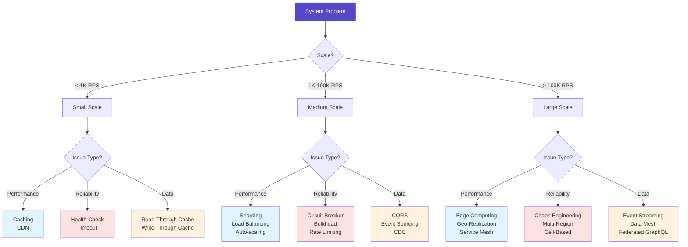
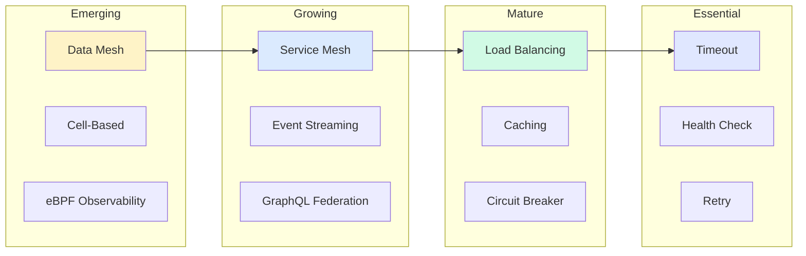
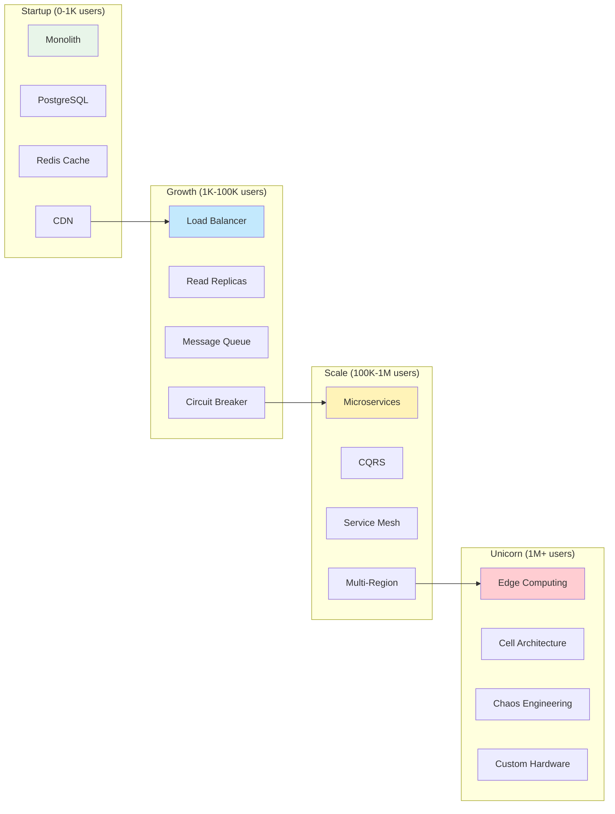
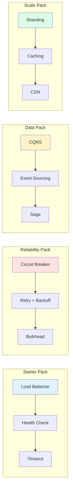
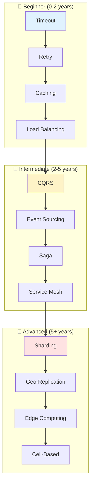

# Part III: Modern Architectural Patterns

[Home](/) > [Patterns](/patterns) > Overview

!!! abstract "The Pattern Library"
    **50+ Production-Ready Patterns** from companies operating at massive scale  
    Each pattern includes: Problem context, solution architecture, trade-offs, production code  
    **Success Rate**: 85%+ when correctly applied to matching problems

## Pattern Navigator

## 🚨 Pattern Emergency Room

!!! danger "System on Fire? Start Here!"

| Problem | Symptoms | Immediate Fix | Long-term Solution | Time to Relief |
|---------|----------|---------------|-------------------|----------------|
| **🔥 High Latency** | P99 > 1s, users complaining | Add Redis cache | CDN → Edge computing | 2 hours |
| **💥 Cascade Failures** | One service takes down 5 others | Deploy circuit breakers | Bulkhead isolation | 4 hours |
| **📈 Can't Scale** | CPU 100%, OOM errors | Vertical scaling | Sharding strategy | 1 day |
| **🔄 Data Conflicts** | Lost orders, wrong inventory | Add distributed locks | CQRS + Event Sourcing | 1 week |
| **🕸️ Complex Workflows** | Failed transactions, partial state | Add saga orchestrator | Event choreography | 2 weeks |
| **🕵️ Debugging Nightmare** | Can't trace errors | Add correlation IDs | Full observability stack | 3 days |

## Pattern ROI Calculator

| Pattern | Investment | Payback Period | 5-Year ROI | Real Example |
|---------|------------|----------------|------------|---------------|
| **Caching** | $10K (Redis cluster) | 2 months | 2,400% | Netflix: 90% cost reduction |
| **Circuit Breaker** | $5K (implementation) | 1 outage prevented | 5,000% | Amazon: $1M/hour downtime prevented |
| **CQRS** | $50K (refactoring) | 6 months | 800% | Uber: 10x read scaling |
| **Event Sourcing** | $100K (migration) | 1 year | 500% | PayPal: Complete audit trail |
| **Service Mesh** | $200K (Istio setup) | 8 months | 600% | Google: 50% ops reduction |
| **Sharding** | $150K (re-architecture) | 1 year | 1,000% | Discord: 100x growth enabled |

## Pattern Selection by Constraints

| If You Have... | Avoid These | Use These Instead | Why |
|----------------|-------------|-------------------|-----|
| < 3 engineers | Service Mesh, K8s | Monolith + CDN | Operational overhead |
| < $1K/month budget | Multi-region, Kafka | Single region + Redis | Cost efficiency |
| < 100 req/s | Microservices | Monolith | Premature optimization |
| Strict consistency | Eventual consistency patterns | 2PC, Distributed locks | Data integrity |
| < 1GB data | Sharding, NoSQL | PostgreSQL | Unnecessary complexity |

## Pattern Maturity & Adoption

## Pattern Stack by Growth Stage

### 🚀 Your Current Stage → Required Patterns

## Pattern Categories

- :material-city:{ .lg .middle } **Core Patterns**

 ---

 **Complexity**: Medium-High 
 **Prerequisites**: Basic distributed systems 
 **Start with**: Queues & Streaming 
 **ROI Timeline**: 2-4 weeks

- :material-shield-check:{ .lg .middle } **Resilience Patterns**

 ---

 **Complexity**: Low-Medium 
 **Prerequisites**: Production experience 
 **Start with**: Circuit Breaker 
 **ROI Timeline**: 1-2 weeks

- :material-database:{ .lg .middle } **Data Patterns**

 ---

 **Complexity**: High 
 **Prerequisites**: Database fundamentals 
 **Start with**: Caching Strategies 
 **ROI Timeline**: 3-6 weeks

- :material-handshake:{ .lg .middle } **Coordination Patterns**

 ---

 **Complexity**: High 
 **Prerequisites**: Consensus algorithms 
 **Start with**: Leader Election 
 **ROI Timeline**: 4-8 weeks

- :material-cog:{ .lg .middle } **Operational Patterns**

 ---

 **Complexity**: Medium 
 **Prerequisites**: DevOps basics 
 **Start with**: Observability 
 **ROI Timeline**: 2-3 weeks

### Pattern Catalog

| Pattern | Category | Problem Solved | When to Use | Complexity | Link |
|---------|----------|----------------|-------------|------------|------|
| **Queues & Streaming** | 🏗️ Core | Coupling, backpressure | Async processing, > 1K msg/s | 🟡 Medium | [📬](queues-streaming.md) |
| **CQRS** | 🏗️ Core | Read/write scaling | 10:1 read ratio | 🔴 High | [🔀](cqrs.md) |
| **Event-Driven** | 🏗️ Core | Service coupling | > 5 services | 🟡 Medium | [⚡](event-driven.md) |
| **Event Sourcing** | 🏗️ Core | Audit trail | Compliance required | 🔴 High | [📜](event-sourcing.md) |
| **Saga** | 🏗️ Core | Distributed transactions | Multi-service workflows | 🔴 High | [🎭](saga.md) |
| **Service Mesh** | 🏗️ Core | Service communication | > 20 services | 🔴 High | [🕸️](service-mesh.md) |
| **Serverless/FaaS** | 🏗️ Core | Variable load | Sporadic traffic | 🟡 Medium | [λ](serverless-faas.md) |
| **Circuit Breaker** | 🛡️ Resilience | Cascade failures | External dependencies | 🟢 Low | [⚡](circuit-breaker.md) |
| **Retry & Backoff** | 🛡️ Resilience | Transient failures | Network calls | 🟢 Low | [🔄](retry-backoff.md) |
| **Bulkhead** | 🛡️ Resilience | Resource isolation | Multi-tenant | 🟡 Medium | [🚪](bulkhead.md) |
| **Timeout** | 🛡️ Resilience | Hanging requests | Any RPC | 🟢 Low | [⏱️](timeout.md) |
| **Health Check** | 🛡️ Resilience | Dead services | All services | 🟢 Low | [💓](health-check.md) |
| **Rate Limiting** | 🛡️ Resilience | Overload | Public APIs | 🟡 Medium | [🚦](rate-limiting.md) |
| **CDC** | 💾 Data | Data sync | Real-time replication | 🔴 High | [🔄](cdc.md) |
| **Sharding** | 💾 Data | Data scale | > 1TB or > 10K TPS | 🔴 High | [🔪](sharding.md) |
| **Caching** | 💾 Data | Latency | Read-heavy load | 🟢 Low | [💾](caching-strategies.md) |
| **Request Batching** | 💾 Data | Overhead amortization | High frequency ops | 🟡 Medium | [📦](request-batching.md) |
| **Leader Election** | 🤝 Coordination | Single writer | Consensus needed | 🔴 High | [👑](leader-election.md) |
| **Distributed Lock** | 🤝 Coordination | Mutual exclusion | Critical sections | 🔴 High | [🔒](distributed-lock.md) |
| **State Watch** | 🤝 Coordination | Change notification | Real-time state updates | 🔴 High | [👁️](state-watch.md) |
| **Observability** | ⚙️ Operational | Visibility | Production systems | 🟡 Medium | [👁️](observability.md) |
| **Auto-scaling** | ⚙️ Operational | Variable load | Cloud deployments | 🟡 Medium | [📈](auto-scaling.md) |
| **Load Balancing** | ⚙️ Operational | Request distribution | > 1 server | 🟢 Low | [⚖️](load-balancing.md) |

### Pattern Combinations That Work

## 🏢 Real-World Pattern Impact

| Company | Pattern | Scale | Result | Key Metric |
|---------|---------|-------|--------|------------|
| **Netflix** | Circuit Breaker | 100B req/day | Prevented cascades | 99.99% uptime |
| **LinkedIn** | CQRS | 1B reads/day | 10x performance | < 50ms p99 |
| **Walmart** | Event Sourcing | 100M orders/day | Audit trail | 0 lost orders |
| **Lyft** | Service Mesh | 100M req/sec | Observability | < 1ms overhead |
| **Uber** | Geo-sharding | 20M rides/day | Regional scale | 5x capacity |
| **Stripe** | Idempotency | $640B/year | Payment safety | 100% accuracy |

## 📚 Learning Paths

## ⚠ Anti-Patterns to Avoid

| Anti-Pattern | Red Flag | Cost | Fix |
|--------------|-----------|------|-----|
| **Cargo Cult** | "Netflix does it" | 10x complexity | Start simple |
| **Premature Distribution** | < 100 req/s microservices | 20x overhead | Monolith first |
| **Consistency Theater** | Strong consistency for likes | 100x slower | Use eventual |
| **Resume-Driven** | K8s for 3 services | $10K/month | Right-size |
| **Infinite Scale** | No capacity plan | $100K surprise | Model growth |

## Pattern Success Metrics

| Pattern | Metric | 🟢 Good | 🟡 Great | 🔴 Elite |
|---------|--------|---------|----------|----------|
| **Circuit Breaker** | Cascades prevented/month | 10 | 100 | 1000+ |
| **Caching** | Hit ratio | 60% | 80% | 95%+ |
| **Load Balancing** | Distribution variance | < 20% | < 10% | < 5% |
| **Auto-scaling** | Response during spike | < 2x | < 1.5x | < 1.1x |
| **CQRS** | Read/write ratio | 10:1 | 100:1 | 1000:1 |

## Implementation Checklist

| Step | Question | Action | Common Mistake |
|------|----------|--------|----------------|
| 1️⃣ | Problem? | Write it down | Solution seeking problem |
| 2️⃣ | Scale? | Measure | Over-engineering |
| 3️⃣ | Team skills? | Assess honestly | Underestimating complexity |
| 4️⃣ | Total cost? | Include ops | Ignoring human cost |
| 5️⃣ | Rollback? | Test it | No escape route |

## 🔗 Navigation

### Pattern Resources
| Resource | Purpose | Time |
|----------|---------|------|
| [📊 Pattern Comparison](pattern-comparison.md) | Side-by-side analysis | 15 min |
| [🎮 Pattern Selector](pattern-selector.md) | Interactive finder | 5 min |
| [🔗 Pattern Combinations](pattern-combinations.md) | Synergies guide | 20 min |
| [🧠 Pattern Quiz](pattern-quiz.md) | Test your knowledge | 10 min |

### Patterns by Problem Domain
| Domain | Key Patterns | Start With |
|--------|--------------|------------|
| **🔴 Reliability** | Circuit Breaker, Bulkhead, Retry | [Circuit Breaker](circuit-breaker.md) |
| **⚡ Performance** | Caching, CDN, Edge Computing | [Caching](caching-strategies.md) |
| **📈 Scalability** | Sharding, Load Balancing, Auto-scaling | [Load Balancing](load-balancing.md) |
| **💾 Data** | CQRS, Event Sourcing, CDC | [CQRS](cqrs.md) |
| **🤝 Coordination** | Saga, Leader Election, Distributed Lock | [Saga](saga.md) |

### Case Studies
- [Netflix](case-studies/netflix-chaos) → Circuit Breaker, Chaos Engineering
- [Uber](case-studies/uber-location) → Edge Computing, Geo-sharding
- [Amazon](case-studies/amazon-dynamo) → Tunable Consistency, Sharding
- [PayPal](case-studies/paypal-payments) → Saga Pattern, Idempotency

## 📖 References

Key Papers & Resources:
- [CQRS Documents](https://cqrs.files.wordpress.com/2010/11/cqrs_documents.pdf) - Young, 2010
- [Event Sourcing](https://martinfowler.com/eaaDev/EventSourcing.html) - Fowler, 2005
- [Sagas](https://www.cs.cornell.edu/andru/cs711/2002fa/reading/sagas.pdf) - Garcia-Molina & Salem, 1987
- [Release It!](https://pragprog.com/titles/mnee2/release-it-second-edition/) - Nygard, 2007
- [Dynamo Paper](https://www.allthingsdistributed.com/files/amazon-dynamo-sosp2007.pdf) - DeCandia et al., 2007
- [Raft Consensus](https://raft.github.io/raft.pdf) - Ongaro & Ousterhout, 2014

---

*"The best pattern is often no pattern—until you need it."*

---

[:material-arrow-left: Part II - The 5 Pillars](/part2-pillars) | 
[:material-arrow-up: Home](/) | 
[:material-arrow-right: Pattern Comparison](/patterns/pattern-comparison)

