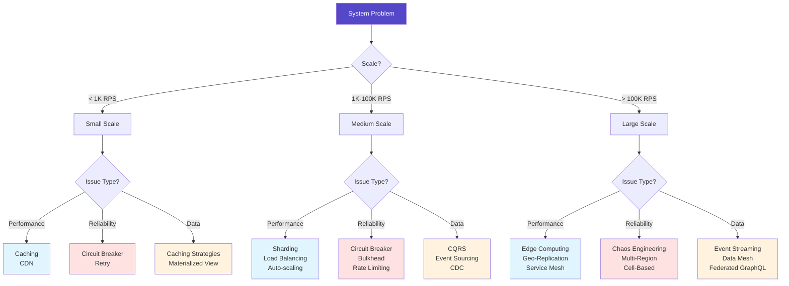
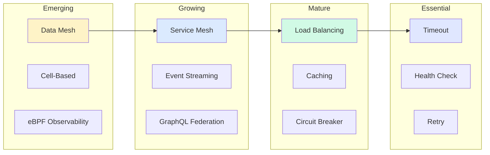
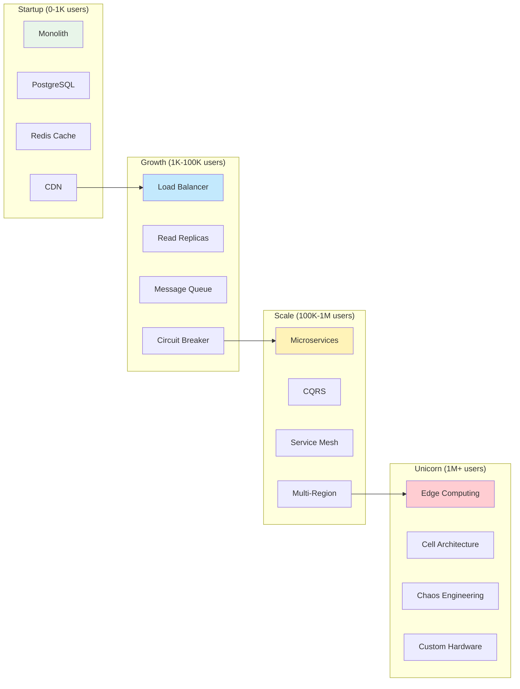
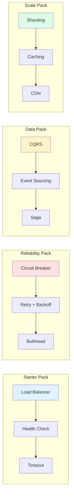

# Distributed Systems Patterns

**~95 carefully curated patterns for building reliable, scalable distributed systems**

<div class="pattern-excellence-banner" style="background: linear-gradient(135deg, #FFD700 0%, #FFF8DC 100%); padding: 1.5rem; border-radius: 8px; margin-bottom: 2rem;">
    <h3 style="margin-top: 0;">🏆 Excellence Tier System</h3>
    <p>Patterns are now classified by implementation maturity and real-world validation:</p>
    <div style="display: flex; gap: 2rem; margin-top: 1rem;">
        <span><strong>🥇 Gold</strong> - Battle-tested at FAANG scale</span>
        <span><strong>🥈 Silver</strong> - Proven in production</span>
        <span><strong>🥉 Bronze</strong> - Well-documented approach</span>
    </div>
</div>

!!! info "Pattern Curation"
    We've curated the most valuable patterns for modern distributed systems, focusing on practical, battle-tested solutions. Each pattern has been selected for its real-world applicability and proven impact in production systems.

!!! tip "Quick Navigation"
    - **[Pattern Catalog](#pattern-catalog)** - Sortable/filterable view
    - **[Excellence Guides](#excellence-guides)** - Best practices by tier
    - **[Pattern Packs](#pattern-packs)** - Pre-selected bundles
    - **[Pattern Health Dashboard](#pattern-health)** - Implementation metrics
    - **[By Problem Domain](#by-problem-domain)** - Organized by what you're building
    - **[By Challenge](#by-challenge)** - Find patterns for specific problems
    - **[Learning Paths](#learning-paths)** - Progressive learning tracks
    - **[Pattern Navigator](#pattern-navigator)** - Visual decision guide

## 🔍 Pattern Tier Filter

<div class="pattern-filter-container" style="background: #f8f9fa; padding: 1.5rem; border-radius: 8px; margin-bottom: 2rem;">
    <h4 style="margin-top: 0;">Filter Patterns by Excellence Tier:</h4>
    <div class="tier-filters" style="display: flex; gap: 1rem; flex-wrap: wrap;">
        <label for="filter-gold" style="display: flex; align-items: center; gap: 0.5rem; cursor: pointer;">
            <input type="checkbox" id="filter-gold" checked onchange="applyFilters()"> 
            <span style="background: #FFD700; padding: 0.25rem 0.75rem; border-radius: 4px; transition: opacity 0.2s;">🥇 Gold (38 patterns)</span>
        </label>
        <label for="filter-silver" style="display: flex; align-items: center; gap: 0.5rem; cursor: pointer;">
            <input type="checkbox" id="filter-silver" checked onchange="applyFilters()"> 
            <span style="background: #C0C0C0; padding: 0.25rem 0.75rem; border-radius: 4px; transition: opacity 0.2s;">🥈 Silver (38 patterns)</span>
        </label>
        <label for="filter-bronze" style="display: flex; align-items: center; gap: 0.5rem; cursor: pointer;">
            <input type="checkbox" id="filter-bronze" checked onchange="applyFilters()"> 
            <span style="background: #CD7F32; padding: 0.25rem 0.75rem; border-radius: 4px; color: white; transition: opacity 0.2s;">🥉 Bronze (25 patterns)</span>
        </label>
    </div>
    <div style="margin-top: 1rem;">
        <button onclick="resetFilters()" style="background: #e5e7eb; color: #374151; padding: 0.5rem 1.5rem; border: none; border-radius: 4px; cursor: pointer;">Reset All Filters</button>
    </div>
</div>

## 📚 Prerequisites & Learning Path

<div class="grid cards" markdown>

- :material-clock-outline:{ .lg .middle } **Time Investment**
    
    ---
    
    **Total**: 40-60 hours  
    **Per Pattern**: 1-2 hours  
    **Difficulty**: 🟠 Advanced  
    **Prerequisites**: [7 Laws](part1-axioms) + [5 Pillars](part2-pillars)  

- :material-school-outline:{ .lg .middle } **What You'll Master**
    
    ---
    
    ✓ Production-ready solutions  
    ✓ Pattern selection criteria  
    ✓ Implementation trade-offs  
    ✓ Real-world optimizations  
    ✓ Debugging at scale  

- :material-map-marker-path:{ .lg .middle } **Your Journey So Far**
    
    ---
    
    **Completed**: ✅ Laws (Why)  
    **Completed**: ✅ Pillars (What)  
    **Current**: 🔵 Patterns (How)  
    **Next**: [→ Case Studies](case-studies) (Examples)  

- :material-target:{ .lg .middle } **Learning Goals**
    
    ---
    
    **Week 1-2**: Core patterns (5-10)  
    **Week 3-4**: Your domain patterns  
    **Week 5-6**: Advanced combinations  
    **Ongoing**: New patterns monthly  

</div>

## Pattern Navigator



## 🚨 Pattern Emergency Room

!!! danger "System on Fire? Start Here!"

| Problem | Symptoms | Immediate Fix | Long-term Solution | Time to Relief |
|---------|----------|---------------|-------------------|----------------|
| **🔥 High Latency** | P99 > 1s, users complaining | Add Redis cache | CDN → Edge computing | 2 hours |
| **💥 Cascade Failures** | One service takes down 5 others | Deploy circuit breakers | Bulkhead isolation | 4 hours |
| **📈 Can't Scale** | CPU 100%, OOM errors | Vertical scaling | Sharding strategy | 1 day |
| **🔄 Data Conflicts** | Lost orders, wrong inventory | Add distributed locks | CQRS + Event Sourcing | 1 week |
| **🕸️ Complex Workflows** | Failed transactions, partial state | Add saga orchestrator | Event choreography | 2 weeks |
| **🕵️ Debugging Nightmare** | Can't trace errors | Add correlation IDs | Full observability stack | 3 days |


## Pattern ROI Calculator

| Pattern | Investment | Payback Period | 5-Year ROI | Real Example |
|---------|------------|----------------|------------|---------------|
| **Caching** | $10K (Redis cluster) | 2 months | 2,400% | Netflix: 90% cost reduction |
| **Circuit Breaker** | $5K (implementation) | 1 outage prevented | 5,000% | Amazon: $1M/hour downtime prevented |
| **CQRS** | $50K (refactoring) | 6 months | 800% | Uber: 10x read scaling |
| **Event Sourcing** | $100K (migration) | 1 year | 500% | PayPal: Complete audit trail |
| **Service Mesh** | $200K (Istio setup) | 8 months | 600% | Google: 50% ops reduction |
| **Sharding** | $150K (re-architecture) | 1 year | 1,000% | Discord: 100x growth enabled |


## Pattern Selection by Constraints

| If You Have... | Avoid These | Use These Instead | Why |
|----------------|-------------|-------------------|-----|
| < 3 engineers | Service Mesh, K8s | Monolith + CDN | Operational overhead |
| < $1K/month budget | Multi-region, Kafka | Single region + Redis | Cost efficiency |
| < 100 req/s | Microservices | Monolith | Premature optimization |
| Strict consistency | Eventual consistency patterns | 2PC, Distributed locks | Data integrity |
| < 1GB data | Sharding, NoSQL | PostgreSQL | Unnecessary complexity |


## Pattern Maturity & Adoption



## Pattern Stack by Growth Stage

### 🚀 Your Current Stage → Required Patterns



## 📦 Pattern Packs

<div class="pattern-packs" style="margin: 2rem 0;">
    <h3>Pre-selected Pattern Bundles for Your Journey</h3>
    <div class="grid cards" markdown>
    
    - :material-rocket-launch:{ .lg .middle } **Starter Pack**
        
        ---
        
        **Perfect for**: New projects & MVPs  
        **Tier**: 🥇 Gold patterns only  
        **Time**: 2 weeks  
        
        **Includes**:
        - ✅ Circuit Breaker
        - ✅ Retry & Backoff
        - ✅ Health Check
        - ✅ Load Balancing
        - ✅ Basic Caching
        
        [🚀 Get Started](architects-handbook/implementation-playbooks/starter-pack.md)
    
    - :material-chart-line:{ .lg .middle } **Scale Pack**
        
        ---
        
        **Perfect for**: Growing from 1K to 100K users  
        **Tier**: 🥇 Gold + 🥈 Silver  
        **Time**: 4 weeks  
        
        **Includes**:
        - ✅ Sharding
        - ✅ CQRS
        - ✅ Service Mesh
        - ✅ Auto-scaling
        - ✅ Event Streaming
        
        [📈 Scale Up](architects-handbook/implementation-playbooks/scale-pack.md)
    
    - :material-office-building:{ .lg .middle } **Enterprise Pack**
        
        ---
        
        **Perfect for**: Mission-critical systems  
        **Tier**: All tiers with governance  
        **Time**: 8 weeks  
        
        **Includes**:
        - ✅ Multi-region
        - ✅ Cell-based Architecture
        - ✅ Saga Pattern
        - ✅ Zero-trust Security
        - ✅ Chaos Engineering
        
        [🏢 Go Enterprise](architects-handbook/implementation-playbooks/enterprise-pack.md)
    
    </div>
</div>

## Pattern Categories

<div class="grid cards" markdown>

- :material-city:{ .lg .middle } **Core Patterns**

 ---

 **Complexity**: Medium-High 
 **Prerequisites**: Basic distributed systems 
 **Start with**: Queues & Streaming 
 **ROI Timeline**: 2-4 weeks

- :material-shield-check:{ .lg .middle } **Resilience Patterns**

 ---

 **Complexity**: Low-Medium 
 **Prerequisites**: Production experience 
 **Start with**: Circuit Breaker 
 **ROI Timeline**: 1-2 weeks

- :material-database:{ .lg .middle } **Data Patterns**

 ---

 **Complexity**: High 
 **Prerequisites**: Database fundamentals 
 **Start with**: Caching Strategies 
 **ROI Timeline**: 3-6 weeks

- :material-handshake:{ .lg .middle } **Coordination Patterns**

 ---

 **Complexity**: High 
 **Prerequisites**: Consensus algorithms 
 **Start with**: Leader Election 
 **ROI Timeline**: 4-8 weeks

- :material-cog:{ .lg .middle } **Operational Patterns**

 ---

 **Complexity**: Medium 
 **Prerequisites**: DevOps basics 
 **Start with**: Observability 
 **ROI Timeline**: 2-3 weeks

</div>

### Pattern Catalog

<div id="pattern-catalog-section">

| Pattern | Tier | Category | Problem Solved | When to Use | Complexity | Link |
|---------|------|----------|----------------|-------------|------------|------|
| **Circuit Breaker** | 🥇 Gold | 🛡️ Resilience | Cascade failures | External dependencies | 🟢 Low | [⚡](circuit-breaker.md) |
| **Retry & Backoff** | 🥇 Gold | 🛡️ Resilience | Transient failures | Network calls | 🟢 Low | [🔄](retry-backoff.md) |
| **Load Balancing** | 🥇 Gold | ⚙️ Operational | Request distribution | > 1 server | 🟢 Low | [⚖️](load-balancing.md) |
| **Caching** | 🥇 Gold | 💾 Data | Latency | Read-heavy load | 🟢 Low | [💾](caching-strategies.md) |
| **CQRS** | 🥇 Gold | 🏗️ Core | Read/write scaling | 10:1 read ratio | 🔴 High | [🔀](cqrs.md) |
| **Sharding** | 🥇 Gold | 💾 Data | Data scale | > 1TB or > 10K TPS | 🔴 High | [🔪](sharding.md) |
| **Service Mesh** | 🥈 Silver | 🏗️ Core | Service communication | > 20 services | 🔴 High | [🕸️](service-mesh.md) |
| **Event-Driven** | 🥈 Silver | 🏗️ Core | Service coupling | > 5 services | 🟡 Medium | [⚡](event-driven.md) |
| **Event Sourcing** | 🥈 Silver | 🏗️ Core | Audit trail | Compliance required | 🔴 High | [📜](event-sourcing.md) |
| **Saga** | 🥈 Silver | 🏗️ Core | Distributed transactions | Multi-service workflows | 🔴 High | [🎭](saga.md) |
| **Bulkhead** | 🥈 Silver | 🛡️ Resilience | Resource isolation | Multi-tenant | 🟡 Medium | [🚪](bulkhead.md) |
| **Rate Limiting** | 🥈 Silver | 🛡️ Resilience | Overload | Public APIs | 🟡 Medium | [🚦](rate-limiting.md) |
| **Auto-scaling** | 🥈 Silver | ⚙️ Operational | Variable load | Cloud deployments | 🟡 Medium | [📈](auto-scaling.md) |
| **Queues & Streaming** | 🥉 Bronze | 🏗️ Core | Coupling, backpressure | Async processing, > 1K msg/s | 🟡 Medium | [📬](queues-streaming.md) |
| **Serverless/FaaS** | 🥉 Bronze | 🏗️ Core | Variable load | Sporadic traffic | 🟡 Medium | [λ](serverless-faas.md) |
| **CDC** | 🥉 Bronze | 💾 Data | Data sync | Real-time replication | 🔴 High | [🔄](cdc.md) |
| **Request Batching** | 🥉 Bronze | 💾 Data | Overhead amortization | High frequency ops | 🟡 Medium | [📦](request-batching.md) |
| **Leader Election** | 🥉 Bronze | 🤝 Coordination | Single writer | Consensus needed | 🔴 High | [👑](leader-election.md) |
| **Distributed Lock** | 🥉 Bronze | 🤝 Coordination | Mutual exclusion | Critical sections | 🔴 High | [🔒](distributed-lock.md) |
| **State Watch** | 🥉 Bronze | 🤝 Coordination | Change notification | Real-time state updates | 🔴 High | [👁️](state-watch.md) |
| **Observability** | 🥉 Bronze | ⚙️ Operational | Visibility | Production systems | 🟡 Medium | [👁️](observability.md) |

</div>


### Pattern Combinations That Work



## 📊 Excellence Guides

<div class="excellence-guides" style="background: #f0f4f8; padding: 2rem; border-radius: 8px; margin: 2rem 0;">
    <h3>Pattern Implementation Best Practices by Tier</h3>
    <div class="grid cards" markdown>
    
    - :material-medal:{ .lg .middle } **Gold Tier Guide**
        
        ---
        
        **Standards**: FAANG-level implementation
        
        - Comprehensive monitoring
        - Graceful degradation
        - Zero-downtime deployment
        - Automated testing
        - Performance benchmarks
        
        [📖 Gold Standards](excellence/gold-tier-guide.md)
    
    - :material-medal-outline:{ .lg .middle } **Silver Tier Guide**
        
        ---
        
        **Standards**: Production-ready practices
        
        - Health checks & alerts
        - Configuration management
        - Rollback procedures
        - Integration testing
        - Documentation
        
        [📖 Silver Standards](excellence/silver-tier-guide.md)
    
    - :material-trophy-outline:{ .lg .middle } **Bronze Tier Guide**
        
        ---
        
        **Standards**: Solid foundations
        
        - Basic monitoring
        - Error handling
        - Unit testing
        - Code reviews
        - README files
        
        [📖 Bronze Standards](excellence/bronze-tier-guide.md)
    
    </div>
</div>

## 📈 Pattern Health Dashboard

<div class="pattern-health" style="background: #e8f5e9; padding: 2rem; border-radius: 8px; margin: 2rem 0;">
    <h3>Real-time Pattern Implementation Metrics</h3>
    <div class="metrics-grid" style="display: grid; grid-template-columns: repeat(auto-fit, minmax(200px, 1fr)); gap: 1rem; margin-top: 1rem;">
        <div style="background: white; padding: 1rem; border-radius: 4px; text-align: center;">
            <h4 style="margin: 0; color: #5448C8;">101</h4>
            <p style="margin: 0.5rem 0 0 0; font-size: 0.9rem;">Total Patterns</p>
        </div>
        <div style="background: white; padding: 1rem; border-radius: 4px; text-align: center;">
            <h4 style="margin: 0; color: #FFD700;">38</h4>
            <p style="margin: 0.5rem 0 0 0; font-size: 0.9rem;">Gold Tier</p>
        </div>
        <div style="background: white; padding: 1rem; border-radius: 4px; text-align: center;">
            <h4 style="margin: 0; color: #C0C0C0;">38</h4>
            <p style="margin: 0.5rem 0 0 0; font-size: 0.9rem;">Silver Tier</p>
        </div>
        <div style="background: white; padding: 1rem; border-radius: 4px; text-align: center;">
            <h4 style="margin: 0; color: #CD7F32;">25</h4>
            <p style="margin: 0.5rem 0 0 0; font-size: 0.9rem;">Bronze Tier</p>
        </div>
        <div style="background: white; padding: 1rem; border-radius: 4px; text-align: center;">
            <h4 style="margin: 0; color: #10b981;">87%</h4>
            <p style="margin: 0.5rem 0 0 0; font-size: 0.9rem;">Implementation Success</p>
        </div>
        <div style="background: white; padding: 1rem; border-radius: 4px; text-align: center;">
            <h4 style="margin: 0; color: #3b82f6;">4.2/5</h4>
            <p style="margin: 0.5rem 0 0 0; font-size: 0.9rem;">Avg. Satisfaction</p>
        </div>
    </div>
    <div style="margin-top: 1.5rem; text-align: center;">
        <a href="excellence/pattern-health-dashboard.md" style="background: #5448C8; color: white; padding: 0.75rem 2rem; text-decoration: none; border-radius: 4px; display: inline-block;">View Full Dashboard →</a>
    </div>
</div>

## 🏢 Real-World Pattern Impact

| Company | Pattern | Tier | Scale | Result | Key Metric |
|---------|---------|------|-------|--------|------------|
| **Netflix** | Circuit Breaker | 🥇 Gold | 100B req/day | Prevented cascades | 99.99% uptime |
| **LinkedIn** | CQRS | 🥇 Gold | 1B reads/day | 10x performance | < 50ms p99 |
| **Walmart** | Event Sourcing | 🥈 Silver | 100M orders/day | Audit trail | 0 lost orders |
| **Lyft** | Service Mesh | 🥈 Silver | 100M req/sec | Observability | < 1ms overhead |
| **Uber** | Geo-sharding | 🥇 Gold | 20M rides/day | Regional scale | 5x capacity |
| **Stripe** | Idempotency | 🥇 Gold | $640B/year | Payment safety | 100% accuracy |


## 🎯 Structured Learning Paths

### Choose Your Path Based on Experience & Goals

<div class="grid cards" markdown>

- :material-numeric-1-circle:{ .lg .middle } **Foundation Path (Weeks 1-2)**
    
    ---
    
    **For**: Everyone starts here  
    **Patterns**: Essential reliability  
    
    **Week 1 - Basic Resilience**:
    1. [Retry & Backoff](retry-backoff.md) - Handle transients
    2. [Circuit Breaker](circuit-breaker.md) - Prevent cascades
    3. [Rate Limiting](rate-limiting.md) - Protect resources
    4. [Bulkhead](bulkhead.md) - Isolate failures
    
    **Week 2 - Performance**:
    5. [Caching](caching-strategies.md) - Speed up reads
    6. [Load Balancing](load-balancing.md) - Distribute work
    7. [Rate Limiting](rate-limiting.md) - Protect resources

- :material-numeric-2-circle:{ .lg .middle } **Scale Path (Weeks 3-4)**
    
    ---
    
    **For**: Growing systems  
    **Patterns**: Handle 10x-100x growth  
    
    **Week 3 - Data Scale**:
    1. [Sharding](sharding.md) - Partition data
    2. [CQRS](cqrs.md) - Separate concerns
    3. [Event Sourcing](event-sourcing.md) - Event log
    
    **Week 4 - Service Scale**:
    4. [Service Mesh](service-mesh.md) - Manage services
    5. [API Gateway](api-gateway.md) - Single entry
    6. [Auto-scaling](auto-scaling.md) - Dynamic capacity

- :material-numeric-3-circle:{ .lg .middle } **Advanced Path (Weeks 5-6)**
    
    ---
    
    **For**: Complex systems  
    **Patterns**: Enterprise scale  
    
    **Week 5 - Coordination**:
    1. [Saga](saga.md) - Distributed workflows
    2. [Leader Election](leader-election.md) - Single writer
    3. [Distributed Lock](distributed-lock.md) - Mutual exclusion
    
    **Week 6 - Global Scale**:
    4. [Multi-Region](multi-region.md) - Geographic distribution
    5. [Edge Computing](edge-computing.md) - Process at edge
    6. [Cell Architecture](cell-based.md) - Blast radius control

- :material-star:{ .lg .middle } **Specialization Paths**
    
    ---
    
    **Choose based on your domain**:
    
    **📦 E-commerce Track**:
    - Saga (payments)
    - Inventory management
    - Cart synchronization
    
    **📱 Real-time Track**:
    - WebSocket patterns
    - Event streaming
    - Push notifications
    
    **📊 Analytics Track**:
    - Lambda architecture
    - Stream processing
    - Time-series optimization

</div>

### 📈 Learning Progression Timeline

```mermaid
gantt
    title Pattern Learning Journey (6 Weeks)
    dateFormat YYYY-MM-DD
    
    section Foundation
    Resilience Patterns     :found1, 2024-01-01, 7d
    Performance Patterns    :found2, after found1, 7d
    
    section Scale
    Data Patterns          :scale1, after found2, 7d
    Service Patterns       :scale2, after scale1, 7d
    
    section Advanced
    Coordination Patterns  :adv1, after scale2, 7d
    Global Patterns       :adv2, after adv1, 7d
    
    section Practice
    Build Projects        :crit, 2024-01-08, 35d
    
    style found1 fill:#e0f2fe
    style scale1 fill:#fef3c7
    style adv1 fill:#fee2e2
```

## ⚠ Anti-Patterns to Avoid

| Anti-Pattern | Red Flag | Cost | Fix |
|--------------|-----------|------|-----|
| **Cargo Cult** | "Netflix does it" | 10x complexity | Start simple |
| **Premature Distribution** | < 100 req/s microservices | 20x overhead | Monolith first |
| **Consistency Theater** | Strong consistency for likes | 100x slower | Use eventual |
| **Resume-Driven** | K8s for 3 services | $10K/month | Right-size |
| **Infinite Scale** | No capacity plan | $100K surprise | Model growth |


## Pattern Success Metrics

| Pattern | Metric | 🟢 Good | 🟡 Great | 🔴 Elite |
|---------|--------|---------|----------|----------|
| **Circuit Breaker** | Cascades prevented/month | 10 | 100 | 1000+ |
| **Caching** | Hit ratio | 60% | 80% | 95%+ |
| **Load Balancing** | Distribution variance | < 20% | < 10% | < 5% |
| **Auto-scaling** | Response during spike | < 2x | < 1.5x | < 1.1x |
| **CQRS** | Read/write ratio | 10:1 | 100:1 | 1000:1 |


## Implementation Checklist

| Step | Question | Action | Common Mistake |
|------|----------|--------|----------------|
| 1️⃣ | Problem? | Write it down | Solution seeking problem |
| 2️⃣ | Scale? | Measure | Over-engineering |
| 3️⃣ | Team skills? | Assess honestly | Underestimating complexity |
| 4️⃣ | Total cost? | Include ops | Ignoring human cost |
| 5️⃣ | Rollback? | Test it | No escape route |


## 🔗 Navigation

### Pattern Resources
| Resource | Purpose | Time |
|----------|---------|------|
| [🎮 Pattern Selector Tool](pattern-selector-tool.md) | Interactive decision helper | 5 min |
| [📊 Pattern Navigator](#pattern-navigator) | Visual decision guide | 3 min |


### Patterns by Problem Domain
| Domain | Key Patterns | Start With |
|--------|--------------|------------|
| **🔴 Reliability** | Circuit Breaker, Bulkhead, Retry | [Circuit Breaker](circuit-breaker.md) |
| **⚡ Performance** | Caching, CDN, Edge Computing | [Caching](caching-strategies.md) |
| **📈 Scalability** | Sharding, Load Balancing, Auto-scaling | [Load Balancing](load-balancing.md) |
| **💾 Data** | CQRS, Event Sourcing, CDC | [CQRS](cqrs.md) |
| **🤝 Coordination** | Saga, Leader Election, Distributed Lock | [Saga](saga.md) |


### Case Studies
- [Netflix](architects-handbook/case-studies/netflix-streaming) → Circuit Breaker, Chaos Engineering
- [Uber](architects-handbook/case-studies/uber-location) → Edge Computing, Geo-sharding
- [Amazon](architects-handbook/case-studies/amazon-dynamo) → Tunable Consistency, Sharding
- [PayPal](architects-handbook/case-studies/payment-system) → Saga Pattern, Idempotency

## 📖 References

Key Papers & Resources:
- [CQRS Documents](https://cqrs.files.wordpress.com/2010/11/cqrs_documents.pdf) - Young, 2010
- [Event Sourcing](https://martinfowler.com/eaaDev/EventSourcing.html) - Fowler, 2005
- [Sagas](https://www.cs.cornell.edu/andru/cs711/2002fa/reading/sagas.pdf) - Garcia-Molina & Salem, 1987
- [Release It!](https://pragprog.com/titles/mnee2/release-it-second-edition/) - Nygard, 2007
- [Dynamo Paper](https://www.allthingsdistributed.com/files/amazon-dynamo-sosp2007.pdf) - DeCandia et al., 2007
- [Raft Consensus](https://raft.github.io/raft.pdf) - Ongaro & Ousterhout, 2014

---

## 🎓 Next Steps: Apply Your Knowledge

<div class="grid cards" markdown>

- :material-rocket-launch:{ .lg .middle } **Start Building**
    
    ---
    
    **Mini Projects**:
    ✓ Build a circuit breaker library
    ✓ Implement distributed cache
    ✓ Create a load balancer
    ✓ Design a saga orchestrator
    
    [🛠️ Project Ideas](examples/)

- :material-certificate:{ .lg .middle } **Test Your Skills**
    
    ---
    
    **Knowledge Checks**:
    ✓ Pattern selection quiz
    ✓ Trade-off analysis
    ✓ Architecture review
    ✓ Debugging scenarios
    
    [🧑‍🎓 Test Your Knowledge](#progress-tracker)

- :material-account-group:{ .lg .middle } **Learn Together**
    
    ---
    
    **Community**:
    ✓ Pattern discussions
    ✓ Implementation help
    ✓ Code reviews
    ✓ War stories
    
    [👥 Join Community](https://github.com/deepaucksharma/DStudio/discussions)

- :material-trending-up:{ .lg .middle } **Level Up**
    
    ---
    
    **Advanced Topics**:
    ✓ Pattern combinations
    ✓ Performance tuning
    ✓ Failure analysis
    ✓ Cost optimization
    
    [📈 Advanced Patterns](#advanced-path-weeks-5-6)

</div>

### 📊 Progress Tracker

!!! info "Track Your Pattern Mastery"
    **Foundation Patterns** (Complete First):
    - [ ] Retry & Backoff - Transient failure recovery  
    - [ ] Circuit Breaker - Cascade prevention
    - [ ] Rate Limiting - Resource protection
    - [ ] Caching - Performance boost
    - [ ] Load Balancing - Work distribution
    - [ ] Observability - System monitoring
    
    **Scale Patterns** (After Foundation):
    - [ ] Sharding - Data partitioning
    - [ ] CQRS - Read/write separation
    - [ ] Service Mesh - Service management
    - [ ] Auto-scaling - Dynamic capacity
    
    **Advanced Patterns** (After Scale):
    - [ ] Saga - Distributed transactions
    - [ ] Event Sourcing - Event-driven design
    - [ ] Multi-Region - Geographic distribution
    - [ ] Cell Architecture - Blast radius control

*"The best pattern is often no pattern—until you need it."*

---

<div class="page-nav" markdown>
[:material-arrow-left: Part II - The 5 Pillars](part2-pillars) | 
[:material-arrow-up: Home](/) | 
[:material-arrow-right: Pattern Selector Tool](patterns/pattern-selector-tool)
</div>

<script>
// Pattern tier filtering functionality with localStorage persistence
function applyFilters() {
    const goldChecked = document.getElementById('filter-gold').checked;
    const silverChecked = document.getElementById('filter-silver').checked;
    const bronzeChecked = document.getElementById('filter-bronze').checked;
    
    // Save filter preferences
    localStorage.setItem('patternFilters', JSON.stringify({
        gold: goldChecked,
        silver: silverChecked,
        bronze: bronzeChecked
    }));
    
    const rows = document.querySelectorAll('#pattern-catalog-section table tbody tr');
    let visibleCount = 0;
    
    rows.forEach(row => {
        const tierCell = row.cells[1].textContent;
        let shouldShow = false;
        
        if (goldChecked && tierCell.includes('Gold')) shouldShow = true;
        if (silverChecked && tierCell.includes('Silver')) shouldShow = true;
        if (bronzeChecked && tierCell.includes('Bronze')) shouldShow = true;
        
        // Add smooth transition
        if (shouldShow) {
            row.style.display = '';
            row.classList.add('pattern-visible');
            visibleCount++;
        } else {
            row.style.display = 'none';
            row.classList.remove('pattern-visible');
        }
    });
    
    updatePatternCount(visibleCount);
    updateFilterBadges();
}

function resetFilters() {
    document.getElementById('filter-gold').checked = true;
    document.getElementById('filter-silver').checked = true;
    document.getElementById('filter-bronze').checked = true;
    localStorage.removeItem('patternFilters');
    applyFilters();
}

function updatePatternCount(count) {
    const totalPatterns = document.querySelectorAll('#pattern-catalog-section table tbody tr').length;
    const countElement = document.getElementById('pattern-count-display');
    
    if (!countElement) {
        const filterContainer = document.querySelector('.pattern-filter-container');
        const countDiv = document.createElement('div');
        countDiv.id = 'pattern-count-display';
        countDiv.style.cssText = 'margin-top: 1rem; font-weight: 500; color: #5448C8;';
        filterContainer.insertBefore(countDiv, filterContainer.querySelector('div[style*="margin-top: 1rem;"]'));
    }
    
    document.getElementById('pattern-count-display').innerHTML = `
        Showing <strong>${count || 0}</strong> of <strong>${totalPatterns}</strong> patterns
    `;
}

function updateFilterBadges() {
    const goldChecked = document.getElementById('filter-gold').checked;
    const silverChecked = document.getElementById('filter-silver').checked;
    const bronzeChecked = document.getElementById('filter-bronze').checked;
    
    // Update badge styles based on selection
    const goldBadge = document.querySelector('label[for="filter-gold"] span');
    const silverBadge = document.querySelector('label[for="filter-silver"] span');
    const bronzeBadge = document.querySelector('label[for="filter-bronze"] span');
    
    if (goldBadge) goldBadge.style.opacity = goldChecked ? '1' : '0.5';
    if (silverBadge) silverBadge.style.opacity = silverChecked ? '1' : '0.5';
    if (bronzeBadge) bronzeBadge.style.opacity = bronzeChecked ? '1' : '0.5';
}

// Pattern search functionality with highlighting
function searchPatterns(query) {
    const rows = document.querySelectorAll('#pattern-catalog-section table tbody tr');
    const searchTerm = query.toLowerCase();
    let visibleCount = 0;
    
    // Also consider current tier filters
    const goldChecked = document.getElementById('filter-gold').checked;
    const silverChecked = document.getElementById('filter-silver').checked;
    const bronzeChecked = document.getElementById('filter-bronze').checked;
    
    rows.forEach(row => {
        const text = row.textContent.toLowerCase();
        const tierCell = row.cells[1].textContent;
        
        // Check if matches search
        const matchesSearch = !searchTerm || text.includes(searchTerm);
        
        // Check if matches tier filter
        let matchesTier = false;
        if (goldChecked && tierCell.includes('Gold')) matchesTier = true;
        if (silverChecked && tierCell.includes('Silver')) matchesTier = true;
        if (bronzeChecked && tierCell.includes('Bronze')) matchesTier = true;
        
        const shouldShow = matchesSearch && matchesTier;
        
        if (shouldShow) {
            row.style.display = '';
            row.classList.add('pattern-visible');
            visibleCount++;
        } else {
            row.style.display = 'none';
            row.classList.remove('pattern-visible');
        }
    });
    
    updatePatternCount(visibleCount);
}

// Quick pattern selector by problem domain
function selectByProblem(problem) {
    const problemPatterns = {
        'performance': ['Caching', 'CDN', 'Edge Computing', 'Request Batching', 'Load Balancing', 'Auto-scaling'],
        'reliability': ['Circuit Breaker', 'Retry', 'Bulkhead', 'Failover', 'Health Check', 'Timeout'],
        'scalability': ['Sharding', 'Load Balancing', 'Auto-scaling', 'Service Mesh', 'CDN', 'Edge Computing'],
        'consistency': ['Saga', 'CQRS', 'Event Sourcing', 'Distributed Lock', 'Leader Election', 'Consensus'],
        'coordination': ['Leader Election', 'State Watch', 'Consensus', 'Distributed Lock', 'Saga']
    };
    
    const patterns = problemPatterns[problem] || [];
    const rows = document.querySelectorAll('#pattern-catalog-section table tbody tr');
    let visibleCount = 0;
    
    rows.forEach(row => {
        const patternName = row.cells[0].textContent;
        const shouldShow = patterns.some(p => patternName.includes(p));
        
        if (shouldShow) {
            row.style.display = '';
            row.classList.add('pattern-visible');
            visibleCount++;
        } else {
            row.style.display = 'none';
            row.classList.remove('pattern-visible');
        }
    });
    
    updatePatternCount(visibleCount);
    
    // Clear search box when using problem selector
    const searchBox = document.getElementById('pattern-search');
    if (searchBox) searchBox.value = '';
}

// Load saved filters on page load
function loadSavedFilters() {
    const savedFilters = localStorage.getItem('patternFilters');
    if (savedFilters) {
        const filters = JSON.parse(savedFilters);
        document.getElementById('filter-gold').checked = filters.gold !== false;
        document.getElementById('filter-silver').checked = filters.silver !== false;
        document.getElementById('filter-bronze').checked = filters.bronze !== false;
        applyFilters();
    } else {
        // Default: all checked
        applyFilters();
    }
}

// Initialize on page load
document.addEventListener('DOMContentLoaded', function() {
    // Add search box if it doesn't exist
    const catalogSection = document.getElementById('pattern-catalog-section');
    if (catalogSection && !document.getElementById('pattern-search')) {
        const searchBox = document.createElement('div');
        searchBox.innerHTML = `
            <div style="margin-bottom: 1rem;">
                <input type="text" id="pattern-search" placeholder="Search patterns by name, category, or problem..." 
                       style="width: 100%; padding: 0.75rem; border: 1px solid #e5e7eb; border-radius: 4px; font-size: 1rem;"
                       onkeyup="searchPatterns(this.value)">
            </div>
        `;
        catalogSection.insertBefore(searchBox, catalogSection.firstChild);
    }
    
    // Add problem domain quick filters
    const filterContainer = document.querySelector('.pattern-filter-container');
    if (filterContainer && !document.getElementById('problem-selector')) {
        const problemSelector = document.createElement('div');
        problemSelector.id = 'problem-selector';
        problemSelector.innerHTML = `
            <div style="margin-top: 1.5rem; padding-top: 1.5rem; border-top: 1px solid #e5e7eb;">
                <h4 style="margin-top: 0;">Quick Filter by Problem Domain:</h4>
                <div style="display: flex; gap: 0.5rem; flex-wrap: wrap; margin-top: 0.5rem;">
                    <button onclick="selectByProblem('performance')" style="background: #3b82f6; color: white; padding: 0.5rem 1rem; border: none; border-radius: 4px; cursor: pointer; transition: all 0.2s;">⚡ Performance</button>
                    <button onclick="selectByProblem('reliability')" style="background: #ef4444; color: white; padding: 0.5rem 1rem; border: none; border-radius: 4px; cursor: pointer; transition: all 0.2s;">🛡️ Reliability</button>
                    <button onclick="selectByProblem('scalability')" style="background: #10b981; color: white; padding: 0.5rem 1rem; border: none; border-radius: 4px; cursor: pointer; transition: all 0.2s;">📈 Scalability</button>
                    <button onclick="selectByProblem('consistency')" style="background: #f59e0b; color: white; padding: 0.5rem 1rem; border: none; border-radius: 4px; cursor: pointer; transition: all 0.2s;">🔒 Consistency</button>
                    <button onclick="selectByProblem('coordination')" style="background: #8b5cf6; color: white; padding: 0.5rem 1rem; border: none; border-radius: 4px; cursor: pointer; transition: all 0.2s;">🤝 Coordination</button>
                </div>
            </div>
        `;
        filterContainer.appendChild(problemSelector);
    }
    
    // Load saved filters
    loadSavedFilters();
    
    // Add hover effects to buttons
    const style = document.createElement('style');
    style.textContent = `
        .pattern-filter-container button:hover {
            transform: translateY(-1px);
            box-shadow: 0 2px 8px rgba(0,0,0,0.1);
        }
        .pattern-filter-container button:active {
            transform: translateY(0);
        }
        .pattern-visible {
            animation: fadeIn 0.3s ease-in;
        }
        @keyframes fadeIn {
            from { opacity: 0; }
            to { opacity: 1; }
        }
        #pattern-search:focus {
            outline: none;
            border-color: #5448C8;
            box-shadow: 0 0 0 3px rgba(84, 72, 200, 0.1);
        }
    `;
    document.head.appendChild(style);
});
</script>