# Part III: Modern Architectural Patterns

## 🎯 Pattern Navigator

## 📊 Pattern Decision Matrix

| Problem | Symptoms | Pattern Solution | Complexity | Cost Impact | Time to Implement |
|---------|----------|------------------|------------|-------------|-------------------|
| **High Latency** | p99 > 100ms | → Caching → CDN → Edge | Low → High | $$ → $$$$ | Days → Months |
| **System Crashes** | Cascade failures | → Circuit Breaker → Bulkhead | Medium | $ | Days → Weeks |
| **Can't Scale** | CPU/Memory limits | → Load Balancing → Auto-scaling → Sharding | Medium → High | $$ → $$$ | Weeks → Months |
| **Data Conflicts** | Lost updates, inconsistency | → CQRS → Event Sourcing | High | $$ | Months |
| **Complex Workflows** | Distributed transactions | → Saga → Choreography | High | $ | Weeks → Months |
| **No Visibility** | Can't debug production | → Observability → Service Mesh | Medium → High | $$ → $$$ | Weeks → Months |

## 🏆 Pattern Effectiveness Matrix

| Pattern | Problem Solved | Success Rate | Overhead | Team Size | Learning Curve |
|---------|---------------|--------------|----------|-----------|----------------|
| **Caching** | Latency | 90% | Low | 1-2 | 🟢 Easy |
| **Circuit Breaker** | Cascades | 95% | Low | 2-3 | 🟡 Medium |
| **CQRS** | Read/Write Scale | 85% | Medium | 3-5 | 🟡 Medium |
| **Event Sourcing** | Audit Trail | 95% | High | 4-6 | 🔴 Hard |
| **Service Mesh** | Observability | 90% | High | 5-10 | 🔴 Hard |
| **Sharding** | Data Scale | 80% | High | 4-8 | 🔴 Hard |

## 🔍 Pattern Selection by Constraints

| If You Have... | Avoid These | Use These Instead | Why |
|----------------|-------------|-------------------|-----|
| < 3 engineers | Service Mesh, K8s | Monolith + CDN | Operational overhead |
| < $1K/month budget | Multi-region, Kafka | Single region + Redis | Cost efficiency |
| < 100 req/s | Microservices | Monolith | Premature optimization |
| Strict consistency | Eventual consistency patterns | 2PC, Distributed locks | Data integrity |
| < 1GB data | Sharding, NoSQL | PostgreSQL | Unnecessary complexity |

## 📈 Pattern Maturity & Adoption

## 🎯 Quick Pattern Finder

| Your Situation | Recommended Pattern Stack | Expected Results |
|----------------|--------------------------|------------------|
| **Startup MVP** | Monolith + Cache + CDN | 50ms latency, 99.9% uptime |
| **Growing B2B SaaS** | + Load Balancer + Read Replicas + Queue | 10K concurrent users |
| **Scale-up Phase** | + CQRS + Circuit Breaker + Auto-scaling | 100K concurrent users |
| **Enterprise Scale** | + Service Mesh + Multi-region + Event Sourcing | 1M+ concurrent users |
| **Unicorn Scale** | + Edge Computing + Cell-Based + Chaos Engineering | 100M+ concurrent users |

## 🗂️ Pattern Categories

### Pattern Complexity & Prerequisites

| Category | Complexity | Prerequisites | First Pattern | ROI Timeline |
|----------|------------|---------------|---------------|--------------|
| **🏗️ Core** | 🟡-🔴 Medium-High | Basic distributed systems | Queues & Streaming | 2-4 weeks |
| **🛡️ Resilience** | 🟢-🟡 Low-Medium | Production experience | Circuit Breaker | 1-2 weeks |
| **💾 Data** | 🔴 High | Database fundamentals | Caching Strategies | 3-6 weeks |
| **🤝 Coordination** | 🔴 High | Consensus algorithms | Leader Election | 4-8 weeks |
| **⚙️ Operational** | 🟡 Medium | DevOps basics | Observability | 2-3 weeks |

### 📊 Pattern Catalog

| Pattern | Category | Problem Solved | When to Use | Complexity | Link |
|---------|----------|----------------|-------------|------------|------|
| **Queues & Streaming** | 🏗️ Core | Coupling, backpressure | Async processing, > 1K msg/s | 🟡 Medium | [📬](queues-streaming.md) |
| **CQRS** | 🏗️ Core | Read/write scaling | 10:1 read ratio | 🔴 High | [🔀](cqrs.md) |
| **Event-Driven** | 🏗️ Core | Service coupling | > 5 services | 🟡 Medium | [⚡](event-driven.md) |
| **Event Sourcing** | 🏗️ Core | Audit trail | Compliance required | 🔴 High | [📜](event-sourcing.md) |
| **Saga** | 🏗️ Core | Distributed transactions | Multi-service workflows | 🔴 High | [🎭](saga.md) |
| **Service Mesh** | 🏗️ Core | Service communication | > 20 services | 🔴 High | [🕸️](service-mesh.md) |
| **Serverless/FaaS** | 🏗️ Core | Variable load | Sporadic traffic | 🟡 Medium | [λ](serverless-faas.md) |
| **Circuit Breaker** | 🛡️ Resilience | Cascade failures | External dependencies | 🟢 Low | [⚡](circuit-breaker.md) |
| **Retry & Backoff** | 🛡️ Resilience | Transient failures | Network calls | 🟢 Low | [🔄](retry-backoff.md) |
| **Bulkhead** | 🛡️ Resilience | Resource isolation | Multi-tenant | 🟡 Medium | [🚪](bulkhead.md) |
| **Timeout** | 🛡️ Resilience | Hanging requests | Any RPC | 🟢 Low | [⏱️](timeout.md) |
| **Health Check** | 🛡️ Resilience | Dead services | All services | 🟢 Low | [💓](health-check.md) |
| **Rate Limiting** | 🛡️ Resilience | Overload | Public APIs | 🟡 Medium | [🚦](rate-limiting.md) |
| **CDC** | 💾 Data | Data sync | Real-time replication | 🔴 High | [🔄](cdc.md) |
| **Sharding** | 💾 Data | Data scale | > 1TB or > 10K TPS | 🔴 High | [🔪](sharding.md) |
| **Caching** | 💾 Data | Latency | Read-heavy load | 🟢 Low | [💾](caching-strategies.md) |
| **Leader Election** | 🤝 Coordination | Single writer | Consensus needed | 🔴 High | [👑](leader-election.md) |
| **Distributed Lock** | 🤝 Coordination | Mutual exclusion | Critical sections | 🔴 High | [🔒](distributed-lock.md) |
| **Observability** | ⚙️ Operational | Visibility | Production systems | 🟡 Medium | [👁️](observability.md) |
| **Auto-scaling** | ⚙️ Operational | Variable load | Cloud deployments | 🟡 Medium | [📈](auto-scaling.md) |
| **Load Balancing** | ⚙️ Operational | Request distribution | > 1 server | 🟢 Low | [⚖️](load-balancing.md) |

### 🎯 Pattern Combinations That Work

## 🏢 Real-World Pattern Impact

| Company | Pattern | Scale | Result | Key Metric |
|---------|---------|-------|--------|------------|
| **Netflix** | Circuit Breaker | 100B req/day | Prevented cascades | 99.99% uptime |
| **LinkedIn** | CQRS | 1B reads/day | 10x performance | < 50ms p99 |
| **Walmart** | Event Sourcing | 100M orders/day | Audit trail | 0 lost orders |
| **Lyft** | Service Mesh | 100M req/sec | Observability | < 1ms overhead |
| **Uber** | Geo-sharding | 20M rides/day | Regional scale | 5x capacity |
| **Stripe** | Idempotency | $640B/year | Payment safety | 100% accuracy |

## 📚 Learning Paths

```mermaid
graph TD
    subgraph "🌱 Beginner (0-2 years)"
        B1[Timeout] --> B2[Retry]
        B2 --> B3[Caching]
        B3 --> B4[Load Balancing]
    end
    
    subgraph "🌳 Intermediate (2-5 years)"
        I1[CQRS] --> I2[Event Sourcing]
        I2 --> I3[Saga]
        I3 --> I4[Service Mesh]
    end
    
    subgraph "🌲 Advanced (5+ years)"
        A1[Sharding] --> A2[Geo-Replication]
        A2 --> A3[Edge Computing]
        A3 --> A4[Cell-Based]
    end
    
    B4 --> I1
    I4 --> A1
    
    style B1 fill:#e0f2fe
    style I1 fill:#fef3c7
    style A1 fill:#fee2e2
```

## ⚠️ Anti-Patterns to Avoid

| Anti-Pattern | Red Flag | Cost | Fix |
|--------------|-----------|------|-----|
| **Cargo Cult** | "Netflix does it" | 10x complexity | Start simple |
| **Premature Distribution** | < 100 req/s microservices | 20x overhead | Monolith first |
| **Consistency Theater** | Strong consistency for likes | 100x slower | Use eventual |
| **Resume-Driven** | K8s for 3 services | $10K/month | Right-size |
| **Infinite Scale** | No capacity plan | $100K surprise | Model growth |

## 📊 Pattern Success Metrics

| Pattern | Metric | 🟢 Good | 🟡 Great | 🔴 Elite |
|---------|--------|---------|----------|----------|
| **Circuit Breaker** | Cascades prevented/month | 10 | 100 | 1000+ |
| **Caching** | Hit ratio | 60% | 80% | 95%+ |
| **Load Balancing** | Distribution variance | < 20% | < 10% | < 5% |
| **Auto-scaling** | Response during spike | < 2x | < 1.5x | < 1.1x |
| **CQRS** | Read/write ratio | 10:1 | 100:1 | 1000:1 |

## 🎯 Implementation Checklist

| Step | Question | Action | Common Mistake |
|------|----------|--------|----------------|
| 1️⃣ | Problem? | Write it down | Solution seeking problem |
| 2️⃣ | Scale? | Measure | Over-engineering |
| 3️⃣ | Team skills? | Assess honestly | Underestimating complexity |
| 4️⃣ | Total cost? | Include ops | Ignoring human cost |
| 5️⃣ | Rollback? | Test it | No escape route |

## 🔗 Navigation

### Pattern Resources
| Resource | Purpose | Time |
|----------|---------|------|
| [📊 Pattern Comparison](pattern-comparison.md) | Side-by-side analysis | 15 min |
| [🎮 Pattern Selector](pattern-selector.md) | Interactive finder | 5 min |
| [🔗 Pattern Combinations](pattern-combinations.md) | Synergies guide | 20 min |
| [🧠 Pattern Quiz](pattern-quiz.md) | Test your knowledge | 10 min |

### Patterns by Problem Domain
| Domain | Key Patterns | Start With |
|--------|--------------|------------|
| **🔴 Reliability** | Circuit Breaker, Bulkhead, Retry | [Circuit Breaker](circuit-breaker.md) |
| **⚡ Performance** | Caching, CDN, Edge Computing | [Caching](caching-strategies.md) |
| **📈 Scalability** | Sharding, Load Balancing, Auto-scaling | [Load Balancing](load-balancing.md) |
| **💾 Data** | CQRS, Event Sourcing, CDC | [CQRS](cqrs.md) |
| **🤝 Coordination** | Saga, Leader Election, Distributed Lock | [Saga](saga.md) |

### Case Studies
- [Netflix](case-studies/netflix-chaos) → Circuit Breaker, Chaos Engineering
- [Uber](case-studies/uber-location) → Edge Computing, Geo-sharding
- [Amazon](case-studies/amazon-dynamo) → Tunable Consistency, Sharding
- [PayPal](case-studies/paypal-payments) → Saga Pattern, Idempotency

## 📖 References

Key Papers & Resources:
- [CQRS Documents](https://cqrs.files.wordpress.com/2010/11/cqrs_documents.pdf) - Young, 2010
- [Event Sourcing](https://martinfowler.com/eaaDev/EventSourcing.html) - Fowler, 2005
- [Sagas](https://www.cs.cornell.edu/andru/cs711/2002fa/reading/sagas.pdf) - Garcia-Molina & Salem, 1987
- [Release It!](https://pragprog.com/titles/mnee2/release-it-second-edition/) - Nygard, 2007
- [Dynamo Paper](https://www.allthingsdistributed.com/files/amazon-dynamo-sosp2007.pdf) - DeCandia et al., 2007
- [Raft Consensus](https://raft.github.io/raft.pdf) - Ongaro & Ousterhout, 2014

---

*"The best pattern is often no pattern—until you need it."*