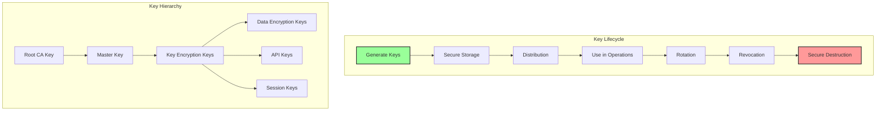
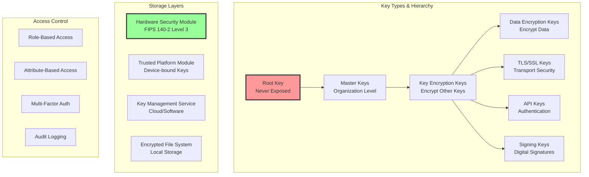

# Key Management

**The foundation of cryptographic security: Keys are only as secure as their management**

> *"A cryptographic system is only as strong as its key management. You can have the most sophisticated encryption algorithm, but if the keys are poorly managed, your system is vulnerable."*

---

## Level 1: Intuition

### The Bank Vault Analogy

```
Physical Security:                    Digital Key Management:

🏦 Bank Vault                        🔐 Encryption System
├── Master Key (CEO)                 ├── Master Key (Root of Trust)
├── Department Keys                  ├── Key Encryption Keys (KEKs)
├── Individual Safe Keys             ├── Data Encryption Keys (DEKs)
└── Key Control Procedures           └── Key Management System (KMS)

Problems to Solve:
- Who gets which keys?               - Access control & authorization
- How to distribute safely?          - Secure key distribution
- What if key is lost?              - Key recovery procedures
- What if employee leaves?          - Key revocation & rotation
- How to track key usage?           - Audit & compliance
```

### Real-World Implementations

| Company | System | Scale | Key Management Approach |
|---------|--------|-------|------------------------|
| **AWS** | KMS | Trillions of API calls | Hardware Security Modules (HSMs) |
| **Google** | Cloud KMS | Global scale | Distributed key hierarchy |
| **Netflix** | Confidant | 100K+ secrets | Automated rotation |
| **HashiCorp** | Vault | Enterprise | Dynamic secrets |
| **Cloudflare** | Keyless SSL | 10M+ domains | Remote key operations |


### Visual Overview



### Basic Implementation

```python
import os
import json
import base64
from datetime import datetime, timedelta
from cryptography.hazmat.primitives import hashes
from cryptography.hazmat.primitives.kdf.pbkdf2 import PBKDF2HMAC
from cryptography.hazmat.primitives.ciphers import Cipher, algorithms, modes
from cryptography.fernet import Fernet

class SimpleKeyManager:
    """Basic key management demonstration"""
    
    def __init__(self, master_password: str):
# Derive master key from password
        self.master_key = self._derive_master_key(master_password)
        self.keys = {}
        self.key_metadata = {}
    
    def _derive_master_key(self, password: str) -> bytes:
        """Derive master key from password using PBKDF2"""
        
# In production, load salt from secure storage
        salt = b'stable_salt_for_demo'  # Use random salt in production
        
        kdf = PBKDF2HMAC(
            algorithm=hashes.SHA256(),
            length=32,
            salt=salt,
            iterations=100000,
        )
        
        return base64.urlsafe_b64encode(kdf.derive(password.encode()))
    
    def generate_key(self, key_id: str, key_type: str = 'symmetric') -> dict:
        """Generate a new encryption key"""
        
        if key_type == 'symmetric':
# Generate Fernet key (AES-128 + HMAC)
            key = Fernet.generate_key()
        else:
            raise ValueError(f"Unsupported key type: {key_type}")
        
# Encrypt key with master key for storage
        f = Fernet(self.master_key)
        encrypted_key = f.encrypt(key)
        
# Store encrypted key and metadata
        self.keys[key_id] = encrypted_key
        self.key_metadata[key_id] = {
            'created': datetime.utcnow().isoformat(),
            'type': key_type,
            'status': 'active',
            'version': 1,
            'expires': (datetime.utcnow() + timedelta(days=365)).isoformat()
        }
        
        return {
            'key_id': key_id,
            'key': key.decode(),  # Return plaintext for immediate use
            'metadata': self.key_metadata[key_id]
        }
    
    def get_key(self, key_id: str) -> bytes:
        """Retrieve and decrypt a key"""
        
        if key_id not in self.keys:
            raise KeyError(f"Key {key_id} not found")
        
# Check if key is active
        metadata = self.key_metadata[key_id]
        if metadata['status'] != 'active':
            raise ValueError(f"Key {key_id} is {metadata['status']}")
        
# Check expiration
        if datetime.fromisoformat(metadata['expires']) < datetime.utcnow():
            raise ValueError(f"Key {key_id} has expired")
        
# Decrypt key
        f = Fernet(self.master_key)
        return f.decrypt(self.keys[key_id])
    
    def rotate_key(self, key_id: str) -> dict:
        """Rotate a key (create new version)"""
        
        if key_id not in self.keys:
            raise KeyError(f"Key {key_id} not found")
        
# Generate new key
        new_key_data = self.generate_key(f"{key_id}_v{self.key_metadata[key_id]['version'] + 1}")
        
# Update metadata
        self.key_metadata[key_id]['status'] = 'rotated'
        self.key_metadata[key_id]['rotated_to'] = new_key_data['key_id']
        self.key_metadata[key_id]['rotated_at'] = datetime.utcnow().isoformat()
        
        return new_key_data
    
    def revoke_key(self, key_id: str, reason: str = 'unspecified'):
        """Revoke a key"""
        
        if key_id not in self.keys:
            raise KeyError(f"Key {key_id} not found")
        
        self.key_metadata[key_id]['status'] = 'revoked'
        self.key_metadata[key_id]['revoked_at'] = datetime.utcnow().isoformat()
        self.key_metadata[key_id]['revocation_reason'] = reason
        
# In production, also update CRL (Certificate Revocation List)

# Usage example
km = SimpleKeyManager("super-secret-master-password")

# Generate API key
api_key = km.generate_key("api-key-1", "symmetric")
print(f"Generated key: {api_key['key_id']}")

# Use key for encryption
fernet = Fernet(api_key['key'].encode())
encrypted = fernet.encrypt(b"Secret message")
print(f"Encrypted: {encrypted[:50]}...")

# Retrieve key later
retrieved_key = km.get_key("api-key-1")
fernet2 = Fernet(retrieved_key)
decrypted = fernet2.decrypt(encrypted)
print(f"Decrypted: {decrypted.decode()}")

# Rotate key
new_key = km.rotate_key("api-key-1")
print(f"Rotated to: {new_key['key_id']}")
```

---

## Level 2: Foundation

### Core Concepts



### Key Management System Architecture

```python
from abc import ABC, abstractmethod
from enum import Enum
import hashlib
import hmac
from typing import Dict, List, Optional, Any
import uuid

class KeyType(Enum):
    MASTER = "master"
    KEK = "key_encryption_key"
    DEK = "data_encryption_key"
    API = "api_key"
    SIGNING = "signing_key"
    TLS = "tls_key"

class KeyStatus(Enum):
    ACTIVE = "active"
    ROTATED = "rotated"
    REVOKED = "revoked"
    EXPIRED = "expired"
    DESTROYED = "destroyed"

class KeyAlgorithm(Enum):
    AES_256_GCM = "aes-256-gcm"
    RSA_2048 = "rsa-2048"
    RSA_4096 = "rsa-4096"
    ECDSA_P256 = "ecdsa-p256"
    ED25519 = "ed25519"

class Key:
    """Represents a cryptographic key with metadata"""
    
    def __init__(self, key_id: str, key_type: KeyType, algorithm: KeyAlgorithm):
        self.key_id = key_id
        self.key_type = key_type
        self.algorithm = algorithm
        self.version = 1
        self.status = KeyStatus.ACTIVE
        self.created_at = datetime.utcnow()
        self.expires_at = self.created_at + timedelta(days=365)
        self.rotated_from = None
        self.rotated_to = None
        self.usage_count = 0
        self.last_used = None
        self.metadata = {}

class KeyStore(ABC):
    """Abstract base class for key storage backends"""
    
    @abstractmethod
    def store_key(self, key_id: str, key_material: bytes, metadata: dict) -> bool:
        pass
    
    @abstractmethod
    def retrieve_key(self, key_id: str) -> tuple[bytes, dict]:
        pass
    
    @abstractmethod
    def delete_key(self, key_id: str) -> bool:
        pass
    
    @abstractmethod
    def list_keys(self, key_type: Optional[KeyType] = None) -> List[str]:
        pass

class HSMKeyStore(KeyStore):
    """Hardware Security Module key storage"""
    
    def __init__(self, hsm_client):
        self.hsm = hsm_client
        self.key_cache = {}  # Cache key handles, not materials
    
    def store_key(self, key_id: str, key_material: bytes, metadata: dict) -> bool:
        """Store key in HSM"""
        
# Generate key inside HSM (never expose key material)
        if metadata.get('generate_in_hsm', True):
            key_handle = self.hsm.generate_key(
                algorithm=metadata['algorithm'],
                key_size=metadata.get('key_size', 256),
                exportable=metadata.get('exportable', False)
            )
            
# Store handle reference
            self.key_cache[key_id] = {
                'handle': key_handle,
                'metadata': metadata
            }
        else:
# Import external key (less secure)
            key_handle = self.hsm.import_key(
                key_material,
                algorithm=metadata['algorithm']
            )
            self.key_cache[key_id] = {
                'handle': key_handle,
                'metadata': metadata
            }
        
        return True
    
    def retrieve_key(self, key_id: str) -> tuple[bytes, dict]:
        """Retrieve key from HSM"""
        
        if key_id not in self.key_cache:
# Load from HSM
            key_info = self.hsm.get_key_info(key_id)
            self.key_cache[key_id] = key_info
        
# For HSM, we return a handle, not the actual key
        return self.key_cache[key_id]['handle'], self.key_cache[key_id]['metadata']

class CloudKMSStore(KeyStore):
    """Cloud-based KMS storage (AWS KMS, Google Cloud KMS, etc.)"""
    
    def __init__(self, kms_client, key_ring: str):
        self.kms = kms_client
        self.key_ring = key_ring
    
    def store_key(self, key_id: str, key_material: bytes, metadata: dict) -> bool:
        """Create key in cloud KMS"""
        
        response = self.kms.create_crypto_key(
            parent=self.key_ring,
            crypto_key_id=key_id,
            crypto_key={
                'purpose': metadata.get('purpose', 'ENCRYPT_DECRYPT'),
                'version_template': {
                    'algorithm': metadata['algorithm'],
                    'protection_level': metadata.get('protection_level', 'HSM')
                },
                'rotation_period': metadata.get('rotation_period', '90d')
            }
        )
        
        return response.name is not None

class KeyManagementSystem:
    """Complete key management system with lifecycle management"""
    
    def __init__(self, key_store: KeyStore, audit_logger=None):
        self.key_store = key_store
        self.audit = audit_logger or self._default_logger
        self.policies = {}
        self.access_control = {}
        
    def create_key(self, key_type: KeyType, algorithm: KeyAlgorithm, 
                   metadata: Optional[dict] = None) -> Key:
        """Generate a new key"""
        
        key_id = str(uuid.uuid4())
        key = Key(key_id, key_type, algorithm)
        
# Apply policies
        policy = self.policies.get(key_type, {})
        key.expires_at = datetime.utcnow() + timedelta(
            days=policy.get('max_age_days', 365)
        )
        
# Generate key material based on algorithm
        if algorithm == KeyAlgorithm.AES_256_GCM:
            key_material = os.urandom(32)  # 256 bits
        elif algorithm in [KeyAlgorithm.RSA_2048, KeyAlgorithm.RSA_4096]:
# Generate RSA key pair
            from cryptography.hazmat.primitives.asymmetric import rsa
            key_size = 2048 if algorithm == KeyAlgorithm.RSA_2048 else 4096
            private_key = rsa.generate_private_key(65537, key_size)
            key_material = private_key.private_bytes(
                encoding=serialization.Encoding.PEM,
                format=serialization.PrivateFormat.PKCS8,
                encryption_algorithm=serialization.NoEncryption()
            )
        
# Store key
        store_metadata = {
            'key_type': key_type.value,
            'algorithm': algorithm.value,
            'created_at': key.created_at.isoformat(),
            'expires_at': key.expires_at.isoformat(),
            'version': key.version,
            'status': key.status.value
        }
        
        if metadata:
            store_metadata.update(metadata)
        
        self.key_store.store_key(key_id, key_material, store_metadata)
        
# Audit log
        self.audit.log('key_created', {
            'key_id': key_id,
            'key_type': key_type.value,
            'algorithm': algorithm.value,
            'expires_at': key.expires_at.isoformat()
        })
        
        return key
    
    def rotate_key(self, key_id: str) -> Key:
        """Rotate a key by creating a new version"""
        
# Retrieve current key
        _, metadata = self.key_store.retrieve_key(key_id)
        
# Create new key
        new_key = self.create_key(
            KeyType(metadata['key_type']),
            KeyAlgorithm(metadata['algorithm']),
            {'rotated_from': key_id}
        )
        
# Update old key metadata
        metadata['status'] = KeyStatus.ROTATED.value
        metadata['rotated_to'] = new_key.key_id
        metadata['rotated_at'] = datetime.utcnow().isoformat()
        
# Re-encrypt data encrypted with old key
        self._initiate_reencryption(key_id, new_key.key_id)
        
# Audit log
        self.audit.log('key_rotated', {
            'old_key_id': key_id,
            'new_key_id': new_key.key_id
        })
        
        return new_key
    
    def revoke_key(self, key_id: str, reason: str):
        """Revoke a key"""
        
        _, metadata = self.key_store.retrieve_key(key_id)
        
        metadata['status'] = KeyStatus.REVOKED.value
        metadata['revoked_at'] = datetime.utcnow().isoformat()
        metadata['revocation_reason'] = reason
        
# Add to revocation list
        self._add_to_revocation_list(key_id, reason)
        
# Audit log
        self.audit.log('key_revoked', {
            'key_id': key_id,
            'reason': reason
        })
    
    def get_key_for_operation(self, operation: str, context: dict) -> bytes:
        """Get appropriate key for an operation with access control"""
        
# Determine required key type
        key_type = self._determine_key_type(operation)
        
# Check access control
        if not self._check_access(context.get('user'), operation, key_type):
            raise PermissionError(f"Access denied for operation {operation}")
        
# Get active key of required type
        active_keys = self.key_store.list_keys(key_type)
        
        for key_id in active_keys:
            key_material, metadata = self.key_store.retrieve_key(key_id)
            
            if metadata['status'] == KeyStatus.ACTIVE.value:
# Check expiration
                if datetime.fromisoformat(metadata['expires_at']) > datetime.utcnow():
# Update usage statistics
                    self._update_usage_stats(key_id)
                    
# Audit log
                    self.audit.log('key_accessed', {
                        'key_id': key_id,
                        'operation': operation,
                        'user': context.get('user')
                    })
                    
                    return key_material
        
        raise KeyError(f"No active key found for operation {operation}")
```

### Key Lifecycle Management

```python
class KeyLifecycleManager:
    """Manages the complete lifecycle of cryptographic keys"""
    
    def __init__(self, kms: KeyManagementSystem):
        self.kms = kms
        self.policies = self._load_policies()
        self.scheduled_tasks = []
    
    def _load_policies(self) -> dict:
        """Load key management policies"""
        
        return {
            KeyType.DEK: {
                'max_age_days': 90,
                'rotation_warning_days': 7,
                'auto_rotate': True,
                'usage_limit': 1000000  # 1M encryptions
            },
            KeyType.KEK: {
                'max_age_days': 365,
                'rotation_warning_days': 30,
                'auto_rotate': True,
                'require_mfa_for_access': True
            },
            KeyType.API: {
                'max_age_days': 30,
                'rotation_warning_days': 5,
                'auto_rotate': False,
                'rate_limit': 1000  # requests per hour
            },
            KeyType.MASTER: {
                'max_age_days': 1825,  # 5 years
                'rotation_warning_days': 90,
                'auto_rotate': False,
                'require_hardware_key': True,
                'quorum_required': 3  # 3 of 5 key holders
            }
        }
    
    def enforce_policies(self):
        """Enforce key management policies"""
        
        for key_type, policy in self.policies.items():
            keys = self.kms.key_store.list_keys(key_type)
            
            for key_id in keys:
                _, metadata = self.kms.key_store.retrieve_key(key_id)
                
# Check age
                created = datetime.fromisoformat(metadata['created_at'])
                age_days = (datetime.utcnow() - created).days
                
                if age_days > policy['max_age_days']:
                    if policy['auto_rotate']:
                        self.kms.rotate_key(key_id)
                    else:
                        self._send_rotation_alert(key_id, "Key exceeded maximum age")
                
                elif age_days > (policy['max_age_days'] - policy['rotation_warning_days']):
                    self._send_rotation_warning(key_id, policy['max_age_days'] - age_days)
                
# Check usage limits
                if 'usage_count' in metadata and 'usage_limit' in policy:
                    if metadata['usage_count'] > policy['usage_limit']:
                        self.kms.rotate_key(key_id)
    
    def schedule_rotation(self, key_id: str, rotation_date: datetime):
        """Schedule a key rotation"""
        
        task = {
            'task_id': str(uuid.uuid4()),
            'key_id': key_id,
            'action': 'rotate',
            'scheduled_time': rotation_date,
            'status': 'pending'
        }
        
        self.scheduled_tasks.append(task)
        
# In production, use a proper task scheduler
        self._schedule_task(task)
    
    def destroy_key(self, key_id: str, confirmation_code: str):
        """Securely destroy a key"""
        
# Verify confirmation code (prevent accidental deletion)
        expected_code = hashlib.sha256(f"{key_id}:destroy".encode()).hexdigest()[:8]
        
        if confirmation_code != expected_code:
            raise ValueError("Invalid confirmation code")
        
# Check if key can be destroyed
        _, metadata = self.kms.key_store.retrieve_key(key_id)
        
        if metadata['status'] not in [KeyStatus.REVOKED.value, KeyStatus.EXPIRED.value]:
            raise ValueError("Key must be revoked or expired before destruction")
        
# Check for dependencies
        if self._has_encrypted_data(key_id):
            raise ValueError("Cannot destroy key with existing encrypted data")
        
# Overwrite key material multiple times
        self._secure_delete(key_id)
        
# Update metadata
        metadata['status'] = KeyStatus.DESTROYED.value
        metadata['destroyed_at'] = datetime.utcnow().isoformat()
        metadata['destroyed_by'] = confirmation_code  # In production, use actual user ID
        
# Audit log
        self.kms.audit.log('key_destroyed', {
            'key_id': key_id,
            'confirmed_by': confirmation_code
        })
    
    def _secure_delete(self, key_id: str):
        """Securely overwrite key material"""
        
# For software keys, overwrite with random data
        for _ in range(3):  # DoD 5220.22-M standard
            random_data = os.urandom(32)
# Overwrite key storage location
            
# For HSM keys, use HSM's secure delete
        if hasattr(self.kms.key_store, 'hsm'):
            self.kms.key_store.hsm.destroy_key(key_id)
```

### Secure Key Distribution

```python
class KeyDistributionSystem:
    """Secure key distribution mechanisms"""
    
    def __init__(self, kms: KeyManagementSystem):
        self.kms = kms
        self.transport_keys = {}
    
    def create_key_exchange(self, recipient_public_key: bytes) -> dict:
        """Create secure key exchange using ECDH"""
        
        from cryptography.hazmat.primitives.asymmetric import ec
        from cryptography.hazmat.primitives import hashes
        from cryptography.hazmat.primitives.kdf.hkdf import HKDF
        
# Generate ephemeral key pair
        private_key = ec.generate_private_key(ec.SECP256R1())
        public_key = private_key.public_key()
        
# Load recipient's public key
        recipient_key = ec.EllipticCurvePublicKey.from_encoded_point(
            ec.SECP256R1(),
            recipient_public_key
        )
        
# Perform ECDH
        shared_secret = private_key.exchange(ec.ECDH(), recipient_key)
        
# Derive encryption key
        kdf = HKDF(
            algorithm=hashes.SHA256(),
            length=32,
            salt=None,
            info=b'key-exchange-v1'
        )
        derived_key = kdf.derive(shared_secret)
        
        return {
            'ephemeral_public_key': public_key.public_bytes(
                encoding=serialization.Encoding.X962,
                format=serialization.PublicFormat.UncompressedPoint
            ),
            'transport_key': derived_key
        }
    
    def wrap_key(self, key_to_wrap: bytes, wrapping_key: bytes) -> dict:
        """Wrap a key for secure transport (RFC 3394)"""
        
        from cryptography.hazmat.primitives.keywrap import aes_key_wrap
        
# Generate IV for key wrapping
        iv = os.urandom(8)
        
# Wrap the key
        wrapped = aes_key_wrap(
            wrapping_key=wrapping_key,
            key_to_wrap=key_to_wrap,
            backend=default_backend()
        )
        
        return {
            'wrapped_key': base64.b64encode(wrapped).decode(),
            'algorithm': 'aes-key-wrap',
            'iv': base64.b64encode(iv).decode()
        }
    
    def distribute_key_shares(self, key_id: str, threshold: int, shares: int) -> list:
        """Distribute key using Shamir's Secret Sharing"""
        
# Retrieve key
        key_material, _ = self.kms.key_store.retrieve_key(key_id)
        
# Generate shares
        shares_list = self._shamirs_split(key_material, threshold, shares)
        
# Distribute to shareholders
        distributions = []
        for i, share in enumerate(shares_list):
            distribution = {
                'share_id': f"{key_id}-share-{i+1}",
                'share_number': i + 1,
                'total_shares': shares,
                'threshold': threshold,
                'share_data': base64.b64encode(share).decode(),
                'distributed_at': datetime.utcnow().isoformat()
            }
            distributions.append(distribution)
        
        return distributions
    
    def _shamirs_split(self, secret: bytes, threshold: int, shares: int) -> list:
        """Split secret using Shamir's Secret Sharing"""
        
        from secretsharing import SecretSharer
        
# Convert secret to hex
        secret_hex = secret.hex()
        
# Generate shares
        shares_list = SecretSharer.split_secret(secret_hex, threshold, shares)
        
        return [share.encode() for share in shares_list]
```

---

## Level 3: Deep Dive

### Production-Grade Key Management

```python
class EnterpriseKeyManagementSystem:
    """Production-ready key management system with HSM support"""
    
    def __init__(self, config: dict):
        self.config = config
        self.hsm = self._initialize_hsm()
        self.key_stores = self._initialize_stores()
        self.audit = AuditLogger(config['audit'])
        self.monitoring = KeyMonitoring(config['monitoring'])
        
    def _initialize_hsm(self):
        """Initialize Hardware Security Module connection"""
        
        if self.config['hsm']['type'] == 'cloudhsm':
            from cloudhsm import CloudHSMClient
            return CloudHSMClient(
                cluster_id=self.config['hsm']['cluster_id'],
                credentials=self.config['hsm']['credentials']
            )
        elif self.config['hsm']['type'] == 'ncipher':
            from ncipher import nShieldClient
            return nShieldClient(
                module_id=self.config['hsm']['module_id'],
                operator_cards=self.config['hsm']['operator_cards']
            )
    
    def generate_master_key(self, key_ceremony_participants: list) -> str:
        """Generate master key with formal key ceremony"""
        
        ceremony_id = str(uuid.uuid4())
        
# Verify all participants
        verified_participants = []
        for participant in key_ceremony_participants:
            if self._verify_participant(participant):
                verified_participants.append(participant)
            else:
                raise SecurityError(f"Failed to verify participant {participant['id']}")
        
# Initialize ceremony log
        ceremony_log = {
            'ceremony_id': ceremony_id,
            'timestamp': datetime.utcnow().isoformat(),
            'participants': [p['id'] for p in verified_participants],
            'hsm_serial': self.hsm.get_serial_number(),
            'firmware_version': self.hsm.get_firmware_version()
        }
        
# Generate master key components
        key_components = []
        for participant in verified_participants:
# Each participant generates a component
            component = self.hsm.generate_key_component(
                participant_auth=participant['auth_token']
            )
            key_components.append(component)
            
            ceremony_log[f'component_{participant["id"]}'] = {
                'generated_at': datetime.utcnow().isoformat(),
                'checksum': hashlib.sha256(component).hexdigest()
            }
        
# Combine components in HSM
        master_key_handle = self.hsm.combine_key_components(
            components=key_components,
            key_type='AES-256',
            key_usage=['ENCRYPT', 'DECRYPT', 'WRAP', 'UNWRAP'],
            exportable=False
        )
        
# Generate key check value (KCV)
        kcv = self.hsm.calculate_kcv(master_key_handle)
        
# Store master key metadata
        master_key_id = f"master-{ceremony_id}"
        self.key_stores['metadata'].store({
            'key_id': master_key_id,
            'key_type': KeyType.MASTER.value,
            'hsm_handle': master_key_handle,
            'kcv': kcv,
            'ceremony_log': ceremony_log,
            'created_at': datetime.utcnow().isoformat(),
            'participants': [p['id'] for p in verified_participants]
        })
        
# Securely destroy components
        for component in key_components:
            self._secure_overwrite(component)
        
        return master_key_id
    
    def implement_key_escrow(self, key_id: str, escrow_agents: list):
        """Implement key escrow with m-of-n recovery"""
        
# Retrieve key
        key_data = self.retrieve_key(key_id)
        
# Split key using Shamir's Secret Sharing
        threshold = len(escrow_agents) // 2 + 1  # Majority required
        shares = self._create_escrow_shares(
            key_data['key_material'],
            threshold,
            len(escrow_agents)
        )
        
# Encrypt each share for respective agent
        escrow_records = []
        for i, agent in enumerate(escrow_agents):
            encrypted_share = self._encrypt_for_agent(
                shares[i],
                agent['public_key']
            )
            
            escrow_record = {
                'escrow_id': str(uuid.uuid4()),
                'key_id': key_id,
                'agent_id': agent['id'],
                'share_number': i + 1,
                'threshold': threshold,
                'encrypted_share': encrypted_share,
                'created_at': datetime.utcnow().isoformat()
            }
            
# Store escrow record
            self.key_stores['escrow'].store(escrow_record)
            escrow_records.append(escrow_record)
        
# Audit log
        self.audit.log('key_escrowed', {
            'key_id': key_id,
            'escrow_agents': [a['id'] for a in escrow_agents],
            'threshold': threshold
        })
        
        return escrow_records
    
    def rotate_all_keys(self, key_type: Optional[KeyType] = None):
        """Automated key rotation with zero downtime"""
        
        keys_to_rotate = self._get_keys_for_rotation(key_type)
        
        rotation_plan = {
            'rotation_id': str(uuid.uuid4()),
            'started_at': datetime.utcnow().isoformat(),
            'keys': []
        }
        
        for key_id in keys_to_rotate:
            try:
# Create new key version
                new_key = self.create_key_version(key_id)
                
# Parallel re-encryption
                reencryption_job = self._start_reencryption_job(
                    old_key_id=key_id,
                    new_key_id=new_key['key_id']
                )
                
                rotation_plan['keys'].append({
                    'old_key_id': key_id,
                    'new_key_id': new_key['key_id'],
                    'reencryption_job': reencryption_job['job_id'],
                    'status': 'in_progress'
                })
                
            except Exception as e:
                self.audit.log('key_rotation_failed', {
                    'key_id': key_id,
                    'error': str(e)
                })
                rotation_plan['keys'].append({
                    'key_id': key_id,
                    'status': 'failed',
                    'error': str(e)
                })
        
# Monitor rotation progress
        self.monitoring.track_rotation(rotation_plan)
        
        return rotation_plan

class CryptoAgility:
    """Implement crypto-agility for algorithm migration"""
    
    def __init__(self, kms: EnterpriseKeyManagementSystem):
        self.kms = kms
        self.algorithm_policies = self._load_algorithm_policies()
    
    def _load_algorithm_policies(self) -> dict:
        """Load algorithm lifecycle policies"""
        
        return {
            'deprecated': ['3DES', 'SHA1', 'RSA-1024'],
            'current': ['AES-256-GCM', 'SHA256', 'RSA-2048', 'ECDSA-P256'],
            'recommended': ['AES-256-GCM', 'SHA3-256', 'RSA-4096', 'Ed25519'],
            'quantum_safe': ['CRYSTALS-Kyber', 'CRYSTALS-Dilithium', 'FALCON']
        }
    
    def assess_algorithm_risk(self) -> dict:
        """Assess cryptographic algorithm risks"""
        
        assessment = {
            'assessment_id': str(uuid.uuid4()),
            'timestamp': datetime.utcnow().isoformat(),
            'deprecated_keys': [],
            'at_risk_keys': [],
            'recommendations': []
        }
        
# Check all keys
        for key_id in self.kms.list_all_keys():
            key_info = self.kms.get_key_info(key_id)
            algorithm = key_info['algorithm']
            
            if algorithm in self.algorithm_policies['deprecated']:
                assessment['deprecated_keys'].append({
                    'key_id': key_id,
                    'algorithm': algorithm,
                    'risk_level': 'HIGH',
                    'action_required': 'IMMEDIATE_MIGRATION'
                })
            
            elif algorithm not in self.algorithm_policies['recommended']:
                assessment['at_risk_keys'].append({
                    'key_id': key_id,
                    'algorithm': algorithm,
                    'risk_level': 'MEDIUM',
                    'action_required': 'PLANNED_MIGRATION'
                })
        
# Generate recommendations
        if assessment['deprecated_keys']:
            assessment['recommendations'].append({
                'priority': 'CRITICAL',
                'action': 'Migrate all deprecated algorithms immediately',
                'keys_affected': len(assessment['deprecated_keys'])
            })
        
        return assessment
    
    def migrate_to_quantum_safe(self, key_id: str) -> dict:
        """Migrate key to quantum-safe algorithm"""
        
        current_key = self.kms.retrieve_key(key_id)
        
# Determine quantum-safe replacement
        if current_key['algorithm'].startswith('RSA'):
            new_algorithm = 'CRYSTALS-Dilithium'  # For signatures
        elif current_key['algorithm'].startswith('ECDH'):
            new_algorithm = 'CRYSTALS-Kyber'  # For key exchange
        else:
            new_algorithm = 'AES-256-GCM'  # Symmetric crypto is quantum-safe
        
# Create new quantum-safe key
        new_key = self.kms.create_key(
            key_type=current_key['key_type'],
            algorithm=new_algorithm,
            metadata={
                'migrated_from': key_id,
                'migration_reason': 'quantum_safety',
                'migration_date': datetime.utcnow().isoformat()
            }
        )
        
# Implement hybrid approach during transition
        hybrid_config = {
            'mode': 'hybrid',
            'classical_key': key_id,
            'quantum_safe_key': new_key['key_id'],
            'combination_method': 'concatenate_and_hash'
        }
        
        return {
            'migration_id': str(uuid.uuid4()),
            'original_key': key_id,
            'quantum_safe_key': new_key['key_id'],
            'hybrid_config': hybrid_config,
            'status': 'migrated'
        }

class KeyMonitoring:
    """Real-time key usage monitoring and alerting"""
    
    def __init__(self, config: dict):
        self.metrics_client = self._init_metrics_client(config)
        self.alert_manager = AlertManager(config['alerts'])
        self.anomaly_detector = AnomalyDetector()
    
    def track_key_usage(self, key_id: str, operation: str, context: dict):
        """Track key usage metrics"""
        
# Record metric
        self.metrics_client.increment(
            'key.usage',
            tags={
                'key_id': key_id,
                'operation': operation,
                'user': context.get('user', 'unknown'),
                'service': context.get('service', 'unknown')
            }
        )
        
# Check for anomalies
        if self.anomaly_detector.is_anomalous(key_id, operation, context):
            self.alert_manager.send_alert({
                'severity': 'HIGH',
                'title': f'Anomalous key usage detected for {key_id}',
                'details': {
                    'key_id': key_id,
                    'operation': operation,
                    'context': context,
                    'timestamp': datetime.utcnow().isoformat()
                }
            })
    
    def monitor_key_health(self):
        """Monitor overall key health metrics"""
        
        health_metrics = {
            'timestamp': datetime.utcnow().isoformat(),
            'total_keys': 0,
            'expiring_soon': 0,
            'high_usage': 0,
            'deprecated_algorithms': 0,
            'compliance_violations': 0
        }
        
        for key_id in self.kms.list_all_keys():
            key_info = self.kms.get_key_info(key_id)
            health_metrics['total_keys'] += 1
            
# Check expiration
            days_until_expiry = (
                datetime.fromisoformat(key_info['expires_at']) - datetime.utcnow()
            ).days
            
            if days_until_expiry < 30:
                health_metrics['expiring_soon'] += 1
                
# Check usage
            if key_info.get('usage_count', 0) > 1000000:
                health_metrics['high_usage'] += 1
            
# Check algorithm
            if key_info['algorithm'] in ['3DES', 'SHA1']:
                health_metrics['deprecated_algorithms'] += 1
        
# Send metrics to monitoring system
        for metric, value in health_metrics.items():
            if metric != 'timestamp':
                self.metrics_client.gauge(f'key_health.{metric}', value)
        
        return health_metrics
```

### Compliance and Audit

```python
class ComplianceManager:
    """Ensure key management compliance with regulations"""
    
    def __init__(self, kms: EnterpriseKeyManagementSystem):
        self.kms = kms
        self.regulations = self._load_regulations()
        
    def _load_regulations(self) -> dict:
        """Load compliance requirements"""
        
        return {
            'PCI_DSS': {
                'key_rotation_days': 365,
                'minimum_key_length': 2048,
                'approved_algorithms': ['AES-256', 'RSA-2048', 'RSA-4096'],
                'key_storage': 'HSM_REQUIRED',
                'dual_control': True,
                'split_knowledge': True
            },
            'FIPS_140_2': {
                'hsm_level': 3,
                'approved_algorithms': ['AES', 'RSA', 'ECDSA', 'SHA-256', 'SHA-384'],
                'key_zeroization': True,
                'tamper_evidence': True
            },
            'GDPR': {
                'data_encryption': 'REQUIRED',
                'key_recovery': 'PROHIBITED',
                'audit_retention_days': 365,
                'right_to_erasure': True
            },
            'HIPAA': {
                'encryption_required': True,
                'key_management_required': True,
                'access_control': 'MANDATORY',
                'audit_logs': 'REQUIRED'
            }
        }
    
    def audit_compliance(self, regulation: str) -> dict:
        """Audit compliance with specific regulation"""
        
        requirements = self.regulations.get(regulation)
        if not requirements:
            raise ValueError(f"Unknown regulation: {regulation}")
        
        audit_report = {
            'audit_id': str(uuid.uuid4()),
            'regulation': regulation,
            'timestamp': datetime.utcnow().isoformat(),
            'compliant': True,
            'violations': [],
            'warnings': []
        }
        
# Check each requirement
        for requirement, expected in requirements.items():
            actual = self._check_requirement(requirement, expected)
            
            if actual['compliant']:
                audit_report[requirement] = {
                    'status': 'COMPLIANT',
                    'details': actual['details']
                }
            else:
                audit_report['compliant'] = False
                audit_report['violations'].append({
                    'requirement': requirement,
                    'expected': expected,
                    'actual': actual['value'],
                    'severity': actual['severity']
                })
        
# Generate recommendations
        if audit_report['violations']:
            audit_report['recommendations'] = self._generate_recommendations(
                audit_report['violations']
            )
        
        return audit_report
    
    def generate_compliance_report(self) -> dict:
        """Generate comprehensive compliance report"""
        
        report = {
            'report_id': str(uuid.uuid4()),
            'generated_at': datetime.utcnow().isoformat(),
            'regulations': {},
            'overall_compliance': True,
            'executive_summary': []
        }
        
        for regulation in self.regulations:
            audit = self.audit_compliance(regulation)
            report['regulations'][regulation] = audit
            
            if not audit['compliant']:
                report['overall_compliance'] = False
                report['executive_summary'].append({
                    'regulation': regulation,
                    'violations': len(audit['violations']),
                    'severity': 'HIGH'
                })
        
        return report
```

---

## Level 4: Expert

### Case Study: Netflix's Confidant

Netflix manages millions of secrets across thousands of microservices using their open-source Confidant system.

```python
class NetflixConfidantSystem:
    """
    Netflix's approach to key management at scale
    - Millions of secrets
    - Thousands of services
    - Global distribution
    - Zero-downtime rotation
    """
    
    def __init__(self):
        self.dynamodb = DynamoDBClient()
        self.kms = AWSKMSClient()
        self.iam = AWSIAMClient()
        self.stats = StatsClient()
        
    def store_service_credential(self, service: str, credential: dict) -> dict:
        """Store credential with service-based access control"""
        
        credential_id = f"{service}:{credential['name']}:{uuid.uuid4()}"
        
# Generate data key for this credential
        data_key_response = self.kms.generate_data_key(
            KeyId=self._get_service_kms_key(service),
            KeySpec='AES_256'
        )
        
# Encrypt credential with data key
        plaintext_key = data_key_response['Plaintext']
        encrypted_credential = self._encrypt_credential(
            credential,
            plaintext_key
        )
        
# Store in DynamoDB
        item = {
            'id': credential_id,
            'service': service,
            'name': credential['name'],
            'version': 1,
            'data_key': base64.b64encode(data_key_response['CiphertextBlob']).decode(),
            'credential': encrypted_credential,
            'created_at': datetime.utcnow().isoformat(),
            'created_by': self._get_caller_identity(),
            'enabled': True,
            'metadata': credential.get('metadata', {})
        }
        
        self.dynamodb.put_item(
            TableName='confidant-credentials',
            Item=item,
            ConditionExpression='attribute_not_exists(id)'
        )
        
# Grant service IAM role access
        self._grant_service_access(service, credential_id)
        
# Emit metrics
        self.stats.incr('credential.created', tags=[f'service:{service}'])
        
        return {
            'credential_id': credential_id,
            'version': 1,
            'service': service
        }
    
    def get_service_credentials(self, service: str, context: dict) -> list:
        """Get all credentials for a service with authentication"""
        
# Verify caller is authorized service
        if not self._verify_service_identity(service, context):
            raise AuthorizationError(f"Service {service} not authorized")
        
# Query credentials for service
        response = self.dynamodb.query(
            TableName='confidant-credentials',
            IndexName='service-index',
            KeyConditionExpression='service = :service',
            ExpressionAttributeValues={':service': service}
        )
        
        credentials = []
        for item in response['Items']:
            if item['enabled']:
# Decrypt data key
                data_key = self.kms.decrypt(
                    CiphertextBlob=base64.b64decode(item['data_key'])
                )['Plaintext']
                
# Decrypt credential
                credential = self._decrypt_credential(
                    item['credential'],
                    data_key
                )
                
                credentials.append({
                    'name': item['name'],
                    'credential': credential,
                    'version': item['version'],
                    'metadata': item.get('metadata', {})
                })
        
# Emit metrics
        self.stats.incr(
            'credential.fetched',
            value=len(credentials),
            tags=[f'service:{service}']
        )
        
        return credentials
    
    def rotate_credential(self, credential_id: str, new_credential: dict) -> dict:
        """Rotate credential with zero downtime"""
        
# Get current credential
        current = self.dynamodb.get_item(
            TableName='confidant-credentials',
            Key={'id': credential_id}
        )['Item']
        
# Create new version
        new_version = current['version'] + 1
        new_credential_id = f"{current['service']}:{current['name']}:v{new_version}"
        
# Store new version
        new_item = {
            **current,
            'id': new_credential_id,
            'version': new_version,
            'credential': self._encrypt_credential(
                new_credential,
                self._get_data_key(current['data_key'])
            ),
            'created_at': datetime.utcnow().isoformat(),
            'previous_version': credential_id
        }
        
        self.dynamodb.put_item(
            TableName='confidant-credentials',
            Item=new_item
        )
        
# Update service to use new version (blue-green deployment)
        self._update_service_credential_version(
            current['service'],
            current['name'],
            new_version
        )
        
# Mark old version for deletion after grace period
        self._schedule_credential_deletion(
            credential_id,
            delay_hours=24
        )
        
        return {
            'credential_id': new_credential_id,
            'version': new_version,
            'previous_version': credential_id
        }
    
    def implement_credential_workflow(self, service: str, credential_type: str):
        """Implement approval workflow for sensitive credentials"""
        
        workflow = {
            'workflow_id': str(uuid.uuid4()),
            'service': service,
            'credential_type': credential_type,
            'approvers': self._get_approvers(service, credential_type),
            'status': 'pending_approval',
            'created_at': datetime.utcnow().isoformat()
        }
        
# Store workflow
        self.dynamodb.put_item(
            TableName='confidant-workflows',
            Item=workflow
        )
        
# Notify approvers
        for approver in workflow['approvers']:
            self._notify_approver(approver, workflow)
        
        return workflow
    
    def blind_credential_sharing(self, credential_id: str, recipient_service: str):
        """Share credential with another service without exposing it"""
        
# Get credential
        credential_item = self.dynamodb.get_item(
            TableName='confidant-credentials',
            Key={'id': credential_id}
        )['Item']
        
# Re-encrypt for recipient service
# Original service can't decrypt recipient's copy
        recipient_data_key = self.kms.generate_data_key(
            KeyId=self._get_service_kms_key(recipient_service),
            KeySpec='AES_256'
        )
        
# Create blind copy
        blind_copy = {
            'id': f"{credential_id}:shared:{recipient_service}",
            'service': recipient_service,
            'name': f"shared:{credential_item['name']}",
            'version': 1,
            'data_key': base64.b64encode(
                recipient_data_key['CiphertextBlob']
            ).decode(),
            'credential': self._reencrypt_credential(
                credential_item,
                recipient_data_key['Plaintext']
            ),
            'shared_from': credential_item['service'],
            'shared_at': datetime.utcnow().isoformat(),
            'expires_at': (datetime.utcnow() + timedelta(days=7)).isoformat()
        }
        
        self.dynamodb.put_item(
            TableName='confidant-credentials',
            Item=blind_copy
        )
        
# Audit log
        self._audit_log('credential_shared', {
            'credential_id': credential_id,
            'shared_with': recipient_service,
            'expires_at': blind_copy['expires_at']
        })
        
        return blind_copy['id']
```

### Advanced Key Protection

```python
class AdvancedKeyProtection:
    """Advanced key protection mechanisms"""
    
    def __init__(self):
        self.hsm = HSMClient()
        self.tpm = TPMClient()
        self.sgx = IntelSGXClient()
    
    def create_threshold_key(self, threshold: int, shares: int) -> dict:
        """Create threshold key requiring m-of-n to use"""
        
# Generate key in HSM
        key_handle = self.hsm.generate_key(
            key_type='RSA-4096',
            key_usage=['SIGN'],
            exportable=False
        )
        
# Create threshold scheme
        threshold_config = self.hsm.create_threshold_scheme(
            key_handle=key_handle,
            threshold=threshold,
            total_shares=shares
        )
        
# Generate authorization cards
        auth_cards = []
        for i in range(shares):
            card = {
                'card_id': str(uuid.uuid4()),
                'share_index': i,
                'auth_data': self.hsm.generate_auth_share(
                    threshold_config['scheme_id'],
                    i
                ),
                'holder': None  # To be assigned
            }
            auth_cards.append(card)
        
        return {
            'key_id': key_handle,
            'threshold_scheme': threshold_config,
            'auth_cards': auth_cards,
            'threshold': threshold,
            'total_shares': shares
        }
    
    def use_threshold_key(self, key_id: str, operation: str, 
                         auth_shares: list) -> bytes:
        """Use threshold key with multiple authorizations"""
        
# Verify we have enough shares
        threshold_info = self.hsm.get_threshold_info(key_id)
        
        if len(auth_shares) < threshold_info['threshold']:
            raise ValueError(
                f"Insufficient shares: {len(auth_shares)} < {threshold_info['threshold']}"
            )
        
# Combine shares in HSM
        session = self.hsm.start_threshold_operation(
            key_id=key_id,
            operation=operation
        )
        
        for share in auth_shares:
            self.hsm.submit_auth_share(
                session_id=session['session_id'],
                share_data=share['auth_data']
            )
        
# Execute operation
        if operation == 'sign':
            result = self.hsm.threshold_sign(
                session_id=session['session_id'],
                data=auth_shares[0].get('data_to_sign')
            )
        else:
            raise ValueError(f"Unsupported operation: {operation}")
        
# Audit log with all participants
        self._audit_threshold_operation(key_id, operation, auth_shares)
        
        return result
    
    def implement_key_attestation(self, key_id: str) -> dict:
        """Implement key attestation for hardware-backed keys"""
        
        if self.tpm.is_available():
# TPM attestation
            attestation = self.tpm.create_attestation(
                key_handle=key_id,
                nonce=os.urandom(32)
            )
            
            return {
                'type': 'TPM',
                'version': self.tpm.get_version(),
                'pcr_values': attestation['pcr_values'],
                'quote': attestation['quote'],
                'signature': attestation['signature'],
                'certificate_chain': attestation['cert_chain']
            }
            
        elif self.sgx.is_available():
# Intel SGX attestation
            quote = self.sgx.generate_quote(
                report_data=hashlib.sha256(key_id.encode()).digest()
            )
            
            return {
                'type': 'SGX',
                'quote': quote,
                'mrenclave': self.sgx.get_mrenclave(),
                'mrsigner': self.sgx.get_mrsigner(),
                'report': self.sgx.get_attestation_report()
            }
        
        else:
            raise RuntimeError("No hardware attestation available")
    
    def implement_time_locked_keys(self, key_id: str, unlock_time: datetime):
        """Create time-locked keys that can't be used until specific time"""
        
# Create time-lock puzzle
        puzzle = self._create_time_lock_puzzle(
            key_id=key_id,
            unlock_time=unlock_time
        )
        
# Store encrypted key
        locked_key = {
            'key_id': f"{key_id}:locked",
            'unlock_time': unlock_time.isoformat(),
            'puzzle': puzzle,
            'iterations_required': puzzle['iterations'],
            'estimated_compute_time': puzzle['estimated_hours'],
            'created_at': datetime.utcnow().isoformat()
        }
        
# Remove original key from accessible storage
        self._move_to_time_locked_storage(key_id, locked_key)
        
        return locked_key
    
    def _create_time_lock_puzzle(self, key_id: str, unlock_time: datetime):
        """Create computational puzzle that takes specific time to solve"""
        
# Calculate required iterations based on time
        time_until_unlock = (unlock_time - datetime.utcnow()).total_seconds()
        
# Assume 1 million SHA256 per second on modern CPU
        iterations = int(time_until_unlock * 1_000_000)
        
# Create puzzle
        initial_value = os.urandom(32)
        target = initial_value
        
# Pre-compute solution
        for _ in range(iterations):
            target = hashlib.sha256(target).digest()
        
# Encrypt key with final value
        key_data = self.retrieve_key(key_id)
        encrypted_key = self._encrypt_with_key(key_data, target)
        
        return {
            'initial_value': base64.b64encode(initial_value).decode(),
            'iterations': iterations,
            'encrypted_key': base64.b64encode(encrypted_key).decode(),
            'algorithm': 'sha256-chain',
            'estimated_hours': time_until_unlock / 3600
        }
```

### Performance and Scalability

```python
class ScalableKeyManagement:
    """High-performance key management for scale"""
    
    def __init__(self):
        self.cache = KeyCache()
        self.pool = HSMConnectionPool(size=100)
        self.metrics = MetricsCollector()
        
    def implement_key_cache(self) -> KeyCache:
        """Multi-tier key caching for performance"""
        
        return KeyCache(
            levels=[
# L1: Process memory (microseconds)
                {
                    'name': 'memory',
                    'backend': InMemoryCache(max_size=1000),
                    'ttl': 300,  # 5 minutes
                    'encrypt_at_rest': False
                },
# L2: Redis (milliseconds)
                {
                    'name': 'redis',
                    'backend': RedisCache(
                        nodes=['redis-1', 'redis-2', 'redis-3'],
                        encryption_key=self.get_cache_encryption_key()
                    ),
                    'ttl': 3600,  # 1 hour
                    'encrypt_at_rest': True
                },
# L3: Local HSM cache (milliseconds)
                {
                    'name': 'hsm_cache',
                    'backend': HSMCache(self.pool),
                    'ttl': 86400,  # 24 hours
                    'encrypt_at_rest': True
                }
            ]
        )
    
    def parallel_key_operations(self, operations: list) -> list:
        """Execute multiple key operations in parallel"""
        
        import asyncio
        from concurrent.futures import ThreadPoolExecutor
        
        async def execute_operations():
            with ThreadPoolExecutor(max_workers=50) as executor:
                tasks = []
                
                for op in operations:
                    if op['type'] == 'encrypt':
                        task = executor.submit(
                            self._encrypt_with_key,
                            op['key_id'],
                            op['data']
                        )
                    elif op['type'] == 'decrypt':
                        task = executor.submit(
                            self._decrypt_with_key,
                            op['key_id'],
                            op['data']
                        )
                    elif op['type'] == 'sign':
                        task = executor.submit(
                            self._sign_with_key,
                            op['key_id'],
                            op['data']
                        )
                    
                    tasks.append({
                        'operation_id': op['id'],
                        'future': task
                    })
                
# Wait for all operations
                results = []
                for task in tasks:
                    try:
                        result = task['future'].result(timeout=5.0)
                        results.append({
                            'operation_id': task['operation_id'],
                            'status': 'success',
                            'result': result
                        })
                    except Exception as e:
                        results.append({
                            'operation_id': task['operation_id'],
                            'status': 'failed',
                            'error': str(e)
                        })
                
                return results
        
        return asyncio.run(execute_operations())
    
    def implement_key_sharding(self, total_keys: int) -> dict:
        """Shard keys across multiple HSMs for scale"""
        
        shard_config = {
            'total_shards': 16,
            'replication_factor': 3,
            'shards': []
        }
        
# Configure shards
        for i in range(shard_config['total_shards']):
            shard = {
                'shard_id': i,
                'primary_hsm': f'hsm-{i}',
                'replica_hsms': [
                    f'hsm-{(i + j) % shard_config["total_shards"]}'
                    for j in range(1, shard_config['replication_factor'])
                ],
                'key_range': {
                    'start': i * (2**128 // shard_config['total_shards']),
                    'end': (i + 1) * (2**128 // shard_config['total_shards']) - 1
                }
            }
            shard_config['shards'].append(shard)
        
        return shard_config
    
    def optimize_batch_operations(self, operations: list) -> dict:
        """Optimize batch key operations"""
        
# Group by operation type and key
        grouped = {}
        for op in operations:
            key = (op['key_id'], op['type'])
            if key not in grouped:
                grouped[key] = []
            grouped[key].append(op)
        
# Execute batches
        results = []
        
        for (key_id, op_type), ops in grouped.items():
            if op_type == 'encrypt':
# Batch encrypt
                plaintext_list = [op['data'] for op in ops]
                ciphertext_list = self._batch_encrypt(key_id, plaintext_list)
                
                for i, op in enumerate(ops):
                    results.append({
                        'operation_id': op['id'],
                        'result': ciphertext_list[i]
                    })
            
            elif op_type == 'verify':
# Batch signature verification
                data_list = [(op['data'], op['signature']) for op in ops]
                verification_results = self._batch_verify(key_id, data_list)
                
                for i, op in enumerate(ops):
                    results.append({
                        'operation_id': op['id'],
                        'result': verification_results[i]
                    })
        
        return {
            'total_operations': len(operations),
            'batches_executed': len(grouped),
            'results': results
        }
```

---

## Level 5: Mastery

### Theoretical Foundations

#### Distributed Key Management

```python
class DistributedKeyManagement:
    """
    Distributed key management without single point of failure
    Based on threshold cryptography and secure multiparty computation
    """
    
    def __init__(self, nodes: list, threshold: int):
        self.nodes = nodes
        self.threshold = threshold
        self.mpc_protocol = MPCProtocol()
        
    def distributed_key_generation(self, key_type: str) -> dict:
        """
        Generate key using Distributed Key Generation (DKG) protocol
        No single party ever has the complete key
        """
        
        n = len(self.nodes)
        t = self.threshold
        
# Phase 1: Each node generates polynomial
        commitments = []
        for i, node in enumerate(self.nodes):
# Generate random polynomial of degree t-1
            polynomial = node.generate_polynomial(degree=t-1)
            
# Broadcast commitments
            commitment = node.commit_polynomial(polynomial)
            commitments.append(commitment)
            
# Send secret shares to other nodes
            for j, recipient in enumerate(self.nodes):
                if i != j:
                    share = polynomial.evaluate(j+1)
                    node.send_encrypted_share(recipient, share)
        
# Phase 2: Verify shares and commitments
        for node in self.nodes:
            received_shares = node.get_received_shares()
            
            for sender_id, share in received_shares.items():
# Verify share against commitment
                if not node.verify_share(
                    share,
                    commitments[sender_id],
                    node.id
                ):
# Complaint protocol
                    node.broadcast_complaint(sender_id)
        
# Phase 3: Resolve complaints
        complaints = self._collect_complaints()
        if complaints:
            self._resolve_complaints(complaints)
        
# Phase 4: Compute final key shares
        public_key = None
        shares = []
        
        for node in self.nodes:
# Combine shares from all parties
            final_share = node.combine_shares()
            shares.append({
                'node_id': node.id,
                'share': final_share,
                'verification_key': node.compute_verification_key()
            })
            
# Compute public key (same for all nodes)
            if public_key is None:
                public_key = node.compute_public_key(commitments)
        
        return {
            'public_key': public_key,
            'shares': shares,
            'threshold': t,
            'total_nodes': n,
            'key_type': key_type
        }
    
    def threshold_signing(self, message: bytes, signing_nodes: list) -> bytes:
        """
        Create signature using threshold signing
        Requires exactly t nodes to cooperate
        """
        
        if len(signing_nodes) < self.threshold:
            raise ValueError(f"Need at least {self.threshold} nodes to sign")
        
# Phase 1: Preprocessing (can be done offline)
        nonces = []
        for node in signing_nodes[:self.threshold]:
            nonce = node.generate_signing_nonce()
            nonces.append({
                'node_id': node.id,
                'commitment': node.commit_nonce(nonce)
            })
        
# Phase 2: Signing round
        partial_signatures = []
        
        for i, node in enumerate(signing_nodes[:self.threshold]):
# Compute partial signature
            partial_sig = node.create_partial_signature(
                message=message,
                nonce=nonces[i],
                key_share=node.get_key_share()
            )
            
            partial_signatures.append({
                'node_id': node.id,
                'partial_signature': partial_sig,
                'verification_key': node.verification_key
            })
        
# Phase 3: Combine signatures
        final_signature = self.mpc_protocol.combine_signatures(
            partial_signatures,
            self.threshold
        )
        
        return final_signature
    
    def proactive_secret_sharing(self):
        """
        Periodically refresh shares without changing the secret
        Protects against gradual compromise
        """
        
# Generate refresh polynomials
        refresh_data = []
        
        for node in self.nodes:
# Generate polynomial with zero constant term
            refresh_poly = node.generate_refresh_polynomial(
                degree=self.threshold - 1
            )
            
# Distribute refresh shares
            for j, recipient in enumerate(self.nodes):
                refresh_share = refresh_poly.evaluate(j + 1)
                node.send_refresh_share(recipient, refresh_share)
            
            refresh_data.append({
                'node_id': node.id,
                'commitment': node.commit_polynomial(refresh_poly)
            })
        
# Apply refresh
        for node in self.nodes:
            refresh_shares = node.get_refresh_shares()
            
# Verify refresh shares
            for sender_id, share in refresh_shares.items():
                commitment = next(
                    r['commitment'] for r in refresh_data
                    if r['node_id'] == sender_id
                )
                
                if not node.verify_share(share, commitment, node.id):
                    raise SecurityError(f"Invalid refresh share from {sender_id}")
            
# Update share
            node.apply_share_refresh(refresh_shares)
        
        return {
            'refreshed_at': datetime.utcnow().isoformat(),
            'next_refresh': (datetime.utcnow() + timedelta(days=30)).isoformat()
        }

class QuantumSafeKeyManagement:
    """
    Post-quantum cryptography key management
    Preparing for quantum computing threats
    """
    
    def __init__(self):
        self.classical_kms = ClassicalKMS()
        self.pqc_algorithms = self._init_pqc_algorithms()
        
    def _init_pqc_algorithms(self):
        """Initialize post-quantum algorithms"""
        
        return {
            'kem': {
                'Kyber': KyberKEM(),
                'NTRU': NTRUKEM(),
                'SABER': SABERKEM()
            },
            'signature': {
                'Dilithium': DilithiumSignature(),
                'Falcon': FalconSignature(),
                'SPHINCS+': SPHINCSSignature()
            }
        }
    
    def hybrid_key_exchange(self, classical_key: bytes, pqc_algorithm: str = 'Kyber'):
        """
        Hybrid classical/post-quantum key exchange
        Secure against both classical and quantum attacks
        """
        
# Classical ECDH
        classical_private = ec.generate_private_key(ec.SECP256R1())
        classical_public = classical_private.public_key()
        
# Post-quantum KEM
        pqc_kem = self.pqc_algorithms['kem'][pqc_algorithm]
        pqc_public, pqc_private = pqc_kem.generate_keypair()
        
# Create hybrid public key
        hybrid_public = {
            'classical': classical_public.public_bytes(
                encoding=serialization.Encoding.PEM,
                format=serialization.PublicFormat.SubjectPublicKeyInfo
            ),
            'post_quantum': pqc_public,
            'algorithm': f'hybrid-{pqc_algorithm}-ECDH',
            'created_at': datetime.utcnow().isoformat()
        }
        
        return {
            'public_key': hybrid_public,
            'private_keys': {
                'classical': classical_private,
                'post_quantum': pqc_private
            }
        }
    
    def quantum_safe_key_derivation(self, shared_secrets: dict) -> bytes:
        """
        Derive key from multiple shared secrets
        Using quantum-safe hash functions
        """
        
# Use SHA-3 (quantum-safe) for key derivation
        hasher = hashlib.sha3_512()
        
# Mix classical and post-quantum shared secrets
        hasher.update(shared_secrets['classical'])
        hasher.update(shared_secrets['post_quantum'])
        
# Add additional entropy
        hasher.update(os.urandom(32))
        
# Derive key using SHAKE256 (extensible output)
        shake = hashlib.shake_256()
        shake.update(hasher.digest())
        
# Generate 256-bit key
        return shake.digest(32)
    
    def migrate_to_quantum_safe(self, current_keys: list) -> dict:
        """
        Migrate existing keys to quantum-safe algorithms
        """
        
        migration_plan = {
            'migration_id': str(uuid.uuid4()),
            'started_at': datetime.utcnow().isoformat(),
            'keys_migrated': []
        }
        
        for key in current_keys:
# Determine appropriate PQC algorithm
            if key['type'] == 'encryption':
                pqc_algorithm = 'Kyber'
                key_type = 'kem'
            elif key['type'] == 'signing':
                pqc_algorithm = 'Dilithium'
                key_type = 'signature'
            else:
                continue
            
# Generate quantum-safe replacement
            pqc_key = self.pqc_algorithms[key_type][pqc_algorithm].generate_keypair()
            
# Create hybrid key during transition
            hybrid_key = {
                'key_id': f"{key['id']}-pqc",
                'classical_key': key['id'],
                'pqc_key': base64.b64encode(pqc_key[1]).decode(),  # Private key
                'pqc_public': base64.b64encode(pqc_key[0]).decode(),
                'algorithm': pqc_algorithm,
                'transition_period': '2 years',
                'created_at': datetime.utcnow().isoformat()
            }
            
            migration_plan['keys_migrated'].append(hybrid_key)
        
        return migration_plan
```

### Future Directions

#### Homomorphic Key Management

```python
class HomomorphicKeyManagement:
    """
    Perform key operations on encrypted keys
    Never decrypt keys even during operations
    """
    
    def __init__(self):
        self.he_context = self._init_homomorphic_encryption()
        
    def _init_homomorphic_encryption(self):
        """Initialize fully homomorphic encryption"""
        
        import tenseal as ts
        
        context = ts.context(
            ts.SCHEME_TYPE.CKKS,
            poly_modulus_degree=16384,
            coeff_mod_bit_sizes=[60, 40, 40, 40, 40, 60]
        )
        context.generate_galois_keys()
        context.global_scale = 2**40
        
        return context
    
    def homomorphic_key_derivation(self, encrypted_master_key: bytes, 
                                  derivation_path: str) -> bytes:
        """
        Derive keys from encrypted master key
        Without ever decrypting the master key
        """
        
# Load encrypted master key
        master = ts.ckks_tensor_from(
            self.he_context,
            encrypted_master_key
        )
        
# Convert derivation path to numbers
        path_vector = [ord(c) for c in derivation_path]
        path_tensor = ts.ckks_tensor(self.he_context, path_vector)
        
# Homomorphic key derivation function
# derived = HMAC(master, path) computed homomorphically
        
# Step 1: Pad keys
        ipad = ts.ckks_tensor(self.he_context, [0x36] * 64)
        opad = ts.ckks_tensor(self.he_context, [0x5c] * 64)
        
# Step 2: Inner hash (simplified for demonstration)
        inner = master + ipad  # XOR approximated as addition
        inner = inner * path_tensor  # Simplified hash
        
# Step 3: Outer hash
        outer = master + opad
        result = outer * inner
        
        return result.serialize()
    
    def encrypted_key_rotation(self, encrypted_key: bytes) -> bytes:
        """
        Rotate key while it remains encrypted
        """
        
# Load encrypted key
        current_key = ts.ckks_tensor_from(
            self.he_context,
            encrypted_key
        )
        
# Generate rotation constant (encrypted)
        rotation_constant = ts.ckks_tensor(
            self.he_context,
            [random.random() for _ in range(32)]
        )
        
# Perform rotation (homomorphic operation)
        rotated_key = current_key + rotation_constant
        
# Normalize (keep in valid range)
        rotated_key = rotated_key * 0.5 + 0.5
        
        return rotated_key.serialize()
```

### Key Management Economics

```python
class KeyManagementEconomics:
    """Analyze economic aspects of key management"""
    
    def calculate_key_management_tco(self, organization_size: int, 
                                   compliance_requirements: list) -> dict:
        """Calculate Total Cost of Ownership for key management"""
        
# Hardware costs
        hsm_cost = 25000  # Per HSM
        hsm_count = max(3, organization_size // 1000)  # Minimum 3 for HA
        
# Software/service costs
        if organization_size < 100:
            kms_cost = 500  # Monthly
        elif organization_size < 1000:
            kms_cost = 2000  # Monthly
        else:
            kms_cost = 5000 + (organization_size - 1000) * 2  # Monthly
        
# Operations costs
        key_admin_salary = 120000  # Annual
        key_admins_needed = max(2, organization_size // 500)
        
# Compliance costs
        compliance_cost = 0
        if 'PCI-DSS' in compliance_requirements:
            compliance_cost += 50000  # Annual audit
        if 'FIPS-140-2' in compliance_requirements:
            compliance_cost += 100000  # Certification
        if 'Common-Criteria' in compliance_requirements:
            compliance_cost += 200000  # Evaluation
        
# Calculate 3-year TCO
        tco = {
            'hardware': {
                'hsm_units': hsm_count,
                'hsm_cost': hsm_cost * hsm_count,
                'refresh_cycle': '5 years'
            },
            'software': {
                'monthly_cost': kms_cost,
                'annual_cost': kms_cost * 12,
                '3_year_cost': kms_cost * 36
            },
            'operations': {
                'key_admins': key_admins_needed,
                'annual_salary_cost': key_admin_salary * key_admins_needed,
                '3_year_cost': key_admin_salary * key_admins_needed * 3
            },
            'compliance': {
                'annual_cost': compliance_cost,
                '3_year_cost': compliance_cost * 3
            },
            'total_3_year_tco': (
                hsm_cost * hsm_count +
                kms_cost * 36 +
                key_admin_salary * key_admins_needed * 3 +
                compliance_cost * 3
            )
        }
        
# ROI from preventing breaches
        avg_breach_cost = 4240000  # IBM 2021 report
        breach_probability_without_km = 0.30  # 30% over 3 years
        breach_probability_with_km = 0.05   # 5% with proper KM
        
        tco['risk_reduction'] = {
            'expected_loss_without_km': avg_breach_cost * breach_probability_without_km,
            'expected_loss_with_km': avg_breach_cost * breach_probability_with_km,
            'risk_reduction_value': (
                avg_breach_cost * (breach_probability_without_km - breach_probability_with_km)
            )
        }
        
        tco['roi'] = (
            tco['risk_reduction']['risk_reduction_value'] - tco['total_3_year_tco']
        ) / tco['total_3_year_tco'] * 100
        
        return tco
```

---

## Quick Reference

### Key Management Decision Framework

| Factor | HSM | Cloud KMS | Software KMS | Hybrid |
|--------|-----|-----------|--------------|--------|
| **Security Level** | Highest (FIPS 140-2 L3/L4) | High | Medium | High |
| **Cost** | $$$$$ | $$ | $ | $$$ |
| **Scalability** | Limited | Unlimited | Good | Excellent |
| **Performance** | Excellent | Good | Variable | Good |
| **Compliance** | All standards | Most standards | Basic | Most standards |
| **Complexity** | High | Medium | Low | High |


### Key Lifecycle Checklist

- [ ] **Generation**
  - [ ] Use cryptographically secure random source
  - [ ] Generate in secure environment (HSM preferred)
  - [ ] Create with appropriate key length
  - [ ] Set expiration date

- [ ] **Storage**
  - [ ] Encrypt keys at rest
  - [ ] Use hardware security if available
  - [ ] Implement access controls
  - [ ] Maintain secure backups

- [ ] **Distribution**
  - [ ] Use secure channels
  - [ ] Implement key wrapping
  - [ ] Verify recipient identity
  - [ ] Log all key transfers

- [ ] **Usage**
  - [ ] Enforce key purpose restrictions
  - [ ] Monitor usage patterns
  - [ ] Implement rate limiting
  - [ ] Track key operations

- [ ] **Rotation**
  - [ ] Define rotation schedule
  - [ ] Automate rotation process
  - [ ] Re-encrypt affected data
  - [ ] Maintain key history

- [ ] **Revocation**
  - [ ] Immediate revocation capability
  - [ ] Update revocation lists
  - [ ] Notify affected systems
  - [ ] Document reason

- [ ] **Destruction**
  - [ ] Secure overwrite methods
  - [ ] Verify destruction
  - [ ] Update audit logs
  - [ ] Remove all copies

### Common Pitfalls

1. **Storing keys with data** - Defeats the purpose of encryption
2. **Hardcoding keys** - Major security vulnerability
3. **Weak key generation** - Using predictable sources
4. **No key rotation** - Increases compromise risk over time
5. **Poor access control** - Over-permissive key access
6. **No key backup** - Risk of permanent data loss
7. **Ignoring compliance** - Legal and financial consequences

---

## 🎓 Key Takeaways

1. **Keys are the crown jewels** - Protect them accordingly
2. **Lifecycle management is critical** - From generation to destruction
3. **Hardware security when possible** - HSMs provide highest assurance
4. **Automate everything** - Manual processes lead to errors
5. **Plan for compromise** - Have rotation and revocation procedures
6. **Compliance is non-negotiable** - Understand your requirements
7. **Future is quantum** - Start planning migration now

---

*"The best key management system is invisible to users but impenetrable to attackers."*

---

**Previous**: ← End-to-End Encryption (Coming Soon) | **Next**: [GraphQL →] (Pattern: Graphql - Coming Soon)