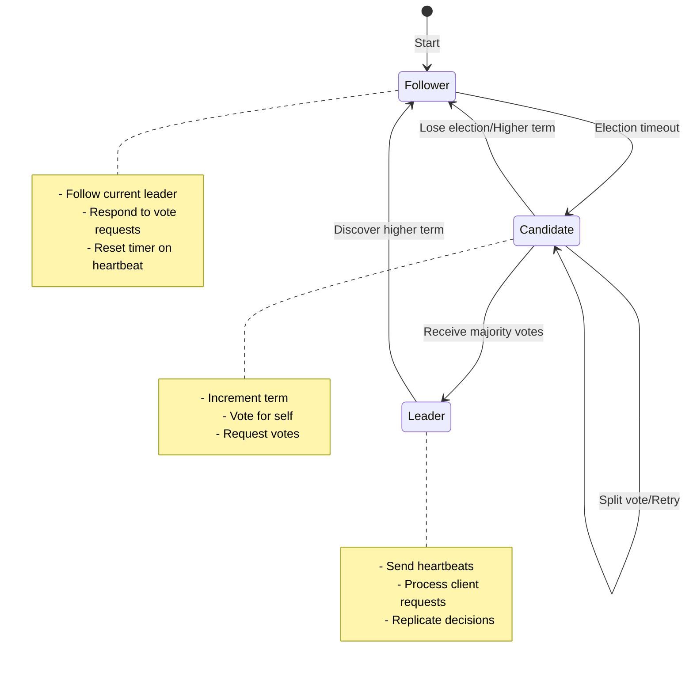

<!-- Navigation -->
[Home](../index.md) → [Part III: Patterns](index.md) → **Leader Election Pattern**

# Leader Election Pattern

**Democracy in distributed systems - Electing a single decision maker to prevent chaos**

> *"In a distributed system, everyone thinks they should be the leader. Leader election ensures only one actually is, and everyone else agrees."*

---

## 🎯 Level 1: Intuition

### The School Class President Analogy

Think of leader election like choosing a class president:

```
🏫 Classroom Election Process:

1. Campaign Period (FOLLOWER state)
   - Everyone is equal
   - Students listen to teachers
   - No one makes class decisions

2. Election Time (CANDIDATE state)
   - Multiple students run for president
   - Each asks for votes
   - Must get majority to win

3. President Elected (LEADER state)
   - One student becomes president
   - Makes decisions for the class
   - Others follow their lead

4. If President Absent (FAILURE)
   - New election automatically starts
   - Vice president might take over temporarily
   - Class continues functioning
```

### Visual Metaphor

```
Distributed System without Leader:     With Leader Election:

🖥️ → 📊 ← 🖥️                          🖥️ ↘
↓     ↕     ↑                                📊 ← 👑🖥️ (Leader)
🖥️ → 📊 ← 🖥️                          🖥️ ↗

Chaos: Everyone updates               Order: Leader coordinates
Result: Conflicts & inconsistency     Result: Consistent decisions
```

### Real-World Examples

| System | What Needs a Leader | Without Leader | With Leader |
|--------|-------------------|----------------|-------------|
| **Database Cluster** | Write operations | Conflicting writes | Consistent updates |
| **Job Scheduler** | Task assignment | Duplicate work | Efficient distribution |
| **Service Registry** | Configuration updates | Stale configs | Synchronized state |
| **Shard Manager** | Data rebalancing | Uneven distribution | Optimal placement |

### Basic Implementation

```python
from enum import Enum
import time
import random

class NodeState(Enum):
    FOLLOWER = "follower"
    CANDIDATE = "candidate"
    LEADER = "leader"

class SimpleLeaderElection:
    def __init__(self, node_id: str, peers: list):
        self.node_id = node_id
        self.peers = peers
        self.state = NodeState.FOLLOWER
        self.current_term = 0
        self.voted_for = None
        self.leader_id = None
        self.last_heartbeat = time.time()
        
    def start_election(self):
        """Become candidate and request votes"""
        self.state = NodeState.CANDIDATE
        self.current_term += 1
        self.voted_for = self.node_id
        
        # Vote for self
        votes = 1
        
        # Request votes from peers
        for peer in self.peers:
            if self.request_vote(peer, self.current_term):
                votes += 1
        
        # Check if won majority
        if votes > len(self.peers) / 2:
            self.become_leader()
        else:
            self.state = NodeState.FOLLOWER
    
    def become_leader(self):
        """Transition to leader state"""
        self.state = NodeState.LEADER
        self.leader_id = self.node_id
        print(f"Node {self.node_id} became leader for term {self.current_term}")
        
        # Start sending heartbeats
        self.send_heartbeats()
    
    def request_vote(self, peer: str, term: int) -> bool:
        """Request vote from a peer (simplified)"""
        # In real implementation, this would be a network call
        # Simplified: 70% chance of getting vote
        return random.random() < 0.7
    
    def send_heartbeats(self):
        """Send heartbeats to maintain leadership"""
        for peer in self.peers:
            # In real implementation, send actual heartbeat message
            print(f"Leader {self.node_id} → heartbeat → {peer}")

# Example usage
nodes = ["node1", "node2", "node3", "node4", "node5"]
leader_election = SimpleLeaderElection("node1", nodes[1:])
leader_election.start_election()
```

---

## 🏗️ Level 2: Foundation

### Core Concepts

#### Election Terms
Each election happens in a numbered term, preventing old messages from causing confusion:

```
Term 1: Node A elected
Term 2: Node A fails, Node B elected  
Term 3: Network partition, Node C elected
Term 4: Partition heals, Node B re-elected
```

#### State Machine



### Consensus Requirements

#### Majority Quorum
```
5 nodes: Need 3 votes to win (⌊5/2⌋ + 1 = 3)
7 nodes: Need 4 votes to win (⌊7/2⌋ + 1 = 4)
9 nodes: Need 5 votes to win (⌊9/2⌋ + 1 = 5)

Why majority?
- Prevents split brain (only one majority possible)
- Tolerates failures (can lose minority and continue)
- Ensures overlap (any two majorities share at least one node)
```

#### Timing Parameters

| Parameter | Purpose | Typical Range | Considerations |
|-----------|---------|---------------|----------------|
| **Election Timeout** | Trigger new election | 150-300ms | Random to prevent split votes |
| **Heartbeat Interval** | Maintain leadership | 50-150ms | < Election timeout / 2 |
| **RPC Timeout** | Network calls | 10-50ms | < Heartbeat interval |
| **Min Election Timeout** | Prevent thrashing | 150ms | > Several RTTs |

### Raft Algorithm Implementation

```python
import asyncio
import random
import time
from enum import Enum
from typing import Dict, List, Optional, Set, Callable
from dataclasses import dataclass, field
import logging
import aioredis
from contextlib import asynccontextmanager

class NodeState(Enum):
    FOLLOWER = "FOLLOWER"
    CANDIDATE = "CANDIDATE"
    LEADER = "LEADER"

@dataclass
class NodeInfo:
    """Information about a node in the cluster"""
    node_id: str
    address: str
    last_seen: float = 0

@dataclass
class Term:
    """Represents an election term"""
    number: int
    leader_id: Optional[str] = None
    voted_for: Optional[str] = None

class LeaderElection:
    """Implements leader election using a Raft-like algorithm"""

    def __init__(self,
                 node_id: str,
                 peers: List[NodeInfo],
                 redis_client: aioredis.Redis,
                 election_timeout_range: tuple = (150, 300),
                 heartbeat_interval: float = 50):
        self.node_id = node_id
        self.peers = {p.node_id: p for p in peers}
        self.redis = redis_client
        self.election_timeout_range = election_timeout_range  # milliseconds
        self.heartbeat_interval = heartbeat_interval  # milliseconds

        self.state = NodeState.FOLLOWER
        self.current_term = Term(0)
        self.leader_id: Optional[str] = None
        self.votes_received: Set[str] = set()

        self.election_timeout = self._random_timeout()
        self.last_heartbeat = time.time() * 1000

        self.leader_callback: Optional[Callable] = None
        self.follower_callback: Optional[Callable] = None

        self.logger = logging.getLogger(f"Election[{node_id}]")
        self._running = False

    def _random_timeout(self) -> float:
        """Generate random election timeout to prevent split votes"""
        return random.uniform(*self.election_timeout_range)

    async def start(self):
        """Start the election process"""
        self._running = True
        self.logger.info(f"Starting election process")

        # Run main loop
        asyncio.create_task(self._election_loop())

        # If leader, run heartbeat loop
        asyncio.create_task(self._heartbeat_loop())

    async def stop(self):
        """Stop the election process"""
        self._running = False

        # Step down if leader
        if self.state == NodeState.LEADER:
            await self._step_down()

    async def _election_loop(self):
        """Main election loop"""
        while self._running:
            try:
                current_time = time.time() * 1000

                if self.state == NodeState.FOLLOWER:
                    # Check for election timeout
                    if current_time - self.last_heartbeat > self.election_timeout:
                        self.logger.info("Election timeout, becoming candidate")
                        await self._become_candidate()

                elif self.state == NodeState.CANDIDATE:
                    # Already handled in become_candidate
                    pass

                await asyncio.sleep(0.01)  # 10ms loop

            except Exception as e:
                self.logger.error(f"Election loop error: {e}")
                await asyncio.sleep(1)

    async def _heartbeat_loop(self):
        """Send heartbeats if leader"""
        while self._running:
            try:
                if self.state == NodeState.LEADER:
                    await self._send_heartbeats()

                await asyncio.sleep(self.heartbeat_interval / 1000)

            except Exception as e:
                self.logger.error(f"Heartbeat error: {e}")

    async def _become_candidate(self):
        """Transition to candidate and start election"""
        self.state = NodeState.CANDIDATE
        self.current_term.number += 1
        self.current_term.voted_for = self.node_id
        self.votes_received = {self.node_id}  # Vote for self
        self.election_timeout = self._random_timeout()

        self.logger.info(f"Became candidate for term {self.current_term.number}")

        # Request votes from all peers
        vote_tasks = []
        for peer_id in self.peers:
            if peer_id != self.node_id:
                vote_tasks.append(self._request_vote(peer_id))

        # Wait for votes
        results = await asyncio.gather(*vote_tasks, return_exceptions=True)

        # Count votes
        for i, peer_id in enumerate(self.peers):
            if peer_id != self.node_id and results[i-1] is True:
                self.votes_received.add(peer_id)

        # Check if won election
        if len(self.votes_received) > len(self.peers) / 2:
            await self._become_leader()
        else:
            # Lost election, revert to follower
            self.logger.info(f"Lost election with {len(self.votes_received)} votes")
            self.state = NodeState.FOLLOWER
            self.last_heartbeat = time.time() * 1000

    async def _request_vote(self, peer_id: str) -> bool:
        """Request vote from a peer"""
        try:
            # Use Redis for communication
            vote_key = f"vote_request:{peer_id}:{self.current_term.number}"
            response_key = f"vote_response:{self.node_id}:{self.current_term.number}"

            # Send vote request
            await self.redis.setex(
                vote_key,
                int(self.election_timeout / 1000),
                self.node_id
            )

            # Wait for response
            start_time = time.time()
            while time.time() - start_time < (self.election_timeout / 1000):
                response = await self.redis.get(response_key)
                if response:
                    await self.redis.delete(response_key)
                    return response == b"yes"
                await asyncio.sleep(0.01)

            return False

        except Exception as e:
            self.logger.error(f"Vote request error: {e}")
            return False

    async def _handle_vote_request(self, candidate_id: str, term: int) -> bool:
        """Handle incoming vote request"""
        # Grant vote if haven't voted in this term
        if term > self.current_term.number:
            self.current_term = Term(term)
            self.state = NodeState.FOLLOWER
            self.last_heartbeat = time.time() * 1000

        if (self.current_term.voted_for is None or
            self.current_term.voted_for == candidate_id):
            self.current_term.voted_for = candidate_id
            return True

        return False

    async def _become_leader(self):
        """Transition to leader state"""
        self.state = NodeState.LEADER
        self.leader_id = self.node_id
        self.current_term.leader_id = self.node_id

        self.logger.info(f"Became leader for term {self.current_term.number}")

        # Notify via callback
        if self.leader_callback:
            await self.leader_callback()

        # Send initial heartbeats
        await self._send_heartbeats()

    async def _send_heartbeats(self):
        """Send heartbeats to all followers"""
        heartbeat_tasks = []

        for peer_id in self.peers:
            if peer_id != self.node_id:
                heartbeat_tasks.append(self._send_heartbeat(peer_id))

        await asyncio.gather(*heartbeat_tasks, return_exceptions=True)

    async def _send_heartbeat(self, peer_id: str):
        """Send heartbeat to specific peer"""
        try:
            heartbeat_key = f"heartbeat:{peer_id}:{self.current_term.number}"

            await self.redis.setex(
                heartbeat_key,
                int(self.heartbeat_interval * 2 / 1000),
                f"{self.node_id}:{time.time()}"
            )

        except Exception as e:
            self.logger.error(f"Heartbeat error to {peer_id}: {e}")

    async def _handle_heartbeat(self, leader_id: str, term: int):
        """Handle incoming heartbeat"""
        if term >= self.current_term.number:
            self.current_term = Term(term, leader_id)
            self.state = NodeState.FOLLOWER
            self.leader_id = leader_id
            self.last_heartbeat = time.time() * 1000

            if self.follower_callback:
                await self.follower_callback(leader_id)

    async def _step_down(self):
        """Step down from leadership"""
        self.logger.info("Stepping down from leadership")
        self.state = NodeState.FOLLOWER
        self.leader_id = None
        self.last_heartbeat = time.time() * 1000

    def is_leader(self) -> bool:
        """Check if this node is the current leader"""
        return self.state == NodeState.LEADER

    def get_leader(self) -> Optional[str]:
        """Get current leader ID"""
        return self.leader_id

class DistributedLock:
    """Distributed lock implementation using leader election"""

    def __init__(self,
                 name: str,
                 node_id: str,
                 redis_client: aioredis.Redis,
                 ttl: int = 30):
        self.name = name
        self.node_id = node_id
        self.redis = redis_client
        self.ttl = ttl
        self._lock_key = f"dlock:{name}"
        self._owner_key = f"dlock:owner:{name}"

    @asynccontextmanager
    async def acquire(self, timeout: float = 10.0):
        """Acquire distributed lock"""
        start_time = time.time()
        acquired = False

        try:
            while time.time() - start_time < timeout:
                # Try to acquire lock
                acquired = await self.redis.set(
                    self._lock_key,
                    self.node_id,
                    nx=True,
                    ex=self.ttl
                )

                if acquired:
                    # Store owner info
                    await self.redis.setex(
                        self._owner_key,
                        self.ttl,
                        f"{self.node_id}:{time.time()}"
                    )
                    break

                # Check if we already own it
                current_owner = await self.redis.get(self._lock_key)
                if current_owner and current_owner.decode() == self.node_id:
                    # Refresh TTL
                    await self.redis.expire(self._lock_key, self.ttl)
                    acquired = True
                    break

                await asyncio.sleep(0.1)

            if not acquired:
                raise TimeoutError(f"Failed to acquire lock {self.name}")

            yield

        finally:
            if acquired:
                # Release lock only if we own it
                await self._release()

    async def _release(self):
        """Release the lock if we own it"""
        current_owner = await self.redis.get(self._lock_key)
        if current_owner and current_owner.decode() == self.node_id:
            await self.redis.delete(self._lock_key, self._owner_key)

class LeaderElectedService:
    """Base class for services that require leader election"""

    def __init__(self,
                 node_id: str,
                 peers: List[NodeInfo],
                 redis_client: aioredis.Redis):
        self.node_id = node_id
        self.election = LeaderElection(node_id, peers, redis_client)
        self.election.leader_callback = self._on_became_leader
        self.election.follower_callback = self._on_became_follower
        self._leader_task: Optional[asyncio.Task] = None
        self.logger = logging.getLogger(f"Service[{node_id}]")

    async def start(self):
        """Start the service"""
        await self.election.start()
        self.logger.info("Service started")

    async def stop(self):
        """Stop the service"""
        if self._leader_task:
            self._leader_task.cancel()
        await self.election.stop()
        self.logger.info("Service stopped")

    async def _on_became_leader(self):
        """Called when this node becomes leader"""
        self.logger.info("Became leader, starting leader tasks")
        if self._leader_task:
            self._leader_task.cancel()
        self._leader_task = asyncio.create_task(self._leader_loop())

    async def _on_became_follower(self, leader_id: str):
        """Called when this node becomes follower"""
        self.logger.info(f"Became follower, leader is {leader_id}")
        if self._leader_task:
            self._leader_task.cancel()
            self._leader_task = None

    async def _leader_loop(self):
        """Override this to implement leader-specific tasks"""
        raise NotImplementedError

# Example: Distributed Job Scheduler
class DistributedScheduler(LeaderElectedService):
    """Job scheduler where only leader schedules jobs"""

    def __init__(self, *args, **kwargs):
        super().__init__(*args, **kwargs)
        self.scheduled_jobs = {}

    async def _leader_loop(self):
        """Leader scheduling loop"""
        while self.election.is_leader():
            try:
                # Get pending jobs from Redis
                jobs = await self._get_pending_jobs()

                for job in jobs:
                    if job['id'] not in self.scheduled_jobs:
                        # Schedule new job
                        task = asyncio.create_task(self._execute_job(job))
                        self.scheduled_jobs[job['id']] = task
                        self.logger.info(f"Scheduled job {job['id']}")

                # Cleanup completed jobs
                completed = []
                for job_id, task in self.scheduled_jobs.items():
                    if task.done():
                        completed.append(job_id)

                for job_id in completed:
                    del self.scheduled_jobs[job_id]

                await asyncio.sleep(1)

            except Exception as e:
                self.logger.error(f"Scheduler error: {e}")
                await asyncio.sleep(1)

    async def _get_pending_jobs(self) -> List[Dict]:
        """Get jobs from queue"""
        # Implementation depends on job storage
        return []

    async def _execute_job(self, job: Dict):
        """Execute a scheduled job"""
        self.logger.info(f"Executing job {job['id']}")
        # Job execution logic here
        await asyncio.sleep(job.get('duration', 1))

# Example: Shard Manager
class ShardManager(LeaderElectedService):
    """Manages shard assignments - only leader rebalances"""

    def __init__(self, *args, total_shards: int = 100, **kwargs):
        super().__init__(*args, **kwargs)
        self.total_shards = total_shards
        self.shard_assignments = {}

    async def _leader_loop(self):
        """Leader shard management loop"""
        while self.election.is_leader():
            try:
                # Get active nodes
                active_nodes = await self._get_active_nodes()

                # Check if rebalancing needed
                if self._needs_rebalancing(active_nodes):
                    new_assignments = self._calculate_assignments(active_nodes)
                    await self._apply_assignments(new_assignments)
                    self.logger.info("Rebalanced shards across nodes")

                await asyncio.sleep(10)  # Check every 10 seconds

            except Exception as e:
                self.logger.error(f"Shard manager error: {e}")
                await asyncio.sleep(10)

    async def _get_active_nodes(self) -> List[str]:
        """Get list of active nodes"""
        # Check heartbeats in Redis
        pattern = "heartbeat:*"
        active = []

        cursor = 0
        while True:
            cursor, keys = await self.redis.scan(cursor, match=pattern)
            for key in keys:
                node_id = key.decode().split(':')[1]
                if node_id not in active:
                    active.append(node_id)

            if cursor == 0:
                break

        return active

    def _needs_rebalancing(self, active_nodes: List[str]) -> bool:
        """Check if shards need rebalancing"""
        if not self.shard_assignments:
            return True

        # Check if nodes changed
        current_nodes = set(self.shard_assignments.values())
        active_set = set(active_nodes)

        return current_nodes != active_set

    def _calculate_assignments(self, nodes: List[str]) -> Dict[int, str]:
        """Calculate optimal shard distribution"""
        assignments = {}
        shards_per_node = self.total_shards // len(nodes)

        for i in range(self.total_shards):
            node_index = i // shards_per_node
            if node_index >= len(nodes):
                node_index = len(nodes) - 1
            assignments[i] = nodes[node_index]

        return assignments

    async def _apply_assignments(self, assignments: Dict[int, str]):
        """Apply new shard assignments"""
        # Store in Redis for all nodes to see
        pipe = self.redis.pipeline()

        for shard, node in assignments.items():
            pipe.hset("shard_assignments", str(shard), node)

        await pipe.execute()
        self.shard_assignments = assignments
```

---

## 🔧 Level 3: Deep Dive

### Advanced Election Scenarios

#### Split Vote Handling
```python
class AdvancedElection:
    def handle_split_vote(self):
        """
        Split vote scenario:
        - 5 nodes: A, B, C, D, E
        - A votes for A, B votes for B
        - C votes for A, D votes for B  
        - E's vote decides, but E is slow
        
        Result: No majority, new election needed
        """
        # Use randomized timeouts to break ties
        self.election_timeout = random.randint(150, 300)
        
        # Exponential backoff on repeated splits
        if self.split_vote_count > 0:
            self.election_timeout *= (2 ** self.split_vote_count)
```

#### Network Partition Scenarios

```
Scenario 1: Clean Partition
[A, B] | [C, D, E]
- Right side elects leader (has majority)
- Left side cannot elect (no majority)
- System remains available

Scenario 2: Complex Partition  
[A, B] | [C] | [D, E]
- No partition has majority
- No leader can be elected
- System unavailable until partition heals

Scenario 3: Intermittent Partition
A ←→ B ←X→ C ←→ D ←→ E
- B-C link flaps
- May cause leadership instability
- Use stable leader preference
```

### Pre-Vote Optimization

```python
class PreVoteElection:
    """Prevent disruption from isolated nodes"""
    
    def should_start_election(self) -> bool:
        """Check if election is likely to succeed"""
        # First do pre-vote phase
        pre_votes = self.request_pre_votes()
        
        # Only start real election if pre-vote succeeds
        if pre_votes > len(self.peers) / 2:
            return True
        
        # Don't disrupt stable leader
        return False
    
    def request_pre_votes(self) -> int:
        """Non-disruptive vote check"""
        votes = 1  # Self vote
        
        for peer in self.peers:
            # Ask: "Would you vote for me?"
            # Without actually incrementing terms
            if peer.would_vote_for(self.node_id, self.current_term + 1):
                votes += 1
        
        return votes
```

### Leadership Transfer

```python
class GracefulLeaderTransfer:
    """Transfer leadership without election"""
    
    def transfer_leadership(self, target_node: str):
        """Gracefully hand over leadership"""
        if self.state != NodeState.LEADER:
            raise Exception("Only leader can transfer")
        
        # 1. Stop accepting new requests
        self.accepting_requests = False
        
        # 2. Ensure target is up-to-date
        self.sync_node(target_node)
        
        # 3. Send TimeoutNow RPC to target
        self.send_timeout_now(target_node)
        
        # 4. Target immediately starts election
        # 5. Others vote for target (it's up-to-date)
        # 6. Leadership transfers smoothly
```

### Joint Consensus for Membership Changes

```python
class MembershipChange:
    """Safe cluster membership changes"""
    
    def add_node(self, new_node: str):
        """Add node using joint consensus"""
        # Phase 1: Joint configuration
        # Old AND new majority required
        self.config = JointConfig(
            old_nodes=self.current_nodes,
            new_nodes=self.current_nodes + [new_node]
        )
        
        # Phase 2: Replicate joint config
        self.replicate_config(self.config)
        
        # Phase 3: Transition to new config
        # Only new majority required
        self.config = NewConfig(self.current_nodes + [new_node])
        self.replicate_config(self.config)
```

---

## 🚀 Level 4: Expert

### Production Case Study: Apache Kafka's Controller Election

Kafka manages metadata for thousands of topics and partitions across hundreds of brokers using controller election.

```python
class KafkaControllerElection:
    """
    Kafka's ZooKeeper-based controller election
    Handling 2M+ partitions at LinkedIn
    """
    
    def __init__(self):
        self.zk_client = ZooKeeperClient()
        self.controller_epoch = 0
        self.partition_states = {}
        
    def elect_controller(self):
        """Kafka's controller election process"""
        controller_path = "/controller"
        
        try:
            # Try to create ephemeral node
            self.zk_client.create(
                controller_path,
                data={
                    "version": 1,
                    "brokerid": self.broker_id,
                    "timestamp": time.time()
                },
                ephemeral=True
            )
            
            # Success - become controller
            self.on_controller_election()
            
        except NodeExistsError:
            # Another broker is controller
            self.on_controller_exists()
    
    def on_controller_election(self):
        """Initialize controller state"""
        # Increment epoch for fencing
        self.controller_epoch += 1
        
        # Load partition assignments
        self.load_partition_states()
        
        # Start failure detection
        self.start_broker_monitoring()
        
        # Begin partition rebalancing
        self.start_partition_rebalancer()
        
        print(f"Broker {self.broker_id} elected as controller")
    
    def handle_broker_failure(self, failed_broker: int):
        """Handle broker failure as controller"""
        affected_partitions = self.get_partitions_on_broker(failed_broker)
        
        for partition in affected_partitions:
            # Elect new leader from ISR
            new_leader = self.elect_partition_leader(
                partition,
                exclude=[failed_broker]
            )
            
            # Update metadata
            self.update_partition_state(
                partition,
                leader=new_leader,
                epoch=self.controller_epoch
            )
            
            # Notify all brokers
            self.broadcast_metadata_update(partition)
```

### Real-World Challenges and Solutions

#### Challenge 1: Controller Hotspot
```python
class ControllerScaling:
    """LinkedIn's solution to controller bottleneck"""
    
    def delegate_partition_management(self):
        """Delegate work to partition coordinators"""
        # Split partitions into groups
        partition_groups = self.shard_partitions()
        
        # Elect coordinator for each group
        for group_id, partitions in partition_groups.items():
            coordinator = self.elect_coordinator(group_id)
            
            # Delegate management
            self.delegate_to_coordinator(
                coordinator,
                partitions,
                operations=['leader_election', 'isr_updates']
            )
```

#### Challenge 2: ZooKeeper Dependency
```python
class KRaftMode:
    """Kafka's new built-in consensus (KIP-500)"""
    
    def __init__(self):
        self.metadata_log = MetadataLog()
        self.raft_manager = RaftManager()
        
    def elect_without_zookeeper(self):
        """Use Raft for controller election"""
        # Controllers form Raft quorum
        if self.is_controller_eligible():
            self.raft_manager.join_quorum()
            
            # Participate in Raft election
            if self.raft_manager.become_candidate():
                votes = self.raft_manager.request_votes()
                
                if votes > self.quorum_size / 2:
                    self.become_active_controller()
```

### Production Monitoring

```python
class LeaderElectionMetrics:
    """Production monitoring for leader election"""
    
    def __init__(self):
        self.metrics = PrometheusClient()
        
    def track_election_metrics(self):
        # Election frequency
        self.metrics.counter(
            'leader_elections_total',
            labels={'cluster': self.cluster_name}
        )
        
        # Election duration
        self.metrics.histogram(
            'election_duration_seconds',
            duration,
            labels={'result': 'success' if elected else 'failed'}
        )
        
        # Leadership stability
        self.metrics.gauge(
            'leader_stable_seconds',
            time.time() - self.leader_elected_time
        )
        
        # Split brain detection
        self.metrics.gauge(
            'active_leaders_count',
            self.count_active_leaders(),
            labels={'expected': 1}
        )

# Alert configuration
alerts:
  - name: FrequentLeaderElections
    expr: rate(leader_elections_total[5m]) > 0.1
    message: "Too many leader elections (>1 per 10min)"
    
  - name: NoLeaderElected  
    expr: active_leaders_count != 1
    for: 2m
    message: "No leader or split brain detected"
```

---

## 🎯 Level 5: Mastery

### Theoretical Foundations

#### FLP Impossibility Result
```python
class FLPImpossibility:
    """
    Fischer-Lynch-Paterson (1985):
    Cannot guarantee both safety and liveness
    in asynchronous systems with failures
    """
    
    def demonstrate_flp(self):
        """
        In async system, cannot distinguish between:
        1. Slow node (will respond eventually)
        2. Failed node (will never respond)
        
        Therefore must choose:
        - Safety: Never elect two leaders (may get stuck)
        - Liveness: Always elect leader (may get split brain)
        """
        
        # Practical solution: Assume partial synchrony
        # Use timeouts as failure detectors
        # Accept that they may be wrong sometimes
```

#### Paxos vs Raft

```python
class ConsensusComparison:
    """
    Comparing consensus algorithms for leader election
    """
    
    def paxos_approach(self):
        """
        Paxos: More general but complex
        - Separate roles (proposers, acceptors, learners)
        - Can make progress with competing proposals
        - Harder to understand and implement
        """
        phase1_promises = self.send_prepare(proposal_number)
        if len(phase1_promises) > self.quorum_size:
            phase2_accepts = self.send_accept(value)
            
    def raft_approach(self):
        """
        Raft: Designed for understandability
        - Strong leader (all decisions through leader)
        - Terms prevent old leaders
        - Log-based replication built-in
        """
        if self.election_timeout_elapsed():
            self.current_term += 1
            votes = self.request_votes()
            if votes > len(self.nodes) / 2:
                self.become_leader()
```

### Advanced Optimizations

#### Hierarchical Leader Election
```python
class HierarchicalElection:
    """
    Multi-level election for massive scale
    Used in Microsoft Azure Cosmos DB
    """
    
    def __init__(self):
        self.local_leaders = {}  # Per-datacenter
        self.regional_leaders = {}  # Per-region
        self.global_leader = None  # Cross-region
        
    def elect_hierarchy(self):
        """Bottom-up leader election"""
        # Level 1: Elect within datacenter
        for dc in self.datacenters:
            local_leader = self.elect_local_leader(dc)
            self.local_leaders[dc] = local_leader
        
        # Level 2: Elect within region
        for region in self.regions:
            regional_leader = self.elect_regional_leader(
                region,
                candidates=[self.local_leaders[dc] 
                           for dc in region.datacenters]
            )
            self.regional_leaders[region] = regional_leader
        
        # Level 3: Elect global leader
        self.global_leader = self.elect_global_leader(
            candidates=list(self.regional_leaders.values())
        )
```

#### Witness Nodes for Quorum
```python
class WitnessBasedElection:
    """
    Using witness nodes to maintain odd numbers
    Common in database clusters
    """
    
    def setup_witnesses(self):
        """
        Witnesses:
        - Participate in voting only
        - Don't store data
        - Lightweight (can run on small instances)
        - Prevent split brain in even-numbered clusters
        """
        
        # 2 data nodes + 1 witness = 3 voting members
        # Can lose 1 member and maintain quorum
        # Much cheaper than 3 full data nodes
```

### Economic Impact

```python
class LeaderElectionEconomics:
    """Calculate economic impact of leader election"""
    
    def calculate_roi(self, system_metrics: dict) -> dict:
        # Without leader election
        conflict_cost = (
            system_metrics['conflicts_per_day'] * 
            system_metrics['resolution_time_hours'] * 
            system_metrics['engineer_hourly_rate']
        )
        
        inconsistency_cost = (
            system_metrics['inconsistency_incidents'] * 
            system_metrics['incident_impact']
        )
        
        # With leader election
        implementation_cost = 80 * system_metrics['engineer_hourly_rate']
        operation_cost = (
            system_metrics['election_frequency'] * 
            system_metrics['election_downtime_seconds'] * 
            system_metrics['downtime_cost_per_second']
        )
        
        annual_savings = (
            (conflict_cost + inconsistency_cost) * 365 -
            (implementation_cost + operation_cost * 365)
        )
        
        return {
            'annual_savings': annual_savings,
            'break_even_days': implementation_cost / (annual_savings / 365),
            'split_brain_prevention': 'Priceless'
        }
```

### Future Directions

1. **Byzantine Fault Tolerant Elections**
   - Handle malicious nodes
   - Cryptographic voting
   - Used in blockchain consensus

2. **Machine Learning Enhanced**
   - Predict leader failures
   - Optimize election timing
   - Auto-tune parameters

3. **Quantum-Resistant Elections**
   - Post-quantum cryptography
   - Quantum-safe voting protocols
   - Future-proof consensus

---

## 📊 Analysis & Trade-offs

### Axiom Relationships

| Axiom | How Leader Election Addresses It |
|-------|----------------------------------|
| **Latency** | Leader decisions avoid coordination delay |
| **Capacity** | Single leader prevents resource conflicts |
| **Failure** | Automatic failover on leader failure |
| **Concurrency** | Serializes decisions through leader |
| **Coordination** | Consensus protocol ensures agreement |
| **Observability** | Clear leader identity aids debugging |
| **Human Interface** | Simple mental model of single decider |
| **Economics** | Reduces coordination overhead costs |

### Trade-off Analysis

| Aspect | Gains | Losses |
|--------|-------|--------|
| **Consistency** | Strong coordination | Single point of failure |
| **Performance** | No coordination overhead | Leader bottleneck |
| **Availability** | Automatic failover | Election downtime |
| **Complexity** | Centralized decisions | Election protocol complexity |

### Common Pitfalls

1. **Split Brain Scenarios**
   - **Problem**: Network partition creates multiple leaders
   - **Solution**: Majority quorum requirement

2. **Leader Bottleneck**
   - **Problem**: All decisions go through one node
   - **Solution**: Delegate read operations to followers

3. **Cascading Elections**
   - **Problem**: Flapping leader causes repeated elections
   - **Solution**: Randomized timeouts, minimum leader time

4. **Clock Synchronization**
   - **Problem**: Timeout calculations assume synchronized clocks
   - **Solution**: Use logical clocks, generous timeouts

5. **Byzantine Failures**
   - **Problem**: Malicious nodes disrupt elections
   - **Solution**: Use Byzantine fault-tolerant protocols

---

## 🔧 Practical Considerations

### Configuration Guidelines

| Parameter | Description | Typical Range | Default |
|-----------|-------------|---------------|---------|
| **Election Timeout** | Time before starting election | 150-300ms | 200ms |
| **Heartbeat Interval** | Leader pulse frequency | 30-100ms | 50ms |
| **Majority Size** | Nodes needed to win | (n/2)+1 | - |
| **Term Duration** | Minimum leader tenure | 5-60s | 30s |

### Monitoring & Metrics

| Metric | What It Tells You | Alert Threshold |
|--------|-------------------|-----------------|
| **Election Frequency** | System stability | > 1/minute |
| **Leader Changes** | Failover rate | > 5/hour |
| **Election Duration** | Convergence time | > 5 seconds |
| **Split Brain Events** | Protocol violations | Any occurrence |

### Integration Patterns

How leader election works with other patterns:
- **With Sharding**: Leader assigns shards to nodes
- **With Saga Pattern**: Leader coordinates saga execution
- **With Distributed Lock**: Leader holds global locks
- **With Work Queue**: Leader distributes work items

---

## 🚀 Real-World Examples

### Example 1: Apache Kafka Controller
- **Challenge**: Manage partition leaders across brokers
- **Implementation**:
  - ZooKeeper-based leader election
  - Controller broker manages all metadata
  - Automatic failover on controller failure
- **Results**:
  - Consistent partition management
  - Fast leader failover (<5 seconds)
  - Simplified operational model

### Example 2: Kubernetes Controller Manager
- **Challenge**: Ensure only one controller modifies cluster state
- **Implementation**:
  - Leader election using ConfigMap/Lease
  - Active controller holds lease
  - Standby controllers wait
- **Results**:
  - No conflicting cluster modifications
  - High availability control plane
  - Clear operational responsibility

---

## 🎓 Key Takeaways

1. **Core Insight**: Leader election trades distributed complexity for a single coordination point
2. **When It Shines**: Centralized decision making, resource allocation, preventing conflicts
3. **What to Watch**: Leader bottlenecks, election storms, network partitions
4. **Remember**: A good leader election protocol is invisible when working, obvious when needed

---

---

*"In distributed systems, leadership is not about power—it's about responsibility for coordination."*

---

**Previous**: [← Idempotent Receiver Pattern](idempotent-receiver.md) | **Next**: [Load Balancing Pattern →](load-balancing.md)
## 📋 Quick Reference

### Decision Framework

| Question | Yes → Use Leader Election | No → Alternative |
|----------|--------------------------|------------------|
| Need single coordinator? | ✅ Essential pattern | ⚠️ Use distributed approach |
| Preventing split-brain? | ✅ Critical requirement | ⚠️ Consider eventual consistency |
| Resource allocation? | ✅ Leader assigns resources | ⚠️ Use work stealing |
| Configuration management? | ✅ Leader pushes updates | ⚠️ Use gossip protocol |
| Ordering guarantees? | ✅ Leader sequences operations | ⚠️ Use vector clocks |

### Implementation Checklist

- [ ] Choose consensus algorithm (Raft recommended)
- [ ] Set up majority quorum (odd number of nodes)
- [ ] Configure election timeouts (150-300ms)
- [ ] Implement heartbeat mechanism
- [ ] Add pre-vote optimization
- [ ] Handle network partitions
- [ ] Set up monitoring and alerts
- [ ] Test split-brain scenarios
- [ ] Document failover procedures
- [ ] Plan capacity for witness nodes

### Common Anti-Patterns

1. **Even number of nodes** - Can't form majority
2. **Too short timeouts** - Constant elections
3. **No pre-vote** - Disrupts stable clusters
4. **Ignoring clock skew** - Incorrect timeout calculations
5. **Single leader dependency** - No read scaling
