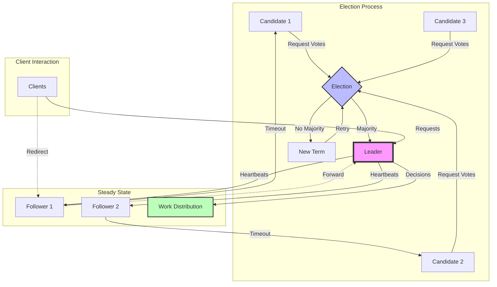

<!-- Navigation -->
[Home](/) → [Part III: Patterns](/patterns/) → **Leader Election Pattern**

# Leader Election Pattern

**Coordinate distributed decisions through democratic consensus - One leader to rule them all**

> *"In a distributed system, everyone thinks they should be the leader. Leader election ensures only one actually is."*

---

## 🎯 Pattern Overview

### The Problem
Many distributed operations require a single coordinator:
- **Resource allocation**: Who assigns work to workers?
- **Scheduling**: Who decides when jobs run?
- **Configuration updates**: Who pushes new settings?
- **Shard management**: Who rebalances data?

Without coordination:
- Multiple nodes make conflicting decisions
- Resources get double-allocated
- Work gets duplicated or missed
- Split-brain scenarios cause havoc
- System behavior becomes unpredictable

### The Solution
Implement a leader election protocol where:
- **One leader emerges** from a group of candidates
- **Automatic failover** when the leader fails
- **Consensus prevents split-brain** scenarios
- **Followers redirect** coordination tasks to leader
- **Leadership can transfer** gracefully

### When to Use

| ✅ Use When | ❌ Don't Use When |
|-------------|-------------------|
| • Need single point of coordination | • All nodes can work independently |
| • Centralized decision making required | • Eventual consistency is acceptable |
| • Resource allocation/scheduling | • Single leader becomes bottleneck |
| • Preventing duplicate work | • Leader failure blocks system |
| • Maintaining global view | • Coordination overhead too high |

---

## 🏗️ Architecture & Implementation

### Conceptual Model



### Key Components

| Component | Purpose | Responsibilities |
|-----------|---------|------------------|
| **Election Protocol** | Choose leader fairly | • Prevent split-brain<br>• Handle network partitions<br>• Ensure single leader<br>• Manage term numbers |
| **Leader** | Coordinate system | • Make decisions<br>• Send heartbeats<br>• Handle client requests<br>• Maintain authority |
| **Followers** | Support leader | • Respond to heartbeats<br>• Forward requests<br>• Participate in elections<br>• Monitor leader health |
| **State Machine** | Track node state | • Leader/Follower/Candidate<br>• Current term<br>• Voted for tracking<br>• Election timeout |
| **Client Library** | Handle redirects | • Find current leader<br>• Retry on leader change<br>• Handle failures gracefully |

### Implementation Example

```python
import asyncio
import random
import time
from enum import Enum
from typing import Dict, List, Optional, Set, Callable
from dataclasses import dataclass, field
import logging
import aioredis
from contextlib import asynccontextmanager

class NodeState(Enum):
    FOLLOWER = "FOLLOWER"
    CANDIDATE = "CANDIDATE"
    LEADER = "LEADER"

@dataclass
class NodeInfo:
    """Information about a node in the cluster"""
    node_id: str
    address: str
    last_seen: float = 0

@dataclass
class Term:
    """Represents an election term"""
    number: int
    leader_id: Optional[str] = None
    voted_for: Optional[str] = None

class LeaderElection:
    """Implements leader election using a Raft-like algorithm"""

    def __init__(self,
                 node_id: str,
                 peers: List[NodeInfo],
                 redis_client: aioredis.Redis,
                 election_timeout_range: tuple = (150, 300),
                 heartbeat_interval: float = 50):
        self.node_id = node_id
        self.peers = {p.node_id: p for p in peers}
        self.redis = redis_client
        self.election_timeout_range = election_timeout_range  # milliseconds
        self.heartbeat_interval = heartbeat_interval  # milliseconds

        self.state = NodeState.FOLLOWER
        self.current_term = Term(0)
        self.leader_id: Optional[str] = None
        self.votes_received: Set[str] = set()

        self.election_timeout = self._random_timeout()
        self.last_heartbeat = time.time() * 1000

        self.leader_callback: Optional[Callable] = None
        self.follower_callback: Optional[Callable] = None

        self.logger = logging.getLogger(f"Election[{node_id}]")
        self._running = False

    def _random_timeout(self) -> float:
        """Generate random election timeout to prevent split votes"""
        return random.uniform(*self.election_timeout_range)

    async def start(self):
        """Start the election process"""
        self._running = True
        self.logger.info(f"Starting election process")

        # Run main loop
        asyncio.create_task(self._election_loop())

        # If leader, run heartbeat loop
        asyncio.create_task(self._heartbeat_loop())

    async def stop(self):
        """Stop the election process"""
        self._running = False

        # Step down if leader
        if self.state == NodeState.LEADER:
            await self._step_down()

    async def _election_loop(self):
        """Main election loop"""
        while self._running:
            try:
                current_time = time.time() * 1000

                if self.state == NodeState.FOLLOWER:
                    # Check for election timeout
                    if current_time - self.last_heartbeat > self.election_timeout:
                        self.logger.info("Election timeout, becoming candidate")
                        await self._become_candidate()

                elif self.state == NodeState.CANDIDATE:
                    # Already handled in become_candidate
                    pass

                await asyncio.sleep(0.01)  # 10ms loop

            except Exception as e:
                self.logger.error(f"Election loop error: {e}")
                await asyncio.sleep(1)

    async def _heartbeat_loop(self):
        """Send heartbeats if leader"""
        while self._running:
            try:
                if self.state == NodeState.LEADER:
                    await self._send_heartbeats()

                await asyncio.sleep(self.heartbeat_interval / 1000)

            except Exception as e:
                self.logger.error(f"Heartbeat error: {e}")

    async def _become_candidate(self):
        """Transition to candidate and start election"""
        self.state = NodeState.CANDIDATE
        self.current_term.number += 1
        self.current_term.voted_for = self.node_id
        self.votes_received = {self.node_id}  # Vote for self
        self.election_timeout = self._random_timeout()

        self.logger.info(f"Became candidate for term {self.current_term.number}")

        # Request votes from all peers
        vote_tasks = []
        for peer_id in self.peers:
            if peer_id != self.node_id:
                vote_tasks.append(self._request_vote(peer_id))

        # Wait for votes
        results = await asyncio.gather(*vote_tasks, return_exceptions=True)

        # Count votes
        for i, peer_id in enumerate(self.peers):
            if peer_id != self.node_id and results[i-1] is True:
                self.votes_received.add(peer_id)

        # Check if won election
        if len(self.votes_received) > len(self.peers) / 2:
            await self._become_leader()
        else:
            # Lost election, revert to follower
            self.logger.info(f"Lost election with {len(self.votes_received)} votes")
            self.state = NodeState.FOLLOWER
            self.last_heartbeat = time.time() * 1000

    async def _request_vote(self, peer_id: str) -> bool:
        """Request vote from a peer"""
        try:
            # Use Redis for communication
            vote_key = f"vote_request:{peer_id}:{self.current_term.number}"
            response_key = f"vote_response:{self.node_id}:{self.current_term.number}"

            # Send vote request
            await self.redis.setex(
                vote_key,
                int(self.election_timeout / 1000),
                self.node_id
            )

            # Wait for response
            start_time = time.time()
            while time.time() - start_time < (self.election_timeout / 1000):
                response = await self.redis.get(response_key)
                if response:
                    await self.redis.delete(response_key)
                    return response == b"yes"
                await asyncio.sleep(0.01)

            return False

        except Exception as e:
            self.logger.error(f"Vote request error: {e}")
            return False

    async def _handle_vote_request(self, candidate_id: str, term: int) -> bool:
        """Handle incoming vote request"""
        # Grant vote if haven't voted in this term
        if term > self.current_term.number:
            self.current_term = Term(term)
            self.state = NodeState.FOLLOWER
            self.last_heartbeat = time.time() * 1000

        if (self.current_term.voted_for is None or
            self.current_term.voted_for == candidate_id):
            self.current_term.voted_for = candidate_id
            return True

        return False

    async def _become_leader(self):
        """Transition to leader state"""
        self.state = NodeState.LEADER
        self.leader_id = self.node_id
        self.current_term.leader_id = self.node_id

        self.logger.info(f"Became leader for term {self.current_term.number}")

        # Notify via callback
        if self.leader_callback:
            await self.leader_callback()

        # Send initial heartbeats
        await self._send_heartbeats()

    async def _send_heartbeats(self):
        """Send heartbeats to all followers"""
        heartbeat_tasks = []

        for peer_id in self.peers:
            if peer_id != self.node_id:
                heartbeat_tasks.append(self._send_heartbeat(peer_id))

        await asyncio.gather(*heartbeat_tasks, return_exceptions=True)

    async def _send_heartbeat(self, peer_id: str):
        """Send heartbeat to specific peer"""
        try:
            heartbeat_key = f"heartbeat:{peer_id}:{self.current_term.number}"

            await self.redis.setex(
                heartbeat_key,
                int(self.heartbeat_interval * 2 / 1000),
                f"{self.node_id}:{time.time()}"
            )

        except Exception as e:
            self.logger.error(f"Heartbeat error to {peer_id}: {e}")

    async def _handle_heartbeat(self, leader_id: str, term: int):
        """Handle incoming heartbeat"""
        if term >= self.current_term.number:
            self.current_term = Term(term, leader_id)
            self.state = NodeState.FOLLOWER
            self.leader_id = leader_id
            self.last_heartbeat = time.time() * 1000

            if self.follower_callback:
                await self.follower_callback(leader_id)

    async def _step_down(self):
        """Step down from leadership"""
        self.logger.info("Stepping down from leadership")
        self.state = NodeState.FOLLOWER
        self.leader_id = None
        self.last_heartbeat = time.time() * 1000

    def is_leader(self) -> bool:
        """Check if this node is the current leader"""
        return self.state == NodeState.LEADER

    def get_leader(self) -> Optional[str]:
        """Get current leader ID"""
        return self.leader_id

class DistributedLock:
    """Distributed lock implementation using leader election"""

    def __init__(self,
                 name: str,
                 node_id: str,
                 redis_client: aioredis.Redis,
                 ttl: int = 30):
        self.name = name
        self.node_id = node_id
        self.redis = redis_client
        self.ttl = ttl
        self._lock_key = f"dlock:{name}"
        self._owner_key = f"dlock:owner:{name}"

    @asynccontextmanager
    async def acquire(self, timeout: float = 10.0):
        """Acquire distributed lock"""
        start_time = time.time()
        acquired = False

        try:
            while time.time() - start_time < timeout:
                # Try to acquire lock
                acquired = await self.redis.set(
                    self._lock_key,
                    self.node_id,
                    nx=True,
                    ex=self.ttl
                )

                if acquired:
                    # Store owner info
                    await self.redis.setex(
                        self._owner_key,
                        self.ttl,
                        f"{self.node_id}:{time.time()}"
                    )
                    break

                # Check if we already own it
                current_owner = await self.redis.get(self._lock_key)
                if current_owner and current_owner.decode() == self.node_id:
                    # Refresh TTL
                    await self.redis.expire(self._lock_key, self.ttl)
                    acquired = True
                    break

                await asyncio.sleep(0.1)

            if not acquired:
                raise TimeoutError(f"Failed to acquire lock {self.name}")

            yield

        finally:
            if acquired:
                # Release lock only if we own it
                await self._release()

    async def _release(self):
        """Release the lock if we own it"""
        current_owner = await self.redis.get(self._lock_key)
        if current_owner and current_owner.decode() == self.node_id:
            await self.redis.delete(self._lock_key, self._owner_key)

class LeaderElectedService:
    """Base class for services that require leader election"""

    def __init__(self,
                 node_id: str,
                 peers: List[NodeInfo],
                 redis_client: aioredis.Redis):
        self.node_id = node_id
        self.election = LeaderElection(node_id, peers, redis_client)
        self.election.leader_callback = self._on_became_leader
        self.election.follower_callback = self._on_became_follower
        self._leader_task: Optional[asyncio.Task] = None
        self.logger = logging.getLogger(f"Service[{node_id}]")

    async def start(self):
        """Start the service"""
        await self.election.start()
        self.logger.info("Service started")

    async def stop(self):
        """Stop the service"""
        if self._leader_task:
            self._leader_task.cancel()
        await self.election.stop()
        self.logger.info("Service stopped")

    async def _on_became_leader(self):
        """Called when this node becomes leader"""
        self.logger.info("Became leader, starting leader tasks")
        if self._leader_task:
            self._leader_task.cancel()
        self._leader_task = asyncio.create_task(self._leader_loop())

    async def _on_became_follower(self, leader_id: str):
        """Called when this node becomes follower"""
        self.logger.info(f"Became follower, leader is {leader_id}")
        if self._leader_task:
            self._leader_task.cancel()
            self._leader_task = None

    async def _leader_loop(self):
        """Override this to implement leader-specific tasks"""
        raise NotImplementedError

# Example: Distributed Job Scheduler
class DistributedScheduler(LeaderElectedService):
    """Job scheduler where only leader schedules jobs"""

    def __init__(self, *args, **kwargs):
        super().__init__(*args, **kwargs)
        self.scheduled_jobs = {}

    async def _leader_loop(self):
        """Leader scheduling loop"""
        while self.election.is_leader():
            try:
                # Get pending jobs from Redis
                jobs = await self._get_pending_jobs()

                for job in jobs:
                    if job['id'] not in self.scheduled_jobs:
                        # Schedule new job
                        task = asyncio.create_task(self._execute_job(job))
                        self.scheduled_jobs[job['id']] = task
                        self.logger.info(f"Scheduled job {job['id']}")

                # Cleanup completed jobs
                completed = []
                for job_id, task in self.scheduled_jobs.items():
                    if task.done():
                        completed.append(job_id)

                for job_id in completed:
                    del self.scheduled_jobs[job_id]

                await asyncio.sleep(1)

            except Exception as e:
                self.logger.error(f"Scheduler error: {e}")
                await asyncio.sleep(1)

    async def _get_pending_jobs(self) -> List[Dict]:
        """Get jobs from queue"""
        # Implementation depends on job storage
        return []

    async def _execute_job(self, job: Dict):
        """Execute a scheduled job"""
        self.logger.info(f"Executing job {job['id']}")
        # Job execution logic here
        await asyncio.sleep(job.get('duration', 1))

# Example: Shard Manager
class ShardManager(LeaderElectedService):
    """Manages shard assignments - only leader rebalances"""

    def __init__(self, *args, total_shards: int = 100, **kwargs):
        super().__init__(*args, **kwargs)
        self.total_shards = total_shards
        self.shard_assignments = {}

    async def _leader_loop(self):
        """Leader shard management loop"""
        while self.election.is_leader():
            try:
                # Get active nodes
                active_nodes = await self._get_active_nodes()

                # Check if rebalancing needed
                if self._needs_rebalancing(active_nodes):
                    new_assignments = self._calculate_assignments(active_nodes)
                    await self._apply_assignments(new_assignments)
                    self.logger.info("Rebalanced shards across nodes")

                await asyncio.sleep(10)  # Check every 10 seconds

            except Exception as e:
                self.logger.error(f"Shard manager error: {e}")
                await asyncio.sleep(10)

    async def _get_active_nodes(self) -> List[str]:
        """Get list of active nodes"""
        # Check heartbeats in Redis
        pattern = "heartbeat:*"
        active = []

        cursor = 0
        while True:
            cursor, keys = await self.redis.scan(cursor, match=pattern)
            for key in keys:
                node_id = key.decode().split(':')[1]
                if node_id not in active:
                    active.append(node_id)

            if cursor == 0:
                break

        return active

    def _needs_rebalancing(self, active_nodes: List[str]) -> bool:
        """Check if shards need rebalancing"""
        if not self.shard_assignments:
            return True

        # Check if nodes changed
        current_nodes = set(self.shard_assignments.values())
        active_set = set(active_nodes)

        return current_nodes != active_set

    def _calculate_assignments(self, nodes: List[str]) -> Dict[int, str]:
        """Calculate optimal shard distribution"""
        assignments = {}
        shards_per_node = self.total_shards // len(nodes)

        for i in range(self.total_shards):
            node_index = i // shards_per_node
            if node_index >= len(nodes):
                node_index = len(nodes) - 1
            assignments[i] = nodes[node_index]

        return assignments

    async def _apply_assignments(self, assignments: Dict[int, str]):
        """Apply new shard assignments"""
        # Store in Redis for all nodes to see
        pipe = self.redis.pipeline()

        for shard, node in assignments.items():
            pipe.hset("shard_assignments", str(shard), node)

        await pipe.execute()
        self.shard_assignments = assignments
```

---

## 📊 Analysis & Trade-offs

### Axiom Relationships

| Axiom | How Leader Election Addresses It |
|-------|----------------------------------|
| **Latency** | Leader decisions avoid coordination delay |
| **Capacity** | Single leader prevents resource conflicts |
| **Failure** | Automatic failover on leader failure |
| **Concurrency** | Serializes decisions through leader |
| **Coordination** | Consensus protocol ensures agreement |
| **Observability** | Clear leader identity aids debugging |
| **Human Interface** | Simple mental model of single decider |
| **Economics** | Reduces coordination overhead costs |

### Trade-off Analysis

| Aspect | Gains | Losses |
|--------|-------|--------|
| **Consistency** | Strong coordination | Single point of failure |
| **Performance** | No coordination overhead | Leader bottleneck |
| **Availability** | Automatic failover | Election downtime |
| **Complexity** | Centralized decisions | Election protocol complexity |

### Common Pitfalls

1. **Split Brain Scenarios**
   - **Problem**: Network partition creates multiple leaders
   - **Solution**: Majority quorum requirement

2. **Leader Bottleneck**
   - **Problem**: All decisions go through one node
   - **Solution**: Delegate read operations to followers

3. **Cascading Elections**
   - **Problem**: Flapping leader causes repeated elections
   - **Solution**: Randomized timeouts, minimum leader time

4. **Clock Synchronization**
   - **Problem**: Timeout calculations assume synchronized clocks
   - **Solution**: Use logical clocks, generous timeouts

5. **Byzantine Failures**
   - **Problem**: Malicious nodes disrupt elections
   - **Solution**: Use Byzantine fault-tolerant protocols

---

## 🔧 Practical Considerations

### Configuration Guidelines

| Parameter | Description | Typical Range | Default |
|-----------|-------------|---------------|---------|
| **Election Timeout** | Time before starting election | 150-300ms | 200ms |
| **Heartbeat Interval** | Leader pulse frequency | 30-100ms | 50ms |
| **Majority Size** | Nodes needed to win | (n/2)+1 | - |
| **Term Duration** | Minimum leader tenure | 5-60s | 30s |

### Monitoring & Metrics

| Metric | What It Tells You | Alert Threshold |
|--------|-------------------|-----------------|
| **Election Frequency** | System stability | > 1/minute |
| **Leader Changes** | Failover rate | > 5/hour |
| **Election Duration** | Convergence time | > 5 seconds |
| **Split Brain Events** | Protocol violations | Any occurrence |

### Integration Patterns

How leader election works with other patterns:
- **With Sharding**: Leader assigns shards to nodes
- **With Saga Pattern**: Leader coordinates saga execution
- **With Distributed Lock**: Leader holds global locks
- **With Work Queue**: Leader distributes work items

---

## 🚀 Real-World Examples

### Example 1: Apache Kafka Controller
- **Challenge**: Manage partition leaders across brokers
- **Implementation**:
  - ZooKeeper-based leader election
  - Controller broker manages all metadata
  - Automatic failover on controller failure
- **Results**:
  - Consistent partition management
  - Fast leader failover (<5 seconds)
  - Simplified operational model

### Example 2: Kubernetes Controller Manager
- **Challenge**: Ensure only one controller modifies cluster state
- **Implementation**:
  - Leader election using ConfigMap/Lease
  - Active controller holds lease
  - Standby controllers wait
- **Results**:
  - No conflicting cluster modifications
  - High availability control plane
  - Clear operational responsibility

---

## 🎓 Key Takeaways

1. **Core Insight**: Leader election trades distributed complexity for a single coordination point
2. **When It Shines**: Centralized decision making, resource allocation, preventing conflicts
3. **What to Watch**: Leader bottlenecks, election storms, network partitions
4. **Remember**: A good leader election protocol is invisible when working, obvious when needed

---

---

*"In distributed systems, leadership is not about power—it's about responsibility for coordination."*

---

**Previous**: [← Idempotent Receiver Pattern](idempotent-receiver.md) | **Next**: [Load Balancing Pattern →](load-balancing.md)
## 💻 Code Sample

### Basic Implementation

```python
class Leader_ElectionPattern:
    def __init__(self, config):
        self.config = config
        self.metrics = Metrics()
        self.state = "ACTIVE"

    def process(self, request):
        """Main processing logic with pattern protection"""
        if not self._is_healthy():
            return self._fallback(request)

        try:
            result = self._protected_operation(request)
            self._record_success()
            return result
        except Exception as e:
            self._record_failure(e)
            return self._fallback(request)

    def _is_healthy(self):
        """Check if the protected resource is healthy"""
        return self.metrics.error_rate < self.config.threshold

    def _protected_operation(self, request):
        """The operation being protected by this pattern"""
        # Implementation depends on specific use case
        pass

    def _fallback(self, request):
        """Fallback behavior when protection activates"""
        return {"status": "fallback", "message": "Service temporarily unavailable"}

    def _record_success(self):
        self.metrics.record_success()

    def _record_failure(self, error):
        self.metrics.record_failure(error)

# Usage example
pattern = Leader_ElectionPattern(config)
result = pattern.process(user_request)
```

### Configuration Example

```yaml
leader_election:
  enabled: true
  thresholds:
    failure_rate: 50%
    response_time: 5s
    error_count: 10
  timeouts:
    operation: 30s
    recovery: 60s
  fallback:
    enabled: true
    strategy: "cached_response"
  monitoring:
    metrics_enabled: true
    health_check_interval: 30s
```

### Testing the Implementation

```python
def test_leader_election_behavior():
    pattern = Leader_ElectionPattern(test_config)

    # Test normal operation
    result = pattern.process(normal_request)
    assert result['status'] == 'success'

    # Test failure handling
    with mock.patch('external_service.call', side_effect=Exception):
        result = pattern.process(failing_request)
        assert result['status'] == 'fallback'

    # Test recovery
    result = pattern.process(normal_request)
    assert result['status'] == 'success'
```
