<!-- Navigation -->
[Home](../index.md) → [Part III: Patterns](index.md) → **Leader Election Pattern**

# Leader Election Pattern

**Distributed coordination pattern for selecting a single node to perform critical operations and avoid split-brain scenarios**

> *"In a distributed system, everyone thinks they should be the leader. Leader election ensures only one actually is, and everyone else agrees."*

---

## 🎯 Level 1: Intuition

### Core Concept

Leader election ensures exactly one node in a distributed system has the authority to make decisions, preventing conflicts and maintaining consistency:

```
Without Leader:                       With Leader Election:
🖥️ → 📊 ← 🖥️                          🖥️ ↘
↓     ↕     ↑                                📊 ← 👑🖥️ (Leader)
🖥️ → 📊 ← 🖥️                          🖥️ ↗

Chaos: Conflicts                      Order: Coordinated decisions
```

### Real-World Examples

| System | Leader Responsibility | Benefit |
|--------|---------------------|----------|
| **Database Cluster** | Write coordination | Consistent updates |
| **Job Scheduler** | Task assignment | No duplicate work |
| **Service Registry** | Config updates | Synchronized state |
| **Shard Manager** | Data rebalancing | Optimal placement |

### Basic Implementation


### Election Process Visualization


---

## 🏗️ Level 2: Foundation

### Core Concepts

#### Election Terms
Each election happens in a numbered term to prevent stale messages:

```
Term 1: Node A elected
Term 2: Node A fails, Node B elected
Term 3: Network partition, Node C elected
```

#### State Machine


### Term Progression Example


### Consensus Requirements

#### Majority Quorum
- 5 nodes: Need 3 votes (majority = ⌊5/2⌋ + 1)
- 7 nodes: Need 4 votes
- 9 nodes: Need 5 votes

**Why majority?** Prevents split brain, tolerates failures, ensures overlap.

#### Timing Parameters

| Parameter | Typical Range | Purpose |
|-----------|---------------|----------|
| **Election Timeout** | 150-300ms | Trigger election (randomized) |
| **Heartbeat Interval** | 50-150ms | Maintain leadership |
| **RPC Timeout** | 10-50ms | Network calls |

### Raft Algorithm Implementation

```mermaid
graph TB
    subgraph "Raft Node Structure"
        subgraph "Persistent State"
            Term[Current Term]
            Vote[Voted For]
            Log[Log Entries]
        end
        
        subgraph "Volatile State"
            State[State: F/C/L]
            Leader[Current Leader]
            Timeout[Election Timeout]
        end
        
        subgraph "Leader Only"
            NextIdx[Next Index[]]
            MatchIdx[Match Index[]]
        end
    end
    
    subgraph "Core Operations"
        Election[Start Election]
        Heartbeat[Send Heartbeats]
        Replicate[Replicate Entries]
        Vote[Request Votes]
    end
    
    State -->|CANDIDATE| Election
    State -->|LEADER| Heartbeat
    State -->|LEADER| Replicate
    Election --> Vote
```

### Election Algorithm Flow


### Leader Election Communication Pattern


    async def _heartbeat_loop(self):
        """Send heartbeats if leader"""
        while self._running:
            try:
                if self.state == NodeState.LEADER:
                    await self._send_heartbeats()

                await asyncio.sleep(self.heartbeat_interval / 1000)

            except Exception as e:
                self.logger.error(f"Heartbeat error: {e}")

    async def _become_candidate(self):
        """Transition to candidate and start election"""
        self.state = NodeState.CANDIDATE
        self.current_term.number += 1
        self.current_term.voted_for = self.node_id
        self.votes_received = {self.node_id}  # Vote for self
        self.election_timeout = self._random_timeout()

        self.logger.info(f"Became candidate for term {self.current_term.number}")

        # Request votes from all peers
        vote_tasks = []
        for peer_id in self.peers:
            if peer_id != self.node_id:
                vote_tasks.append(self._request_vote(peer_id))

        # Wait for votes
        results = await asyncio.gather(*vote_tasks, return_exceptions=True)

        # Count votes
        for i, peer_id in enumerate(self.peers):
            if peer_id != self.node_id and results[i-1] is True:
                self.votes_received.add(peer_id)

        # Check if won election
        if len(self.votes_received) > len(self.peers) / 2:
            await self._become_leader()
        else:
            # Lost election, revert to follower
            self.logger.info(f"Lost election with {len(self.votes_received)} votes")
            self.state = NodeState.FOLLOWER
            self.last_heartbeat = time.time() * 1000

    async def _request_vote(self, peer_id: str) -> bool:
        """Request vote from a peer"""
        try:
            # Use Redis for communication
            vote_key = f"vote_request:{peer_id}:{self.current_term.number}"
            response_key = f"vote_response:{self.node_id}:{self.current_term.number}"

            # Send vote request
            await self.redis.setex(
                vote_key,
                int(self.election_timeout / 1000),
                self.node_id
            )

            # Wait for response
            start_time = time.time()
            while time.time() - start_time < (self.election_timeout / 1000):
                response = await self.redis.get(response_key)
                if response:
                    await self.redis.delete(response_key)
                    return response == b"yes"
                await asyncio.sleep(0.01)

            return False

        except Exception as e:
            self.logger.error(f"Vote request error: {e}")
            return False

    async def _handle_vote_request(self, candidate_id: str, term: int) -> bool:
        """Handle incoming vote request"""
        # Grant vote if haven't voted in this term
        if term > self.current_term.number:
            self.current_term = Term(term)
            self.state = NodeState.FOLLOWER
            self.last_heartbeat = time.time() * 1000

        if (self.current_term.voted_for is None or
            self.current_term.voted_for == candidate_id):
            self.current_term.voted_for = candidate_id
            return True

        return False

    async def _become_leader(self):
        """Transition to leader state"""
        self.state = NodeState.LEADER
        self.leader_id = self.node_id
        self.current_term.leader_id = self.node_id

        self.logger.info(f"Became leader for term {self.current_term.number}")

        # Notify via callback
        if self.leader_callback:
            await self.leader_callback()

        # Send initial heartbeats
        await self._send_heartbeats()

    async def _send_heartbeats(self):
        """Send heartbeats to all followers"""
        heartbeat_tasks = []

        for peer_id in self.peers:
            if peer_id != self.node_id:
                heartbeat_tasks.append(self._send_heartbeat(peer_id))

        await asyncio.gather(*heartbeat_tasks, return_exceptions=True)

    async def _send_heartbeat(self, peer_id: str):
        """Send heartbeat to specific peer"""
        try:
            heartbeat_key = f"heartbeat:{peer_id}:{self.current_term.number}"

            await self.redis.setex(
                heartbeat_key,
                int(self.heartbeat_interval * 2 / 1000),
                f"{self.node_id}:{time.time()}"
            )

        except Exception as e:
            self.logger.error(f"Heartbeat error to {peer_id}: {e}")

    async def _handle_heartbeat(self, leader_id: str, term: int):
        """Handle incoming heartbeat"""
        if term >= self.current_term.number:
            self.current_term = Term(term, leader_id)
            self.state = NodeState.FOLLOWER
            self.leader_id = leader_id
            self.last_heartbeat = time.time() * 1000

            if self.follower_callback:
                await self.follower_callback(leader_id)

    async def _step_down(self):
        """Step down from leadership"""
        self.logger.info("Stepping down from leadership")
        self.state = NodeState.FOLLOWER
        self.leader_id = None
        self.last_heartbeat = time.time() * 1000

    def is_leader(self) -> bool:
        """Check if this node is the current leader"""
        return self.state == NodeState.LEADER

    def get_leader(self) -> Optional[str]:
        """Get current leader ID"""
        return self.leader_id

class DistributedLock:
    """Distributed lock implementation using leader election"""

    def __init__(self,
                 name: str,
                 node_id: str,
                 redis_client: aioredis.Redis,
                 ttl: int = 30):
        self.name = name
        self.node_id = node_id
        self.redis = redis_client
        self.ttl = ttl
        self._lock_key = f"dlock:{name}"
        self._owner_key = f"dlock:owner:{name}"

    @asynccontextmanager
    async def acquire(self, timeout: float = 10.0):
        """Acquire distributed lock"""
        start_time = time.time()
        acquired = False

        try:
            while time.time() - start_time < timeout:
                # Try to acquire lock
                acquired = await self.redis.set(
                    self._lock_key,
                    self.node_id,
                    nx=True,
                    ex=self.ttl
                )

                if acquired:
                    # Store owner info
                    await self.redis.setex(
                        self._owner_key,
                        self.ttl,
                        f"{self.node_id}:{time.time()}"
                    )
                    break

                # Check if we already own it
                current_owner = await self.redis.get(self._lock_key)
                if current_owner and current_owner.decode() == self.node_id:
                    # Refresh TTL
                    await self.redis.expire(self._lock_key, self.ttl)
                    acquired = True
                    break

                await asyncio.sleep(0.1)

            if not acquired:
                raise TimeoutError(f"Failed to acquire lock {self.name}")

            yield

        finally:
            if acquired:
                # Release lock only if we own it
                await self._release()

    async def _release(self):
        """Release the lock if we own it"""
        current_owner = await self.redis.get(self._lock_key)
        if current_owner and current_owner.decode() == self.node_id:
            await self.redis.delete(self._lock_key, self._owner_key)

class LeaderElectedService:
    """Base class for services that require leader election"""

    def __init__(self,
                 node_id: str,
                 peers: List[NodeInfo],
                 redis_client: aioredis.Redis):
        self.node_id = node_id
        self.election = LeaderElection(node_id, peers, redis_client)
        self.election.leader_callback = self._on_became_leader
        self.election.follower_callback = self._on_became_follower
        self._leader_task: Optional[asyncio.Task] = None
        self.logger = logging.getLogger(f"Service[{node_id}]")

    async def start(self):
        """Start the service"""
        await self.election.start()
        self.logger.info("Service started")

    async def stop(self):
        """Stop the service"""
        if self._leader_task:
            self._leader_task.cancel()
        await self.election.stop()
        self.logger.info("Service stopped")

    async def _on_became_leader(self):
        """Called when this node becomes leader"""
        self.logger.info("Became leader, starting leader tasks")
        if self._leader_task:
            self._leader_task.cancel()
        self._leader_task = asyncio.create_task(self._leader_loop())

    async def _on_became_follower(self, leader_id: str):
        """Called when this node becomes follower"""
        self.logger.info(f"Became follower, leader is {leader_id}")
        if self._leader_task:
            self._leader_task.cancel()
            self._leader_task = None

    async def _leader_loop(self):
        """Override this to implement leader-specific tasks"""
        raise NotImplementedError

# Example: Distributed Job Scheduler
class DistributedScheduler(LeaderElectedService):
    """Job scheduler where only leader schedules jobs"""

    def __init__(self, *args, **kwargs):
        super().__init__(*args, **kwargs)
        self.scheduled_jobs = {}

    async def _leader_loop(self):
        """Leader scheduling loop"""
        while self.election.is_leader():
            try:
                # Get pending jobs from Redis
                jobs = await self._get_pending_jobs()

                for job in jobs:
                    if job['id'] not in self.scheduled_jobs:
                        # Schedule new job
                        task = asyncio.create_task(self._execute_job(job))
                        self.scheduled_jobs[job['id']] = task
                        self.logger.info(f"Scheduled job {job['id']}")

                # Cleanup completed jobs
                completed = []
                for job_id, task in self.scheduled_jobs.items():
                    if task.done():
                        completed.append(job_id)

                for job_id in completed:
                    del self.scheduled_jobs[job_id]

                await asyncio.sleep(1)

            except Exception as e:
                self.logger.error(f"Scheduler error: {e}")
                await asyncio.sleep(1)

    async def _get_pending_jobs(self) -> List[Dict]:
        """Get jobs from queue"""
        # Implementation depends on job storage
        return []

    async def _execute_job(self, job: Dict):
        """Execute a scheduled job"""
        self.logger.info(f"Executing job {job['id']}")
        # Job execution logic here
        await asyncio.sleep(job.get('duration', 1))

# Example: Shard Manager
class ShardManager(LeaderElectedService):
    """Manages shard assignments - only leader rebalances"""

    def __init__(self, *args, total_shards: int = 100, **kwargs):
        super().__init__(*args, **kwargs)
        self.total_shards = total_shards
        self.shard_assignments = {}

    async def _leader_loop(self):
        """Leader shard management loop"""
        while self.election.is_leader():
            try:
                # Get active nodes
                active_nodes = await self._get_active_nodes()

                # Check if rebalancing needed
                if self._needs_rebalancing(active_nodes):
                    new_assignments = self._calculate_assignments(active_nodes)
                    await self._apply_assignments(new_assignments)
                    self.logger.info("Rebalanced shards across nodes")

                await asyncio.sleep(10)  # Check every 10 seconds

            except Exception as e:
                self.logger.error(f"Shard manager error: {e}")
                await asyncio.sleep(10)

    async def _get_active_nodes(self) -> List[str]:
        """Get list of active nodes"""
        # Check heartbeats in Redis
        pattern = "heartbeat:*"
        active = []

        cursor = 0
        while True:
            cursor, keys = await self.redis.scan(cursor, match=pattern)
            for key in keys:
                node_id = key.decode().split(':')[1]
                if node_id not in active:
                    active.append(node_id)

            if cursor == 0:
                break

        return active

    def _needs_rebalancing(self, active_nodes: List[str]) -> bool:
        """Check if shards need rebalancing"""
        if not self.shard_assignments:
            return True

        # Check if nodes changed
        current_nodes = set(self.shard_assignments.values())
        active_set = set(active_nodes)

        return current_nodes != active_set

    def _calculate_assignments(self, nodes: List[str]) -> Dict[int, str]:
        """Calculate optimal shard distribution"""
        assignments = {}
        shards_per_node = self.total_shards // len(nodes)

        for i in range(self.total_shards):
            node_index = i // shards_per_node
            if node_index >= len(nodes):
                node_index = len(nodes) - 1
            assignments[i] = nodes[node_index]

        return assignments

    async def _apply_assignments(self, assignments: Dict[int, str]):
        """Apply new shard assignments"""
        # Store in Redis for all nodes to see
        pipe = self.redis.pipeline()

        for shard, node in assignments.items():
            pipe.hset("shard_assignments", str(shard), node)

        await pipe.execute()
        self.shard_assignments = assignments
```

---

## 🔧 Level 3: Deep Dive

### Advanced Election Scenarios

#### Split Vote Handling


### Split Vote Prevention


#### Network Partition Scenarios

```
Scenario 1: Clean Partition
[A, B] | [C, D, E]
- Right side elects leader (has majority)
- Left side cannot elect (no majority)
- System remains available

Scenario 2: Complex Partition  
[A, B] | [C] | [D, E]
- No partition has majority
- No leader can be elected
- System unavailable until partition heals

Scenario 3: Intermittent Partition
A ←→ B ←X→ C ←→ D ←→ E
- B-C link flaps
- May cause leadership instability
- Use stable leader preference
```

### Pre-Vote Optimization


### Pre-Vote Benefits


### Leadership Transfer


### Joint Consensus for Membership Changes

```python
class MembershipChange:
    """Safe cluster membership changes"""
    
    def add_node(self, new_node: str):
        """Add node using joint consensus"""
        # Phase 1: Joint configuration
        # Old AND new majority required
        self.config = JointConfig(
            old_nodes=self.current_nodes,
            new_nodes=self.current_nodes + [new_node]
        )
        
        # Phase 2: Replicate joint config
        self.replicate_config(self.config)
        
        # Phase 3: Transition to new config
        # Only new majority required
        self.config = NewConfig(self.current_nodes + [new_node])
        self.replicate_config(self.config)
```

---

## 🚀 Level 4: Expert

### Production Case Study: Apache Kafka

**Scale**: 2M+ partitions, 100s of brokers


### Kafka Controller Responsibilities


### Real-World Challenges

#### Controller Hotspot
- **Problem**: Single controller bottleneck at scale
- **Solution**: Delegate to partition coordinators


#### ZooKeeper Removal (KRaft)
- **Problem**: External dependency on ZooKeeper
- **Solution**: Built-in Raft consensus


### KRaft Metadata Log


### Production Monitoring

```python
# Key metrics to track
METRICS = {
    'leader_elections_total': 'Election frequency',
    'election_duration_seconds': 'Time to elect',
    'leader_stable_seconds': 'Leadership stability',
    'active_leaders_count': 'Split brain detection'
}

# Critical alerts
ALERTS = [
    {
        'name': 'FrequentElections',
        'condition': 'rate(elections[5m]) > 0.1',
        'severity': 'warning'
    },
    {
        'name': 'NoLeader',
        'condition': 'active_leaders != 1',
        'severity': 'critical'
    }
]
```

---

## 🎯 Level 5: Mastery

### Theoretical Foundations

#### FLP Impossibility Result

**Fischer-Lynch-Paterson (1985)**: Cannot guarantee both safety and liveness in asynchronous systems with failures.

- **Problem**: Can't distinguish slow node from failed node
- **Trade-off**: Safety (no split brain) vs Liveness (always elect)
- **Solution**: Assume partial synchrony, use timeouts

#### Paxos vs Raft

| Aspect | Paxos | Raft |
|--------|-------|------|
| **Complexity** | High - multiple roles | Simple - leader-based |
| **Understandability** | Difficult | Designed for clarity |
| **Leader concept** | Optional | Central to algorithm |
| **Use cases** | General consensus | Leader election + logs |

### Advanced Optimizations

#### Hierarchical Election

Used by Microsoft Azure Cosmos DB for global scale:


### Benefits of Hierarchical Election

| Level | Latency | Scope | Failure Impact |
|-------|---------|-------|----------------|
| **Local** | <1ms | Datacenter | Minimal |
| **Regional** | <50ms | Continent | Regional failover |
| **Global** | <200ms | Worldwide | Full re-election |

#### Witness Nodes

```mermaid
graph LR
    subgraph "Without Witness (4 nodes)"
        WO1[Data Node 1]
        WO2[Data Node 2]
        WO3[Data Node 3]
        WO4[Data Node 4]
        
        WO1 <--> WO2
        WO2 <--> WO3
        WO3 <--> WO4
        WO1 <--> WO4
        
        Cost1[Cost: 4 × $100 = $400/mo]
        Problem1[Problem: Even number<br/>No clear majority]
        
        style Problem1 fill:#ef4444,stroke:#dc2626
    end
    
    subgraph "With Witness (2+1 nodes)"
        W1[Data Node 1<br/>Full replica]
        W2[Data Node 2<br/>Full replica]
        W3[Witness Node<br/>Vote only]
        
        W1 <--> W2
        W2 <--> W3
        W1 <--> W3
        
        Cost2[Cost: 2 × $100 + $10 = $210/mo]
        Benefit[Benefit: Odd quorum<br/>47% cost savings]
        
        style W3 fill:#fbbf24,stroke:#f59e0b,stroke-width:2px
        style Benefit fill:#10b981,stroke:#059669
    end
```



### Witness Node Properties

| Property | Value | Purpose |
|----------|-------|---------|  
| **Storage** | None | Only participates in voting |
| **CPU** | Minimal | Just heartbeat processing |
| **Network** | Low bandwidth | Only election traffic |
| **Cost** | ~5% of data node | Economical quorum |

### Economic Impact

| Cost Without Leader | Cost With Leader | Savings |
|-------------------|------------------|----------|
| Conflict resolution: $500K/year | Implementation: $10K | $490K |
| Data inconsistency: $1M/year | Election downtime: $50K/year | $950K |
| **Total**: $1.5M/year | **Total**: $60K + $50K/year | **$1.44M/year** |

**ROI**: 2-week implementation pays back in < 1 month

### Future Directions

- **Byzantine Fault Tolerance**: Handle malicious nodes with cryptographic voting
- **ML-Enhanced**: Predict failures, auto-tune parameters
- **Quantum-Resistant**: Post-quantum cryptography for future-proof consensus

---

## 📊 Analysis & Trade-offs

### Axiom Relationships

| Axiom | How Leader Election Addresses It |
|-------|----------------------------------|
| **Latency** | Leader decisions avoid coordination delay |
| **Capacity** | Single leader prevents resource conflicts |
| **Failure** | Automatic failover on leader failure |
| **Concurrency** | Serializes decisions through leader |
| **Coordination** | Consensus protocol ensures agreement |
| **Observability** | Clear leader identity aids debugging |
| **Human Interface** | Simple mental model of single decider |
| **Economics** | Reduces coordination overhead costs |

### Trade-off Analysis

| Aspect | Gains | Losses |
|--------|-------|--------|
| **Consistency** | Strong coordination | Single point of failure |
| **Performance** | No coordination overhead | Leader bottleneck |
| **Availability** | Automatic failover | Election downtime |
| **Complexity** | Centralized decisions | Election protocol complexity |

### Common Pitfalls

1. **Split Brain Scenarios**
   - **Problem**: Network partition creates multiple leaders
   - **Solution**: Majority quorum requirement

2. **Leader Bottleneck**
   - **Problem**: All decisions go through one node
   - **Solution**: Delegate read operations to followers

3. **Cascading Elections**
   - **Problem**: Flapping leader causes repeated elections
   - **Solution**: Randomized timeouts, minimum leader time

4. **Clock Synchronization**
   - **Problem**: Timeout calculations assume synchronized clocks
   - **Solution**: Use logical clocks, generous timeouts

5. **Byzantine Failures**
   - **Problem**: Malicious nodes disrupt elections
   - **Solution**: Use Byzantine fault-tolerant protocols

---

## 🔧 Practical Considerations

### Configuration Guidelines

| Parameter | Description | Typical Range | Default |
|-----------|-------------|---------------|---------|
| **Election Timeout** | Time before starting election | 150-300ms | 200ms |
| **Heartbeat Interval** | Leader pulse frequency | 30-100ms | 50ms |
| **Majority Size** | Nodes needed to win | (n/2)+1 | - |
| **Term Duration** | Minimum leader tenure | 5-60s | 30s |

### Monitoring & Metrics

| Metric | What It Tells You | Alert Threshold |
|--------|-------------------|-----------------|
| **Election Frequency** | System stability | > 1/minute |
| **Leader Changes** | Failover rate | > 5/hour |
| **Election Duration** | Convergence time | > 5 seconds |
| **Split Brain Events** | Protocol violations | Any occurrence |

### Integration Patterns

How leader election works with other patterns:
- **With Sharding**: Leader assigns shards to nodes
- **With Saga Pattern**: Leader coordinates saga execution
- **With Distributed Lock**: Leader holds global locks
- **With Work Queue**: Leader distributes work items

---

## 🚀 Real-World Examples

### Example 1: Apache Kafka Controller
- **Challenge**: Manage partition leaders across brokers
- **Implementation**:
  - ZooKeeper-based leader election
  - Controller broker manages all metadata
  - Automatic failover on controller failure
- **Results**:
  - Consistent partition management
  - Fast leader failover (<5 seconds)
  - Simplified operational model

### Example 2: Kubernetes Controller Manager
- **Challenge**: Ensure only one controller modifies cluster state
- **Implementation**:
  - Leader election using ConfigMap/Lease
  - Active controller holds lease
  - Standby controllers wait
- **Results**:
  - No conflicting cluster modifications
  - High availability control plane
  - Clear operational responsibility

---

## 🎓 Key Takeaways

1. **Core Insight**: Leader election trades distributed complexity for a single coordination point
2. **When It Shines**: Centralized decision making, resource allocation, preventing conflicts
3. **What to Watch**: Leader bottlenecks, election storms, network partitions
4. **Remember**: A good leader election protocol is invisible when working, obvious when needed

---

---

*"In distributed systems, leadership is not about power—it's about responsibility for coordination."*

---

**Previous**: [← Idempotent Receiver Pattern](idempotent-receiver.md) | **Next**: [Load Balancing Pattern →](load-balancing.md)
## 📋 Quick Reference

### Decision Framework

| Question | Yes → Use Leader Election | No → Alternative |
|----------|--------------------------|------------------|
| Need single coordinator? | ✅ Essential pattern | ⚠️ Use distributed approach |
| Preventing split-brain? | ✅ Critical requirement | ⚠️ Consider eventual consistency |
| Resource allocation? | ✅ Leader assigns resources | ⚠️ Use work stealing |
| Configuration management? | ✅ Leader pushes updates | ⚠️ Use gossip protocol |
| Ordering guarantees? | ✅ Leader sequences operations | ⚠️ Use vector clocks |

### Implementation Checklist

- [ ] Choose consensus algorithm (Raft recommended)
- [ ] Set up majority quorum (odd number of nodes)
- [ ] Configure election timeouts (150-300ms)
- [ ] Implement heartbeat mechanism
- [ ] Add pre-vote optimization
- [ ] Handle network partitions
- [ ] Set up monitoring and alerts
- [ ] Test split-brain scenarios
- [ ] Document failover procedures
- [ ] Plan capacity for witness nodes

### Common Anti-Patterns

1. **Even number of nodes** - Can't form majority
2. **Too short timeouts** - Constant elections
3. **No pre-vote** - Disrupts stable clusters
4. **Ignoring clock skew** - Incorrect timeout calculations
5. **Single leader dependency** - No read scaling

---

## 🎓 Key Takeaways

1. **Consensus is hard** - Use proven algorithms (Raft, Paxos)
2. **Quorum matters** - Always use odd numbers (3, 5, 7)
3. **Timeouts are critical** - Too short causes instability
4. **Network partitions happen** - Design for split-brain
5. **Monitoring is essential** - Elections should be rare

---

*"In distributed systems, agreeing on who's in charge is often harder than doing the actual work."*

---

**Previous**: [← Bulkhead Pattern](bulkhead.md) | **Next**: [Service Discovery →](service-discovery.md)
