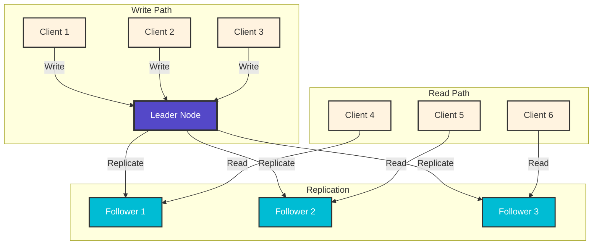
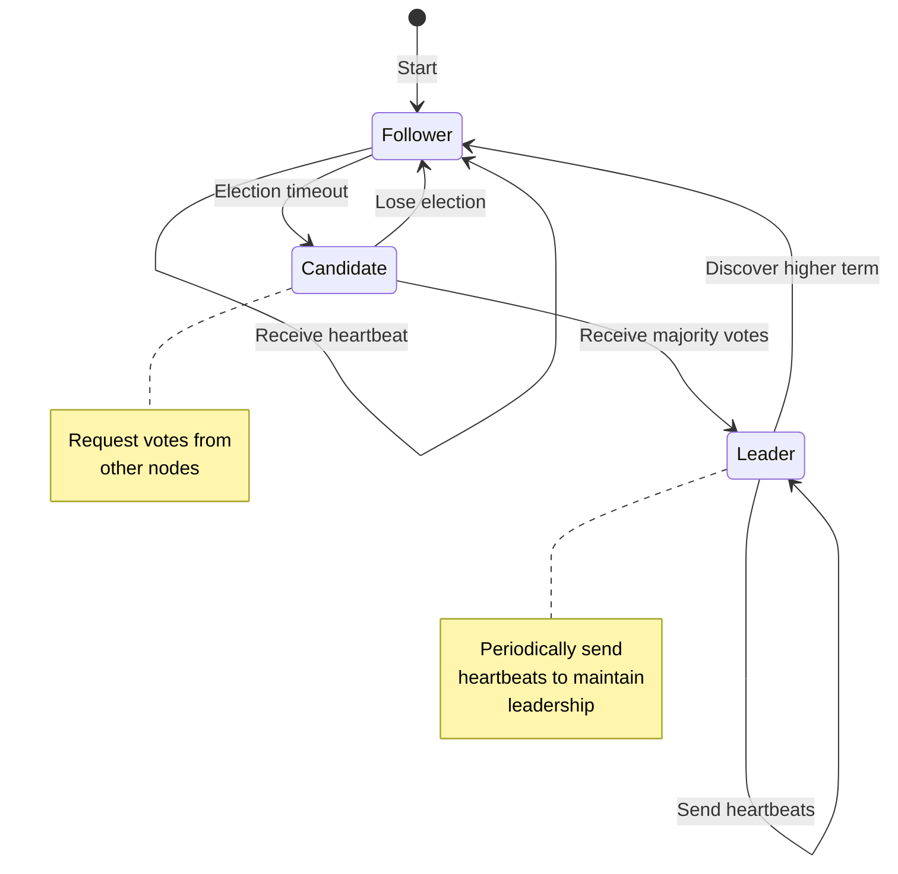
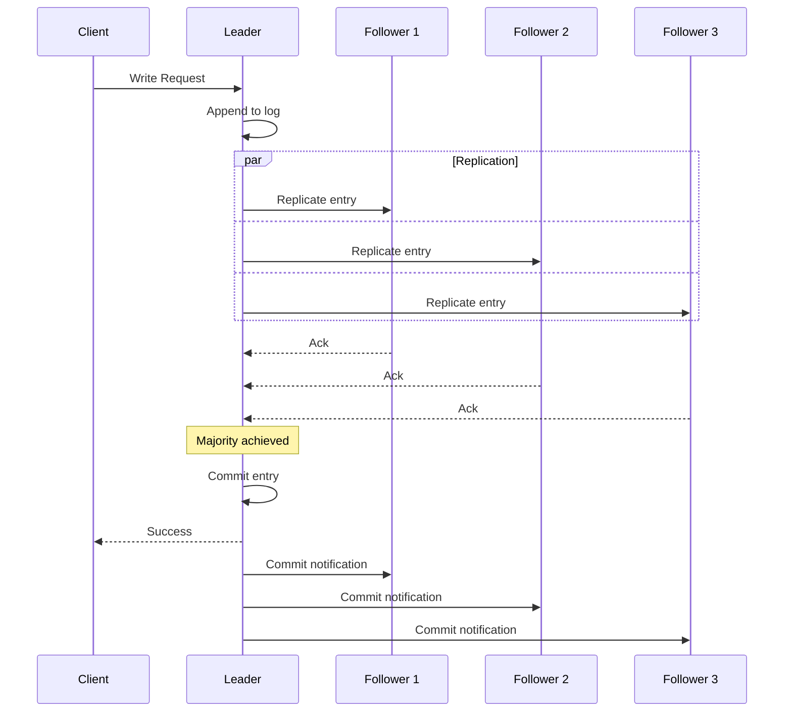
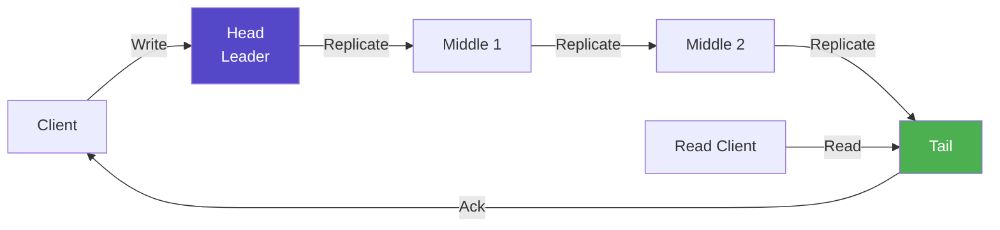
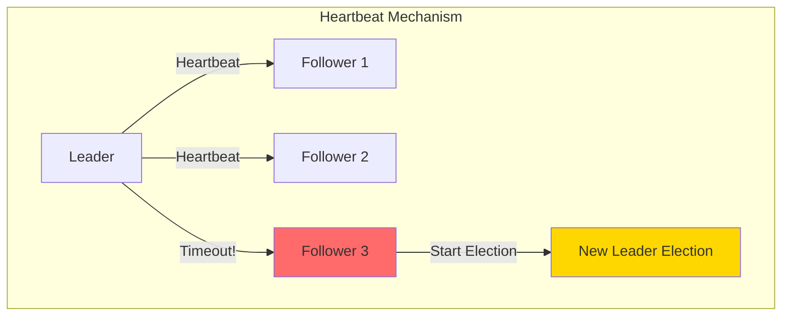
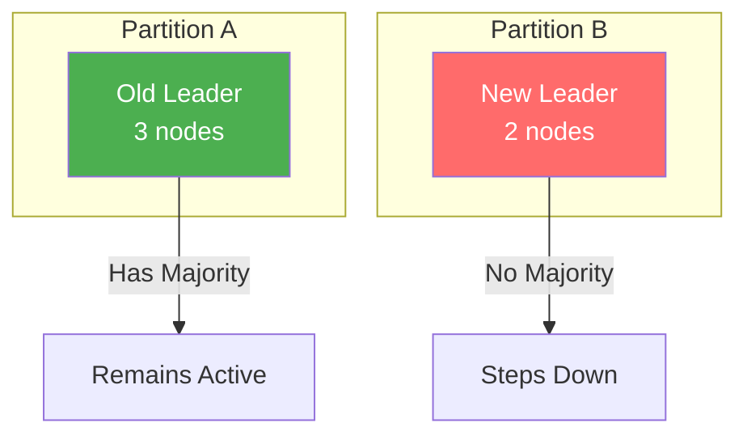
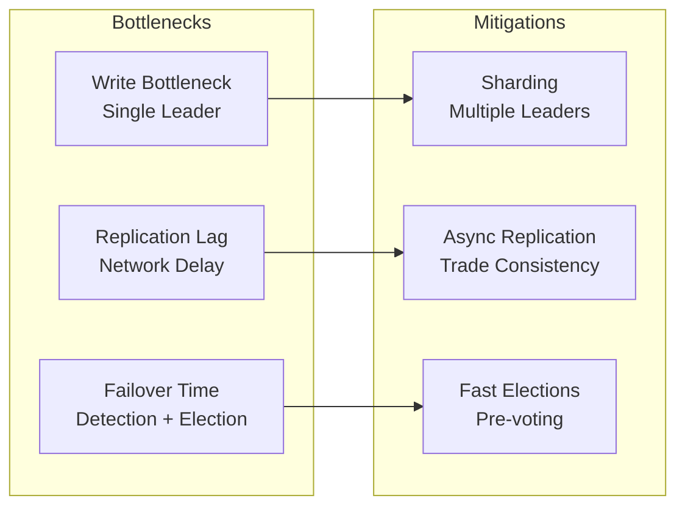
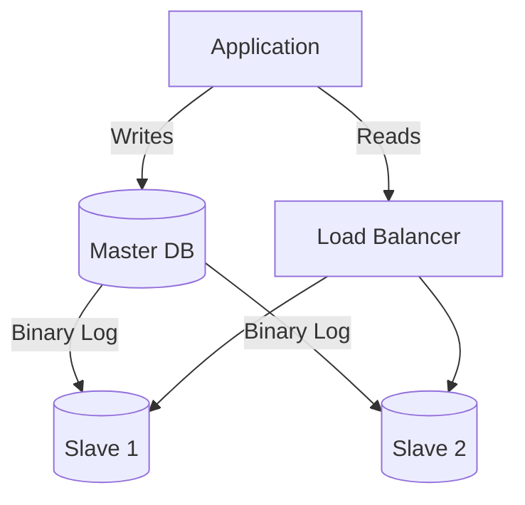

# Leader-Follower Pattern

<div class="pattern-header">
  <div class="pattern-type">Coordination Pattern</div>
  <div class="pattern-summary">Designate one node as leader to coordinate all writes, ensuring consistency while followers serve reads for scalability.</div>
</div>

## Problem Context

<div class="problem-box">
<h3>🎯 The Challenge</h3>

In distributed systems, when multiple nodes can accept writes:
- **Conflicts arise** from concurrent updates
- **Ordering is ambiguous** without coordination
- **Split-brain scenarios** cause data divergence
- **Consistency is hard** to maintain

The leader-follower pattern solves this by establishing a single source of truth.
</div>

## Solution Architecture



## How It Works

### 1. Leader Election Process



### 2. Write Operation Flow



### 3. Read Strategies

<div class="strategy-comparison">
<table>
<thead>
<tr>
<th>Strategy</th>
<th>Consistency</th>
<th>Performance</th>
<th>Use Case</th>
</tr>
</thead>
<tbody>
<tr>
<td><strong>Read from Leader</strong></td>
<td>Strong</td>
<td>Lower (bottleneck)</td>
<td>Financial data</td>
</tr>
<tr>
<td><strong>Read from Followers</strong></td>
<td>Eventual</td>
<td>Higher (distributed)</td>
<td>Product catalog</td>
</tr>
<tr>
<td><strong>Read Your Writes</strong></td>
<td>Session</td>
<td>Medium</td>
<td>User profiles</td>
</tr>
<tr>
<td><strong>Quorum Reads</strong></td>
<td>Strong</td>
<td>Medium</td>
<td>Critical queries</td>
</tr>
</tbody>
</table>
</div>

## Implementation Patterns

### Pattern 1: Synchronous Replication

```python
class SynchronousLeader:
    def write(self, key, value):
        # Write to leader's log
        self.log.append((key, value))
        
        # Replicate to all followers
        acks = 0
        for follower in self.followers:
            if follower.replicate(key, value):
                acks += 1
        
        # Wait for majority
        if acks >= len(self.followers) // 2:
            self.commit(key, value)
            return True
        else:
            self.rollback(key)
            return False
```

### Pattern 2: Asynchronous Replication

```python
class AsynchronousLeader:
    def write(self, key, value):
        # Write locally first
        self.commit(key, value)
        
        # Replicate in background
        for follower in self.followers:
            self.replication_queue.put({
                'follower': follower,
                'operation': (key, value)
            })
        
        return True  # Immediate success
```

### Pattern 3: Chain Replication



## Failure Handling

### Leader Failure Detection



### Split Brain Prevention

<div class="decision-box">
<h4>🧠 Preventing Split Brain</h4>

**Problem**: Network partition creates two leaders

**Solutions**:
1. **Quorum-based decisions**: Require majority for any operation
2. **Fencing tokens**: Monotonically increasing leader epochs
3. **External arbitrator**: ZooKeeper or etcd for coordination
4. **Lease-based leadership**: Time-bound leader terms


</div>

## Performance Considerations

### Scalability Limits



### Optimization Strategies

1. **Batching**: Group multiple writes for efficient replication
2. **Pipelining**: Send next batch before previous acknowledges
3. **Compression**: Reduce replication bandwidth
4. **Read replicas**: Scale read capacity horizontally

## Real-World Examples

### 1. Database Systems

<div class="example-card">
<h4>MySQL/PostgreSQL Replication</h4>



- Single master for writes
- Multiple slaves for read scaling
- Binary log for replication
- Configurable consistency levels
</div>

### 2. Consensus Systems

<div class="example-card">
<h4>Raft Consensus</h4>

- Leaders elected by majority vote
- All changes go through leader
- Log replication ensures consistency
- Automatic failover on leader failure
</div>

### 3. Distributed Coordination

<div class="example-card">
<h4>Apache Kafka</h4>

- Partition leaders handle all writes
- In-sync replicas (ISR) for durability
- Controller manages leader election
- Consumers can read from followers
</div>

## Trade-offs Analysis

<div class="trade-off-matrix">
<table>
<thead>
<tr>
<th>Aspect</th>
<th>Advantages</th>
<th>Disadvantages</th>
</tr>
</thead>
<tbody>
<tr>
<td><strong>Consistency</strong></td>
<td>Strong consistency for writes<br/>Clear ordering guarantees</td>
<td>Read consistency depends on strategy<br/>Replication lag issues</td>
</tr>
<tr>
<td><strong>Availability</strong></td>
<td>Read availability scales<br/>Automatic failover possible</td>
<td>Write availability limited to leader<br/>Failover causes downtime</td>
</tr>
<tr>
<td><strong>Performance</strong></td>
<td>Read scaling with followers<br/>Simple conflict resolution</td>
<td>Write bottleneck at leader<br/>Replication overhead</td>
</tr>
<tr>
<td><strong>Complexity</strong></td>
<td>Conceptually simple<br/>Clear responsibility</td>
<td>Leader election complexity<br/>Split-brain handling</td>
</tr>
</tbody>
</table>
</div>

## When to Use

✅ **Good Fit**:
- Need strong consistency
- Read-heavy workloads
- Clear write patterns
- Can tolerate brief unavailability

❌ **Poor Fit**:
- Write-heavy workloads
- Need 100% write availability
- Geographically distributed writes
- Cannot tolerate replication lag

## Implementation Checklist

- [ ] Leader election mechanism
- [ ] Heartbeat/failure detection
- [ ] Replication protocol
- [ ] Consistency guarantees
- [ ] Split-brain prevention
- [ ] Monitoring and alerting
- [ ] Failover procedures
- [ ] Read routing strategy

## Related Patterns

- [Leader Election](leader-election.md) - Choosing the leader
- [Consensus](consensus.md) - Agreement protocols
- [Primary-Backup](primary-backup.md) - Similar but simpler
- [Multi-Master](multi-master.md) - Alternative approach
- [Chain Replication](chain-replication.md) - Variation

## Law Connections

- **[Law 1: Correlated Failure](/part1-axioms/law1-failure/)**: Leader failure affects all writes
- **[Law 4: Trade-offs](/part1-axioms/law4-tradeoffs/)**: Consistency vs availability balance
- **[Law 5: Distributed Knowledge](/part1-axioms/law5-epistemology/)**: Split-brain from partial knowledge