# Lease Pattern

**Time-bound resource ownership with automatic expiration**

> *"A lease is a promise with an expiration date - it's honest about the fact that nothing lasts forever in distributed systems."*

---

## Level 1: Intuition

### The Parking Meter Analogy

A lease is like a parking meter:
- **Initial payment**: Get 2 hours of parking
- **Time countdown**: Meter runs down
- **Extension allowed**: Add more coins before expiry
- **Automatic release**: Space becomes available when time runs out
- **No manual cleanup**: Don't need to "check out"

The key insight: Time-based ownership prevents resource hoarding when owners disappear.

### Visual Concept


### Lease Lifecycle

```mermaid
stateDiagram-v2
    [*] --> Available: Initial State
    
    Available --> Leased: Grant lease<br/>(with TTL)
    
    Leased --> Leased: Renew<br/>(before expiry)
    
    Leased --> Available: Expire<br/>(TTL reached)
    
    Leased --> Available: Release<br/>(explicit)
    
    note right of Leased
        Lease Properties:
        • Owner ID
        • Resource ID
        • Expiry time
        • Renewal count
    end note
```



---

## Level 2: Foundation

### Core Properties

| Property | Description | Benefit |
|----------|-------------|---------|
| **Time-bound** | Every lease has expiration | No eternal locks |
| **Renewable** | Can extend before expiry | Long operations supported |
| **Automatic cleanup** | Expires without action | Handles failures gracefully |
| **Owner tracking** | Identifies leaseholder | Enables safe operations |

### Lease vs Lock Comparison


### Common Lease Durations

| Use Case | Typical Duration | Renewal Strategy |
|----------|------------------|------------------|
| **Distributed lock** | 10-30 seconds | Renew at 50% remaining |
| **Session management** | 5-30 minutes | Renew on activity |
| **Resource reservation** | 1-24 hours | Explicit renewal |
| **Cache entries** | 1-60 minutes | No renewal (expire) |
| **Leader election** | 5-15 seconds | Continuous renewal |

---

## Level 3: Deep Dive

### Production Lease Implementation

```python
from datetime import datetime, timedelta
from typing import Optional, Dict, Callable
import asyncio
import uuid
from dataclasses import dataclass
from abc import ABC, abstractmethod

@dataclass
class Lease:
    """Represents a time-bound lease on a resource"""
    lease_id: str
    resource_id: str
    owner_id: str
    granted_at: datetime
    expires_at: datetime
    metadata: Dict = None
    
    @property
    def ttl_remaining(self) -> float:
        """Time-to-live remaining in seconds"""
        remaining = (self.expires_at - datetime.utcnow()).total_seconds()
        return max(0, remaining)
    
    @property
    def is_expired(self) -> bool:
        """Check if lease has expired"""
        return self.ttl_remaining <= 0
    
    def should_renew(self, threshold: float = 0.5) -> bool:
        """Check if lease should be renewed (default: 50% consumed)"""
        total_duration = (self.expires_at - self.granted_at).total_seconds()
        return self.ttl_remaining < (total_duration * threshold)

class LeaseStore(ABC):
    """Abstract base for lease storage"""
    
    @abstractmethod
    async def try_acquire(
        self, 
        resource_id: str, 
        owner_id: str, 
        duration: timedelta,
        metadata: Dict = None
    ) -> Optional[Lease]:
        """Try to acquire a lease"""
        pass
    
    @abstractmethod
    async def renew(
        self, 
        lease_id: str, 
        owner_id: str, 
        duration: timedelta
    ) -> Optional[Lease]:
        """Renew an existing lease"""
        pass
    
    @abstractmethod
    async def release(self, lease_id: str, owner_id: str) -> bool:
        """Release a lease explicitly"""
        pass
    
    @abstractmethod
    async def get_lease(self, resource_id: str) -> Optional[Lease]:
        """Get current lease for resource"""
        pass

class InMemoryLeaseStore(LeaseStore):
    """In-memory lease store for testing"""
    
    def __init__(self):
        self.leases: Dict[str, Lease] = {}
        self.resource_to_lease: Dict[str, str] = {}
        self._lock = asyncio.Lock()
    
    async def try_acquire(
        self, 
        resource_id: str, 
        owner_id: str, 
        duration: timedelta,
        metadata: Dict = None
    ) -> Optional[Lease]:
        async with self._lock:
            # Check if resource already has active lease
            if resource_id in self.resource_to_lease:
                lease_id = self.resource_to_lease[resource_id]
                existing = self.leases.get(lease_id)
                if existing and not existing.is_expired:
                    return None  # Resource already leased
                # Clean up expired lease
                if existing:
                    del self.leases[lease_id]
                    del self.resource_to_lease[resource_id]
            
            # Create new lease
            lease = Lease(
                lease_id=str(uuid.uuid4()),
                resource_id=resource_id,
                owner_id=owner_id,
                granted_at=datetime.utcnow(),
                expires_at=datetime.utcnow() + duration,
                metadata=metadata or {}
            )
            
            self.leases[lease.lease_id] = lease
            self.resource_to_lease[resource_id] = lease.lease_id
            
            return lease
    
    async def renew(
        self, 
        lease_id: str, 
        owner_id: str, 
        duration: timedelta
    ) -> Optional[Lease]:
        async with self._lock:
            lease = self.leases.get(lease_id)
            
            # Validate lease ownership and expiry
            if not lease or lease.owner_id != owner_id or lease.is_expired:
                return None
            
            # Extend lease
            lease.expires_at = datetime.utcnow() + duration
            return lease
    
    async def release(self, lease_id: str, owner_id: str) -> bool:
        async with self._lock:
            lease = self.leases.get(lease_id)
            
            # Validate ownership
            if not lease or lease.owner_id != owner_id:
                return False
            
            # Remove lease
            del self.leases[lease_id]
            del self.resource_to_lease[lease.resource_id]
            return True
    
    async def get_lease(self, resource_id: str) -> Optional[Lease]:
        async with self._lock:
            lease_id = self.resource_to_lease.get(resource_id)
            if not lease_id:
                return None
            
            lease = self.leases.get(lease_id)
            if lease and lease.is_expired:
                # Clean up expired lease
                del self.leases[lease_id]
                del self.resource_to_lease[resource_id]
                return None
            
            return lease

class LeaseManager:
    """High-level lease management with automatic renewal"""
    
    def __init__(
        self, 
        store: LeaseStore,
        default_duration: timedelta = timedelta(seconds=30),
        renewal_threshold: float = 0.5
    ):
        self.store = store
        self.default_duration = default_duration
        self.renewal_threshold = renewal_threshold
        self._renewal_tasks: Dict[str, asyncio.Task] = {}
    
    async def acquire_with_auto_renew(
        self,
        resource_id: str,
        owner_id: str,
        duration: Optional[timedelta] = None,
        on_lost: Optional[Callable] = None
    ) -> Optional[Lease]:
        """Acquire lease with automatic renewal"""
        
        duration = duration or self.default_duration
        lease = await self.store.try_acquire(resource_id, owner_id, duration)
        
        if lease:
            # Start auto-renewal task
            task = asyncio.create_task(
                self._auto_renew(lease, duration, on_lost)
            )
            self._renewal_tasks[lease.lease_id] = task
        
        return lease
    
    async def _auto_renew(
        self,
        lease: Lease,
        duration: timedelta,
        on_lost: Optional[Callable]
    ):
        """Automatically renew lease before expiry"""
        
        while True:
            try:
                # Calculate sleep time until renewal needed
                total_seconds = duration.total_seconds()
                sleep_time = total_seconds * self.renewal_threshold
                
                await asyncio.sleep(sleep_time)
                
                # Attempt renewal
                renewed = await self.store.renew(
                    lease.lease_id, 
                    lease.owner_id, 
                    duration
                )
                
                if not renewed:
                    # Lost lease
                    if on_lost:
                        await on_lost(lease)
                    break
                
                # Update lease reference
                lease.expires_at = renewed.expires_at
                
            except asyncio.CancelledError:
                # Task cancelled, stop renewal
                break
            except Exception as e:
                # Log error and continue trying
                print(f"Renewal error: {e}")
                await asyncio.sleep(1)
    
    async def release(self, lease: Lease) -> bool:
        """Release lease and stop auto-renewal"""
        
        # Cancel renewal task
        task = self._renewal_tasks.get(lease.lease_id)
        if task:
            task.cancel()
            del self._renewal_tasks[lease.lease_id]
        
        # Release lease
        return await self.store.release(lease.lease_id, lease.owner_id)

# Redis-based implementation
class RedisLeaseStore(LeaseStore):
    """Production Redis-based lease store"""
    
    def __init__(self, redis_client):
        self.redis = redis_client
        self.lease_prefix = "lease:"
        self.resource_prefix = "resource:"
    
    async def try_acquire(
        self, 
        resource_id: str, 
        owner_id: str, 
        duration: timedelta,
        metadata: Dict = None
    ) -> Optional[Lease]:
        
        lease_id = str(uuid.uuid4())
        resource_key = f"{self.resource_prefix}{resource_id}"
        lease_key = f"{self.lease_prefix}{lease_id}"
        
        # Lua script for atomic acquire
        lua_script = """
        local resource_key = KEYS[1]
        local lease_key = KEYS[2]
        local lease_data = ARGV[1]
        local ttl_ms = tonumber(ARGV[2])
        local lease_id = ARGV[3]
        
        -- Check if resource already leased
        local existing = redis.call('get', resource_key)
        if existing then
            return nil
        end
        
        -- Acquire lease
        redis.call('set', resource_key, lease_id, 'PX', ttl_ms)
        redis.call('set', lease_key, lease_data, 'PX', ttl_ms)
        
        return lease_id
        """
        
        lease_data = {
            'lease_id': lease_id,
            'resource_id': resource_id,
            'owner_id': owner_id,
            'granted_at': datetime.utcnow().isoformat(),
            'expires_at': (datetime.utcnow() + duration).isoformat(),
            'metadata': metadata or {}
        }
        
        ttl_ms = int(duration.total_seconds() * 1000)
        
        result = await self.redis.eval(
            lua_script,
            keys=[resource_key, lease_key],
            args=[json.dumps(lease_data), ttl_ms, lease_id]
        )
        
        if result:
            return Lease(**lease_data)
        return None

# Example usage patterns
async def distributed_job_example():
    """Example: Distributed job processing with lease"""
    
    store = InMemoryLeaseStore()
    manager = LeaseManager(store)
    
    async def process_job(job_id: str, worker_id: str):
        """Process job with exclusive lease"""
        
        # Acquire lease for job
        lease = await manager.acquire_with_auto_renew(
            resource_id=f"job:{job_id}",
            owner_id=worker_id,
            duration=timedelta(minutes=5),
            on_lost=lambda l: print(f"Lost lease for job {job_id}")
        )
        
        if not lease:
            print(f"Job {job_id} already being processed")
            return False
        
        try:
            # Process job (simulated)
            print(f"Worker {worker_id} processing job {job_id}")
            await asyncio.sleep(10)  # Simulate work
            
            print(f"Job {job_id} completed")
            return True
            
        finally:
            # Always release lease
            await manager.release(lease)
    
    # Multiple workers trying to process same job
    results = await asyncio.gather(
        process_job("job-123", "worker-1"),
        process_job("job-123", "worker-2"),
        process_job("job-123", "worker-3"),
        return_exceptions=True
    )
    
    # Only one worker should succeed
    successful = sum(1 for r in results if r is True)
    print(f"Successful processors: {successful}")  # Should be 1

async def leader_election_example():
    """Example: Leader election using lease"""
    
    store = InMemoryLeaseStore()
    
    async def try_become_leader(node_id: str):
        """Try to become leader for service"""
        
        lease = await store.try_acquire(
            resource_id="service:leader",
            owner_id=node_id,
            duration=timedelta(seconds=10),
            metadata={'node': node_id, 'started': datetime.utcnow().isoformat()}
        )
        
        if lease:
            print(f"Node {node_id} became leader")
            
            # Simulate leader work with renewal
            for i in range(5):
                await asyncio.sleep(3)
                
                # Renew leadership
                renewed = await store.renew(
                    lease.lease_id,
                    node_id,
                    timedelta(seconds=10)
                )
                
                if not renewed:
                    print(f"Node {node_id} lost leadership")
                    break
                    
                print(f"Node {node_id} renewed leadership")
            
            # Step down
            await store.release(lease.lease_id, node_id)
            print(f"Node {node_id} stepped down")
        else:
            current = await store.get_lease("service:leader")
            if current:
                print(f"Node {node_id} found leader: {current.owner_id}")
```

### Lease Renewal Strategies


---

## Level 4: Expert

### Advanced Lease Patterns

#### 1. Hierarchical Leases


#### 2. Lease Fencing

```python
class FencedLease(Lease):
    """Lease with monotonic fencing token for safety"""
    
    def __init__(self, *args, fence_token: int, **kwargs):
        super().__init__(*args, **kwargs)
        self.fence_token = fence_token
    
    def validate_operation(self, storage_fence: int) -> bool:
        """Validate this lease can perform operation"""
        return self.fence_token >= storage_fence

class FencedLeaseStore(LeaseStore):
    """Lease store with fencing tokens"""
    
    def __init__(self):
        self.base_store = InMemoryLeaseStore()
        self.fence_counter = 0
        self.resource_fences: Dict[str, int] = {}
    
    async def try_acquire(self, resource_id: str, owner_id: str, 
                         duration: timedelta, metadata: Dict = None) -> Optional[FencedLease]:
        lease = await self.base_store.try_acquire(resource_id, owner_id, duration, metadata)
        
        if lease:
            # Assign monotonic fence token
            self.fence_counter += 1
            self.resource_fences[resource_id] = self.fence_counter
            
            return FencedLease(
                **lease.__dict__,
                fence_token=self.fence_counter
            )
        return None
```

### Production Lease Systems

| System | Implementation | Use Case | Scale |
|--------|----------------|----------|-------|
| **Google Chubby** | Paxos-based leases | Service coordination | Global |
| **etcd lease** | Raft consensus | Kubernetes | Large clusters |
| **Consul sessions** | Gossip + Raft | Service mesh | Multi-DC |
| **Redis SET EX** | Single instance | Cache/locks | Application |

### Lease Failure Modes


---

## Level 5: Mastery

### Theoretical Foundations

The lease pattern addresses the FLP impossibility result by introducing time as a failure detector:


### Lease Economics

```python
def calculate_lease_parameters(
    operation_time: float,  # seconds
    network_rtt: float,     # seconds
    failure_rate: float,    # per hour
    false_positive_cost: float,  # dollars
    unavailability_cost: float   # dollars per second
) -> dict:
    """Calculate optimal lease duration and renewal threshold"""
    
    # Lease too short: false positives from network delays
    min_lease = (network_rtt * 3) + operation_time
    
    # Lease too long: unavailability on failure
    failure_prob_per_second = failure_rate / 3600
    
    # Find optimal lease duration
    best_duration = None
    best_cost = float('inf')
    
    for duration in range(int(min_lease), int(min_lease * 10)):
        # Cost of false positives
        renewals_needed = 3600 / duration
        false_positive_prob = 0.001 * renewals_needed  # 0.1% per renewal
        fp_cost = false_positive_prob * false_positive_cost
        
        # Cost of unavailability
        expected_unavail = failure_prob_per_second * duration * 0.5
        unavail_cost = expected_unavail * unavailability_cost
        
        total_cost = fp_cost + unavail_cost
        
        if total_cost < best_cost:
            best_cost = total_cost
            best_duration = duration
    
    # Renewal threshold based on network conditions
    renewal_threshold = max(0.3, min(0.7, 1 - (network_rtt * 3 / best_duration)))
    
    return {
        'lease_duration': best_duration,
        'renewal_threshold': renewal_threshold,
        'renewal_interval': best_duration * renewal_threshold,
        'expected_cost_per_hour': best_cost
    }
```

### Future Directions

1. **Blockchain Leases**: Immutable lease records with smart contract enforcement
2. **ML-Optimized Durations**: Predict optimal lease times based on historical patterns
3. **Geo-Distributed Leases**: Lease migration across regions for follow-the-sun
4. **Quantum-Resistant Leases**: Post-quantum cryptographic lease tokens

---

## Quick Reference

### Lease Duration Guidelines

| Scenario | Duration | Renewal | Why |
|----------|----------|---------|-----|
| **Distributed lock** | 10-30s | 50% | Quick failure detection |
| **Leader election** | 5-15s | 30% | Fast failover |
| **Job processing** | 1-60min | 80% | Match job duration |
| **Session** | 5-30min | 90% | User experience |
| **Resource reservation** | 1-24hr | Manual | Business logic |

### Implementation Checklist

- [ ] Choose appropriate lease duration
- [ ] Implement automatic renewal
- [ ] Handle lease loss gracefully
- [ ] Add monitoring and alerting
- [ ] Test with clock skew
- [ ] Test with network failures
- [ ] Implement fencing if needed
- [ ] Document lease semantics

### Common Pitfalls

1. **Lease too short**: Unnecessary renewals and false expirations
2. **Lease too long**: Slow failure detection
3. **No renewal strategy**: Lease expires during operation
4. **Ignoring clock skew**: Premature expiration
5. **No fencing**: Stale lease operations

---

## Related Laws & Pillars

### Fundamental Laws
This pattern directly addresses:

- **[Law 1: Correlated Failure ⛓️](part1-axioms/law1-failure/index)**: Lease service failure affects all clients
- **[Law 2: Asynchronous Reality ⏱️](part1-axioms/law2-asynchrony/)**: Time-based failure detection
- **[Law 5: Distributed Knowledge 🧠](part1-axioms/law5-epistemology/index)**: No perfect failure detection
- **[Law 6: Cognitive Load ⚖️](part1-axioms/law6-cognition/index)**: Simple time-based mental model

### Foundational Pillars
Lease implements:

- **[Pillar 3: Distribution of Truth 🔍](part2-pillars/truth/index)**: Lease holder as truth source
- **[Pillar 4: Distribution of Control 🎮](part2-pillars/control/index)**: Temporary exclusive control
- **[Pillar 2: Distribution of State 🗃️](part2-pillars/state/index)**: Lease state distribution

## Related Patterns

### Core Dependencies
- **[Distributed Lock](patterns/distributed-lock)**: Lease-based implementation
- **[Heartbeat](patterns/heartbeat)**: Lease renewal mechanism
- **[Leader Election](patterns/leader-election)**: Uses leases for leadership

### Supporting Patterns
- **[Timeout](patterns/timeout)**: Lease duration enforcement
- **[State Watch](patterns/state-watch)**: Monitor lease changes
- **[Generation Clock](patterns/generation-clock)**: Lease generation tracking

### Alternative Approaches
- **[Consensus](patterns/consensus)**: Stronger but complex
- **[Gossip](patterns/gossip)**: Eventually consistent alternative
- **[Pessimistic Locking](patterns/two-phase-commit)**: No automatic cleanup

---

*"Time heals all distributed systems wounds - especially when it expires your leases."*