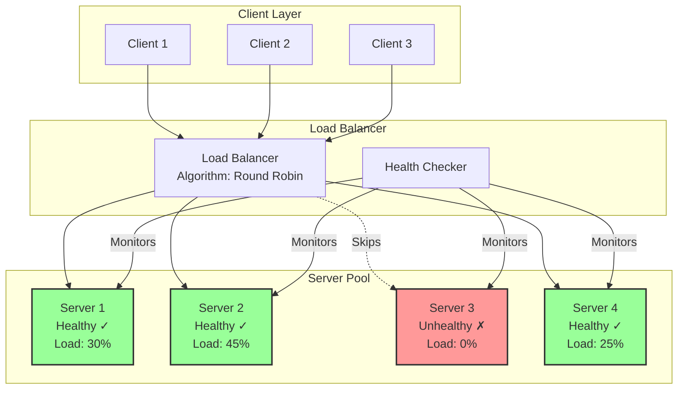

# Load Balancing Pattern

!!! success "🏆 Gold Standard Pattern"
    **Request Distribution Foundation** • Google, AWS, Cloudflare proven
    
    Load balancing is fundamental to any scalable system. It ensures high availability, optimal resource utilization, and seamless scaling by distributing requests across multiple servers.
    
    **Key Success Metrics:**
    - Google Maglev: 1M+ requests/sec per instance
    - AWS ELB: Trillions of daily requests
    - Cloudflare: 45M+ requests/sec globally

<div class="axiom-box">
<h4>⚛️ Law 1: Correlated Failure</h4>

Load balancing is our primary defense against correlated failure. When one server fails, the load balancer automatically redirects traffic to healthy instances. However, poor load balancing can create correlated failures - overloading remaining servers when one fails, creating a cascade.

**Key Insight**: Effective load balancing must account for the increased load on surviving servers during failures. A system running at 80% capacity with 5 servers will overload the remaining 4 servers (100% load each) if one fails.
</div>

[Home](/) > [Patterns](../patterns/) > [Operational Patterns](../patterns/index.md#operational-patterns) > Load Balancing

**Distributing work across multiple resources**

> *"Many hands make light work—if coordinated properly."*

<div class="failure-vignette">
<h4>💥 The GitHub Load Balancer Cascade (2018)</h4>

**What Happened**: GitHub experienced a 24-hour outage when a network partition split their data centers, causing their load balancers to make catastrophic decisions.

**Root Cause**: 
- Load balancer health checks couldn't reach MySQL cluster during network partition
- Load balancers marked ALL database servers as unhealthy
- Automatic failover logic created a "thundering herd" trying to promote new primaries
- Multiple primaries created split-brain scenario
- Load balancers kept switching between conflicting primaries

**Impact**: 
- 24+ hours of degraded service
- Data inconsistencies requiring manual reconciliation
- Loss of webhook deliveries and Git operations
- Estimated $1.5M/hour in lost productivity globally

**Lessons Learned**:
- Health checks need to distinguish between "server down" vs "network partition"
- Implement circuit breakers to prevent cascade failures
- Use quorum-based health decisions, not simple majority
- Manual override capabilities are essential
- Never let load balancers make database failover decisions
</div>

---

## Level 1: Intuition

### Core Concept

Load balancing distributes incoming requests across multiple servers to optimize resource utilization, minimize latency, and ensure high availability.

### Load Balancing Architecture



<div class="decision-box">
<h4>🎯 Choosing the Right Load Balancing Algorithm</h4>

**Round Robin (Default Choice):**
- Use when: All servers have equal capacity
- Pros: Simple, fair, predictable
- Cons: Ignores actual server load
- Best for: Stateless microservices, CDN nodes

**Least Connections (Dynamic Load):**
- Use when: Request processing time varies
- Pros: Adapts to actual load
- Cons: Connection tracking overhead
- Best for: Database pools, API gateways

**Weighted Round Robin (Heterogeneous):**
- Use when: Servers have different capacities
- Pros: Accounts for server power
- Cons: Requires manual weight tuning
- Best for: Mixed hardware deployments

**IP Hash (Session Affinity):**
- Use when: Client needs same server
- Pros: No session replication needed
- Cons: Uneven distribution possible
- Best for: Shopping carts, WebSocket connections

**Least Response Time (Performance):**
- Use when: Latency is critical
- Pros: Optimizes for speed
- Cons: Requires latency monitoring
- Best for: Real-time applications, gaming
</div>


---

## Level 2: Foundation

### Load Balancing Algorithms

| Algorithm | Description | Pros | Cons |
|-----------|-------------|------|------|
| **Round Robin** | Sequential distribution | Simple, fair | Ignores server load |
| **Weighted Round Robin** | Proportional to capacity | Handles different server sizes | Static weights |
| **Least Connections** | Route to least busy | Dynamic load awareness | Connection tracking overhead |
| **Least Response Time** | Route to fastest | Performance optimized | Requires latency monitoring |
| **IP Hash** | Consistent routing | Session affinity | Uneven distribution possible |
| **Random** | Random selection | Simple, no state | No optimization |


### Implementing Advanced Algorithms

```python
import time
import hashlib
from collections import defaultdict
from typing import Dict, Tuple

def weighted_round_robin(servers: list, weights: dict, index: int) -> Server:
    """Weighted round-robin implementation"""
    weighted_servers = []
    for server in servers:
        if server.healthy:
            weight = weights.get(server.id, 1)
            weighted_servers.extend([server] * weight)
    
    if not weighted_servers:
        return None
    
    return weighted_servers[index % len(weighted_servers)]

def least_response_time(servers: list, response_times: dict, connections: dict) -> Server:
    """Route to server with lowest average response time"""
    healthy_servers = [s for s in servers if s.healthy]
    if not healthy_servers:
        return None
    
    def score_server(server):
        avg_time = sum(response_times.get(server.id, [0])[-10:]) / max(1, len(response_times.get(server.id, [0])[-10:]))
        connection_penalty = connections.get(server.id, 0) * 0.1
        return avg_time + connection_penalty
    
    return min(healthy_servers, key=score_server)

def power_of_two_choices(servers: list, connections: dict) -> Server:
    """Pick two random servers, choose less loaded"""
    healthy_servers = [s for s in servers if s.healthy]
    if len(healthy_servers) <= 1:
        return healthy_servers[0] if healthy_servers else None
    
    choices = random.sample(healthy_servers, 2)
    return min(choices, key=lambda s: connections.get(s.id, 0))
```

---

## Level 3: Deep Dive

### Layer 4 vs Layer 7 Load Balancing

```python
class Layer4LoadBalancer:
    """
    Transport layer (TCP/UDP) load balancing
    - Faster, less CPU intensive
    - No application awareness
    - Can't route based on content
    """

    def handle_connection(self, client_socket):
# Select backend server
        server = self.select_server()
        if not server:
            client_socket.close()
            return

# Create connection to backend
        backend_socket = socket.socket(socket.AF_INET, socket.SOCK_STREAM)
        backend_socket.connect((server.address, server.port))

# Bi-directional proxy
        self.proxy_data(client_socket, backend_socket)

class Layer7LoadBalancer:
    """
    Application layer (HTTP) load balancing
    - Content-aware routing
    - Can modify requests/responses
    - Higher CPU usage
    """

    def handle_http_request(self, request):
# Parse HTTP request
        parsed = self.parse_http_request(request)

# Content-based routing
        if parsed.path.startswith('/api/'):
            server = self.select_api_server()
        elif parsed.path.startswith('/static/'):
            server = self.select_static_server()
        else:
            server = self.select_web_server()

# Can modify headers
        request.headers['X-Forwarded-For'] = request.client_ip
        request.headers['X-Real-IP'] = request.client_ip

# Forward to selected server
        response = self.forward_request(server, request)

# Can modify response
        response.headers['X-Served-By'] = server.id

        return response
```

### Consistent Hashing

| Concept | Description | Benefit |
|---------|-------------|----------|
| **Hash Ring** | Servers placed on circular hash space | Distributed mapping |
| **Virtual Nodes** | Multiple points per server | Better distribution |
| **Key Mapping** | Hash(key) → nearest server clockwise | O(log n) lookup |
| **Server Addition** | Only K/N keys move (K=keys, N=servers) | Minimal disruption |


### Consistent Hashing Implementation

```python
import bisect
import hashlib

class ConsistentHashRing:
    def __init__(self, virtual_nodes: int = 150):
        self.ring = {}  # hash -> server
        self.sorted_keys = []
        self.virtual_nodes = virtual_nodes

    def add_server(self, server_id: str, server):
        """Add server with virtual nodes"""
        for i in range(self.virtual_nodes):
            hash_value = int(hashlib.md5(f"{server_id}:{i}".encode()).hexdigest(), 16)
            self.ring[hash_value] = server
            bisect.insort(self.sorted_keys, hash_value)

    def get_server(self, key: str):
        """Get server for key using consistent hashing"""
        if not self.ring:
            return None
        
        hash_value = int(hashlib.md5(key.encode()).hexdigest(), 16)
        index = bisect.bisect_right(self.sorted_keys, hash_value)
        
        if index == len(self.sorted_keys):
            index = 0
        
        return self.ring[self.sorted_keys[index]]
```

### Geographic Load Balancing

```python
import geoip2.database
from math import radians, sin, cos, sqrt, atan2

def geographic_load_balance(client_ip: str, datacenters: list, geoip_reader) -> Server:
    """Route to nearest datacenter"""
# Get client location
    try:
        response = geoip_reader.city(client_ip)
        client_lat = response.location.latitude
        client_lon = response.location.longitude
    except:
# Use first datacenter as fallback
        return select_server_from_dc(datacenters[0]) if datacenters else None
    
# Calculate distances using Haversine formula
    def haversine_distance(lat1, lon1, lat2, lon2):
        R = 6371  # Earth radius in km
        lat1, lon1, lat2, lon2 = map(radians, [lat1, lon1, lat2, lon2])
        dlat, dlon = lat2 - lat1, lon2 - lon1
        a = sin(dlat/2)**2 + cos(lat1) * cos(lat2) * sin(dlon/2)**2
        return R * 2 * atan2(sqrt(a), sqrt(1-a))
    
# Find nearest datacenter
    nearest_dc = min(datacenters, 
                     key=lambda dc: haversine_distance(client_lat, client_lon, dc['lat'], dc['lon']))
    
    return select_server_from_dc(nearest_dc)

def select_server_from_dc(datacenter: dict) -> Server:
    """Select server within datacenter using least connections"""
    healthy_servers = [s for s in datacenter['servers'] if s.healthy]
    return min(healthy_servers, key=lambda s: s.current_connections) if healthy_servers else None
```

---

## Level 4: Expert

### Production Load Balancing Systems

#### HAProxy Configuration Patterns

```python
def generate_haproxy_config(backends: list, algorithm: str = "leastconn") -> str:
    """Generate HAProxy configuration"""
    config = f"""global
    maxconn 100000
    log stdout local0

defaults
    mode http
    timeout connect 5000ms
    timeout client 50000ms
    timeout server 50000ms

frontend web_frontend
    bind *:80
    bind *:443 ssl crt /etc/ssl/cert.pem
    
# Rate limiting
    stick-table type ip size 100k expire 30s store http_req_rate(10s)
    http-request track-sc0 src
    http-request deny if {{ sc_http_req_rate(0) gt 100 }}
    
    default_backend web_backend

backend web_backend
    balance {algorithm}
    option httpchk GET /health
    cookie SERVERID insert indirect nocache
"""
    
    for i, backend in enumerate(backends):
        config += f"    server web{i} {backend['address']}:{backend['port']} check cookie web{i}\n"
    
    return config
```


#### NGINX Advanced Load Balancing

```python
def generate_nginx_upstream(name: str, servers: list, method: str = "least_conn") -> str:
    """Generate NGINX upstream configuration"""
    config = f"upstream {name} {{\n    {method};\n    keepalive 32;\n\n"
    
    for server in servers:
        options = []
        if server.get('weight'):
            options.append(f"weight={server['weight']}")
        if server.get('max_fails'):
            options.append(f"max_fails={server['max_fails']}")
        if server.get('backup'):
            options.append("backup")
        
        options_str = " ".join(options)
        config += f"    server {server['address']}:{server['port']} {options_str};\n"
    
    config += "}\n"
    return config
```


### Real-World Case Study: Netflix's Zuul

<div class="failure-vignette">
<h4>💥 The GitHub Load Balancer Cascade (2018)</h4>

**What Happened**: GitHub experienced a 24-hour outage when a network partition split their data centers

**Root Cause**: 
- Load balancer health checks couldn't reach MySQL cluster during network partition
- Load balancers marked ALL database servers as unhealthy
- Automatic failover logic created a "thundering herd" trying to promote new primaries
- Multiple primaries created split-brain scenario

**Impact**: 
- 24+ hours of degraded service
- Data inconsistencies requiring manual reconciliation
- Loss of webhook deliveries and Git operations

**Lessons Learned**:
- Health checks need to distinguish between "server down" vs "network partition"
- Implement circuit breakers to prevent cascade failures
- Use quorum-based health decisions, not simple majority
- Manual override capabilities are essential
</div>

```python
def netflix_weighted_response_time_selection(servers: list, response_times: dict) -> Server:
    """Netflix's weighted response time algorithm"""
    if len(servers) == 1:
        return servers[0]
    
# Calculate weights based on response time
    weights = []
    total_response_time = 0
    
    for server in servers:
        avg_time = sum(response_times.get(server.id, [1.0])[-100:]) / max(1, len(response_times.get(server.id, [1.0])[-100:]))
        total_response_time += avg_time
        weights.append(avg_time)
    
# Invert weights (lower response time = higher weight)
    if total_response_time > 0:
        weights = [total_response_time - w for w in weights]
    else:
        weights = [1] * len(servers)
    
# Weighted random selection
    total_weight = sum(weights)
    if total_weight == 0:
        return random.choice(servers)
    
    r = random.uniform(0, total_weight)
    for i, weight in enumerate(weights):
        r -= weight
        if r <= 0:
            return servers[i]
    
    return servers[-1]
```

---

## Level 5: Mastery

### Theoretical Optimal Load Balancing

```python
import numpy as np
from scipy.optimize import linear_sum_assignment

def optimal_load_assignment(requests: list, servers: list) -> dict:
    """Find optimal request-to-server assignment using Hungarian algorithm"""
    if not requests or not servers:
        return {}
    
# Calculate cost matrix
    n_requests, n_servers = len(requests), len(servers)
    costs = np.zeros((n_requests, n_servers))
    
    for i, request in enumerate(requests):
        for j, server in enumerate(servers):
# Simple cost function: latency + load^2
            latency = estimate_latency(request, server)
            load_cost = (server.current_connections + 1) ** 2
            costs[i][j] = 0.5 * latency + 0.3 * load_cost
            
            if not can_handle(request, server):
                costs[i][j] = np.inf
    
# Solve assignment problem
    row_indices, col_indices = linear_sum_assignment(costs)
    
# Build assignment map
    assignments = {}
    for i, j in zip(row_indices, col_indices):
        server_idx = j % n_servers if n_requests > n_servers else j
        assignments[requests[i]['id']] = servers[server_idx]
    
    return assignments

def power_law_aware_balancing(request_sizes: list, servers: list) -> dict:
    """Handle power-law distributed request sizes"""
# Sort requests by size (largest first)
    indexed_sizes = sorted(enumerate(request_sizes), key=lambda x: x[1], reverse=True)
    
    assignments = {}
    server_loads = [0] * len(servers)
    
    for idx, size in indexed_sizes:
# Find server with best score (capacity + balance)
        best_server = None
        best_score = float('inf')
        
        for i, server in enumerate(servers):
            if server_loads[i] + size <= server.capacity:
                new_load = server_loads[i] + size
                imbalance = np.std(server_loads)
                score = new_load + 10 * imbalance
                
                if score < best_score:
                    best_score = score
                    best_server = i
        
        if best_server is not None:
            assignments[idx] = servers[best_server]
            server_loads[best_server] += size
        else:
            assignments[idx] = None  # Reject or queue
    
    return assignments
```

### Future Directions

- **ML-Driven Load Balancing**: Predict optimal routing using deep learning
- **Quantum Load Balancing**: Superposition of routing states
- **Blockchain Load Balancing**: Decentralized consensus on routing
- **Biological-Inspired**: Ant colony optimization for dynamic routing

---

## Quick Reference

### Load Balancing Algorithm Selection

| Scenario | Best Algorithm | Why |
|----------|---------------|-----|
| Stateless API | Least Connections | Actual load awareness |
| Session-based | IP Hash | Session persistence |
| Varied server capacity | Weighted Round Robin | Proportional distribution |
| Global service | Geographic | Minimize latency |
| Microservices | Service Mesh | Advanced routing rules |


### Implementation Checklist

- [ ] Choose appropriate algorithm
- [ ] Implement health checking
- [ ] Configure connection draining
- [ ] Add monitoring metrics
- [ ] Test failover scenarios
- [ ] Document server weights
- [ ] Plan for maintenance mode
- [ ] Monitor distribution fairness

<div class="truth-box">
<h4>💡 Load Balancing Production Insights</h4>

**The 80/20 Rule of Load Balancing:**
- 80% of outages come from health check misconfiguration
- 20% of servers often handle 80% of traffic (monitor for hot spots)
- 80% of performance gains come from fixing the slowest 20% of servers

**Health Check Golden Rules:**
1. **Shallow checks for L4**: TCP handshake only (1-2 sec timeout)
2. **Deep checks for L7**: Actual request processing (5-10 sec timeout)
3. **Never check external dependencies**: That's a cascade failure waiting to happen
4. **Check frequency**: 3x faster than failure timeout

**Real-World Wisdom:**
- "Least connections" beats "round robin" for >90% of workloads
- Sticky sessions are technical debt - each one costs 10x in complexity
- Geographic load balancing saves 40-60% on bandwidth costs
- Connection draining prevents 99% of user-visible errors during deploys

**The Three Layers of Production Load Balancing:**
1. **DNS** (GeoDNS): Continental routing, 60s TTL
2. **L4** (Network LB): Datacenter routing, connection-level
3. **L7** (Application LB): Service routing, request-level

**Economic Reality:**
> "A single overloaded server costs more than 10 properly balanced servers. Load balancing isn't about distribution - it's about cost optimization."
</div>

---

---

*"Perfect balance is not the goal—effective distribution is."*

---

<div class="page-nav" markdown>
[:material-arrow-left: Auto-Scaling](../patterns/auto-scaling.md) | 
[:material-arrow-up: Patterns](../patterns/) | 
[:material-arrow-right: API Gateway](../patterns/api-gateway.md)
</div>