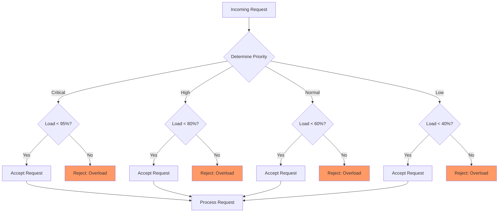
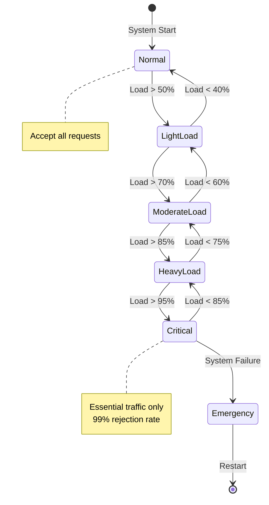
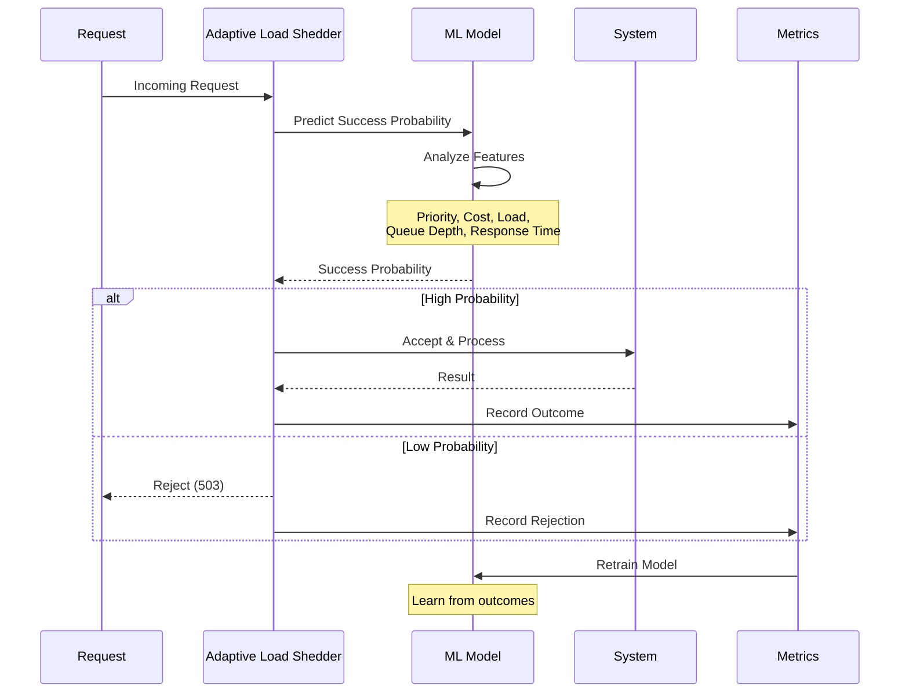

# Load Shedding Pattern

**Gracefully dropping load to maintain system stability**

> *"When the boat is sinking, throw the cargo overboard—but choose wisely what to throw."*

---

## Level 1: Intuition

### The Lifeboat Analogy

Load shedding is like managing a lifeboat:
- **Capacity limit**: The boat can only hold so many people
- **Priority system**: Women and children first
- **Survival focus**: Better to save some than lose all

### Load Shedding Decision Flow



### Basic Load Shedding

```python
import random
from enum import Enum
from typing import Optional

class Priority(Enum):
    CRITICAL = 1     # Payment processing
    HIGH = 2         # User login
    NORMAL = 3       # Browse catalog
    LOW = 4          # Analytics

class SimpleLoadShedder:
    def __init__(self, capacity: int):
        self.capacity = capacity
        self.current_load = 0

    def should_accept_request(self, priority: Priority) -> bool:
        """Simple threshold-based load shedding"""
        load_percentage = (self.current_load / self.capacity) * 100

# Define thresholds for each priority
        thresholds = {
            Priority.CRITICAL: 95,   # Accept until 95% capacity
            Priority.HIGH: 80,       # Accept until 80% capacity
            Priority.NORMAL: 60,     # Accept until 60% capacity
            Priority.LOW: 40         # Accept until 40% capacity
        }

        return load_percentage < thresholds[priority]

    def process_request(self, request, priority: Priority):
        if not self.should_accept_request(priority):
            raise ServiceUnavailableError(
                f"Load shedding: {priority.name} requests rejected"
            )

        self.current_load += 1
        try:
# Process the request
            result = handle_request(request)
            return result
        finally:
            self.current_load -= 1
```

---

## Level 2: Foundation

### Load Shedding Strategies

| Strategy | Description | Use Case |
|----------|-------------|----------|
| **Random** | Drop random percentage | Simple, fair distribution |
| **Priority** | Drop low-priority first | Business-critical systems |
| **Cost-based** | Drop expensive operations | Resource optimization |
| **User-based** | Drop by user tier | SaaS with tiers |
| **Age-based** | Drop oldest requests | Real-time systems |


### Load Shedding State Machine



### Priority-Based Shedding Strategy

| Load Level | Critical | High | Normal | Low | Strategy |
|------------|----------|------|--------|-----|----------|
| 0-50% | 100% | 100% | 100% | 100% | Accept all |
| 50-70% | 100% | 100% | 100% | 60% | Throttle low priority |
| 70-85% | 100% | 90% | 50% | 10% | Active shedding |
| 85-95% | 100% | 50% | 10% | 0% | Essential only |
| >95% | 80% | 10% | 0% | 0% | Emergency mode |


### Implementing Priority-Based Load Shedding

```python
import time
import heapq
from dataclasses import dataclass
from typing import Dict, List

@dataclass
class Request:
    id: str
    priority: int
    cost: float
    timestamp: float
    user_tier: str

class AdvancedLoadShedder:
    def __init__(self,
                 max_capacity: int,
                 shed_percentage: float = 0.1):
        self.max_capacity = max_capacity
        self.shed_percentage = shed_percentage
        self.current_requests: Dict[str, Request] = {}
        self.request_queue: List[Request] = []
        self.metrics = {
            'accepted': 0,
            'rejected': 0,
            'shed': 0
        }

    def evaluate_system_load(self) -> float:
        """Calculate current system load (0-1)"""
# Consider multiple factors
        queue_load = len(self.current_requests) / self.max_capacity
        cpu_load = self.get_cpu_usage() / 100
        memory_load = self.get_memory_usage() / 100

# Weighted average
        return (queue_load * 0.5 +
                cpu_load * 0.3 +
                memory_load * 0.2)

    def calculate_shedding_threshold(self, load: float) -> float:
        """Dynamic threshold based on load"""
        if load < 0.7:
            return 1.0  # Accept all
        elif load < 0.8:
            return 0.9  # Shed 10%
        elif load < 0.9:
            return 0.7  # Shed 30%
        else:
            return 0.3  # Shed 70%

    def should_accept(self, request: Request) -> bool:
        """Decide whether to accept a request"""
        current_load = self.evaluate_system_load()
        threshold = self.calculate_shedding_threshold(current_load)

# Priority boost
        priority_boost = {
            1: 0.3,  # Critical gets 30% boost
            2: 0.2,  # High gets 20% boost
            3: 0.0,  # Normal gets no boost
            4: -0.2  # Low gets negative boost
        }

# User tier boost
        tier_boost = {
            'premium': 0.2,
            'standard': 0.0,
            'free': -0.1
        }

        accept_probability = (
            threshold +
            priority_boost.get(request.priority, 0) +
            tier_boost.get(request.user_tier, 0)
        )

# Ensure probability is in [0, 1]
        accept_probability = max(0, min(1, accept_probability))

        return random.random() < accept_probability

    def shed_existing_load(self):
        """Proactively shed existing low-priority requests"""
        if not self.current_requests:
            return

# Sort by priority (ascending) and age
        candidates = sorted(
            self.current_requests.values(),
            key=lambda r: (r.priority, -r.timestamp)
        )

# Shed bottom percentage
        num_to_shed = int(len(candidates) * self.shed_percentage)

        for request in candidates[:num_to_shed]:
            self.cancel_request(request.id)
            self.metrics['shed'] += 1
```

---

## Level 3: Deep Dive

### Advanced Load Shedding Patterns

#### Adaptive Load Shedding Flow



#### Adaptive Load Shedding
```python
class AdaptiveLoadShedder:
    """
    Learns from system behavior to optimize shedding decisions
    """

    def __init__(self):
        self.history = deque(maxlen=1000)
        self.model = self.initialize_ml_model()

    def record_outcome(self, request: Request,
                      accepted: bool,
                      success: bool,
                      response_time: float):
        """Record decision outcomes for learning"""
        self.history.append({
            'priority': request.priority,
            'cost': request.cost,
            'load_at_time': self.system_load,
            'accepted': accepted,
            'success': success,
            'response_time': response_time
        })

# Retrain model periodically
        if len(self.history) % 100 == 0:
            self.retrain_model()

    def predict_success_probability(self, request: Request) -> float:
        """Use ML to predict if accepting request will succeed"""
        features = [
            request.priority,
            request.cost,
            self.system_load,
            self.get_queue_depth(),
            self.get_avg_response_time()
        ]

        return self.model.predict_proba([features])[0][1]

    def should_accept_ml(self, request: Request) -> bool:
        """ML-based acceptance decision"""
        success_prob = self.predict_success_probability(request)

# Accept if likely to succeed
# Higher threshold for lower priority
        thresholds = {
            1: 0.6,  # Critical: accept if 60% success chance
            2: 0.7,  # High: accept if 70% success chance
            3: 0.8,  # Normal: accept if 80% success chance
            4: 0.9   # Low: accept if 90% success chance
        }

        return success_prob >= thresholds.get(request.priority, 0.8)
```

#### Cost-Based Load Shedding
```python
class CostBasedLoadShedder:
    """
    Shed requests based on computational cost
    """

    def __init__(self, budget_per_second: float):
        self.budget = budget_per_second
        self.current_cost = 0.0
        self.cost_window = deque()  # (timestamp, cost) pairs

    def estimate_request_cost(self, request: Request) -> float:
        """Estimate computational cost of request"""
# Base cost by operation type
        base_costs = {
            'simple_read': 1.0,
            'complex_query': 10.0,
            'write_operation': 5.0,
            'batch_process': 50.0
        }

        base = base_costs.get(request.operation_type, 5.0)

# Adjust for data size
        size_multiplier = 1 + (request.data_size / 1000)  # KB

# Adjust for user history
        user_multiplier = self.get_user_cost_multiplier(request.user_id)

        return base * size_multiplier * user_multiplier

    def can_afford_request(self, request: Request) -> bool:
        """Check if we have budget for this request"""
        self.update_cost_window()

        estimated_cost = self.estimate_request_cost(request)
        current_rate = self.get_current_cost_rate()

# Would accepting this request exceed our budget?
        projected_rate = current_rate + estimated_cost

        return projected_rate <= self.budget

    def update_cost_window(self):
        """Remove old entries from sliding window"""
        current_time = time.time()
        cutoff = current_time - 1.0  # 1 second window

        while self.cost_window and self.cost_window[0][0] < cutoff:
            _, cost = self.cost_window.popleft()
            self.current_cost -= cost
```

### Load Shedding Anti-Patterns

---

## Level 4: Expert

### Production Load Shedding Systems

#### Netflix's Adaptive Concurrency Limits
```python
class AdaptiveConcurrencyLimiter:
    """
    Netflix's approach to dynamic load shedding
    Based on gradient descent optimization
    """

    def __init__(self):
        self.limit = 100  # Initial limit
        self.in_flight = 0
        self.gradient = 0
        self.last_rtt = None
        self.min_limit = 10
        self.max_limit = 1000

    def should_accept(self) -> bool:
        """Accept or reject based on current limit"""
        return self.in_flight < self.limit

    def record_response(self, rtt: float, success: bool):
        """Update limit based on response time"""
        if not success:
# Failed request, reduce limit
            self.limit = max(self.min_limit, self.limit * 0.9)
            return

        if self.last_rtt is None:
            self.last_rtt = rtt
            return

# Calculate gradient
        gradient = (rtt - self.last_rtt) / self.last_rtt
        self.gradient = 0.9 * self.gradient + 0.1 * gradient

# Update limit based on gradient
        if self.gradient > 0.1:
# Response times increasing, reduce limit
            self.limit *= 0.95
        elif self.gradient < -0.1:
# Response times decreasing, increase limit
            self.limit *= 1.05

# Apply bounds
        self.limit = max(self.min_limit, min(self.max_limit, self.limit))
        self.last_rtt = rtt
```bash
#### Token Bucket with Priority
```python
class PriorityTokenBucket:
    """
    Token bucket that reserves tokens for high-priority requests
    """

    def __init__(self, rate: float, capacity: int):
        self.rate = rate
        self.capacity = capacity
        self.tokens = capacity
        self.last_update = time.time()

# Reserve percentages for each priority
        self.reservations = {
            Priority.CRITICAL: 0.4,   # 40% reserved
            Priority.HIGH: 0.3,       # 30% reserved
            Priority.NORMAL: 0.2,     # 20% reserved
            Priority.LOW: 0.1         # 10% reserved
        }

    def try_consume(self, tokens: int, priority: Priority) -> bool:
        """Try to consume tokens with priority consideration"""
        self._refill()

# Calculate available tokens for this priority
        available = self._get_available_tokens(priority)

        if tokens <= available:
            self.tokens -= tokens
            return True

        return False

    def _get_available_tokens(self, priority: Priority) -> int:
        """Calculate tokens available for given priority"""
# Critical can use all tokens
        if priority == Priority.CRITICAL:
            return self.tokens

# Others can only use unreserved + their reservation
        reserved_tokens = 0
        for p, reservation in self.reservations.items():
            if p.value < priority.value:  # Higher priority
                reserved_tokens += int(self.capacity * reservation)

        available = self.tokens - reserved_tokens
        own_reservation = int(self.capacity * self.reservations[priority])

        return max(0, available + own_reservation)

    def _refill(self):
        """Refill tokens based on rate"""
        now = time.time()
        elapsed = now - self.last_update

        new_tokens = int(elapsed * self.rate)
        self.tokens = min(self.capacity, self.tokens + new_tokens)
        self.last_update = now
```bash
### Real-World Case Study: Twitter's Load Shedding

```python
class TwitterLoadShedder:
    """
    Twitter's approach to load shedding during spikes
    """

    def __init__(self):
        self.feature_flags = {
            'timeline_size': 800,      # Normal
            'image_quality': 'high',
            'video_autoplay': True,
            'trending_enabled': True,
            'suggestions_enabled': True
        }

    def apply_load_shedding_level(self, load_level: int):
        """
        Progressively disable features based on load
        Level 0: Normal
        Level 1: Light shedding
        Level 2: Medium shedding
        Level 3: Heavy shedding
        Level 4: Emergency
        """

        if load_level == 0:
# Normal operation
            self.feature_flags = {
                'timeline_size': 800,
                'image_quality': 'high',
                'video_autoplay': True,
                'trending_enabled': True,
                'suggestions_enabled': True
            }

        elif load_level == 1:
# Reduce timeline size
            self.feature_flags['timeline_size'] = 400
            self.feature_flags['video_autoplay'] = False

        elif load_level == 2:
# Reduce image quality
            self.feature_flags['timeline_size'] = 200
            self.feature_flags['image_quality'] = 'medium'
            self.feature_flags['suggestions_enabled'] = False

        elif load_level == 3:
# Disable non-essential features
            self.feature_flags['timeline_size'] = 100
            self.feature_flags['image_quality'] = 'low'
            self.feature_flags['trending_enabled'] = False

        elif load_level >= 4:
# Emergency mode - text only
            self.feature_flags = {
                'timeline_size': 50,
                'image_quality': 'none',  # Text only
                'video_autoplay': False,
                'trending_enabled': False,
                'suggestions_enabled': False
            }

    def get_user_rate_limit(self, user_tier: str, load_level: int) -> int:
        """Adjust rate limits based on load"""
        base_limits = {
            'verified': 1000,
            'premium': 500,
            'standard': 100,
            'new': 50
        }

# Reduce limits based on load level
        reduction_factor = 1 - (load_level * 0.2)  # 20% reduction per level

        return int(base_limits[user_tier] * reduction_factor)
```yaml
---

## Level 5: Mastery

### Theoretical Optimal Load Shedding

```python
import numpy as np
from scipy.optimize import minimize

class OptimalLoadShedder:
    """
    Optimal load shedding using control theory and economics
    """

    def __init__(self):
        self.value_functions = {}  # Request type -> value function
        self.cost_functions = {}   # Request type -> cost function

    def optimize_shedding_policy(self,
                                 current_load: float,
                                 capacity: float,
                                 request_distribution: Dict[str, float]):
        """
        Find optimal shedding policy that maximizes value
        """

        def objective(accept_rates):
            """Negative of total value (for minimization)"""
            total_value = 0
            total_cost = 0

            for i, (req_type, arrival_rate) in enumerate(request_distribution.items()):
                accept_rate = accept_rates[i]

# Value from accepted requests
                value = (arrival_rate * accept_rate *
                        self.value_functions[req_type](current_load))

# Cost of processing
                cost = (arrival_rate * accept_rate *
                       self.cost_functions[req_type](current_load))

                total_value += value
                total_cost += cost

# Penalty for exceeding capacity
            if total_cost > capacity:
                penalty = 1000 * (total_cost - capacity) ** 2
            else:
                penalty = 0

            return -(total_value - total_cost) + penalty

# Constraints: accept rates between 0 and 1
        n_types = len(request_distribution)
        bounds = [(0, 1) for _ in range(n_types)]

# Initial guess: proportional shedding
        x0 = [0.5] * n_types

# Optimize
        result = minimize(objective, x0, bounds=bounds, method='SLSQP')

# Return optimal accept rates
        optimal_rates = {}
        for i, req_type in enumerate(request_distribution.keys()):
            optimal_rates[req_type] = result.x[i]

        return optimal_rates

    def economic_load_shedding(self, requests: List[Request]) -> List[Request]:
        """
        Shed requests based on economic value
        """
# Calculate value per resource unit for each request
        request_values = []

        for request in requests:
            value = self.calculate_request_value(request)
            cost = self.estimate_resource_cost(request)
            efficiency = value / cost if cost > 0 else 0

            request_values.append((efficiency, request))

# Sort by efficiency (highest first)
        request_values.sort(reverse=True, key=lambda x: x[0])

# Accept requests until capacity
        accepted = []
        total_cost = 0

        for efficiency, request in request_values:
            cost = self.estimate_resource_cost(request)
            if total_cost + cost <= self.capacity:
                accepted.append(request)
                total_cost += cost
            else:
# Shed this and all remaining requests
                break

        return accepted
```

### Future Directions

1. **Predictive Load Shedding**: ML models predicting load spikes
2. **Game-Theoretic Shedding**: Nash equilibrium for multi-tenant systems
3. **Quantum Load Balancing**: Superposition of load states
4. **Blockchain-Based Priority**: Decentralized priority determination

---

## Quick Reference

### Load Shedding Decision Matrix

| System Load | Strategy | Action |
|-------------|----------|--------|
| < 50% | Normal operation | Accept all |
| 50-70% | Preventive | Throttle low priority |
| 70-85% | Active shedding | Drop by priority/cost |
| 85-95% | Aggressive | Essential traffic only |
| > 95% | Emergency | Survival mode |


### Implementation Checklist

- [ ] Define request priorities/tiers
- [ ] Implement load measurement
- [ ] Create shedding strategy
- [ ] Add monitoring/metrics
- [ ] Test under load
- [ ] Document shedding behavior
- [ ] Implement graceful degradation

---

---

*"It's better to serve some users well than all users poorly."*

---

**Previous**: [← Load Balancing Pattern](load-balancing.md) | **Next**: [Observability Patterns →](observability.md)
---

## 🛠 Code Challenge

### Beginner: Basic Implementation
Implement a minimal version of Load Shedding in your preferred language.
- Focus on core functionality
- Include basic error handling
- Add simple logging

### Intermediate: Production Features
Extend the basic implementation with:
- Configuration management
- Metrics collection
- Unit tests
- Documentation

### Advanced: Performance & Scale
Optimize for production use:
- Handle concurrent access
- Implement backpressure
- Add monitoring hooks
- Performance benchmarks

---

## Real-World Application

**Project Integration**:
- How would you introduce Load Shedding to an existing system?
- What migration strategy would minimize risk?
- How would you measure success?

**Team Discussion Points**:
1. When team members suggest this pattern, what questions should you ask?
2. How would you explain the value to non-technical stakeholders?
3. What monitoring would indicate the pattern is working well?

---