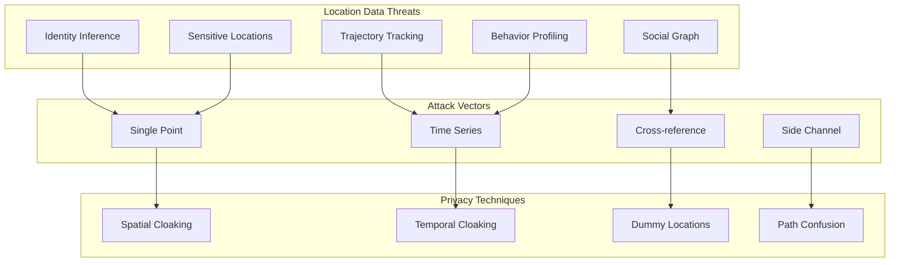
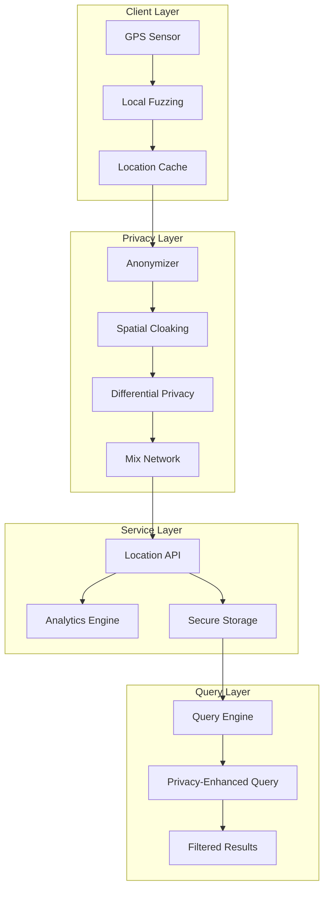

# Location Privacy Pattern

**Protect sensitive location data while enabling useful location-based services**

## Level 1: Intuition

## Core Concept

Like blurring your house on Street View, location privacy techniques obscure precise locations while preserving useful information.

**Problem**: Precise location reveals habits → privacy risks → surveillance concerns

**Solution**: Apply mathematical techniques to hide individuals while enabling analytics.

## Simple Example

```text
Real-world Analogy:
- Exact address: "123 Main St, Apt 4B"
- Neighborhood: "Downtown district"
- City-level: "San Francisco"
- Anonymous: "Urban area in California"

Digital Privacy:
- Raw: GPS coordinates (37.7749°N, 122.4194°W)
- Fuzzy: Within 500m radius
- K-anonymous: Among 5+ other users
- Differential: Statistical noise added
```

---

## Level 2: Foundation

## Privacy Threat Model



## Privacy Techniques Comparison

| Technique | Privacy Level | Utility Loss | Computation | Use Case |
|-----------|--------------|--------------|-------------|----------|
| **Truncation** | Low | Low | O(1) | Coarse analytics |
| **Random Noise** | Medium | Medium | O(1) | Individual queries |
| **K-Anonymity** | High | Medium | O(n) | Group queries |
| **Differential Privacy** | Very High | High | O(n) | Statistical analysis |
| **Secure Multiparty** | Maximum | Very High | O(n²) | Collaborative compute |

## Location Privacy Dimensions

1. **Spatial**: How precisely location is revealed
2. **Temporal**: When location updates are shared
3. **Identity**: Who is associated with location
4. **Semantic**: What the location reveals (home, work, hospital)

---

## Level 3: Implementation

## Location Privacy Architecture



## K-Anonymity Implementation

```python
import numpy as np
from typing import List, Tuple, Set
from dataclasses import dataclass
from collections import defaultdict
import hashlib

@dataclass
class Location:
    user_id: str
    lat: float
    lon: float
    timestamp: float
    attributes: dict = None

class KAnonymityEngine:
    """
    Implement k-anonymity for location privacy
    """
    
    def __init__(self, k: int = 5, max_region_size: float = 1.0):
        self.k = k  # Minimum anonymity set size
        self.max_region_size = max_region_size  # Max cloaking region (km)
        self.user_locations = {}
        self.anonymity_sets = {}
        
    def add_location(self, location: Location) -> Tuple[float, float, float]:
        """
        Process location with k-anonymity guarantee
        Returns: (cloaked_lat, cloaked_lon, radius)
        """
# Update user location
        self.user_locations[location.user_id] = location
        
# Find k-1 nearest neighbors
        neighbors = self._find_nearest_neighbors(location, self.k - 1)
        
        if len(neighbors) < self.k - 1:
# Not enough users for k-anonymity
# Return heavily cloaked location
            return self._heavy_cloaking(location)
            
# Create anonymity set
        anonymity_set = [location] + neighbors
        
# Calculate cloaking region
        cloaked_region = self._calculate_cloaking_region(anonymity_set)
        
# Check region size constraint
        if cloaked_region['radius'] > self.max_region_size:
# Region too large, use spatial decomposition
            cloaked_region = self._spatial_decomposition(anonymity_set)
            
# Store anonymity set
        set_id = self._generate_set_id(anonymity_set)
        self.anonymity_sets[set_id] = {
            'users': [loc.user_id for loc in anonymity_set],
            'region': cloaked_region,
            'timestamp': location.timestamp
        }
        
        return (
            cloaked_region['center_lat'],
            cloaked_region['center_lon'],
            cloaked_region['radius']
        )
        
    def _find_nearest_neighbors(
        self,
        location: Location,
        k: int
    ) -> List[Location]:
        """
        Find k nearest users to form anonymity set
        """
        distances = []
        
        for user_id, loc in self.user_locations.items():
            if user_id == location.user_id:
                continue
                
# Check temporal constraint (within 5 minutes)
            if abs(loc.timestamp - location.timestamp) > 300:
                continue
                
# Calculate distance
            dist = self._haversine_distance(
                location.lat, location.lon,
                loc.lat, loc.lon
            )
            
            distances.append((dist, loc))
            
# Sort by distance and return k nearest
        distances.sort(key=lambda x: x[0])
        return [loc for _, loc in distances[:k]]
        
    def _calculate_cloaking_region(
        self,
        locations: List[Location]
    ) -> dict:
        """
        Calculate minimum bounding circle for anonymity set
        """
        lats = [loc.lat for loc in locations]
        lons = [loc.lon for loc in locations]
        
# Find center (centroid)
        center_lat = np.mean(lats)
        center_lon = np.mean(lons)
        
# Find radius (max distance from center)
        max_dist = 0
        for loc in locations:
            dist = self._haversine_distance(
                center_lat, center_lon,
                loc.lat, loc.lon
            )
            max_dist = max(max_dist, dist)
            
        return {
            'center_lat': center_lat,
            'center_lon': center_lon,
            'radius': max_dist * 1.1  # Add 10% buffer
        }
        
    def _spatial_decomposition(self, locations: List[Location]) -> dict:
        """
        Use Hilbert curve for spatial decomposition
        """
# Convert to Hilbert space
        hilbert_coords = [
            self._lat_lon_to_hilbert(loc.lat, loc.lon)
            for loc in locations
        ]
        
# Find median Hilbert value
        median_hilbert = np.median(hilbert_coords)
        
# Convert back to lat/lon
        center_lat, center_lon = self._hilbert_to_lat_lon(median_hilbert)
        
# Use fixed radius based on decomposition level
        return {
            'center_lat': center_lat,
            'center_lon': center_lon,
            'radius': self.max_region_size
        }
        
    def _haversine_distance(self, lat1, lon1, lat2, lon2) -> float:
        """Calculate distance between two points on Earth (km)"""
        R = 6371  # Earth's radius in km
        
        dlat = np.radians(lat2 - lat1)
        dlon = np.radians(lon2 - lon1)
        a = (np.sin(dlat/2)**2 + 
             np.cos(np.radians(lat1)) * np.cos(np.radians(lat2)) * 
             np.sin(dlon/2)**2)
        c = 2 * np.arctan2(np.sqrt(a), np.sqrt(1-a))
        
        return R * c
```

## Differential Privacy for Locations

```python
class LocationDifferentialPrivacy:
    """
    Apply differential privacy to location data
    """
    
    def __init__(self, epsilon: float = 1.0, sensitivity: float = 0.001):
        self.epsilon = epsilon  # Privacy budget
        self.sensitivity = sensitivity  # Max location change (degrees)
        self.noise_scale = sensitivity / epsilon
        
    def add_noise_to_location(
        self,
        lat: float,
        lon: float,
        mechanism: str = 'laplace'
    ) -> Tuple[float, float]:
        """
        Add calibrated noise to location
        """
        if mechanism == 'laplace':
# Laplace mechanism
            lat_noise = np.random.laplace(0, self.noise_scale)
            lon_noise = np.random.laplace(0, self.noise_scale)
        elif mechanism == 'gaussian':
# Gaussian mechanism (for (ε,δ)-DP)
            delta = 1e-5
            sigma = self.sensitivity * np.sqrt(2 * np.log(1.25/delta)) / self.epsilon
            lat_noise = np.random.normal(0, sigma)
            lon_noise = np.random.normal(0, sigma)
        else:
            raise ValueError(f"Unknown mechanism: {mechanism}")
            
# Add noise while maintaining valid coordinates
        noisy_lat = np.clip(lat + lat_noise, -90, 90)
        noisy_lon = ((lon + lon_noise + 180) % 360) - 180
        
        return noisy_lat, noisy_lon
        
    def private_density_estimation(
        self,
        locations: List[Tuple[float, float]],
        grid_size: float = 0.01
    ) -> np.ndarray:
        """
        Create differentially private heat map
        """
# Create spatial grid
        lat_bins = np.arange(-90, 90, grid_size)
        lon_bins = np.arange(-180, 180, grid_size)
        
# Count locations in each grid cell
        hist, _, _ = np.histogram2d(
            [loc[0] for loc in locations],
            [loc[1] for loc in locations],
            bins=[lat_bins, lon_bins]
        )
        
# Add Laplace noise to counts
        noisy_hist = hist + np.random.laplace(
            0,
            1/self.epsilon,
            hist.shape
        )
        
# Post-process: ensure non-negative counts
        noisy_hist = np.maximum(0, noisy_hist)
        
        return noisy_hist
        
    def private_trajectory_release(
        self,
        trajectory: List[Location],
        sampling_rate: float = 0.1
    ) -> List[Location]:
        """
        Release trajectory with privacy guarantees
        """
# Sub-sample trajectory
        sampled = [
            loc for loc in trajectory
            if np.random.random() < sampling_rate
        ]
        
# Add noise to each point
        private_trajectory = []
        for loc in sampled:
            noisy_lat, noisy_lon = self.add_noise_to_location(
                loc.lat, loc.lon
            )
            
# Create new location with noise
            private_loc = Location(
                user_id="anonymous",  # Remove identifier
                lat=noisy_lat,
                lon=noisy_lon,
                timestamp=loc.timestamp + np.random.uniform(-300, 300),  # ±5 min
                attributes=self._sanitize_attributes(loc.attributes)
            )
            
            private_trajectory.append(private_loc)
            
        return private_trajectory
        
    def _sanitize_attributes(self, attributes: dict) -> dict:
        """Remove or generalize sensitive attributes"""
        if not attributes:
            return {}
            
        sanitized = {}
        
# Generalize speed
        if 'speed' in attributes:
            speed = attributes['speed']
            if speed < 5:
                sanitized['movement'] = 'stationary'
            elif speed < 50:
                sanitized['movement'] = 'local'
            else:
                sanitized['movement'] = 'highway'
                
# Generalize accuracy
        if 'accuracy' in attributes:
            acc = attributes['accuracy']
            if acc < 10:
                sanitized['accuracy'] = 'high'
            elif acc < 100:
                sanitized['accuracy'] = 'medium'
            else:
                sanitized['accuracy'] = 'low'
                
        return sanitized
```

## Location Obfuscation Techniques

```typescript
// Client-side location privacy protection
class LocationObfuscator {
  private readonly gridSize = 0.001; // ~111 meters
  private dummyCache: Location[] = [];
  
  constructor(
    private privacyLevel: 'low' | 'medium' | 'high' = 'medium'
  ) {}
  
  obfuscateLocation(location: Location): ObfuscatedLocation {
    switch (this.privacyLevel) {
      case 'low':
        return this.truncateLocation(location);
      case 'medium':
        return this.gridSnapLocation(location);
      case 'high':
        return this.dummyLocationTechnique(location);
      default:
        return this.gridSnapLocation(location);
    }
  }
  
  private truncateLocation(location: Location): ObfuscatedLocation {
    // Reduce precision to 3 decimal places (~111m)
    return {
      lat: Math.round(location.lat * 1000) / 1000,
      lon: Math.round(location.lon * 1000) / 1000,
      accuracy: 111,
      technique: 'truncation'
    };
  }
  
  private gridSnapLocation(location: Location): ObfuscatedLocation {
    // Snap to nearest grid point
    const gridLat = Math.floor(location.lat / this.gridSize) * this.gridSize;
    const gridLon = Math.floor(location.lon / this.gridSize) * this.gridSize;
    
    // Add small random offset within grid
    const offsetLat = (Math.random() - 0.5) * this.gridSize;
    const offsetLon = (Math.random() - 0.5) * this.gridSize;
    
    return {
      lat: gridLat + offsetLat,
      lon: gridLon + offsetLon,
      accuracy: this.gridSize * 111000, // meters
      technique: 'grid_snap'
    };
  }
  
  private dummyLocationTechnique(location: Location): ObfuscatedLocation {
    // Generate dummy locations
    const dummies = this.generateDummyLocations(location, 4);
    
    // Cache for future queries
    this.dummyCache = [...this.dummyCache, ...dummies].slice(-20);
    
    // Return obfuscated real location
    const obfuscated = this.gridSnapLocation(location);
    
    // Schedule dummy location broadcasts
    this.scheduleDummyBroadcasts(dummies);
    
    return {
      ...obfuscated,
      technique: 'dummy_locations',
      dummyCount: dummies.length
    };
  }
  
  private generateDummyLocations(
    realLocation: Location,
    count: number
  ): Location[] {
    const dummies: Location[] = [];
    
    // Use cached locations if available
    const candidates = this.dummyCache.filter(
      loc => this.distance(loc, realLocation) < 5 // 5km radius
    );
    
    for (let i = 0; i < count; i++) {
      if (candidates.length > i) {
        // Reuse historical location
        dummies.push(this.perturbLocation(candidates[i]));
      } else {
        // Generate new dummy
        const angle = (Math.PI * 2 * i) / count;
        const distance = Math.random() * 2 + 0.5; // 0.5-2.5km
        
        const dummy = {
          lat: realLocation.lat + (distance / 111) * Math.cos(angle),
          lon: realLocation.lon + (distance / 111) * Math.sin(angle),
          timestamp: realLocation.timestamp
        };
        
        dummies.push(dummy);
      }
    }
    
    return dummies;
  }
  
  private scheduleDummyBroadcasts(dummies: Location[]): void {
    // Send dummy locations at random intervals
    dummies.forEach((dummy, index) => {
      const delay = Math.random() * 5000 + index * 1000; // 0-5s + offset
      
      setTimeout(() => {
        this.broadcastLocation(dummy, true);
      }, delay);
    });
  }
}
```

## Semantic Location Privacy

```python
class SemanticLocationPrivacy:
    """
    Protect sensitive location semantics (home, work, hospital)
    """
    
    def __init__(self):
        self.sensitive_categories = {
            'healthcare': ['hospital', 'clinic', 'pharmacy', 'doctor'],
            'religious': ['church', 'mosque', 'temple', 'synagogue'],
            'political': ['party_office', 'protest_site', 'government'],
            'adult': ['bar', 'club', 'casino'],
            'financial': ['bank', 'atm', 'loan_office']
        }
        
        self.poi_database = self._load_poi_database()
        
    def check_location_sensitivity(
        self,
        lat: float,
        lon: float,
        radius: float = 100
    ) -> dict:
        """
        Determine if location is near sensitive POIs
        """
        nearby_pois = self._find_nearby_pois(lat, lon, radius)
        
        sensitivity_score = 0
        sensitive_types = []
        
        for poi in nearby_pois:
            for category, keywords in self.sensitive_categories.items():
                if any(kw in poi['type'].lower() for kw in keywords):
                    sensitivity_score += self._calculate_sensitivity(poi, lat, lon)
                    sensitive_types.append(category)
                    
        return {
            'is_sensitive': sensitivity_score > 0.5,
            'sensitivity_score': min(1.0, sensitivity_score),
            'categories': list(set(sensitive_types)),
            'recommendation': self._get_privacy_recommendation(sensitivity_score)
        }
        
    def generalize_semantic_location(
        self,
        lat: float,
        lon: float,
        poi_info: dict
    ) -> dict:
        """
        Replace specific POI with general category
        """
        if poi_info['type'] in ['hospital', 'clinic']:
            return {'type': 'healthcare_facility', 'specific': False}
        elif poi_info['type'] in ['home', 'residence']:
            return {'type': 'residential_area', 'specific': False}
        elif poi_info['type'] in ['office', 'workplace']:
            return {'type': 'commercial_area', 'specific': False}
        else:
# For non-sensitive, can be more specific
            return {'type': poi_info['type'], 'specific': True}
            
    def create_semantic_cloaking_region(
        self,
        sensitive_location: dict,
        min_diversity: int = 3
    ) -> dict:
        """
        Create region with semantic diversity
        """
        lat, lon = sensitive_location['lat'], sensitive_location['lon']
        
# Find region with at least min_diversity different POI types
        radius = 100  # Start with 100m
        
        while radius < 5000:  # Max 5km
            nearby_pois = self._find_nearby_pois(lat, lon, radius)
            poi_types = set(poi['general_type'] for poi in nearby_pois)
            
            if len(poi_types) >= min_diversity:
                return {
                    'center_lat': lat,
                    'center_lon': lon,
                    'radius': radius,
                    'semantic_diversity': len(poi_types),
                    'poi_types': list(poi_types)
                }
                
            radius *= 1.5
            
# Fallback to large region
        return {
            'center_lat': lat,
            'center_lon': lon,
            'radius': 5000,
            'semantic_diversity': 'unknown',
            'poi_types': ['mixed']
        }
```

---

## Level 4: Deep Dive

## Advanced Privacy Techniques

### 1. Mix Zones
```python
class MixZone:
    """
    Create mix zones where users change pseudonyms
    """
    
    def __init__(self, zone_locations: List[dict]):
        self.zones = zone_locations
        self.user_pseudonyms = {}
        self.zone_occupancy = defaultdict(set)
        
    def enter_mix_zone(self, user_id: str, zone_id: str) -> str:
        """
        User enters mix zone and gets new pseudonym
        """
# Add to zone
        self.zone_occupancy[zone_id].add(user_id)
        
# Wait for minimum occupancy
        if len(self.zone_occupancy[zone_id]) < 3:
            return None  # Keep collecting users
            
# Generate new pseudonyms for all users in zone
        users_in_zone = list(self.zone_occupancy[zone_id])
        new_pseudonyms = self._generate_pseudonyms(len(users_in_zone))
        
# Randomly assign pseudonyms
        np.random.shuffle(new_pseudonyms)
        
        assignments = {}
        for user, pseudonym in zip(users_in_zone, new_pseudonyms):
            self.user_pseudonyms[user] = pseudonym
            assignments[user] = pseudonym
            
# Clear zone
        self.zone_occupancy[zone_id].clear()
        
        return assignments.get(user_id)
```

### 2. Secure Multiparty Computation
```python
class SecureLocationAggregation:
    """
    Aggregate locations without revealing individual positions
    """
    
    def __init__(self, parties: int, threshold: int):
        self.parties = parties
        self.threshold = threshold  # Min parties for reconstruction
        
    def share_location(self, location: Location) -> List[Share]:
        """
        Create secret shares of location
        """
# Convert to fixed-point representation
        lat_int = int(location.lat * 1e6)
        lon_int = int(location.lon * 1e6)
        
# Create polynomial shares
        lat_shares = self._create_shares(lat_int)
        lon_shares = self._create_shares(lon_int)
        
        return [
            Share(party_id=i, lat_share=lat_shares[i], lon_share=lon_shares[i])
            for i in range(self.parties)
        ]
        
    def _create_shares(self, secret: int) -> List[int]:
        """
        Shamir's secret sharing
        """
# Random polynomial of degree threshold-1
        coefficients = [secret] + [
            random.randint(0, 2**32) 
            for _ in range(self.threshold - 1)
        ]
        
# Evaluate at points 1, 2, ..., parties
        shares = []
        for x in range(1, self.parties + 1):
            y = sum(coef * (x ** i) for i, coef in enumerate(coefficients))
            shares.append(y % (2**32))
            
        return shares
```

### 3. Homomorphic Location Encryption
```python
class HomomorphicLocationEncryption:
    """
    Compute on encrypted locations
    """
    
    def __init__(self, public_key, private_key=None):
        self.public_key = public_key
        self.private_key = private_key
        
    def encrypt_location(self, lat: float, lon: float) -> EncryptedLocation:
        """
        Encrypt location preserving some operations
        """
# Convert to integers (micrometers)
        lat_int = int(lat * 1e6)
        lon_int = int(lon * 1e6)
        
# Paillier encryption (supports addition)
        enc_lat = self.public_key.encrypt(lat_int)
        enc_lon = self.public_key.encrypt(lon_int)
        
        return EncryptedLocation(enc_lat, enc_lon)
        
    def compute_encrypted_centroid(
        self,
        encrypted_locations: List[EncryptedLocation]
    ) -> EncryptedLocation:
        """
        Compute centroid without decryption
        """
        n = len(encrypted_locations)
        
# Sum encrypted values
        enc_sum_lat = encrypted_locations[0].lat
        enc_sum_lon = encrypted_locations[0].lon
        
        for loc in encrypted_locations[1:]:
            enc_sum_lat += loc.lat
            enc_sum_lon += loc.lon
            
# Division requires special protocol
# Return encrypted sum for now
        return EncryptedLocation(enc_sum_lat, enc_sum_lon)
```

## Privacy-Preserving Analytics

```typescript
// Privacy-preserving location analytics
class PrivateLocationAnalytics {
  constructor(
    private epsilon: number = 1.0,
    private delta: number = 1e-5
  ) {}
  
  async computePrivateDensityMap(
    locations: Location[],
    gridSize: number = 100, // meters
    bounds: Bounds
  ): Promise<DensityMap> {
    // Create spatial grid
    const grid = this.createSpatialGrid(bounds, gridSize);
    
    // Count locations per cell with differential privacy
    const privateCounts = new Map<string, number>();
    
    // Add each location to grid
    for (const location of locations) {
      const cell = this.getGridCell(location, grid);
      const currentCount = privateCounts.get(cell) || 0;
      privateCounts.set(cell, currentCount + 1);
    }
    
    // Add Laplace noise to each cell
    const sensitivity = 1; // Each user contributes to at most 1 cell
    const scale = sensitivity / this.epsilon;
    
    for (const [cell, count] of privateCounts.entries()) {
      const noise = this.laplaceSample(scale);
      const noisyCount = Math.max(0, count + noise);
      privateCounts.set(cell, noisyCount);
    }
    
    // Post-processing: smooth and threshold
    return this.postProcessDensityMap(privateCounts, grid);
  }
  
  async computePrivateFlowMatrix(
    trajectories: Trajectory[],
    regions: Region[]
  ): Promise<FlowMatrix> {
    // Initialize flow matrix
    const flowMatrix = new Map<string, Map<string, number>>();
    
    // Process each trajectory
    for (const trajectory of trajectories) {
      const transitions = this.extractTransitions(trajectory, regions);
      
      for (const transition of transitions) {
        const fromRegion = transition.from;
        const toRegion = transition.to;
        
        if (!flowMatrix.has(fromRegion)) {
          flowMatrix.set(fromRegion, new Map());
        }
        
        const current = flowMatrix.get(fromRegion)!.get(toRegion) || 0;
        flowMatrix.get(fromRegion)!.set(toRegion, current + 1);
      }
    }
    
    // Add noise to flow counts
    const privateFlowMatrix = new Map<string, Map<string, number>>();
    
    for (const [from, destinations] of flowMatrix.entries()) {
      privateFlowMatrix.set(from, new Map());
      
      for (const [to, count] of destinations.entries()) {
        const noise = this.laplaceSample(2 / this.epsilon); // Sensitivity 2
        const privateCount = Math.max(0, count + noise);
        
        // Only keep flows above threshold
        if (privateCount > 5) {
          privateFlowMatrix.get(from)!.set(to, privateCount);
        }
      }
    }
    
    return this.normalizeFlowMatrix(privateFlowMatrix);
  }
  
  private laplaceSample(scale: number): number {
    // Sample from Laplace distribution
    const u = Math.random() - 0.5;
    return -scale * Math.sign(u) * Math.log(1 - 2 * Math.abs(u));
  }
}
```

---

## Level 5: Production

## Location Privacy at Scale

### System Architecture
```python
class ScalableLocationPrivacySystem:
    def __init__(self):
        self.privacy_engine = DistributedPrivacyEngine()
        self.cache = LocationCache()
        self.monitor = PrivacyMonitor()
        
    async def process_location_stream(
        self,
        location_stream: AsyncIterator[Location]
    ):
        """Process high-volume location updates with privacy"""
        
        batch = []
        batch_start = time.time()
        
        async for location in location_stream:
# Check privacy policy
            policy = await self.get_user_privacy_policy(location.user_id)
            
# Apply appropriate privacy technique
            if policy.technique == 'k_anonymity':
                batch.append(location)
                
# Process batch when k users accumulated or timeout
                if len(batch) >= policy.k or time.time() - batch_start > 5:
                    await self._process_k_anonymity_batch(batch)
                    batch = []
                    batch_start = time.time()
                    
            elif policy.technique == 'differential_privacy':
# Apply noise immediately
                private_location = self.privacy_engine.add_noise(location)
                await self._emit_private_location(private_location)
                
            elif policy.technique == 'semantic_generalization':
# Generalize based on POI
                general_location = await self._generalize_location(location)
                await self._emit_private_location(general_location)
                
# Monitor privacy metrics
            self.monitor.record_event(location.user_id, policy.technique)
```

### Performance Optimizations
```python
class OptimizedLocationPrivacy:
    def __init__(self):
# Spatial index for fast neighbor queries
        self.spatial_index = rtree.index.Index()
        
# Pre-computed noise values
        self.noise_pool = self._precompute_noise(10000)
        
# Caching for repeated queries
        self.anonymity_cache = LRUCache(maxsize=10000)
        
    def _precompute_noise(self, size: int) -> np.ndarray:
        """Pre-compute Laplace noise for performance"""
        return np.random.laplace(0, self.noise_scale, size=(size, 2))
        
    def fast_k_anonymity_lookup(self, location: Location) -> Optional[CloakingRegion]:
        """O(log n) nearest neighbor search"""
        
# Check cache first
        cache_key = f"{location.lat:.3f},{location.lon:.3f}"
        if cache_key in self.anonymity_cache:
            return self.anonymity_cache[cache_key]
            
# Use spatial index for fast lookup
        nearby = list(self.spatial_index.nearest(
            (location.lon, location.lat, location.lon, location.lat),
            self.k
        ))
        
        if len(nearby) >= self.k:
            region = self._compute_cloaking_region(nearby)
            self.anonymity_cache[cache_key] = region
            return region
            
        return None
```

## Security Considerations

### 1. Inference Attacks
```python
class InferenceAttackDefense:
    def detect_tracking_attempt(self, queries: List[LocationQuery]) -> bool:
        """
        Detect potential tracking attacks
        """
# Check for suspicious query patterns
        if self._is_following_pattern(queries):
            return True
            
# Check for intersection attacks
        if self._is_intersection_attack(queries):
            return True
            
# Check for timing correlation
        if self._is_timing_attack(queries):
            return True
            
        return False
        
    def _is_following_pattern(self, queries: List[LocationQuery]) -> bool:
        """Detect queries following a movement pattern"""
        if len(queries) < 3:
            return False
            
# Calculate query trajectory
        velocities = []
        for i in range(1, len(queries)):
            dt = queries[i].timestamp - queries[i-1].timestamp
            dx = queries[i].lon - queries[i-1].lon
            dy = queries[i].lat - queries[i-1].lat
            
            if dt > 0:
                velocities.append((dx/dt, dy/dt))
                
# Check if velocities are consistent (following)
        if not velocities:
            return False
            
        velocity_variance = np.var(velocities, axis=0)
        return np.all(velocity_variance < 0.001)  # Low variance = following
```

### 2. Privacy Budget Management
```python
class PrivacyBudgetManager:
    def __init__(self, total_epsilon: float = 10.0):
        self.total_epsilon = total_epsilon
        self.user_budgets = {}
        self.budget_refresh_period = 86400  # 24 hours
        
    def allocate_budget(self, user_id: str, query_type: str) -> Optional[float]:
        """
        Allocate privacy budget for query
        """
# Get or create user budget
        if user_id not in self.user_budgets:
            self.user_budgets[user_id] = {
                'remaining': self.total_epsilon,
                'last_refresh': time.time(),
                'history': []
            }
            
        budget = self.user_budgets[user_id]
        
# Refresh if period elapsed
        if time.time() - budget['last_refresh'] > self.budget_refresh_period:
            budget['remaining'] = self.total_epsilon
            budget['last_refresh'] = time.time()
            budget['history'] = []
            
# Calculate required epsilon
        required_epsilon = self._get_query_cost(query_type)
        
        if budget['remaining'] >= required_epsilon:
# Deduct budget
            budget['remaining'] -= required_epsilon
            budget['history'].append({
                'timestamp': time.time(),
                'query_type': query_type,
                'epsilon': required_epsilon
            })
            
            return required_epsilon
        else:
# Budget exhausted
            return None
            
    def _get_query_cost(self, query_type: str) -> float:
        """Epsilon cost for different query types"""
        costs = {
            'point_query': 0.1,
            'range_query': 0.5,
            'trajectory_query': 1.0,
            'aggregate_query': 0.3
        }
        return costs.get(query_type, 0.5)
```

## Real-World Case Studies

### Uber's Location Privacy (2016)
- **Challenge**: Protecting rider privacy while enabling features
- **Solution**: Differential privacy for aggregate analytics
- **Impact**: Maintained utility while preventing individual tracking

### Apple's Location Services
- **Challenge**: Crowdsourced data without tracking users
- **Solution**: Differential privacy + random sampling
- **Innovation**: Local differential privacy on device

### Strava Heat Map Incident (2018)
- **Issue**: Military base locations revealed through fitness tracking
- **Problem**: No geofencing of sensitive locations
- **Lesson**: Consider semantic sensitivity, not just coordinates

## Monitoring & Metrics

```python
class LocationPrivacyMetrics:
    def __init__(self):
        self.metrics = MetricsCollector()
        
    def track_privacy_metrics(self):
# Privacy level distribution
        self.metrics.histogram(
            'location.privacy.level',
            tags=['technique']
        )
        
# Utility loss metrics
        self.metrics.gauge(
            'location.privacy.utility_loss',
            self.calculate_utility_loss()
        )
        
# Performance metrics
        self.metrics.timer(
            'location.privacy.processing_time',
            tags=['technique']
        )
        
# Privacy violations
        self.metrics.counter(
            'location.privacy.violations',
            tags=['type']
        )
        
    def privacy_dashboard(self) -> dict:
        return {
            'active_users': self.count_active_users(),
            'privacy_techniques': self.get_technique_distribution(),
            'average_k_anonymity': self.calculate_average_k(),
            'epsilon_usage': self.get_epsilon_consumption(),
            'inference_attacks_blocked': self.count_blocked_attacks(),
            'utility_metrics': {
                'spatial_accuracy': self.measure_spatial_accuracy(),
                'temporal_accuracy': self.measure_temporal_accuracy(),
                'query_success_rate': self.calculate_query_success_rate()
            }
        }
```

## Testing Location Privacy

```python
def test_k_anonymity_guarantee():
    """Test that k-anonymity is maintained"""
    engine = KAnonymityEngine(k=5)
    
# Add locations
    locations = generate_test_locations(100)
    anonymized = []
    
    for loc in locations:
        result = engine.add_location(loc)
        anonymized.append(result)
        
# Verify k-anonymity
    for i, anon_loc in enumerate(anonymized):
# Count how many users could be at this location
        possible_users = count_possible_users(anon_loc, locations)
        assert possible_users >= 5, f"K-anonymity violated: only {possible_users} possible users"
        

def test_differential_privacy_bounds():
    """Test that noise is properly calibrated"""
    dp_engine = LocationDifferentialPrivacy(epsilon=1.0)
    
# Test noise distribution
    noise_samples = [
        dp_engine.add_noise_to_location(0, 0)[0]
        for _ in range(10000)
    ]
    
# Should follow Laplace distribution
    _, p_value = stats.kstest(
        noise_samples,
        lambda x: stats.laplace.cdf(x, scale=dp_engine.noise_scale)
    )
    
    assert p_value > 0.05, "Noise doesn't follow expected distribution"
```

## Key Takeaways

### Do's ✅
- Apply privacy techniques before transmission
- Use semantic awareness for sensitive locations
- Implement privacy budget management
- Monitor for inference attacks
- Test privacy guarantees rigorously
- Consider temporal correlations

### Don'ts ❌
- Store raw location history
- Ignore semantic sensitivity
- Use weak obfuscation (just truncation)
- Allow unlimited queries
- Forget about side channels
- Assume privacy techniques compose

### Critical Success Factors
1. **User Control**: Clear privacy settings and choices
2. **Utility Balance**: Maintain service quality with privacy
3. **Attack Resistance**: Defend against inference attacks
4. **Compliance**: Meet regulatory requirements
5. **Performance**: Scale privacy techniques efficiently

## Related Patterns
- [Consent Management](consent-management.md) - User privacy preferences
- [Edge Computing](edge-computing.md) - Local privacy processing
- [Zero Trust Security] (Pattern: Zero Trust - Coming Soon) - Never trust location claims
- [Data Minimization] (Pattern: Data Minimization - Coming Soon) - Collect only necessary data

## References
- [Differential Privacy for Location Data](https://privacytools.seas.harvard.edu/publications/differential-privacy-location-data) - Harvard Privacy Tools
- [K-Anonymity in Practice](https://arxiv.org/abs/cs/0507048) - Limitations and enhancements
- [Location Privacy Survey](https://www.cs.columbia.edu/~suman/location_privacy_survey.pdf) - Columbia University
- [Apple's Differential Privacy](https://www.apple.com/privacy/docs/Differential_Privacy_Overview.pdf) - Implementation details