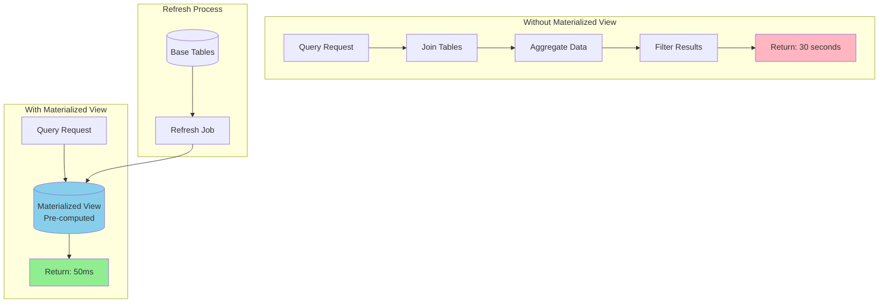
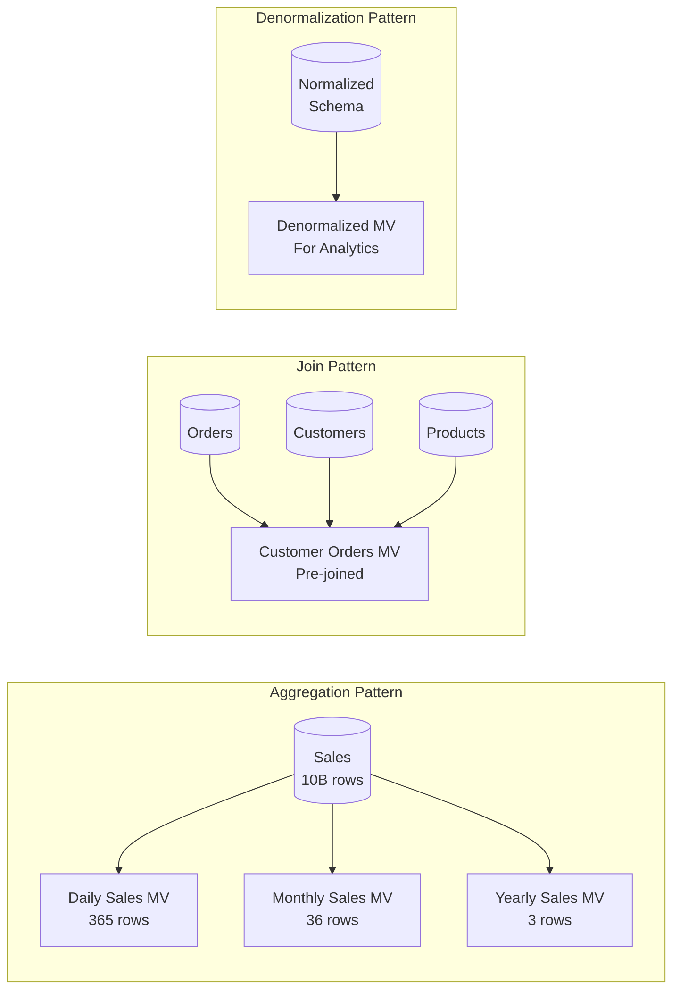
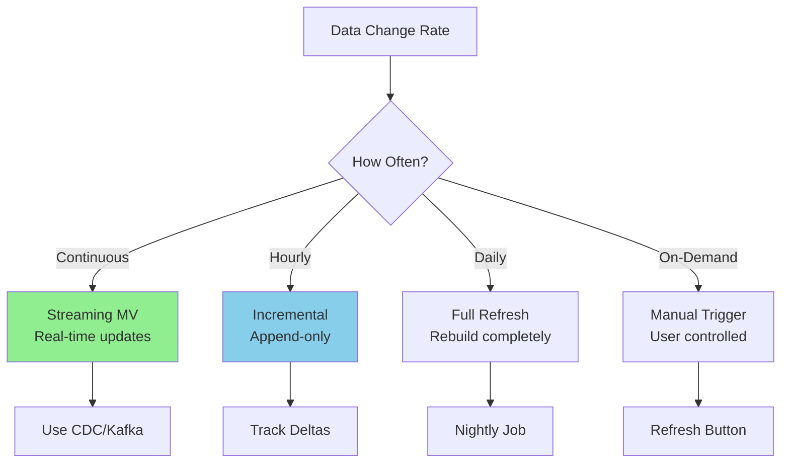
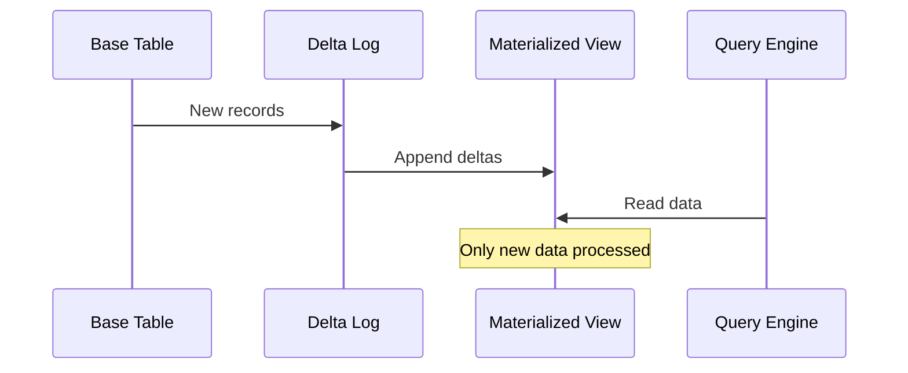
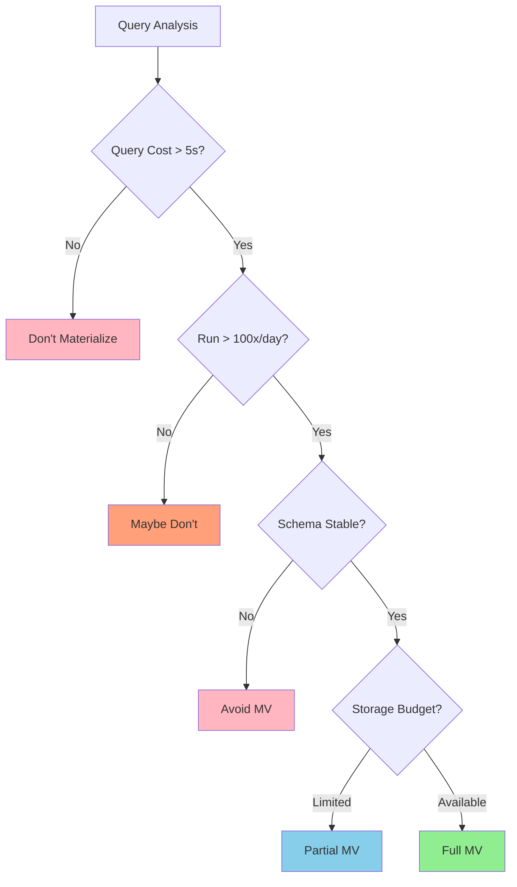
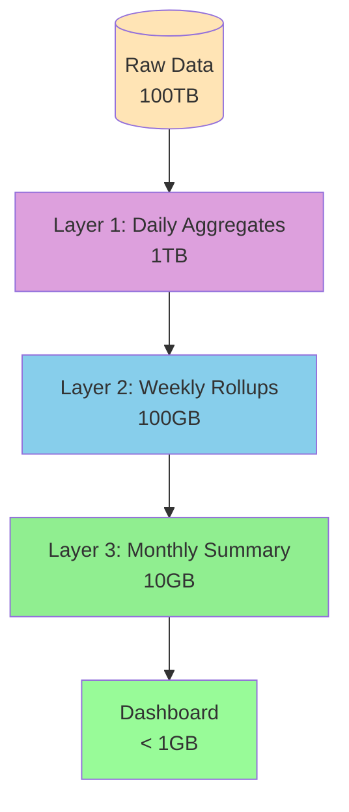

# Materialized View Pattern

!!! success "🏆 Gold Standard Pattern"
    **Query Performance at Data Warehouse Scale** • BigQuery, Redshift, Snowflake proven
    
    When queries take minutes on petabytes of data, materialized views turn them into milliseconds. From BigQuery processing 110TB/second to Snowflake's zero-maintenance views, this pattern powers modern analytics.
    
    **Key Success Metrics:**
    - Google BigQuery: 110TB/second with pre-computed results
    - Amazon Redshift: Exabyte-scale queries optimized automatically
    - Snowflake: 7,800+ customers with instant analytics

**Pre-compute once, query instantly**

## Visual Architecture



## Materialized View vs Regular View

| Aspect | Regular View | Materialized View |
|--------|--------------|-------------------|
| **Storage** | No storage (virtual) | Physical storage |
| **Query Speed** | Slow (real-time compute) | Fast (pre-computed) |
| **Data Freshness** | Always current | Depends on refresh |
| **Storage Cost** | None | Can be significant |
| **Maintenance** | None | Refresh required |
| **Use Case** | Simple queries | Complex aggregations |

## Common Materialization Patterns



## Refresh Strategies

<div class="decision-box">
<h4>🎯 Choosing Refresh Strategy</h4>


</div>

## Implementation Strategies

### 1. Complete Refresh
```sql
-- Drop and recreate
CREATE MATERIALIZED VIEW sales_summary AS
SELECT 
    date_trunc('day', order_date) as day,
    product_category,
    SUM(amount) as total_sales,
    COUNT(*) as order_count,
    AVG(amount) as avg_order_value
FROM orders
GROUP BY 1, 2;
```

### 2. Incremental Refresh


### 3. Real-time Materialization

| Technology | Approach | Latency | Use Case |
|------------|----------|---------|----------|
| **Kafka + ksqlDB** | Stream processing | < 1 second | Real-time dashboards |
| **Spark Streaming** | Micro-batches | 1-10 seconds | Near real-time analytics |
| **DBT** | Scheduled SQL | Minutes-Hours | Daily reporting |
| **Materialize** | Incremental compute | Milliseconds | Streaming analytics |

## Performance Impact

<div class="axiom-box">
<h4>📊 Real-World Performance Gains</h4>

| Query Type | Without MV | With MV | Improvement |
|------------|------------|---------|-------------|
| Daily sales summary | 45 seconds | 50ms | 900x |
| Customer 360 view | 12 seconds | 100ms | 120x |
| Product recommendations | 8 seconds | 25ms | 320x |
| Dashboard load | 30 seconds | 200ms | 150x |

**Uber Case Study**: Reduced driver analytics queries from 2 minutes to 500ms using materialized views
</div>

## Cost-Benefit Analysis

```mermaid
graph LR
    subgraph "Costs"
        C1[Storage Space]
        C2[Refresh Compute]
        C3[Maintenance Effort]
        C4[Staleness Risk]
    end
    
    subgraph "Benefits"
        B1[Query Speed]
        B2[Reduced Load]
        B3[User Experience]
        B4[Cost Savings]
    end
    
    subgraph "ROI Calculation"
        Formula[ROI = (Query Cost Saved - Storage Cost) × Query Frequency]
    end
    
    C1 --> Formula
    B1 --> Formula
    B4 --> Formula
```

## Common Pitfalls

<div class="failure-vignette">
<h4>💥 The Stale Data Disaster</h4>

**What Happened**: E-commerce company showed wrong inventory counts
**Root Cause**: Materialized view refresh failed silently for 3 days
**Impact**: $2M in oversold inventory
**Solution**: 
- Staleness monitoring with alerts
- Fallback to base tables on staleness
- Health checks on refresh jobs
</div>

## When to Materialize



## Production Patterns

### 1. Layered Materialization


### 2. Lambda Architecture Integration
- **Speed Layer**: Real-time views (last hour)
- **Batch Layer**: Historical materialized views
- **Serving Layer**: Merged results

## Monitoring & Maintenance

| Metric | Alert Threshold | Action |
|--------|-----------------|--------|
| **Refresh Latency** | > 2x normal | Check job health |
| **Staleness** | > 24 hours | Force refresh |
| **Storage Growth** | > 20% monthly | Review retention |
| **Query Rewrite Rate** | < 50% | Optimize rules |
| **Refresh Failures** | > 2 consecutive | Page on-call |

<div class="truth-box">
<h4>💡 Materialized View Production Insights</h4>

**The 10-100-1000 Rule:**
- 10x: Typical query speedup from materialization
- 100x: Storage cost increase (worth it!)
- 1000x: Maintenance complexity for real-time views

**Staleness Reality:**
```
User Tolerance:
- Analytics dashboards: 1-24 hours
- Search results: 1-5 minutes
- Shopping recommendations: 1 hour
- Financial reports: End of day
```

**Real-World Patterns:**
- 80% of queries hit 20% of materialized views
- View refresh failures spike during schema changes
- Incremental refresh breaks more often than full refresh
- Most "real-time" requirements are actually "near-time"

**Production Wisdom:**
> "The fastest query is the one that's already been answered. Materialized views are just very patient query results."

**Economic Truth:**
- Storage cost: $0.023/GB/month (S3)
- Compute cost: $0.10/hour (refresh job)
- Engineer debugging stale view: $200/hour
- Business decision on wrong data: $Millions

**The Three Commandments of Materialization:**
1. **Monitor staleness religiously** - Users won't tell you
2. **Version your view schemas** - Migrations are hell
3. **Plan for refresh failures** - They will happen
</div>

## Related Patterns

- [Caching Strategies](caching-strategies.md) - In-memory materialization
- [CQRS](cqrs.md) - Separate read models
- [Event Sourcing](event-sourcing.md) - Source for materialization
- [Lambda Architecture](lambda-architecture.md) - Batch + stream views
- [Data Lake](data-lake.md) - Source for analytics MVs