# Merkle Trees Pattern

**Cryptographic data structure for efficient verification and synchronization**


## Visual Overview

### Complete Merkle Tree Structure

```mermaid
graph TD
    Root[Root Hash<br/>abc123...]
    H12[Hash 1-2<br/>def456...]
    H34[Hash 3-4<br/>ghi789...]
    H1[Hash 1<br/>jkl012...]
    H2[Hash 2<br/>mno345...]
    H3[Hash 3<br/>pqr678...]
    H4[Hash 4<br/>stu901...]
    D1[Data Block 1<br/>"Hello"]
    D2[Data Block 2<br/>"World"]
    D3[Data Block 3<br/>"Merkle"]
    D4[Data Block 4<br/>"Trees"]
    
    Root --> H12
    Root --> H34
    H12 --> H1
    H12 --> H2
    H34 --> H3
    H34 --> H4
    H1 --> D1
    H2 --> D2
    H3 --> D3
    H4 --> D4
    
    classDef root fill:#5448C8,stroke:#333,stroke-width:3px,color:#fff
    classDef internal fill:#00BCD4,stroke:#333,stroke-width:2px,color:#fff
    classDef leaf fill:#4CAF50,stroke:#333,stroke-width:2px,color:#fff
    classDef data fill:#FFF3E0,stroke:#333,stroke-width:2px
    
    class Root root
    class H12,H34 internal
    class H1,H2,H3,H4 leaf
    class D1,D2,D3,D4 data
```

## How Merkle Trees Work

### Step-by-Step Construction Process

```mermaid
flowchart TB
    subgraph "Step 1: Hash Data Blocks"
        D1A[Data: "Hello"] --> H1A[SHA256] --> R1A[Hash: jkl012...]
        D2A[Data: "World"] --> H2A[SHA256] --> R2A[Hash: mno345...]
        D3A[Data: "Merkle"] --> H3A[SHA256] --> R3A[Hash: pqr678...]
        D4A[Data: "Trees"] --> H4A[SHA256] --> R4A[Hash: stu901...]
    end
    
    subgraph "Step 2: Build Internal Nodes"
        R1A --> C1[Concatenate]
        R2A --> C1
        C1 --> H12B[SHA256] --> IH1[Hash: def456...]
        
        R3A --> C2[Concatenate]
        R4A --> C2
        C2 --> H34B[SHA256] --> IH2[Hash: ghi789...]
    end
    
    subgraph "Step 3: Compute Root"
        IH1 --> C3[Concatenate]
        IH2 --> C3
        C3 --> RH[SHA256] --> ROOT[Root: abc123...]
    end
```

### Visual Hash Propagation

<div class="grid">
<div class="card">
<h4>🔄 Change Detection</h4>

```mermaid
graph TD
    subgraph "Original State"
        O1[Data: "Hello"]
        OH1[Hash: jkl012]
        OH12[Hash: def456]
        OR[Root: abc123]
    end
    
    subgraph "After Change"
        N1[Data: "Hi"]
        NH1[Hash: xyz999]
        NH12[Hash: uvw888]
        NR[Root: rst777]
    end
    
    O1 -->|Modified| N1
    OH1 -->|Changes| NH1
    OH12 -->|Changes| NH12
    OR -->|Changes| NR
    
    style N1 fill:#FFB6C1
    style NH1 fill:#FFB6C1
    style NH12 fill:#FFB6C1
    style NR fill:#FFB6C1
```

Any data change bubbles up to root
</div>

<div class="card">
<h4>✅ Verification Path</h4>


Only log(n) hashes needed
</div>
</div>

## Performance Characteristics

### Complexity Analysis Table

<div class="responsive-table" markdown>

| Operation | Time Complexity | Space Complexity | Proof Size |
|-----------|-----------------|------------------|------------|
| **Build tree** | O(n) | O(n) | N/A |
| **Update leaf** | O(log n) | O(1) | N/A |
| **Verify proof** | O(log n) | O(log n) | O(log n) |
| **Find differences** | O(n) worst | O(log n) avg | N/A |
| **Generate proof** | O(log n) | O(log n) | O(log n) |
| **Merge trees** | O(n) | O(n) | N/A |

</div>


### Visual Proof Size Comparison

```mermaid
graph LR
    subgraph "Without Merkle Tree"
        V1[Verify all data]
        S1[Send 1GB file]
        C1[Compare 1M blocks]
        T1[Time: O(n)]
    end
    
    subgraph "With Merkle Tree"
        V2[Verify proof]
        S2[Send 10 hashes]
        C2[Compare 10 hashes]
        T2[Time: O(log n)]
    end
    
    V1 --> T1
    V2 --> T2
    
    style T1 fill:#FFB6C1
    style T2 fill:#90EE90
```

## Real-World Applications

### 1. Git Version Control


### 2. Blockchain Architecture


### 3. Distributed Storage Systems

!!! note "Amazon DynamoDB Anti-Entropy"
    ```mermaid
    graph TB
    subgraph "Replica A"
    RA[Root: abc123]
    RAData[1M items]
    end
    subgraph "Replica B"
    RB[Root: def456]
    RBData[1M items]
    end
    subgraph "Sync Process"
    Compare[Roots differ!]
    Traverse[Find differences
    via tree traversal]
    Sync[Sync only
    changed branches]
    end
    RA --> Compare
    RB --> Compare
    Compare --> Traverse
    Traverse --> Sync
    ```
    **Benefits:**
    - Minimize data transfer
    - Quick divergence detection
    - Efficient reconciliation

## Implementation Patterns

### Visual Tree Construction Strategies

<div class="grid">
<div class="card">
<h4>🌳 Binary Merkle Tree</h4>


- **Structure**: Each node has exactly 2 children
- **Height**: log₂(n)
- **Use case**: Most common, balanced
</div>

<div class="card">
<h4>🌲 N-ary Merkle Tree</h4>


- **Structure**: Variable children per node
- **Height**: logₙ(items)
- **Use case**: Optimize for specific data
</div>
</div>

### Handling Odd Number of Elements

```mermaid
graph TD
    subgraph "Problem: 5 Elements"
        P1[Data 1]
        P2[Data 2]
        P3[Data 3]
        P4[Data 4]
        P5[Data 5]
        Missing[?]
    end
    
    subgraph "Solution 1: Duplicate"
        S1[Data 5]
        S2[Data 5 copy]
        SH[Hash(5 || 5)]
    end
    
    subgraph "Solution 2: Pad"
        S3[Data 5]
        S4[Empty/Zero]
        SH2[Hash(5 || 0)]
    end
    
    P5 --> S1
    P5 --> S3
```

## Advanced Merkle Tree Variants

### Comparison of Merkle Tree Types

<div class="responsive-table" markdown>

| Variant | Structure | Use Case | Advantages | Disadvantages |
|---------|-----------|----------|------------|---------------|
| **Binary Merkle** | Each node has 2 children | General purpose | Simple, well-understood | Fixed structure |
| **Patricia Merkle** | Compressed trie | Ethereum state | Space efficient | Complex implementation |
| **Sparse Merkle** | Default empty nodes | Key-value stores | Handles sparse data | Large proof size |
| **Verkle Trees** | Vector commitments | Future blockchains | Smaller proofs | Newer, less tested |
| **Merkle Mountain Range** | Multiple peaks | Append-only logs | Efficient appends | Complex proofs |

</div>


### Visual: Sparse Merkle Tree


## Security Considerations

### Attack Vectors and Mitigations

!!! info "Common Security Threats"
<div class="responsive-table" markdown>

    | Attack Type | Description | Mitigation |
    |-------------|-------------|------------|
    | **Second Preimage** | Find different data with same hash | Use strong hash (SHA-256+) |
    | **Collision Attack** | Find any two inputs with same hash | Avoid MD5, SHA-1 |
    | **Length Extension** | Append data to hash | Use HMAC or hash twice |
    | **Proof Replay** | Reuse old valid proofs | Include timestamps/nonces |
    | **Tree Malleability** | Different trees, same root | Canonical ordering |

</div>


### Secure Implementation Checklist

```mermaid
graph TD
    Start[Implement Merkle Tree]
    Hash{Choose Hash}
    Order{Define Order}
    Proof{Proof Format}
    Valid{Validation}
    
    Start --> Hash
    Hash -->|SHA-256+| Order
    Hash -->|Weak| Vulnerable[❌ Vulnerable]
    Order -->|Canonical| Proof
    Order -->|Undefined| Ambiguous[⚠️ Ambiguous]
    Proof -->|Include indices| Valid
    Proof -->|Missing info| Incomplete[⚠️ Incomplete]
    Valid -->|Verify all| Secure[✅ Secure]
    
    style Secure fill:#4CAF50,color:#fff
    style Vulnerable fill:#f44336,color:#fff
    style Ambiguous fill:#ff9800,color:#fff
    style Incomplete fill:#ff9800,color:#fff
```



## Production Implementation Guide

### Optimization Strategies

<div class="grid">
<div class="card">
<h4>⚡ Caching Strategies</h4>


- Cache internal node hashes
- LRU eviction policy
- 10-100x speedup for updates
</div>

<div class="card">
<h4>🔄 Incremental Updates</h4>


- Only recompute affected path
- O(log n) update complexity
- Maintain tree consistency
</div>

<div class="card">
<h4>💾 Storage Layout</h4>

```mermaid
graph LR
    subgraph "Breadth-First"
        BF[Level 0 | Level 1 | ...]
    end
    
    subgraph "Depth-First"
        DF[Path 1 | Path 2 | ...]
    end
```

- BFS: Better for full tree ops
- DFS: Better for proof generation
- Consider access patterns
</div>

<div class="card">
<h4>🚀 Parallel Construction</h4>


- Parallelize leaf hashing
- Merge subtrees
- Near-linear speedup
</div>
</div>

### Monitoring and Metrics

<div class="grid">
<div class="card">
<h4>📊 Tree Statistics</h4>

```
Height: 20 levels
Nodes: 1,048,575
Leaves: 524,288
Fill rate: 78%
```

Track tree shape and balance
</div>

<div class="card">
<h4>⏱️ Operation Latency</h4>

```
Build: 1.2s/million
Update: 0.5μs
Proof gen: 2.1μs
Verify: 1.8μs
```

Monitor performance trends
</div>

<div class="card">
<h4>💾 Memory Usage</h4>

```
Tree size: 125MB
Cache size: 10MB
Proof size: 640B
```

Optimize memory footprint
</div>

<div class="card">
<h4>🔍 Verification Stats</h4>

```
Proofs generated: 10K/s
Proofs verified: 50K/s
Failure rate: 0.001%
```

Ensure system integrity
</div>
</div>

## Common Pitfalls and Solutions

### Visual Anti-patterns


### Best Practices Checklist

<div class="responsive-table" markdown>

| ✓ | Practice | Rationale |
|---|----------|-----------|  
| ☐ | Use SHA-256 or better | Security against collisions |
| ☐ | Define canonical ordering | Prevent ambiguity |
| ☐ | Cache intermediate hashes | Performance optimization |
| ☐ | Include proof metadata | Complete verification |
| ☐ | Handle empty nodes consistently | Edge case correctness |
| ☐ | Document tree parameters | Maintainability |
| ☐ | Monitor tree balance | Performance tracking |
| ☐ | Implement incremental updates | Efficiency |

</div>


## Decision Framework


## Summary

<div class="law-box">
<h3>🎯 When to Use Merkle Trees</h3>

**Perfect for:**
- Data integrity verification
- Efficient synchronization
- Blockchain/distributed ledgers  
- Version control systems
- Certificate transparency

**Key benefits:**
- O(log n) verification proofs
- Tamper-evident structure
- Efficient difference detection
- Cryptographic security

**Limitations:**
- Requires trusted root
- Tree must be rebuilt for changes
- Storage overhead for tree structure
</div>

## Related Patterns

- [Bloom Filter](bloom-filter.md) - Probabilistic membership testing
- [Vector Clocks](vector-clocks.md) - Causality tracking
- [Content-Addressed Storage](distributed-storage.md) - Hash-based addressing
- [Event Sourcing](event-sourcing.md) - Verifiable event logs
- [Consensus](consensus.md) - Agreement on shared state

## References

- Merkle, R. (1987). "A Digital Signature Based on a Conventional Encryption Function"
- [Bitcoin Whitepaper](https://bitcoin.org/bitcoin.pdf) - Section 7: Simplified Payment Verification
- [Certificate Transparency RFC 6962](https://tools.ietf.org/html/rfc6962)
- [Ethereum Yellow Paper](https://ethereum.github.io/yellowpaper/paper.pdf) - Patricia Merkle Trees
- [IPFS Documentation](https://docs.ipfs.io/) - Content addressing with Merkle DAGs