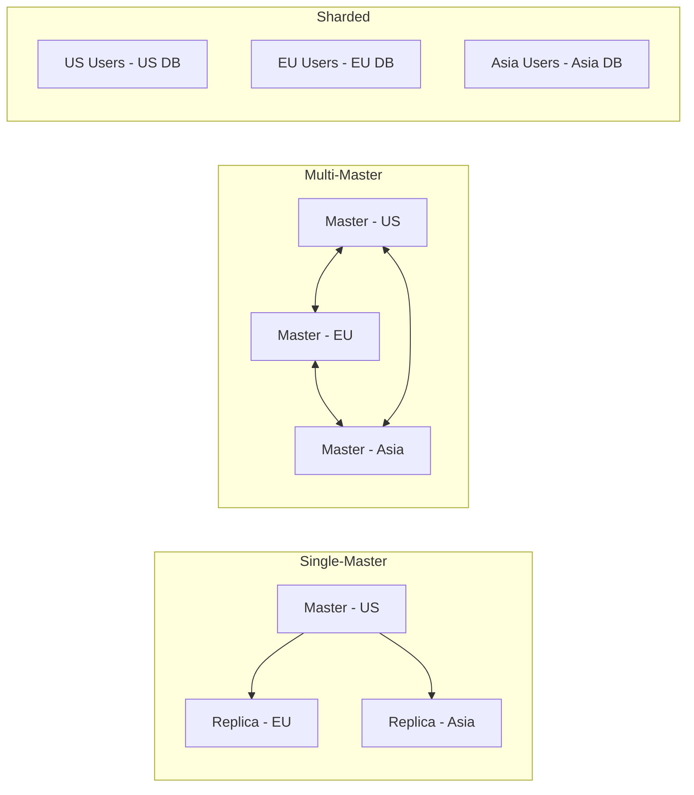
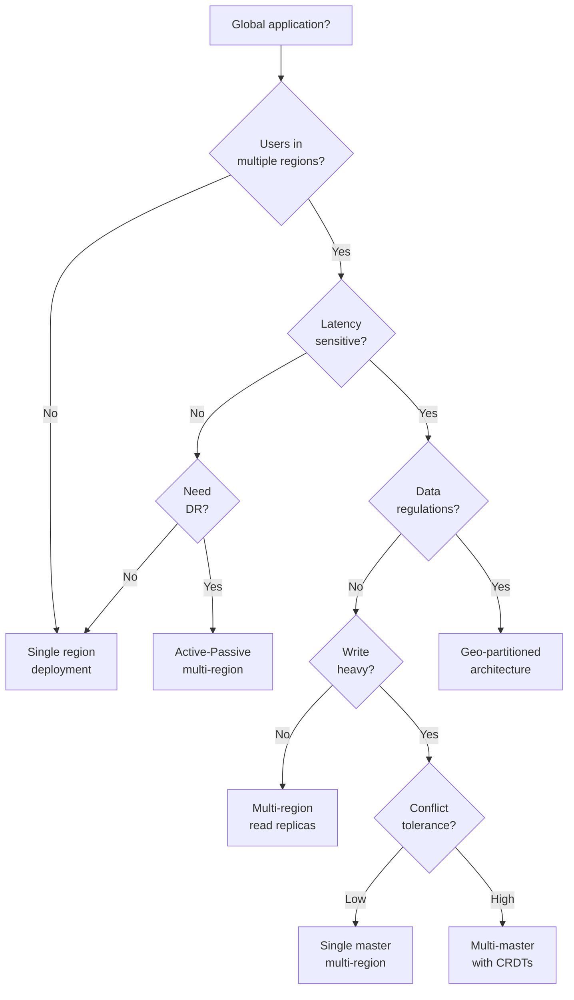

# Multi-Region Architecture


## The Essential Question

**How can we deploy applications across multiple geographic regions to achieve global scale, low latency, high availability, and regulatory compliance?**

---

## Level 1: Intuition (5 minutes)

### The Story

McDonald's doesn't run all restaurants from one kitchen. Each location prepares food locally while following global standards. Some items (fries) are made everywhere, others (McRice in Asia) are regional.

Multi-region architecture works similarly: deploy your application in multiple geographic locations, each serving local users while maintaining global consistency where needed.

### Visual Metaphor

```
Single Region: Multi-Region:

 Users Users
 ↙ ↓ ↘ ↓ ↓ ↓
┌─────────────┐ ┌─US─┐ ┌─EU─┐ ┌─ASIA┐
│ Region │ │ App │ │ App │ │ App │
│ App │ │ DB │ │ DB │ │ DB │
│ DB │ └─────┘ └─────┘ └─────┘
└─────────────┘ ↕ ↕ ↕
 Replication/Sync

All users → One location Users → Nearest region
High latency for distant users Low latency globally
Total failure possible Region failures survivable
```

### In One Sentence

**Multi-Region Architecture**: Deploying applications across multiple geographic regions to minimize latency, maximize availability, and meet compliance requirements.

### Real-World Parallel

Like a global retail chain - stores in every region stock local preferences while maintaining brand consistency and sharing inventory data.

---

## Level 2: Foundation (10 minutes)

### The Problem Space

!!! danger "🔥 Without Multi-Region: Gaming Platform Disaster"
 Online game hosted in US-East only:
 - Asian players: 300ms+ latency, unplayable
 - AWS us-east-1 outage: 8 hours global downtime
 - Lost 2M daily active users
 - $10M revenue impact
 - Competitors gained permanent market share

### Core Architecture Patterns

| Pattern | Description | Use Case | Complexity |
|---------|-------------|----------|------------||
| **Active-Passive** | Primary region + standby | DR focus | Low |
| **Active-Active** | All regions serve traffic | Performance | High |
| **Pilot Light** | Minimal standby infrastructure | Cost-sensitive | Medium |
| **Read Replicas** | Read in all, write in one | Read-heavy | Medium |
| **Follow-the-Sun** | Active region follows daylight | Batch processing | Medium |


### Data Replication Strategies



### Key Design Decisions

1. **Consistency Model**: Strong, eventual, or tunable?
2. **Conflict Resolution**: Last-write-wins, CRDTs, or custom?
3. **Data Sovereignty**: Where can data live?
4. **Failover Strategy**: Automatic or manual?
5. **Cost Optimization**: Full replicas or selective sync?

### Trade-offs

| Aspect | Benefit | Cost |
|--------|---------|------|
| Performance | Low global latency | Complex deployment |
| Availability | Survive region failures | Higher infrastructure cost |
| Compliance | Meet local regulations | Data segregation complexity |
| Scalability | Regional load isolation | Operational overhead |


---

## Level 3: Deep Dive (20 minutes)

### Implementing Multi-Region Architecture

```python
from typing import Dict, List, Optional, Any, Set
from dataclasses import dataclass
from datetime import datetime, timedelta
from enum import Enum
import asyncio
import hashlib
from abc import ABC, abstractmethod

# Region Configuration
@dataclass
class Region:
 name: str
 endpoint: str
 location: str
 primary: bool = False
 active: bool = True
 
class ConsistencyLevel(Enum):
 STRONG = "strong" # All regions must agree
 EVENTUAL = "eventual" # Regions sync asynchronously 
 LOCAL = "local" # No cross-region sync
 QUORUM = "quorum" # Majority of regions

# Multi-Region Database Abstraction
class MultiRegionDB:
 """Handles data operations across regions"""
 
 def __init__(self, regions: List[Region], consistency: ConsistencyLevel):
 self.regions = {r.name: r for r in regions}
 self.consistency = consistency
 self.local_region = self._detect_local_region()
 
 async def write(self, key: str, value: Any, options: Dict = None) -> bool:
 """Write with configured consistency"""
 
 if self.consistency == ConsistencyLevel.LOCAL:
# Write only to local region
 return await self._write_local(key, value)
 
 elif self.consistency == ConsistencyLevel.EVENTUAL:
# Write locally first, replicate async
 local_result = await self._write_local(key, value)
 asyncio.create_task(self._replicate_async(key, value))
 return local_result
 
 elif self.consistency == ConsistencyLevel.QUORUM:
# Write to quorum of regions
 return await self._write_quorum(key, value)
 
 else: # STRONG
# Write to all regions
 return await self._write_all(key, value)
 
 async def read(self, key: str, options: Dict = None) -> Optional[Any]:
 """Read with configured consistency"""
 
 if self.consistency == ConsistencyLevel.LOCAL:
# Read from local region only
 return await self._read_local(key)
 
 elif self.consistency == ConsistencyLevel.EVENTUAL:
# Read from local, fallback to others
 value = await self._read_local(key)
 if value is None:
 value = await self._read_any(key)
 return value
 
 elif self.consistency == ConsistencyLevel.QUORUM:
# Read from quorum, return most recent
 return await self._read_quorum(key)
 
 else: # STRONG
# Read from all, ensure consistency
 return await self._read_all(key)
 
 async def _write_local(self, key: str, value: Any) -> bool:
 """Write to local region"""
 region = self.regions[self.local_region]
 return await self._write_to_region(region, key, value)
 
 async def _write_all(self, key: str, value: Any) -> bool:
 """Write to all active regions"""
 active_regions = [r for r in self.regions.values() if r.active]
 
 results = await asyncio.gather(*[
 self._write_to_region(region, key, value)
 for region in active_regions
 ], return_exceptions=True)
 
# All must succeed for strong consistency
 return all(r is True for r in results if not isinstance(r, Exception))
 
 async def _write_quorum(self, key: str, value: Any) -> bool:
 """Write to majority of regions"""
 active_regions = [r for r in self.regions.values() if r.active]
 quorum_size = (len(active_regions) // 2) + 1
 
 results = await asyncio.gather(*[
 self._write_to_region(region, key, value)
 for region in active_regions
 ], return_exceptions=True)
 
 success_count = sum(1 for r in results if r is True)
 return success_count >= quorum_size
 
 async def _replicate_async(self, key: str, value: Any):
 """Asynchronously replicate to other regions"""
 other_regions = [
 r for r in self.regions.values() 
 if r.name != self.local_region and r.active
 ]
 
 await asyncio.gather(*[
 self._write_to_region(region, key, value)
 for region in other_regions
 ], return_exceptions=True)

# Global Traffic Manager
class GlobalTrafficManager:
 """Routes requests to optimal region"""
 
 def __init__(self):
 self.regions = {}
 self.health_status = {}
 self.latency_map = {} # client_location -> region -> latency
 
 def add_region(self, region: Region, health_check_url: str):
 """Register a region"""
 self.regions[region.name] = region
 self.health_status[region.name] = True
 
 async def route_request(self, client_ip: str, request_type: str) -> str:
 """Determine best region for request"""
 
# Get client location
 client_location = await self._get_client_location(client_ip)
 
# Find healthy regions
 healthy_regions = [
 name for name, healthy in self.health_status.items()
 if healthy and self.regions[name].active
 ]
 
 if not healthy_regions:
 raise Exception("No healthy regions available")
 
# Route based on strategy
 if request_type == "write" and self._has_primary():
# Writes go to primary if configured
 return self._get_primary_region()
 
# Route to lowest latency healthy region
 return self._get_lowest_latency_region(client_location, healthy_regions)
 
 async def health_check_all(self):
 """Periodic health checks for all regions"""
 while True:
 for region_name, region in self.regions.items():
 try:
 healthy = await self._check_region_health(region)
 self.health_status[region_name] = healthy
 except:
 self.health_status[region_name] = False
 
 await asyncio.sleep(30) # Check every 30 seconds
 
 def _get_lowest_latency_region(self, client_location: str, 
 regions: List[str]) -> str:
 """Find region with lowest latency for client"""
 latencies = {
 region: self.latency_map.get(client_location, {}).get(region, 999)
 for region in regions
 }
 return min(latencies, key=latencies.get)

# Conflict Resolution
class ConflictResolver:
 """Handles conflicts in multi-master replication"""
 
 def __init__(self, strategy: str = "last_write_wins"):
 self.strategy = strategy
 
 def resolve(self, conflicts: List[Dict]) -> Any:
 """Resolve conflicts between regions"""
 
 if self.strategy == "last_write_wins":
# Return value with latest timestamp
 return max(conflicts, key=lambda x: x['timestamp'])['value']
 
 elif self.strategy == "version_vector":
# Use version vectors for causality
 return self._resolve_version_vectors(conflicts)
 
 elif self.strategy == "crdt":
# Use Conflict-free Replicated Data Types
 return self._merge_crdts(conflicts)
 
 elif self.strategy == "custom":
# Application-specific resolution
 return self._custom_resolve(conflicts)
 
 def _resolve_version_vectors(self, conflicts: List[Dict]) -> Any:
 """Resolve using version vectors"""
# Track causality between updates
# Implementation depends on version vector algorithm
 pass
 
 def _merge_crdts(self, conflicts: List[Dict]) -> Any:
 """Merge Conflict-free Replicated Data Types"""
# CRDT-specific merge logic
# Example: G-Counter, PN-Counter, OR-Set
 pass

# Regional Failover Manager
class RegionalFailoverManager:
 """Handles region failures and failover"""
 
 def __init__(self, regions: List[Region]):
 self.regions = regions
 self.primary_region = next((r for r in regions if r.primary), None)
 self.failover_in_progress = False
 
 async def detect_failure(self, region_name: str):
 """Detect and handle region failure"""
 
 if self.failover_in_progress:
 return # Already handling a failure
 
 self.failover_in_progress = True
 
 try:
# Verify failure (avoid false positives)
 if not await self._verify_failure(region_name):
 return
 
# Determine failover strategy
 if region_name == self.primary_region.name:
 await self._failover_primary()
 else:
 await self._failover_secondary(region_name)
 
 finally:
 self.failover_in_progress = False
 
 async def _failover_primary(self):
 """Handle primary region failure"""
 
# 1. Stop writes to failed primary
 await self._fence_region(self.primary_region.name)
 
# 2. Promote secondary to primary
 new_primary = self._select_new_primary()
 await self._promote_to_primary(new_primary)
 
# 3. Update DNS/routing
 await self._update_routing(new_primary)
 
# 4. Notify applications
 await self._broadcast_topology_change()
 
 async def _fence_region(self, region_name: str):
 """Fence a failed region to prevent split-brain"""
# Implement STONITH (Shoot The Other Node In The Head)
# Ensure failed region cannot accept writes
 pass

# Cost Optimization
class MultiRegionCostOptimizer:
 """Optimize costs across regions"""
 
 def __init__(self):
 self.region_costs = {} # $/GB/month
 self.transfer_costs = {} # $/GB between regions
 self.compute_costs = {} # $/hour
 
 def calculate_deployment_cost(self, 
 data_size_gb: float,
 transfer_gb_per_month: float,
 compute_hours: float,
 regions: List[str]) -> Dict:
 """Calculate total cost for multi-region deployment"""
 
 costs = {
 'storage': 0,
 'transfer': 0,
 'compute': 0,
 'total': 0
 }
 
# Storage costs (data replicated to all regions)
 for region in regions:
 costs['storage'] += data_size_gb * self.region_costs.get(region, 0.1)
 
# Transfer costs (between regions)
 for i, region1 in enumerate(regions):
 for region2 in regions[i+1:]:
 transfer_cost = self.transfer_costs.get((region1, region2), 0.02)
 costs['transfer'] += transfer_gb_per_month * transfer_cost
 
# Compute costs
 for region in regions:
 costs['compute'] += compute_hours * self.compute_costs.get(region, 0.1)
 
 costs['total'] = sum(costs.values())
 return costs
 
 def recommend_regions(self, requirements: Dict) -> List[str]:
 """Recommend cost-optimal regions based on requirements"""
 
# Consider:
# - User distribution
# - Latency requirements
# - Compliance needs
# - Cost constraints
 
# Return optimal region list
 pass

# Example Usage
async def setup_multi_region_app():
 """Example multi-region application setup"""
 
# Define regions
 regions = [
 Region("us-east-1", "app-us.example.com", "Virginia", primary=True),
 Region("eu-west-1", "app-eu.example.com", "Ireland"),
 Region("ap-southeast-1", "app-asia.example.com", "Singapore")
 ]
 
# Setup database with eventual consistency
 db = MultiRegionDB(regions, ConsistencyLevel.EVENTUAL)
 
# Setup traffic manager
 traffic_manager = GlobalTrafficManager()
 for region in regions:
 traffic_manager.add_region(region, f"https://{region.endpoint}/health")
 
# Setup failover manager
 failover_manager = RegionalFailoverManager(regions)
 
# Start health monitoring
 asyncio.create_task(traffic_manager.health_check_all())
 
 return db, traffic_manager, failover_manager
```

### Data Consistency Patterns

```python
# Implementing Conflict-Free Replicated Data Types (CRDTs)
class GCounter:
 """Grow-only counter CRDT"""
 
 def __init__(self, replica_id: str):
 self.replica_id = replica_id
 self.counts = {replica_id: 0}
 
 def increment(self, value: int = 1):
 """Increment local counter"""
 self.counts[self.replica_id] += value
 
 def merge(self, other: 'GCounter'):
 """Merge with another replica's counter"""
 for replica_id, count in other.counts.items():
 self.counts[replica_id] = max(
 self.counts.get(replica_id, 0),
 count
 )
 
 def value(self) -> int:
 """Get total value across all replicas"""
 return sum(self.counts.values())

# Vector Clock for Causality Tracking
class VectorClock:
 """Track causality in distributed system"""
 
 def __init__(self, node_id: str):
 self.node_id = node_id
 self.clock = {node_id: 0}
 
 def increment(self):
 """Increment local clock"""
 self.clock[self.node_id] += 1
 
 def update(self, other: 'VectorClock'):
 """Update clock with received vector clock"""
 for node_id, timestamp in other.clock.items():
 self.clock[node_id] = max(
 self.clock.get(node_id, 0),
 timestamp
 )
 self.increment() # Increment local after update
 
 def happens_before(self, other: 'VectorClock') -> bool:
 """Check if this event happened before other"""
 for node_id, timestamp in self.clock.items():
 if timestamp > other.clock.get(node_id, 0):
 return False
 return True
```

---

## Level 4: Expert Practitioner (30 minutes)

### Advanced Multi-Region Patterns

#### Geo-Partitioned Services

```python
class GeoPartitionedService:
 """Partition services by geography"""
 
 def __init__(self):
 self.partitions = {
 'americas': ['us-east-1', 'us-west-2', 'sa-east-1'],
 'europe': ['eu-west-1', 'eu-central-1'],
 'asia': ['ap-southeast-1', 'ap-northeast-1']
 }
 
 async def route_by_regulation(self, user_location: str, 
 data_classification: str) -> str:
 """Route based on data regulations"""
 
 if data_classification == "gdpr":
# GDPR data must stay in EU
 return self._get_nearest_region(user_location, 
 self.partitions['europe'])
 elif data_classification == "financial":
# Financial data has specific requirements
 return self._get_compliant_region(user_location)
 else:
# General data can go anywhere
 return self._get_nearest_region(user_location)
```

#### Edge Computing Integration

```python
class EdgeRegionHierarchy:
 """Hierarchical edge computing regions"""
 
 def __init__(self):
 self.hierarchy = {
 'core': ['us-east-1', 'eu-west-1', 'ap-southeast-1'],
 'regional': ['us-west-2', 'eu-central-1', 'ap-northeast-1'],
 'edge': ['lax-1', 'fra-1', 'sin-1', 'syd-1']
 }
 
 def get_compute_location(self, request_type: str, data_size: int) -> str:
 """Determine where to process request"""
 
 if request_type == "real-time" and data_size < 1024: # 1KB
# Process at edge for lowest latency
 return self._get_nearest_edge()
 elif request_type == "batch" or data_size > 1048576: # 1MB
# Process at core for efficiency
 return self._get_core_region()
 else:
# Process at regional level
 return self._get_regional_center()
```

### Performance Optimization

!!! note "🎯 Multi-Region Performance Tips"
 - **Smart Caching**: Cache at edge, invalidate globally
 - **Read Replicas**: Place read replicas near users
 - **Async Replication**: Don't block on cross-region sync
 - **Regional Sharding**: Shard data by user geography
 - **Connection Pooling**: Reuse cross-region connections
 - **Compression**: Compress cross-region transfers
 - **Batching**: Batch updates to reduce round trips
 - **CDN Integration**: Use CDN for static content

### Monitoring Multi-Region Systems

```yaml
metrics:
# Latency Metrics
 - name: cross_region_latency
 description: Latency between regions
 type: histogram
 labels: [source_region, dest_region]
 
 - name: user_request_latency
 description: End-user request latency
 type: histogram
 labels: [user_region, serving_region]
 
# Replication Metrics
 - name: replication_lag
 description: Data replication delay
 type: gauge
 labels: [source_region, dest_region]
 
 - name: conflict_rate
 description: Data conflicts per second
 type: counter
 labels: [region, resolution_strategy]
 
# Availability Metrics
 - name: region_health
 description: Region health status
 type: gauge
 labels: [region]
 
 - name: failover_duration
 description: Time to complete failover
 type: histogram
 labels: [failed_region, new_primary]
 
# Cost Metrics
 - name: cross_region_transfer_bytes
 description: Data transferred between regions
 type: counter
 labels: [source_region, dest_region]
```

### Common Pitfalls

!!! danger "⚠️ Pitfall: Ignoring CAP Theorem"
 Tried to maintain strong consistency across regions during network partition.
 **Result**: Complete system halt when regions couldn't communicate.
 **Solution**: Design for partition tolerance, choose appropriate consistency level.

!!! danger "⚠️ Pitfall: Underestimating Costs"
 Replicated everything everywhere without considering transfer costs.
 **Result**: $100K+ monthly bill for cross-region transfers.
 **Solution**: Selective replication, regional data tiers, transfer optimization.

---

## Level 5: Mastery (45 minutes)

### Case Study: Spotify's Global Architecture

!!! info "🏢 Real-World Implementation"
 **Company**: Spotify
 **Scale**: 500M+ users, 180+ countries, 4B+ streams/day
 **Challenge**: Stream music with <200ms startup time globally while maintaining catalog consistency.
 **Architecture**:
 ```mermaid
 graph TB
 subgraph "User Layer"
 US[US Users]
 EU[EU Users]
 AS[Asia Users]
 end
 subgraph "Edge PoPs"
 CDN1[CDN US]
 CDN2[CDN EU]
 CDN3[CDN Asia]
 end
 subgraph "Regional Clusters"
 R1[US Cluster
 - API
 - Metadata
 - ML]
 R2[EU Cluster
 - API
 - Metadata
 - ML]
 R3[Asia Cluster
 - API
 - Metadata
 - ML]
 end
 subgraph "Global Services"
 CAT[Catalog Master]
 USER[User Profile Master]
 ML[ML Training]
 end
 US --> CDN1 --> R1
 EU --> CDN2 --> R2
 AS --> CDN3 --> R3
 R1 <--> CAT
 R2 <--> CAT
 R3 <--> CAT
 R1 <--> USER
 R2 <--> USER
 R3 <--> USER
 style CAT fill:#4caf50,stroke:#2e7d32,stroke-width:3px
 ```
 **Key Decisions**:
 1. **Audio cached at edge**: 90% hit rate reduces latency
 2. **Metadata replicated regionally**: Fast browsing
 3. **User data geo-sharded**: Compliance + performance
 4. **ML models deployed regionally**: Personalized recommendations
 5. **Async catalog updates**: Eventually consistent
 **Results**:
 - 150ms average start time globally
 - 99.95% availability
 - 60% reduction in infrastructure costs
 - Seamless regional failovers
 **Lessons**:
 1. Cache aggressively at edge
 2. Shard by user geography when possible
 3. Async replication for non-critical data
 4. Regional ML inference beats centralized

### Economic Analysis

```python
def analyze_multi_region_economics(
 users_by_region: Dict[str, int],
 revenue_per_user: float,
 single_region_latency: Dict[str, float],
 multi_region_cost_multiplier: float = 2.5
) -> Dict:
 """Analyze economics of multi-region deployment"""
 
# Calculate user impact of latency
 def latency_impact(latency_ms: float) -> float:
# User engagement drops with latency
 if latency_ms < 100:
 return 1.0 # No impact
 elif latency_ms < 300:
 return 0.9 # 10% drop
 elif latency_ms < 500:
 return 0.7 # 30% drop 
 else:
 return 0.4 # 60% drop
 
# Single region revenue
 single_region_revenue = 0
 for region, users in users_by_region.items():
 latency = single_region_latency[region]
 engagement = latency_impact(latency)
 single_region_revenue += users * revenue_per_user * engagement
 
# Multi-region revenue (assume <100ms latency everywhere)
 multi_region_revenue = sum(users_by_region.values()) * revenue_per_user
 
# Cost analysis
 single_region_cost = 100000 # Base monthly cost
 multi_region_cost = single_region_cost * multi_region_cost_multiplier
 
# ROI calculation
 roi = {
 'single_region_revenue': single_region_revenue,
 'multi_region_revenue': multi_region_revenue,
 'revenue_increase': multi_region_revenue - single_region_revenue,
 'single_region_cost': single_region_cost,
 'multi_region_cost': multi_region_cost,
 'cost_increase': multi_region_cost - single_region_cost,
 'net_benefit': (multi_region_revenue - single_region_revenue) - 
 (multi_region_cost - single_region_cost),
 'roi_percentage': ((multi_region_revenue - multi_region_cost) / 
 multi_region_cost) * 100
 }
 
 return roi

# Example: Global SaaS application
users = {
 'us': 1000000,
 'eu': 800000,
 'asia': 1200000
}

latencies = {
 'us': 50, # Hosted in US
 'eu': 150, # From US 
 'asia': 250 # From US
}

roi = analyze_multi_region_economics(users, 10, latencies)
print(f"Revenue increase: ${roi['revenue_increase']:,.0f}/month")
print(f"ROI: {roi['roi_percentage']:.1f}%")
```

### Future Directions

**Quantum Networking**: Quantum entanglement for instant cross-region communication

**AI-Driven Region Selection**: ML models predict optimal region placement

**Serverless Multi-Region**: Automatic global deployment without region management

**Blockchain Consensus**: Distributed ledger for cross-region consistency

---

## Quick Reference

### Decision Matrix



### Configuration Template

```yaml
# Multi-Region Configuration
multi_region:
 regions:
 - name: us-east-1
 primary: true
 endpoint: app-us.example.com
 services:
 - api
 - database
 - cache
 
 - name: eu-west-1
 primary: false
 endpoint: app-eu.example.com
 services:
 - api
 - database-replica
 - cache
 
 - name: ap-southeast-1
 primary: false
 endpoint: app-asia.example.com
 services:
 - api
 - database-replica
 - cache
 
 replication:
 strategy: async # async, sync, semi-sync
 consistency: eventual # strong, eventual, bounded
 conflict_resolution: last_write_wins
 lag_threshold: 5s
 
 routing:
 strategy: latency # latency, geolocation, weighted
 health_check_interval: 30s
 failover_threshold: 3
 
 data_governance:
 gdpr_regions: [eu-west-1]
 data_residency:
 - type: user_pii
 allowed_regions: [eu-west-1]
 - type: financial
 allowed_regions: [us-east-1]
 
 cost_controls:
 max_cross_region_transfer_gb: 10000
 auto_scale_regions: true
 idle_region_shutdown: true
 
 monitoring:
 cross_region_latency: true
 replication_lag: true
 regional_availability: true
 cost_tracking: true
```

### Deployment Checklist

- [ ] **Region Selection**
 - [ ] Analyze user distribution
 - [ ] Check regulatory requirements
 - [ ] Evaluate provider availability
 - [ ] Calculate latency requirements
 
- [ ] **Data Strategy**
 - [ ] Define consistency requirements
 - [ ] Design conflict resolution
 - [ ] Plan data partitioning
 - [ ] Setup replication topology
 
- [ ] **Network Architecture**
 - [ ] Configure global load balancing
 - [ ] Setup health checks
 - [ ] Plan failover procedures
 - [ ] Optimize routing policies
 
- [ ] **Security**
 - [ ] Cross-region encryption
 - [ ] Regional compliance
 - [ ] Access control per region
 - [ ] Audit logging
 
- [ ] **Operations**
 - [ ] Regional deployment pipelines
 - [ ] Monitoring and alerting
 - [ ] Disaster recovery procedures
 - [ ] Cost optimization

### Common Commands

```bash
# Region Management
region list
region add --name=eu-central-1 --type=replica
region promote --name=eu-west-1
region failover --from=us-east-1 --to=eu-west-1

# Replication Control
replication status
replication pause --region=ap-southeast-1
replication resume --region=ap-southeast-1
replication reset --region=eu-west-1

# Health Checks
health check --all-regions
health history --region=us-east-1 --days=7

# Cost Analysis
cost analyze --breakdown=region
cost forecast --months=3
cost optimize --suggest

# Testing
chaos test --scenario=region-failure --region=us-west-2
latency test --from=all --to=all
failover test --dry-run
```

### Latency Expectations

| Distance | Theoretical Min | Typical | Degraded |
|----------|----------------|---------|----------|
| Same Region | 1ms | 5-10ms | 50ms |
| Same Continent | 20ms | 30-50ms | 200ms |
| Cross-Atlantic | 60ms | 80-100ms | 300ms |
| Cross-Pacific | 90ms | 120-150ms | 500ms |
| Opposite Side | 133ms | 200-250ms | 1000ms |


---

## Related Resources

### Patterns
- Geo-Replication - Data replication strategies
- [Edge Computing](/patterns/edge-computing) - Processing at network edge
- [Tunable Consistency](/patterns/tunable-consistency) - Consistency models
- [CQRS](/patterns/cqrs) - Separate read/write paths

### Laws
- [Law 2 (Asynchronous Reality )](/part1-axioms/law2-asynchrony) - Speed of light constraints
- [Law 7 (Economic Reality /index)](/part1-axioms/law7-economics) - Cost implications
- [Law 1 (Correlated Failure /index)](/part1-axioms/law1-failure) - Regional failure modes
- [Law 4 (Multidimensional Optimization /index)](/part1-axioms/law4-tradeoffs/index) - Regional capacity planning

### Case Studies
- [Video Streaming Platform](/case-studies/video-streaming) - Netflix's approach
- [Social Media Feed](/case-studies/social-media-feed) - Facebook's architecture
- [E-commerce Platform](/case-studies/ecommerce-platform) - Amazon's strategy

### Tools & Technologies
- **Cloud Providers**: AWS Global Infrastructure, Azure Regions, GCP Regions
- **CDN**: CloudFlare, Akamai, Fastly
- **DNS**: Route53, Azure Traffic Manager, Cloud DNS
- **Databases**: CockroachDB, YugabyteDB, Amazon Aurora Global
- **Orchestration**: Kubernetes Federation, Consul, Nomad

### Further Reading
- [Designing Data-Intensive Applications](https://dataintensive.net/) - Chapter 9
- [Google's Spanner Paper](https://research.google/pubs/pub39966/) - Global consistency
- [Amazon's Dynamo Paper](https://www.allthingsdistributed.com/2007/10/amazons_dynamo.html) - Eventually consistent
- [Facebook's TAO](https://www.usenix.org/system/files/conference/atc13/atc13-bronson.pdf) - Social graph at scale

---

<div class="prev-link">
<a href="/patterns/geo-replication">← Previous: Geo-Replication</a>
<a href="/patterns/edge-computing">Next: Edge Computing →</a>
</div>