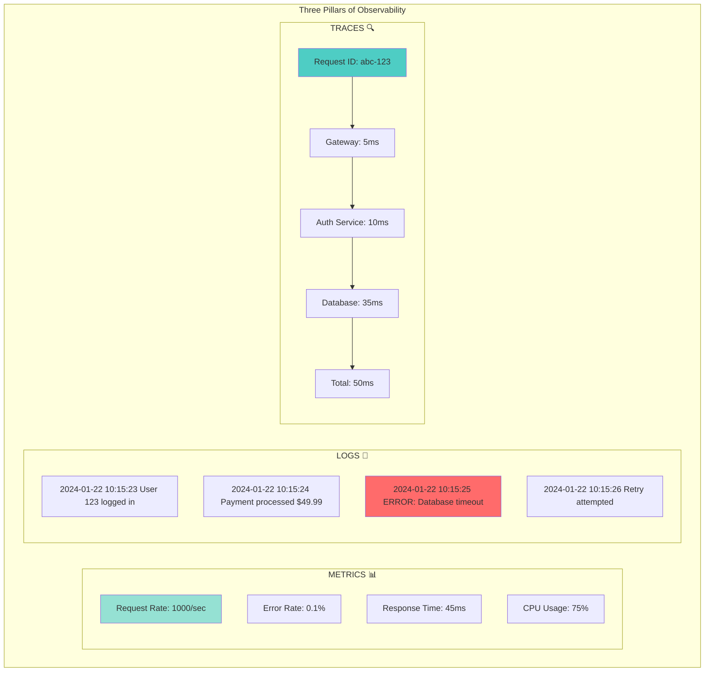
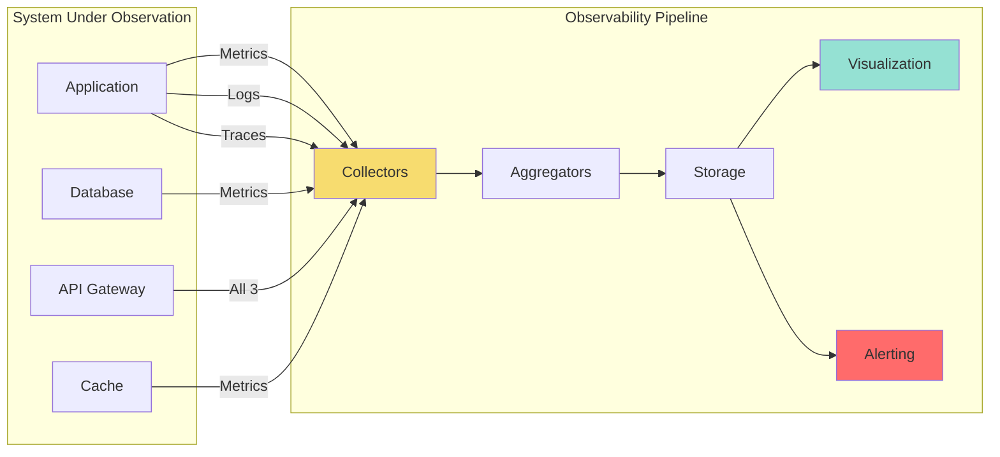
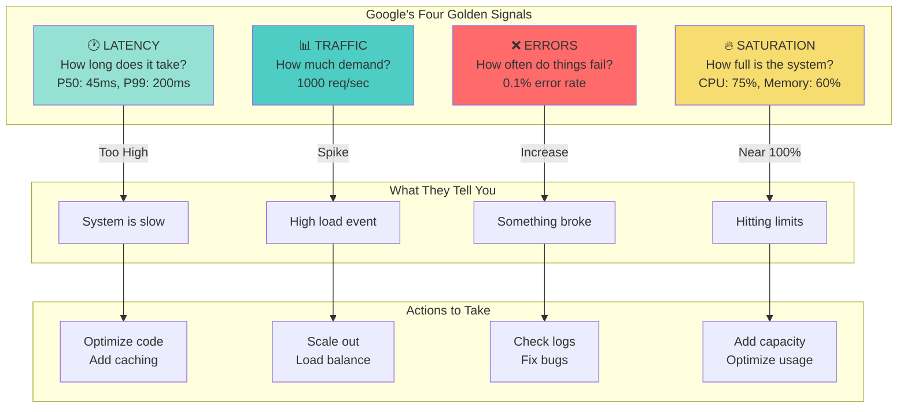

# Observability Patterns

!!! success "🏆 Gold Standard Pattern"
    **Production Visibility** • Netflix, Uber, Datadog proven
    
    Essential for understanding and debugging distributed systems. Observability provides the insights needed to maintain, optimize, and troubleshoot complex systems through metrics, logs, and traces.
    
    **Key Success Metrics:**
    - Netflix: 2.5M metrics/sec monitoring 500+ microservices
    - Uber Jaeger: Billions of traces for root cause analysis
    - Datadog: 18+ trillion data points/day at cloud scale

**You can't fix what you can't see - Illuminating the black box of production systems**

> *"In distributed systems, the question is not if things will fail, but when they fail, can you understand why?"*

---

## Level 1: Intuition

### The Medical Diagnosis Analogy

Think of observability like medical diagnostics:

```
Without Observability (Emergency Room):
Patient: "I don't feel well"
Doctor: "Where does it hurt?"
Patient: "Everywhere!"
Doctor: *Guessing game begins*

With Observability (Modern Hospital):
- Temperature sensor → Metrics (vital signs)
- Patient history → Logs (what happened)
- MRI/X-ray → Traces (see inside)
- Blood tests → Deep diagnostics
```

### Real-World Example: The Restaurant Kitchen

**Without Observability**:
- Customer: "My food is taking forever!"
- Manager: *Runs to kitchen* "What's happening?"
- Kitchen: "We're busy!"
- No data on which station is slow or why

**With Observability**:
- Order tracking shows: Grill station backed up
- Metrics show: 15 orders waiting, usual is 5
- Logs show: Grill maintenance at 2 PM caused delay
- Traces show: This order stuck behind large party
- Action: Route simple orders to other stations

### The Three Pillars Explained



**Analogy Summary**:
- **METRICS**: The Speedometer - "How fast are we going?"
- **LOGS**: The Black Box - "What happened in the crash?"
- **TRACES**: The GPS Journey - "How did we get here?"

---

## Level 2: Foundation

### Core Concepts

#### The Three Pillars of Observability



```python
from dataclasses import dataclass
from typing import Dict, List, Optional
import time
import json

# 1. METRICS - Numerical measurements over time
@dataclass
class Metric:
    name: str
    value: float
    timestamp: float
    labels: Dict[str, str]
    metric_type: str  # counter, gauge, histogram

class MetricsCollector:
    def __init__(self):
        self.metrics = {}
        
    def increment_counter(self, name: str, labels: Dict[str, str] = None):
        """Count events (always goes up)"""
        key = self._metric_key(name, labels)
        if key not in self.metrics:
            self.metrics[key] = Metric(name, 0, time.time(), labels or {}, "counter")
        self.metrics[key].value += 1
        self.metrics[key].timestamp = time.time()
    
    def set_gauge(self, name: str, value: float, labels: Dict[str, str] = None):
        """Current value (can go up or down)"""
        key = self._metric_key(name, labels)
        self.metrics[key] = Metric(name, value, time.time(), labels or {}, "gauge")
    
    def record_histogram(self, name: str, value: float, labels: Dict[str, str] = None):
        """Distribution of values"""
        key = self._metric_key(name, labels)
        if key not in self.metrics:
            self.metrics[key] = {"sum": 0, "count": 0, "buckets": {}}
        
        self.metrics[key]["sum"] += value
        self.metrics[key]["count"] += 1
# Update histogram buckets
        for bucket in [0.01, 0.05, 0.1, 0.5, 1, 5, 10]:
            if value <= bucket:
                bucket_key = f"{key}_bucket_{bucket}"
                self.metrics[bucket_key] = self.metrics.get(bucket_key, 0) + 1

# 2. LOGS - Discrete events with context
class StructuredLogger:
    def __init__(self, service_name: str):
        self.service_name = service_name
        self.context = {"service": service_name}
    
    def _log(self, level: str, message: str, **kwargs):
        """Structured logging with context"""
        log_entry = {
            "timestamp": time.time(),
            "level": level,
            "message": message,
            "service": self.service_name,
            **self.context,
            **kwargs
        }
        
# In production, this would go to log aggregation
        print(json.dumps(log_entry))
    
    def info(self, message: str, **kwargs):
        self._log("INFO", message, **kwargs)
    
    def error(self, message: str, error: Exception = None, **kwargs):
        if error:
            kwargs["error_type"] = type(error).__name__
            kwargs["error_message"] = str(error)
        self._log("ERROR", message, **kwargs)
    
    def with_context(self, **context):
        """Add persistent context"""
        new_logger = StructuredLogger(self.service_name)
        new_logger.context = {**self.context, **context}
        return new_logger

# 3. TRACES - Request flow through system
@dataclass
class Span:
    trace_id: str
    span_id: str
    parent_span_id: Optional[str]
    operation_name: str
    start_time: float
    end_time: Optional[float]
    tags: Dict[str, str]
    logs: List[Dict]

class Tracer:
    def __init__(self):
        self.spans = []
        self.current_trace_id = None
        self.current_span_id = None
    
    def start_span(self, operation_name: str, parent_span_id: str = None):
        """Start a new span in the trace"""
        import uuid
        
        if not self.current_trace_id:
            self.current_trace_id = str(uuid.uuid4())
        
        span = Span(
            trace_id=self.current_trace_id,
            span_id=str(uuid.uuid4()),
            parent_span_id=parent_span_id or self.current_span_id,
            operation_name=operation_name,
            start_time=time.time(),
            end_time=None,
            tags={},
            logs=[]
        )
        
        self.spans.append(span)
        self.current_span_id = span.span_id
        
        return span
    
    def finish_span(self, span: Span):
        """Complete a span"""
        span.end_time = time.time()
        
# In production, send to tracing backend
        duration = span.end_time - span.start_time
        print(f"Span: {span.operation_name} took {duration:.3f}s")
```

### Observable Service Implementation

```python
class ObservableService:
    """A service with full observability built in"""
    
    def __init__(self, service_name: str):
        self.service_name = service_name
        self.metrics = MetricsCollector()
        self.logger = StructuredLogger(service_name)
        self.tracer = Tracer()
        
# Define standard metrics
        self._setup_metrics()
    
    def _setup_metrics(self):
        """Initialize standard service metrics"""
# The Four Golden Signals
        self.metrics.set_gauge("service_up", 1, {"service": self.service_name})
    
    async def handle_request(self, request):
        """Observable request handling"""
# Start trace
        span = self.tracer.start_span("handle_request")
        span.tags["request.method"] = request.method
        span.tags["request.path"] = request.path
        
# Create request-scoped logger
        request_logger = self.logger.with_context(
            request_id=request.id,
            user_id=request.user_id,
            trace_id=span.trace_id
        )
        
# Increment request counter
        self.metrics.increment_counter(
            "requests_total",
            {"method": request.method, "endpoint": request.path}
        )
        
# Track concurrent requests
        self.metrics.set_gauge("requests_active", 
            self.metrics.metrics.get("requests_active", Metric("", 0, 0, {}, "")).value + 1
        )
        
        start_time = time.time()
        request_logger.info("Request started")
        
        try:
# Process request with observability
            result = await self._process_with_monitoring(request, span, request_logger)
            
# Log success
            request_logger.info("Request completed", 
                status_code=result.status_code,
                duration=time.time() - start_time
            )
            
# Record success metric
            self.metrics.increment_counter(
                "requests_success",
                {"method": request.method, "endpoint": request.path}
            )
            
            return result
            
        except Exception as e:
# Log error with full context
            request_logger.error("Request failed",
                error=e,
                duration=time.time() - start_time
            )
            
# Record error metric
            self.metrics.increment_counter(
                "requests_errors",
                {"method": request.method, "endpoint": request.path, "error": type(e).__name__}
            )
            
# Add error to trace
            span.logs.append({
                "timestamp": time.time(),
                "level": "ERROR",
                "message": str(e)
            })
            
            raise
            
        finally:
# Record request duration
            duration = time.time() - start_time
            self.metrics.record_histogram(
                "request_duration_seconds",
                duration,
                {"method": request.method, "endpoint": request.path}
            )
            
# Decrement active requests
            self.metrics.set_gauge("requests_active",
                max(0, self.metrics.metrics.get("requests_active", Metric("", 1, 0, {}, "")).value - 1)
            )
            
# Finish trace
            self.tracer.finish_span(span)
    
    async def _process_with_monitoring(self, request, parent_span, logger):
        """Process request with detailed monitoring"""
# Database operation
        db_span = self.tracer.start_span("database_query", parent_span.span_id)
        try:
            logger.info("Querying database")
            result = await self._database_operation()
            db_span.tags["db.rows_returned"] = len(result)
            return result
        finally:
            self.tracer.finish_span(db_span)
```

### The Four Golden Signals



```python
class GoldenSignals:
    """Google's Four Golden Signals for monitoring"""
    
    def __init__(self, metrics_collector: MetricsCollector):
        self.metrics = metrics_collector
    
    def track_latency(self, operation: str, duration: float):
        """1. Latency - How long requests take"""
        self.metrics.record_histogram(
            f"{operation}_duration_seconds",
            duration
        )
    
    def track_traffic(self, endpoint: str):
        """2. Traffic - How much demand"""
        self.metrics.increment_counter(
            "requests_total",
            {"endpoint": endpoint}
        )
    
    def track_errors(self, endpoint: str, error_type: str):
        """3. Errors - Rate of failures"""
        self.metrics.increment_counter(
            "errors_total",
            {"endpoint": endpoint, "type": error_type}
        )
    
    def track_saturation(self, resource: str, usage_percent: float):
        """4. Saturation - How full the service is"""
        self.metrics.set_gauge(
            f"{resource}_usage_percent",
            usage_percent
        )
```

---

## Level 3: Deep Dive

### Advanced Observability Patterns

#### 1. Distributed Tracing with Context Propagation

```python
class DistributedTracing:
    """Full distributed tracing implementation"""
    
    def __init__(self):
        self.tracer = self._init_tracer()
    
    def _init_tracer(self):
        """Initialize OpenTelemetry tracer"""
        from opentelemetry import trace
        from opentelemetry.exporter.otlp.proto.grpc import trace_exporter
        from opentelemetry.sdk.trace import TracerProvider
        from opentelemetry.sdk.trace.export import BatchSpanProcessor
        
# Setup tracer provider
        trace.set_tracer_provider(TracerProvider())
        tracer_provider = trace.get_tracer_provider()
        
# Configure OTLP exporter
        otlp_exporter = trace_exporter.OTLPSpanExporter(
            endpoint="localhost:4317",
            insecure=True
        )
        
# Add batch processor
        span_processor = BatchSpanProcessor(otlp_exporter)
        tracer_provider.add_span_processor(span_processor)
        
        return trace.get_tracer(__name__)
    
    async def traced_http_call(self, url: str, headers: dict = None):
        """HTTP call with trace propagation"""
        from opentelemetry.propagate import inject
        
        with self.tracer.start_as_current_span("http_call") as span:
# Set span attributes
            span.set_attribute("http.method", "GET")
            span.set_attribute("http.url", url)
            
# Inject trace context into headers
            headers = headers or {}
            inject(headers)
            
            try:
# Make HTTP call with trace headers
                response = await http_client.get(url, headers=headers)
                
                span.set_attribute("http.status_code", response.status_code)
                
                if response.status_code >= 400:
                    span.set_status(Status(StatusCode.ERROR))
                
                return response
                
            except Exception as e:
                span.record_exception(e)
                span.set_status(Status(StatusCode.ERROR, str(e)))
                raise
    
    def extract_trace_context(self, headers: dict):
        """Extract trace context from incoming request"""
        from opentelemetry.propagate import extract
        
        return extract(headers)
```

#### 2. Custom Business Metrics

```python
class BusinessMetrics:
    """Track business-specific metrics"""
    
    def __init__(self, metrics: MetricsCollector):
        self.metrics = metrics
        self._setup_business_metrics()
    
    def _setup_business_metrics(self):
        """Initialize business metric tracking"""
# Revenue metrics
        self.metrics.set_gauge("revenue_total_usd", 0)
        self.metrics.set_gauge("active_subscriptions", 0)
        
# User engagement
        self.metrics.set_gauge("daily_active_users", 0)
        self.metrics.set_gauge("user_sessions_active", 0)
        
# Business operations
        self.metrics.set_gauge("inventory_items", 0)
        self.metrics.set_gauge("orders_pending", 0)
    
    def track_purchase(self, amount: float, item_type: str, user_segment: str):
        """Track purchase with business context"""
# Revenue metric
        current_revenue = self.metrics.metrics.get(
            "revenue_total_usd", 
            Metric("", 0, 0, {}, "gauge")
        ).value
        self.metrics.set_gauge("revenue_total_usd", current_revenue + amount)
        
# Detailed purchase metrics
        self.metrics.increment_counter(
            "purchases_total",
            {
                "item_type": item_type,
                "user_segment": user_segment,
                "price_range": self._get_price_range(amount)
            }
        )
        
# Track revenue by category
        self.metrics.record_histogram(
            f"revenue_by_category_{item_type}",
            amount
        )
    
    def track_user_journey(self, user_id: str, event: str, metadata: dict):
        """Track user behavior through the system"""
        self.metrics.increment_counter(
            "user_events",
            {
                "event": event,
                "user_segment": metadata.get("segment", "unknown"),
                **metadata
            }
        )
        
# Track funnel metrics
        if event in ["signup", "first_purchase", "subscription", "churn"]:
            self.metrics.increment_counter(f"funnel_{event}")
```

#### 3. Intelligent Alerting

```python
class IntelligentAlerting:
    """Smart alerting with anomaly detection"""
    
    def __init__(self):
        self.baselines = {}
        self.alert_history = []
        
    def update_baseline(self, metric_name: str, value: float, timestamp: float):
        """Update rolling baseline for metric"""
        if metric_name not in self.baselines:
            self.baselines[metric_name] = {
                "values": [],
                "mean": 0,
                "std": 0
            }
        
        baseline = self.baselines[metric_name]
        baseline["values"].append((timestamp, value))
        
# Keep last 7 days
        cutoff = timestamp - (7 * 24 * 3600)
        baseline["values"] = [
            (ts, val) for ts, val in baseline["values"] 
            if ts > cutoff
        ]
        
# Calculate statistics
        if len(baseline["values"]) > 10:
            values = [val for _, val in baseline["values"]]
            baseline["mean"] = np.mean(values)
            baseline["std"] = np.std(values)
    
    def check_anomaly(self, metric_name: str, current_value: float) -> Optional[dict]:
        """Detect anomalies using statistical methods"""
        if metric_name not in self.baselines:
            return None
        
        baseline = self.baselines[metric_name]
        if baseline["std"] == 0:
            return None
        
# Calculate z-score
        z_score = abs((current_value - baseline["mean"]) / baseline["std"])
        
        if z_score > 3:  # 3 standard deviations
            return {
                "metric": metric_name,
                "current_value": current_value,
                "expected_value": baseline["mean"],
                "deviation": z_score,
                "severity": "high" if z_score > 4 else "medium"
            }
        
        return None
    
    def smart_alert_grouping(self, alerts: List[dict]) -> List[dict]:
        """Group related alerts to reduce noise"""
        grouped = {}
        
        for alert in alerts:
# Group by service and time window
            service = alert.get("service", "unknown")
            time_bucket = int(alert["timestamp"] / 300) * 300  # 5-minute buckets
            
            key = f"{service}_{time_bucket}"
            if key not in grouped:
                grouped[key] = {
                    "service": service,
                    "time": time_bucket,
                    "alerts": [],
                    "root_cause_hypothesis": None
                }
            
            grouped[key]["alerts"].append(alert)
        
# Analyze grouped alerts for root cause
        for group in grouped.values():
            group["root_cause_hypothesis"] = self._hypothesize_root_cause(
                group["alerts"]
            )
        
        return list(grouped.values())
```

### Production-Ready Implementation

```python
class ProductionObservability:
    """Complete observability solution for production"""
    
    def __init__(self, config: dict):
        self.config = config
        self.metrics = self._setup_metrics()
        self.logger = self._setup_logging()
        self.tracer = self._setup_tracing()
        self.profiler = self._setup_profiling()
        
    def _setup_metrics(self):
        """Configure Prometheus metrics"""
        from prometheus_client import Counter, Histogram, Gauge, CollectorRegistry
        
        registry = CollectorRegistry()
        
# Standard HTTP metrics
        self.request_count = Counter(
            'http_requests_total',
            'Total HTTP requests',
            ['method', 'endpoint', 'status'],
            registry=registry
        )
        
        self.request_duration = Histogram(
            'http_request_duration_seconds',
            'HTTP request duration',
            ['method', 'endpoint'],
            buckets=[.001, .005, .01, .05, .1, .5, 1, 5],
            registry=registry
        )
        
        self.active_requests = Gauge(
            'http_requests_active',
            'Active HTTP requests',
            registry=registry
        )
        
        return registry
    
    def _setup_logging(self):
        """Configure structured logging"""
        import structlog
        
        structlog.configure(
            processors=[
                structlog.stdlib.filter_by_level,
                structlog.stdlib.add_logger_name,
                structlog.stdlib.add_log_level,
                structlog.stdlib.PositionalArgumentsFormatter(),
                structlog.processors.TimeStamper(fmt="iso"),
                structlog.processors.StackInfoRenderer(),
                structlog.processors.format_exc_info,
                structlog.processors.UnicodeDecoder(),
                structlog.processors.JSONRenderer()
            ],
            context_class=dict,
            logger_factory=structlog.stdlib.LoggerFactory(),
            cache_logger_on_first_use=True,
        )
        
        return structlog.get_logger()
    
    def _setup_tracing(self):
        """Configure distributed tracing"""
        from opentelemetry import trace
        from opentelemetry.instrumentation.requests import RequestsInstrumentor
        
# Auto-instrument libraries
        RequestsInstrumentor().instrument()
        
        return trace.get_tracer(__name__)
    
    def _setup_profiling(self):
        """Configure continuous profiling"""
        try:
            import pyroscope
            
            pyroscope.configure(
                application_name=self.config["service_name"],
                server_address=self.config["pyroscope_server"],
                auth_token=self.config.get("pyroscope_token"),
                sample_rate=100,
                detect_subprocesses=True,
                oncpu=True,
                gil_only=True,
                log_level="info",
                tags={
                    "region": self.config["region"],
                    "environment": self.config["environment"]
                }
            )
        except ImportError:
            self.logger.warning("Pyroscope not available, profiling disabled")
```

---

## Level 4: Expert

### Uber's Observability Platform

Uber handles billions of trips with comprehensive observability:

```python
class UberObservabilityPlatform:
    """Uber's approach to observability at scale"""
    
    def __init__(self):
# M3 - Metrics infrastructure
        self.metrics_backend = "M3DB"  # Distributed metrics database
        
# Jaeger - Distributed tracing (created by Uber)
        self.tracing_backend = "Jaeger"
        
# Custom logging pipeline
        self.logging_pipeline = "Uber Logging Platform"
    
    def trace_ride_request(self, ride_id: str):
        """Trace a complete ride request"""
        return {
            "trace_id": ride_id,
            "spans": [
                {
                    "service": "rider-app",
                    "operation": "request_ride",
                    "duration": 100,
                    "tags": {"rider_id": "123", "location": "sf"}
                },
                {
                    "service": "matching-service",
                    "operation": "find_driver",
                    "duration": 2000,
                    "tags": {"search_radius": 5, "drivers_checked": 15}
                },
                {
                    "service": "pricing-service",
                    "operation": "calculate_fare",
                    "duration": 50,
                    "tags": {"surge": 1.5, "distance": 5.2}
                },
                {
                    "service": "driver-app",
                    "operation": "send_request",
                    "duration": 200,
                    "tags": {"driver_id": "456", "eta": 3}
                }
            ],
            "critical_path": ["matching-service/find_driver"],
            "total_duration": 2350
        }
    
    def monitor_marketplace_health(self):
        """Real-time marketplace metrics"""
        return {
            "supply_metrics": {
                "drivers_online": 50000,
                "drivers_on_trip": 35000,
                "utilization_rate": 0.70
            },
            "demand_metrics": {
                "open_requests": 5000,
                "requests_per_minute": 1000,
                "average_wait_time": 3.2
            },
            "health_score": self._calculate_health_score()
        }
```

### Netflix's Telemetry System

Netflix monitors streaming for 200M+ users:

```python
class NetflixTelemetrySystem:
    """Netflix's approach to observability"""
    
    def __init__(self):
# Atlas - Time series database
        self.metrics = "Atlas"
        
# Edgar - Distributed tracing
        self.tracing = "Edgar"
        
# Real-time stream processing
        self.stream_processing = "Mantis"
    
    def monitor_streaming_quality(self, session_id: str):
        """Monitor individual streaming session"""
        metrics = {
            "video_metrics": {
                "bitrate": 15000,  # kbps
                "buffer_health": 30,  # seconds
                "rebuffer_count": 0,
                "resolution": "4K"
            },
            "network_metrics": {
                "cdn_latency": 15,  # ms
                "packet_loss": 0.001,
                "bandwidth": 25000  # kbps
            },
            "playback_metrics": {
                "startup_time": 1.2,  # seconds
                "playback_failures": 0,
                "quality_changes": 2
            }
        }
        
# Calculate QoE (Quality of Experience) score
        metrics["qoe_score"] = self._calculate_qoe(metrics)
        
        return metrics
    
    def detect_regional_issues(self):
        """Detect streaming issues by region"""
        from scipy import stats
        
        regional_metrics = {}
        anomalies = []
        
        for region in self.get_regions():
            metrics = self.get_region_metrics(region)
            
# Statistical anomaly detection
            z_score = stats.zscore(metrics["error_rates"])
            
            if abs(z_score) > 3:
                anomalies.append({
                    "region": region,
                    "metric": "error_rate",
                    "value": metrics["error_rates"][-1],
                    "severity": "high",
                    "affected_users": metrics["user_count"]
                })
        
        return anomalies
```

### Performance Analysis from Production

```python
class ProductionPerformanceAnalysis:
    """Real production observability insights"""
    
    def datadog_customer_metrics(self):
        """Datadog's own observability metrics"""
        return {
            "scale": {
                "metrics_per_second": 15_000_000,
                "unique_metrics": 1_000_000_000,
                "traces_per_second": 10_000_000,
                "logs_per_second": 20_000_000
            },
            "infrastructure": {
                "data_centers": 30,
                "servers": 50_000,
                "storage_petabytes": 100
            },
            "query_performance": {
                "p50_latency_ms": 10,
                "p99_latency_ms": 100,
                "queries_per_second": 5_000_000
            }
        }
    
    def observability_roi_analysis(self):
        """ROI from implementing observability"""
        return {
            "incident_reduction": {
                "before": "10 major incidents/month",
                "after": "2 major incidents/month",
                "savings": "$800K/month in downtime costs"
            },
            "mttr_improvement": {  # Mean Time To Recovery
                "before": "4 hours average",
                "after": "30 minutes average",
                "improvement": "87.5% reduction"
            },
            "developer_productivity": {
                "debugging_time_saved": "60%",
                "deployment_confidence": "3x increase",
                "rollback_rate": "75% reduction"
            }
        }
```

### Advanced Techniques

```python
class AdvancedObservabilityTechniques:
    """Cutting-edge observability practices"""
    
    def continuous_profiling(self):
        """Always-on production profiling"""
        import asyncio
        import cProfile
        import pstats
        
        class ContinuousProfiler:
            def __init__(self):
                self.profiler = cProfile.Profile()
                self.profiles = []
            
            async def profile_periodically(self):
                """Profile in 10-second windows"""
                while True:
                    self.profiler.enable()
                    await asyncio.sleep(10)
                    self.profiler.disable()
                    
# Send profile to analysis service
                    stats = pstats.Stats(self.profiler)
                    profile_data = self._serialize_profile(stats)
                    await self._send_profile(profile_data)
                    
                    self.profiler.clear()
        
        return ContinuousProfiler()
    
    def ml_powered_anomaly_detection(self):
        """Machine learning for anomaly detection"""
        import numpy as np
        from sklearn.ensemble import IsolationForest
        
        class MLAnomalyDetector:
            def __init__(self):
                self.model = IsolationForest(
                    contamination=0.01,
                    random_state=42
                )
                self.is_trained = False
            
            def train(self, historical_data: np.ndarray):
                """Train on normal behavior"""
                self.model.fit(historical_data)
                self.is_trained = True
            
            def detect_anomalies(self, current_metrics: np.ndarray):
                """Detect anomalies in real-time"""
                if not self.is_trained:
                    return []
                
                predictions = self.model.predict(current_metrics)
                anomaly_scores = self.model.score_samples(current_metrics)
                
                anomalies = []
                for i, (pred, score) in enumerate(zip(predictions, anomaly_scores)):
                    if pred == -1:  # Anomaly
                        anomalies.append({
                            "index": i,
                            "score": float(score),
                            "severity": self._severity_from_score(score)
                        })
                
                return anomalies
        
        return MLAnomalyDetector()
```

---

## Level 5: Mastery

### Theoretical Foundations

#### 1. Information Theory in Observability

```python
import numpy as np
from scipy.stats import entropy

class InformationTheoreticObservability:
    """Apply information theory to observability"""
    
    def calculate_metric_entropy(self, metric_values: List[float]) -> float:
        """Calculate Shannon entropy of metric"""
# Discretize continuous values
        hist, _ = np.histogram(metric_values, bins=50)
        
# Normalize to probability distribution
        prob_dist = hist / np.sum(hist)
        
# Calculate entropy
        return entropy(prob_dist)
    
    def mutual_information(self, metric_a: List[float], metric_b: List[float]) -> float:
        """Calculate mutual information between metrics"""
# This tells us how much knowing one metric reduces uncertainty about another
        
# Joint probability distribution
        hist_2d, _, _ = np.histogram2d(metric_a, metric_b, bins=30)
        joint_prob = hist_2d / np.sum(hist_2d)
        
# Marginal distributions
        prob_a = np.sum(joint_prob, axis=1)
        prob_b = np.sum(joint_prob, axis=0)
        
# Mutual information
        mi = 0
        for i in range(len(prob_a)):
            for j in range(len(prob_b)):
                if joint_prob[i,j] > 0:
                    mi += joint_prob[i,j] * np.log2(
                        joint_prob[i,j] / (prob_a[i] * prob_b[j])
                    )
        
        return mi
    
    def optimal_metric_selection(self, all_metrics: Dict[str, List[float]], max_metrics: int = 10):
        """Select most informative metrics using information theory"""
# Goal: Maximize information while minimizing redundancy
        
        selected = []
        remaining = list(all_metrics.keys())
        
# Select metric with highest entropy first
        entropies = {
            name: self.calculate_metric_entropy(values)
            for name, values in all_metrics.items()
        }
        
        first_metric = max(entropies, key=entropies.get)
        selected.append(first_metric)
        remaining.remove(first_metric)
        
# Greedily select metrics that add most information
        while len(selected) < max_metrics and remaining:
            best_metric = None
            best_score = -float('inf')
            
            for candidate in remaining:
# Calculate information gain
                redundancy = sum(
                    self.mutual_information(
                        all_metrics[candidate],
                        all_metrics[selected_metric]
                    )
                    for selected_metric in selected
                )
                
                information = entropies[candidate]
                score = information - redundancy / len(selected)
                
                if score > best_score:
                    best_score = score
                    best_metric = candidate
            
            selected.append(best_metric)
            remaining.remove(best_metric)
        
        return selected
```

#### 2. Control Theory for Observability

```python
class ControlTheoreticObservability:
    """Apply control theory to system observability"""
    
    def __init__(self):
        self.state_space = self._define_state_space()
    
    def _define_state_space(self):
        """Define system as state space model"""
# State vector: [request_rate, error_rate, latency, cpu_usage]
# Input vector: [traffic, deployments]
# Output vector: [slo_metrics]
        
# State transition matrix
        A = np.array([
            [0.9, 0.1, 0.0, 0.0],  # request_rate dynamics
            [0.1, 0.8, 0.1, 0.0],  # error_rate dynamics
            [0.0, 0.1, 0.8, 0.1],  # latency dynamics
            [0.2, 0.0, 0.1, 0.7]   # cpu_usage dynamics
        ])
        
# Input matrix
        B = np.array([
            [1.0, 0.0],
            [0.0, 0.2],
            [0.1, 0.3],
            [0.5, 0.0]
        ])
        
# Output matrix
        C = np.array([
            [1.0, 0.0, 0.0, 0.0],  # Observe request_rate
            [0.0, 1.0, 0.0, 0.0],  # Observe error_rate
            [0.0, 0.0, 1.0, 0.0]   # Observe latency
        ])
        
        return {"A": A, "B": B, "C": C}
    
    def calculate_observability_matrix(self):
        """Calculate observability matrix"""
        A = self.state_space["A"]
        C = self.state_space["C"]
        n = len(A)
        
# Observability matrix O = [C; CA; CA²; ...; CA^(n-1)]
        O = C
        for i in range(1, n):
            O = np.vstack([O, C @ np.linalg.matrix_power(A, i)])
        
        return O
    
    def is_system_observable(self):
        """Check if system is fully observable"""
        O = self.calculate_observability_matrix()
        rank = np.linalg.matrix_rank(O)
        
        return rank == len(self.state_space["A"])
    
    def design_kalman_filter(self):
        """Design Kalman filter for state estimation"""
# This allows us to estimate hidden system states from observations
        
        class KalmanFilter:
            def __init__(self, A, B, C, Q, R):
                self.A = A  # State transition
                self.B = B  # Control input
                self.C = C  # Observation model
                self.Q = Q  # Process noise covariance
                self.R = R  # Measurement noise covariance
                
# Initialize state estimate
                self.x = np.zeros(A.shape[0])
                self.P = np.eye(A.shape[0])
            
            def predict(self, u=None):
                """Predict next state"""
                if u is not None:
                    self.x = self.A @ self.x + self.B @ u
                else:
                    self.x = self.A @ self.x
                
                self.P = self.A @ self.P @ self.A.T + self.Q
            
            def update(self, z):
                """Update with measurement"""
# Kalman gain
                K = self.P @ self.C.T @ np.linalg.inv(
                    self.C @ self.P @ self.C.T + self.R
                )
                
# Update estimate
                self.x = self.x + K @ (z - self.C @ self.x)
                self.P = (np.eye(len(self.x)) - K @ self.C) @ self.P
                
                return self.x
        
        return KalmanFilter(
            self.state_space["A"],
            self.state_space["B"],
            self.state_space["C"],
            Q=np.eye(4) * 0.01,  # Process noise
            R=np.eye(3) * 0.1    # Measurement noise
        )
```

### Future Directions

#### 1. eBPF-Based Observability

```python
class eBPFObservability:
    """Next-generation kernel-level observability"""
    
    def __init__(self):
        self.bpf_program = """
# include <linux/ptrace.h>
        
        BPF_HASH(latency_hist, u64);
        BPF_HASH(syscall_count, u32);
        
        int trace_syscall_entry(struct pt_regs *ctx) {
            u64 pid_tgid = bpf_get_current_pid_tgid();
            u64 ts = bpf_ktime_get_ns();
            
            latency_hist.update(&pid_tgid, &ts);
            
            u32 syscall_id = ctx->orig_ax;
            syscall_count.increment(syscall_id);
            
            return 0;
        }
        """
    
    def get_zero_overhead_metrics(self):
        """Metrics with zero application overhead"""
        return {
            "network_metrics": {
                "packets_per_second": self._get_packet_rate(),
                "retransmissions": self._get_tcp_retrans(),
                "connection_states": self._get_tcp_states()
            },
            "disk_io_metrics": {
                "iops": self._get_disk_iops(),
                "latency_histogram": self._get_io_latency_hist(),
                "queue_depth": self._get_queue_depth()
            },
            "cpu_metrics": {
                "cache_misses": self._get_cache_misses(),
                "branch_mispredictions": self._get_branch_misses(),
                "instructions_per_cycle": self._get_ipc()
            }
        }
```

#### 2. Quantum Computing for Log Analysis

```python
class QuantumLogAnalysis:
    """Quantum algorithms for log analysis"""
    
    def quantum_pattern_matching(self, logs: List[str], pattern: str):
        """Use Grover's algorithm for log search"""
# In classical computing: O(n)
# With quantum: O(√n)
        
# This is conceptual - real quantum computers aren't ready yet
        from qiskit import QuantumCircuit, execute, Aer
        
# Encode logs into quantum states
        n_qubits = int(np.log2(len(logs))) + 1
        qc = QuantumCircuit(n_qubits)
        
# Apply Hadamard to create superposition
        qc.h(range(n_qubits))
        
# Oracle function marks matching patterns
# Grover operator amplifies marked states
# Measurement gives matching log indices
        
        return "Quantum advantage for massive log analysis"
```

### Economic Impact

```python
def calculate_observability_economics():
    """Economic impact of observability"""
    
# Cost of incidents without observability
    incidents_per_year = 120
    avg_incident_duration = 4  # hours
    revenue_per_hour = 100_000  # dollars
    
    cost_without_observability = (
        incidents_per_year * 
        avg_incident_duration * 
        revenue_per_hour
    )  # $48M
    
# With observability
    incident_reduction = 0.8  # 80% fewer incidents
    mttr_reduction = 0.75     # 75% faster resolution
    
    incidents_with_obs = incidents_per_year * (1 - incident_reduction)
    duration_with_obs = avg_incident_duration * (1 - mttr_reduction)
    
    cost_with_observability = (
        incidents_with_obs * 
        duration_with_obs * 
        revenue_per_hour
    )  # $2.4M
    
# Observability costs
    observability_costs = {
        "infrastructure": 500_000,  # annually
        "licensing": 300_000,
        "personnel": 800_000
    }
    
    total_obs_cost = sum(observability_costs.values())  # $1.6M
    
    return {
        "annual_savings": cost_without_observability - cost_with_observability - total_obs_cost,
        "roi_percentage": ((cost_without_observability - cost_with_observability - total_obs_cost) / total_obs_cost) * 100,
        "payback_period_days": (total_obs_cost / ((cost_without_observability - cost_with_observability) / 365))
    }
```

---

## 📚 Quick Reference

### Three Pillars Cheat Sheet

```yaml
Metrics:
  what: Numerical measurements over time
  examples: request_rate, error_rate, latency
  tools: Prometheus, Grafana, DataDog
  
Logs:
  what: Discrete events with context  
  examples: errors, user actions, state changes
  tools: ELK Stack, Splunk, CloudWatch
  
Traces:
  what: Request flow through system
  examples: API call path, database queries
  tools: Jaeger, Zipkin, AWS X-Ray
```

### Essential Metrics to Track

```python
# The Four Golden Signals (Google SRE)
golden_signals = {
    "latency": "request_duration_seconds",
    "traffic": "requests_per_second", 
    "errors": "error_rate",
    "saturation": "cpu_usage_percent"
}

# RED Method (Brendan Gregg)
red_metrics = {
    "rate": "requests_per_second",
    "errors": "errors_per_second",
    "duration": "request_duration"
}

# USE Method (Brendan Gregg)
use_metrics = {
    "utilization": "resource_usage_percent",
    "saturation": "queue_length",
    "errors": "resource_errors"
}
```

### Quick Implementation

```bash
# 1. Add instrumentation
pip install opentelemetry-api opentelemetry-sdk prometheus-client

# 2. Export metrics
export OTEL_EXPORTER_OTLP_ENDPOINT="http://localhost:4317"

# 3. Run with auto-instrumentation
opentelemetry-instrument python app.py
```

---

**Previous**: [← Load Shedding Pattern](load-shedding.md) | **Next**: [Outbox Pattern →](outbox.md)