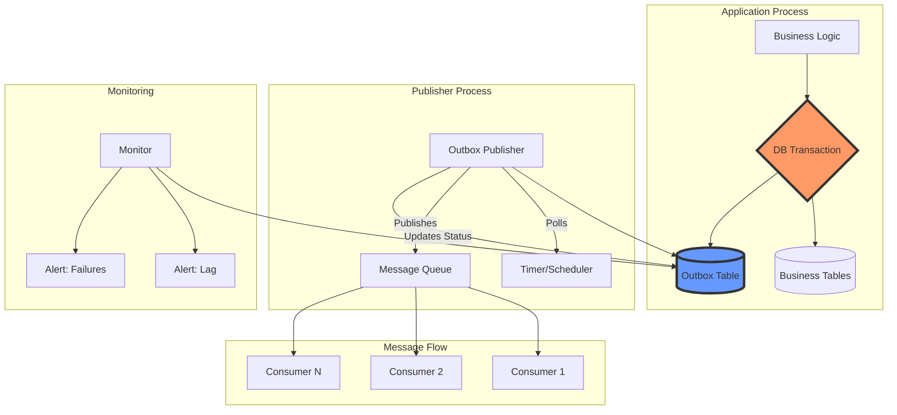

<!-- Navigation -->
[Home](../index.md) → [Part III: Patterns](index.md) → **Outbox Pattern**

# Outbox Pattern

**Solving the dual-write problem once and for all - Transactional event publishing for distributed systems**

> *"Database commits, message fails to send. Message sends, database rolls back. Welcome to distributed systems hell... unless you use the Outbox pattern."*

---

## 🎯 Level 1: Intuition

### The Hospital Records Analogy

Think of the Outbox pattern like a hospital's discharge process:

```
Without Outbox:                    With Outbox:
Doctor: "Patient discharged!"      Doctor writes in patient file:
→ Updates hospital records         → Patient discharged ✓
→ Calls insurance... BUSY!         → Notify insurance (PENDING)
→ Calls pharmacy... NO ANSWER!     → Notify pharmacy (PENDING)
→ Tells reception... FORGOT!       → Update reception (PENDING)

Result: Chaos! Records don't       Clerk processes file later:
match, patient stuck, bills wrong  → All notifications sent reliably
```

### Visual Metaphor

```
The Dual-Write Problem:

Application: "Save order AND send email!"

Scenario 1: ✓ Save → ✗ Email = Customer confused
Scenario 2: ✗ Save → ✓ Email = Ghost order
Scenario 3: ✓ Save → ✓ Email → CRASH = Unknown state

Outbox Solution:
Transaction {
    ✓ Save Order
    ✓ Save "Send Email" task
} = ATOMIC!

Later: Background worker sends all pending tasks
```

### Real-World Examples

| System | Without Outbox | With Outbox |
|--------|----------------|-------------|
| **E-commerce** | Order saved, payment notification lost | Both happen or neither |
| **Banking** | Transfer done, audit event missing | Complete audit trail |
| **Uber** | Ride assigned, driver not notified | Guaranteed notifications |
| **Netflix** | Show watched, recommendations not updated | Consistent experience |

### Basic Implementation

```python
# The problem: Dual writes
def create_order_problematic(order_data):
    # These two operations are NOT atomic!
    order = save_to_database(order_data)  # What if this succeeds...
    publish_event("OrderCreated", order)   # ...but this fails?
    # Now we have an order with no event!

# The solution: Outbox pattern
def create_order_with_outbox(order_data):
    with database.transaction() as tx:
        # Both happen in same transaction
        order = save_order(order_data, tx)
        save_outbox_message({
            "event": "OrderCreated",
            "data": order,
            "status": "PENDING"
        }, tx)
    # Transaction ensures both succeed or both fail!
    
# Background process
def outbox_publisher():
    while True:
        messages = get_pending_messages()
        for msg in messages:
            if publish_to_queue(msg):
                mark_as_sent(msg)
            else:
                retry_later(msg)
        sleep(1)  # Poll every second
```

---

## 🏗️ Level 2: Foundation

### Core Architecture



### Outbox Table Schema

```sql
CREATE TABLE outbox (
    -- Identity
    id UUID PRIMARY KEY DEFAULT gen_random_uuid(),
    
    -- Message metadata
    aggregate_id VARCHAR(255) NOT NULL,      -- e.g., order_id
    aggregate_type VARCHAR(100) NOT NULL,    -- e.g., "order"
    event_type VARCHAR(100) NOT NULL,        -- e.g., "created"
    
    -- Message content
    payload JSONB NOT NULL,                  -- Event data
    
    -- Processing state
    status VARCHAR(20) NOT NULL DEFAULT 'PENDING',
    attempts INT NOT NULL DEFAULT 0,
    
    -- Timestamps
    created_at TIMESTAMP NOT NULL DEFAULT CURRENT_TIMESTAMP,
    scheduled_for TIMESTAMP NOT NULL DEFAULT CURRENT_TIMESTAMP,
    last_attempt_at TIMESTAMP,
    published_at TIMESTAMP,
    
    -- Indexes for performance
    INDEX idx_status_scheduled (status, scheduled_for),
    INDEX idx_aggregate (aggregate_type, aggregate_id, created_at),
    INDEX idx_created (created_at)
);
```

### Implementation Patterns

```python
from dataclasses import dataclass
from datetime import datetime, timedelta
from typing import List, Optional, Dict, Any
import asyncio
import json

@dataclass
class OutboxMessage:
    """Represents a message in the outbox"""
    aggregate_id: str
    aggregate_type: str
    event_type: str
    payload: Dict[str, Any]
    id: Optional[str] = None
    status: str = "PENDING"
    attempts: int = 0
    created_at: Optional[datetime] = None
    
class TransactionalOutbox:
    """Core outbox implementation"""
    
    def __init__(self, db_pool, config):
        self.db = db_pool
        self.config = config
        
    async def with_transaction(self, business_op, events: List[OutboxMessage]):
        """Execute business operation and save events atomically"""
        async with self.db.transaction() as tx:
            # Execute business logic
            result = await business_op(tx)
            
            # Save all events to outbox
            for event in events:
                await self._save_to_outbox(tx, event)
            
            # Transaction commits here - all or nothing!
            return result
    
    async def _save_to_outbox(self, tx, message: OutboxMessage):
        """Save message to outbox within transaction"""
        await tx.execute("""
            INSERT INTO outbox (
                aggregate_id, aggregate_type, event_type,
                payload, status, created_at
            ) VALUES ($1, $2, $3, $4, $5, $6)
        """, 
            message.aggregate_id, message.aggregate_type,
            message.event_type, json.dumps(message.payload),
            message.status, datetime.utcnow()
        )

class OutboxPublisher:
    """Publishes messages from outbox"""
    
    def __init__(self, outbox_store, message_bus):
        self.store = outbox_store
        self.bus = message_bus
        self.config = {
            'batch_size': 100,
            'poll_interval': 1.0,
            'max_attempts': 3,
            'backoff_multiplier': 2
        }
        
    async def run(self):
        """Main publisher loop"""
        while True:
            try:
                count = await self._publish_batch()
                if count == 0:
                    # No messages, wait before next poll
                    await asyncio.sleep(self.config['poll_interval'])
                # If we found messages, immediately check for more
            except Exception as e:
                logger.error(f"Publisher error: {e}")
                await asyncio.sleep(self.config['poll_interval'])
    
    async def _publish_batch(self):
        """Publish a batch of messages"""
        # Claim messages for processing
        messages = await self.store.claim_messages(
            batch_size=self.config['batch_size']
        )
        
        published_count = 0
        for message in messages:
            try:
                # Publish to message bus
                await self.bus.publish(
                    topic=f"{message.aggregate_type}.{message.event_type}",
                    key=message.aggregate_id,
                    value=message.payload
                )
                
                # Mark as published
                await self.store.mark_published(message.id)
                published_count += 1
                
            except Exception as e:
                # Handle failure with exponential backoff
                await self._handle_failure(message, e)
        
        return published_count
    
    async def _handle_failure(self, message, error):
        """Handle publishing failure"""
        message.attempts += 1
        
        if message.attempts >= self.config['max_attempts']:
            # Move to dead letter queue
            await self.store.mark_failed(message.id, str(error))
        else:
            # Schedule retry with backoff
            retry_delay = self.config['backoff_multiplier'] ** message.attempts
            await self.store.schedule_retry(message.id, retry_delay)
```

### Advanced Features

```python
class PartitionedOutbox:
    """High-performance outbox with partitioning"""
    
    async def setup_partitions(self):
        """Create time-based partitions"""
        # Current month partition
        await self._create_partition(datetime.utcnow())
        
        # Next month partition (prepare in advance)
        next_month = datetime.utcnow() + timedelta(days=32)
        await self._create_partition(next_month)
    
    async def _create_partition(self, date):
        """Create monthly partition"""
        table_name = f"outbox_{date.strftime('%Y_%m')}"
        start = date.replace(day=1)
        end = (start + timedelta(days=32)).replace(day=1)
        
        await self.db.execute(f"""
            CREATE TABLE IF NOT EXISTS {table_name}
            PARTITION OF outbox
            FOR VALUES FROM ('{start}') TO ('{end}')
        """)

class IdempotentPublisher:
    """Ensures exactly-once delivery"""
    
    async def publish_with_deduplication(self, message):
        """Publish with idempotency key"""
        idempotency_key = f"{message.aggregate_id}:{message.id}"
        
        # Check if already published
        if await self.cache.exists(idempotency_key):
            logger.info(f"Message {message.id} already published")
            return
        
        # Publish
        await self.bus.publish(message)
        
        # Record in cache with TTL
        await self.cache.set(
            idempotency_key, 
            "1", 
            ttl=86400  # 24 hours
        )
```

---

## 🔧 Level 3: Deep Dive

### Production-Grade Implementation

```python
import asyncio
import json
import uuid
from datetime import datetime, timedelta
from typing import List, Dict, Any, Optional, Callable
from dataclasses import dataclass, field
import asyncpg
from aiokafka import AIOKafkaProducer
import structlog

logger = structlog.get_logger()

class OutboxError(Exception):
    """Base exception for outbox errors"""
    pass

@dataclass
class OutboxConfig:
    """Configuration for outbox behavior"""
    batch_size: int = 100
    poll_interval: float = 1.0
    max_attempts: int = 3
    backoff_base: float = 2.0
    backoff_max: float = 300.0  # 5 minutes
    retention_days: int = 7
    partition_strategy: str = "monthly"
    enable_compression: bool = True
    enable_deduplication: bool = True
    
class AdvancedOutboxStore:
    """Production-ready outbox storage"""
    
    def __init__(self, db_pool: asyncpg.Pool, config: OutboxConfig):
        self.db = db_pool
        self.config = config
        self._topic_cache = {}
        
    async def initialize(self):
        """Set up schema and partitions"""
        async with self.db.acquire() as conn:
            # Main table with declarative partitioning
            await conn.execute("""
                CREATE TABLE IF NOT EXISTS outbox (
                    id UUID NOT NULL,
                    aggregate_id VARCHAR(255) NOT NULL,
                    aggregate_type VARCHAR(100) NOT NULL,
                    event_type VARCHAR(100) NOT NULL,
                    event_version INT NOT NULL DEFAULT 1,
                    
                    -- Payload with optional compression
                    payload JSONB NOT NULL,
                    payload_compressed BYTEA,
                    compression_type VARCHAR(20),
                    
                    -- Routing information
                    topic VARCHAR(255),
                    partition_key VARCHAR(255),
                    headers JSONB,
                    
                    -- Processing state
                    status VARCHAR(20) NOT NULL DEFAULT 'PENDING',
                    attempts INT NOT NULL DEFAULT 0,
                    error_message TEXT,
                    
                    -- Timestamps
                    created_at TIMESTAMP NOT NULL DEFAULT CURRENT_TIMESTAMP,
                    scheduled_for TIMESTAMP NOT NULL DEFAULT CURRENT_TIMESTAMP,
                    last_attempt_at TIMESTAMP,
                    published_at TIMESTAMP,
                    
                    -- Deduplication
                    idempotency_key VARCHAR(255) UNIQUE,
                    
                    PRIMARY KEY (created_at, id)
                ) PARTITION BY RANGE (created_at)
            """)
            
            # Indexes
            await conn.execute("""
                CREATE INDEX IF NOT EXISTS idx_outbox_processing 
                ON outbox (status, scheduled_for) 
                WHERE status IN ('PENDING', 'RETRY')
            """)
            
            await conn.execute("""
                CREATE INDEX IF NOT EXISTS idx_outbox_aggregate 
                ON outbox (aggregate_type, aggregate_id, created_at DESC)
            """)
            
            # Set up current and next month partitions
            await self._ensure_partitions()
    
    async def save_events(self, conn, events: List[Dict[str, Any]]):
        """Save multiple events in current transaction"""
        if not events:
            return
        
        # Prepare batch insert
        values = []
        for event in events:
            event_id = event.get('id', str(uuid.uuid4()))
            
            # Generate idempotency key if enabled
            idempotency_key = None
            if self.config.enable_deduplication:
                idempotency_key = f"{event['aggregate_id']}:{event['event_type']}:{event_id}"
            
            # Compress large payloads
            payload = event['payload']
            compressed = None
            compression_type = None
            
            if self.config.enable_compression and len(json.dumps(payload)) > 1024:
                import zlib
                compressed = zlib.compress(json.dumps(payload).encode())
                compression_type = 'zlib'
                payload = None  # Store compressed version only
            
            values.append((
                event_id,
                event['aggregate_id'],
                event['aggregate_type'],
                event['event_type'],
                event.get('version', 1),
                json.dumps(payload) if payload else None,
                compressed,
                compression_type,
                event.get('topic'),
                event.get('partition_key', event['aggregate_id']),
                json.dumps(event.get('headers', {})),
                idempotency_key
            ))
        
        # Batch insert
        await conn.executemany("""
            INSERT INTO outbox (
                id, aggregate_id, aggregate_type, event_type, event_version,
                payload, payload_compressed, compression_type,
                topic, partition_key, headers, idempotency_key
            ) VALUES ($1, $2, $3, $4, $5, $6, $7, $8, $9, $10, $11, $12)
            ON CONFLICT (idempotency_key) DO NOTHING
        """, values)
    
    async def claim_messages(self, batch_size: Optional[int] = None) -> List[Dict]:
        """Claim messages for processing with skip-locked"""
        batch_size = batch_size or self.config.batch_size
        
        async with self.db.acquire() as conn:
            rows = await conn.fetch("""
                WITH claimed AS (
                    SELECT id FROM outbox
                    WHERE status IN ('PENDING', 'RETRY')
                    AND scheduled_for <= CURRENT_TIMESTAMP
                    ORDER BY created_at, id
                    LIMIT $1
                    FOR UPDATE SKIP LOCKED
                )
                UPDATE outbox o
                SET 
                    status = 'PROCESSING',
                    attempts = attempts + 1,
                    last_attempt_at = CURRENT_TIMESTAMP
                FROM claimed c
                WHERE o.id = c.id
                RETURNING o.*
            """, batch_size)
            
            return [self._row_to_message(row) for row in rows]
    
    def _row_to_message(self, row) -> Dict:
        """Convert database row to message dict"""
        # Decompress if needed
        payload = row['payload']
        if row['compression_type'] == 'zlib' and row['payload_compressed']:
            import zlib
            payload = json.loads(zlib.decompress(row['payload_compressed']))
        
        return {
            'id': str(row['id']),
            'aggregate_id': row['aggregate_id'],
            'aggregate_type': row['aggregate_type'],
            'event_type': row['event_type'],
            'version': row['event_version'],
            'payload': payload,
            'topic': row['topic'],
            'partition_key': row['partition_key'],
            'headers': row['headers'],
            'attempts': row['attempts'],
            'created_at': row['created_at']
        }

class SmartOutboxPublisher:
    """Intelligent publisher with advanced features"""
    
    def __init__(self, 
                 store: AdvancedOutboxStore,
                 producer: AIOKafkaProducer,
                 config: OutboxConfig):
        self.store = store
        self.producer = producer
        self.config = config
        self.metrics = OutboxMetrics()
        self._running = False
        
    async def start(self):
        """Start publisher with multiple workers"""
        self._running = True
        
        # Start multiple publisher tasks for parallelism
        workers = []
        for i in range(3):  # 3 parallel workers
            workers.append(
                asyncio.create_task(self._publisher_loop(worker_id=i))
            )
        
        # Start maintenance tasks
        asyncio.create_task(self._cleanup_loop())
        asyncio.create_task(self._metrics_loop())
        
        await asyncio.gather(*workers)
    
    async def _publisher_loop(self, worker_id: int):
        """Main publisher loop for a worker"""
        logger.info(f"Starting publisher worker {worker_id}")
        
        while self._running:
            try:
                messages = await self.store.claim_messages()
                
                if not messages:
                    await asyncio.sleep(self.config.poll_interval)
                    continue
                
                # Process messages in parallel
                tasks = [
                    self._publish_message(msg) 
                    for msg in messages
                ]
                results = await asyncio.gather(*tasks, return_exceptions=True)
                
                # Update metrics
                success_count = sum(1 for r in results if r is True)
                self.metrics.record_batch(
                    worker_id=worker_id,
                    total=len(messages),
                    success=success_count
                )
                
            except Exception as e:
                logger.error(f"Publisher worker {worker_id} error", error=str(e))
                await asyncio.sleep(self.config.poll_interval)
    
    async def _publish_message(self, message: Dict) -> bool:
        """Publish a single message"""
        try:
            # Determine topic
            topic = message['topic'] or f"{message['aggregate_type']}.{message['event_type']}"
            
            # Prepare headers
            headers = [
                ('message_id', message['id'].encode()),
                ('aggregate_type', message['aggregate_type'].encode()),
                ('event_type', message['event_type'].encode()),
                ('event_version', str(message['version']).encode()),
            ]
            
            # Add custom headers
            for k, v in message.get('headers', {}).items():
                headers.append((k, str(v).encode()))
            
            # Publish to Kafka
            await self.producer.send_and_wait(
                topic=topic,
                key=message['partition_key'].encode(),
                value=json.dumps(message['payload']).encode(),
                headers=headers
            )
            
            # Mark as published
            await self.store.mark_published(message['id'])
            
            # Record metrics
            publish_lag = (datetime.utcnow() - message['created_at']).total_seconds()
            self.metrics.record_publish(
                aggregate_type=message['aggregate_type'],
                event_type=message['event_type'],
                lag_seconds=publish_lag
            )
            
            return True
            
        except Exception as e:
            logger.error(f"Failed to publish message {message['id']}", error=str(e))
            await self._handle_failure(message, str(e))
            return False
    
    async def _handle_failure(self, message: Dict, error: str):
        """Handle publishing failure with smart retry"""
        if message['attempts'] >= self.config.max_attempts:
            # Max attempts reached, move to DLQ
            await self.store.mark_failed(message['id'], error)
            self.metrics.record_dlq(message['aggregate_type'], message['event_type'])
        else:
            # Calculate exponential backoff with jitter
            backoff = min(
                self.config.backoff_base ** message['attempts'] + random.uniform(0, 1),
                self.config.backoff_max
            )
            
            await self.store.schedule_retry(message['id'], backoff)
            self.metrics.record_retry(message['aggregate_type'], message['event_type'])
```

### Monitoring and Operations

```python
class OutboxMetrics:
    """Comprehensive metrics for outbox pattern"""
    
    def __init__(self):
        self.prometheus = PrometheusClient()
        
        # Define metrics
        self.messages_published = Counter(
            'outbox_messages_published_total',
            'Total messages published',
            ['aggregate_type', 'event_type']
        )
        
        self.publish_lag = Histogram(
            'outbox_publish_lag_seconds',
            'Time between event creation and publishing',
            ['aggregate_type', 'event_type'],
            buckets=[0.1, 0.5, 1, 5, 10, 30, 60, 300]
        )
        
        self.batch_size = Histogram(
            'outbox_batch_size',
            'Size of processing batches',
            ['worker_id']
        )
        
        self.failures = Counter(
            'outbox_failures_total',
            'Total publishing failures',
            ['aggregate_type', 'event_type', 'failure_type']
        )
        
        self.table_size = Gauge(
            'outbox_table_size',
            'Number of messages in outbox',
            ['status']
        )

class OutboxHealthCheck:
    """Health monitoring for outbox pattern"""
    
    async def check_health(self) -> Dict[str, Any]:
        """Comprehensive health check"""
        health = {
            'status': 'healthy',
            'checks': {},
            'metrics': {}
        }
        
        # Check publishing lag
        oldest_pending = await self.store.get_oldest_pending()
        if oldest_pending:
            lag = (datetime.utcnow() - oldest_pending['created_at']).total_seconds()
            health['metrics']['oldest_pending_seconds'] = lag
            
            if lag > 300:  # 5 minutes
                health['status'] = 'unhealthy'
                health['checks']['publishing_lag'] = 'CRITICAL'
        
        # Check table size
        counts = await self.store.get_status_counts()
        health['metrics']['pending_count'] = counts.get('PENDING', 0)
        health['metrics']['failed_count'] = counts.get('FAILED', 0)
        
        if counts.get('FAILED', 0) > 100:
            health['status'] = 'degraded'
            health['checks']['failed_messages'] = 'WARNING'
        
        # Check publisher status
        if not self.publisher.is_running():
            health['status'] = 'unhealthy'
            health['checks']['publisher'] = 'DOWN'
        
        return health
```

---

## 🚀 Level 4: Expert

### Production Case Study: Uber's Event Pipeline

Uber processes billions of events daily using outbox pattern for critical flows.

```python
class UberEventOutbox:
    """
    Uber's production outbox handling:
    - 10B+ events/day
    - 99.99% delivery guarantee
    - <100ms publishing latency
    """
    
    def __init__(self):
        self.config = {
            'shards': 64,  # Sharded outbox tables
            'publishers_per_shard': 4,
            'batch_size': 1000,
            'compression': 'snappy',
            'retention_hours': 24
        }
    
    async def handle_trip_completion(self, trip_id: str, trip_data: dict):
        """
        Critical flow: Trip completion must trigger:
        1. Payment processing
        2. Driver earnings update  
        3. Rider receipt
        4. Rating request
        5. Surge pricing update
        """
        
        async with self.db.transaction() as tx:
            # Update trip status
            await tx.execute("""
                UPDATE trips 
                SET status = 'completed', 
                    completed_at = CURRENT_TIMESTAMP,
                    fare = $1
                WHERE id = $2
            """, trip_data['fare'], trip_id)
            
            # Generate events for outbox
            shard = self.get_shard(trip_id)
            events = [
                {
                    'id': str(uuid.uuid4()),
                    'aggregate_id': trip_id,
                    'aggregate_type': 'trip',
                    'event_type': 'completed',
                    'payload': trip_data,
                    'topic': 'trips.completed',
                    'headers': {
                        'city': trip_data['city'],
                        'priority': 'high'
                    }
                },
                {
                    'aggregate_id': trip_data['driver_id'],
                    'aggregate_type': 'driver',
                    'event_type': 'earnings_update',
                    'payload': {
                        'trip_id': trip_id,
                        'earnings': trip_data['driver_earnings']
                    },
                    'topic': 'driver.earnings'
                },
                {
                    'aggregate_id': trip_data['rider_id'],
                    'aggregate_type': 'rider',
                    'event_type': 'receipt_ready',
                    'payload': {
                        'trip_id': trip_id,
                        'fare': trip_data['fare']
                    },
                    'topic': 'rider.notifications'
                }
            ]
            
            # Save to sharded outbox
            await self.save_to_shard(tx, shard, events)
    
    async def publisher_for_shard(self, shard: int):
        """Dedicated publisher per shard for parallelism"""
        
        while True:
            try:
                # Use prepared statement for performance
                messages = await self.claim_from_shard(
                    shard, 
                    batch_size=self.config['batch_size']
                )
                
                if not messages:
                    await asyncio.sleep(0.1)  # 100ms poll interval
                    continue
                
                # Group by topic for batch publishing
                by_topic = defaultdict(list)
                for msg in messages:
                    by_topic[msg['topic']].append(msg)
                
                # Publish each topic batch
                for topic, topic_messages in by_topic.items():
                    await self.publish_batch_to_kafka(topic, topic_messages)
                
                # Update all at once
                message_ids = [m['id'] for m in messages]
                await self.mark_published_batch(shard, message_ids)
                
            except Exception as e:
                logger.error(f"Shard {shard} publisher error", error=e)
                await asyncio.sleep(1)
    
    def get_monitoring_dashboard(self):
        """Real-time monitoring queries"""
        return {
            'publishing_lag': """
                SELECT 
                    shard,
                    COUNT(*) as pending_count,
                    MIN(created_at) as oldest_message,
                    EXTRACT(EPOCH FROM (NOW() - MIN(created_at))) as max_lag_seconds
                FROM outbox_shard_{shard}
                WHERE status = 'PENDING'
                GROUP BY shard
                HAVING COUNT(*) > 0
                ORDER BY max_lag_seconds DESC
            """,
            
            'throughput': """
                SELECT 
                    DATE_TRUNC('minute', published_at) as minute,
                    COUNT(*) as events_published,
                    AVG(EXTRACT(EPOCH FROM (published_at - created_at))) as avg_latency
                FROM outbox_shard_{shard}
                WHERE published_at > NOW() - INTERVAL '1 hour'
                GROUP BY minute
                ORDER BY minute DESC
            """,
            
            'error_analysis': """
                SELECT 
                    aggregate_type,
                    event_type,
                    COUNT(*) as error_count,
                    MAX(error_message) as sample_error
                FROM outbox_shard_{shard}
                WHERE status = 'FAILED'
                AND last_attempt_at > NOW() - INTERVAL '1 hour'
                GROUP BY aggregate_type, event_type
                ORDER BY error_count DESC
            """
        }
```

### Advanced Patterns

#### Outbox with Saga Orchestration

```python
class SagaOutbox:
    """Outbox pattern integrated with Saga pattern"""
    
    async def start_order_saga(self, order_data: dict):
        """
        Multi-step order processing saga:
        1. Reserve inventory
        2. Process payment
        3. Arrange shipping
        4. Send confirmation
        """
        saga_id = str(uuid.uuid4())
        
        async with self.db.transaction() as tx:
            # Create saga state
            await tx.execute("""
                INSERT INTO sagas (id, type, state, data)
                VALUES ($1, 'order_processing', 'started', $2)
            """, saga_id, json.dumps(order_data))
            
            # First step: Reserve inventory
            await self.outbox.save_events(tx, [{
                'aggregate_id': saga_id,
                'aggregate_type': 'saga',
                'event_type': 'inventory_reserve_requested',
                'payload': {
                    'saga_id': saga_id,
                    'items': order_data['items']
                },
                'headers': {
                    'saga_step': 1,
                    'compensation': 'inventory_release'
                }
            }])
    
    async def handle_saga_response(self, response: dict):
        """Handle saga step completion"""
        saga_id = response['saga_id']
        
        async with self.db.transaction() as tx:
            # Get current saga state
            saga = await tx.fetchrow(
                "SELECT * FROM sagas WHERE id = $1 FOR UPDATE",
                saga_id
            )
            
            if response['status'] == 'success':
                # Proceed to next step
                next_events = self.get_next_saga_events(saga, response)
                await self.outbox.save_events(tx, next_events)
            else:
                # Start compensation
                compensation_events = self.get_compensation_events(saga, response)
                await self.outbox.save_events(tx, compensation_events)
```

#### Change Data Capture Integration

```python
class CDCOutbox:
    """Combine CDC with Outbox for zero-application-code events"""
    
    async def setup_cdc_to_outbox(self):
        """Configure CDC to write to outbox"""
        
        # Create trigger function
        await self.db.execute("""
            CREATE OR REPLACE FUNCTION cdc_to_outbox()
            RETURNS TRIGGER AS $$
            BEGIN
                -- For specific tables, generate events
                IF TG_TABLE_NAME = 'orders' THEN
                    INSERT INTO outbox (
                        aggregate_id, aggregate_type, event_type,
                        payload, topic
                    ) VALUES (
                        NEW.id::text,
                        'order',
                        LOWER(TG_OP),  -- insert, update, delete
                        row_to_json(NEW),
                        'cdc.orders'
                    );
                END IF;
                
                RETURN NEW;
            END;
            $$ LANGUAGE plpgsql;
        """)
        
        # Attach to tables
        await self.db.execute("""
            CREATE TRIGGER orders_cdc
            AFTER INSERT OR UPDATE OR DELETE ON orders
            FOR EACH ROW EXECUTE FUNCTION cdc_to_outbox();
        """)
```

---

## 🎯 Level 5: Mastery

### Theoretical Foundations

#### Distributed Systems Theory

```python
class OutboxConsistencyModel:
    """
    Theoretical analysis of outbox pattern guarantees
    """
    
    def analyze_delivery_semantics(self):
        """
        Outbox provides exactly-once processing semantics:
        
        1. At-most-once: Message never published twice
           - Idempotency keys prevent duplicates
           - Status tracking ensures single publish
        
        2. At-least-once: Message always eventually published  
           - Persistent storage survives crashes
           - Retry mechanism handles transient failures
        
        3. Ordering: Preserves causal ordering
           - Events from same transaction maintain order
           - Timestamp ordering within aggregate
        """
        
        return {
            'atomicity': 'Transaction boundary ensures all-or-nothing',
            'consistency': 'State and events always match',
            'isolation': 'SKIP LOCKED prevents conflicts',
            'durability': 'Database persistence survives failures',
            'ordering': 'Causal ordering within aggregates',
            'delivery': 'Exactly-once processing guarantee'
        }
    
    def cap_theorem_analysis(self):
        """How outbox handles CAP theorem"""
        
        return {
            'consistency': {
                'guarantee': 'Strong consistency within transaction',
                'mechanism': 'ACID transactions',
                'trade_off': 'None within single database'
            },
            'availability': {
                'guarantee': 'High availability for writes',
                'mechanism': 'Async publishing, retry logic',
                'trade_off': 'Publishing lag during failures'
            },
            'partition_tolerance': {
                'guarantee': 'Survives network partitions',
                'mechanism': 'Local storage, eventual delivery',
                'trade_off': 'Temporary message delay'
            }
        }
```

#### Performance Modeling

```python
import numpy as np
from scipy import stats

class OutboxPerformanceModel:
    """Mathematical model of outbox performance"""
    
    def model_publishing_lag(self, params: dict) -> dict:
        """
        Model expected publishing lag using queuing theory
        
        M/M/c queue model where:
        - λ = arrival rate (events/second)
        - μ = service rate (publishes/second)
        - c = number of publishers
        """
        λ = params['event_rate']
        μ = params['publish_rate']
        c = params['num_publishers']
        
        # Utilization
        ρ = λ / (c * μ)
        
        if ρ >= 1:
            return {'status': 'unstable', 'reason': 'Arrival rate exceeds capacity'}
        
        # Erlang C formula for wait time
        # P(wait) = probability of waiting
        p_wait = self.erlang_c(c, λ/μ)
        
        # Average wait time in queue
        W_q = p_wait / (c * μ - λ)
        
        # Average time in system
        W = W_q + 1/μ
        
        # Queue length (Little's Law)
        L_q = λ * W_q
        
        return {
            'utilization': ρ,
            'avg_publishing_lag_ms': W * 1000,
            'avg_queue_length': L_q,
            'p99_lag_ms': self.calculate_percentile(W, 0.99) * 1000,
            'capacity_headroom': (1 - ρ) * 100
        }
    
    def optimize_configuration(self, constraints: dict) -> dict:
        """Optimize outbox configuration for constraints"""
        
        # Decision variables
        # - Batch size
        # - Poll interval  
        # - Number of publishers
        
        def objective(x):
            batch_size, poll_interval, num_publishers = x
            
            # Minimize: latency + resource_cost
            latency = poll_interval / 2 + batch_size / params['publish_rate']
            resource_cost = num_publishers * 0.1 + (1000 / poll_interval) * 0.01
            
            return latency + resource_cost
        
        # Constraints
        constraints = [
            {'type': 'ineq', 'fun': lambda x: x[0] - 10},  # batch_size >= 10
            {'type': 'ineq', 'fun': lambda x: 5000 - x[0]},  # batch_size <= 5000
            {'type': 'ineq', 'fun': lambda x: x[1] - 0.1},  # poll >= 100ms
            {'type': 'ineq', 'fun': lambda x: x[2] - 1},  # publishers >= 1
        ]
        
        result = minimize(
            objective,
            x0=[100, 1.0, 3],
            constraints=constraints,
            bounds=[(10, 5000), (0.1, 10), (1, 20)]
        )
        
        return {
            'optimal_batch_size': int(result.x[0]),
            'optimal_poll_interval': result.x[1],
            'optimal_publishers': int(result.x[2]),
            'expected_latency': result.fun
        }
```

### Future Directions

#### Quantum-Resistant Event Ordering

```python
class QuantumSafeOutbox:
    """
    Future-proof outbox with quantum-resistant ordering
    """
    
    def generate_quantum_safe_ordering(self):
        """
        Use lattice-based cryptography for ordering that
        survives quantum computer attacks
        """
        # Simplified example - real implementation would use
        # post-quantum cryptographic libraries
        
        class LatticeTimestamp:
            def __init__(self):
                self.lattice_point = self.generate_lattice_point()
                self.classical_time = time.time()
            
            def generate_lattice_point(self):
                # Generate point in high-dimensional lattice
                # that provides ordering resistant to quantum attacks
                dimension = 256
                return np.random.randint(-1000, 1000, size=dimension)
            
            def compare(self, other):
                # Lattice-based comparison
                diff = self.lattice_point - other.lattice_point
                return np.dot(diff, diff) > 0
```

#### AI-Powered Publishing Optimization

```python
class AIOptimizedOutbox:
    """Machine learning for optimal publishing strategies"""
    
    def __init__(self):
        self.model = self.train_publishing_model()
        
    def train_publishing_model(self):
        """
        Train model to predict optimal publishing parameters
        based on historical patterns
        """
        features = [
            'hour_of_day',
            'day_of_week', 
            'event_type',
            'payload_size',
            'current_queue_depth',
            'publisher_cpu_usage',
            'network_latency',
            'downstream_health'
        ]
        
        # Train to minimize end-to-end latency
        model = GradientBoostingRegressor(
            n_estimators=100,
            learning_rate=0.1,
            max_depth=5
        )
        
        return model
    
    def adaptive_publishing(self, current_state: dict) -> dict:
        """Dynamically adjust publishing parameters"""
        
        # Predict optimal configuration
        features = self.extract_features(current_state)
        optimal_batch = self.model.predict([features])[0]
        
        # Apply constraints
        return {
            'batch_size': int(np.clip(optimal_batch, 10, 5000)),
            'priority_boost': self.should_boost_priority(current_state),
            'compression': self.should_compress(current_state)
        }
```

### Economic Impact

```python
class OutboxEconomics:
    """Economic analysis of outbox pattern adoption"""
    
    def calculate_roi(self, company_metrics: dict) -> dict:
        """
        Calculate return on investment for outbox pattern
        """
        
        # Cost of lost events without outbox
        events_per_year = company_metrics['events_per_day'] * 365
        loss_rate_without = 0.001  # 0.1% loss rate
        revenue_per_event = company_metrics['revenue_per_event']
        
        annual_loss_without = events_per_year * loss_rate_without * revenue_per_event
        
        # Cost of inconsistency and manual reconciliation
        reconciliation_hours = company_metrics['reconciliation_hours_per_month'] * 12
        hourly_rate = company_metrics['engineer_hourly_rate']
        reconciliation_cost = reconciliation_hours * hourly_rate
        
        # Implementation cost
        implementation_hours = 160  # 1 month for team
        infrastructure_cost = 50000  # Database storage, monitoring
        
        total_implementation = implementation_hours * hourly_rate + infrastructure_cost
        
        # Ongoing costs
        storage_cost_per_gb = 0.10
        avg_message_size = 1024  # 1KB
        retention_days = 7
        
        storage_gb = (events_per_year / 365 * retention_days * avg_message_size) / 1e9
        annual_storage_cost = storage_gb * storage_cost_per_gb * 12
        
        # Benefits
        loss_rate_with_outbox = 0.00001  # 0.001% with outbox
        annual_loss_with = events_per_year * loss_rate_with_outbox * revenue_per_event
        
        annual_savings = (
            (annual_loss_without - annual_loss_with) +
            reconciliation_cost -
            annual_storage_cost
        )
        
        return {
            'implementation_cost': total_implementation,
            'annual_savings': annual_savings,
            'payback_months': total_implementation / (annual_savings / 12),
            'five_year_roi': (annual_savings * 5 - total_implementation) / total_implementation * 100,
            'prevented_losses_per_year': annual_loss_without - annual_loss_with
        }
```

---

## 📊 Quick Reference

### Decision Framework

| Question | Yes → Use Outbox | No → Consider Alternatives |
|----------|------------------|---------------------------|
| Need guaranteed event delivery? | ✅ Outbox ensures delivery | ⚠️ Maybe accept event loss |
| Have transactional database? | ✅ Perfect for outbox | ⚠️ Need different approach |
| Multiple downstream systems? | ✅ Outbox decouples publishing | ⚠️ Direct integration might work |
| Need audit trail? | ✅ Complete event history | ⚠️ Logs might suffice |
| Can tolerate async publishing? | ✅ Outbox adds small delay | ⚠️ Consider sync publishing |

### Implementation Checklist

- [ ] Design outbox table schema
- [ ] Set up partitioning strategy
- [ ] Implement transactional save
- [ ] Create publisher service
- [ ] Add monitoring and metrics
- [ ] Configure retention policy
- [ ] Set up dead letter queue
- [ ] Test failure scenarios
- [ ] Document runbooks
- [ ] Train team on pattern

### Common Anti-Patterns

1. **Synchronous publishing** - Don't publish from transaction
2. **No partitioning** - Table grows unbounded
3. **No monitoring** - Silent failures
4. **Over-retention** - Keep messages too long
5. **Under-batching** - Inefficient publishing

---

## 🎓 Key Takeaways

1. **Outbox turns dual-write into single-write** - Atomic transaction guarantee
2. **Trade latency for reliability** - Async publishing worth it
3. **Monitor publishing lag** - Key health metric
4. **Partition early** - Scale from day one
5. **Idempotency matters** - Prevent duplicate delivery

---

*"In distributed systems, the question isn't if messages will fail to deliver, but when. The outbox pattern ensures the answer is: never."*

---

**Previous**: [← FinOps Pattern](finops.md) | **Next**: [Idempotent Receiver Pattern →](idempotent-receiver.md)