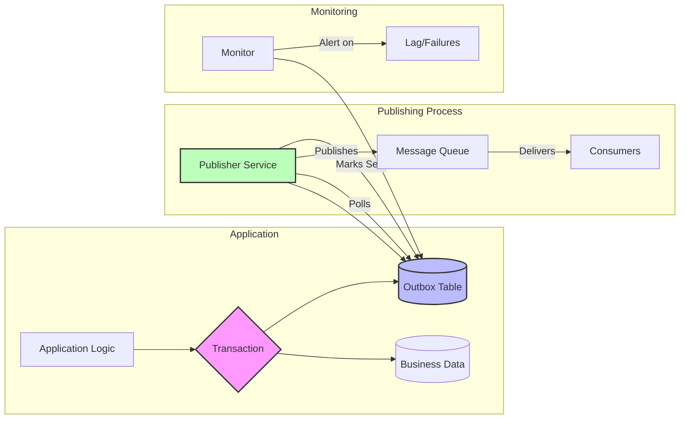

# Outbox Pattern

**Reliable message publishing with transactional guarantees - Never lose an event again**

> *"The database transaction commits, but the message fails to send. Now what? The Outbox pattern ensures both happen or neither does."*

---

## 🎯 Pattern Overview

### The Problem
When updating a database AND publishing events, you face the dual write problem:
- **Scenario 1**: Database commits, message publish fails → Event lost
- **Scenario 2**: Message publishes, database rollback → Ghost event
- **Scenario 3**: Both succeed but crash before acknowledgment → Unknown state

This leads to:
- Data inconsistency between services
- Lost domain events
- Ghost events causing invalid state
- Complex recovery procedures
- Manual reconciliation nightmares

### The Solution
Store outgoing messages in the same database transaction as your business data:
- **Transactional guarantee**: Business data and events commit together
- **Reliable delivery**: Background process ensures eventual delivery
- **Ordering preserved**: Events published in transaction order
- **Failure recovery**: Automatic retry of failed publishes

### When to Use

| ✅ Use When | ❌ Don't Use When |
|-------------|-------------------|
| • Need transactional messaging | • Database doesn't support transactions |
| • Event sourcing architecture | • Real-time publishing required |
| • Saga orchestration | • Event volume exceeds DB capacity |
| • Audit trail requirements | • Acceptable to lose some events |
| • Multi-service data consistency | • Simple fire-and-forget notifications |

---

## 🏗️ Architecture & Implementation

### Conceptual Model



### Key Components

| Component | Purpose | Responsibilities |
|-----------|---------|------------------|
| **Outbox Table** | Store pending messages | • Transactional storage<br>• Order preservation<br>• Status tracking<br>• Retry metadata |
| **Business Logic** | Generate events | • Create business data<br>• Create outbox entries<br>• Single transaction<br>• Event ordering |
| **Publisher Service** | Deliver messages | • Poll outbox table<br>• Publish to queue<br>• Mark as sent<br>• Handle failures |
| **Cleanup Process** | Remove old entries | • Delete sent messages<br>• Archive if needed<br>• Prevent table growth |
| **Monitoring** | Track health | • Publishing lag<br>• Failure rates<br>• Table size<br>• Performance metrics |

### Implementation Example

```python
import asyncio
import json
import uuid
from datetime import datetime, timedelta
from typing import List, Dict, Any, Optional
from dataclasses import dataclass, asdict
from enum import Enum
import asyncpg
import aiokafka
from contextlib import asynccontextmanager
import logging

class MessageStatus(Enum):
    PENDING = "PENDING"
    PUBLISHING = "PUBLISHING"
    PUBLISHED = "PUBLISHED"
    FAILED = "FAILED"

@dataclass
class OutboxMessage:
    """Represents a message in the outbox"""
    id: str
    aggregate_id: str
    aggregate_type: str
    event_type: str
    payload: Dict[str, Any]
    created_at: datetime
    status: MessageStatus = MessageStatus.PENDING
    attempts: int = 0
    last_attempt_at: Optional[datetime] = None
    published_at: Optional[datetime] = None
    
    def to_json(self) -> str:
        """Convert to JSON for publishing"""
        return json.dumps({
            'id': self.id,
            'aggregate_id': self.aggregate_id,
            'aggregate_type': self.aggregate_type,
            'event_type': self.event_type,
            'payload': self.payload,
            'timestamp': self.created_at.isoformat()
        })

class OutboxStore:
    """Manages outbox message persistence"""
    
    def __init__(self, db_pool: asyncpg.Pool):
        self.db_pool = db_pool
        self.logger = logging.getLogger(__name__)
    
    async def initialize_schema(self):
        """Create outbox table if not exists"""
        async with self.db_pool.acquire() as conn:
            await conn.execute('''
                CREATE TABLE IF NOT EXISTS outbox (
                    id UUID PRIMARY KEY,
                    aggregate_id VARCHAR(255) NOT NULL,
                    aggregate_type VARCHAR(100) NOT NULL,
                    event_type VARCHAR(100) NOT NULL,
                    payload JSONB NOT NULL,
                    status VARCHAR(20) NOT NULL DEFAULT 'PENDING',
                    attempts INT NOT NULL DEFAULT 0,
                    created_at TIMESTAMP NOT NULL DEFAULT CURRENT_TIMESTAMP,
                    last_attempt_at TIMESTAMP,
                    published_at TIMESTAMP,
                    INDEX idx_status_created (status, created_at),
                    INDEX idx_aggregate (aggregate_id, created_at)
                )
            ''')
    
    @asynccontextmanager
    async def transaction(self):
        """Provide transactional context"""
        async with self.db_pool.acquire() as conn:
            async with conn.transaction():
                yield conn
    
    async def add_message(self, conn: asyncpg.Connection, message: OutboxMessage):
        """Add message to outbox within transaction"""
        await conn.execute('''
            INSERT INTO outbox (
                id, aggregate_id, aggregate_type, event_type,
                payload, status, created_at
            ) VALUES ($1, $2, $3, $4, $5, $6, $7)
        ''', 
            message.id, message.aggregate_id, message.aggregate_type,
            message.event_type, json.dumps(message.payload),
            message.status.value, message.created_at
        )
    
    async def get_pending_messages(self, batch_size: int = 100) -> List[OutboxMessage]:
        """Retrieve pending messages for publishing"""
        async with self.db_pool.acquire() as conn:
            # Lock messages for processing
            rows = await conn.fetch('''
                UPDATE outbox
                SET status = $1, last_attempt_at = CURRENT_TIMESTAMP
                WHERE id IN (
                    SELECT id FROM outbox
                    WHERE status = $2
                    OR (status = $3 AND last_attempt_at < CURRENT_TIMESTAMP - INTERVAL '5 minutes')
                    ORDER BY created_at
                    LIMIT $4
                    FOR UPDATE SKIP LOCKED
                )
                RETURNING *
            ''', MessageStatus.PUBLISHING.value, MessageStatus.PENDING.value,
                MessageStatus.PUBLISHING.value, batch_size)
            
            return [self._row_to_message(row) for row in rows]
    
    async def mark_published(self, message_ids: List[str]):
        """Mark messages as successfully published"""
        async with self.db_pool.acquire() as conn:
            await conn.execute('''
                UPDATE outbox
                SET status = $1, published_at = CURRENT_TIMESTAMP
                WHERE id = ANY($2)
            ''', MessageStatus.PUBLISHED.value, message_ids)
    
    async def mark_failed(self, message_id: str, max_attempts: int = 3):
        """Mark message as failed, potentially for retry"""
        async with self.db_pool.acquire() as conn:
            await conn.execute('''
                UPDATE outbox
                SET 
                    attempts = attempts + 1,
                    status = CASE 
                        WHEN attempts + 1 >= $1 THEN $2
                        ELSE $3
                    END
                WHERE id = $4
            ''', max_attempts, MessageStatus.FAILED.value,
                MessageStatus.PENDING.value, message_id)
    
    async def cleanup_old_messages(self, retention_days: int = 7):
        """Remove old published messages"""
        async with self.db_pool.acquire() as conn:
            deleted = await conn.execute('''
                DELETE FROM outbox
                WHERE status = $1
                AND published_at < CURRENT_TIMESTAMP - INTERVAL '%s days'
            ''' % retention_days, MessageStatus.PUBLISHED.value)
            
            return deleted.split()[-1]  # Return count
    
    def _row_to_message(self, row) -> OutboxMessage:
        """Convert database row to OutboxMessage"""
        return OutboxMessage(
            id=str(row['id']),
            aggregate_id=row['aggregate_id'],
            aggregate_type=row['aggregate_type'],
            event_type=row['event_type'],
            payload=json.loads(row['payload']),
            created_at=row['created_at'],
            status=MessageStatus(row['status']),
            attempts=row['attempts'],
            last_attempt_at=row['last_attempt_at'],
            published_at=row['published_at']
        )

class OutboxPublisher:
    """Publishes messages from outbox to message queue"""
    
    def __init__(self, 
                 outbox_store: OutboxStore,
                 kafka_producer: aiokafka.AIOKafkaProducer,
                 topic_resolver=None):
        self.store = outbox_store
        self.producer = kafka_producer
        self.topic_resolver = topic_resolver or self._default_topic_resolver
        self.logger = logging.getLogger(__name__)
        self.metrics = {
            'published': 0,
            'failed': 0,
            'lag': 0
        }
    
    def _default_topic_resolver(self, message: OutboxMessage) -> str:
        """Default strategy for determining topic"""
        return f"{message.aggregate_type}.{message.event_type}"
    
    async def publish_batch(self) -> int:
        """Publish a batch of pending messages"""
        messages = await self.store.get_pending_messages()
        
        if not messages:
            return 0
        
        # Track oldest message for lag metric
        oldest_message_age = (datetime.utcnow() - messages[0].created_at).total_seconds()
        self.metrics['lag'] = oldest_message_age
        
        published_ids = []
        
        for message in messages:
            try:
                # Determine topic
                topic = self.topic_resolver(message)
                
                # Publish to Kafka
                await self.producer.send_and_wait(
                    topic,
                    key=message.aggregate_id.encode(),
                    value=message.to_json().encode(),
                    headers=[
                        ('message_id', message.id.encode()),
                        ('event_type', message.event_type.encode())
                    ]
                )
                
                published_ids.append(message.id)
                self.metrics['published'] += 1
                self.logger.debug(f"Published message {message.id}")
                
            except Exception as e:
                self.logger.error(f"Failed to publish {message.id}: {e}")
                await self.store.mark_failed(message.id)
                self.metrics['failed'] += 1
        
        # Mark successful publishes
        if published_ids:
            await self.store.mark_published(published_ids)
        
        return len(published_ids)
    
    async def run_publisher(self, poll_interval: float = 1.0):
        """Run continuous publishing loop"""
        self.logger.info("Starting outbox publisher")
        
        while True:
            try:
                count = await self.publish_batch()
                
                if count == 0:
                    # No messages, wait before polling again
                    await asyncio.sleep(poll_interval)
                # If we published messages, immediately check for more
                
            except Exception as e:
                self.logger.error(f"Publisher error: {e}")
                await asyncio.sleep(poll_interval)

class TransactionalOutbox:
    """High-level API for transactional outbox pattern"""
    
    def __init__(self, outbox_store: OutboxStore):
        self.store = outbox_store
    
    async def execute_with_events(self, 
                                  business_operation,
                                  events: List[OutboxMessage]):
        """Execute business operation and publish events transactionally"""
        async with self.store.transaction() as conn:
            # Execute business operation
            result = await business_operation(conn)
            
            # Add events to outbox
            for event in events:
                await self.store.add_message(conn, event)
            
            # Transaction commits here
            return result

# Example Usage
class OrderService:
    """Example service using outbox pattern"""
    
    def __init__(self, 
                 db_pool: asyncpg.Pool,
                 outbox: TransactionalOutbox):
        self.db_pool = db_pool
        self.outbox = outbox
    
    async def create_order(self, order_data: Dict[str, Any]) -> str:
        """Create order with transactional event publishing"""
        order_id = str(uuid.uuid4())
        
        # Define business operation
        async def business_operation(conn):
            # Insert order
            await conn.execute('''
                INSERT INTO orders (id, customer_id, items, total, status)
                VALUES ($1, $2, $3, $4, $5)
            ''', order_id, order_data['customer_id'], 
                json.dumps(order_data['items']), 
                order_data['total'], 'PENDING')
            
            return order_id
        
        # Create events
        events = [
            OutboxMessage(
                id=str(uuid.uuid4()),
                aggregate_id=order_id,
                aggregate_type='order',
                event_type='created',
                payload={
                    'order_id': order_id,
                    'customer_id': order_data['customer_id'],
                    'total': order_data['total'],
                    'items': order_data['items']
                },
                created_at=datetime.utcnow()
            )
        ]
        
        # Execute transactionally
        await self.outbox.execute_with_events(business_operation, events)
        
        return order_id

# Advanced: Outbox with Partitioning
class PartitionedOutboxStore(OutboxStore):
    """Outbox with partitioning for high volume"""
    
    async def initialize_schema(self):
        """Create partitioned outbox table"""
        async with self.db_pool.acquire() as conn:
            # Create main table
            await conn.execute('''
                CREATE TABLE IF NOT EXISTS outbox (
                    id UUID,
                    aggregate_id VARCHAR(255) NOT NULL,
                    aggregate_type VARCHAR(100) NOT NULL,
                    event_type VARCHAR(100) NOT NULL,
                    payload JSONB NOT NULL,
                    status VARCHAR(20) NOT NULL DEFAULT 'PENDING',
                    attempts INT NOT NULL DEFAULT 0,
                    created_at TIMESTAMP NOT NULL DEFAULT CURRENT_TIMESTAMP,
                    last_attempt_at TIMESTAMP,
                    published_at TIMESTAMP,
                    PRIMARY KEY (created_at, id)
                ) PARTITION BY RANGE (created_at)
            ''')
            
            # Create initial partitions
            await self._create_partition(datetime.utcnow())
    
    async def _create_partition(self, date: datetime):
        """Create monthly partition"""
        table_name = f"outbox_{date.strftime('%Y_%m')}"
        start_date = date.replace(day=1)
        end_date = (start_date + timedelta(days=32)).replace(day=1)
        
        async with self.db_pool.acquire() as conn:
            await conn.execute(f'''
                CREATE TABLE IF NOT EXISTS {table_name}
                PARTITION OF outbox
                FOR VALUES FROM ('{start_date}') TO ('{end_date}')
            ''')

# Monitoring
class OutboxMonitor:
    """Monitor outbox health"""
    
    def __init__(self, outbox_store: OutboxStore):
        self.store = outbox_store
    
    async def get_metrics(self) -> Dict[str, Any]:
        """Get outbox metrics"""
        async with self.store.db_pool.acquire() as conn:
            metrics = await conn.fetchrow('''
                SELECT 
                    COUNT(*) FILTER (WHERE status = 'PENDING') as pending,
                    COUNT(*) FILTER (WHERE status = 'FAILED') as failed,
                    COUNT(*) FILTER (WHERE status = 'PUBLISHED' 
                        AND published_at > CURRENT_TIMESTAMP - INTERVAL '1 hour') as published_1h,
                    MIN(created_at) FILTER (WHERE status = 'PENDING') as oldest_pending,
                    AVG(EXTRACT(EPOCH FROM (published_at - created_at))) 
                        FILTER (WHERE status = 'PUBLISHED' 
                        AND published_at > CURRENT_TIMESTAMP - INTERVAL '1 hour') as avg_latency
                FROM outbox
            ''')
            
            return {
                'pending_count': metrics['pending'] or 0,
                'failed_count': metrics['failed'] or 0,
                'published_per_hour': metrics['published_1h'] or 0,
                'oldest_pending_age': (
                    (datetime.utcnow() - metrics['oldest_pending']).total_seconds()
                    if metrics['oldest_pending'] else 0
                ),
                'average_latency_seconds': metrics['avg_latency'] or 0
            }
```

---

## 📊 Analysis & Trade-offs

### Axiom Relationships

| Axiom | How Outbox Pattern Addresses It |
|-------|--------------------------------|
| **Latency** | Adds async publishing delay but ensures reliability |
| **Capacity** | Database storage for messages, requires cleanup |
| **Failure** | Handles all failure modes gracefully |
| **Concurrency** | FOR UPDATE SKIP LOCKED prevents conflicts |
| **Coordination** | No distributed transactions needed |
| **Observability** | Complete audit trail of all events |
| **Human Interface** | Simple mental model, easy debugging |
| **Economics** | Trade storage cost for reliability |

### Trade-off Analysis

| Aspect | Gains | Losses |
|--------|-------|--------|
| **Reliability** | Guaranteed delivery | Publishing latency |
| **Consistency** | Transactional guarantees | Eventual consistency |
| **Complexity** | Simple failure handling | Additional infrastructure |
| **Operations** | Self-healing | Monitor publisher health |

### Common Pitfalls

1. **Unbounded Table Growth**
   - **Problem**: Not cleaning up old messages
   - **Solution**: Automated retention policy

2. **Publisher Bottleneck**
   - **Problem**: Single publisher can't keep up
   - **Solution**: Partition outbox, multiple publishers

3. **Out-of-Order Delivery**
   - **Problem**: Parallel publishers break ordering
   - **Solution**: Partition by aggregate, single publisher per partition

4. **Large Message Payloads**
   - **Problem**: Database bloat, slow queries
   - **Solution**: Store reference, fetch payload separately

5. **Poison Messages**
   - **Problem**: Bad message blocks queue
   - **Solution**: Max retry limit, dead letter queue

---

## 🔧 Practical Considerations

### Configuration Guidelines

| Parameter | Description | Typical Range | Default |
|-----------|-------------|---------------|---------|
| **Poll Interval** | How often to check for messages | 100ms - 5s | 1s |
| **Batch Size** | Messages per publish cycle | 10 - 1000 | 100 |
| **Retry Attempts** | Max retries before failing | 3 - 10 | 3 |
| **Retention Period** | Keep published messages | 1d - 30d | 7d |
| **Lock Timeout** | Publisher lock duration | 30s - 5m | 2m |

### Monitoring & Metrics

| Metric | What It Tells You | Alert Threshold |
|--------|-------------------|-----------------|
| **Publishing Lag** | Oldest pending message age | > 5 minutes |
| **Failed Messages** | Publishing problems | > 10 |
| **Table Size** | Storage growth | > 1M rows |
| **Publisher Health** | Process status | Not running |

### Integration Patterns

How outbox pattern works with other patterns:
- **With Saga Pattern**: Each step publishes via outbox
- **With Event Sourcing**: Events to outbox before projection
- **With CQRS**: Commands produce events via outbox
- **With CDC**: Alternative to outbox for some cases

---

## 🚀 Real-World Examples

### Example 1: Uber's Rider-Driver Matching
- **Challenge**: Match assignment must be atomic with notifications
- **Implementation**:
  - Match saved to database with outbox events
  - Events: RiderNotification, DriverAssignment, LocationUpdate
  - Partitioned by city for scale
- **Results**:
  - Zero lost matches
  - 99.99% notification delivery
  - Clear audit trail for disputes

### Example 2: Financial Services Trade Settlement
- **Challenge**: Trade execution must trigger multiple downstream systems
- **Implementation**:
  - Trade + settlement events in same transaction
  - Outbox partitioned by trade date
  - Different topics for different consumers
- **Results**:
  - 100% consistency between systems
  - Complete audit trail for compliance
  - Simplified error recovery

---

## 🎓 Key Takeaways

1. **Core Insight**: Transactional outbox turns the dual-write problem into a single write
2. **When It Shines**: Any system requiring guaranteed event delivery with transactional data
3. **What to Watch**: Table growth, publisher lag, ordering requirements
4. **Remember**: The outbox pattern trades latency for reliability - a worthwhile trade in most cases

---

---

*"In distributed systems, there are only two hard problems: exactly-once delivery, guaranteed message ordering, and off-by-one errors."*