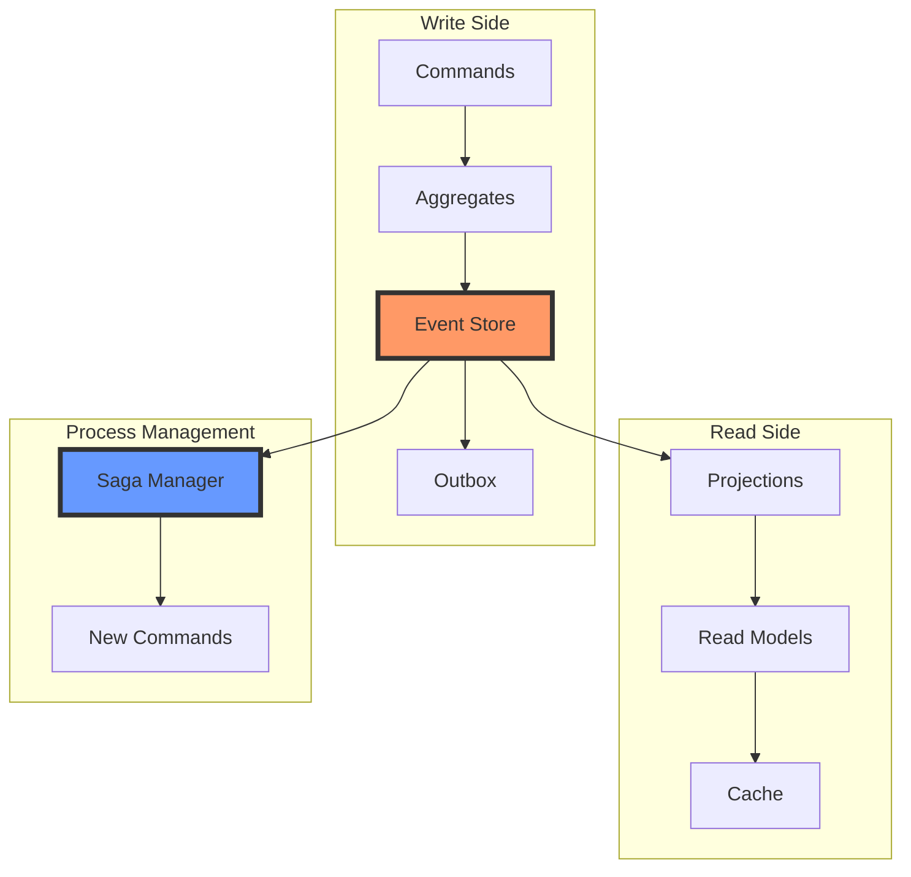
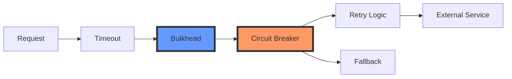
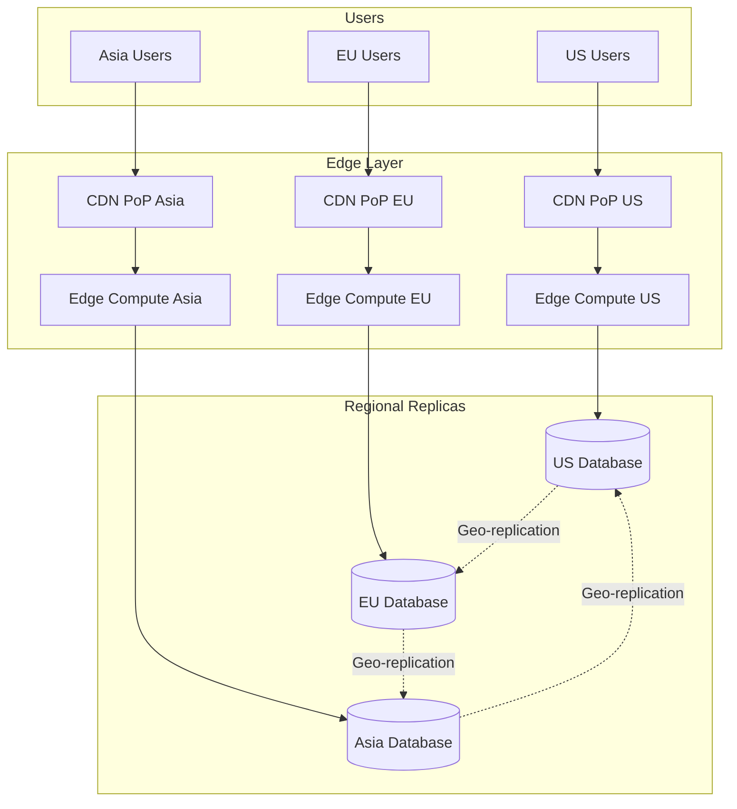
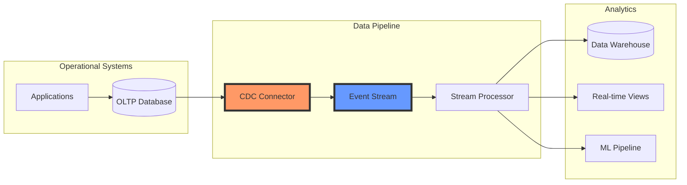
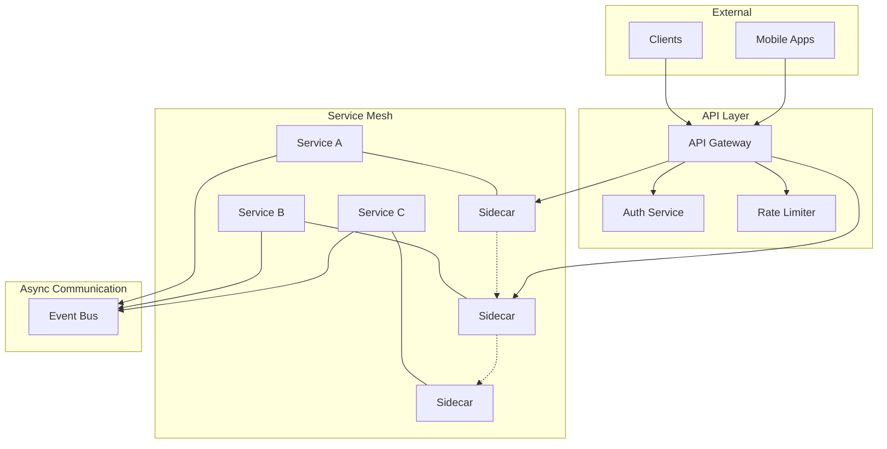

<!-- Navigation -->
[Home](../index.md) → [Part III: Patterns](index.md) → **Pattern Combinations**

# Pattern Combination Guide

> *"Individual patterns are like musical notes. The magic happens when you compose them into a symphony."*

## 🎼 The Art of Pattern Composition

### Why Combine Patterns?

Real systems face multiple challenges simultaneously: Performance AND Reliability, Scale AND Consistency, Cost AND Complexity.

### Three Laws of Pattern Combination

1. **Law of Synergy**: Combined patterns enhance each other's strengths
2. **Law of Simplicity**: Each pattern must justify its complexity
3. **Law of Harmony**: Patterns must not conflict fundamentally

---

## 🏗️ Foundational Combinations

### The Classic Trio: CQRS + Event Sourcing + Saga

The most powerful combination for complex business domains.



**Why This Works:** Event Sourcing provides write model + audit trail • CQRS optimizes reads • Saga manages long-running processes • Each addresses different concerns

**Implementation Example:**

```python
class OrderSystem:
    """E-commerce order system using CQRS + ES + Saga"""
    
    def __init__(self):
        self.event_store = EventStore()
        self.read_store = ReadModelStore()
        self.saga_manager = SagaManager()
        
    async def handle_create_order(self, command: CreateOrderCommand):
        # 1. Command handling (Write side)
        order = Order(command.order_id)
        events = order.create(command.items, command.customer_id)
        
        # 2. Event Sourcing
        await self.event_store.append(order.id, events)
        
        # 3. Update read models (CQRS)
        for event in events:
            await self.read_store.project(event)
        
        # 4. Start saga for order fulfillment
        if isinstance(event, OrderCreatedEvent):
            await self.saga_manager.start_saga(
                OrderFulfillmentSaga(order.id)
            )
```

### The Resilience Stack: Circuit Breaker + Retry + Timeout + Bulkhead

Essential for any system with external dependencies.



**Layered Implementation:**

```python
class ResilientServiceClient:
    """Resilient client with all protection patterns"""
    
    def __init__(self, service_url: str):
        self.service_url = service_url
        
        # Layer 1: Bulkhead (resource isolation)
        self.bulkhead = Bulkhead(
            max_concurrent_calls=100,
            max_wait_duration=timedelta(seconds=1)
        )
        
        # Layer 2: Circuit Breaker (failure detection)
        self.circuit_breaker = CircuitBreaker(
            failure_threshold=5,
            recovery_timeout=timedelta(seconds=30),
            expected_exception=ServiceException
        )
        
        # Layer 3: Retry (transient failure handling)
        self.retry_policy = RetryPolicy(
            max_attempts=3,
            backoff=ExponentialBackoff(base=2, max=10)
        )
        
        # Layer 4: Timeout (latency control)
        self.timeout = timedelta(seconds=5)
    
    @resilient  # Combines all patterns
    async def call_service(self, request: dict) -> dict:
        async with self.bulkhead:
            return await self.circuit_breaker.call(
                lambda: self.retry_policy.execute(
                    lambda: self._make_request_with_timeout(request)
                )
            )
```

---

## 🌍 Global Scale Combinations

### The Geographic Trinity: Geo-Replication + Edge Computing + CDN

For worldwide low-latency access.



**Implementation Strategy:**

```python
class GlobalArchitecture:
    """Global scale with edge + CDN + geo-replication"""
    
    def __init__(self):
        self.regions = {
            'us-east': Region('us-east-1'),
            'eu-west': Region('eu-west-1'),
            'ap-south': Region('ap-south-1')
        }
        
        # Configure geo-replication
        self.setup_geo_replication()
        
        # Deploy edge functions
        self.deploy_edge_compute()
        
        # Configure CDN
        self.setup_cdn()
    
    async def handle_request(self, request: Request) -> Response:
        # 1. CDN handles static content
        if self.is_cacheable(request):
            return await self.cdn.serve(request)
        
        # 2. Edge compute for dynamic but stateless
        if self.is_edge_compatible(request):
            return await self.edge.process(request)
        
        # 3. Route to nearest region for data operations
        region = self.get_nearest_region(request.client_location)
        return await region.handle(request)
```

### The Data Pipeline: CDC + Streaming + CQRS

For real-time analytics and reporting.



---

## 🔄 Event-Driven Combinations

### The Reliable Event Bus: Outbox + Idempotent Receiver + Dead Letter Queue

Guarantees exactly-once processing in distributed systems.

```python
class ReliableEventBus:
    """Reliable event processing with exactly-once semantics"""
    
    def __init__(self):
        self.outbox = TransactionalOutbox()
        self.receiver = IdempotentReceiver()
        self.dlq = DeadLetterQueue()
    
    async def publish_event(self, event: Event, tx: Transaction):
        """Publish with transactional guarantee"""
        # Save to outbox in same transaction
        await self.outbox.save(event, tx)
    
    async def process_event(self, event: Event):
        """Process with idempotency guarantee"""
        try:
            # Check if already processed
            result = await self.receiver.process(
                event.id,
                self._handle_event,
                event
            )
            return result
            
        except Exception as e:
            # Send to DLQ after retries exhausted
            if event.retry_count >= MAX_RETRIES:
                await self.dlq.send(event, error=str(e))
            else:
                # Retry with exponential backoff
                await self.schedule_retry(event)
```

### The Microservices Foundation: Service Mesh + API Gateway + Event Bus

The complete microservices communication layer.



---

## 🎯 Domain-Specific Combinations

### E-Commerce Platform

| Component | Pattern | Purpose |
|-----------|---------|----------|
| Catalog | CQRS | Read-heavy optimization |
| Orders | Event Sourcing | Audit trail |
| Checkout | Saga | Distributed transaction |
| Events | Outbox | Reliable delivery |
| Users | Sharding | Scale data |
| Products | Caching | Performance |
| Payments | Circuit Breaker | Resilience |

### Financial Trading System

| Component | Pattern | Purpose |
|-----------|---------|----------|
| Audit Log | Event Sourcing | Compliance |
| Positions | CQRS | Real-time tracking |
| Order Matching | Leader Election | Determinism |
| Risk Management | Bulkhead | Isolation |
| Market Data | Circuit Breaker | Feed resilience |
| Order Processing | Idempotent Receiver | Exactly-once |

### IoT Platform

| Component | Pattern | Purpose |
|-----------|---------|----------|
| Local Processing | Edge Computing | Reduce latency |
| Telemetry | Event Streaming | High-volume ingestion |
| Storage | Sharded Time-series DB | Scale metrics |
| Device Control | Rate Limiting | Prevent overload |
| Commands | Circuit Breaker | Handle failures |
| Sync | CDC | Data propagation |

---

## ⚠️ Anti-Pattern Combinations

### Dangerous Combinations to Avoid

#### ❌ Synchronous Saga + Two-Phase Commit

```python
# DON'T DO THIS
class BadSaga:
    async def execute_step(self):
        # Saga should be eventually consistent
        # 2PC defeats the purpose
        with TwoPhaseCommit() as tpc:  # ❌ Wrong!
            await service1.update()
            await service2.update()
```

**Why it's bad:**
- Combines disadvantages of both patterns
- Loses saga's failure isolation
- Adds 2PC's availability problems

#### ❌ Caching + Strong Consistency

```python
# DON'T DO THIS
class BadCache:
    async def read(self, key):
        # Can't have cache AND strong consistency
        value = await cache.get(key)  # ❌ Might be stale!
        if not value:
            value = await db.read_with_lock(key)  # Strong consistency
        return value
```

**Why it's bad:**
- Cache inherently serves stale data
- Strong consistency requires fresh reads
- Contradictory requirements

#### ❌ Event Sourcing + Synchronous Projections

```python
# DON'T DO THIS
class BadEventSourcing:
    async def save_event(self, event):
        await event_store.append(event)
        # Synchronous projection defeats ES benefits
        await update_all_read_models(event)  # ❌ Wrong!
        return "success"
```

**Why it's bad:**
- Loses event sourcing's performance benefits
- Creates tight coupling
- Makes system fragile

---

## 🏆 Best Practice Combinations

### The Reliability Sandwich

Layer patterns inside-out:

```python
@bulkhead          # 4. Isolate resources (outermost)
@circuit_breaker   # 3. Prevent cascades
@retry             # 2. Handle transient failures
@timeout(5)        # 1. Fail fast (innermost)
async def call_service(self):
    return await external_service.call()
```

### The Data Consistency Hierarchy

| Data Type | Consistency Pattern | Supporting Pattern |
|-----------|--------------------|-----------------|
| Financial | Strong consistency | Event sourcing |
| User profiles | Session consistency | Caching |
| Analytics | Eventual consistency | CDC |
| Counters | CRDTs | Eventual consistency |

---

## 📈 Evolution Patterns

### Growing from Monolith to Microservices

**Phase 1**: Monolith  
**Phase 2**: Monolith + Cache  
**Phase 3**: Monolith + Queue + Workers  
**Phase 4**: API Gateway + Services  
**Phase 5**: Service Mesh + Event Bus

### Pattern Addition Timeline

| Users | Add Patterns | Why |
|-------|-------------|-----|
| 10K | Caching, CDN | Reduce load |
| 100K | Queue, Workers | Handle peaks |
| 1M | CQRS, Sharding | Scale R/W |
| 10M | Service Mesh, Event Sourcing | Manage complexity |
| 100M | Edge Computing, Geo-replication | Global scale |

---

## 🔧 Implementation Strategies

### The Strangler Fig Pattern

Gradually replace monolith with pattern-based architecture:

```python
class StranglerFigMigration:
    """Gradually migrate to new patterns"""
    
    def __init__(self, legacy_system, new_system):
        self.legacy = legacy_system
        self.new = new_system
        self.router = TrafficRouter()
    
    async def handle_request(self, request):
        # Route based on migration progress
        if self.is_migrated(request.feature):
            return await self.new.handle(request)
        else:
            # Still use legacy
            response = await self.legacy.handle(request)
            
            # But capture events for new system
            await self.capture_legacy_events(request, response)
            
            return response
    
    def migrate_feature(self, feature: str):
        """Gradually move traffic to new system"""
        for percentage in [5, 25, 50, 90, 100]:
            self.router.set_split(feature, new=percentage)
            self.monitor_metrics()
            if not self.is_healthy():
                self.router.rollback(feature)
                break
            time.sleep(hours=24)
```

---

## 📊 Combination Metrics

### Measuring Pattern Effectiveness

Key metrics for pattern combinations:

```python
class PatternCombinationMetrics:
    """Track effectiveness of pattern combinations"""
    
    def __init__(self):
        self.metrics = {
            # Reliability combination metrics
            'circuit_breaker_opens': Counter(),
            'retry_success_rate': Gauge(),
            'bulkhead_rejections': Counter(),
            
            # Performance combination metrics
            'cache_hit_rate': Gauge(),
            'cqrs_lag': Histogram(),
            'event_processing_time': Histogram(),
            
            # Scale combination metrics
            'shard_distribution': Gauge(),
            'cross_region_latency': Histogram(),
            'edge_cache_hits': Counter()
        }
    
    def calculate_combination_effectiveness(self):
        """Measure how well patterns work together"""
        
        # Resilience score (CB + Retry + Bulkhead)
        resilience = (
            self.get_availability() * 0.4 +
            self.get_recovery_time() * 0.3 +
            self.get_isolation_effectiveness() * 0.3
        )
        
        # Performance score (CQRS + Cache + CDN)
        performance = (
            self.get_response_time_improvement() * 0.5 +
            self.get_throughput_increase() * 0.5
        )
        
        return {
            'resilience_score': resilience,
            'performance_score': performance,
            'overall_health': (resilience + performance) / 2
        }
```

---

## 🎓 Key Takeaways

### Golden Rules

1. **Start Simple** - One pattern, add as needed
2. **Measure Everything** - Validate combinations help
3. **Respect Dependencies** - Some patterns require others
4. **Avoid Conflicts** - Don't mix opposing goals
5. **Plan Evolution** - Design for gradual adoption

### Ultimate Combinations

- **Reliability**: Circuit Breaker + Retry + Timeout + Bulkhead
- **Performance**: CQRS + Caching + CDN + Edge Computing  
- **Scale**: Sharding + Service Mesh + Event Streaming
- **Consistency**: Event Sourcing + Saga + Outbox + Idempotent Receiver

---

*"Great architecture is not about using all the patterns, but about using the right patterns together."*

---

**Previous**: [← Pattern Selector](pattern-selector.md) | **Next**: [Pattern Index →](index.md)