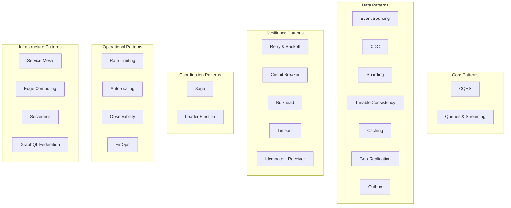
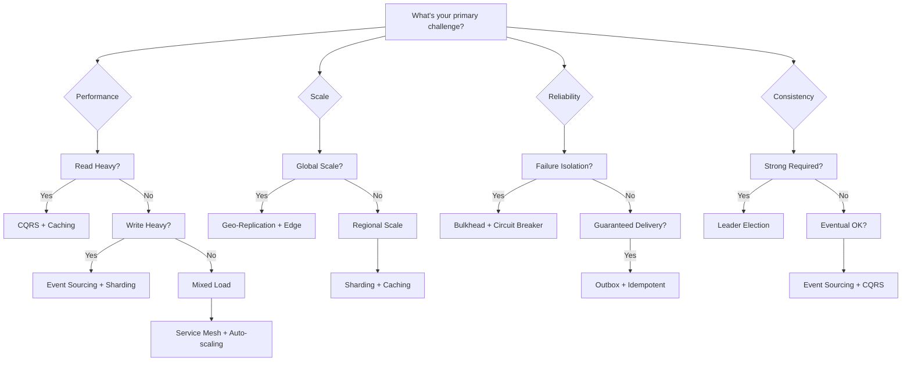
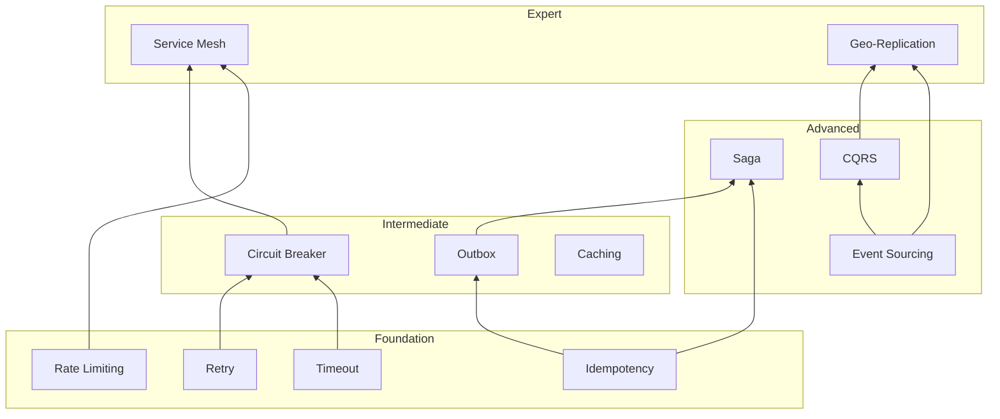

<!-- Navigation -->
[Home](../index.md) → [Part III: Patterns](index.md) → **Pattern Comparison**

# Pattern Comparison Guide

**Finding the right pattern for your problem - A comprehensive comparison matrix**

> *"The art of architecture is not knowing all patterns, but knowing which pattern fits where."*

---

## 🎯 Pattern Categories Overview

### Quick Category Guide



---

## 📊 Master Comparison Matrix

### Pattern Selection by Problem Domain

| Problem | Primary Pattern | Supporting Patterns | Why This Combination |
|---------|----------------|---------------------|---------------------|
| **High read/write ratio** | CQRS | Event Sourcing, Caching | Separate read/write paths optimize for different access patterns |
| **Global data distribution** | Geo-Replication | CDN, Edge Computing | Minimize latency by placing data near users |
| **Microservice communication** | Service Mesh | Circuit Breaker, Retry | Centralized communication management with resilience |
| **Complex business transactions** | Saga | Outbox, Idempotent Receiver | Distributed transactions with guaranteed delivery |
| **Real-time analytics** | Event Streaming | CDC, CQRS | Capture changes and process in real-time |
| **Cost optimization** | FinOps | Auto-scaling, Serverless | Monitor and optimize cloud spending |
| **High availability** | Bulkhead | Circuit Breaker, Timeout | Isolate failures and prevent cascades |
| **Data consistency** | Tunable Consistency | Leader Election, Saga | Balance consistency with performance |
| **API management** | GraphQL Federation | Rate Limiting, Caching | Unified API with performance controls |
| **Event-driven architecture** | Event Sourcing | Outbox, CDC | Complete event history with reliable delivery |

---

## 🔄 Pattern Interaction Matrix

### How Patterns Work Together

```
Legend: 
✅ Excellent combination
🟡 Good combination
⚠️ Possible but complex
❌ Not recommended
```

| Pattern | CQRS | Event Sourcing | Saga | Service Mesh | Caching | Sharding | Rate Limiting |
|---------|------|----------------|------|--------------|---------|-----------|---------------|
| **CQRS** | - | ✅ | 🟡 | 🟡 | ✅ | ✅ | 🟡 |
| **Event Sourcing** | ✅ | - | ✅ | 🟡 | ⚠️ | 🟡 | 🟡 |
| **Saga** | 🟡 | ✅ | - | 🟡 | ⚠️ | 🟡 | 🟡 |
| **Service Mesh** | 🟡 | 🟡 | 🟡 | - | 🟡 | 🟡 | ✅ |
| **Caching** | ✅ | ⚠️ | ⚠️ | 🟡 | - | ✅ | 🟡 |
| **Sharding** | ✅ | 🟡 | 🟡 | 🟡 | ✅ | - | 🟡 |
| **Rate Limiting** | 🟡 | 🟡 | 🟡 | ✅ | 🟡 | 🟡 | - |

### Synergy Explanations

#### ✅ Excellent Combinations

**CQRS + Event Sourcing**
- Event Sourcing provides the write model
- CQRS creates optimized read models from events
- Natural fit for audit trails and temporal queries

**Saga + Event Sourcing**
- Each saga step creates events
- Event log provides complete transaction history
- Easy compensation with event reversal

**Service Mesh + Rate Limiting**
- Mesh provides centralized rate limiting
- No code changes needed in services
- Consistent policy enforcement

#### 🟡 Good Combinations

**CQRS + Sharding**
- Shard write model by aggregate
- Read models can be sharded differently
- Optimize for different access patterns

**Caching + Sharding**
- Cache frequently accessed shards locally
- Reduce cross-shard queries
- Improve read performance

#### ⚠️ Complex Combinations

**Event Sourcing + Caching**
- Events are immutable, good for caching
- But cache invalidation is complex
- Need careful versioning strategy

**Saga + Caching**
- Cached data might be stale during saga
- Can cause incorrect decisions
- Need to bypass cache for saga operations

---

## 🎚️ Pattern Trade-off Analysis

### Performance vs Complexity

```
High Performance ←──────────────→ High Complexity

Simple                                          Complex
├─ Caching                                      GraphQL Federation ─┤
├─ Rate Limiting                                Service Mesh ─────┤
├─── Timeout                                    Event Sourcing ───┤
├──── Retry & Backoff                          Saga ─────────────┤
├────── Circuit Breaker                        CQRS ─────────────┤
└──────── Bulkhead                             Geo-Replication ──┘
```

### Consistency vs Availability

| Pattern | Consistency | Availability | Use When |
|---------|-------------|--------------|----------|
| **Strong Consistency Patterns** |||
| Leader Election | ⭐⭐⭐⭐⭐ | ⭐⭐ | Need single source of truth |
| Two-Phase Commit | ⭐⭐⭐⭐⭐ | ⭐ | ACID transactions required |
| **Balanced Patterns** |||
| Tunable Consistency | ⭐⭐⭐ to ⭐⭐⭐⭐⭐ | ⭐⭐⭐ to ⭐⭐⭐⭐⭐ | Different operations need different guarantees |
| Saga | ⭐⭐⭐⭐ | ⭐⭐⭐⭐ | Long-running transactions |
| **High Availability Patterns** |||
| Event Sourcing | ⭐⭐⭐ | ⭐⭐⭐⭐⭐ | Can replay events |
| CQRS | ⭐⭐⭐ | ⭐⭐⭐⭐⭐ | Read replicas everywhere |
| Geo-Replication | ⭐⭐ | ⭐⭐⭐⭐⭐ | Global availability |

---

## 🔍 Pattern Selection Decision Tree

### Start Here: What's Your Primary Challenge?



---

## 💰 Cost Comparison

### Pattern Implementation & Operational Costs

| Pattern | Implementation Cost | Operational Cost | Hidden Costs | ROI Timeline |
|---------|-------------------|------------------|--------------|--------------|
| **Low Cost Patterns** ||||
| Timeout | 👷 | 💵 | None | Immediate |
| Retry & Backoff | 👷 | 💵 | Increased load | 1 week |
| Rate Limiting | 👷👷 | 💵 | Rejected requests | 2 weeks |
| **Medium Cost Patterns** ||||
| Caching | 👷👷 | 💵💵 | Cache invalidation complexity | 1 month |
| Circuit Breaker | 👷👷 | 💵 | False positives | 1 month |
| CQRS | 👷👷👷 | 💵💵 | Eventual consistency | 3 months |
| **High Cost Patterns** ||||
| Event Sourcing | 👷👷👷👷 | 💵💵💵 | Storage growth | 6 months |
| Service Mesh | 👷👷👷👷 | 💵💵💵 | Operational complexity | 6 months |
| Geo-Replication | 👷👷👷👷👷 | 💵💵💵💵 | Network costs | 12 months |

*Legend: 👷 = Developer effort, 💵 = Infrastructure cost*

---

## 🎯 Pattern Capability Matrix

### What Each Pattern Provides

| Capability | Pattern(s) | Strength | Limitation |
|------------|-----------|----------|------------|
| **Scalability** |||
| Horizontal scaling | Sharding, Serverless | ⭐⭐⭐⭐⭐ | Complexity |
| Auto-scaling | Auto-scaling, Serverless | ⭐⭐⭐⭐ | Cold starts |
| Global scale | Geo-Replication, Edge | ⭐⭐⭐⭐⭐ | Consistency |
| **Performance** |||
| Read optimization | CQRS, Caching | ⭐⭐⭐⭐⭐ | Write complexity |
| Write optimization | Event Sourcing, Outbox | ⭐⭐⭐⭐ | Read complexity |
| Latency reduction | Edge, Caching, CDN | ⭐⭐⭐⭐⭐ | Cache invalidation |
| **Reliability** |||
| Failure isolation | Bulkhead, Circuit Breaker | ⭐⭐⭐⭐⭐ | Resource overhead |
| Guaranteed delivery | Outbox, Idempotent | ⭐⭐⭐⭐⭐ | Latency |
| Graceful degradation | Circuit Breaker, Timeout | ⭐⭐⭐⭐ | User experience |
| **Consistency** |||
| Strong consistency | Leader Election | ⭐⭐⭐⭐⭐ | Availability |
| Eventual consistency | Event Sourcing, CQRS | ⭐⭐⭐ | Complexity |
| Tunable consistency | Tunable Consistency | ⭐⭐⭐⭐ | Configuration |

---

## 🔗 Pattern Dependencies

### Prerequisites and Building Blocks



---

## 📈 Pattern Maturity Model

### Evolution Path for Organizations

| Stage | Patterns to Adopt | Key Capabilities | Next Steps |
|-------|-------------------|------------------|------------|
| **1. Foundation** | Timeout, Retry, Rate Limiting | Basic resilience | Add monitoring |
| **2. Resilience** | Circuit Breaker, Bulkhead | Failure isolation | Add caching |
| **3. Performance** | Caching, CQRS, Sharding | Scale reads | Event-driven |
| **4. Distribution** | Event Sourcing, Saga, Outbox | Async operations | Global scale |
| **5. Global Scale** | Geo-Replication, Edge, CDN | Worldwide presence | Service mesh |
| **6. Platform** | Service Mesh, Serverless | Self-service | AI/ML optimization |

---

## 🎓 Learning Path Recommendations

### By Role and Experience

#### For Backend Engineers
1. Start: Retry & Backoff → Circuit Breaker → Bulkhead
2. Intermediate: CQRS → Event Sourcing → Saga
3. Advanced: Service Mesh → Geo-Replication

#### For Architects
1. Start: Pattern Interaction Matrix → Trade-off Analysis
2. Intermediate: CQRS + Event Sourcing → Saga Patterns
3. Advanced: Service Mesh → Multi-Region Architecture

#### For SREs/DevOps
1. Start: Timeout → Rate Limiting → Circuit Breaker
2. Intermediate: Service Mesh → Observability
3. Advanced: Chaos Engineering with Patterns

---

## 🚀 Real-World Pattern Combinations

### Proven Architectures

#### E-commerce Platform
```
Frontend → API Gateway (Rate Limiting)
         → Service Mesh
         → Microservices:
           - Product Service (CQRS + Caching)
           - Order Service (Saga + Outbox)
           - Payment Service (Idempotent Receiver)
           - Inventory Service (Event Sourcing + CDC)
         → Databases (Sharded + Geo-Replicated)
```

#### Social Media Platform
```
Mobile Apps → Edge Computing (Caching)
           → GraphQL Federation
           → Services:
             - Feed Service (CQRS + Event Streaming)
             - User Service (Caching + Sharding)
             - Messaging (Pub/Sub + Idempotent)
             - Media (CDN + Serverless processing)
```

#### Financial Services
```
Trading Apps → API Gateway (Rate Limiting + Auth)
            → Service Mesh (mTLS + Circuit Breaker)
            → Core Services:
              - Trading Engine (Event Sourcing + Outbox)
              - Risk Management (CQRS + Real-time)
              - Settlement (Saga + Strong Consistency)
              - Reporting (CDC + Data Lake)
```

---

## 📊 Quick Reference Cards

### Pattern Selection Cheat Sheet

| If You Need... | Consider These Patterns | Avoid These |
|----------------|------------------------|-------------|
| **High read throughput** | CQRS, Caching, CDN | Synchronous writes |
| **High write throughput** | Event Sourcing, Sharding, Async | Strong consistency |
| **Global low latency** | Edge Computing, Geo-Replication | Single region |
| **Cost optimization** | Serverless, Auto-scaling, FinOps | Over-provisioning |
| **Strong consistency** | Leader Election, Sync replication | Eventually consistent |
| **Resilience** | Circuit Breaker, Bulkhead, Retry | Single points of failure |
| **Flexibility** | Event-driven, Microservices | Tight coupling |

---

*"Choose patterns not by their popularity, but by how well they solve your specific problems."*

---

**Previous**: [← FinOps Pattern](finops.md) | **Next**: [Pattern Selection Tool →](pattern-selector.md)