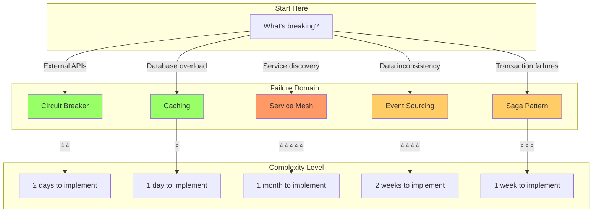
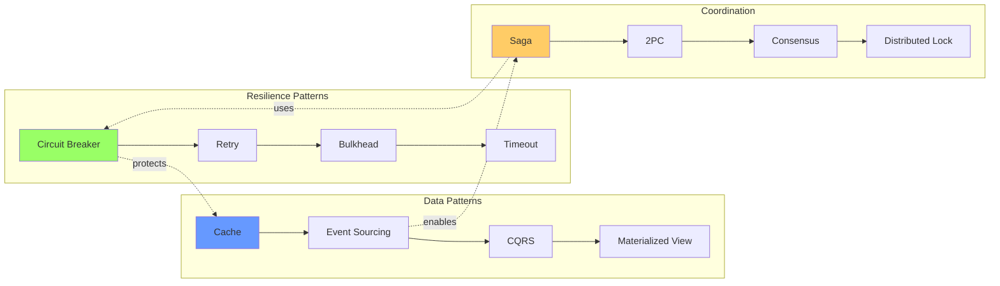
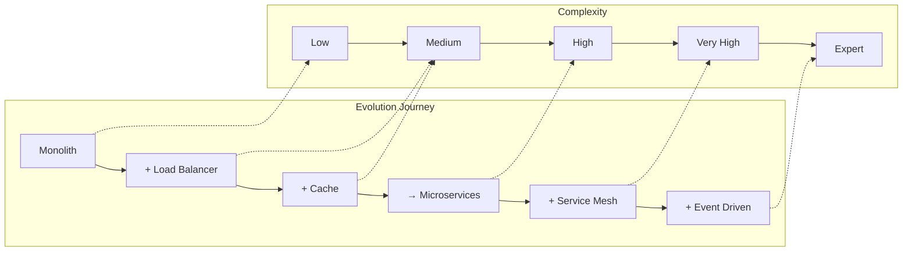

# Pattern Selection Matrix

!!! abstract "Quick Decision Framework"
    🎯 **Find your pattern in 10 seconds using our visual matrices**

## Master Pattern Matrix



## Pattern Decision Table

| Your Problem | Best Pattern | Complexity | Time to Value | When NOT to Use |
|--------------|--------------|------------|---------------|-----------------|
| **External service failing** | Circuit Breaker | ⭐⭐ | 1 day | Internal method calls |
| **Database overloaded** | Cache-Aside | ⭐ | 4 hours | Write-heavy (>50%) |
| **Distributed transactions** | Saga | ⭐⭐⭐ | 1 week | Can use single DB |
| **Need audit trail** | Event Sourcing | ⭐⭐⭐⭐ | 2 weeks | Simple CRUD |
| **Service discovery chaos** | Service Mesh | ⭐⭐⭐⭐⭐ | 1 month | <10 services |
| **Inconsistent reads** | CQRS | ⭐⭐⭐ | 1 week | Simple domain |
| **Traffic spikes** | Rate Limiting | ⭐⭐ | 1 day | Internal services |
| **Cascading failures** | Bulkhead | ⭐⭐ | 2 days | Single service |

## Visual Pattern Relationships



## Pattern Compatibility Matrix

| Pattern A | Pattern B | Compatibility | Why |
|-----------|-----------|---------------|-----|
| Circuit Breaker | Retry | ✅ Excellent | CB prevents retry storms |
| Cache | Event Sourcing | ✅ Good | ES can populate cache |
| Saga | 2PC | ❌ Avoid | Conflicting approaches |
| Service Mesh | API Gateway | ⚠️ Overlap | Redundant features |
| CQRS | Cache | ✅ Excellent | Natural fit |
| Rate Limiting | Circuit Breaker | ✅ Excellent | Defense in depth |

## Implementation Effort vs Impact

```mermaid
scatter
    title "Pattern ROI Analysis"
    x-axis "Implementation Days" [0, 30]
    y-axis "Impact Score" [0, 10]
    
    "Cache-Aside": [1, 8]
    "Circuit Breaker": [2, 9]
    "Retry Logic": [0.5, 6]
    "Rate Limiting": [1, 7]
    "Saga": [7, 7]
    "Event Sourcing": [14, 8]
    "Service Mesh": [30, 9]
    "CQRS": [7, 6]
```

## Quick Decision Rules

### 🚀 Start With These (Easy Wins)
1. **Circuit Breaker** - Always add to external calls
2. **Cache-Aside** - If read/write ratio > 10:1
3. **Retry with Backoff** - For transient failures
4. **Health Checks** - Basic but critical

### ⚠️ Think Twice Before These
1. **Service Mesh** - Massive operational overhead
2. **Event Sourcing** - Complex queries, storage cost
3. **2PC** - Usually wrong choice
4. **Blockchain** - Almost never the answer

### 🎯 Pattern Combinations That Work
- **The Reliability Stack**: Circuit Breaker + Retry + Timeout + Bulkhead
- **The Performance Stack**: Cache + CDN + Load Balancer + Sharding
- **The Consistency Stack**: Event Sourcing + CQRS + Saga
- **The Scale Stack**: Service Mesh + API Gateway + Message Queue

## Migration Paths



## Pattern Anti-Patterns

| Anti-Pattern | Why It's Bad | What to Do Instead |
|--------------|--------------|-------------------|
| **Distributed Monolith** | Complexity without benefits | True service boundaries |
| **Sync Everything** | Cascading failures | Async where possible |
| **No Circuit Breakers** | One service kills all | Always protect calls |
| **Cache Everything** | Stale data, complexity | Cache strategically |
| **Over-engineering** | Months to deliver | Start simple, evolve |

## Next Steps

1. **Identify your bottleneck** using the problem column
2. **Check complexity** against your team's skills
3. **Estimate effort** using the time column
4. **Start simple** with easy wins
5. **Evolve gradually** following migration paths

---

[← Back to Patterns](/patterns/) | [Pattern Details →](/patterns/circuit-breaker/)