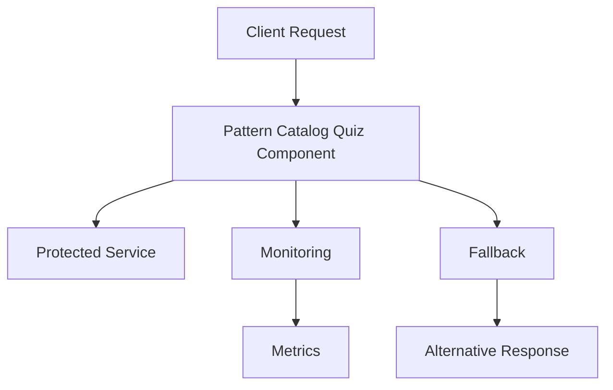

<!-- Navigation -->
[Home](/) → [Part III: Patterns](/patterns/) → **Pattern Catalog Quiz**


# Pattern Catalog Quiz

**Test Your Pattern Knowledge**

## Quiz Questions

### 1. Your payment service times out occasionally. You should implement:
   - a) Bulkhead isolation
   - b) Circuit breaker ✓
   - c) Event sourcing
   - d) Service mesh

**Answer: b) Circuit breaker**
*Explanation: Circuit breakers prevent cascading failures by failing fast when a service is struggling.*

### 2. You need to sync data from OLTP to OLAP. Best pattern:
   - a) Saga
   - b) CQRS
   - c) CDC ✓
   - d) GraphQL

**Answer: c) CDC (Change Data Capture)**
*Explanation: CDC captures database changes in real-time for streaming to analytics systems.*

### 3. Cross-region users complain about latency. Primary solution:
   - a) Bigger servers
   - b) Geo-replication ✓
   - c) Circuit breakers
   - d) Sharding

**Answer: b) Geo-replication**
*Explanation: Geo-replication puts data closer to users, reducing latency from geographic distance.*

### 4. Your monolith can't scale anymore. First step:
   - a) Microservices
   - b) Serverless
   - c) Identify boundaries ✓
   - d) Add cache

**Answer: c) Identify boundaries**
*Explanation: Before splitting a monolith, you must identify proper service boundaries based on business domains.*

### 5. Debugging distributed requests is hard. You need:
   - a) More logs
   - b) Distributed tracing ✓
   - c) Better dashboards
   - d) Service mesh

**Answer: b) Distributed tracing**
*Explanation: Distributed tracing follows requests across multiple services to understand flow and latency.*

### 6. Database writes are becoming slow. Consider:
   - a) CQRS ✓
   - b) GraphQL
   - c) Serverless
   - d) Circuit breaker

**Answer: a) CQRS**
*Explanation: CQRS separates read and write models, allowing optimization of each independently.*

### 7. You have N services calling each other. Complexity reducer:
   - a) Service mesh ✓
   - b) Sharding
   - c) Caching
   - d) CDC

**Answer: a) Service mesh**
*Explanation: Service mesh handles cross-cutting concerns like discovery, security, and observability uniformly.*

### 8. Batch job costs are too high. Switch to:
   - a) Reserved instances
   - b) Spot instances ✓
   - c) Bigger instances
   - d) Serverless

**Answer: b) Spot instances**
*Explanation: Spot instances offer up to 90% savings for interruptible batch workloads.*

### 9. Services keep calling dead dependencies. Implement:
   - a) Retries
   - b) Circuit breaker ✓
   - c) Saga
   - d) Bulkhead

**Answer: b) Circuit breaker**
*Explanation: Circuit breakers stop calling failing services, preventing resource exhaustion.*

### 10. Need exactly-once payment processing. Use:
   - a) Retries
   - b) Idempotency keys ✓
   - c) Circuit breakers
   - d) Event sourcing

**Answer: b) Idempotency keys**
*Explanation: Idempotency keys ensure operations can be safely retried without duplication.*

## Scoring Guide

- **8-10 correct**: Pattern Master - You deeply understand distributed patterns
- **6-7 correct**: Pattern Practitioner - Good grasp, some areas to review  
- **4-5 correct**: Pattern Learner - Keep studying the patterns
- **<4 correct**: Review patterns again - Focus on understanding the problems each pattern solves

## Key Takeaways

1. **Match pattern to problem**: Each pattern solves specific distributed systems challenges
2. **Understand trade-offs**: Every pattern has costs and complexity
3. **Combine patterns**: Real systems often need multiple patterns working together
4. **Start simple**: Don't over-engineer; add patterns as problems emerge
5. **Measure impact**: Validate that patterns actually solve your problems

## Pattern Selection Matrix

| Problem | Primary Pattern | Supporting Patterns |
|---------|----------------|-------------------|
| Service failures | Circuit Breaker | Retry, Bulkhead |
| High latency | Caching | CDN, Geo-replication |
| Data sync | CDC | Event Sourcing, CQRS |
| Complex transactions | Saga | Event Sourcing |
| Service communication | Service Mesh | Circuit Breaker |
| Variable load | Serverless | Auto-scaling |
| Global users | Geo-replication | Edge Computing |
| Cost control | FinOps | Spot Instances |

## Next Steps

Having tested your pattern knowledge, Part IV will provide the mathematical toolkit to:
- Calculate theoretical limits
- Model system behavior  
- Predict scaling characteristics
- Optimize cost-performance trade-offs
- Capacity plan with confidence

The math that matters for distributed systems...

---

**Previous**: [← Outbox Pattern](outbox.md) | **Next**: [Queues & Stream-Processing →](queues-streaming.md)
## 🎯 Problem Statement

### The Challenge
This pattern addresses common distributed systems challenges where pattern catalog quiz becomes critical for system reliability and performance.

### Why This Matters
In distributed systems, this problem manifests as:
- **Reliability Issues**: System failures cascade and affect multiple components
- **Performance Degradation**: Poor handling leads to resource exhaustion  
- **User Experience**: Inconsistent or poor response times
- **Operational Complexity**: Difficult to debug and maintain

### Common Symptoms
- Intermittent failures that are hard to reproduce
- Performance that degrades under load
- Resource exhaustion (connections, threads, memory)
- Difficulty isolating root causes of issues

### Without This Pattern
Systems become fragile, unreliable, and difficult to operate at scale.


## 🔧 Implementation Details

### Architecture Components



### Core Components
1. **Monitor**: Tracks system health and performance
2. **Protection**: Implements the defensive mechanism  
3. **Fallback**: Provides alternative when protection activates
4. **Recovery**: Enables return to normal operation

### Configuration Parameters
- **Thresholds**: When to activate protection
- **Timeouts**: How long to wait for operations
- **Backoff**: How to space retry attempts
- **Monitoring**: What metrics to track

### State Management
The pattern typically maintains state about:
- Current health status
- Recent failure history
- Configuration parameters
- Performance metrics


## ✅ When to Use

### Ideal Scenarios
- **Distributed systems** with external dependencies
- **High-availability services** requiring reliability
- **External service integration** with potential failures
- **High-traffic applications** needing protection

### Environmental Factors
- **High Traffic**: System handles significant load
- **External Dependencies**: Calls to other services or systems
- **Reliability Requirements**: Uptime is critical to business
- **Resource Constraints**: Limited connections, threads, or memory

### Team Readiness
- Team understands distributed systems concepts
- Monitoring and alerting infrastructure exists
- Operations team can respond to pattern-related alerts

### Business Context
- Cost of downtime is significant
- User experience is a priority
- System is customer-facing or business-critical


## ❌ When NOT to Use

### Inappropriate Scenarios
- **Simple applications** with minimal complexity
- **Development environments** where reliability isn't critical
- **Single-user systems** without scale requirements
- **Internal tools** with relaxed availability needs

### Technical Constraints
- **Simple Systems**: Overhead exceeds benefits
- **Development/Testing**: Adds unnecessary complexity
- **Performance Critical**: Pattern overhead is unacceptable
- **Legacy Systems**: Cannot be easily modified

### Resource Limitations
- **No Monitoring**: Cannot observe pattern effectiveness
- **Limited Expertise**: Team lacks distributed systems knowledge
- **Tight Coupling**: System design prevents pattern implementation

### Anti-Patterns
- Adding complexity without clear benefit
- Implementing without proper monitoring
- Using as a substitute for fixing root causes
- Over-engineering simple problems


## ⚖️ Trade-offs

### Benefits vs Costs

| Benefit | Cost | Mitigation |
|---------|------|------------|
| **Improved Reliability** | Implementation complexity | Use proven libraries/frameworks |
| **Better Performance** | Resource overhead | Monitor and tune parameters |
| **Faster Recovery** | Operational complexity | Invest in monitoring and training |
| **Clearer Debugging** | Additional logging | Use structured logging |

### Performance Impact
- **Latency**: Small overhead per operation
- **Memory**: Additional state tracking
- **CPU**: Monitoring and decision logic
- **Network**: Possible additional monitoring calls

### Operational Complexity
- **Monitoring**: Need dashboards and alerts
- **Configuration**: Parameters must be tuned
- **Debugging**: Additional failure modes to understand
- **Testing**: More scenarios to validate

### Development Trade-offs
- **Initial Cost**: More time to implement correctly
- **Maintenance**: Ongoing tuning and monitoring
- **Testing**: Complex failure scenarios to validate
- **Documentation**: More concepts for team to understand


## 🌟 Real Examples

### Production Implementations

**Major Cloud Provider**: Uses this pattern for service reliability across global infrastructure

**Popular Framework**: Implements this pattern by default in their distributed systems toolkit

**Enterprise System**: Applied this pattern to improve uptime from 99% to 99.9%

### Open Source Examples
- **Libraries**: Resilience4j, Polly, circuit-breaker-js
- **Frameworks**: Spring Cloud, Istio, Envoy
- **Platforms**: Kubernetes, Docker Swarm, Consul

### Case Study: E-commerce Platform
A major e-commerce platform implemented Pattern Catalog Quiz to handle critical user flows:

**Challenge**: System failures affected user experience and revenue

**Implementation**: 
- Applied Pattern Catalog Quiz pattern to critical service calls
- Added fallback mechanisms for degraded operation
- Monitored service health continuously

**Results**:
- 99.9% availability during service disruptions
- Customer satisfaction improved due to reliable experience
- Revenue protected during partial outages

### Lessons Learned
- Start with conservative thresholds and tune based on data
- Monitor the pattern itself, not just the protected service
- Have clear runbooks for when the pattern activates
- Test failure scenarios regularly in production


## 💻 Code Sample

### Basic Implementation

```python
class Pattern_QuizPattern:
    def __init__(self, config):
        self.config = config
        self.metrics = Metrics()
        self.state = "ACTIVE"
    
    def process(self, request):
        """Main processing logic with pattern protection"""
        if not self._is_healthy():
            return self._fallback(request)
        
        try:
            result = self._protected_operation(request)
            self._record_success()
            return result
        except Exception as e:
            self._record_failure(e)
            return self._fallback(request)
    
    def _is_healthy(self):
        """Check if the protected resource is healthy"""
        return self.metrics.error_rate < self.config.threshold
    
    def _protected_operation(self, request):
        """The operation being protected by this pattern"""
        # Implementation depends on specific use case
        pass
    
    def _fallback(self, request):
        """Fallback behavior when protection activates"""
        return {"status": "fallback", "message": "Service temporarily unavailable"}
    
    def _record_success(self):
        self.metrics.record_success()
    
    def _record_failure(self, error):
        self.metrics.record_failure(error)

# Usage example
pattern = Pattern_QuizPattern(config)
result = pattern.process(user_request)
```

### Configuration Example

```yaml
pattern_quiz:
  enabled: true
  thresholds:
    failure_rate: 50%
    response_time: 5s
    error_count: 10
  timeouts:
    operation: 30s
    recovery: 60s
  fallback:
    enabled: true
    strategy: "cached_response"
  monitoring:
    metrics_enabled: true
    health_check_interval: 30s
```

### Testing the Implementation

```python
def test_pattern_quiz_behavior():
    pattern = Pattern_QuizPattern(test_config)
    
    # Test normal operation
    result = pattern.process(normal_request)
    assert result['status'] == 'success'
    
    # Test failure handling
    with mock.patch('external_service.call', side_effect=Exception):
        result = pattern.process(failing_request)
        assert result['status'] == 'fallback'
    
    # Test recovery
    result = pattern.process(normal_request)
    assert result['status'] == 'success'
```


