# Pattern Relationship Map

**Navigate the interconnected world of distributed systems patterns**

## Core Pattern Clusters

<h3>🎯 Pattern Ecosystems</h3>

Patterns rarely exist in isolation. Understanding their relationships is key to building robust distributed systems.

### Foundation Layer Patterns

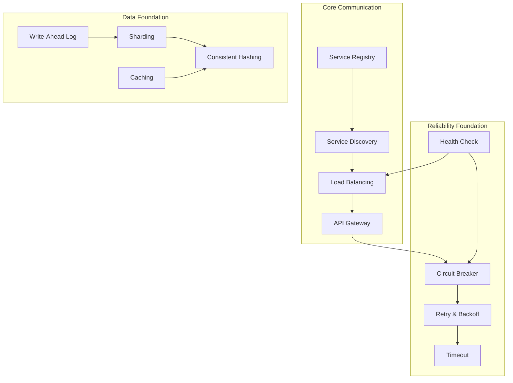

## Pattern Dependencies

### Resilience Chain

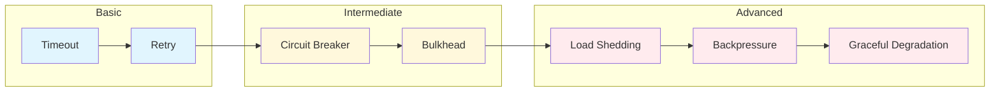

### Data Consistency Evolution

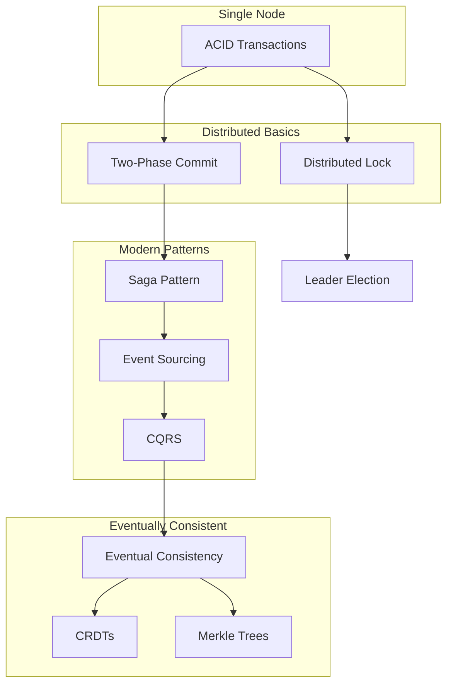

## Common Pattern Combinations

### For High-Traffic APIs

| Pattern Set | Purpose | Scale |
|------------|---------|-------|
| API Gateway + Load Balancing + Circuit Breaker | Entry point resilience | Medium-Large |
| + Rate Limiting + Caching | Traffic control | Large |
| + Service Mesh + Observability | Complete management | Very Large |

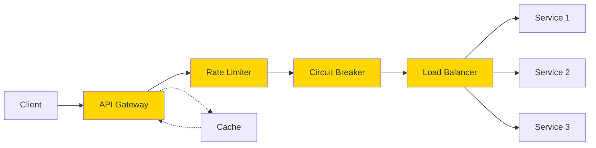

### For Distributed Transactions

| Pattern Set | Purpose | Use Case |
|------------|---------|----------|
| Saga + Event Sourcing + Outbox | Distributed transactions | E-commerce orders |
| + Idempotency + Retry | Reliability | Payment processing |
| + CQRS + Materialized Views | Read optimization | Complex queries |

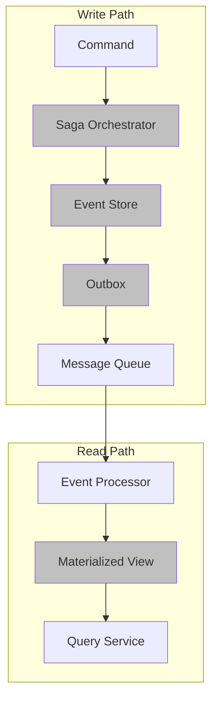

### For Real-Time Systems

| Pattern Set | Purpose | Examples |
|------------|---------|----------|
| WebSocket + Pub-Sub + Event Streaming | Real-time updates | Chat, Live sports |
| + Backpressure + Circuit Breaker | Flow control | Video streaming |
| + Edge Computing + CDN | Low latency | Gaming |

## Anti-Pattern Combinations

<h3>⚠️ Dangerous Combinations</h3>

Some patterns conflict and should not be used together:

| Don't Combine | Why | Alternative |
|---------------|-----|-------------|
| Distributed Lock + Event Sourcing | Locks block event flow | Use Saga pattern |
| 2PC + Microservices | Tight coupling | Use Saga or eventual consistency |
| Synchronous Chain + Auto-scaling | Cascade failures | Use async messaging |
| Strong Consistency + Geo-distribution | Physics limits | Use eventual consistency |

## Evolution Paths

### Scaling Journey

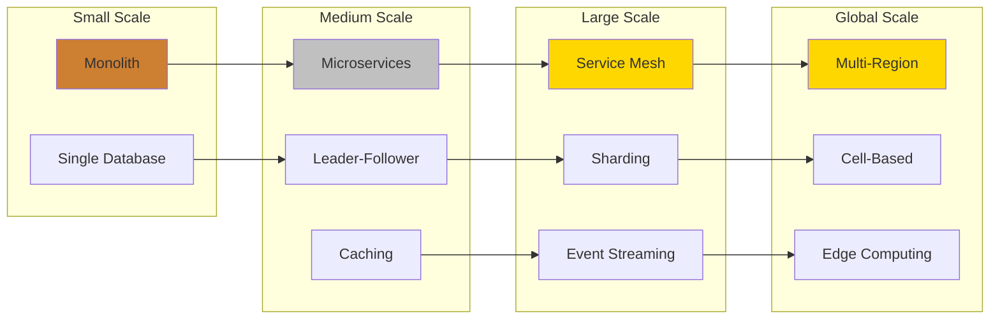

### Consistency Evolution

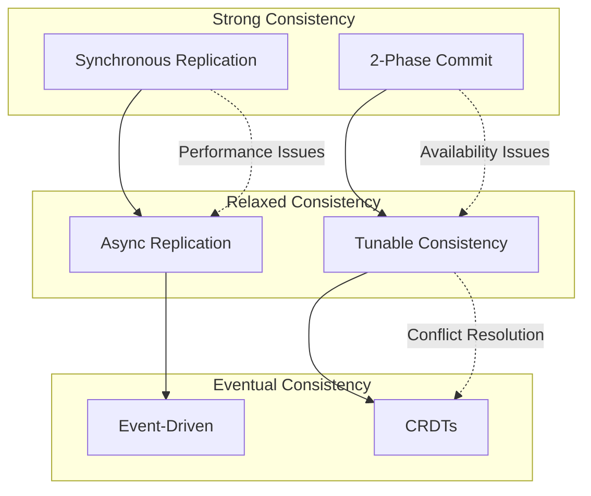

## Domain-Specific Combinations

### E-Commerce Platform

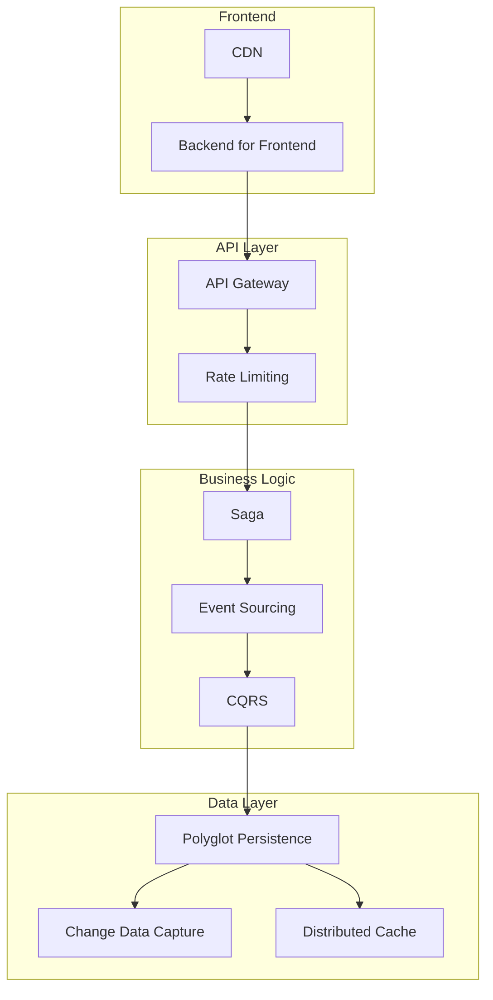

### Real-Time Analytics

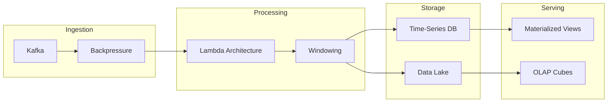

## Quick Reference Tables

### "If Using X, Consider Y"

| If Using | Also Consider | Why |
|----------|---------------|-----|
| Circuit Breaker | Retry + Backoff | Handle transient failures |
| API Gateway | Rate Limiting | Protect backend |
| Sharding | Consistent Hashing | Dynamic rebalancing |
| Event Sourcing | CQRS | Optimize reads |
| Service Mesh | Distributed Tracing | Observability |
| Multi-Region | Geo-Replication | Data locality |
| Microservices | Service Registry | Discovery |
| Saga | Outbox Pattern | Transactional messaging |
| WebSocket | Backpressure | Flow control |
| Leader Election | Lease | Time-bound leadership |

### "Replace A with B When Scaling"

| Current Pattern | Replace With | When |
|----------------|--------------|------|
| Monolith | Microservices | Team size > 10 |
| Single DB | Leader-Follower | Read heavy load |
| Leader-Follower | Sharding | Write heavy load |
| REST | Event Streaming | Real-time needs |
| Synchronous | Asynchronous | Decoupling needed |
| Strong Consistency | Eventual | Going global |
| Manual Scaling | Auto-scaling | Variable load |
| Single Region | Multi-Region | Global users |

### "Combine C+D for Requirement E"

| Requirement | Pattern Combination | Example |
|------------|-------------------|---------|
| Zero downtime deployment | Blue-Green + Feature Flags | SaaS updates |
| Exactly-once processing | Idempotency + Outbox | Payment systems |
| Global low latency | CDN + Edge Computing | Gaming |
| Fault isolation | Bulkhead + Circuit Breaker | Netflix |
| Data consistency | Saga + Event Sourcing | E-commerce |
| Real-time analytics | Stream + Lambda Architecture | LinkedIn |
| Elastic scaling | Auto-scaling + Load Balancing | Black Friday |
| Distributed consensus | Raft + Leader Election | etcd |

## Pattern Maturity Model

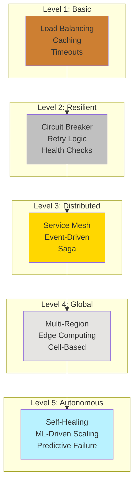

## Pattern Selection Decision Tree

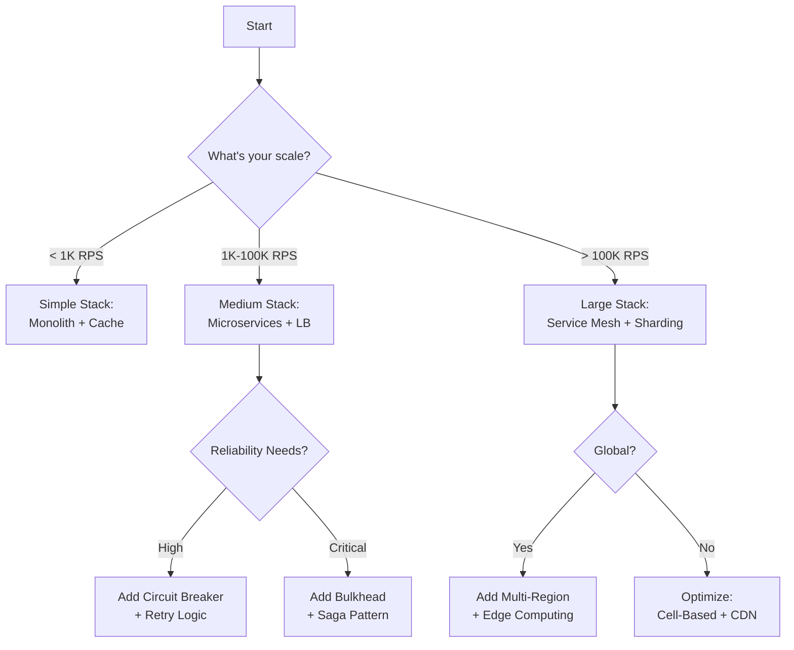

## Related Resources

- [Pattern Catalog](pattern-catalog.md) - Complete pattern list
- [Pattern Selector Tool](pattern-selector-tool.md) - Interactive selection
- [Architecture Examples](../case-studies/) - Real implementations
- [Anti-Patterns](../reference/anti-patterns.md) - What to avoid

---

[:material-arrow-left: Pattern Catalog](pattern-catalog.md) | 
[:material-arrow-up: Patterns](index.md) | 
[:material-arrow-right: Pattern Selector](pattern-selector-tool.md)

