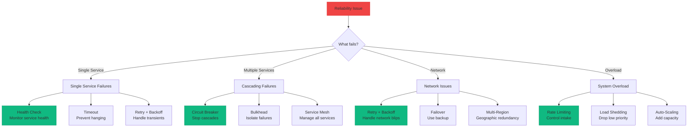
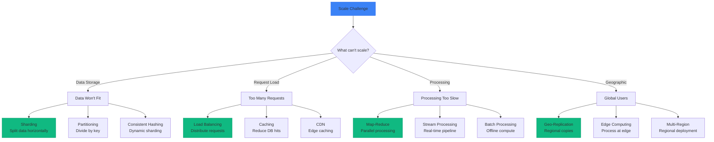
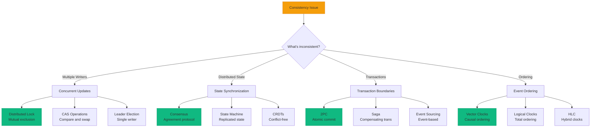
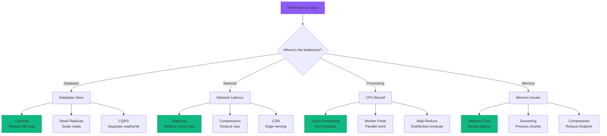
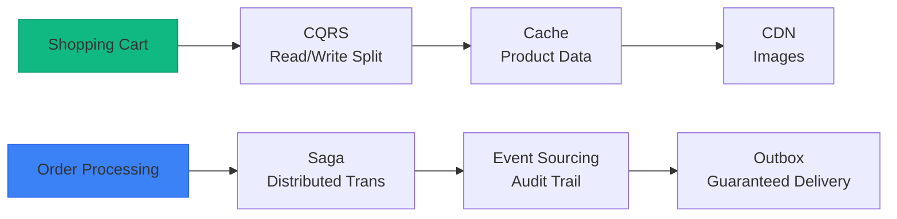
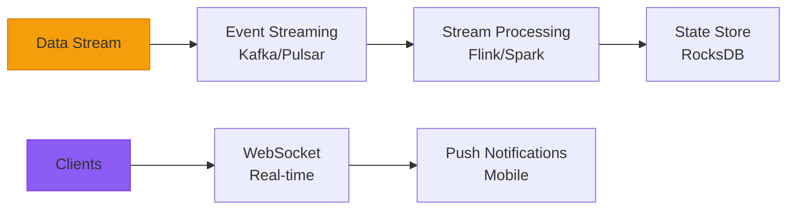
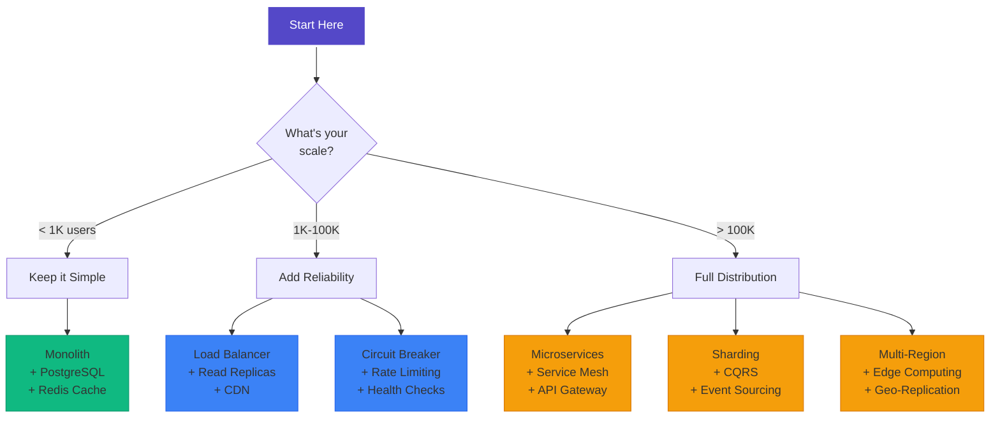

# Pattern Selector Tool

**Find the right pattern for your specific problem**

## 🎯 Interactive Pattern Finder

### Start Here: What's Your Primary Challenge?

-   **🔥 System Reliability**
    
    My system fails too often or cascades failures
    
    [→ Explore Reliability Patterns](#reliability-patterns)

-   **📈 Scalability Issues**
    
    Can't handle increasing load or data volume
    
    [→ Explore Scale Patterns](#scale-patterns)

-   **🔄 Data Consistency**
    
    Data conflicts or inconsistencies across nodes
    
    [→ Explore Consistency Patterns](#consistency-patterns)

-   **⚡ Performance Problems**
    
    Too slow, high latency, or poor throughput
    
    [→ Explore Performance Patterns](#performance-patterns)

---

## Reliability Patterns

### What type of reliability issue?

### Reliability Decision Matrix

| Your Situation | Primary Pattern | Also Consider | Complexity |
|----------------|----------------|---------------|------------|
| **Service keeps dying** | [Health Check](health-check) | [Timeout](timeout), [Retry](retry-backoff) | 🟢 Low |
| **One failure kills many** | [Circuit Breaker](circuit-breaker) | [Bulkhead](bulkhead), [Timeout](timeout) | 🟡 Medium |
| **Can't handle spikes** | [Rate Limiting](rate-limiting) | [Load Shedding](load-shedding), [Auto-Scaling](auto-scaling) | 🟡 Medium |
| **Need zero downtime** | [Blue-Green Deploy](blue-green-deployment) | [Canary](canary-deployment), [Feature Flags](feature-flags) | 🟡 Medium |
| **Geographic failures** | [Multi-Region](multi-region) | [Failover](failover), [Geo-Replication](geo-replication) | 🔴 High |

---

## Scale Patterns

### What needs to scale?

### Scale Decision Matrix

| Your Situation | Primary Pattern | Also Consider | Complexity |
|----------------|----------------|---------------|------------|
| **Database too big** | [Sharding](sharding) | [Partitioning](partitioning), [Compression](compression) | 🔴 High |
| **Too many requests** | [Load Balancing](load-balancing) | [Caching](caching-strategies), [CDN](cdn) | 🟢 Low |
| **Slow queries** | [Caching](caching-strategies) | [Read Replicas](leader-follower), [Materialized Views](materialized-view) | 🟡 Medium |
| **Global users** | [CDN](cdn) | [Geo-Replication](geo-replication), [Edge Computing](edge-computing) | 🟡 Medium |
| **CPU bottleneck** | [Horizontal Scaling](auto-scaling) | [Async Processing](event-driven), [Batch Jobs](batch-processing) | 🟡 Medium |

---

## Consistency Patterns

### What consistency challenge?

### Consistency Decision Matrix

| Your Situation | Primary Pattern | Also Consider | Complexity |
|----------------|----------------|---------------|------------|
| **Lost updates** | [Distributed Lock](distributed-lock) | [CAS](cas), [Leader Election](leader-election) | 🔴 High |
| **Out of sync data** | [Anti-Entropy](anti-entropy) | [Gossip](gossip-protocol), [Merkle Trees](merkle-trees) | 🟡 Medium |
| **Need transactions** | [Saga](saga) | [2PC](two-phase-commit), [Event Sourcing](event-sourcing) | 🔴 High |
| **Wrong order** | [Vector Clocks](vector-clocks) | [Logical Clocks](logical-clocks), [HLC](hlc) | 🔴 High |
| **Split brain** | [Consensus](consensus) | [Generation Clock](generation-clock), [Lease](lease) | 🔴 High |

---

## Performance Patterns

### What's slow?

### Performance Decision Matrix

| Your Situation | Primary Pattern | Also Consider | Complexity |
|----------------|----------------|---------------|------------|
| **Slow DB queries** | [Caching](caching-strategies) | [Indexes](indexing), [Read Replicas](leader-follower) | 🟢 Low |
| **High latency** | [Edge Computing](edge-computing) | [CDN](cdn), [Caching](caching-strategies) | 🟡 Medium |
| **Too many requests** | [Batching](request-batching) | [Compression](compression), [HTTP/2](http2) | 🟢 Low |
| **CPU maxed out** | [Horizontal Scaling](auto-scaling) | [Async Processing](event-driven), [Worker Pools](worker-pool) | 🟡 Medium |
| **Memory pressure** | [Streaming](streaming) | [Pagination](pagination), [Compression](compression) | 🟡 Medium |

---

## 🎯 Pattern Combination Finder

### Common Pattern Combinations

#### For E-Commerce Systems

**Patterns**: CQRS + Caching + CDN + Saga + Event Sourcing + Outbox

#### For Real-Time Systems

**Patterns**: Event Streaming + Stream Processing + WebSockets + Push Notifications

#### For Global Applications

**Patterns**: CDN + Edge Computing + Multi-Region + Geo-Replication + CRDTs

---

## 🔧 Implementation Difficulty Guide

### Pattern Complexity Levels

#### 🟢 Beginner Patterns (Days to implement)
- **Health Check**: Simple endpoint returning status
- **Timeout**: Wrapper around calls with time limit
- **Retry**: Retry logic with exponential backoff
- **Cache Aside**: Check cache, fallback to DB
- **Load Balancing**: Round-robin or random selection

#### 🟡 Intermediate Patterns (Weeks to implement)
- **Circuit Breaker**: State machine with failure tracking
- **Rate Limiting**: Token bucket or sliding window
- **Sharding**: Data partitioning strategy
- **CQRS**: Separate read/write models
- **Service Discovery**: Dynamic service registry

#### 🔴 Advanced Patterns (Months to implement)
- **Consensus**: Raft or Paxos implementation
- **Distributed Lock**: Coordination with timeout
- **Saga**: Distributed transaction orchestration
- **Event Sourcing**: Complete event-driven architecture
- **Service Mesh**: Full observability and control plane

---

## 📋 Quick Pattern Selector Checklist

### Answer these questions to find your patterns:

**1. System Scale**
- [ ] < 100 requests/second → Start with monolith
- [ ] 100-10K req/s → Add caching, load balancing
- [ ] 10K-100K req/s → Consider sharding, microservices
- [ ] > 100K req/s → Need full distributed architecture

**2. Data Size**
- [ ] < 1 GB → Single database is fine
- [ ] 1-100 GB → Add read replicas
- [ ] 100 GB - 1 TB → Consider sharding
- [ ] > 1 TB → Must shard, consider data lake

**3. Geographic Distribution**
- [ ] Single region → Standard patterns
- [ ] Multi-region reads → Add CDN, caching
- [ ] Multi-region writes → Need conflict resolution
- [ ] Global → Full geo-replication strategy

**4. Consistency Requirements**
- [ ] Best effort → Use caching aggressively
- [ ] Eventual → CRDTs, anti-entropy
- [ ] Strong → Consensus, distributed locks
- [ ] Transactions → Saga or 2PC

**5. Team Size**
- [ ] 1-3 engineers → Keep it simple
- [ ] 4-10 engineers → Can handle medium complexity
- [ ] 11-50 engineers → Can build complex systems
- [ ] > 50 engineers → Can maintain any pattern

---

## 🎯 Pattern Decision Flowchart

---

## Need More Help?

-   **📚 Study Examples**
    
    See how companies use these patterns
    
    [→ Case Studies](../case-studies/)

-   **💬 Ask Community**
    
    Get help from practitioners
    
    [→ Discussions](#)

-   **🧪 Try It Out**
    
    Experiment with implementations
    
    [→ Code Examples](pattern-implementations)

-   **📊 Compare Options**
    
    Detailed pattern comparisons
    
    [→ Pattern Matrix](pattern-matrix)

---

[← Back to Patterns](index) | [Pattern Comparison →](pattern-comparison) | [Pattern Quiz →](pattern-quiz)

