# Pattern Selector Tool

Navigate to the right distributed systems pattern for your use case.

## Quick Start Decision Tree

```mermaid
graph TD
    Start[🎯 What's Your Primary Goal?] --> Scale[📈 Scale System]
    Start --> Resilience[🛡️ Improve Resilience]
    Start --> Data[💾 Handle Data]
    Start --> Realtime[⚡ Real-time Processing]
    Start --> Migrate[🔄 Modernize Architecture]
    
    Scale --> ScaleSize{Current Scale?}
    ScaleSize -->|< 100K users| ScaleStartup[Startup Scale]
    ScaleSize -->|100K - 10M| ScaleGrowth[Growth Scale]
    ScaleSize -->|> 10M| ScaleEnterprise[Enterprise Scale]
    
    ScaleStartup --> RecStartup[✅ Load Balancing<br/>✅ Caching Strategies<br/>⚡ Auto-scaling]
    ScaleGrowth --> RecGrowth[✅ Sharding<br/>✅ Service Mesh<br/>⚡ CQRS]
    ScaleEnterprise --> RecEnterprise[✅ Cell-based Architecture<br/>✅ Multi-region<br/>⚡ Edge Computing]
    
    Resilience --> ResilienceType{Failure Type?}
    ResilienceType -->|Service Failures| ServiceFailure[Service Level]
    ResilienceType -->|Data Loss| DataResilience[Data Level]
    ResilienceType -->|Network Issues| NetworkResilience[Network Level]
    
    ServiceFailure --> RecService[✅ Circuit Breaker<br/>✅ Bulkhead<br/>⚡ Retry & Backoff]
    DataResilience --> RecData[✅ Event Sourcing<br/>✅ WAL<br/>⚡ Geo-replication]
    NetworkResilience --> RecNetwork[✅ Service Mesh<br/>✅ API Gateway<br/>⚡ Failover]
    
    Data --> DataPattern{Data Challenge?}
    DataPattern -->|Consistency| DataConsistency[Strong Consistency]
    DataPattern -->|Analytics| DataAnalytics[Analytics/OLAP]
    DataPattern -->|Sync Issues| DataSync[Data Synchronization]
    
    DataConsistency --> RecConsistency[✅ Consensus Protocols<br/>✅ Distributed Lock<br/>⚡ CAS Operations]
    DataAnalytics --> RecAnalytics[✅ Lambda Architecture<br/>✅ Kappa Architecture<br/>⚡ Data Mesh]
    DataSync --> RecSync[✅ CDC<br/>✅ Outbox Pattern<br/>⚡ Delta Sync]
    
    Realtime --> RealtimeUse{Use Case?}
    RealtimeUse -->|Messaging| RealtimeMsg[Real-time Messaging]
    RealtimeUse -->|Streaming| RealtimeStream[Data Streaming]
    RealtimeUse -->|Updates| RealtimeUpdate[Live Updates]
    
    RealtimeMsg --> RecMsg[✅ WebSocket<br/>✅ Pub-Sub<br/>⚡ Message Queue]
    RealtimeStream --> RecStream[✅ Event Streaming<br/>✅ Kappa Architecture<br/>⚡ CDC]
    RealtimeUpdate --> RecUpdate[✅ Server-Sent Events<br/>✅ GraphQL Subscriptions<br/>⚡ WebSocket]
    
    Migrate --> MigrateFrom{Current Architecture?}
    MigrateFrom -->|Monolith| FromMonolith[From Monolith]
    MigrateFrom -->|SOA| FromSOA[From SOA]
    MigrateFrom -->|Legacy| FromLegacy[From Legacy]
    
    FromMonolith --> RecMonolith[✅ API Gateway<br/>✅ Event-driven<br/>⚡ Saga Pattern]
    FromSOA --> RecSOA[✅ Service Mesh<br/>✅ Event Streaming<br/>⚡ CQRS]
    FromLegacy --> RecLegacy[✅ Strangler Fig<br/>✅ CDC<br/>⚡ API Gateway]
    
    style Start fill:#5448C8,color:#fff
    style RecStartup fill:#4CAF50,color:#fff
    style RecGrowth fill:#4CAF50,color:#fff
    style RecEnterprise fill:#4CAF50,color:#fff
    style RecService fill:#4CAF50,color:#fff
    style RecData fill:#4CAF50,color:#fff
    style RecNetwork fill:#4CAF50,color:#fff
    style RecConsistency fill:#4CAF50,color:#fff
    style RecAnalytics fill:#4CAF50,color:#fff
    style RecSync fill:#4CAF50,color:#fff
    style RecMsg fill:#4CAF50,color:#fff
    style RecStream fill:#4CAF50,color:#fff
    style RecUpdate fill:#4CAF50,color:#fff
    style RecMonolith fill:#4CAF50,color:#fff
    style RecSOA fill:#4CAF50,color:#fff
    style RecLegacy fill:#4CAF50,color:#fff
```

## Pattern Selection by Constraints

### Latency vs Consistency Trade-offs

| Requirement | Primary Pattern | Alternatives | Complexity |
|------------|----------------|--------------|------------|
| < 10ms latency + eventual consistency | **Edge Computing** | CDN, Caching Strategies | ⭐⭐⭐⭐ |
| < 50ms latency + strong consistency | **Multi-region** with consensus | Geo-replication, CRDTs | ⭐⭐⭐⭐⭐ |
| < 100ms latency + high availability | **Service Mesh** | Load Balancing, Circuit Breaker | ⭐⭐⭐ |
| Best effort latency + strong consistency | **Consensus Protocols** | Distributed Lock, CAS | ⭐⭐⭐⭐ |

### Scale vs Complexity Matrix

## Common Scenarios Quick Reference

### 🚀 Building New Microservice

```mermaid
graph TD
    Start[New Microservice] --> Comm{Communication Pattern?}
    
    Comm -->|Sync REST| SyncPath[Synchronous Path]
    Comm -->|Async Events| AsyncPath[Asynchronous Path]
    Comm -->|Mixed| MixedPath[Hybrid Path]
    
    SyncPath --> SyncRec[✅ API Gateway<br/>✅ Service Mesh<br/>✅ Circuit Breaker<br/>⚡ Load Balancing]
    AsyncPath --> AsyncRec[✅ Event-driven<br/>✅ Pub-Sub<br/>✅ Message Queue<br/>⚡ Event Streaming]
    MixedPath --> MixedRec[✅ CQRS<br/>✅ Saga Pattern<br/>✅ Outbox Pattern<br/>⚡ Event Sourcing]
    
    style SyncRec fill:#4CAF50
    style AsyncRec fill:#4CAF50
    style MixedRec fill:#4CAF50
```

### 📈 Scaling Existing System

| Current State | Bottleneck | Recommended Pattern | Implementation Time |
|--------------|------------|-------------------|-------------------|
| Single DB | Read heavy | **Read Replicas** → **CQRS** | 2-4 weeks |
| Single DB | Write heavy | **Sharding** → **Event Sourcing** | 4-8 weeks |
| Monolith | CPU bound | **Horizontal Scaling** → **Load Balancing** | 1-2 weeks |
| Monolith | Feature velocity | **Microservices** → **API Gateway** | 3-6 months |
| Regional | Global users | **Multi-region** → **Edge Computing** | 2-4 months |

### 🔄 Monolith Migration

### ⚡ Real-time Requirements

| Use Case | Latency Target | Pattern Stack | Case Study |
|----------|---------------|--------------|------------|
| Chat/Messaging | < 100ms | **WebSocket** + **Pub-Sub** + **Edge nodes** | [WhatsApp →](../case-studies/communication/whatsapp-scale/) |
| Live Sports | < 500ms | **CDN** + **Event Streaming** + **Edge Computing** | [ESPN →](../case-studies/elite-engineering/espn-streaming/) |
| Trading Platform | < 10ms | **Co-location** + **Memory Grid** + **LMAX Pattern** | [NYSE →](../case-studies/finance/nyse-trading/) |
| IoT Telemetry | < 1s | **MQTT** + **Time-series DB** + **Lambda Architecture** | [Tesla →](../case-studies/automotive/tesla-fleet/) |

### 🌍 Global Distribution

```mermaid
graph TD
    Global[Global Distribution Need] --> Consistency{Consistency Requirement?}
    
    Consistency -->|Strong| Strong[Strong Consistency Path]
    Consistency -->|Eventual| Eventual[Eventual Consistency Path]
    Consistency -->|Tunable| Tunable[Tunable Consistency Path]
    
    Strong --> StrongRec[✅ Multi-region Consensus<br/>✅ Global Clock Sync<br/>⚠️ High Latency Trade-off]
    Eventual --> EventualRec[✅ CRDTs<br/>✅ Geo-replication<br/>✅ Edge Computing]
    Tunable --> TunableRec[✅ Cassandra-style<br/>✅ DynamoDB Model<br/>✅ Quorum Reads]
    
    style StrongRec fill:#FF5252
    style EventualRec fill:#4CAF50
    style TunableRec fill:#FF9800
```

## Pattern Complexity Ratings

### Implementation Difficulty

| Pattern | Time to Implement | Team Size | Operational Overhead |
|---------|------------------|-----------|---------------------|
| **🟢 Simple Patterns** |||
| Load Balancing | 1-2 days | 1-2 devs | Low |
| Caching | 3-5 days | 1-2 devs | Low |
| Circuit Breaker | 1 week | 2-3 devs | Medium |
| **🟡 Medium Patterns** |||
| Service Mesh | 2-4 weeks | 3-5 devs | High |
| CQRS | 4-6 weeks | 4-6 devs | Medium |
| Event Sourcing | 6-8 weeks | 4-6 devs | High |
| **🔴 Complex Patterns** |||
| Multi-region | 2-3 months | 8-10 devs | Very High |
| Cell-based | 3-4 months | 10+ devs | Very High |
| Consensus | 1-2 months | 5-8 devs | High |

## Quick Decision Framework

```mermaid
graph TD
    Q1[Can you tolerate data loss?] -->|No| StrongPath[Strong Guarantees Path]
    Q1 -->|Yes| EventualPath[Performance Path]
    
    StrongPath --> Q2[Can you tolerate downtime?]
    Q2 -->|No| HighAvail[✅ Multi-region<br/>✅ Consensus<br/>✅ Active-Active]
    Q2 -->|Yes| SimpleStrong[✅ Primary-Secondary<br/>✅ Failover<br/>✅ Backup/Restore]
    
    EventualPath --> Q3[Need < 100ms latency?]
    Q3 -->|Yes| LowLatency[✅ Edge Computing<br/>✅ Caching<br/>✅ CDN]
    Q3 -->|No| StandardPerf[✅ Load Balancing<br/>✅ Async Processing<br/>✅ Queue-based]
    
    style HighAvail fill:#F44336,color:#fff
    style SimpleStrong fill:#FF9800,color:#fff
    style LowLatency fill:#4CAF50,color:#fff
    style StandardPerf fill:#4CAF50,color:#fff
```

## Pattern Combinations

### Proven Stacks

| Stack Name | Patterns | Use Case | Complexity |
|------------|----------|----------|------------|
| **Event-driven Microservices** | API Gateway + Event Streaming + Saga + CQRS | E-commerce, SaaS | ⭐⭐⭐⭐ |
| **Resilient Web Services** | Load Balancer + Circuit Breaker + Service Mesh + Retry | Public APIs | ⭐⭐⭐ |
| **Global Data Platform** | Multi-region + CDC + Event Sourcing + CRDTs | Social Media | ⭐⭐⭐⭐⭐ |
| **Real-time Analytics** | Lambda Architecture + Streaming + Time-series DB | IoT, Monitoring | ⭐⭐⭐⭐ |
| **Serverless Stack** | FaaS + API Gateway + Event-driven + Queue | Startups, MVPs | ⭐⭐ |

## Related Resources

- [Pattern Catalog →](pattern-catalog.md) - Complete pattern reference
- [Pattern Health Dashboard →](../reference/pattern-health-dashboard.md) - Implementation status
- [Elite Engineering Case Studies →](../case-studies/elite-engineering/) - Real-world examples
- [Architecture Decision Records →](../reference/architecture-decisions.md) - Template for choices