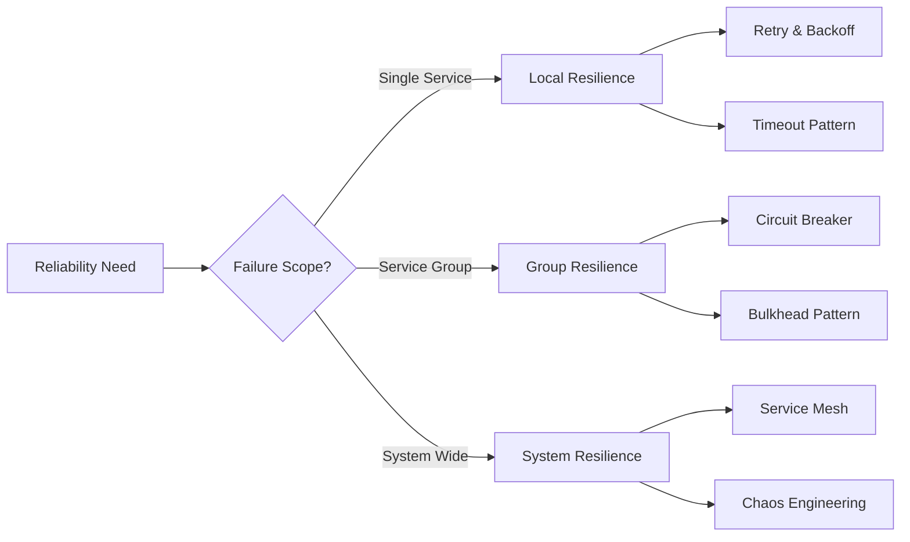

<!-- Navigation -->
[Home](../index.md) → [Part III: Patterns](index.md) → **Pattern Selector**

# Interactive Pattern Selector

> *"The right pattern at the right place can save months of development and years of operational pain."*

---

## 🎯 Quick Pattern Finder

### What's Your Primary Goal?

  

    

      <h3>🚀 Improve Performance</h3>
      
Reduce latency, increase throughput

    

    

      <h3>🛡️ Increase Reliability</h3>
      
Handle failures, ensure availability

    

    

      <h3>📈 Handle Scale</h3>
      
Support more users, data, or regions

    

    

      <h3>🔒 Ensure Consistency</h3>
      
Keep data accurate across systems

    

  

---

## 🚀 Performance Optimization Patterns

### What Performance Challenge Do You Face?

**Read Heavy?**  
→ Data freshness in seconds OK? → **Caching Pattern**  
→ Need real-time? → **CQRS Pattern**

**Write Heavy?**  
→ Need ordering? → **Event Sourcing**  
→ No ordering? → **Sharding Pattern**

**Mixed Workload?**  
→ Can separate R/W? → **CQRS + Event Sourcing**  
→ Cannot separate? → **Service Mesh + Caching**

### Recommended Patterns for Performance

| Your Scenario | Primary Pattern | Why It Works | Implementation Effort |
|---------------|----------------|--------------|----------------------|
| **90% reads, 10% writes** | **Caching** | Serve from memory | ⭐⭐ Low |
| **Complex queries on large data** | **CQRS** | Optimized read models | ⭐⭐⭐ Medium |
| **High write throughput** | **Sharding** | Distribute writes | ⭐⭐⭐⭐ High |
| **Need audit trail** | **Event Sourcing** | Append-only writes | ⭐⭐⭐⭐ High |
| **Global users** | **Edge Computing** | Process near users | ⭐⭐⭐ Medium |

---

## 🛡️ Reliability Enhancement Patterns

### What Failure Scenario Worries You?

  <h4>Select your failure concerns:</h4>
  
  ☐ **Service Dependencies** - "When service X is down, everything fails"
  → **Solution**: Circuit Breaker + Bulkhead patterns
  
  ☐ **Network Issues** - "Timeouts and connection errors"
  → **Solution**: Retry & Backoff + Timeout patterns
  
  ☐ **Cascading Failures** - "One service failure takes down others"
  → **Solution**: Bulkhead + Circuit Breaker + Service Mesh
  
  ☐ **Data Loss** - "Messages or events getting lost"
  → **Solution**: Outbox + Idempotent Receiver patterns
  
  ☐ **Overload** - "System crashes under heavy load"
  → **Solution**: Rate Limiting + Auto-scaling + Backpressure

### Reliability Pattern Decision Matrix

---

## 📈 Scaling Patterns

### Scale Questionnaire

**1. What needs to scale?**
- [ ] Number of users
- [ ] Data volume
- [ ] Geographic reach
- [ ] Request rate
- [ ] All of the above

**2. Current scale?**
- [ ] < 1K users → Start with vertical scaling
- [ ] 1K-100K users → Time for horizontal scaling
- [ ] 100K-1M users → Need serious architecture
- [ ] > 1M users → Requires all patterns

**3. Budget constraints?**
- [ ] Cost is critical → Serverless + Auto-scaling
- [ ] Performance is critical → Pre-provisioned + Caching
- [ ] Both matter → FinOps + Smart scaling

### Scaling Pattern Recommendations

| Current Scale | Next Scale | Recommended Patterns | Key Consideration |
|--------------|------------|---------------------|-------------------|
| **Startup** | 10x growth | Caching + CDN | Keep it simple |
| **Growing** | Regional | Sharding + Read replicas | Plan data model |
| **Regional** | Global | Geo-replication + Edge | Latency vs consistency |
| **Global** | Massive | Everything + Custom | Operational excellence |

---

## 🔒 Consistency Patterns

### Consistency Requirements Quiz

**1. Can users see stale data?**  
Never → Strong consistency | Few seconds → Bounded staleness | Eventually → Eventual consistency

**2. Transaction scope?**  
Single record → Simple locking | Multiple records/one service → Local transactions | Multiple services → Saga

**3. Conflict resolution?**  
Prevent → Pessimistic locking | Detect/resolve → Optimistic locking | Last write wins → Eventual consistency

### Consistency Pattern Selector

**Synchronous Requirements?**  
→ Single service? → **ACID Transactions**  
→ Multiple services? → **Two-Phase Commit** (avoid if possible)

**Asynchronous OK?**  
→ Conflicts acceptable? → **CRDTs/Event Sourcing**  
→ Must prevent conflicts? → **Saga Pattern**  
→ Variable needs? → **Tunable Consistency**

---

## 🎮 Interactive Pattern Wizard

### Step-by-Step Pattern Selection

  

    <h3>Step 1: System Type</h3>
    <button onclick="wizardNext('webapp')">Web Application</button>
    <button onclick="wizardNext('api')">API Service</button>
    <button onclick="wizardNext('data')">Data Pipeline</button>
    <button onclick="wizardNext('iot')">IoT System</button>
  

### Pattern Combination Builder

**Build your architecture by combining patterns:**

  

    <h4>Available Patterns</h4>
    
CQRS

    
Event Sourcing

    
Saga

    
Service Mesh

    
Caching

  

  
  

    <h4>Your Architecture</h4>
    
Drop patterns here...

  

---

## 📋 Pattern Checklist Generator

### Generate a Custom Implementation Checklist

**Example: CQRS + Event Sourcing + Service Mesh**

**Week 1-2: Foundation**  
✓ Set up event store  
✓ Define event schemas  
✓ Create first aggregate

**Week 3-4: CQRS Implementation**  
✓ Separate read/write models  
✓ Build projection handlers  
✓ Set up read store

**Week 5-8: Service Mesh**  
✓ Choose mesh technology  
✓ Deploy sidecar proxies  
✓ Configure policies

---

## 🎯 Pattern Anti-Pattern Detector

### Check Your Architecture for Issues

### Common Anti-pattern Examples

**⚠️ Synchronous CQRS projections**  
Defeats the purpose of CQRS. Use async projections.

**⚠️ Missing idempotency**  
Event handlers must be idempotent for retries.

**⚠️ Distributed monolith**  
Microservices with synchronous dependencies everywhere.

**⚠️ Over-engineering**  
Using complex patterns for simple problems.

---

## 🔄 Pattern Migration Paths

### Evolving Your Architecture

**Monolith → Microservices Journey**

1. **Extract APIs** → API Gateway
2. **Add caching** → Performance boost
3. **Split services** → Microservices
4. **Async communication** → Message Queue
5. **Separate R/W** → CQRS
6. **Event-driven** → Event Sourcing
7. **Orchestration** → Service Mesh
8. **Distributed transactions** → Saga Pattern

---

## 📊 Pattern ROI Calculator

### Calculate the Value of Pattern Implementation

### Pattern ROI Example: Circuit Breaker

**Current State:**
- Downtime: 4 hours/month
- Response time: 500ms
- Dev velocity: 10 features/month

**With Circuit Breaker:**
- Downtime: 1 hour/month (-75%)
- Response time: 300ms (-40%)
- Dev velocity: 12 features/month (+20%)

**Financial Impact:**
- Monthly savings: $45,000
- Implementation: $100,000
- Payback: 2.2 months
- 12-month ROI: 440%

---

## 🎓 Learning Resources by Pattern

**🚀 Performance Path**
1. Read: Caching Strategies (30 min)
2. Lab: Implement Redis Cache (2 hrs)
3. Read: CQRS Pattern (45 min)
4. Project: Build CQRS Demo (4 hrs)

**🛡️ Reliability Path**
1. Read: Circuit Breaker (20 min)
2. Lab: Implement Hystrix (2 hrs)
3. Read: Bulkhead Pattern (30 min)
4. Project: Chaos Testing (3 hrs)

---

## 🚦 Quick Decision Matrix

### Pattern at a Glance

| If This Is True... | Use This Pattern | Don't Use |
|-------------------|------------------|-----------|
| Read >> Write | CQRS | Event Sourcing only |
| Need audit trail | Event Sourcing | Simple CRUD |
| Multiple service calls | Saga | Two-phase commit |
| Unpredictable load | Auto-scaling | Fixed capacity |
| Global users | Edge Computing | Single region |
| External dependencies | Circuit Breaker | Direct calls |
| Duplicate messages | Idempotent Receiver | Hope for the best |
| Cost sensitive | Serverless | Always-on servers |

---

---

*"The best pattern is the one that solves your problem with the least complexity."*

---

**Previous**: [← Pattern Comparison](pattern-comparison.md) | **Next**: [Pattern Combinations →](pattern-combinations.md)