# Pattern Selection Guide

!!! abstract "Quick Navigator"
    🎯 **Find the right pattern in 30 seconds using our decision matrices**

## Pattern Selection Matrix

| Your Challenge | Best Pattern | Complexity | When to Use |
|----------------|--------------|------------|-------------|
| **External API failures** | Circuit Breaker | ⭐⭐ | Always |
| **High read load** | Cache-Aside | ⭐ | Read/Write > 10:1 |
| **Distributed transactions** | Saga | ⭐⭐⭐ | Microservices |
| **Service discovery** | Service Mesh | ⭐⭐⭐⭐ | >20 services |
| **Data consistency** | Event Sourcing | ⭐⭐⭐⭐⭐ | Audit required |


---

## Pattern Decision Cards

### 💾 Data Management Patterns

| Pattern | When to Use | Trade-off | Complexity |
|---------|-------------|-----------|------------|
| **Cache-Aside** | Read-heavy (>10:1) | Eventual consistency | ⭐ |
| **Write-Through** | Need consistency | Higher latency | ⭐⭐ |
| **Write-Behind** | Write-heavy | Risk data loss | ⭐⭐⭐ |
| **Event Sourcing** | Audit trail needed | Complex queries | ⭐⭐⭐⭐⭐ |

[→ Detailed Caching Guide](/patterns/caching-strategies)

<div>
<h4>Database Selection</h4>
<p><strong>When:</strong> Different data models needed</p>
<p><strong>Options:</strong></p>
<ul>
<li>RDBMS: ACID, complex queries</li>
<li>NoSQL: Scale, flexibility</li>
<li>Polyglot: Best of all worlds</li>
</ul>
<p><strong>Decision:</strong> Multiple data models → Polyglot</p>
<a href="/patterns/polyglot-persistence/">→ Full Guide</a>
</div>

<div>
<h4>Event Sourcing</h4>
<p><strong>When:</strong> Audit trail, time travel needed</p>
<p><strong>Pros:</strong> Complete history, replay capability</p>
<p><strong>Cons:</strong> Complex queries, storage cost</p>
<p><strong>Decision:</strong> Compliance required → Event Sourcing</p>
<a href="/patterns/event-sourcing">→ Full Guide</a>
</div>

</div>

### Reliability Patterns

<div>

<div>
<h4>Circuit Breaker</h4>
<p><strong>When:</strong> Calling external services</p>
<p><strong>Prevents:</strong> Cascade failures</p>
<p><strong>Config:</strong></p>
<ul>
<li>Threshold: 5 failures</li>
<li>Timeout: 30 seconds</li>
<li>Half-open tests: 10%</li>
</ul>
<p><strong>Decision:</strong> External API → Always use</p>
<a href="/patterns/circuit-breaker.md">→ Full Guide</a>
</div>

<div>
<h4>Retry & Backoff</h4>
<p><strong>When:</strong> Transient failures possible</p>
<p><strong>Strategies:</strong></p>
<ul>
<li>Fixed: Simple, predictable</li>
<li>Exponential: Prevents overload</li>
<li>Jittered: Avoids thundering herd</li>
</ul>
<p><strong>Decision:</strong> Network calls → Exponential + Jitter</p>
<a href="/patterns/retry-backoff/">→ Full Guide</a>
</div>

<div>
<h4>Bulkhead</h4>
<p><strong>When:</strong> Isolate failures</p>
<p><strong>Types:</strong></p>
<ul>
<li>Thread pools: CPU isolation</li>
<li>Semaphores: Lightweight</li>
<li>Circuit breakers: Network isolation</li>
</ul>
<p><strong>Decision:</strong> Multi-tenant → Thread pools</p>
<a href="/patterns/bulkhead.md">→ Full Guide</a>
</div>

</div>

### 📬 Communication Patterns

<div>

<div>
<h4>Event-Driven</h4>
<p><strong>When:</strong> Loose coupling needed</p>
<p><strong>Benefits:</strong> Scalable, decoupled</p>
<p><strong>Challenges:</strong> Eventual consistency</p>
<p><strong>Tools:</strong> Kafka, RabbitMQ, EventBridge</p>
<p><strong>Decision:</strong> Microservices → Event-driven</p>
<a href="/patterns/event-driven">→ Full Guide</a>
</div>

<div>
<h4>API Gateway</h4>
<p><strong>When:</strong> Multiple backend services</p>
<p><strong>Features:</strong></p>
<ul>
<li>Authentication</li>
<li>Rate limiting</li>
<li>Request routing</li>
</ul>
<p><strong>Decision:</strong> >5 services → API Gateway</p>
<a href="/patterns/api-gateway.md">→ Full Guide</a>
</div>

<div>
<h4>Service Mesh</h4>
<p><strong>When:</strong> Complex service topology</p>
<p><strong>Provides:</strong> Traffic mgmt, security, observability</p>
<p><strong>Options:</strong> Istio, Linkerd, Consul</p>
<p><strong>Decision:</strong> >20 services → Service Mesh</p>
<a href="/patterns/service-mesh/">→ Full Guide</a>
</div>

</div>

### 🤝 Coordination Patterns

<div>

<div>
<h4>Consensus</h4>
<p><strong>When:</strong> Distributed agreement needed</p>
<p><strong>Algorithms:</strong></p>
<ul>
<li>Raft: Simple, understandable</li>
<li>Paxos: Battle-tested</li>
<li>PBFT: Byzantine tolerance</li>
</ul>
<p><strong>Decision:</strong> New system → Raft</p>
<a href="/patterns/consensus.md">→ Full Guide</a>
</div>

<div>
<h4>Distributed Locks</h4>
<p><strong>When:</strong> Mutual exclusion needed</p>
<p><strong>Implementations:</strong></p>
<ul>
<li>Redis: Simple, fast</li>
<li>Zookeeper: Robust</li>
<li>etcd: Kubernetes-native</li>
</ul>
<p><strong>Decision:</strong> Already using Redis → Redlock</p>
<a href="/patterns/distributed-lock/">→ Full Guide</a>
</div>

<div>
<h4>Saga Pattern</h4>
<p><strong>When:</strong> Distributed transactions</p>
<p><strong>Types:</strong></p>
<ul>
<li>Orchestration: Central control</li>
<li>Choreography: Event-driven</li>
</ul>
<p><strong>Decision:</strong> Complex flow → Orchestration</p>
<a href="/patterns/saga">→ Full Guide</a>
</div>

</div>

---

## Pattern Comparison Matrix

### Visual Trade-off Guide

```mermaid
graph TD
    subgraph "Performance vs Complexity"
        A[Monolithic DB<br/>Perf: ⭐⭐⭐<br/>Complex: ⭐]
        B[Read Replicas<br/>Perf: ⭐⭐⭐⭐<br/>Complex: ⭐⭐]
        C[Sharding<br/>Perf: ⭐⭐⭐⭐⭐<br/>Complex: ⭐⭐⭐⭐]
        
        A -->|"Read bottleneck"| B
        B -->|"Write bottleneck"| C
    end
    
    style A fill:#9f6
    style B fill:#fc6
    style C fill:#f96
```




### Consistency vs Availability Trade-offs

| Pattern | Consistency | Availability | Use When |
|---------|------------|--------------|----------|
| **2PC** | ⭐⭐⭐⭐⭐ | ⭐ | Never (legacy) |
| **Saga** | ⭐⭐⭐ | ⭐⭐⭐⭐ | Microservices |
| **Event Sourcing** | ⭐⭐ | ⭐⭐⭐⭐⭐ | Event-driven |
| **Consensus** | ⭐⭐⭐⭐ | ⭐⭐⭐ | Critical state |


---

## Decision Flowcharts by Scenario

### Choosing a Caching Strategy


### Choosing a Distributed Transaction Pattern


---

## Implementation Difficulty Guide

### Effort Estimation Matrix

| Pattern | Dev Time | Test Complexity | Ops Burden | Total Effort |
|---------|----------|-----------------|------------|--------------|
| **Cache-Aside** | 1 day | Low | Low | ⭐ |
| **Circuit Breaker** | 2 days | Medium | Low | ⭐⭐ |
| **API Gateway** | 1 week | Medium | Medium | ⭐⭐⭐ |
| **Event Sourcing** | 2 weeks | High | High | ⭐⭐⭐⭐ |
| **Service Mesh** | 1 month | High | Very High | ⭐⭐⭐⭐⭐ |


### Learning Curve Comparison


---

## Pattern Evolution Path

### Typical System Evolution


---

## 🎴 Anti-Pattern Warning Cards

<div>

<div>
<h4>❌ Distributed Monolith</h4>
<p><strong>What:</strong> Microservices that can't deploy independently</p>
<p><strong>Why Bad:</strong> Complexity without benefits</p>
<p><strong>Fix:</strong> True service boundaries, async communication</p>
</div>

<div>
<h4>❌ Chatty Services</h4>
<p><strong>What:</strong> Services making 100s of calls per request</p>
<p><strong>Why Bad:</strong> Latency multiplication</p>
<p><strong>Fix:</strong> BFF pattern, query optimization</p>
</div>

<div>
<h4>❌ Shared Database</h4>
<p><strong>What:</strong> Multiple services sharing one DB</p>
<p><strong>Why Bad:</strong> Coupling, scaling issues</p>
<p><strong>Fix:</strong> Database per service, event streaming</p>
</div>

<div>
<h4>❌ Synchronous Everything</h4>
<p><strong>What:</strong> All communication is request/response</p>
<p><strong>Why Bad:</strong> Cascading failures</p>
<p><strong>Fix:</strong> Async messaging, event-driven</p>
</div>

</div>

---

## Getting Started Checklist

### Week 1: Foundation
- [ ] Implement basic health checks
- [ ] Add structured logging
- [ ] Set up monitoring dashboards
- [ ] Create runbooks

### Week 2: Reliability
- [ ] Add circuit breakers to external calls
- [ ] Implement retry with backoff
- [ ] Set up rate limiting
- [ ] Add timeout configurations

### Week 3: Performance
- [ ] Implement caching layer
- [ ] Add database connection pooling
- [ ] Configure load balancing
- [ ] Optimize critical queries

### Week 4: Scale
- [ ] Design sharding strategy
- [ ] Implement async processing
- [ ] Add message queuing
- [ ] Plan for multi-region

---

## 📚 Pattern Combinations That Work Well

### The Classic Stack
```
Load Balancer → Cache → Database
+ Circuit Breaker for external calls
+ Retry logic for transient failures
```

### The Microservices Trinity
```
API Gateway → Service Mesh → Event Bus
+ Saga for distributed transactions
+ Circuit breakers between services
```

### The Data Pipeline
```
CDC → Stream Processing → Data Lake
+ Event sourcing for audit
+ CQRS for read optimization
```

---

## 🎓 Key Takeaways

1. **Start simple** - Don't implement patterns you don't need yet
2. **Measure first** - Data-driven pattern selection
3. **Combine wisely** - Patterns work better together
4. **Evolution over revolution** - Gradual migration paths
5. **Operations matter** - Consider maintenance burden

---

*"The best pattern is the simplest one that solves your current problem."*

---

**Previous**: [← Pattern Combinations](/patterns/pattern-combinations) | **Next**: [Pattern Quiz →](/patterns/pattern-quiz)