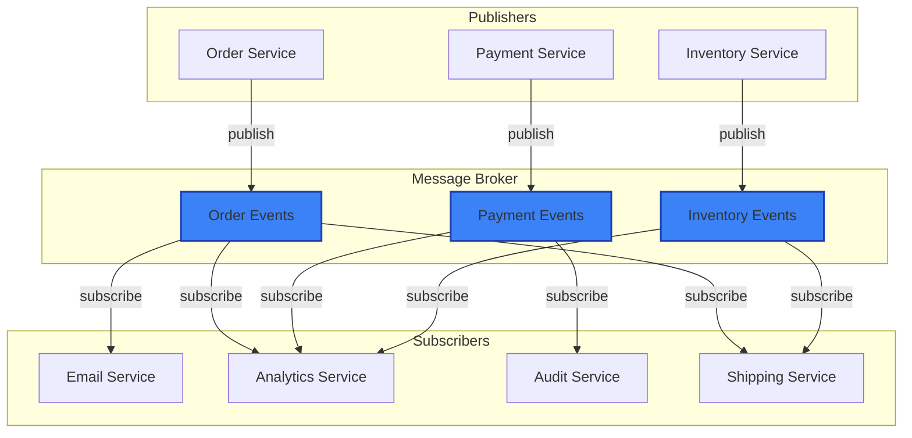
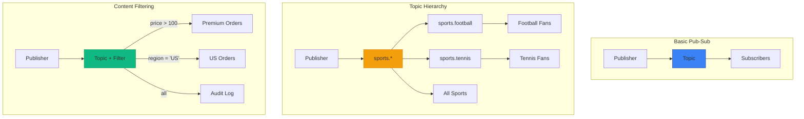
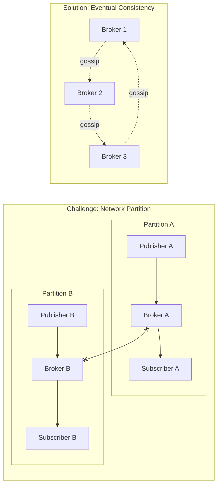

# Publish-Subscribe Pattern

!!! success "🏆 Gold Standard Pattern"
    **Decoupled Event Distribution** • Kafka, Redis, Google Pub/Sub proven
    
    The cornerstone of event-driven architectures. Pub-sub enables scalable, decoupled communication where publishers and subscribers operate independently, supporting everything from real-time notifications to event streaming.
    
    **Key Success Metrics:**
    - LinkedIn Kafka: 7 trillion messages/day powering all services
    - Redis Pub/Sub: Microsecond latency for real-time features
    - Google Pub/Sub: 500M messages/sec with global distribution

[Home](/) > [Patterns](patterns) > [Communication Patterns](patterns/#communication-patterns) > Publish-Subscribe

**Decoupled messaging where publishers don't know their subscribers**

> *"In pub-sub, publishers shout into the void, and interested parties listen. No one needs to know about anyone else."*

!!! info "Pattern Origin"
    The publish-subscribe pattern emerged from early messaging systems in the 1980s. Today, it powers everything from Kafka's distributed logs to Redis Pub/Sub, cloud messaging services like AWS SNS/SQS, and real-time systems like WebSockets.

---

## Level 1: Intuition

### Core Concept

<div class="axiom-box">
<h4>🔬 Law 2: Asynchronous Reality</h4>

Pub-Sub embraces the asynchronous nature of distributed systems. Publishers fire events without waiting for acknowledgment, and subscribers process at their own pace. This decoupling in time and space is fundamental to building scalable systems.

**Key Insight**: In distributed systems, synchronous coupling is the enemy of scale.
</div>

Publish-Subscribe (Pub-Sub) is like a news broadcast system:

```
Traditional Direct Communication:        Pub-Sub Communication:
┌────────┐  message  ┌────────┐         ┌────────┐
│Sender A├──────────►│Receiver│         │Pub A   │
└────────┘           └────────┘         └───┬────┘
                                            │ publish
┌────────┐  message  ┌────────┐             ▼
│Sender B├──────────►│Receiver│         ┌────────┐      ┌─────┐
└────────┘           └────────┘         │ Topic  │◄─────┤Sub 1│
                                        └───┬────┘      └─────┘
❌ Tight coupling                           │ broadcast
❌ Sender must know receiver                ▼           ┌─────┐
❌ 1-to-1 only                          ┌───┴────┐◄─────┤Sub 2│
                                        │Messages│      └─────┘
                                        └────────┘      ┌─────┐
                                                  ◄─────┤Sub 3│
                                        ✅ Loose coupling └─────┘
                                        ✅ Dynamic subscribers
                                        ✅ 1-to-many broadcast
```

### Visual Overview



### Key Benefits
- **Decoupling**: Publishers and subscribers don't know about each other
- **Scalability**: Add/remove subscribers without affecting publishers
- **Flexibility**: Multiple subscribers can process same message differently

---

## Level 2: Core Implementation

### Problem-Solution Format

| Problem | Solution |
|---------|----------|
| **Tight coupling** between message producers and consumers | Introduce intermediate topic/channel layer |
| **1-to-many communication** needs | Broadcast messages to multiple subscribers |
| **Dynamic subscription** requirements | Allow runtime subscribe/unsubscribe |
| **Different processing** speeds | Asynchronous message delivery with queuing |

### Basic Structure

```python
from collections import defaultdict
from queue import Queue
from threading import Thread
import time

class PubSubBroker:
    def __init__(self):
        self.topics = defaultdict(list)  # topic -> [subscribers]
        self.messages = defaultdict(Queue)  # topic -> message queue
        
    def publish(self, topic, message):
        """Publish message to a topic"""
        # Store message for all subscribers
        for subscriber in self.topics[topic]:
            self.messages[subscriber].put({
                'topic': topic,
                'message': message,
                'timestamp': time.time()
            })
    
    def subscribe(self, topic, callback):
        """Subscribe to topic with callback function"""
        subscriber_id = f"{topic}_{len(self.topics[topic])}"
        self.topics[topic].append(subscriber_id)
        
        # Start subscriber thread
        thread = Thread(target=self._process_messages, 
                       args=(subscriber_id, callback))
        thread.daemon = True
        thread.start()
        
        return subscriber_id
    
    def _process_messages(self, subscriber_id, callback):
        """Process messages for a subscriber"""
        while True:
            message = self.messages[subscriber_id].get()
            try:
                callback(message)
            except Exception as e:
                print(f"Subscriber {subscriber_id} error: {e}")
```

### Architecture Diagram

```mermaid
flowchart TB
    subgraph "Pub-Sub Architecture"
        subgraph "Publishers"
            P1[Publisher 1]
            P2[Publisher 2]
        end
        
        subgraph "Broker Components"
            TM[Topic Manager]
            MM[Message Manager]
            SM[Subscription Manager]
            Q1[Queue: Topic A]
            Q2[Queue: Topic B]
        end
        
        subgraph "Subscribers"
            S1[Subscriber 1]
            S2[Subscriber 2]
            S3[Subscriber 3]
        end
        
        P1 -->|publish(topicA, msg)| TM
        P2 -->|publish(topicB, msg)| TM
        
        TM --> MM
        MM --> Q1
        MM --> Q2
        
        SM -->|route| S1
        SM -->|route| S2
        SM -->|route| S3
        
        Q1 -.->|async delivery| SM
        Q2 -.->|async delivery| SM
    end
    
    style TM fill:#f59e0b,stroke:#d97706,stroke-width:2px
    style MM fill:#3b82f6,stroke:#1e40af,stroke-width:2px
    style SM fill:#10b981,stroke:#059669,stroke-width:2px
```

---

## Level 3: Real-World Usage

### Production Example: Apache Kafka

Kafka implements distributed pub-sub at massive scale:

```python
from kafka import KafkaProducer, KafkaConsumer
import json
import logging

class KafkaEventBus:
    def __init__(self, bootstrap_servers):
        self.servers = bootstrap_servers
        self.producer = None
        self.consumers = {}
        
    def publish(self, topic, event):
        """Publish event to Kafka topic"""
        if not self.producer:
            self.producer = KafkaProducer(
                bootstrap_servers=self.servers,
                value_serializer=lambda v: json.dumps(v).encode('utf-8'),
                acks='all',  # Wait for all replicas
                retries=3
            )
        
        future = self.producer.send(topic, event)
        return future.get(timeout=10)  # Synchronous send
    
    def subscribe(self, topics, group_id, handler):
        """Subscribe to Kafka topics with consumer group"""
        consumer = KafkaConsumer(
            *topics,
            bootstrap_servers=self.servers,
            group_id=group_id,
            value_deserializer=lambda m: json.loads(m.decode('utf-8')),
            enable_auto_commit=False,  # Manual commit for reliability
            max_poll_records=100
        )
        
        # Process messages
        for message in consumer:
            try:
                handler(message.value)
                consumer.commit()  # Commit after successful processing
            except Exception as e:
                logging.error(f"Processing error: {e}")
                # Message will be redelivered
```

### Decision Criteria Table

| When to Use | When NOT to Use |
|-------------|-----------------|
| **Event-driven architectures** - Loose coupling needed | **Request-response** - Need immediate replies |
| **Multiple consumers** - Broadcast to many | **Point-to-point** - Single receiver only |
| **Temporal decoupling** - Process at different rates | **Transactional** - ACID guarantees required |
| **Fan-out scenarios** - One event, many reactions | **Ordered processing** - Strict sequence needed |
| **Microservices** - Service independence | **Low latency** - Sub-millisecond requirements |

<div class="failure-vignette">
<h4>💥 The Slack Notification Storm (2019)</h4>

**What Happened**: Slack experienced a 5-hour global outage when a routine configuration change triggered a pub-sub message storm that overwhelmed their infrastructure.

**Root Cause**: 
- Admin changed notification settings for a large workspace
- Change event published to notification topic
- 8,000 subscribers (user notification services) received the event
- Each subscriber fetched full workspace data (100MB)
- 800GB of sudden traffic overwhelmed databases
- Retry logic created exponential traffic growth

**Impact**: 
- 5 hours of complete service outage
- 12 million daily active users affected
- Cascading failures across presence, messaging, and search
- Stock price dropped 5% (market cap loss: $850M)

**Lessons Learned**:
- Pub-sub amplifies both good and bad events exponentially
- Always paginate or limit data fetched by subscribers
- Circuit breakers essential between pub-sub and databases
- Test configuration changes on small populations first
- Monitor fan-out ratio (messages published vs consumed)
</div>

### Common Pitfalls

<div class="decision-box">
<h4>🎯 Pub-Sub Design Decisions</h4>

**Delivery Semantics**:
- At-most-once: Fire and forget (data loss possible)
- At-least-once: Retry until ack (duplicates possible)
- Exactly-once: Complex, requires deduplication

**Ordering Guarantees**:
- No ordering: Maximum throughput
- Partition ordering: Order within partition only
- Total ordering: Severe performance impact

**Subscription Models**:
- Fan-out: Each subscriber gets all messages
- Competing consumers: Load balanced within group
- Content filtering: Subscribe to subset based on criteria

**Choose based on your requirements for consistency vs performance.**
</div>

1. **Message Ordering**: Pub-sub doesn't guarantee order across partitions
   ```python
   # ❌ Assuming order
   publish("orders", {"id": 1, "status": "created"})
   publish("orders", {"id": 1, "status": "paid"})  # May arrive first!
   
   # ✅ Include sequence numbers
   publish("orders", {"id": 1, "status": "created", "seq": 1})
   publish("orders", {"id": 1, "status": "paid", "seq": 2})
   ```

2. **At-least-once Delivery**: Handle duplicate messages
   ```python
   # ✅ Idempotent message processing
   processed_ids = set()
   
   def handle_message(msg):
       if msg['id'] in processed_ids:
           return  # Already processed
       processed_ids.add(msg['id'])
       process_order(msg)
   ```

3. **Subscriber Lag**: Monitor and handle slow consumers
   ```python
   # ✅ Monitor consumer lag
   lag_metrics = {
       'messages_behind': consumer.lag(),
       'processing_time': avg_processing_time,
       'error_rate': error_count / total_count
   }
   ```

---

## Level 4: Advanced Techniques

### Pattern Variations



### Integration with Other Patterns

#### With Event Sourcing
```python
class EventSourcingPubSub:
    def __init__(self, event_store, pubsub):
        self.event_store = event_store
        self.pubsub = pubsub
    
    def save_and_publish(self, aggregate_id, event):
        # Save to event store
        self.event_store.append(aggregate_id, event)
        
        # Publish for real-time processing
        topic = f"{event['type']}.{aggregate_id}"
        self.pubsub.publish(topic, event)
```

#### With CQRS
```python
class CQRSEventBus:
    def handle_command(self, command):
        # Process command
        events = self.domain.process(command)
        
        # Publish events for read model updates
        for event in events:
            self.pubsub.publish('domain.events', event)
```

### Performance Optimization

| Technique | Implementation | Benefit |
|-----------|---------------|---------|
| **Batching** | Group messages before sending | Reduce network overhead |
| **Compression** | Compress message payloads | Reduce bandwidth usage |
| **Partitioning** | Distribute topics across nodes | Horizontal scaling |
| **Async Processing** | Non-blocking message handling | Higher throughput |

---

## Level 5: Deep Dive

### Distributed Pub-Sub Challenges



### Mathematical Model

**Message Delivery Probability**:
```
P(delivery) = 1 - (1 - p)^n

Where:
- p = probability of single delivery attempt success
- n = number of retry attempts
```

**Subscriber Capacity**:
```
C = M × S × (1 - L)

Where:
- C = effective capacity (messages/sec)
- M = max processing rate
- S = number of subscriber instances
- L = lag factor (0-1)
```

### Links to Laws and Pillars

!!! abstract "Law 2: Asynchronous Reality"
    Pub-sub embraces asynchrony - publishers don't wait for subscribers. This decoupling allows systems to handle varying processing speeds and temporary failures.

!!! abstract "Law 1: Correlated Failure"
    Message brokers must handle broker failures without losing messages. Replication and persistence strategies ensure messages survive node failures.

!!! abstract "Pillar: Work Distribution"
    Pub-sub naturally distributes work across multiple subscribers, enabling horizontal scaling and load balancing.

---

## Real-World Examples

| System | Use Case | Scale |
|--------|----------|--------|
| **Kafka** (LinkedIn) | Activity streams, logs | Trillions of messages/day |
| **Redis Pub/Sub** | Real-time notifications | Millions of messages/sec |
| **AWS SNS/SQS** | Serverless messaging | Global scale |
| **RabbitMQ** | Enterprise messaging | Thousands of queues |
| **NATS** | Cloud-native messaging | Microsecond latency |

### Production Metrics

```python
# Monitor pub-sub health
metrics = {
    # Publisher metrics
    'publish_rate': messages_per_second,
    'publish_errors': error_count,
    'publish_latency': p99_latency_ms,
    
    # Broker metrics
    'topic_count': active_topics,
    'message_backlog': pending_messages,
    'broker_cpu': cpu_percentage,
    
    # Subscriber metrics
    'consumer_lag': messages_behind,
    'processing_rate': messages_per_second,
    'error_rate': errors_per_minute
}
```

---

## ✅ Implementation Checklist

Before implementing pub-sub:

- [ ] Define message schemas and versioning strategy
- [ ] Choose delivery guarantees (at-most-once, at-least-once, exactly-once)
- [ ] Plan for message ordering requirements
- [ ] Design idempotent message handlers
- [ ] Set up monitoring and alerting
- [ ] Plan capacity for peak loads
- [ ] Define message retention policies
- [ ] Implement circuit breakers for subscribers
- [ ] Design for network partitions
- [ ] Test failure scenarios

---

## 📚 Additional Resources

### Tools & Libraries
- **Apache Kafka**: Distributed streaming platform
- **RabbitMQ**: Message broker with routing
- **Redis Pub/Sub**: In-memory pub-sub
- **NATS**: Cloud-native messaging

<div class="truth-box">
<h4>💡 Pub-Sub Production Insights</h4>

**The 10-100-1000 Rule:**
- 10 publishers can overwhelm 1000 subscribers
- 100 topics is the sweet spot for most systems
- 1000 subscribers per topic is the practical limit

**Message Size Economics:**
```
1KB message × 1000 subscribers = 1MB fan-out
1MB message × 1000 subscribers = 1GB fan-out
10MB message × 1000 subscribers = 10GB fan-out (💀)
```

**Real-World Patterns:**
- 80% of pub-sub issues are from unbounded fan-out
- Message storms always happen during peak traffic
- Subscribers are never as fast as publishers think
- "Exactly-once" delivery is a lie - design for idempotency

**Production Wisdom:**
> "Pub-sub is like a megaphone - great for announcements, terrible for conversations. Use request-response when you need a dialogue."

**The Three Laws of Pub-Sub:**
1. **Publishers always publish faster than subscribers consume**
2. **Topics proliferate like rabbits - governance is essential**
3. **Dead letter queues are not optional - they're mandatory**

**Cost Reality:**
- Pub-sub costs grow with (publishers × subscribers × message size)
- A single chatty publisher can bankrupt your infrastructure budget
- Always implement backpressure before going to production
</div>

### Related Patterns
- [Event Sourcing](event-sourcing.md) - Store events as source of truth
- [CQRS](cqrs.md) - Separate read and write models
- [Message Queue](distributed-queue.md) - Point-to-point messaging
- [Event Streaming](event-streaming.md) - Continuous event processing

---

*Next: Explore [MapReduce Pattern](mapreduce.md) →*